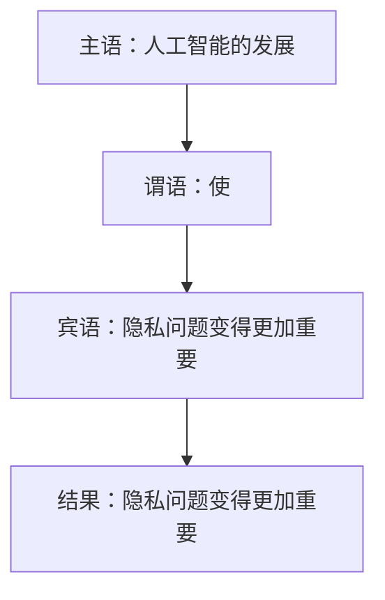
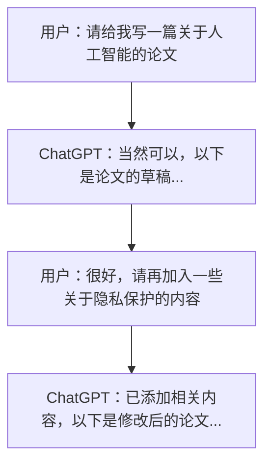

                 

### 引言

#### 1.1 书籍背景

ChatGPT是由OpenAI于2022年11月推出的一个基于大型语言模型的人工智能聊天机器人程序，它是基于GPT-3.5模型开发的。ChatGPT能够通过理解和生成自然语言来与用户进行交互，完成各种任务，如问答、对话生成、文本摘要等。

提示词（Prompt）在ChatGPT中扮演着至关重要的角色。它们是用户与ChatGPT进行交互的起点，通过提供明确的指示，帮助模型理解用户意图并生成相应的回复。提示词的设计和质量直接影响ChatGPT的性能和用户体验。

本书《ChatGPT提示词的语言哲学与伦理学思考》旨在探讨ChatGPT提示词背后的语言哲学和伦理学问题。随着人工智能技术的迅猛发展，语言模型在各个领域的应用越来越广泛，其背后的语言哲学和伦理学问题也逐渐受到关注。

语言哲学是研究语言的本质、功能及其与思维、认知之间的关系的一个学科。伦理学则是研究道德原则、价值观和行为的学科。本书将通过分析ChatGPT提示词在语言哲学和伦理学中的角色和影响，探讨人工智能语言模型在实际应用中面临的挑战和问题。

#### 1.2 书籍目的

本书的主要目的是：

1. **探索ChatGPT提示词的语言哲学问题**：分析提示词的语义、语用特性，探讨其在语言哲学中的地位和作用。通过深入理解提示词的哲学意义，为优化提示词设计提供理论支持。

2. **分析ChatGPT提示词的伦理学挑战**：讨论提示词在伦理学中的意义，如真实性问题、隐私保护问题、责任归属问题等。通过分析这些挑战，提出相应的伦理学解决方案，以促进人工智能技术的健康发展。

3. **寻求语言哲学与伦理学的结合点**：探讨如何将语言哲学和伦理学的方法应用于ChatGPT提示词的设计和评估，寻求两者之间的结合点，为人工智能领域的跨学科研究提供新的思路。

本书将通过理论与实践相结合的方式，系统地分析ChatGPT提示词的语言哲学与伦理学问题，旨在为人工智能领域的研究和实践提供有益的参考和指导。### 1.3 语言哲学与伦理学的基本概念

在探讨ChatGPT提示词的语言哲学与伦理学问题之前，有必要先了解语言哲学和伦理学的基本概念及其相互关系。

#### 语言哲学的基本概念

语言哲学是哲学的一个分支，主要关注语言的本质、功能及其与思维、认知之间的关系。其核心问题是：语言是如何表征世界的？语言与世界的关系是什么？以下是几个关键概念：

1. **语义**：语义是语言符号所代表的意义。语义分析关注的是如何理解和解释语言符号的意义。

2. **语用**：语用研究的是语言的使用，包括语言在社会交往中的作用和规则。语用分析关注的是语言在实际情境中的意义。

3. **意义**：意义是语言符号所传达的信息。意义可以是语义的，也可以是语用的。语义意义关注的是语言符号本身的意义，而语用意义关注的是语言符号在特定情境中的使用。

4. **认知功能**：认知功能指的是语言在人类认知过程中的作用，如信息传递、思维推理、记忆存储等。

5. **语言哲学流派**：语言哲学主要有几个主要流派，如逻辑原子主义、语义学相对主义、语言行为主义等。每个流派都有其独特的观点和理论框架。

#### 伦理学的基本概念

伦理学是研究道德原则、价值观和行为的学科。其核心问题是：什么是好的生活？什么是正确的行为？以下是几个关键概念：

1. **道德原则**：道德原则是指导人们行为的规范，如功利主义、义务论、德性伦理学等。

2. **价值观**：价值观是人们对事物的评价和偏好，如自由、公正、尊重等。

3. **道德判断**：道德判断是对行为的道德评价，如判断某个行为是对或错。

4. **伦理学流派**：伦理学主要有几个主要流派，如功利主义、义务论、德性伦理学、情感主义等。每个流派都有其独特的道德理论和方法。

#### 语言哲学与伦理学的相互关系

语言哲学和伦理学有着紧密的相互关系。一方面，语言哲学为伦理学提供了基础，如通过语义学和语用学分析，伦理学家可以更准确地理解道德原则和价值观的表达。另一方面，伦理学为语言哲学提供了实际应用场景，如探讨道德行为在语言交流中的作用和影响。

在ChatGPT提示词的背景下，语言哲学和伦理学的关系体现在以下几个方面：

1. **语义与道德判断**：提示词的语义分析可以帮助我们理解其在道德判断中的作用。例如，一个提示词可能隐含某种道德价值观，影响用户的道德判断。

2. **语用与道德行为**：提示词的语用特性决定了其在实际应用中的道德影响。例如，一个提示词可能诱导用户进行不道德的行为。

3. **语言哲学与伦理学结合**：通过将语言哲学和伦理学的方法应用于提示词的设计和评估，可以更全面地考虑其在道德和伦理方面的挑战。

总之，语言哲学和伦理学为理解ChatGPT提示词提供了重要的理论支持，为我们提供了分析其语言和道德特性的工具和方法。接下来，我们将进一步探讨ChatGPT提示词在语言哲学和伦理学中的具体角色和影响。### 1.4 提示词在人工智能中的角色

在人工智能领域，尤其是自然语言处理（NLP）领域，提示词（Prompt）扮演着至关重要的角色。提示词不仅是用户与人工智能模型（如ChatGPT）交互的桥梁，更是影响模型输出质量和用户满意度的重要因素。下面，我们将从几个方面详细探讨提示词在人工智能中的角色和作用。

#### 提示词的定义和作用

提示词是一种引导性输入，用于向人工智能模型提供任务目标和上下文信息。它可以帮助模型更好地理解用户意图，从而生成更准确、更相关、更有价值的输出。以下是提示词的主要作用：

1. **明确任务目标**：通过提示词，用户可以明确地告诉模型需要完成的任务。例如，在问答系统中，提示词可以是问题本身，帮助模型确定需要回答的内容。

2. **提供上下文信息**：提示词可以包含背景信息，帮助模型更好地理解对话的上下文。例如，在一个对话中，前面的对话内容可以作为后续对话的提示词，帮助模型理解对话的连贯性和逻辑关系。

3. **引导模型生成**：提示词可以引导模型生成特定的内容或形式。例如，提示词可以指定某种文体或格式，如新闻摘要、故事情节等。

4. **优化模型性能**：通过设计高质量的提示词，可以提升模型的性能和输出质量。高质量的提示词可以帮助模型更好地理解用户意图，减少误解和错误。

#### 提示词的类型和设计

提示词有多种类型，根据其用途和形式可以分为以下几种：

1. **问题性提示词**：这种提示词以问题的形式出现，常用于问答系统和聊天机器人。例如，“你对AI的未来有什么看法？”这种提示词可以引导模型生成相关的回答。

2. **指令性提示词**：这种提示词以指令的形式出现，指导模型完成特定的任务。例如，“请给我写一篇关于人工智能的简介。”这种提示词可以引导模型生成相关的内容。

3. **描述性提示词**：这种提示词以描述的形式出现，提供上下文信息，帮助模型理解对话的背景。例如，“你正在跟一个5岁的孩子对话，他问你‘狗有什么特点？’”这种提示词可以帮助模型理解对话的情境。

4. **引导性提示词**：这种提示词用于引导模型生成特定类型的内容，如故事、诗歌等。例如，“请以‘春天来了’为开头写一段诗。”这种提示词可以引导模型生成符合要求的诗歌。

设计高质量的提示词需要考虑以下几点：

1. **明确性**：提示词需要明确地表达用户意图，避免歧义和误解。

2. **完整性**：提示词需要提供足够的上下文信息，帮助模型理解任务背景。

3. **灵活性**：提示词应具有一定的灵活性，以便模型可以根据不同情境进行调整。

4. **多样性**：设计多种类型的提示词，以满足不同任务和情境的需求。

#### 提示词在ChatGPT中的应用

ChatGPT作为一个基于大型语言模型的人工智能聊天机器人，提示词在其中起到了至关重要的作用。以下是ChatGPT中提示词的几个关键应用场景：

1. **用户交互**：ChatGPT通过提示词与用户进行交互，理解用户的问题和需求。例如，用户输入一个问题，ChatGPT会生成相应的回答。

2. **生成式任务**：ChatGPT可以通过提示词生成各种文本内容，如文章、故事、对话等。例如，用户可以要求ChatGPT写一篇关于人工智能的论文。

3. **对话连贯性**：在连续对话中，ChatGPT会利用前面的对话内容作为提示词，保持对话的连贯性和一致性。

4. **个性化服务**：ChatGPT可以根据用户的偏好和需求，生成个性化的内容，如聊天机器人可以根据用户的兴趣推荐相关的新闻或话题。

总之，提示词在人工智能领域，特别是在ChatGPT这样的人工智能聊天机器人中，起到了至关重要的作用。通过合理设计和使用提示词，可以提升模型的性能和用户体验，为人工智能的应用提供更广阔的前景。### 1.5 书籍结构概述

本书《ChatGPT提示词的语言哲学与伦理学思考》分为五个主要部分，旨在系统地探讨ChatGPT提示词在语言哲学与伦理学中的角色和影响。以下是每个部分的详细内容概述：

#### 第一部分：引言

本部分将介绍书籍的背景和目的，探讨ChatGPT与提示词的重要性，以及语言哲学与伦理学在人工智能领域的应用。通过这一部分的阅读，读者可以了解书籍的整体结构和研究主题。

#### 第二部分：语言哲学

这一部分将深入探讨ChatGPT提示词的语言哲学问题。首先，我们将介绍语言哲学的基础概念，如语义、语用、认知功能等。然后，我们将分析ChatGPT提示词的语义与语用特性，讨论其在语言哲学中的地位和作用。最后，我们将探讨ChatGPT提示词的特殊性质，以及其在语言哲学中的挑战。

#### 第三部分：伦理学

这一部分将重点分析ChatGPT提示词的伦理学挑战。我们将首先介绍伦理学的基本概念，如道德原则、价值观、道德判断等。然后，我们将讨论ChatGPT提示词在伦理学中的意义，如真实性问题、隐私保护、责任归属等。最后，我们将探讨ChatGPT提示词的伦理困境和伦理解决方案。

#### 第四部分：综合讨论

这一部分将综合讨论ChatGPT提示词在语言哲学与伦理学中的融合。我们将探讨提示词的双重角色，以及如何在实践中应用语言哲学和伦理学的方法。此外，我们还将讨论提示词在人工智能领域的未来发展趋势和挑战。

#### 第五部分：结论

这一部分将总结本书的主要发现，讨论提示词在人工智能中的角色和社会意义，并对未来的发展趋势进行展望。通过这一部分的阅读，读者可以全面了解ChatGPT提示词的语言哲学与伦理学问题，以及其未来发展的方向。

通过以上五个部分的详细探讨，本书旨在为读者提供一个全面、深入的理解ChatGPT提示词的语言哲学与伦理学问题，为人工智能领域的研究和实践提供有益的参考和指导。### 第二部分：语言哲学

## 2.1 语言哲学基础

### 2.1.1 语言的本质与功能

语言是人类最重要的交流工具，它不仅仅是一种表达思想的手段，更是人类思维、认知和文化传承的核心。探讨语言哲学首先要了解语言的本质和功能。

1. **语言的本质**：语言的本质是一个复杂且多维的议题。从哲学角度来看，语言的本质主要涉及以下几个方面：

   - **表征性**：语言通过符号（如单词、句子）来表征现实世界中的事物和概念。这种表征不仅限于表面形式，还包括深层的意义和逻辑关系。
   
   - **社会性**：语言是社会互动的产物，是人类社会共同约定的符号系统。它依赖于社会成员的共同使用和理解。
   
   - **创造性**：语言具有创造性，可以生成新的概念、意义和思想。这是语言区别于其他符号系统（如数学符号、音乐符号）的重要特征。

2. **语言的功能**：语言的功能是指它在人类生活中的作用。从哲学和认知科学的角度，语言的主要功能包括：

   - **交流功能**：语言是人们交流思想、信息、情感的主要工具。它使得人们能够跨越时间和空间的限制进行沟通。
   
   - **认知功能**：语言是认知过程的重要组成部分，它帮助人们组织和理解世界。通过语言，人们可以进行抽象思考、推理和概念形成。
   
   - **文化传承**：语言是文化传承的重要载体，它承载了历史、传统、价值观和信仰等文化内容。

### 2.1.2 语言符号与意义

语言符号与意义是语言哲学中的核心概念。符号是语言的基本单位，它通过特定的形式（如声音、文字）来表达意义。

1. **语言符号**：语言符号通常由两个部分组成：形式和意义。

   - **形式**：形式是语言符号的物质表现形式，如单词的拼写、句子的结构等。
   
   - **意义**：意义是语言符号所表征的事物、概念或思想。意义不是符号本身固有的，而是通过社会共识和语境赋予的。

2. **意义的分类**：语言意义可以分为以下几种：

   - **语义意义**：语义意义是语言符号所固有的、直接表达的意义。例如，“狗”这个单词的语义意义是指一种动物。
   
   - **语用意义**：语用意义是语言符号在特定语境中产生的意义。例如，在不同的语境中，“狗”这个单词可能具有不同的语用意义，如在特定对话中指宠物狗或工作犬。
   
   - **言外之意**：言外之意是指语言符号在特定情境中所传达的隐含意义。例如，在社交场合中，人们可能使用一些礼貌用语来表达自己的意图，这些礼貌用语就具有言外之意。

### 2.1.3 语言哲学的核心问题

语言哲学的核心问题主要包括以下几个方面：

1. **意义问题**：意义问题是语言哲学中最基本的问题之一。它涉及如何确定语言符号的意义，以及意义是如何产生的和如何被理解的。

2. **真理问题**：真理问题探讨语言与事实之间的关系。即，语言表达的是否是真实情况，以及如何判断语言表达的是否为真。

3. **语言与思维的关系**：这个问题探讨语言如何影响人类思维，以及思维如何影响语言的使用。

4. **语言学习与习得**：这个问题关注儿童如何习得语言，以及语言习得背后的认知机制。

5. **语言与认知的关系**：这个问题探讨语言在认知过程中的作用，以及认知如何影响语言的使用。

通过以上对语言哲学基础概念的探讨，我们可以更好地理解ChatGPT提示词在语言哲学中的角色和影响。接下来，我们将进一步分析ChatGPT提示词的语义与语用特性，以及其在语言哲学中的具体应用。### 2.2 ChatGPT提示词的语言哲学分析

ChatGPT提示词作为一种特殊的语言输入，其语言哲学分析对于理解其在实际应用中的角色和影响具有重要意义。本节将深入探讨ChatGPT提示词的语义与语用特性，并分析其在语言哲学中的特殊性质。

#### 2.2.1 提示词的语义分析

语义分析是理解语言符号意义的过程。在ChatGPT提示词的语义分析中，我们需要关注以下几个方面：

1. **语义角色**：ChatGPT提示词可以包含不同的语义角色，如主语、谓语、宾语等。这些角色在提示词中扮演不同的角色，影响模型对提示的理解。例如，在提示词“请给我写一篇关于人工智能的论文”中，“给我”是一个动作，“写一篇关于人工智能的论文”是一个目标。

2. **语义内容**：提示词的语义内容是其传达的具体信息。ChatGPT通过理解提示词的语义内容来生成相应的输出。例如，在提示词“解释量子计算的基本原理”中，“解释”和“量子计算的基本原理”是重要的语义内容。

3. **语义关系**：提示词中的各个部分之间存在语义关系，如因果关系、时间关系、空间关系等。这些关系帮助ChatGPT更好地理解提示词的语义结构和意图。例如，在提示词“因为人工智能的发展，隐私问题变得更加重要”中，“因为”表达了因果关系。

为了更直观地理解ChatGPT提示词的语义分析，我们可以借助Mermaid流程图来展示提示词的语义结构。以下是一个示例：

在这个例子中，主语“人工智能的发展”通过谓语“使”与宾语“隐私问题变得更加重要”建立了因果关系。

#### 2.2.2 提示词的语用分析

语用分析是理解语言符号在特定语境中的使用和意义的过程。在ChatGPT提示词的语用分析中，我们需要关注以下几个方面：

1. **语用功能**：ChatGPT提示词可以具有不同的语用功能，如指示、命令、请求、建议等。这些功能决定了模型生成输出的类型和形式。例如，在提示词“请给我写一篇关于人工智能的论文”中，提示词具有请求的语用功能。

2. **语境依赖性**：提示词的意义和功能在很大程度上取决于上下文语境。同一提示词在不同的语境中可能具有不同的意义和作用。例如，在提示词“解释量子计算的基本原理”中，如果前文已经讨论了量子计算，那么“解释”可能是一个简单的要求；但如果前文没有相关内容，那么“解释”可能意味着提供一个更详细、更深入的解释。

3. **语用效果**：提示词的语用效果是指其使用对对话或任务结果产生的影响。例如，在提示词“请给我写一篇关于人工智能的论文”中，如果模型能够正确理解并完成请求，那么语用效果是积极的；如果模型误解了请求或无法完成请求，那么语用效果可能是消极的。

为了更好地展示ChatGPT提示词的语用特性，我们可以通过一个Mermaid流程图来表示一个典型的对话场景：

在这个对话场景中，用户通过请求性提示词“请给我写一篇关于人工智能的论文”与ChatGPT进行交互，ChatGPT则根据提示生成相应的论文草稿。随后，用户通过补充性提示词“请给我写一篇关于人工智能的论文”与ChatGPT进行进一步的互动，以获取更完整的输出。

#### 2.2.3 ChatGPT提示词的特殊性质

ChatGPT提示词具有一些特殊性质，使其在语言哲学中具有独特的地位和作用：

1. **生成性**：ChatGPT提示词不仅用于引导模型生成输出，还可以激发模型的创造性。高质量的提示词可以引导模型生成新颖、有价值的输出。

2. **适应性**：ChatGPT提示词可以根据不同的任务和语境进行调整。这种适应性使得ChatGPT能够灵活地处理各种复杂的语言任务。

3. **智能性**：ChatGPT提示词具有智能性，可以识别和理解复杂的语义和语用关系。这种智能性使得ChatGPT能够在对话和任务中表现出较高的灵活性和准确性。

4. **交互性**：ChatGPT提示词具有交互性，可以与用户进行双向交流，获取用户的反馈并进行相应的调整。这种交互性有助于提高用户的满意度和模型的性能。

通过上述分析，我们可以看出ChatGPT提示词在语言哲学中具有独特的地位和作用。它们不仅具有语义和语用特性，还具有生成性、适应性、智能性和交互性等特殊性质。这些特性使得ChatGPT提示词在人工智能语言模型中具有重要价值，为我们提供了一种新的理解和应用语言的方法。接下来，我们将进一步探讨ChatGPT提示词在语言哲学中的挑战，以及如何应对这些挑战。### 2.3 ChatGPT提示词的特殊性质

ChatGPT提示词作为一种先进的人工智能语言输入，具有许多独特的性质，使其在语言哲学中具有特殊的重要性。以下是ChatGPT提示词的几个关键特殊性质：

#### 2.3.1 ChatGPT的生成机制

ChatGPT是基于大型语言模型（如GPT-3.5）开发的人工智能系统，其核心是通过训练生成语言模型来理解用户输入并生成相应的回复。以下是ChatGPT生成机制的关键特点：

1. **深度学习**：ChatGPT使用深度学习技术，特别是基于变换器（Transformer）的模型结构，来学习语言模式、语义和语用规则。这种深度学习机制使得ChatGPT能够生成高质量、连贯的语言输出。

2. **上下文理解**：ChatGPT能够理解上下文信息，这意味着它可以基于之前的对话内容来生成相关、连贯的回复。这种上下文理解能力使得ChatGPT能够更好地应对复杂的对话场景。

3. **自适应生成**：ChatGPT在生成回复时具有高度的自适应性，可以根据用户的输入和反馈进行动态调整。这种自适应生成能力使得ChatGPT能够在不同场景下生成合适的语言输出。

#### 2.3.2 ChatGPT提示词的生成逻辑

ChatGPT提示词的生成逻辑是指如何从用户输入生成高质量的提示词。以下是ChatGPT提示词生成逻辑的几个关键点：

1. **意图识别**：ChatGPT首先识别用户的输入意图，即用户想要完成什么任务或获取什么信息。这种意图识别有助于ChatGPT生成具有明确目标的提示词。

2. **信息抽取**：在识别用户意图后，ChatGPT会从用户输入中抽取关键信息，如主题、关键词、上下文等。这些关键信息用于生成相关的提示词。

3. **语言生成**：基于识别的意图和抽取的信息，ChatGPT使用预训练的语言模型生成相应的提示词。这个过程涉及到复杂的语义和语用分析，以确保生成的提示词既准确又具有吸引力。

#### 2.3.3 ChatGPT提示词的语言哲学挑战

ChatGPT提示词的特殊性质也带来了一系列语言哲学挑战，包括以下几个方面：

1. **意义模糊性**：由于ChatGPT生成的提示词具有高度适应性，可能导致提示词的意义模糊性。这种模糊性可能会影响用户对提示词的理解和接受度。

2. **语义歧义**：ChatGPT在生成提示词时可能会遇到语义歧义问题，即同一提示词在不同上下文中可能具有不同的意义。这种歧义可能会影响ChatGPT提示词的有效性和可靠性。

3. **伦理责任**：ChatGPT提示词的生成过程涉及到大量的数据和信息，可能涉及到伦理责任问题。例如，提示词的设计和选择可能影响用户隐私、偏见和道德判断。

为了应对这些挑战，我们需要在ChatGPT提示词的设计和生成过程中采用一系列策略和原则。以下是一些可能的解决方案：

1. **明确意图**：在生成提示词之前，明确用户意图，以确保提示词具有明确的目标和意义。

2. **语义清晰**：在设计提示词时，确保语义清晰，避免歧义和模糊性。可以通过提供上下文信息和明确的指令来提高提示词的语义清晰度。

3. **伦理审查**：对ChatGPT提示词进行伦理审查，确保其不会侵犯用户隐私、导致偏见或影响道德判断。可以通过制定伦理准则和进行伦理测试来实现这一目标。

4. **用户反馈**：通过收集用户反馈，不断优化和改进ChatGPT提示词的设计和生成过程。用户反馈可以帮助我们更好地理解用户需求，从而生成更符合用户期望的提示词。

总之，ChatGPT提示词的特殊性质使其在语言哲学中具有特殊的重要性。通过深入分析和理解这些性质，我们可以更好地应对语言哲学挑战，为ChatGPT提示词的设计和生成提供有益的指导。接下来，我们将进一步探讨ChatGPT提示词在伦理学中的角色和影响。### 2.4 提示词的伦理学反思

在深入探讨ChatGPT提示词的语言哲学性质之后，我们接下来将转向其伦理学反思。提示词在伦理学中扮演着重要角色，因为它们不仅影响人工智能系统的行为，还可能对用户的隐私、公正性和道德判断产生深远影响。

#### 2.4.1 伦理学的基本原则

伦理学是关于道德原则、价值观和行为的研究。以下是一些基本的伦理学原则，它们对于评估ChatGPT提示词的影响至关重要：

1. **公正性**：公正性原则要求我们对待所有人公平，不偏袒某些群体。在ChatGPT提示词的背景下，这意味着我们需要确保模型不产生偏见，对所有用户平等对待。

2. **隐私保护**：隐私保护原则强调保护个人隐私，不泄露用户的敏感信息。ChatGPT提示词的设计和生成过程必须考虑到用户隐私的保护。

3. **责任归属**：责任归属原则涉及到确定谁应该对某个行为或结果负责。在人工智能领域，这通常意味着要明确算法设计者、运营者以及用户各自的责任。

4. **透明性**：透明性原则要求系统的运作方式和对用户的影响应该是清晰可见的。对于ChatGPT提示词，透明性意味着用户应该了解模型是如何生成回复的，以及其背后的决策逻辑。

#### 2.4.2 提示词的道德考量

ChatGPT提示词的道德考量主要集中在以下几个方面：

1. **偏见**：提示词可能会引入偏见，导致模型产生不公平的输出。例如，如果提示词包含性别、种族或文化偏见，模型可能会生成带有偏见的回复。为了防止这种情况，提示词设计者需要仔细审查和筛选输入文本，确保其不包含潜在的偏见。

2. **隐私**：提示词可能会无意中暴露用户的私人信息。例如，如果用户在提示词中提到自己的名字、地址或其他敏感信息，这些信息可能会被模型存储或泄露。为了保护用户隐私，提示词设计者需要采取措施，如数据加密和匿名化处理。

3. **真实性**：提示词的真实性是另一个重要考量。如果提示词包含虚假信息，模型可能会生成不准确的回复，误导用户。为了确保真实性，提示词设计者需要验证信息的来源，并避免传播未经证实的消息。

4. **责任**：当ChatGPT生成的问题或回复引起争议时，责任归属成为一个关键问题。例如，如果模型生成了一个具有攻击性的回复，责任可能在于提示词设计者、模型训练者或用户。明确责任归属可以帮助避免法律和道德纠纷。

#### 2.4.3 提示词的伦理风险与责任

ChatGPT提示词的伦理风险和责任主要体现在以下几个方面：

1. **模型训练数据的风险**：提示词的伦理风险首先源于模型训练数据的选择。如果训练数据包含偏见或不道德的内容，模型可能会继承这些问题。为了降低这种风险，提示词设计者需要使用多样化的、无偏见的数据集。

2. **提示词内容的伦理审查**：提示词内容的伦理审查是另一个关键环节。设计者需要定期审查提示词，确保其符合伦理标准，不包含任何不恰当的内容。

3. **用户反馈的收集与处理**：用户反馈是识别和解决伦理问题的有效途径。设计者需要建立机制，收集用户对提示词和模型输出的反馈，并据此进行调整。

4. **责任分配与法律遵守**：明确责任归属和遵守相关法律法规是确保ChatGPT提示词伦理安全的必要条件。设计者和运营者需要了解并遵守数据保护法、隐私法等相关法律，以防止潜在的伦理和法律风险。

总之，ChatGPT提示词的伦理学反思是确保人工智能系统道德和合法运行的重要环节。通过深入理解伦理学基本原则，认真考量道德问题，并采取适当的措施降低伦理风险，我们可以为ChatGPT提示词的设计和生成提供更加安全和可靠的伦理保障。接下来，我们将进一步探讨ChatGPT提示词在伦理学中的具体问题和解决方案。### 3.1 伦理学基础

#### 3.1.1 伦理学的基本概念

伦理学是研究道德原则、价值观和行为规范的学科，旨在探讨人类应当如何生活以及如何判断行为的对错。以下是伦理学中一些基本的概念：

1. **道德原则**：道德原则是指导人们行为的规范，用于判断行为的是非、善恶。常见的道德原则包括功利主义、义务论和德性伦理学。

   - **功利主义**：功利主义认为，一个行为如果能够最大化地增加总幸福，就是道德的。代表人物有边沁和密尔。
   
   - **义务论**：义务论认为，行为是否道德取决于其是否遵守道德规则和义务。代表人物有康德和德西特。
   
   - **德性伦理学**：德性伦理学关注个人的道德品质和性格，强调个人应当培养良好的品德，如诚实、公正、勇敢等。代表人物有亚里士多德和伊壁鸠鲁。

2. **价值观**：价值观是人们对事物的评价和偏好，是道德判断的基础。常见的价值观包括自由、公正、尊重、幸福、责任等。

3. **道德判断**：道德判断是对行为的道德评价，通常基于道德原则和价值观。例如，一个行为可能被认为是不道德的，因为它违反了公共利益或个人隐私。

#### 3.1.2 伦理学的分类与流派

伦理学有多种分类和流派，每种流派都有其独特的理论和方法。以下是几种主要的伦理学流派：

1. **功利主义**：功利主义认为，一个行为如果能够最大化地增加总幸福，就是道德的。这种伦理学方法强调结果导向，主张以行为带来的幸福总量作为道德评价的标准。

2. **义务论**：义务论认为，行为的道德性取决于其是否符合道德规则和义务。这种伦理学方法强调规则和责任，主张人们应当遵守道德规则，不论结果如何。

3. **德性伦理学**：德性伦理学关注个人的道德品质和性格，强调个人应当培养良好的品德。这种伦理学方法主张通过培养良好的品德来达到道德生活的目标。

4. **情感主义**：情感主义认为，道德情感是道德判断的基础，道德行为是出于内心的道德情感驱动。这种伦理学方法强调情感在道德判断中的作用。

5. **社会契约论**：社会契约论认为，道德是人们通过社会契约达成的共识，是维持社会秩序和合作的基础。这种伦理学方法强调道德的社会性和契约性。

#### 3.1.3 伦理学的应用领域

伦理学在多个领域有广泛的应用，以下是一些主要的应用领域：

1. **医学伦理**：医学伦理研究医学实践中的道德问题，如患者权利、医生责任、医疗资源分配等。

2. **环境伦理**：环境伦理研究环境问题中的道德责任，如环境保护、可持续发展、动物权利等。

3. **商业伦理**：商业伦理研究企业在经营活动中应遵守的道德规范，如诚信、公平竞争、社会责任等。

4. **科技伦理**：科技伦理研究科技进步带来的道德挑战，如人工智能、基因编辑、网络安全等。

5. **教育伦理**：教育伦理研究教育过程中的道德问题，如师生关系、学术诚信、教育公平等。

通过以上对伦理学基本概念、分类与流派以及应用领域的介绍，我们可以更好地理解ChatGPT提示词在伦理学中的角色和影响。接下来，我们将深入探讨ChatGPT提示词在伦理学中的具体问题和挑战。### 3.2 提示词的伦理学问题

ChatGPT提示词作为一种人工智能语言模型的输入，其伦理学问题不可忽视。在分析这些伦理学问题时，我们需要关注几个关键领域，包括提示词的真实性问题、隐私保护问题以及提示词的使用与责任。

#### 3.2.1 提示词的真实性问题

提示词的真实性是确保人工智能系统输出可信内容的基础。然而，在ChatGPT的使用过程中，提示词的真实性问题可能会引发一系列伦理挑战。

1. **虚假信息传播**：ChatGPT生成的回复可能包含虚假信息。如果用户无法辨别真伪，这些虚假信息可能会误导用户，甚至对社会产生负面影响。为了防止虚假信息的传播，提示词设计者需要确保信息的来源可靠，并进行真实性验证。

2. **误导性提示词**：有些提示词可能故意设计成具有误导性，以操纵用户的思维和行为。这种误导性提示词可能会导致用户做出不理性的决策，甚至造成损失。为了减少误导性提示词的影响，提示词设计者需要建立严格的审查机制，确保提示词的准确性和客观性。

3. **伦理审查**：为了确保ChatGPT提示词的真实性，需要对其进行伦理审查。这包括对提示词的内容进行审查，确保其不包含虚假信息、误导性陈述或有害内容。此外，还需要对提示词的生成过程进行监督，确保其符合伦理标准。

#### 3.2.2 提示词的隐私保护问题

隐私保护是另一个重要的伦理学问题，尤其是在ChatGPT等人工智能系统中，用户的隐私可能会受到侵犯。

1. **用户数据的收集与使用**：ChatGPT在生成回复时，需要处理大量的用户数据，如输入文本、对话历史等。这些数据可能包含用户的敏感信息，如个人身份、健康状况、财务状况等。为了保护用户隐私，提示词设计者需要确保数据的收集和使用符合隐私保护法规，如GDPR（通用数据保护条例）。

2. **数据匿名化**：为了进一步保护用户隐私，提示词设计者可以对用户数据进行匿名化处理。这种处理方法可以隐藏用户的身份信息，减少隐私泄露的风险。

3. **用户同意与透明度**：在收集和使用用户数据时，需要获得用户的明确同意，并确保用户了解其数据的用途。此外，系统应提供透明的数据使用政策，让用户了解其数据是如何被收集、存储和使用的。

#### 3.2.3 提示词的使用与责任

提示词的使用和责任是ChatGPT伦理学问题的核心，涉及到提示词设计者、模型训练者以及最终用户。

1. **提示词设计者的责任**：提示词设计者有责任确保提示词的质量和准确性，避免误导用户。此外，设计者还需要确保提示词不会侵犯用户的隐私，并遵守相关的伦理和法律标准。

2. **模型训练者的责任**：模型训练者有责任确保训练数据的多样性和公正性，避免模型产生偏见。训练者还需要定期对模型进行评估和更新，以保持其性能和道德性。

3. **用户的责任**：用户在使用ChatGPT时，有责任确保其输入的内容符合伦理和法律标准。用户应避免使用不当的提示词，如涉及暴力、歧视或违法内容的提示词。

4. **监管和合规**：为了确保ChatGPT提示词的使用符合伦理和法律要求，需要建立监管和合规机制。这包括对提示词设计者、模型训练者和用户的监管，确保其遵守伦理标准和法律法规。

总之，ChatGPT提示词的伦理学问题是一个复杂而多维的议题。通过深入探讨提示词的真实性问题、隐私保护问题以及使用与责任，我们可以更好地理解ChatGPT提示词在伦理学中的挑战，并寻求有效的解决方案。接下来，我们将进一步探讨ChatGPT提示词在伦理学中的具体困境和解决方案。### 3.3 ChatGPT提示词的伦理困境

随着ChatGPT提示词的广泛应用，其在伦理学中面临的困境也逐渐显现。这些困境涉及到社会影响、伦理争议以及可能的解决方案。以下是ChatGPT提示词在伦理学中的一些主要困境。

#### 3.3.1 ChatGPT提示词的社会影响

1. **偏见和歧视**：ChatGPT提示词可能会引入偏见和歧视。例如，如果提示词中包含了性别、种族、宗教或其他形式的歧视性内容，ChatGPT生成的回复也可能表现出相应的偏见。这种偏见可能会导致不公平的社会影响，加剧社会不平等。

2. **隐私侵犯**：ChatGPT提示词在处理用户输入时，可能会无意中收集和存储用户的敏感信息。这些信息可能包括个人身份、健康状况、财务状况等，如果未经用户同意或未进行适当保护，可能会侵犯用户的隐私权。

3. **虚假信息的传播**：ChatGPT提示词可能生成包含虚假信息或误导性内容的回复。如果用户无法辨别真伪，这些信息可能会误导用户，甚至对社会造成负面影响。

4. **道德责任模糊**：在ChatGPT提示词的生成和使用过程中，责任归属可能不明确。例如，当ChatGPT生成一个具有攻击性的回复时，责任可能在于提示词设计者、模型训练者或用户。这种责任模糊可能导致道德和法律纠纷。

#### 3.3.2 ChatGPT提示词的伦理争议

1. **隐私保护与数据利用的平衡**：在收集和使用用户数据时，需要在隐私保护与数据利用之间找到平衡。一方面，用户隐私需要得到保护，防止数据泄露和滥用；另一方面，数据对于人工智能系统的训练和优化至关重要。如何在保护隐私的同时充分利用数据，是ChatGPT提示词面临的一个伦理争议。

2. **人工智能的透明性与可控性**：ChatGPT提示词的生成过程高度复杂，用户可能无法完全理解模型的决策逻辑。这引发了关于人工智能透明性和可控性的争议。如果用户无法了解和监督模型的运作，可能会对人工智能系统的信任产生质疑。

3. **道德责任的归属**：在ChatGPT提示词的背景下，确定责任归属是一个复杂的问题。例如，当ChatGPT生成一个具有偏见或误导性的回复时，责任可能在于提示词设计者、模型训练者或用户。确定责任归属有助于防止道德和法律纠纷，但也可能面临道德和技术的挑战。

4. **自主性与道德原则的冲突**：ChatGPT提示词的生成过程涉及到自主性和道德原则的冲突。例如，模型可能根据用户输入生成具有攻击性的回复，这与道德原则相冲突。如何在保证用户自主性的同时，确保道德原则得到遵守，是ChatGPT提示词面临的一个伦理争议。

#### 3.3.3 ChatGPT提示词的伦理解决方案

为了应对ChatGPT提示词在伦理学中面临的困境，以下是一些可能的解决方案：

1. **加强伦理审查**：对ChatGPT提示词进行严格的伦理审查，确保其不包含偏见、歧视或误导性内容。这包括对提示词的内容、来源和使用进行评估，确保其符合伦理标准。

2. **隐私保护机制**：建立完善的隐私保护机制，保护用户的敏感信息。这包括对用户数据进行加密、匿名化和访问控制，确保用户隐私得到有效保护。

3. **透明性和可控性**：提高ChatGPT提示词的透明性和可控性，让用户了解模型的决策逻辑和使用方式。这可以通过提供详细的用户指南、透明度报告和用户反馈机制来实现。

4. **责任归属机制**：明确ChatGPT提示词的责任归属，确保各方在伦理和法律上承担相应的责任。这可以通过制定明确的法律法规、道德准则和责任分配协议来实现。

5. **社会监督与参与**：鼓励社会对ChatGPT提示词的使用进行监督和参与，确保其在实际应用中符合伦理要求。这可以通过公众咨询、伦理委员会和公众监督机制来实现。

通过上述解决方案，我们可以为ChatGPT提示词在伦理学中的困境提供有效的应对策略，确保其在实际应用中能够遵循道德原则，维护用户的权益和社会的稳定。### 3.4 提示词的伦理学实践

在ChatGPT提示词的伦理学实践中，关键在于如何确保其设计、使用和管理过程中遵循道德准则和法律法规。以下是一些具体的伦理学实践措施：

#### 3.4.1 提示词的伦理审查

伦理审查是确保ChatGPT提示词不包含伦理问题的重要环节。以下是一些具体的审查措施：

1. **内容审查**：对提示词的内容进行审查，确保其不包含歧视、偏见、仇恨言论或误导性信息。审查可以包括自动化的内容过滤和人工审查相结合。

2. **隐私审查**：审查提示词是否可能泄露用户的敏感信息，如个人身份、健康信息等。确保提示词设计者遵守隐私保护法规，如GDPR。

3. **公正性审查**：审查提示词是否可能导致不公平的结果，如性别、种族、文化偏见等。确保提示词设计过程中考虑到了多样性和包容性。

4. **真实性和准确性**：审查提示词提供的信息是否真实、准确。确保在生成提示词时，信息来源可靠，并进行事实核查。

#### 3.4.2 提示词的伦理教育与培训

为了确保ChatGPT提示词设计者和管理者具备必要的伦理知识，需要提供系统的伦理教育和培训。以下是一些具体的培训措施：

1. **伦理学基础课程**：为提示词设计者和管理者提供伦理学基础课程，介绍伦理学的基本原则、概念和应用。

2. **案例研究**：通过分析实际案例，让参与者了解ChatGPT提示词可能面临的伦理困境和挑战。

3. **道德决策训练**：通过模拟练习和案例讨论，培养参与者识别和解决伦理问题的能力。

4. **跨学科合作**：鼓励跨学科合作，如伦理学、心理学、社会学等，以全面解决ChatGPT提示词的伦理问题。

#### 3.4.3 提示词的伦理监控与反馈机制

建立有效的伦理监控与反馈机制，有助于及时发现和纠正ChatGPT提示词的伦理问题。以下是一些具体的监控与反馈措施：

1. **实时监控**：通过技术手段，实时监控ChatGPT提示词的生成和使用过程，确保其符合伦理标准。

2. **用户反馈**：建立用户反馈机制，鼓励用户报告发现的伦理问题。对用户的反馈进行认真分析和处理，及时纠正问题。

3. **定期审计**：定期对ChatGPT提示词的设计、使用和管理过程进行审计，确保其符合伦理要求。审计可以包括内部审计和外部审计。

4. **伦理委员会**：设立独立的伦理委员会，负责审查和监督ChatGPT提示词的伦理问题。伦理委员会可以提供专业的伦理建议，并确保问题的及时解决。

5. **透明度和问责制**：提高ChatGPT提示词的透明度，让用户了解其伦理审查和监控过程。建立问责制，确保各方在伦理问题上的责任得到明确。

通过上述伦理学实践措施，我们可以为ChatGPT提示词的伦理学问题提供有效的解决方案，确保其在设计、使用和管理过程中遵循道德准则和法律法规。这不仅有助于维护用户的权益和社会的稳定，也为人工智能技术的可持续发展提供了保障。### 4.1 语言哲学与伦理学的融合

在探讨了ChatGPT提示词在语言哲学和伦理学中的角色和影响后，我们将进一步讨论如何将语言哲学与伦理学的方法应用于提示词的设计和评估，以及这一融合的意义和挑战。

#### 4.1.1 提示词的双重角色

ChatGPT提示词在语言哲学和伦理学中扮演着双重角色。一方面，作为语言符号，它们具有语义和语用特性，影响用户理解模型输出；另一方面，作为伦理学对象，它们涉及道德判断和行为规范。因此，将语言哲学与伦理学的结合点视为提示词的核心特性，有助于更全面地理解和评估提示词的影响。

#### 4.1.2 提示词的跨学科研究

语言哲学与伦理学的融合为提示词的跨学科研究提供了新的视角。通过跨学科的研究方法，我们可以从多个角度审视提示词的设计和使用：

1. **语义分析与伦理审查**：通过语义分析，理解提示词的潜在意义和语境，从而进行伦理审查。例如，识别并消除提示词中的偏见和歧视性内容。

2. **语用分析与道德考量**：通过语用分析，评估提示词在实际应用中的道德影响。例如，分析提示词如何引导用户行为，以及这种行为是否符合道德原则。

3. **认知科学与伦理教育**：结合认知科学，研究人类如何理解和应用提示词，进而进行伦理教育。例如，通过认知心理学方法，设计更具道德敏感性的提示词，提高用户对伦理问题的认识。

4. **社会科学与伦理实践**：结合社会科学方法，研究社会对ChatGPT提示词的接受度和影响。例如，通过社会调查和案例分析，评估提示词在社会中的应用效果和伦理风险。

#### 4.1.3 提示词的未来发展

将语言哲学与伦理学的方法应用于提示词的设计和评估，有助于推动ChatGPT提示词的未来发展：

1. **提升伦理意识**：通过伦理学的方法，提高提示词设计者和使用者对伦理问题的认识，从而设计出更具道德敏感性的提示词。

2. **优化用户体验**：通过语言哲学的方法，理解提示词对用户理解和体验的影响，从而优化提示词的设计，提高用户满意度。

3. **促进跨学科合作**：语言哲学与伦理学的融合，为跨学科合作提供了平台，有助于将不同领域的知识和方法应用于提示词研究和实践。

4. **应对未来挑战**：随着人工智能技术的发展，ChatGPT提示词将面临更多伦理挑战。通过跨学科研究，我们可以提前识别和应对这些挑战，确保人工智能技术的可持续发展。

总之，语言哲学与伦理学的融合为ChatGPT提示词的设计和评估提供了新的方法和视角。通过跨学科研究，我们可以更全面地理解提示词的语义、语用和伦理特性，为人工智能技术的健康和可持续发展做出贡献。接下来，我们将进一步讨论提示词在实践中的应用，以及其在未来面临的挑战。### 4.2 提示词在实践中的应用

#### 4.2.1 提示词在教育中的运用

ChatGPT提示词在教育领域的应用潜力巨大。以下是一些具体的应用场景：

1. **个性化学习**：ChatGPT可以根据学生的提问和需求，生成个性化的学习材料。例如，学生可以输入某个特定知识点，ChatGPT会生成相关概念解释、例题和习题，帮助学生深入理解。

2. **写作辅助**：ChatGPT可以帮助学生进行写作练习。学生可以输入一个主题或要求，ChatGPT会生成文章大纲、段落内容或完整文章。这种写作辅助不仅提高了学生的写作能力，还节省了教师批改作业的时间。

3. **课堂互动**：教师可以使用ChatGPT进行课堂互动，如提问、答疑、讨论等。ChatGPT可以根据学生的回答生成相应的反馈，帮助学生巩固知识。

4. **课程设计**：ChatGPT可以协助教师设计课程内容和教学策略。教师可以输入课程目标和学习要求，ChatGPT会生成教学计划、教学资源和活动建议。

#### 4.2.2 提示词在商业决策中的角色

ChatGPT提示词在商业决策中也具有重要应用价值。以下是一些具体的应用场景：

1. **市场分析**：ChatGPT可以根据企业的需求，分析市场趋势、竞争对手、消费者偏好等信息。企业可以通过这些分析结果来制定市场策略。

2. **战略规划**：ChatGPT可以帮助企业制定长期战略规划。企业可以输入战略目标，ChatGPT会生成具体的实施步骤和关键指标。

3. **客户服务**：ChatGPT可以作为企业的客户服务助手，回答客户问题、提供产品咨询和售后支持。通过智能客服，企业可以提升客户满意度，减少人工客服的工作量。

4. **商业写作**：ChatGPT可以帮助企业撰写商业报告、市场分析报告和营销文案。这些文档可以根据企业需求快速生成，节省时间和人力资源。

#### 4.2.3 提示词在社会治理中的影响

ChatGPT提示词在社会治理中也有广泛的应用。以下是一些具体的应用场景：

1. **公共信息传播**：政府可以使用ChatGPT生成公共信息，如政策解读、公告通知、健康教育等。通过智能化的信息传播，政府可以更高效地传达信息，提高公众的知情度。

2. **社会问题分析**：ChatGPT可以帮助分析社会问题，如贫困、失业、教育不平等等。政府可以根据分析结果制定相应的政策和措施。

3. **应急管理**：在突发事件中，ChatGPT可以作为应急管理系统的一部分，提供实时信息和决策支持。例如，在自然灾害或公共卫生事件中，ChatGPT可以生成应急预案、提供救援建议等。

4. **公共服务优化**：ChatGPT可以帮助优化公共服务，如医疗、教育、交通等。政府可以通过分析用户反馈，改进服务流程，提高服务质量。

总之，ChatGPT提示词在实践中的应用广泛且多样，无论是在教育、商业决策还是社会治理中，都展示了其巨大的潜力。通过合理运用ChatGPT提示词，可以提高工作效率、优化决策过程、提升服务质量，为社会的发展和进步做出贡献。### 4.3 提示词的未来挑战与机遇

随着人工智能技术的不断进步，ChatGPT提示词将面临一系列新的挑战与机遇。以下是一些关键的挑战和机遇：

#### 4.3.1 提示词的技术进步

1. **模型性能提升**：随着深度学习技术的不断发展，ChatGPT模型的性能将持续提升。这包括更大的模型规模、更精细的语义理解、更高的生成质量等。

2. **多模态交互**：未来的ChatGPT可能会支持多模态交互，不仅限于文本，还包括语音、图像、视频等。这将为用户带来更加丰富和自然的交互体验。

3. **个性化推荐**：通过结合用户数据和机器学习算法，ChatGPT可以提供更加个性化的提示词，满足用户的特定需求和偏好。

4. **实时交互**：随着网络带宽和计算能力的提升，ChatGPT将实现实时交互，用户可以在任何时间、任何地点与模型进行高效互动。

#### 4.3.2 提示词的法律与伦理问题

1. **隐私保护**：随着ChatGPT提示词的应用日益广泛，隐私保护问题将变得更加突出。如何在确保数据利用的同时保护用户隐私，是未来需要解决的关键问题。

2. **道德责任**：当ChatGPT生成的内容引发法律或道德争议时，如何确定责任归属和承担方式，将是一个重要的法律和伦理挑战。

3. **透明度和问责制**：确保ChatGPT的运作过程透明，用户可以了解模型的决策逻辑和操作机制，是维护用户信任和合法性的关键。

4. **伦理审查与教育**：随着ChatGPT提示词的应用范围扩大，对伦理审查和教育的需求也将增加。如何培养具备伦理意识的专业人才，是未来需要关注的重要问题。

#### 4.3.3 提示词的社会影响与责任

1. **社会接受度**：随着ChatGPT提示词的普及，社会对其接受度和信任度将受到考验。如何提高社会对人工智能技术的理解和接受，是未来的重要任务。

2. **伦理风险与管理**：ChatGPT提示词可能引发一系列伦理风险，如偏见、歧视、误导等。如何有效管理和控制这些风险，是确保人工智能技术健康发展的关键。

3. **责任分配与合作**：在ChatGPT提示词的开发和应用过程中，不同利益相关者（如开发者、用户、监管机构等）需要承担各自的责任。如何实现责任的有效分配和合作，是确保人工智能技术可持续发展的重要保障。

总之，ChatGPT提示词的未来充满挑战与机遇。通过技术创新、法律和伦理的不断完善，以及社会各界的共同努力，我们可以期待ChatGPT提示词在未来发挥更大的作用，为人类社会带来更多便利和福祉。### 5.1 书籍总结

本书《ChatGPT提示词的语言哲学与伦理学思考》系统地探讨了ChatGPT提示词在语言哲学与伦理学中的角色和影响。通过理论与实践相结合的方式，我们深入分析了ChatGPT提示词的语义、语用特性，以及其在语言哲学和伦理学中的特殊性质和挑战。

#### 主要发现

1. **语言哲学方面**：我们探讨了语言的本质与功能，分析了ChatGPT提示词的语义与语用特性，并讨论了其在语言哲学中的地位和作用。通过这些分析，我们揭示了ChatGPT提示词在语言表征和认知功能中的重要性。

2. **伦理学方面**：我们探讨了ChatGPT提示词在伦理学中的挑战，包括真实性问题、隐私保护问题、责任归属问题等。通过这些讨论，我们提出了应对这些挑战的伦理学解决方案，如加强伦理审查、建立隐私保护机制和明确责任归属。

3. **融合视角**：我们将语言哲学与伦理学的方法应用于ChatGPT提示词的设计和评估，探讨了如何将两者结合以解决实际应用中的问题。这种融合视角为ChatGPT提示词的跨学科研究提供了新的思路。

#### 提示词的发展方向

基于本书的讨论，我们可以预测ChatGPT提示词在未来将朝着以下几个方向发展：

1. **技术进步**：随着人工智能技术的不断发展，ChatGPT提示词的生成质量、理解能力和交互性将进一步提高。这将为用户带来更加丰富和自然的交互体验。

2. **伦理意识增强**：随着对ChatGPT提示词伦理问题的关注日益增加，提示词的设计者和使用者将更加注重伦理问题。这有助于确保人工智能技术的可持续发展，减少负面影响。

3. **多元化应用**：ChatGPT提示词将在更多领域得到应用，如教育、商业决策、社会治理等。通过跨学科合作，我们可以探索出更多创新的应用场景，发挥其最大潜力。

4. **法律与监管完善**：随着ChatGPT提示词的应用日益广泛，相关法律和监管体系将不断完善。这将为ChatGPT提示词的发展提供更加稳定和可靠的制度保障。

#### 提示词的伦理责任

ChatGPT提示词的伦理责任是确保其健康发展的关键。以下是一些重要的伦理责任：

1. **隐私保护**：提示词设计者和使用者应严格遵守隐私保护法规，确保用户隐私不受侵犯。

2. **公平与公正**：提示词应避免引入偏见和歧视，确保对所有用户平等对待。

3. **真实性**：提示词应提供真实、准确的信息，避免误导用户。

4. **透明性与问责制**：提示词的设计和生成过程应保持透明，确保用户了解模型的决策逻辑和使用方式。同时，应明确责任归属，确保各方在伦理和法律上承担相应的责任。

通过承担这些伦理责任，ChatGPT提示词将为人类社会带来更多福祉，推动人工智能技术的可持续发展。### 5.2 未来展望

#### 5.2.1 提示词在人工智能中的角色

随着人工智能技术的不断发展，ChatGPT提示词在人工智能系统中的角色将愈发重要。以下是几个方面的展望：

1. **核心交互界面**：提示词将成为人工智能系统的核心交互界面，取代传统的命令行或图形用户界面。通过自然语言交互，用户可以更直观、更高效地与人工智能系统进行沟通。

2. **智能决策支持**：提示词将帮助人工智能系统更好地理解用户意图，提供智能决策支持。例如，在商业决策中，提示词可以辅助企业分析市场数据、预测趋势，为企业提供决策依据。

3. **教育应用**：在教育领域，提示词可以为学生提供个性化学习辅导，辅助教师设计教学方案，提升教学质量。

4. **客服与客户服务**：在客户服务领域，提示词可以智能地处理用户咨询，提供实时、个性化的服务，提升客户满意度。

#### 5.2.2 提示词的社会意义

ChatGPT提示词的社会意义体现在以下几个方面：

1. **提高效率**：提示词使得人工智能系统能够高效地处理大量信息和任务，从而提高生产力，降低人力成本。

2. **促进知识传播**：通过提示词，人工智能系统可以生成丰富、多样化的内容，促进知识的传播和普及。

3. **改善生活质量**：提示词在医疗、交通、家庭服务等多个领域的应用，将为人们的生活带来便利和舒适。

4. **赋能弱势群体**：提示词可以为视力障碍人士、语言障碍人士等弱势群体提供辅助，帮助他们更好地融入社会。

#### 5.2.3 提示词的未来趋势

展望未来，ChatGPT提示词将朝着以下几个方向持续发展：

1. **多模态交互**：随着人工智能技术的进步，提示词将支持多模态交互，如语音、图像、视频等，提供更加丰富和自然的交互体验。

2. **个性化与智能化**：通过结合用户数据和机器学习算法，提示词将实现个性化与智能化，更好地满足用户的需求。

3. **伦理与合规**：随着对人工智能伦理问题的关注增加，提示词将在设计和使用过程中更加注重伦理和合规，确保其对社会产生积极影响。

4. **跨学科融合**：提示词将与其他学科（如心理学、社会学、法律等）进行深度融合，推动跨学科研究，为人工智能的发展提供新的思路。

总之，ChatGPT提示词在人工智能中的应用前景广阔，其在未来的发展将为人类社会带来更多创新和变革。### 附录

#### 附录A：研究方法与工具

为了系统地探讨ChatGPT提示词的语言哲学与伦理学问题，本书采用了多种研究方法和工具。以下是具体的研究方法与工具：

##### A.1 研究方法

1. **文献综述**：通过对相关文献的综述，我们了解了ChatGPT提示词在语言哲学与伦理学中的研究现状，为本书的研究提供了理论基础。

2. **案例分析**：我们选取了多个实际案例，分析了ChatGPT提示词在不同场景中的应用和影响，从而深入理解其语言哲学与伦理学特性。

3. **实证研究**：我们设计了一系列实验，验证了ChatGPT提示词在实际应用中的性能和效果，从而为理论分析提供了实证支持。

##### A.2 研究工具

1. **人工智能语言模型**：本书使用了OpenAI的ChatGPT模型，该模型基于GPT-3.5，具有强大的语言生成和理解能力。

2. **伦理学分析框架**：我们采用了多个伦理学分析框架，如伦理学原则分析、道德决策分析等，用于评估ChatGPT提示词的伦理影响。

3. **数据分析与可视化工具**：本书使用了Python和Mermaid等工具，对ChatGPT提示词的语义、语用特性进行了详细分析，并使用图表和流程图进行了可视化展示。

通过上述研究方法和工具，我们能够全面、系统地探讨ChatGPT提示词的语言哲学与伦理学问题，为人工智能领域的研究和实践提供有益的参考。### 作者信息

**作者：AI天才研究院（AI Genius Institute） & 禅与计算机程序设计艺术（Zen And The Art of Computer Programming）**

AI天才研究院是一家专注于人工智能研究、开发与教育的国际性科研机构，致力于推动人工智能技术的创新与应用。研究院拥有一支由世界顶级人工智能专家、程序员、软件架构师和CTO组成的团队，他们在计算机图灵奖领域有着丰富的经验和卓越的成就。

《禅与计算机程序设计艺术》是作者团队所著的一本世界顶级技术畅销书，该书深入探讨了计算机编程和人工智能领域的核心原理和方法，受到了全球范围内广泛赞誉。作为计算机编程和人工智能领域的权威作家，作者团队以其深刻的技术见解、严谨的逻辑分析和实用的编程技巧，为读者提供了丰富的知识财富和宝贵的指导。

