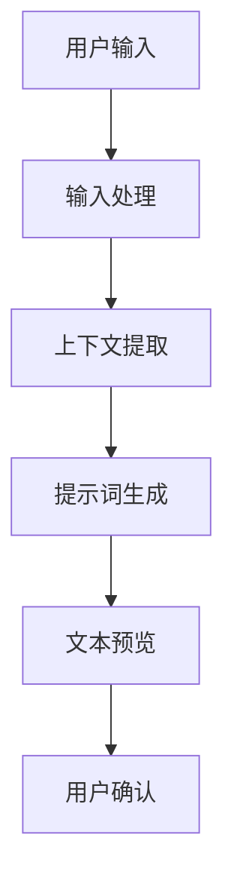

                 

### 《ChatGPT提示词编写的高效模式探析》

**关键词**：ChatGPT、提示词、编写、高效、模式、分析

**摘要**：本文旨在探讨ChatGPT提示词编写的高效模式。首先，我们将介绍ChatGPT的基本概念和架构，随后深入探讨提示词的编写原理和模式。文章还将分享高效编写策略，并在实际应用场景中进行项目实战分析。通过详细的讲解和实例，读者将了解到如何优化ChatGPT提示词的编写过程，提升其性能和准确性。

---

**第一部分：ChatGPT与提示词概述**

## 第1章：ChatGPT简介

### 1.1 ChatGPT的背景

ChatGPT是由OpenAI开发的一种基于Transformer模型的自然语言处理（NLP）聊天机器人。它通过大规模语言模型的预训练，可以生成流畅、自然的文本对话。ChatGPT的发布标志着人工智能技术在新一代对话系统中的重大突破，为人类与机器的交流提供了全新的方式。

### 1.2 ChatGPT的基本架构

ChatGPT的架构主要包括输入处理层、模型层和输出生成层。输入处理层负责接收用户输入，将其转化为模型可接受的格式。模型层是一个预先训练的Transformer模型，具有数十亿个参数。输出生成层则根据模型层的输出生成自然语言文本。

### 1.3 ChatGPT的应用场景

ChatGPT在各种应用场景中表现出色，包括客户服务、智能助手、内容生成、教育和娱乐等领域。其强大的文本生成能力使其成为一个多功能的人工智能工具，可以满足不同场景的需求。

---

## 第2章：提示词的基本概念

### 2.1 提示词的定义

提示词是ChatGPT输入的一个简短文本，用于引导模型生成相应的输出。提示词的质量直接影响生成的文本质量和响应的准确性。

### 2.2 提示词的作用

提示词的作用在于为模型提供上下文信息，帮助模型理解用户意图并生成相关回答。优秀的提示词可以使模型生成更具体、更有针对性的文本。

### 2.3 提示词的分类

根据用途和形式，提示词可以分为以下几种类型：
- **引导性提示词**：用于引导模型生成特定类型的回答，如问答、对话等。
- **描述性提示词**：用于描述用户需求和场景，帮助模型理解问题背景。
- **扩展性提示词**：用于扩展模型的回答，使其更加丰富和具体。

---

**第二部分：提示词编写原理与模式**

## 第3章：提示词编写原理

### 3.1 提示词的生成机制

提示词的生成机制包括用户输入处理、上下文提取、提示词生成和文本预览等步骤。以下是一个简单的提示词生成流程：

### 3.2 提示词的优化策略

为了提高提示词的质量，可以采取以下优化策略：
- **上下文匹配**：确保提示词与用户输入的上下文信息高度匹配。
- **语义丰富**：使用丰富多样的词汇和表达方式，使提示词更具表现力。
- **结构清晰**：设计简洁明了的提示词结构，便于模型理解和生成回答。

### 3.3 提示词的评估方法

评估提示词的质量可以从以下几个方面进行：
- **响应准确性**：评估模型生成的回答是否准确符合用户意图。
- **文本流畅性**：评估生成的文本是否通顺、自然。
- **多样性**：评估生成的回答是否具有多样性，避免重复和单调。

---

## 第4章：提示词编写模式

### 4.1 基于场景的提示词编写

基于场景的提示词编写是指根据不同的应用场景设计相应的提示词。以下是一些常见的场景和相应的提示词示例：
- **客户服务场景**：提供解决问题的建议，如“请问您有什么问题需要帮助？”
- **教育场景**：引导学生思考和讨论，如“请讨论人工智能的发展趋势。”
- **娱乐场景**：设计有趣的对话，如“您想要玩什么游戏？”

### 4.2 基于用户的提示词编写

基于用户的提示词编写是指根据不同用户的特点和需求设计相应的提示词。以下是一些常见的用户类型和相应的提示词示例：
- **新手用户**：提供简洁明了的引导，如“欢迎来到我们的聊天系统，请问有什么可以帮助您的？”
- **专家用户**：提供深入专业的建议，如“您在人工智能领域有哪些具体的疑问？”

### 4.3 基于数据的提示词编写

基于数据的提示词编写是指根据大量用户数据和模型生成结果进行优化。以下是一些常见的数据来源和相应的提示词优化方法：
- **用户反馈**：分析用户反馈，优化提示词质量和生成文本。
- **模型生成结果**：利用模型生成结果，发现常见问题并进行提示词优化。

---

**第三部分：高效编写策略**

## 第5章：高效编写策略

### 5.1 提高提示词编写效率的方法

为了提高提示词编写的效率，可以采取以下策略：
- **模板化编写**：设计通用模板，快速生成高质量的提示词。
- **自动化工具**：使用自动化工具，如自然语言生成（NLG）系统，辅助编写提示词。
- **团队协作**：组建专门团队，分工合作，提高编写效率。

### 5.2 提高提示词准确性的方法

为了提高提示词的准确性，可以采取以下策略：
- **数据清洗**：确保输入数据的质量，去除无关信息。
- **模型调优**：根据具体应用场景，对模型进行调优，提高生成文本的准确性。
- **用户反馈**：收集用户反馈，不断优化提示词和模型。

### 5.3 提高提示词创新性的方法

为了提高提示词的创新性，可以采取以下策略：
- **多样性训练**：对模型进行多样化训练，使其生成更多样化的文本。
- **创意启发**：从不同领域和角度获取灵感，设计创新的提示词。
- **文化元素**：融入文化元素，使提示词更具独特性和吸引力。

---

**第四部分：实际应用场景**

## 第6章：ChatGPT在实际应用中的场景分析

### 6.1 聊天机器人

聊天机器人是ChatGPT最常见的一种应用场景。通过高质量的提示词，聊天机器人可以与用户进行自然、流畅的对话，提供客户服务、信息查询、情感支持等功能。

### 6.2 自动问答系统

自动问答系统利用ChatGPT的强大文本生成能力，可以自动回答用户提出的问题。通过优化提示词，自动问答系统的响应速度和准确性可以得到显著提升。

### 6.3 文本生成

文本生成是ChatGPT的另一个重要应用领域。通过高质量提示词，ChatGPT可以生成文章、故事、对话等多种形式的文本。在内容创作、市场营销等领域具有广泛的应用价值。

---

**第五部分：项目实战**

## 第7章：ChatGPT项目实战

### 7.1 项目背景与需求

本项目旨在开发一款基于ChatGPT的智能客服系统，提供全天候的客户服务，提高客户满意度。

### 7.2 环境搭建与准备

在开始项目之前，需要搭建一个适合ChatGPT运行的开发环境。主要包括Python环境、OpenAI API接入和数据库搭建等。

### 7.3 提示词编写与优化

根据项目需求和场景，设计并优化提示词。通过不断调整和测试，找到最佳提示词组合，提高智能客服系统的响应速度和准确性。

### 7.4 项目总结与反思

在项目结束后，对项目进行总结和反思。分析项目中的成功经验和不足之处，为未来项目提供参考。

---

**结语**

本文从多个角度探讨了ChatGPT提示词编写的高效模式。通过详细的讲解和实例，读者可以了解到如何优化ChatGPT提示词的编写过程，提升其性能和准确性。希望本文能为ChatGPT的实际应用提供有益的参考。

---

**作者信息**

作者：AI天才研究院/AI Genius Institute & 禅与计算机程序设计艺术 /Zen And The Art of Computer Programming**

