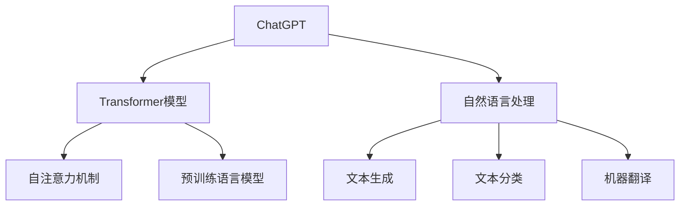

                 

### 《ChatGPT提示词编写的黄金法则：思维链方法详解》

---

**关键词：** ChatGPT、提示词、思维链、Transformer、自然语言处理

**摘要：** 本文将深入探讨ChatGPT提示词编写的黄金法则，特别是思维链方法的应用。通过解析核心概念与联系、算法原理、数学模型以及项目实战，为读者提供全面的指导，帮助提升ChatGPT提示词编写的效率和效果。

---

## 第一部分：核心概念与联系

### 第1章：ChatGPT简介

#### 1.1 ChatGPT的发展历史

ChatGPT是由OpenAI在2022年底推出的一种基于Transformer模型的预训练语言模型。它采用了大量文本数据进行训练，从而具备了生成自然语言文本的能力。ChatGPT的成功得益于深度学习技术的快速发展，以及大规模数据集和计算资源的支持。

#### 1.2 ChatGPT的基本原理

ChatGPT采用了Transformer模型，这是一种基于自注意力机制的神经网络模型。Transformer模型通过捕捉输入序列中的长期依赖关系，实现了高效的自然语言处理。

#### 1.3 ChatGPT与自然语言处理的关系

ChatGPT在自然语言处理领域具有广泛的应用，包括文本生成、文本分类、机器翻译等。它通过学习大量文本数据，能够自动生成具有高度可读性的文本。

### 核心概念与联系架构图：



## 第二部分：核心算法原理讲解

### 第2章：Transformer模型

#### 2.1 Transformer模型的原理

Transformer模型是一种基于自注意力机制的神经网络模型，通过捕捉输入序列中的长期依赖关系，实现了高效的自然语言处理。

#### 2.2 自注意力机制（SA）与多头注意力（MHSA）

自注意力机制是Transformer模型的核心，它通过计算输入序列中每个词与其他词的相关性，实现了对输入序列的编码。

多头注意力机制则是在自注意力机制的基础上，通过多个独立的注意力头来同时关注输入序列的不同部分，提高了模型的表示能力。

#### 2.3 伪代码实现

```python
# Transformer模型的伪代码实现
class Transformer:
    def __init__(self, vocab_size, d_model, num_heads):
        self.embedding = Embedding(vocab_size, d_model)
        self.positional_encoding = PositionalEncoding(d_model)
        self.encoder = Encoder(d_model, num_heads)
        self.decoder = Decoder(d_model, num_heads)
        self.linear = Linear(d_model, vocab_size)

    def forward(self, src, tgt):
        src_embedding = self.embedding(src) + self.positional_encoding(src)
        tgt_embedding = self.embedding(tgt) + self.positional_encoding(tgt)
        enc_output = self.encoder(src_embedding)
        dec_output = self.decoder(tgt_embedding, enc_output)
        output = self.linear(dec_output)
        return output
```

## 第三部分：数学模型和数学公式

### 第3章：损失函数与优化算法

#### 3.1 损失函数（如交叉熵）

交叉熵是衡量模型预测结果与真实结果之间差异的常用损失函数。

$$
Loss = -\sum_{i=1}^{N} y_i \log(p_i)
$$

其中，$y_i$为真实标签，$p_i$为模型预测的概率。

#### 3.2 优化算法（如梯度下降、Adam）

梯度下降是一种常用的优化算法，通过不断调整模型的参数，使得损失函数逐渐减小。

$$
\theta_{t+1} = \theta_{t} - \alpha \cdot \nabla_\theta J(\theta)
$$

其中，$\theta$为模型参数，$\alpha$为学习率，$J(\theta)$为损失函数。

Adam优化算法是在梯度下降的基础上，引入了一阶矩估计和二阶矩估计，提高了优化效果。

$$
m_t = \beta_1 \cdot m_{t-1} + (1 - \beta_1) \cdot \nabla_\theta J(\theta)
$$

$$
v_t = \beta_2 \cdot v_{t-1} + (1 - \beta_2) \cdot (\nabla_\theta J(\theta))^2
$$

$$
\theta_{t+1} = \theta_{t} - \alpha \cdot \frac{m_t}{\sqrt{v_t} + \epsilon}
$$

其中，$m_t$和$v_t$分别为一阶矩估计和二阶矩估计，$\beta_1$和$\beta_2$分别为一阶矩和二阶矩的指数衰减率，$\epsilon$为一个小常数。

## 第四部分：项目实战

### 第4章：ChatGPT提示词编写实战

#### 4.1 提示词编写的基本原则

提示词的编写对于ChatGPT的性能至关重要。基本原则包括：

1. 清晰明确：提示词应简洁明了，避免歧义。
2. 完整性：提示词应包含必要的信息，确保ChatGPT能够生成合理的回答。
3. 精准性：提示词应针对特定场景，确保生成的回答与预期相符。

#### 4.2 提示词编写的案例分析

以下是一个示例：

```
输入：请你写一篇关于人工智能的科普文章，标题为“人工智能：未来已来”。

输出：人工智能，简称AI，是一种模拟、延伸和扩展人类智能的理论、方法、技术及应用系统。人工智能的本质在于其模仿人类思维过程的自动化。随着计算能力和算法的不断提升，人工智能在诸如语音识别、图像识别、自然语言处理等领域取得了显著的成果。
```

#### 4.3 思维链方法详解

思维链方法是一种通过构建思维链条，引导ChatGPT生成高质量文本的方法。其核心思想是：

1. 确定主题：明确文章的主题和方向。
2. 设定目标：设定文章的目标和预期效果。
3. 拓展内容：围绕主题，不断拓展和丰富内容。
4. 连贯性：确保文章内容的连贯性和逻辑性。

思维链方法的应用场景广泛，如：

1. 文本生成：通过思维链方法，可以生成结构清晰、逻辑严谨的文本。
2. 文章写作：思维链方法可以帮助作者构建文章框架，提高写作效率。

### 第5章：未来展望与应用领域

#### 5.1 ChatGPT的发展趋势

ChatGPT作为一种强大的预训练语言模型，其发展前景广阔。未来，ChatGPT将不断完善和优化，进一步提升其性能和适用范围。

#### 5.2 ChatGPT在各行业的应用场景

ChatGPT在多个领域具有广泛的应用前景，包括：

1. 人工智能助手：在智能家居、智能客服等领域，ChatGPT可以作为人工智能助手，提供便捷的服务。
2. 内容创作：在内容创作领域，ChatGPT可以生成文章、新闻、故事等，提高创作效率。
3. 教育领域：ChatGPT可以作为教育助手，提供个性化的学习指导。

#### 5.3 面临的挑战与解决方案

尽管ChatGPT具有广泛的应用前景，但同时也面临一些挑战：

1. 数据隐私：在处理用户数据时，需要确保数据的安全和隐私。
2. 文本生成质量：如何提高文本生成的质量和准确性，是ChatGPT需要解决的重要问题。

### 最佳实践 tips

1. 提示词编写时，注意简洁明了，避免冗长。
2. 在项目实战中，不断尝试和优化，提高模型性能。

### 小结

ChatGPT作为一种强大的预训练语言模型，在自然语言处理领域具有广泛的应用前景。通过本文的探讨，我们了解了ChatGPT的基本原理、提示词编写方法和思维链方法，希望对读者有所帮助。

### 拓展阅读

1. 《深度学习：全面解读》
2. 《自然语言处理入门》
3. 《Transformer模型解析》

---

**作者：** AI天才研究院/AI Genius Institute & 禅与计算机程序设计艺术 /Zen And The Art of Computer Programming

本文内容仅供参考，实际应用时请结合具体情况进行调整。

