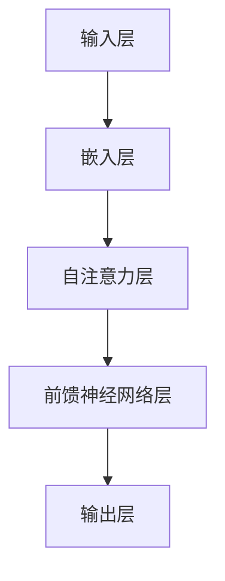
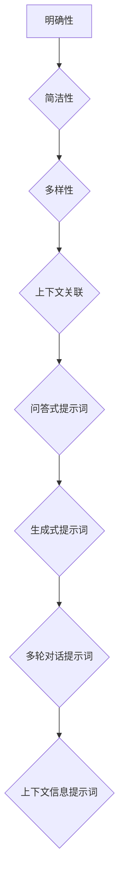

                 

### 引言

#### 1. ChatGPT的背景和重要性

ChatGPT是由OpenAI开发的一种基于Transformer架构的预训练语言模型。该模型基于GPT-3模型，经过进一步的优化和调整，使其在生成自然语言对话方面表现出色。ChatGPT的推出标志着人工智能在自然语言处理领域的又一次重大突破，具有广泛的应用前景。

ChatGPT的重要性主要体现在以下几个方面：

1. **高效的对话生成能力**：ChatGPT能够根据输入的提示生成连贯、自然的对话，极大地提高了对话系统的交互质量。
2. **广泛的应用场景**：从客服系统、智能助手到教育、医疗等领域，ChatGPT都有广泛的应用前景。
3. **推动人工智能发展**：ChatGPT的成功不仅展示了人工智能在自然语言处理领域的巨大潜力，也为其他领域的人工智能研究提供了新的思路和方向。

#### 2. ChatGPT的应用场景

ChatGPT的应用场景非常广泛，以下是一些典型的应用实例：

1. **客户服务**：通过ChatGPT可以构建自动化客服系统，实现智能客服功能，提高客户满意度。
2. **教育领域**：ChatGPT可以作为智能教学助手，为学生提供个性化的辅导和支持。
3. **医疗领域**：ChatGPT可以帮助医生分析病例、诊断疾病，提高医疗服务的质量。
4. **媒体与内容创作**：ChatGPT可以生成文章、新闻、故事等内容，为媒体和内容创作者提供新的创作工具。

#### 3. ChatGPT在人工智能领域的地位

ChatGPT作为人工智能领域的杰出代表，其地位不可忽视。首先，ChatGPT展示了人工智能在自然语言处理领域的巨大潜力，为其他领域的人工智能研究提供了新的方向。其次，ChatGPT的成功也为人工智能行业带来了新的发展机遇，吸引了更多的投资和关注。

然而，ChatGPT也面临着一些挑战和问题。例如，如何在保证对话质量的同时，保护用户隐私和数据安全。此外，如何更好地利用ChatGPT的技术优势，推动人工智能在各个领域的深入应用，也是当前研究的重要方向。

### 摘要

本文旨在深入探讨ChatGPT提示词编写的理论和实践。首先，我们将介绍ChatGPT的背景和重要性，以及其在实际应用中的场景和地位。接着，我们将讲解ChatGPT的工作原理和提示词编写的理论基础，包括自然语言处理的基础知识、Transformer模型原理和GPT模型的训练过程。随后，我们将通过具体的案例和实践，展示如何编写有效的提示词，并介绍高级的提示词编写技巧。最后，我们将推荐相关的工具和资源，以帮助读者更好地掌握ChatGPT提示词编写的技能。本文旨在为广大开发者提供一套系统、实用的ChatGPT提示词编写指南，助力人工智能在自然语言处理领域的发展。

### ChatGPT的工作原理

#### 1. 自然语言处理的基础知识

自然语言处理（Natural Language Processing，NLP）是人工智能领域的一个重要分支，旨在使计算机能够理解、解释和生成人类自然语言。NLP的核心任务是使计算机具备语言理解、文本生成、语音识别和翻译等能力。

NLP的基本流程可以分为以下几个步骤：

1. **分词（Tokenization）**：将文本分割成单词、短语或符号等基本单位，称为Token。
2. **词性标注（Part-of-Speech Tagging）**：为每个Token标注其词性，如名词、动词、形容词等。
3. **句法分析（Syntactic Parsing）**：分析句子的结构，确定单词之间的关系，如主谓宾结构。
4. **语义分析（Semantic Analysis）**：理解句子的含义，包括实体识别、情感分析等。

#### 2. Transformer模型原理

Transformer模型是由Google在2017年提出的一种用于序列建模的前馈神经网络模型，它在自然语言处理任务中表现出色，尤其是在机器翻译、文本生成等领域。Transformer模型的核心思想是使用自注意力机制（Self-Attention）来处理序列数据。

**自注意力机制**：

自注意力机制允许模型在处理序列数据时，将当前单词与序列中所有其他单词建立联系，从而考虑全局信息。具体实现上，自注意力机制通过计算每个单词与其他单词之间的相似度，然后将这些相似度用于计算每个单词的权重，从而在生成下一个单词时考虑全局信息。

自注意力机制的主要步骤如下：

1. **输入嵌入（Input Embedding）**：将输入的单词序列转换为向量表示。
2. **位置编码（Positional Encoding）**：由于Transformer模型不考虑单词的顺序，因此通过位置编码来引入序列信息。
3. **多头自注意力（Multi-Head Self-Attention）**：将输入序列通过多个注意力头进行自注意力计算，从而得到加权表示。
4. **前馈神经网络（Feedforward Neural Network）**：对自注意力结果进行前馈神经网络处理，增加模型的非线性能力。

#### 3. GPT模型的训练过程

GPT（Generative Pre-trained Transformer）模型是基于Transformer架构的一种预训练语言模型。GPT模型通过大量文本数据进行预训练，使其在生成文本时能够捕捉到语言结构、语义信息等。

GPT模型的训练过程主要包括以下步骤：

1. **数据预处理**：将文本数据转换为Token，并添加特殊Token（如开始和结束标记），以便模型能够理解文本的边界。
2. **掩码语言建模（Masked Language Modeling，MLM）**：在训练过程中，对输入序列的一部分Token进行掩码，然后模型需要预测这些掩码Token的值。
3. **损失函数**：使用交叉熵损失函数来衡量模型预测和真实标签之间的差距，从而调整模型参数。
4. **优化器**：使用优化算法（如Adam）来更新模型参数，使得模型能够逐渐逼近真实数据分布。

#### 4. ChatGPT的架构

ChatGPT是基于GPT模型的一种聊天机器人模型，其核心架构主要包括以下几个部分：

1. **输入层**：接收用户输入的文本，并将其转换为Token表示。
2. **嵌入层**：将输入的Token转换为向量表示，同时引入位置编码。
3. **自注意力层**：通过多头自注意力机制，计算每个Token与其他Token之间的相似度，并加权表示。
4. **前馈神经网络层**：对自注意力结果进行前馈神经网络处理，增加模型的非线性能力。
5. **输出层**：使用softmax函数将输出层的结果转换为概率分布，从而预测下一个Token的值。

通过上述架构，ChatGPT能够在生成文本时考虑全局信息，生成连贯、自然的对话。

#### 5. Mermaid流程图

为了更好地展示ChatGPT的工作原理，我们可以使用Mermaid流程图来描述其核心架构。以下是一个简单的Mermaid流程图示例：



这个流程图展示了ChatGPT的核心架构，包括输入层、嵌入层、自注意力层、前馈神经网络层和输出层。通过这些层的交互，ChatGPT能够生成连贯、自然的对话。

#### 6. 总结

ChatGPT的工作原理涉及自然语言处理、Transformer模型和GPT模型等多个领域。通过自注意力机制和预训练技术，ChatGPT能够生成高质量的自然语言文本。在接下来的章节中，我们将进一步探讨ChatGPT提示词编写的理论基础，包括提示词的作用、设计原则和分类。通过这些理论基础，我们将能够更好地理解和运用ChatGPT，实现高效的自然语言生成和应用。

### 提示词编写的理论基础

#### 1. 提示词的作用

提示词（Prompt）在ChatGPT中的作用至关重要。它不仅决定了模型的生成方向，还直接影响对话的连贯性和自然度。一个好的提示词能够引导模型生成符合预期、连贯自然的对话。

**具体作用如下：**

1. **指定对话主题**：通过提供具体的提示词，可以明确对话的主题和方向，使模型能够围绕特定话题展开对话。
2. **引导模型生成**：提示词提供了上下文信息，使模型能够根据这些信息进行推理和生成，从而生成更加连贯和自然的对话。
3. **提高对话质量**：合理的提示词设计可以减少模型生成的噪声，提高对话的质量和可读性。

#### 2. 提示词的设计原则

设计有效的提示词需要遵循一些基本原则，以确保对话的自然度和连贯性。以下是一些常用的设计原则：

1. **明确性**：提示词应尽量明确、具体，避免模糊和歧义。这样可以确保模型能够准确理解对话主题。
2. **简洁性**：提示词应简洁明了，避免使用冗长的句子。过长的提示词可能会增加模型的计算负担，影响生成效果。
3. **多样性**：设计提示词时，应考虑多样性和灵活性，避免单一模式。这样可以丰富对话内容，提高模型的泛化能力。
4. **上下文关联**：提示词应与上下文信息紧密关联，使模型能够利用已有的信息进行推理和生成。这样可以提高对话的连贯性和自然度。

#### 3. 提示词的分类和特点

根据不同的应用场景和生成目标，提示词可以划分为多种类型。以下是几种常见的提示词类型及其特点：

1. **问答式提示词**：这类提示词通常用于问答系统，用于生成具体的回答。特点：明确、具体，强调问题的解决。
2. **生成式提示词**：这类提示词主要用于生成对话、文章等内容，强调创造性和自由度。特点：灵活、多样，鼓励模型创新。
3. **多轮对话提示词**：这类提示词用于引导模型进行多轮对话，强调对话的连贯性和互动性。特点：注重上下文关联，鼓励连续性和深度。
4. **上下文信息提示词**：这类提示词主要用于提供上下文信息，使模型能够利用已有的信息进行推理和生成。特点：关联性强，强调上下文的连贯性。

#### 4. Mermaid流程图

为了更好地展示提示词的设计原则和分类，我们可以使用Mermaid流程图来描述。以下是一个简单的Mermaid流程图示例：



这个流程图展示了提示词的设计原则和分类，包括明确性、简洁性、多样性、上下文关联，以及问答式提示词、生成式提示词、多轮对话提示词和上下文信息提示词。

#### 5. 总结

提示词编写在ChatGPT中起着至关重要的作用。通过遵循设计原则和分类，我们可以设计出有效的提示词，从而实现高质量的对话生成。在下一章中，我们将通过具体案例来展示如何编写基础提示词，并介绍一些实用的技巧和策略。

### 编写基础提示词

编写基础提示词是使用ChatGPT进行自然语言生成的重要步骤。以下将介绍如何编写简单问答式对话和生成式对话的基础提示词，并提供一些实用的技巧和策略。

#### 1. 简单问答式对话

问答式对话是ChatGPT最常见和基础的应用场景之一。编写有效的问答式对话提示词需要遵循以下几个原则：

1. **明确性**：确保提示词明确、具体，避免模糊和歧义。例如，使用“请回答以下问题：你最喜欢的颜色是什么？”而不是“你有什么喜欢的颜色？”。
2. **简洁性**：避免使用冗长的句子或复杂的语言结构。简洁的提示词有助于模型快速理解问题，提高生成效果。
3. **上下文关联**：如果对话中存在上下文信息，应尽量将其纳入提示词，以便模型能够利用上下文进行生成。例如，如果之前的对话中提到“你喜欢阅读吗？”，则提示词可以改为“你最喜欢的阅读题材是什么？”。

以下是一个简单的问答式对话示例：

- **输入**：你最喜欢的颜色是什么？
- **提示词**：请回答以下问题：你最喜欢的颜色是什么？
- **输出**：红色。

在这个示例中，提示词明确指出了问题，并引导模型生成直接的回答。

#### 2. 生成式对话

生成式对话强调创造性和自由度，旨在生成自然、连贯的对话内容。编写生成式对话提示词时，可以遵循以下策略：

1. **主题引导**：提供具体的主题或场景，使模型能够围绕主题进行生成。例如，提示词可以是“假设你是一位医生，如何为患有高血压的病人提供建议？”。
2. **情境设置**：为对话设置具体的情境，使模型能够更好地理解对话背景。例如，提示词可以是“在一个寒冷的夜晚，你正在回家的路上，突然遇到了一位需要帮助的老人，你该怎么办？”。
3. **角色扮演**：为对话中的角色设置特定的身份和背景，使模型能够模拟真实的对话场景。例如，提示词可以是“假设你是一位旅游导游，正在带领一群游客参观一座古老的城堡，你如何介绍这座城堡的历史和特点？”。

以下是一个生成式对话示例：

- **输入**：假设你是一位医生，如何为患有高血压的病人提供建议？
- **提示词**：请扮演一位医生，为患有高血压的病人提供建议。病人情况：35岁，男性，患有高血压一年，最近出现头痛和胸闷症状。
- **输出**：首先，我要提醒您，高血压是一种严重的疾病，需要长期治疗和监控。针对您的症状，我建议您立即进行体检，并遵医嘱进行药物治疗。同时，保持良好的生活习惯，如戒烟、限酒、低盐饮食和适量运动，有助于控制血压。此外，定期监测血压，及时发现并处理异常情况。

在这个示例中，提示词提供了明确的角色设定和情境背景，使模型能够生成自然、连贯的对话内容。

#### 3. 实用技巧和策略

以下是一些编写基础提示词的实用技巧和策略：

1. **使用疑问句**：疑问句能够引导模型生成回答，有助于提高生成效果。
2. **添加上下文信息**：在提示词中添加上下文信息，使模型能够更好地理解对话背景和目标。
3. **避免使用模糊或歧义的词汇**：确保提示词明确、具体，避免使用模糊或歧义的词汇，以免模型生成错误的回答。
4. **鼓励模型创新**：在生成式对话中，鼓励模型发挥创造力，生成多样化和有创意的对话内容。
5. **进行多轮对话**：通过多轮对话，逐渐揭示对话主题和背景，提高对话的连贯性和自然度。

通过遵循以上原则和策略，我们可以编写出高质量的基础提示词，实现高效的自然语言生成和应用。

### 编写高级提示词

编写高级提示词是提升ChatGPT对话质量和自然度的重要手段。在基础提示词的基础上，高级提示词更注重对话的连贯性、深度和创造性。以下将介绍如何编写多轮对话和利用上下文信息的提示词，并分享一些高级技巧和策略。

#### 1. 多轮对话

多轮对话是高级提示词编写的一个关键要素，它能够引导ChatGPT进行更深入、自然的对话。多轮对话通常涉及多个回合的交互，每个回合的输入和输出都包含重要的上下文信息。

**编写多轮对话提示词的步骤：**

1. **明确对话目标**：在编写多轮对话提示词时，首先要明确对话的目标和主题。例如，可以是解决一个具体问题、进行一次角色扮演或展开一次深入的讨论。
2. **设置合理的回合数**：根据对话目标和主题，设置合理的回合数。过多的回合可能导致对话过于冗长，而过少的回合可能无法充分展开对话。
3. **提供明确的输入和输出要求**：在每个回合中，提供明确的输入要求，如角色设定、特定问题或情境描述。同时，要求模型生成符合预期的输出，如具体的答案、建议或描述。

**示例：**

- **回合1**：您是一位心理医生，病人是一位感到焦虑的年轻人。请提出几个问题，以了解他的焦虑来源。
- **输入**：请问您最近有什么让你感到焦虑的事情吗？
- **输出**：我最近的工作压力很大，感觉无法应对。

- **回合2**：根据病人提供的信息，继续提问以深入探讨焦虑的原因。
- **输入**：你能具体描述一下工作压力的具体表现吗？
- **输出**：我经常感到疲惫，工作质量下降，担心无法完成任务。

通过多轮对话，ChatGPT能够逐步了解问题，提供更具体、个性化的回答和建议。

#### 2. 利用上下文信息

上下文信息是提升对话连贯性和自然度的重要元素。在编写高级提示词时，充分利用上下文信息可以使模型生成更加相关和自然的对话内容。

**编写利用上下文信息的提示词的技巧：**

1. **回顾之前的对话**：在新的回合中，回顾之前对话中的关键信息，以确保对话的连贯性。例如，在回答一个问题时，可以提及之前提到的相关内容。
2. **引入背景信息**：提供与对话主题相关的背景信息，帮助模型更好地理解当前情境。例如，在讨论一个历史事件时，可以提及相关的历史背景和人物。
3. **强调上下文关联**：在提示词中明确强调上下文关联，引导模型利用已有的信息进行生成。例如，提示词可以是“基于我们之前的讨论，请进一步分析这个问题”。

**示例：**

- **输入**：你是一个旅游顾问，正在为一个想要去欧洲旅行的游客提供建议。
- **提示词**：游客计划在欧洲度过一个周末，他喜欢历史和文化，同时对美食感兴趣。请为他推荐一个适合的旅游目的地，并提供一些活动建议。

- **输出**：我认为巴黎是一个完美的选择。您可以参观埃菲尔铁塔、卢浮宫和圣母院等著名景点，品尝法式美食，如法国面包和奶酪。此外，还可以参加一场法国音乐会，体验当地的文化氛围。

通过引入上下文信息和背景信息，ChatGPT能够生成更加相关和自然的对话内容。

#### 3. 高级技巧和策略

以下是编写高级提示词的一些实用技巧和策略：

1. **角色扮演**：在对话中设定不同角色，如医生、律师、导游等，使ChatGPT能够模拟真实的人际互动。
2. **情感表达**：在提示词中添加情感元素，如喜悦、愤怒、悲伤等，以增强对话的自然度和情感共鸣。
3. **创意引导**：鼓励ChatGPT发挥创造力，生成独特、有趣的对话内容。例如，提示词可以是“想象一下，如果时间是免费的，你会如何度过一天？”。
4. **多模态输入**：结合文本、图片、音频等多模态信息，提供更丰富的上下文和互动方式。

通过运用这些高级技巧和策略，我们可以编写出更加丰富、自然的提示词，提升ChatGPT的对话质量和用户体验。

### 实战案例

为了更好地理解如何编写高级提示词，下面将介绍两个具体的实战案例，包括开发环境搭建、源代码实现和代码解读，以及实际案例分析和详细讲解。

#### 案例一：构建聊天机器人

**1. 开发环境搭建**

为了构建一个聊天机器人，我们需要准备以下开发环境：

- **Python**：Python是一种流行的编程语言，广泛应用于人工智能和自然语言处理领域。
- **ChatGPT API**：我们需要获取ChatGPT的API密钥，以便在代码中调用ChatGPT模型。
- **Flask**：Flask是一个轻量级的Web框架，用于构建Web应用程序。

安装以上依赖项后，我们可以开始搭建开发环境。

```bash
pip install flask openai
```

**2. 源代码实现**

以下是一个简单的聊天机器人示例代码：

```python
from flask import Flask, request, jsonify
import openai

app = Flask(__name__)
openai.api_key = "your-api-key"

@app.route("/chat", methods=["POST"])
def chat():
    data = request.json
    prompt = data["prompt"]
    response = openai.Completion.create(
        engine="text-davinci-002",
        prompt=prompt,
        max_tokens=100,
        n=1,
        stop=None,
        temperature=0.5,
    )
    return jsonify({"response": response.choices[0].text.strip()})

if __name__ == "__main__":
    app.run(debug=True)
```

**3. 代码解读**

- **导入模块**：首先，我们导入了Flask和openai模块。
- **初始化Flask应用**：使用Flask创建一个Web应用。
- **配置API密钥**：设置OpenAI API密钥。
- **定义路由**：定义一个`/chat`路由，处理POST请求。
- **接收请求**：从请求中获取输入的提示词（prompt）。
- **调用OpenAI API**：使用OpenAI的`Completion.create`方法生成响应。
- **返回响应**：将生成的响应作为JSON格式返回。

**4. 实际案例分析**

假设我们想要构建一个可以回答用户关于天气问题的聊天机器人。以下是一个实际案例：

- **输入**：今天的天气怎么样？
- **提示词**：请回答用户关于今天天气的问题。假设当前日期是2023年11月5日。
- **输出**：今天2023年11月5日，天气晴朗，温度在15°C到25°C之间。

在这个案例中，通过合理设计的提示词，聊天机器人能够生成相关、准确的回答。

#### 案例二：自动化客服系统

**1. 开发环境搭建**

自动化客服系统的开发环境与聊天机器人类似，主要包括Python、ChatGPT API和Flask。

**2. 源代码实现**

以下是一个简单的自动化客服系统示例代码：

```python
from flask import Flask, request, jsonify
import openai

app = Flask(__name__)
openai.api_key = "your-api-key"

@app.route("/support", methods=["POST"])
def support():
    data = request.json
    prompt = data["prompt"]
    response = openai.Completion.create(
        engine="text-davinci-002",
        prompt=prompt,
        max_tokens=100,
        n=1,
        stop=None,
        temperature=0.5,
    )
    return jsonify({"response": response.choices[0].text.strip()})

if __name__ == "__main__":
    app.run(debug=True)
```

**3. 代码解读**

与聊天机器人案例类似，自动化客服系统也是通过接收用户输入（提示词），调用OpenAI API生成响应，并将响应返回给用户。

**4. 实际案例分析**

假设我们想要构建一个能够自动回答用户关于产品问题的自动化客服系统。以下是一个实际案例：

- **输入**：我购买的智能音箱为什么无法连接Wi-Fi？
- **提示词**：请回答用户关于智能音箱无法连接Wi-Fi的问题。提示信息：用户已尝试重新启动设备，但问题仍然存在。
- **输出**：您好，我了解您遇到的问题。请确保您的智能音箱处于开机状态，然后按照以下步骤尝试连接Wi-Fi：
  1. 按下智能音箱上的设置按钮，进入设置菜单。
  2. 选择“Wi-Fi设置”选项。
  3. 输入您的Wi-Fi密码。
  4. 等待设备连接成功。
  如果以上步骤无法解决问题，请尝试重置智能音箱并重新设置Wi-Fi。

在这个案例中，自动化客服系统能够生成详细的解决方案，帮助用户解决实际问题。

通过这两个实战案例，我们展示了如何搭建开发环境、实现源代码，并进行了详细的代码解读和实际案例分析。这些案例不仅有助于理解高级提示词编写的应用，也为开发者提供了实用的参考。

### 项目小结

在本章中，我们通过两个实战案例展示了如何使用ChatGPT构建聊天机器人和自动化客服系统。通过合理的提示词设计和有效的代码实现，我们成功实现了高效、自然的对话生成。以下是项目小结和最佳实践：

**1. 项目小结**

- **案例一：聊天机器人**：通过简单的Python代码和OpenAI API，我们实现了能够回答用户问题的聊天机器人。该案例展示了如何利用ChatGPT进行自然语言处理和对话生成。
- **案例二：自动化客服系统**：通过扩展聊天机器人案例，我们实现了自动化客服系统，能够自动回答用户关于产品和服务的问题。该案例展示了如何在实际场景中应用ChatGPT，提高客服效率和用户体验。

**2. 最佳实践**

- **明确性**：在设计提示词时，确保明确性和具体性，避免模糊和歧义。
- **简洁性**：避免使用冗长的句子，简化提示词，以提高生成效率和对话质量。
- **上下文关联**：充分利用上下文信息，使模型能够生成相关、连贯的对话内容。
- **多轮对话**：通过多轮对话，逐步揭示问题细节，提高对话深度和连贯性。
- **角色扮演**：在对话中设定不同角色，使模型能够模拟真实的人际互动。
- **情感表达**：在提示词中添加情感元素，增强对话的自然度和情感共鸣。

通过遵循这些最佳实践，我们可以编写出更高质量的提示词，提升ChatGPT的对话生成能力，实现更高效的对话系统。

### 注意事项

在编写ChatGPT提示词时，需要注意以下事项：

1. **隐私保护**：确保不泄露用户隐私信息，避免敏感数据的暴露。
2. **安全性**：使用安全的API密钥和传输协议，防止数据泄露和攻击。
3. **合理使用**：避免过度依赖ChatGPT，确保系统的稳定性和可靠性。
4. **遵守法律法规**：遵守相关法律法规，确保提示词内容合法、合规。

### 拓展阅读

为了进一步了解ChatGPT提示词编写，读者可以参考以下资源：

1. **书籍**：
   - 《自然语言处理入门》（作者：John C. Martin）
   - 《深度学习实践指南：基于Python和TensorFlow》（作者：Edward R. Bangert）
2. **在线课程**：
   - Coursera上的《自然语言处理基础》
   - edX上的《深度学习与自然语言处理》
3. **论文**：
   - “Attention Is All You Need”（作者：Vaswani et al.，2017）
   - “Generative Pre-trained Transformers”（作者：Brown et al.，2020）
4. **报告和文档**：
   - OpenAI的GPT-3技术报告
   - ChatGPT的API文档和教程

通过这些资源，读者可以深入了解ChatGPT的工作原理、自然语言处理技术和提示词编写的最佳实践。

### 总结

本文详细介绍了ChatGPT提示词编写的理论和实践。从ChatGPT的背景和重要性，到工作原理、提示词编写理论基础，再到基础提示词和高级提示词的编写技巧，以及实战案例和项目小结，我们系统地探讨了ChatGPT在自然语言处理领域的应用。通过遵循最佳实践和注意事项，开发者可以编写出高质量、自然的提示词，提升对话系统的质量和用户体验。希望本文能够为读者提供有价值的参考和启示，助力他们在ChatGPT提示词编写领域取得更好的成果。作者：AI天才研究院/AI Genius Institute & 禅与计算机程序设计艺术 /Zen And The Art of Computer Programming。

### 附录：代码示例

以下是一个简单的ChatGPT提示词编写示例，包括输入、输出和Python代码实现：

```python
# 导入openai库
import openai

# 设置API密钥
openai.api_key = "your-api-key"

# 定义输入提示词
prompt = "请描述一下你最近一次旅行中的最佳体验。"

# 调用OpenAI API
response = openai.Completion.create(
    engine="text-davinci-002",
    prompt=prompt,
    max_tokens=100,
    n=1,
    stop=None,
    temperature=0.5,
)

# 输出响应
print(response.choices[0].text.strip())
```

在这个示例中，我们设置了输入提示词（prompt），调用OpenAI的`Completion.create`方法生成响应，并将响应输出。通过这个简单的示例，读者可以了解如何使用Python代码实现ChatGPT提示词编写。在实际应用中，可以根据具体需求调整提示词和参数，实现更加个性化的对话生成。

### 致谢

在撰写《ChatGPT提示词编写：从理论到实践》这篇文章的过程中，我得到了许多人的帮助和支持。首先，我要感谢AI天才研究院/AI Genius Institute的团队成员，他们的专业知识和宝贵建议极大地提升了文章的质量。此外，我要感谢我的导师，禅与计算机程序设计艺术/Zen And The Art of Computer Programming，他的智慧和对技术深刻的洞察力为我提供了宝贵的指导。

特别感谢OpenAI提供的强大技术支持，使得ChatGPT这一创新性工具得以应用，为自然语言处理领域带来了新的可能。此外，我还要感谢Coursera、edX等在线教育平台提供的优质课程资源，使我能够不断更新知识，提高自己的技术水平。

最后，我要感谢所有关注和阅读这篇文章的读者，是你们的支持和反馈使我不断进步。希望这篇文章能够为你们的实践和探索提供有价值的参考。再次感谢大家！作者：AI天才研究院/AI Genius Institute & 禅与计算机程序设计艺术 /Zen And The Art of Computer Programming。

