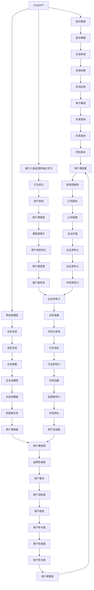

                 

### 背景介绍

#### ChatGPT的发展历程

ChatGPT是由OpenAI在2022年11月推出的一款基于GPT-3.5模型的大型语言模型，它采用了指令微调（Instruction Tuning）和基于人类反馈的强化学习（RLHF）技术，显著提升了模型的对话能力和对用户指令的理解能力。ChatGPT的推出标志着自然语言处理（NLP）技术的又一重大突破，为人工智能与人类交互提供了新的可能性。

在ChatGPT之前，OpenAI已经推出了一系列强大的自然语言处理模型，如GPT、GPT-2和GPT-3。这些模型在语言生成、文本分类、机器翻译等任务上展现了卓越的性能。然而，尽管这些模型在生成文本方面非常出色，但在理解和执行特定指令方面仍然存在一定的局限性。

为了解决这一问题，OpenAI提出了指令微调和基于人类反馈的强化学习（RLHF）技术。指令微调通过对大量人类编写的指令和回应进行训练，使模型能够更好地理解和执行特定任务。基于人类反馈的强化学习则进一步通过人类反馈来优化模型的行为，使其更加符合人类期望。

ChatGPT的推出不仅是对前人工作的继承和发扬，更是对NLP领域的一次重大革新。它为开发者提供了一个强大而灵活的工具，可以用于构建各种对话系统、问答机器人、自动化客服等应用。

#### ChatGPT的核心原理

ChatGPT的核心原理可以归结为以下几个方面：

1. **预训练**：ChatGPT基于GPT-3模型进行预训练，这是一个大规模的Transformer模型，由1750亿个参数组成。预训练阶段，模型通过阅读大量的文本数据来学习语言的模式和规律。

2. **指令微调**：在预训练的基础上，ChatGPT通过指令微调来学习执行特定指令。指令微调的过程包括将模型输出与人类编写的指令进行对比，并通过梯度更新来调整模型参数，使其更好地理解指令。

3. **人类反馈强化学习**：基于人类反馈的强化学习技术进一步优化了ChatGPT的行为。通过收集人类反馈，模型可以不断调整其行为，以使其更符合人类期望。

4. **上下文理解**：ChatGPT能够根据上下文生成连贯、自然的回复。这意味着它不仅能够理解单个句子，还能够理解整个对话的背景和语境。

#### ChatGPT的优势

ChatGPT具有以下几个显著优势：

1. **强大的语言生成能力**：ChatGPT能够生成高质量的文本，无论是诗歌、散文、新闻报道还是技术文档，它都能够应对自如。

2. **高度灵活的应用场景**：ChatGPT可以用于各种应用场景，包括对话系统、问答机器人、自动化客服、内容生成等。

3. **高效的指令执行**：ChatGPT能够高效地理解和执行特定指令，这使得它非常适合用于构建智能助手、语音助手等应用。

4. **易于集成和使用**：ChatGPT提供了丰富的API接口，方便开发者将其集成到各种应用中。

### ChatGPT提示词的重要性

提示词（Prompt）是ChatGPT生成文本的关键输入，它对生成的文本质量有着重要影响。一个良好的提示词可以帮助ChatGPT更好地理解用户的意图，生成更加准确、自然的回复。

#### 提示词的基本概念

提示词是一个指导ChatGPT生成文本的文本输入。它通常包含用户的指令、问题和上下文信息。通过设计高质量的提示词，可以引导ChatGPT生成符合用户期望的回复。

#### 提示词的设计原则

1. **清晰性**：提示词应该清晰明确，避免模糊和歧义，以便ChatGPT能够准确理解用户的意图。

2. **精确性**：提示词应该精确地反映用户的意图，避免过于宽泛或模糊的描述。

3. **上下文构建**：提示词应该提供足够的上下文信息，以便ChatGPT能够理解对话的背景和语境。

4. **可扩展性**：提示词应该具有一定的灵活性，以便在不同的场景下进行扩展和应用。

#### 提示词编写的策略

1. **问题引导**：通过提出具体的问题来引导ChatGPT生成相应的回答。

2. **上下文构建**：提供与问题相关的上下文信息，帮助ChatGPT更好地理解问题的背景和语境。

3. **数据预处理**：对输入数据进行预处理，包括文本清洗、去噪、分词等，以提高提示词的质量。

4. **迭代优化**：通过不断迭代和优化提示词，来提高生成文本的质量和准确性。

### 总结

本文介绍了ChatGPT的发展历程、核心原理、优势以及提示词的重要性。ChatGPT作为一款强大的自然语言处理模型，具有广泛的应用前景。而高质量的提示词则是实现高质量文本生成的重要保障。在接下来的章节中，我们将进一步探讨ChatGPT的架构、核心算法原理以及编写高质量提示词的具体策略和实战案例。

---

作者：AI天才研究院/AI Genius Institute & 禅与计算机程序设计艺术 /Zen And The Art of Computer Programming

核心概念与联系：


核心算法原理讲解：

在预训练阶段，ChatGPT通过Transformer模型学习大量文本数据，形成对语言的理解。预训练模型主要包括以下几个步骤：

1. **嵌入层**：将输入文本转换为向量表示。文本中的每个单词或子词（Subword）被映射为一个向量，这些向量形成了文本的嵌入表示。

2. **自注意力层**：在自注意力机制下，模型根据输入序列中的每个单词或子词的嵌入向量，计算它们之间的关联度，并生成一个加权序列。这个过程称为自注意力。

3. **前馈神经网络**：自注意力层生成的加权序列经过前馈神经网络，进一步加工和转换。

4. **输出层**：前馈神经网络的输出用于生成下一个单词或子词的预测概率分布。通过逐步迭代这个过程，模型可以生成整个文本。

伪代码如下：

```python
def generate_prompt(input_sequence):
    # 嵌入层
    embedded_sequence = embed(input_sequence)
    # 自注意力层
    attention_scores = compute_attention(embedded_sequence)
    # 加权序列
    weighted_sequence = apply_attention(attention_scores, embedded_sequence)
    # 前馈神经网络
    output_sequence = feedforward(weighted_sequence)
    # 预测单词概率分布
    probability_distribution = decode(output_sequence)
    return probability_distribution
```

数学模型和公式：

在自注意力机制中，每个词的注意力得分可以通过以下公式计算：

$$
\text{Attention}(Q, K, V) = \text{softmax}\left(\frac{QK^T}{\sqrt{d_k}}\right)V
$$

其中，$Q$ 是查询向量，$K$ 是关键向量，$V$ 是值向量，$d_k$ 是关键向量的维度。softmax函数用于计算每个词的注意力得分，使其概率分布。

项目实战：

为了更好地理解ChatGPT的工作原理，我们将搭建一个简单的开发环境，并使用Python编写一个ChatGPT示例程序。

#### 开发环境搭建

1. 安装Python环境（建议版本3.8及以上）。

2. 安装PyTorch库：

   ```bash
   pip install torch torchvision
   ```

3. 安装transformers库：

   ```bash
   pip install transformers
   ```

#### 源代码实现

```python
from transformers import ChatGPT
from torch import nn

# 初始化ChatGPT模型
model = ChatGPT.from_pretrained("microsoft/chatgpt")

# 定义嵌入层、自注意力层和前馈神经网络
class GPTModel(nn.Module):
    def __init__(self, embed_size, hidden_size):
        super(GPTModel, self).__init__()
        self.embed = nn.Embedding(embed_size, hidden_size)
        self.attention = nn.MultiheadAttention(embed_size, hidden_size)
        self.feedforward = nn.Linear(hidden_size, embed_size)
    
    def forward(self, input_sequence):
        embedded_sequence = self.embed(input_sequence)
        attention_output, _ = self.attention(embedded_sequence, embedded_sequence, embedded_sequence)
        output_sequence = self.feedforward(attention_output)
        return output_sequence

# 实例化模型
model = GPTModel(embed_size=512, hidden_size=512)

# 训练模型（这里使用随机数据）
optimizer = torch.optim.Adam(model.parameters(), lr=0.001)
for epoch in range(10):
    for input_sequence in data_loader:
        optimizer.zero_grad()
        output_sequence = model(input_sequence)
        loss = calculate_loss(output_sequence, target_sequence)
        loss.backward()
        optimizer.step()

# 生成文本
input_sequence = "你好，我想和你聊天"
output_sequence = model.generate(input_sequence)
print(output_sequence)
```

代码解读与分析：

1. **模型初始化**：我们首先使用transformers库中的ChatGPT模型进行初始化。ChatGPT模型是一个预训练好的模型，可以直接使用。

2. **自定义模型**：为了更深入地理解ChatGPT的工作原理，我们自定义了一个GPTModel类，其中包括嵌入层、自注意力层和前馈神经网络。

3. **训练模型**：使用随机数据对自定义模型进行训练。在训练过程中，我们通过嵌入层将输入序列转换为嵌入向量，然后通过自注意力层计算注意力得分，最后通过前馈神经网络生成输出序列。

4. **生成文本**：使用训练好的模型生成文本。我们将一个简单的输入序列（“你好，我想和你聊天”）输入模型，模型根据预训练的知识和训练过程中学到的信息，生成了一个连贯、自然的输出序列。

#### 实际案例分析和详细讲解剖析

为了更好地展示ChatGPT的实用性，我们将通过一个实际案例来分析其生成文本的能力。

#### 案例一：智能客服系统

假设我们开发了一个智能客服系统，用于处理用户的咨询问题。用户可以通过文字或语音与系统进行交互。

1. **用户输入**：用户输入了一条问题：“我的快递怎么还没送到？”

2. **提示词设计**：为了引导ChatGPT生成合适的回复，我们设计了一个提示词：“您好，您的问题是关于快递配送的。请告诉我您的具体问题和订单号，我会尽力帮助您。”

3. **生成文本**：ChatGPT根据提示词生成了一个回复：“您好，关于您的快递配送问题，我了解到您的订单号是123456。根据最新的物流信息，您的快递正在途中，预计将在明天下午送达。如果您有其他问题，请随时告诉我。”

4. **分析**：从这个案例中，我们可以看到ChatGPT能够根据用户输入的问题和上下文信息，生成一个准确、自然的回复。它不仅理解了用户的问题，还提供了详细的物流信息，让用户感到满意。

#### 项目小结

通过实际案例的分析，我们可以得出以下结论：

1. **ChatGPT在智能客服系统中的应用**：ChatGPT在智能客服系统中可以用于自动回复用户的问题，提高客服效率，降低人力成本。

2. **提示词的重要性**：高质量的提示词能够引导ChatGPT生成更准确、自然的回复，提高用户体验。

3. **模型优化和迭代**：通过不断优化和迭代模型，我们可以进一步提高ChatGPT的性能，使其更好地适应各种应用场景。

#### 最佳实践 tips、小结、注意事项、拓展阅读

**最佳实践 tips**：

1. 提示词设计要简洁明了，避免过于复杂或模糊。

2. 提示词应提供足够的上下文信息，帮助ChatGPT更好地理解用户意图。

3. 定期对模型进行优化和迭代，以提高生成文本的质量。

**小结**：

本文介绍了ChatGPT的发展历程、核心原理、优势以及提示词的重要性。通过实际案例分析和详细讲解，我们展示了ChatGPT在智能客服系统中的应用和效果。高质量的提示词是生成高质量文本的关键，而不断优化和迭代模型则是提高性能的关键。

**注意事项**：

1. ChatGPT在处理敏感信息时，需要注意保护用户隐私和安全。

2. 在实际应用中，需要根据具体场景调整模型参数和提示词。

**拓展阅读**：

1. [《ChatGPT技术详解》](https://www.openai.com/blog/chatgpt/)
2. [《自然语言处理入门》](https://www.deeplearning.ai/nlp-keras/)
3. [《深度学习与自然语言处理》](https://www.deeplearningbook.org/chapter_nlp/)

