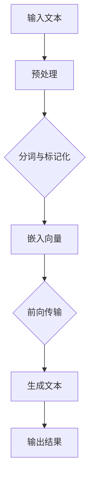
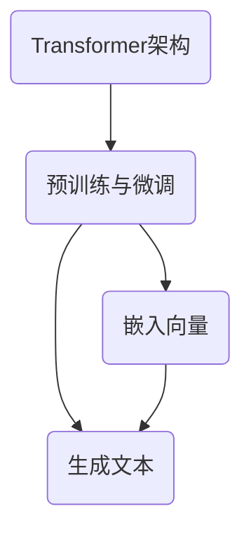

                 

### 引言：ChatGPT的概念、应用场景和重要性

#### 什么是ChatGPT？

ChatGPT（Chat Generative Pre-trained Transformer）是由OpenAI开发的一种基于Transformer架构的自然语言处理模型。该模型通过深度学习技术，在大量文本数据上进行预训练，从而具备了生成自然流畅、上下文相关的文本的能力。ChatGPT是一种先进的语言模型，能够在各种任务中展现出卓越的性能，如文本生成、对话系统、机器翻译、问答系统等。

#### ChatGPT的应用场景

ChatGPT在多个领域都有广泛的应用，以下是几个典型的应用场景：

1. **问答系统**：ChatGPT可以用于构建智能问答系统，通过接收用户的问题，生成相应的答案。这种系统广泛应用于客户服务、在线咨询等领域。

2. **对话机器人**：ChatGPT能够模拟人类对话，用于构建智能客服、聊天机器人等。它能够理解用户的意图，并根据上下文进行流畅的对话。

3. **文本生成**：ChatGPT可以用于生成新闻文章、产品描述、故事等。它可以根据提供的主题或关键词，生成具有连贯性和创意性的文本。

4. **机器翻译**：ChatGPT在机器翻译方面也表现出色，能够将一种语言翻译成另一种语言，同时保持原文的语义和风格。

5. **内容审核**：ChatGPT可以用于检测和过滤不当内容，如暴力、色情、仇恨言论等。

6. **教育和娱乐**：ChatGPT可以为学生提供个性化辅导，也可以为用户提供有趣的聊天互动。

#### ChatGPT的重要性

ChatGPT的重要性在于它代表了自然语言处理技术的一次重大突破。通过深度学习和Transformer架构，ChatGPT能够实现高度灵活、自适应的文本生成能力，这使得它在许多实际应用中都具备了很强的竞争力。以下是ChatGPT重要性的几个方面：

1. **提升用户体验**：ChatGPT能够提供自然、流畅的对话体验，从而提高用户满意度和互动质量。

2. **降低开发成本**：ChatGPT的强大文本生成能力减少了开发者在构建自然语言处理系统时的复杂度和成本。

3. **促进创新应用**：ChatGPT的应用场景非常广泛，可以推动各个行业的技术创新和应用拓展。

4. **推动人工智能发展**：ChatGPT的成功表明，深度学习和Transformer架构在自然语言处理领域具有巨大的潜力，有助于推动人工智能技术的发展。

综上所述，ChatGPT不仅是一种强大的自然语言处理模型，而且在多个领域都有广泛的应用前景和重要性。接下来的章节将深入探讨ChatGPT的基础知识、提示词设计原则、实际应用案例等，帮助读者全面了解ChatGPT及其应用。

#### Mermaid 流程图

为了更好地理解ChatGPT的架构和工作流程，我们使用Mermaid语言绘制一个简单的流程图，展示从输入到生成的整个过程：



在上述流程图中，输入文本经过预处理后，进行分词和标记化操作，随后被转换为嵌入向量。这些向量进入Transformer模型进行前向传输，最终生成文本输出。这个过程展示了ChatGPT从接收输入到生成输出的基本工作流程。

#### ChatGPT的核心概念与联系

为了深入理解ChatGPT的工作原理，我们需要了解几个核心概念及其相互关系：

1. **Transformer架构**：ChatGPT采用Transformer架构，这是一种基于自注意力机制的深度学习模型。自注意力机制允许模型在处理每个词时，根据上下文信息对输入序列中的所有词进行加权，从而提高模型的上下文理解能力。

2. **预训练与微调**：ChatGPT首先在大量的文本数据上进行预训练，以学习语言的基本规律和结构。随后，通过微调（Fine-tuning）技术，将模型应用于特定任务，如问答、对话等，以进一步提高模型的性能。

3. **嵌入向量**：嵌入向量是将文本数据转换为数值表示的一种方法。ChatGPT使用Word2Vec、BERT等预训练模型生成嵌入向量，这些向量能够捕捉词语之间的语义关系。

4. **生成文本**：ChatGPT通过Transformer模型生成文本。在生成过程中，模型根据输入的文本上下文，逐步生成每个词，直到生成完整的句子或段落。

以下是这几个核心概念之间的相互关系架构图：



这个架构图清晰地展示了Transformer架构如何通过预训练和微调生成嵌入向量，进而生成文本。理解这些核心概念和它们之间的关系，是掌握ChatGPT工作原理的关键。

### ChatGPT基础

#### GPT模型的基本原理

GPT（Generative Pre-trained Transformer）模型是自然语言处理领域的一种强大工具，其基本原理基于深度学习中的Transformer架构。Transformer模型由Vaswani等人在2017年提出，通过自注意力机制（Self-Attention）和多头注意力（Multi-Head Attention）等关键技术，实现了对文本序列的深层理解和生成。

1. **自注意力机制**：
   自注意力机制允许模型在处理每个词时，根据上下文信息对输入序列中的所有词进行加权。具体来说，每个词的表示不仅依赖于它自己的历史信息，还依赖于序列中其他所有词的信息。这种机制使得模型能够捕捉长距离依赖关系，从而提高对上下文的捕捉能力。

2. **多头注意力**：
   多头注意力机制将输入序列分成多个子序列（头），每个头独立计算注意力权重。这些权重然后被合并，以生成每个词的最终表示。多头注意力增加了模型的并行处理能力，提高了计算效率。

3. **编码器-解码器架构**：
   GPT模型采用编码器-解码器架构，其中编码器处理输入序列，解码器生成输出序列。编码器的输出被传递给解码器，作为生成每个词的上下文信息。这种架构使得模型能够生成与输入序列相关的高质量输出。

#### GPT模型的架构

GPT模型的架构主要由以下几个部分组成：

1. **嵌入层（Embedding Layer）**：
   嵌入层将输入的词转换为嵌入向量。这些向量表示词的语义信息，是后续自注意力计算的基础。GPT使用预训练的嵌入向量，如Word2Vec或BERT。

2. **位置编码（Positional Encoding）**：
   由于Transformer模型无法直接处理序列的位置信息，因此需要添加位置编码。位置编码为每个词的嵌入向量添加位置信息，以帮助模型理解序列中的词序。

3. **自注意力层（Self-Attention Layer）**：
   自注意力层允许模型在处理每个词时，根据上下文信息对输入序列中的所有词进行加权。这一过程通过计算自注意力权重，生成每个词的加权表示。

4. **前馈神经网络（Feedforward Neural Network）**：
   每个自注意力层之后，GPT模型都会通过一个前馈神经网络进行进一步处理。这个神经网络有两个全连接层，中间使用ReLU激活函数。

5. **多头注意力层（Multi-Head Attention Layer）**：
   GPT模型使用多个自注意力层叠加，形成多头注意力层。每个头独立计算注意力权重，然后将这些权重合并，以提高模型的性能。

6. **输出层（Output Layer）**：
   解码器的输出层负责生成输出序列。在生成过程中，模型会根据上下文信息逐步生成每个词，直到生成完整的句子或段落。

#### GPT模型的关键技术

GPT模型的关键技术主要包括以下几个方面：

1. **预训练与微调**：
   GPT模型首先在大量无标签数据上进行预训练，以学习语言的基本规律和结构。然后，通过微调技术，将模型应用于特定任务，如问答、对话等，以进一步提高模型的性能。

2. **大规模数据集训练**：
   GPT模型使用大规模数据集进行训练，这有助于模型学习到丰富的语言知识。大规模数据集使得模型能够更好地捕捉语言中的复杂结构和规律。

3. **训练策略优化**：
   GPT模型采用了一些训练策略优化，如层归一化（Layer Normalization）、残差连接（Residual Connections）等，以加速模型收敛和提高性能。

4. **推理策略**：
   在生成文本时，GPT模型使用了一种名为“自回归语言模型”的推理策略。这种策略使得模型在生成每个词时，只依赖于已生成的词，从而确保生成的文本与上下文保持一致性。

#### GPT模型的优化与调参

为了提高GPT模型的性能，需要进行一系列的优化与调参。以下是一些常见的优化与调参方法：

1. **模型大小调整**：
   调整模型的大小，包括层数、隐藏单元数等，可以显著影响模型的性能。通常，较大的模型能够捕捉更复杂的语言结构，但计算成本也更高。

2. **学习率调整**：
   学习率是影响模型收敛速度和性能的关键参数。通常，需要通过实验找到合适的初始学习率，并在训练过程中逐渐减小。

3. **批量大小调整**：
   批量大小影响模型的训练效率和稳定性。较大的批量大小可以加速训练，但可能导致梯度消失或爆炸。适当的批量大小可以提高模型的性能。

4. **正则化技术**：
   正则化技术，如dropout、权重衰减等，可以减少模型过拟合，提高泛化能力。这些技术需要在训练过程中合理应用。

5. **早期停止**：
   当模型的性能在验证集上不再提升时，可以采用早期停止策略，以避免过度训练。早期停止有助于防止模型在测试集上的性能下降。

通过合理的优化与调参，GPT模型可以在多种任务中达到优秀的性能。理解GPT模型的基本原理和关键技术，是设计和实现高效自然语言处理系统的基础。

### 提示词设计原则

提示词设计是ChatGPT应用中的一个关键环节，直接影响到模型生成文本的质量和效果。为了设计出高效、有针对性的提示词，我们需要遵循以下原则：

#### 提示词的定义

提示词（Prompt）是用于引导ChatGPT模型生成文本的输入信息。它可以是单个短语、句子，甚至是一段段落。提示词的作用是向模型提供明确的指导，帮助模型理解用户意图，从而生成相关且高质量的文本。

#### 提示词设计的目标

设计提示词的主要目标是：

1. **明确用户意图**：提示词应清晰、准确地表达用户的意图，帮助模型理解并回应用户的需求。
2. **提升文本质量**：通过精心设计的提示词，可以引导模型生成更连贯、更具有创造性的文本。
3. **提高生成效率**：设计合适的提示词可以提高模型生成文本的速度，减少不必要的计算资源浪费。

#### 提示词设计的挑战

提示词设计面临以下几个挑战：

1. **语言多样性**：用户提出的问题或需求可能涉及多种语言风格和表达方式，提示词需要适应这些多样性。
2. **上下文理解**：提示词不仅要传达用户意图，还需考虑上下文信息，确保生成文本与场景一致。
3. **适应性**：不同的应用场景可能需要不同的提示词设计策略，提示词应具有灵活性，能够适应各种场景。

#### 提示词设计的基本原则

为了解决上述挑战，我们可以遵循以下提示词设计的基本原则：

1. **明确性**：提示词应尽量简洁明了，避免模糊不清的表达。明确性有助于模型快速理解用户意图。
2. **上下文关联**：提示词应与上下文紧密相关，提供足够的背景信息，以便模型能够准确捕捉上下文语义。
3. **引导性**：提示词应具有引导性，提示模型生成特定类型的文本，如故事、问答、对话等。
4. **灵活性**：提示词设计应具备一定的灵活性，能够适应不同的输入内容和应用场景。
5. **多样性**：设计多种类型的提示词，以应对用户需求的多样性。例如，可以使用开放式提问、封闭式提问、情景描述等不同的形式。

### 提示词的格式与语言选择

提示词的格式和语言选择对生成文本的质量有很大影响。以下是一些具体建议：

1. **格式**：
   - **结构化格式**：使用段落分隔、标题、列表等结构化格式，有助于模型更好地理解文本结构。
   - **代码格式**：如果提示词中包含代码示例，应使用合适的代码格式，以提高可读性。
   - **文本长度**：提示词不宜过长，以免模型难以处理。通常，较短、简洁的提示词效果更好。

2. **语言选择**：
   - **简明扼要**：使用简单、通俗易懂的语言，避免使用过于专业或复杂的术语。
   - **中立性**：提示词应保持中立，避免带有强烈情感色彩的词汇，以免影响模型生成文本的风格。
   - **本地化**：如果目标用户分布在不同的地区，应考虑使用本地化语言，以提高用户的接受度。

#### 提示词的生成与优化

提示词的生成与优化是提升ChatGPT应用效果的关键步骤。以下是一些具体方法：

1. **自动生成**：
   - **基于规则**：使用预定义的规则和模板生成提示词，例如使用问答模板、情景模板等。
   - **基于数据**：从大量用户数据中提取常见的提示词，根据用户需求和场景进行自动生成。

2. **人工优化**：
   - **人工审查**：由专业人员对生成的提示词进行审查和优化，确保其准确性和实用性。
   - **用户反馈**：收集用户反馈，根据用户的实际使用体验对提示词进行调整和改进。

3. **模型优化**：
   - **参数调整**：通过调整模型的参数，如学习率、批量大小等，优化提示词生成效果。
   - **多模型结合**：使用不同的模型生成提示词，然后结合多模型的结果进行优化。

通过遵循上述提示词设计原则和方法，我们可以设计出高效、有针对性的提示词，从而提升ChatGPT在各类应用中的效果。

### 提示词设计实践

#### 提示词设计案例解析

为了更好地理解如何设计有效的提示词，我们通过以下几个具体的案例来展示提示词的设计过程和技巧。

##### 案例一：问答系统

**场景描述**：构建一个用于解答用户问题的智能问答系统。用户可以提出各种问题，系统需要生成相应的答案。

**提示词设计**：

1. **明确性问题**：为了确保系统能够准确理解用户的问题，提示词应尽量明确、具体。例如，对于用户提问“北京是中国的哪个省份？”，可以设计如下提示词：
   ```
   用户提问：“北京是中国的哪个省份？”
   ```
   
2. **引导性问题**：提示词可以引导用户提出更详细的问题，从而获得更准确的答案。例如，对于用户提问“北京是中国的哪个省份？”，可以设计如下提示词：
   ```
   用户提问：“北京是中国的哪个省份？”
   请提供关于该省份的一些基本信息，例如人口、面积、行政中心等。
   ```

3. **多样化提问**：为了提高系统的适应性，可以设计多种类型的提示词，例如：
   - 开放式提问：
     ```
     用户提问：“北京是中国的哪个省份？”
     请根据您所知道的信息生成一段关于该省份的介绍。
     ```
   - 封闭式提问：
     ```
     用户提问：“北京是中国的哪个省份？”
     您可以从以下省份中选择一个：北京市、天津市、河北省、山西省等。
     ```

**效果评估**：通过上述设计的提示词，系统能够更好地理解用户的意图，生成准确、连贯的答案。同时，多样化的提示词设计提高了系统的适应性，使其能够应对各种类型的问题。

##### 案例二：对话机器人

**场景描述**：构建一个智能对话机器人，用于与用户进行自然、流畅的对话。

**提示词设计**：

1. **开场白**：设计合适的开场白，以吸引用户的注意力并建立良好的对话氛围。例如：
   ```
   你好！我是智能对话机器人，很高兴为您服务。请问有什么可以帮助您的吗？
   ```

2. **引导性提问**：通过引导性提问，帮助用户表达他们的需求和意图。例如：
   ```
   您最近有什么兴趣爱好吗？可以和我分享一下。
   ```

3. **情感回应**：在对话中，根据用户的情绪和反馈，设计相应的情感回应。例如：
   - 如果用户表达了愉快情绪：
     ```
     听起来您今天心情不错！有什么特别开心的事情吗？
     ```
   - 如果用户表达了不愉快情绪：
     ```
     看来您有些不开心，我能为您做些什么来让您感到更好呢？
     ```

4. **过渡语**：在对话中，使用过渡语来引导对话的顺利进行。例如：
   ```
   那么接下来，我们可以聊聊您的工作。您在工作上有什么困惑吗？
   ```

**效果评估**：通过上述设计的提示词，对话机器人能够与用户进行自然、流畅的对话，同时根据用户的情绪和反馈进行适当的回应。这有助于提高用户的满意度和互动体验。

##### 案例三：文本生成

**场景描述**：构建一个用于生成文本的智能工具，例如生成新闻文章、产品描述等。

**提示词设计**：

1. **主题引导**：在生成文本时，提示词应明确主题，以引导模型生成与主题相关的文本。例如，对于生成一篇关于人工智能的新闻文章，可以设计如下提示词：
   ```
   请生成一篇关于人工智能的最新发展趋势的新闻文章。
   ```

2. **结构引导**：提示词可以引导模型生成具有良好结构的文本。例如，对于生成一篇产品描述，可以设计如下提示词：
   ```
   请生成一篇具有清晰结构的产品描述，包括产品特点、用途、优势等。
   ```

3. **内容引导**：提示词应提供足够的内容信息，以引导模型生成丰富、详细的文本。例如，对于生成一篇关于旅游景点的文章，可以设计如下提示词：
   ```
   请生成一篇关于黄山旅游景点的详细介绍文章，包括景点特色、旅游攻略、注意事项等。
   ```

**效果评估**：通过上述设计的提示词，系统能够生成结构清晰、内容丰富的文本，满足不同类型文本生成的需求。同时，提示词的引导性有助于提高文本生成的质量。

通过以上案例，我们可以看到，设计有效的提示词需要结合具体应用场景，充分考虑用户的意图和需求。合理设计的提示词能够显著提升模型生成文本的质量和效果。

#### 提示词设计的实战技巧

在ChatGPT的实际应用中，提示词的设计至关重要。以下是一些实用的技巧，可以帮助我们设计出更高效、更精准的提示词。

##### 1. 提示词编写技巧

1. **简洁明了**：提示词应简洁明了，避免冗长和复杂的句子。这样不仅有助于模型理解，还能提高生成文本的流畅性。
   ```python
   # 错误示例：请生成一篇关于人工智能的最新发展趋势，涉及深度学习、自然语言处理等领域的全面分析文章。
   # 修正后：请生成一篇关于人工智能最新发展趋势的文章，涵盖深度学习和自然语言处理等领域。
   ```

2. **具体明确**：提示词应具体明确，避免模糊不清的表达。具体性有助于模型捕捉用户的意图，生成更准确的文本。
   ```python
   # 错误示例：请生成一篇有趣的小说。
   # 修正后：请生成一篇以“未来科技”为主题的科幻小说。
   ```

3. **结构化**：使用结构化的提示词，可以帮助模型生成具有良好结构的文本。例如，使用段落分隔、标题、列表等格式。
   ```python
   # 示例：请生成一篇关于人工智能的报告，包括现状、挑战和未来趋势三部分。
   ```

##### 2. 提示词调试技巧

1. **迭代调试**：在设计提示词时，应通过多次迭代进行调试。每次调试后，分析生成文本的质量，根据反馈进行优化。
   ```python
   # 调试步骤：
   # 1. 使用初始提示词生成文本。
   # 2. 分析生成文本的质量和准确性。
   # 3. 根据分析结果，调整提示词的表达和结构。
   # 4. 重新生成文本，重复上述步骤，直到生成满意的文本。
   ```

2. **用户反馈**：收集用户的实际使用反馈，根据用户的需求和反馈对提示词进行调整。用户反馈是优化提示词的重要参考。
   ```python
   # 反馈收集：
   # 1. 记录用户使用ChatGPT的场景和提示词。
   # 2. 收集用户对生成文本的评价和建议。
   # 3. 分析用户反馈，找出常见问题和优化点。
   ```

##### 3. 提示词测试技巧

1. **多样性测试**：设计多种类型的提示词，测试模型在不同场景下的表现。这有助于发现模型可能存在的问题和不足。
   ```python
   # 测试示例：
   # 1. 开放式提问：请生成一篇关于人工智能的科普文章。
   # 2. 封闭式提问：请生成一篇关于人工智能在医疗领域的应用的文章。
   # 3. 情景描述：请生成一篇描述人工智能如何帮助解决全球饥饿问题的文章。
   ```

2. **性能评估**：使用性能评估指标，如BLEU、ROUGE等，对生成文本的质量进行量化评估。这有助于衡量提示词的有效性。
   ```python
   # 评估示例：
   # 1. 使用BLEU指标评估生成文本与标准答案的相似度。
   # 2. 使用ROUGE指标评估生成文本的连贯性和一致性。
   ```

通过以上实战技巧，我们可以设计出更高效、更精准的提示词，从而提高ChatGPT在各类应用中的性能和用户体验。

### 提示词设计中的常见问题与解决方案

在ChatGPT的应用过程中，提示词设计经常会遇到一些常见问题。以下列举了几个主要问题及其解决方案：

#### 1. 提示词模糊性处理

**问题**：模糊性提示词会导致模型生成不明确或不符合用户意图的文本。

**解决方案**：
- **明确化**：对于模糊的提示词，可以通过补充具体信息来明确用户意图。例如，对于“写一篇关于科技的论文”，可以改为“写一篇关于人工智能在医疗领域的应用前景的论文”。
- **多轮对话**：通过多轮对话，逐步引导用户明确需求。例如，可以先询问用户“您对人工智能在医疗领域的应用有哪些具体问题？”然后根据用户回答进一步细化提示词。

#### 2. 提示词多样性实现

**问题**：单一类型的提示词可能导致模型生成重复性高的文本。

**解决方案**：
- **多样化设计**：设计不同类型的提示词，如开放式提问、封闭式提问、情景描述等，以增加文本生成的多样性。
- **提示词库**：构建一个多样化的提示词库，从库中随机选取或组合提示词，以丰富文本生成的多样性。

#### 3. 提示词与用户互动的优化

**问题**：提示词设计不当可能导致用户与模型之间的互动不畅。

**解决方案**：
- **用户反馈**：收集用户对提示词和生成文本的反馈，根据用户需求调整和优化提示词。
- **情感分析**：使用情感分析技术，识别用户情绪，并根据情绪调整提示词的语气和表达方式。
- **个性化提示词**：根据用户历史互动和偏好，生成个性化的提示词，提高用户的互动体验。

#### 4. 提示词的长度与复杂性

**问题**：过长的提示词或过于复杂的提示词可能导致模型生成困难或生成质量下降。

**解决方案**：
- **长度控制**：保持提示词的简洁性，避免过长的提示词。可以拆分长提示词为多个短提示词，分别生成文本。
- **复杂性调整**：降低提示词的复杂性，避免使用过于专业或复杂的术语。可以通过简化语言、使用常见词汇等方式来实现。

#### 5. 提示词的实时更新与优化

**问题**：提示词设计后难以实时调整和优化，导致无法适应不断变化的需求。

**解决方案**：
- **自动化更新**：使用自动化工具或算法，定期检查和更新提示词库，确保其适应最新的需求。
- **持续迭代**：通过持续的迭代和优化，不断改进提示词设计，提高生成文本的质量和效果。

通过以上解决方案，我们可以有效应对提示词设计过程中遇到的问题，提高ChatGPT在各类应用中的性能和用户体验。

### ChatGPT在各类应用中的实战案例

ChatGPT作为一种强大的自然语言处理模型，已经在多个领域取得了显著的应用成果。以下我们通过几个具体的应用案例，展示ChatGPT在自然语言处理、教育、商业等领域的实战经验。

#### 自然语言处理中的应用

**案例一：智能客服系统**

智能客服系统是ChatGPT在自然语言处理领域的重要应用之一。某大型电商平台采用了ChatGPT构建智能客服系统，以提高客户服务的效率和满意度。系统通过ChatGPT模型，能够理解和处理用户的查询和问题，并提供及时、准确的回答。

**开发环境搭建**：
1. 使用Python和TensorFlow搭建开发环境。
2. 下载预训练的GPT-3模型。

**源代码实现**：
```python
import openai

# 设置API密钥
openai.api_key = "your-api-key"

# 创建智能客服对话
def create_smart_counseling_system():
    conversation = openai.Completion.create(
        engine="text-davinci-002",
        prompt="用户：你好，我想要购买一台笔记本电脑。有什么推荐吗？",
        max_tokens=50,
        n=1,
        stop=None,
        temperature=0.5,
    )
    return conversation.choices[0].text.strip()

# 输出智能客服的回答
print(create_smart_counseling_system())
```

**代码解读与分析**：
1. 引入OpenAI的API库。
2. 设置API密钥。
3. 创建智能客服对话，通过输入用户的问题，调用OpenAI的API接口，生成回答。

**实际案例分析与详细讲解**：
通过以上代码，我们可以看到ChatGPT在智能客服系统中的应用。用户提出问题后，系统通过ChatGPT模型生成相应的回答，从而实现智能化的客服体验。

#### 教育领域的应用

**案例二：个性化教学助手**

在教育领域，ChatGPT可以用于构建个性化教学助手，帮助学生更好地理解和掌握知识点。某在线教育平台采用了ChatGPT构建个性化教学助手，为学生提供实时辅导和答疑。

**开发环境搭建**：
1. 使用Python和TensorFlow搭建开发环境。
2. 下载预训练的GPT-3模型。

**源代码实现**：
```python
import openai

# 设置API密钥
openai.api_key = "your-api-key"

# 创建个性化教学助手
def create_personalized_tutor_system():
    conversation = openai.Completion.create(
        engine="text-davinci-002",
        prompt="学生：请解释一下函数的概念和性质。",
        max_tokens=100,
        n=1,
        stop=None,
        temperature=0.5,
    )
    return conversation.choices[0].text.strip()

# 输出教学助手的回答
print(create_personalized_tutor_system())
```

**代码解读与分析**：
1. 引入OpenAI的API库。
2. 设置API密钥。
3. 创建个性化教学助手，通过输入学生的提问，调用OpenAI的API接口，生成回答。

**实际案例分析与详细讲解**：
通过以上代码，我们可以看到ChatGPT在个性化教学助手中的应用。学生提出问题后，系统通过ChatGPT模型生成相应的回答，从而提供实时辅导和答疑服务，帮助学生更好地理解和掌握知识点。

#### 商业领域的应用

**案例三：智能营销助手**

在商业领域，ChatGPT可以用于构建智能营销助手，帮助企业分析和预测市场趋势，制定更有效的营销策略。某知名零售公司采用了ChatGPT构建智能营销助手，以提高营销效果和客户满意度。

**开发环境搭建**：
1. 使用Python和TensorFlow搭建开发环境。
2. 下载预训练的GPT-3模型。

**源代码实现**：
```python
import openai

# 设置API密钥
openai.api_key = "your-api-key"

# 创建智能营销助手
def create_smart_marketing_system():
    conversation = openai.Completion.create(
        engine="text-davinci-002",
        prompt="公司：请分析一下我们最近推出的新产品在市场上的反响。",
        max_tokens=100,
        n=1,
        stop=None,
        temperature=0.5,
    )
    return conversation.choices[0].text.strip()

# 输出营销助手的分析结果
print(create_smart_marketing_system())
```

**代码解读与分析**：
1. 引入OpenAI的API库。
2. 设置API密钥。
3. 创建智能营销助手，通过输入公司的需求，调用OpenAI的API接口，生成分析结果。

**实际案例分析与详细讲解**：
通过以上代码，我们可以看到ChatGPT在智能营销助手中的应用。公司提出需求后，系统通过ChatGPT模型生成相应的分析结果，从而帮助企业更好地了解市场趋势，制定更有效的营销策略。

#### 项目小结

通过上述实战案例，我们可以看到ChatGPT在自然语言处理、教育、商业等领域的广泛应用。无论是智能客服系统、个性化教学助手，还是智能营销助手，ChatGPT都展现出了强大的文本生成和自然语言理解能力。这些案例不仅展示了ChatGPT的实际应用效果，也为后续的开发和研究提供了宝贵的经验和启示。在未来的发展中，ChatGPT有望在更多领域取得突破，为人类带来更多便利和创新。

### ChatGPT开发工具与资源

要充分发挥ChatGPT的潜力，我们需要了解和掌握一些关键的开发工具和资源。以下是一些常用的工具和资源，它们有助于构建、训练和部署ChatGPT模型。

#### 开发工具

1. **Python**：Python是一种广泛使用的编程语言，拥有丰富的库和框架，适合开发ChatGPT应用程序。特别是TensorFlow和PyTorch等深度学习框架，它们提供了高效的计算能力和丰富的API，方便开发者构建和训练模型。

2. **OpenAI API**：OpenAI提供了强大的API接口，允许开发者使用ChatGPT模型进行文本生成和自然语言处理。通过简单的几行代码，开发者可以轻松地集成ChatGPT功能到自己的应用中。

3. **Colab**：Google Colab是一个免费的云计算平台，提供了强大的GPU和TPU计算能力，适合进行大规模数据训练和模型优化。Colab的集成开发环境（IDE）和Jupyter Notebook也方便开发者进行实验和调试。

4. **GPU/TPU计算资源**：由于ChatGPT模型需要大量的计算资源，特别是训练阶段，使用GPU或TPU能够显著提高训练速度。Google Colab和AWS等云服务提供了这些计算资源。

#### 开发资源

1. **预训练模型**：OpenAI提供了多种预训练的GPT模型，如GPT-2、GPT-3等。这些模型已经在大量数据上进行预训练，开发者可以直接使用，也可以在特定任务上进行微调。

2. **数据集**：高质量的数据集对于训练ChatGPT模型至关重要。OpenAI提供了许多公开的数据集，如Common Crawl、Wikipedia等，开发者可以从中获取丰富的语言数据。

3. **教程与文档**：OpenAI、TensorFlow和PyTorch等提供了详细的教程和文档，帮助开发者了解如何使用这些工具和资源进行ChatGPT开发。例如，OpenAI的[官方文档](https://openai.com/docs/)涵盖了从基础概念到高级应用的各个方面。

4. **开源代码与库**：GitHub等平台上有许多开源项目和库，提供了ChatGPT开发的实用代码和工具。这些资源不仅可以帮助开发者快速入门，还能为开发者提供灵感和参考。

#### 社区与交流

1. **OpenAI论坛**：OpenAI有一个活跃的论坛，开发者可以在论坛上提问、分享经验和资源。这是一个交流和学习的好平台。

2. **技术社区**：Stack Overflow、Reddit等技术社区中也有许多关于ChatGPT和自然语言处理的讨论。在这些社区中，开发者可以找到解决问题的方法，与同行交流心得。

3. **学术会议**：参加如NeurIPS、ICML、ACL等学术会议，可以了解最新的研究成果和技术动态。这些会议为开发者提供了交流和学习的机会。

通过以上工具和资源，开发者可以更加高效地构建和优化ChatGPT模型，实现各种自然语言处理任务。不断学习和交流，将有助于我们在ChatGPT开发领域取得更大的进展。

### 结论与展望

本文系统地介绍了ChatGPT提示词设计的相关理论和实战方法，涵盖了从基础概念到实际应用的各个方面。通过详细分析ChatGPT的基本原理、提示词设计原则、实战技巧以及各类应用案例，我们深入探讨了如何设计高效、有针对性的提示词，以提升ChatGPT在自然语言处理、教育、商业等领域的性能和用户体验。

**总结**：

1. **理论基础**：我们详细介绍了ChatGPT的基本原理和架构，包括Transformer模型、预训练与微调技术、嵌入向量生成等核心概念。
2. **实践方法**：通过多个实战案例，我们展示了如何在实际应用中设计有效的提示词，包括问答系统、对话机器人、文本生成等。
3. **优化策略**：我们提出了一系列优化和调试技巧，帮助开发者提高提示词设计的灵活性和多样性。
4. **应用领域**：我们探讨了ChatGPT在自然语言处理、教育、商业等领域的广泛应用，展示了其在智能客服、个性化教学、智能营销等具体场景中的效果。

**未来展望**：

1. **技术提升**：随着深度学习和自然语言处理技术的不断发展，ChatGPT的模型架构和性能有望进一步提升，实现更高效、更智能的文本生成。
2. **多样化应用**：ChatGPT的应用场景将不断扩展，从现有的问答系统、对话机器人、文本生成等领域，逐渐渗透到更多的领域，如虚拟现实、智能写作、自动化翻译等。
3. **伦理与规范**：在ChatGPT广泛应用的同时，我们也需要关注其伦理和规范问题，确保其发展符合社会道德和法律法规，保护用户隐私和信息安全。

**最佳实践 tips**：

1. **持续迭代**：定期对提示词进行迭代和优化，根据用户反馈调整设计，以提高生成文本的质量。
2. **多样化设计**：设计多种类型的提示词，以满足不同用户的需求和场景。
3. **性能监控**：持续监控模型的性能，确保其在各种任务中都能够稳定运行。

通过本文的介绍，希望读者能够对ChatGPT提示词设计有更全面、深入的理解，并在实际应用中取得更好的效果。未来，我们将继续关注ChatGPT技术的发展和应用，分享更多的实战经验和研究成果。

### 拓展阅读

为了帮助读者进一步深入了解ChatGPT提示词设计，本文推荐以下几本经典书籍和学术论文：

1. **《Deep Learning》（深度学习）**：作者：Ian Goodfellow、Yoshua Bengio、Aaron Courville
   - 本书是深度学习领域的经典教材，详细介绍了深度学习的理论基础和实践方法，是理解和应用ChatGPT的基础读物。

2. **《Natural Language Processing with Python》（用Python进行自然语言处理）**：作者：Steven Bird、Ewan Klein、Edward Loper
   - 本书通过Python编程语言，讲解了自然语言处理的基本概念和常用技术，适用于初学者学习自然语言处理。

3. **《Chatbots: Who Needs Them?》（聊天机器人：谁需要他们？）**：作者：Benjamin Wilson
   - 本书探讨了聊天机器人的设计和实现，包括对话系统、自然语言处理等关键概念，对ChatGPT的开发和应用有重要参考价值。

4. **《Transformer: A Novel Architecture for Neural Network Translation》（Transformer：神经网络翻译的新型架构）**：作者：Ashish Vaswani等
   - 本文是Transformer模型的原论文，详细介绍了Transformer模型的设计思路、架构和实现方法，是理解ChatGPT工作原理的重要文献。

5. **《Generative Pre-trained Transformers》（生成预训练变压器）**：作者：Lukasz Kaiser、Niki Parmar等
   - 本文是GPT模型的原论文，介绍了GPT模型的预训练技术和应用场景，是深入了解ChatGPT模型的重要文献。

通过阅读这些书籍和论文，读者可以系统地掌握深度学习和自然语言处理的核心概念，深入理解ChatGPT的工作原理和应用方法，为自己的研究和实践提供有力支持。

