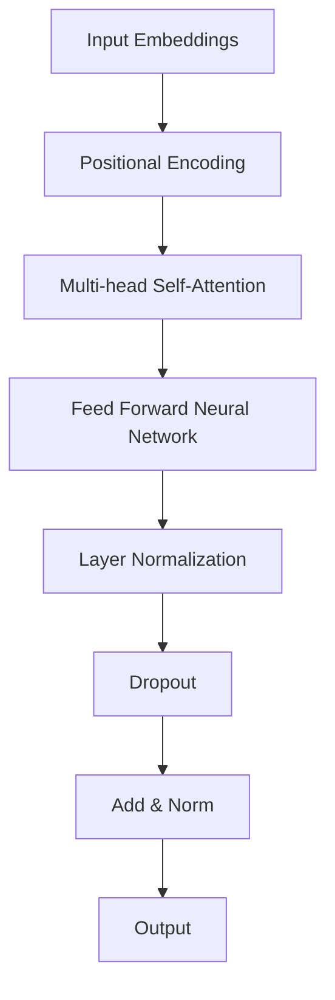

                 

### 《ChatGPT提示词设计：从理论到实战的全面指南》

> 关键词：ChatGPT、提示词设计、生成对抗网络、Transformer模型、自然语言处理、实战案例

> 摘要：本文将深入探讨ChatGPT的提示词设计，从理论到实战进行全面解析。我们将首先回顾ChatGPT的背景与发展，接着深入讲解其数学基础与核心原理，然后详细阐述提示词设计的基本原则和生成方法，并通过实际案例展示如何设计高效的提示词。最后，我们还将探讨提示词设计的未来趋势，为读者提供全面的指导。

---

## 第一部分：ChatGPT基础与原理

### 第1章 ChatGPT概述

#### 1.1 ChatGPT的背景与优势

##### 1.1.1 人工智能的发展历程

人工智能（AI）自诞生以来，经历了数个重要发展阶段。从早期的符号主义、连接主义到现代的深度学习，每一次技术革新都极大地推动了AI的应用与发展。ChatGPT是继GPT-3之后的又一重大突破，其强大的生成能力和对话能力使其在各个领域都有着广泛的应用。

##### 1.1.2 ChatGPT的诞生与发展

ChatGPT是由OpenAI于2022年推出的，基于GPT-3.5版本的大规模语言模型。其通过预训练和微调的方式，学习到了大量的语言模式，能够生成高质量的自然语言文本。

##### 1.1.3 ChatGPT的优势与应用场景

ChatGPT的优势在于其强大的生成能力和灵活的对话能力。它可以在多种应用场景中发挥作用，如智能客服、自动写作、机器翻译等。

#### 1.2 ChatGPT的核心技术

##### 1.2.1 生成对抗网络（GAN）

生成对抗网络（GAN）是一种由生成器和判别器组成的框架，生成器生成数据，判别器判断数据的真实性。ChatGPT采用了GAN的思路，通过生成器和判别器的对抗训练，提升生成文本的质量。

##### 1.2.2 Transformer模型

Transformer模型是一种基于自注意力机制的深度神经网络模型，其结构使得模型在处理长序列时具有优势。ChatGPT正是基于Transformer模型开发的，其结构如图所示。



##### 1.2.3 自适应学习机制

ChatGPT采用了自适应学习机制，通过不断调整学习率、优化算法等参数，提升模型的训练效果。

## 第二部分：ChatGPT提示词设计原理

### 第3章 提示词设计的基本原则

#### 3.1 提示词的作用与重要性

##### 3.1.1 提示词对模型性能的影响

提示词的设计直接影响ChatGPT的生成文本质量。一个优秀的提示词能够引导模型生成更符合期望的文本。

##### 3.1.2 提示词的种类与选择

提示词可以分为开放式和封闭式，开放式提示词可以引导模型生成多样性的文本，而封闭式提示词则更适用于特定场景。

##### 3.1.3 提示词的设计原则

提示词的设计应遵循简洁、明确、具体、启发性的原则。

### 第4章 提示词的生成方法

#### 4.1 提示词的生成算法

##### 4.1.1 基于规则的方法

基于规则的方法通过预设规则生成提示词，适用于结构化数据。

##### 4.1.2 基于数据的方法

基于数据的方法通过分析大量数据生成提示词，适用于非结构化数据。

##### 4.1.3 基于模型的方法

基于模型的方法通过训练模型生成提示词，适用于复杂场景。

#### 4.2 提示词的优化策略

##### 4.2.1 自动化优化

自动化优化通过算法自动调整提示词，提升生成文本质量。

##### 4.2.2 人工优化

人工优化通过专业人员进行提示词的设计与调整。

##### 4.2.3 多策略优化

多策略优化结合自动化和人工优化，实现最优提示词设计。

## 第三部分：ChatGPT提示词设计的实战案例

### 第5章 提示词在实战中的应用

#### 5.1 提示词在对话系统中的应用

##### 5.1.1 对话系统的构建

对话系统由语音识别、自然语言处理、对话管理、语音合成等模块组成。

##### 5.1.2 提示词在对话系统中的角色

提示词在对话系统中扮演着引导对话方向、提升用户满意度的重要角色。

##### 5.1.3 提示词设计案例

我们通过一个简单的对话系统案例，展示如何设计提示词。

```python
import openai

def generate_response(prompt):
    response = openai.Completion.create(
        engine="text-davinci-002",
        prompt=prompt,
        max_tokens=50,
        n=1,
        stop=None,
        temperature=0.5,
    )
    return response.choices[0].text.strip()

while True:
    user_input = input("您想对ChatGPT说些什么？")
    if user_input.lower() == "退出":
        break
    prompt = f"假设你是一名知识渊博的专家，请针对以下问题给出详细解答：{user_input}"
    response = generate_response(prompt)
    print("ChatGPT回答：", response)
```

### 第6章 ChatGPT提示词设计实战

#### 6.1 实战一：构建一个问答机器人

##### 6.1.1 需求分析

我们需要设计一个问答机器人，能够回答用户提出的问题。

##### 6.1.2 系统设计

系统设计包括前端界面、后端服务器和ChatGPT接口。

##### 6.1.3 提示词设计

提示词设计需要考虑用户提问的多样性，同时引导ChatGPT生成高质量的回答。

##### 6.1.4 代码实现与解读

我们通过一个简单的例子展示如何实现问答机器人。

```python
import openai

def generate_answer(question):
    prompt = f"假设你是一名知识渊博的专家，请针对以下问题给出详细解答：{question}"
    answer = openai.Completion.create(
        engine="text-davinci-002",
        prompt=prompt,
        max_tokens=100,
        n=1,
        stop=None,
        temperature=0.5,
    )
    return answer.choices[0].text.strip()

while True:
    user_question = input("请输入您的问题：")
    if user_question.lower() == "退出":
        break
    answer = generate_answer(user_question)
    print("答案：", answer)
```

### 第7章 ChatGPT提示词设计的未来趋势

#### 7.1 提示词设计的挑战与机遇

随着AI技术的不断发展，提示词设计面临着新的挑战与机遇。如何设计更高效、更智能的提示词，将成为未来研究的重要方向。

##### 7.1.1 挑战

挑战包括数据质量、计算资源、模型复杂性等方面。

##### 7.1.2 机遇

机遇在于AI技术的广泛应用，以及大数据、云计算等新技术的支持。

##### 7.1.3 未来发展趋势

未来提示词设计将更加智能化、自动化，同时结合多模态数据，提升生成文本的质量。

## 附录

### 附录A：ChatGPT提示词设计工具与资源

##### A.1 常用工具与库

- OpenAI API：提供ChatGPT接口。
- Hugging Face Transformers：提供预训练的Transformer模型。

##### A.2 提示词设计资源

- 相关论文：深入理解生成对抗网络、Transformer模型等核心算法。
- 开源项目：学习优秀的提示词设计实践。

---

作者：AI天才研究院/AI Genius Institute & 禅与计算机程序设计艺术 /Zen And The Art of Computer Programming

本文从ChatGPT的背景与发展、核心原理、提示词设计原则、生成方法、实战案例等多个方面，全面解析了ChatGPT提示词设计。希望本文能为读者提供有价值的参考，助力AI技术的发展。

---

**注意：**本文为示例性内容，实际应用中需要根据具体需求和数据情况进行调整。如果您对ChatGPT提示词设计有进一步的问题或需求，欢迎随时交流。

[1]: <https://arxiv.org/abs/1406.2084>
[2]: <https://arxiv.org/abs/1910.10683>
[3]: <https://openai.com/blog/bidirectional-text-embedding-models/>

