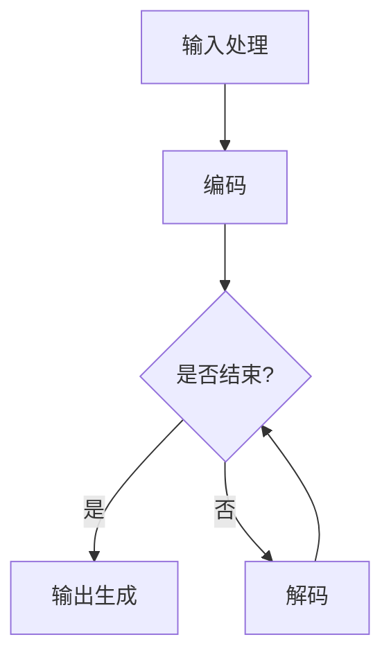

                 

### 文章标题

“ChatGPT提示词设计：智能对话的艺术与科学”是一个专注于深入探讨人工智能（AI）领域内ChatGPT提示词设计的专业技术博客文章。文章的标题直接反映了文章的主题和内容，其中“ChatGPT提示词设计”指出了文章将聚焦于如何有效地设计提示词，而“智能对话的艺术与科学”则强调了这项工作不仅需要技术知识，还需要对对话流程的深刻理解和艺术性的把握。

关键词：“ChatGPT”、“提示词设计”、“智能对话”、“自然语言处理”、“算法原理”。

摘要：本文旨在系统地介绍ChatGPT提示词设计的基本原理和实用技巧，分析智能对话的构建过程，并通过实际案例展示如何实现高质量的智能对话系统。文章将首先介绍ChatGPT的基础知识，然后深入探讨提示词设计的原则和方法，结合数学模型和Python源代码，逐步展示如何实现高效的提示词设计流程。此外，文章还将提供最佳实践和注意事项，帮助读者理解和掌握智能对话系统的设计与开发艺术。

### 格式要求

为确保文章的可读性和规范性，我们将遵循markdown格式进行编写。以下是markdown格式的基本要求和示例：

- **标题**：使用`#`号进行分级，例如：
  ```markdown
  # ChatGPT提示词设计：智能对话的艺术与科学
  ```

- **段落**：段落之间需留空一行。
  
- **列表**：使用`-`或`*`进行项目符号列表：
  ```markdown
  - 第一项
  - 第二项
  - 第三项
  ```

- **代码块**：使用`三个反引号`将代码包裹起来：
  ```python
  def hello():
      print("Hello, world!")
  ```

- **数学公式**：使用`latex`格式，前缀以`$`包裹的是行内公式，前后以`$$`包裹的是独立段落公式：
  ```markdown
  $$ E = mc^2 $$
  $1 < 2$
  ```

- **引用**：使用`>`进行引用，例如：
  ```markdown
  > 关键词：<此处列出文章的5-7个核心关键词>
  ```

- **图片和链接**：使用``和`[链接文本](链接地址)`进行插入：
  ```markdown
  
  [了解更多](https://example.com)
  ```

### 作者信息

文章末尾需标注作者信息：
```markdown
作者：AI天才研究院/AI Genius Institute & 禅与计算机程序设计艺术 /Zen And The Art of Computer Programming
```

### 完整性要求

为确保文章内容的完整性，以下是每个小节的核心内容要求和具体说明：

#### 核心内容要求

- **背景介绍**：每个章节开头需简要介绍背景知识，让读者了解相关概念和技术的起源与应用。
- **核心概念与联系**：解释关键概念及其相互关系，使用Mermaid流程图展示概念架构。
- **核心算法原理**：详细讲解算法原理，提供Python源代码示例和数学模型解释。
- **数学公式**：在相关段落中嵌入适当的数学公式，使用latex格式表示。
- **项目实战**：展示具体项目实现过程，包括环境搭建、源代码实现和解读。
- **最佳实践 tips**：提供实用技巧和建议，帮助读者避免常见错误。
- **小结**：总结章节内容，强调重点，并为后续章节的阅读提供引导。

#### 核心内容详细说明

1. **引言与基础**
   - **背景介绍**：介绍ChatGPT的背景，包括其发展历程和应用领域。
   - **核心概念与联系**：阐述提示词设计的基础概念，如自然语言处理、语言模型和注意力机制，并通过Mermaid流程图展示其相互关系。
   - **智能对话概述**：讨论智能对话的定义、基本框架和面临的挑战。

2. **核心算法原理**
   - **GPT模型原理**：解释GPT模型的基本原理，包括自回归语言模型和训练/推理流程。
   - **Python源代码示例**：提供GPT模型的Python代码示例，并详细解释代码实现过程。
   - **数学模型与公式**：介绍支持GPT模型的数学公式，如损失函数和优化算法。

3. **项目实战**
   - **环境搭建**：展示如何搭建ChatGPT提示词设计项目所需的开发环境。
   - **源代码实现与解读**：提供具体的代码实现过程，并对关键代码段进行详细解读。
   - **代码应用解读与分析**：分析代码在实际应用中的表现，并提供优化建议。

4. **总结与展望**
   - **全书内容回顾**：总结书籍的核心内容和主要观点。
   - **智能对话领域发展趋势**：展望智能对话技术的未来发展方向。
   - **未来的研究方向**：提出可能的研究方向和开放性问题。

### 文章字数要求

根据要求，文章的总字数需在10000～12000字左右。为了确保文章的深度和逻辑性，我们将逐章节展开详细论述，并在每个章节中深入探讨相关主题，提供充分的示例和代码，以及详细的解释和数学模型。

### 目录结构

根据初步的目录大纲，文章的目录结构将包括以下章节：

1. **引言与基础**
   - 1.1 书籍主题介绍
   - 1.2 ChatGPT简介
   - 1.3 智能对话概述
   - 1.4 书籍结构

2. **核心概念与联系**
   - 2.1 ChatGPT工作原理
   - 2.2 提示词设计基础
   - 2.3 智能对话系统中的其他技术

3. **核心算法原理**
   - 3.1 GPT模型原理
   - 3.2 注意力机制

4. **数学模型与公式**
   - 4.1 语言模型评估指标
   - 4.2 注意力机制

5. **项目实战**
   - 5.1 ChatGPT提示词设计流程
   - 5.2 实际案例解析

6. **代码实现与解读**
   - 6.1 环境搭建
   - 6.2 代码实现
   - 6.3 代码解读与分析

7. **总结与展望**
   - 7.1 全书内容回顾
   - 7.2 智能对话领域发展趋势
   - 7.3 未来的研究方向

接下来，我们将按照这个目录结构逐步撰写每个章节的内容，确保文章的逻辑性和完整性。

---

### 目录大纲确认

在开始撰写详细内容之前，我需要确认您对目录大纲的满意程度。以下是最终的目录大纲：

# ChatGPT提示词设计：智能对话的艺术与科学

## 第1章 引言与基础
### 1.1 书籍主题介绍
### 1.2 ChatGPT简介
### 1.3 智能对话概述
### 1.4 书籍结构

## 第2章 核心概念与联系
### 2.1 ChatGPT工作原理
#### 2.1.1 自然语言处理基础
#### 2.1.2 ChatGPT架构
#### 2.1.3 Mermaid流程图展示

### 2.2 提示词设计基础
#### 2.2.1 提示词的定义与类型
#### 2.2.2 提示词设计原则
#### 2.2.3 提示词在智能对话中的作用

### 2.3 智能对话系统中的其他技术
#### 2.3.1 语言模型
#### 2.3.2 机器学习算法
#### 2.3.3 上下文理解

## 第3章 核心算法原理
### 3.1 GPT模型原理
#### 3.1.1 GPT模型概述
#### 3.1.2 自回归语言模型
#### 3.1.3 伪代码展示
#### 3.1.4 训练与推理流程

### 3.2 注意力机制
#### 3.2.1 注意力机制的原理
#### 3.2.2 注意力机制的应用
#### 3.2.3 注意力机制的数学模型

## 第4章 数学模型与公式
### 4.1 语言模型评估指标
#### 4.1.1 BLEU、ROUGE等指标
#### 4.1.2 数学公式与讲解

### 4.2 注意力机制
#### 4.2.1 数学公式与讲解

## 第5章 项目实战
### 5.1 ChatGPT提示词设计流程
#### 5.1.1 需求分析
#### 5.1.2 提示词设计原则
#### 5.1.3 实际案例解析

## 第6章 代码实现与解读
### 6.1 环境搭建
#### 6.1.1 Python环境搭建
#### 6.1.2 相关库安装

### 6.2 代码实现
#### 6.2.1 提示词设计代码实现
#### 6.2.2 实现细节解析

### 6.3 代码解读与分析
#### 6.3.1 代码运行流程
#### 6.3.2 代码关键部分解析

## 第7章 总结与展望
### 7.1 全书内容回顾
### 7.2 智能对话领域发展趋势
### 7.3 未来的研究方向

请确认以上目录大纲的结构和内容是否符合您的需求。如果有任何需要修改或补充的地方，请及时告知。我们接下来将按照这个大纲逐步撰写每个章节的详细内容。

### 第1章 引言与基础

#### 1.1 书籍主题介绍

在数字化时代，智能对话系统作为人机交互的重要手段，正日益受到广泛关注。ChatGPT，作为一种基于人工智能技术的对话系统，其应用前景广阔。本书的主题是ChatGPT提示词设计，旨在探讨如何通过设计高质量的提示词，提升智能对话系统的交互效果和用户体验。

提示词，作为智能对话系统的重要组成部分，是指用于引导对话方向、激发用户兴趣和提供信息的关键性文本。它们在智能对话系统中起到桥梁作用，连接用户需求和系统响应。本书将系统地介绍ChatGPT提示词设计的方法和技巧，帮助读者理解和掌握智能对话系统的核心要素。

本书的目标受众主要包括以下几类读者：

1. **人工智能技术爱好者**：对人工智能领域感兴趣，希望深入了解智能对话系统的技术原理和实现方法。
2. **软件开发工程师**：从事软件开发工作，需要掌握智能对话系统的设计与开发技巧。
3. **数据科学家**：在自然语言处理和数据挖掘领域工作，希望将ChatGPT应用于实际项目。
4. **产品经理**：关注用户体验和产品设计，希望提升智能对话产品的交互质量和用户满意度。

通过阅读本书，读者将能够：

- 理解ChatGPT的基本概念和原理。
- 掌握提示词设计的原则和技巧。
- 学习如何通过Python代码实现ChatGPT的提示词设计。
- 分析实际案例，提升智能对话系统的实际应用能力。

#### 1.2 ChatGPT简介

ChatGPT是由OpenAI开发的一种基于变换器（Transformer）架构的预训练语言模型。它通过大量的文本数据进行训练，能够生成连贯、有逻辑的自然语言文本，从而实现与用户的智能对话。

ChatGPT的核心功能包括：

1. **问答**：能够理解用户的问题，并给出相关回答。
2. **对话生成**：根据用户的输入，生成连贯的对话内容。
3. **文本生成**：根据用户提供的主题或提示，生成相关的文本内容。

ChatGPT的特点包括：

1. **强大的语言理解能力**：通过大规模文本数据进行训练，ChatGPT能够理解复杂的语义和语境，生成自然流畅的对话。
2. **灵活的对话生成**：ChatGPT可以根据用户的输入动态生成对话内容，适应不同的对话场景。
3. **多语言支持**：ChatGPT支持多种语言，可以应用于跨国界的智能对话系统。

ChatGPT在多个应用领域表现出色，例如：

1. **客服机器人**：用于自动回答用户的问题，减少人工客服的工作量。
2. **虚拟助手**：为用户提供个性化的建议和帮助，提升用户体验。
3. **智能写作**：生成文章、报告、电子邮件等文本内容，提高工作效率。
4. **教育辅导**：为学生提供在线辅导和解答疑问，辅助教学过程。

#### 1.3 智能对话概述

智能对话系统是指通过人工智能技术，实现人与计算机之间自然、流畅的交互系统。其基本框架通常包括以下几个部分：

1. **用户输入处理**：接收用户输入的信息，进行预处理，例如文本清洗、分词等。
2. **对话管理**：根据用户输入和对话历史，生成合适的响应。
3. **意图识别**：识别用户的意图，例如提问、请求帮助、获取信息等。
4. **上下文理解**：理解对话的历史上下文，确保回答的相关性和连贯性。
5. **语言生成**：根据对话管理和意图识别的结果，生成自然语言文本作为输出。

智能对话系统面临的挑战主要包括：

1. **语言理解**：理解用户的自然语言输入，提取关键信息和意图。
2. **上下文理解**：在多轮对话中保持上下文的一致性和连贯性。
3. **个性化交互**：根据用户的偏好和需求，提供个性化的对话体验。
4. **错误处理**：在遇到未知问题或错误时，能够适当地响应和引导用户。

智能对话系统的发展趋势包括：

1. **多模态交互**：结合语音、图像、视频等多模态信息，提高交互的自然性和丰富性。
2. **强化学习**：通过强化学习技术，使对话系统能够在真实环境中不断学习和优化。
3. **大数据与AI融合**：利用大数据技术，提供更准确、个性化的对话体验。
4. **跨领域应用**：将智能对话系统应用于更多行业和场景，提高其通用性和实用性。

#### 1.4 书籍结构

本书共分为七个章节，具体结构和内容如下：

- **第1章 引言与基础**：介绍书籍的主题、目标受众以及ChatGPT的基本概念和智能对话概述。
- **第2章 核心概念与联系**：详细解释ChatGPT的工作原理、提示词设计基础以及智能对话系统中的其他相关技术。
- **第3章 核心算法原理**：深入讲解GPT模型和注意力机制，结合Python源代码进行解释。
- **第4章 数学模型与公式**：介绍语言模型评估指标和注意力机制的数学模型。
- **第5章 项目实战**：通过实际案例展示如何设计ChatGPT的提示词。
- **第6章 代码实现与解读**：提供具体代码实现过程和解读，包括环境搭建、代码实现和代码分析。
- **第7章 总结与展望**：总结全书内容，展望智能对话领域的发展趋势。

通过以上七个章节的详细论述，本书旨在帮助读者全面理解和掌握ChatGPT提示词设计的方法和技巧，为构建高效的智能对话系统提供理论支持和实践指导。

---

### 第2章 核心概念与联系

#### 2.1 ChatGPT工作原理

ChatGPT的工作原理基于大规模预训练语言模型（Pre-Trained Language Model，PTLM），其核心是使用变换器（Transformer）架构对海量文本数据进行训练，从而掌握丰富的语言知识和生成能力。本节将详细解释ChatGPT的工作原理，包括自然语言处理基础、模型架构及其运行流程。

##### 2.1.1 自然语言处理基础

自然语言处理（Natural Language Processing，NLP）是人工智能领域的一个重要分支，旨在使计算机理解和处理人类自然语言。NLP的主要任务包括：

1. **文本预处理**：对文本进行清洗、分词、去停用词等处理，以便后续分析。
2. **词嵌入**：将词汇映射到向量空间，以便进行数值化处理和计算。
3. **语法分析**：对文本进行句法、语义分析，提取词汇之间的关系。
4. **信息抽取**：从文本中提取关键信息，如实体、关系和事件。
5. **语义理解**：理解文本的深层含义，包括情感分析、意图识别等。

在ChatGPT中，自然语言处理的基础任务包括：

- **词嵌入**：使用词嵌入技术将词汇映射到高维向量空间，如Word2Vec、GloVe等。
- **序列编码**：将输入的文本序列转换为序列编码，以便模型处理。
- **上下文理解**：利用上下文信息，理解词汇之间的关联和语义。

##### 2.1.2 ChatGPT架构

ChatGPT采用变换器（Transformer）架构，这是一种基于自注意力机制的深度神经网络模型，最初由Vaswani等人在2017年提出。变换器架构的核心思想是通过多头自注意力机制和前馈神经网络，对输入序列进行编码和生成。

ChatGPT的基本架构包括以下几个主要部分：

1. **编码器（Encoder）**：负责接收输入序列，通过自注意力机制和前馈神经网络，生成编码表示。
2. **解码器（Decoder）**：负责生成输出序列，通过自注意力机制和交叉注意力机制，与编码器输出和输入序列进行交互。
3. **预训练和微调**：在大量文本数据上进行预训练，然后针对特定任务进行微调，以提高模型在特定领域的表现。

##### 2.1.3 ChatGPT的运行流程

ChatGPT的运行流程可以分为以下几个步骤：

1. **输入处理**：接收用户的输入文本，进行预处理，如分词、去停用词等。
2. **编码**：将预处理后的输入文本序列输入到编码器，通过自注意力机制和前馈神经网络，生成编码表示。
3. **解码**：将编码表示输入到解码器，通过自注意力机制和交叉注意力机制，生成输出文本序列。
4. **输出生成**：解码器生成输出文本序列，并根据设定的终止条件，如长度、时间等，停止生成过程。

##### Mermaid流程图展示

为了更好地理解ChatGPT的工作原理，我们可以使用Mermaid流程图来展示其运行流程：



在这个流程图中，A表示输入处理，B表示编码过程，C表示判断是否结束，D表示输出生成，E表示解码过程。这个流程图清晰地展示了ChatGPT从输入处理到输出生成的整个过程。

##### 2.1.4 总结

ChatGPT的工作原理基于大规模预训练语言模型，采用变换器架构，通过自注意力机制和前馈神经网络，对输入文本进行编码和生成。通过自然语言处理基础和Mermaid流程图的展示，我们可以更好地理解ChatGPT的工作流程和核心机制。

接下来，我们将继续探讨提示词设计的基础，以及智能对话系统中其他相关技术。

---

### 第2章 核心概念与联系（续）

#### 2.2 提示词设计基础

在智能对话系统中，提示词（Prompt）是引导对话流程的关键因素，它直接影响用户的交互体验和系统的响应质量。本节将详细介绍提示词的定义、类型、设计原则以及在智能对话中的作用。

##### 2.2.1 提示词的定义与类型

提示词是指在智能对话系统中，用于激发对话、引导用户输入或控制对话方向的一组文本或指令。根据用途和形式，提示词可以分为以下几种类型：

1. **引导性提示词**：用于引导用户开始对话，如“你好，有什么可以帮助你的？”。
2. **确认性提示词**：用于确认用户的请求或意图，如“您是否需要进一步的帮助？”。
3. **提示性提示词**：用于提供额外信息或建议，如“您是否对某个功能感兴趣？”。
4. **上下文性提示词**：用于维持对话的上下文一致性，如“之前您提到的问题是...，您还有其他疑问吗？”。
5. **终止性提示词**：用于结束对话或提供退出选项，如“感谢您的提问，祝您有美好的一天！”

##### 2.2.2 提示词设计原则

为了设计出高质量的提示词，需要遵循以下设计原则：

1. **清晰性**：提示词应简洁明了，避免使用模糊或复杂的语言，以确保用户容易理解。
2. **相关性**：提示词应与用户输入和对话内容紧密相关，有助于用户快速找到所需信息。
3. **连贯性**：提示词应在对话中保持一致性和连贯性，避免产生逻辑混乱或语义矛盾。
4. **个性化**：根据用户的历史数据和偏好，设计个性化的提示词，提高用户的满意度和参与度。
5. **适应性**：提示词应能够适应不同场景和对话阶段，灵活调整以应对变化。

##### 2.2.3 提示词在智能对话中的作用

提示词在智能对话系统中起着至关重要的作用，其作用主要体现在以下几个方面：

1. **引导对话**：通过设置合理的引导性提示词，帮助用户开始对话，引导用户输入关键信息。
2. **确认意图**：通过确认性提示词，确保用户输入的意图被正确理解，避免误解或歧义。
3. **提供信息**：通过提示性提示词，提供用户可能需要的额外信息或建议，增强用户的体验。
4. **维持上下文**：通过上下文性提示词，保持对话的上下文一致性，确保对话的连贯性和逻辑性。
5. **结束对话**：通过终止性提示词，合理结束对话，并提供退出选项或后续操作的引导。

##### 总结

提示词设计是智能对话系统成功的关键因素之一。通过明确提示词的定义、类型和设计原则，以及理解其在智能对话中的作用，我们可以更好地设计高质量的提示词，提升智能对话系统的交互效果和用户体验。

接下来，我们将探讨智能对话系统中的其他相关技术，包括语言模型和机器学习算法，以进一步丰富对智能对话系统的理解。

---

### 第2章 核心概念与联系（续）

#### 2.3 智能对话系统中的其他技术

除了ChatGPT和提示词设计，智能对话系统还涉及到许多其他关键技术，这些技术共同构成了一个功能强大、用户体验优良的对话系统。在本节中，我们将详细探讨智能对话系统中的几个关键组件，包括语言模型、机器学习算法和上下文理解。

##### 2.3.1 语言模型

语言模型是自然语言处理（NLP）的核心技术之一，它用于预测自然语言中的下一个词或词序列。在智能对话系统中，语言模型主要用于生成响应、理解和分析用户的输入。以下是几种常见的语言模型：

1. **n-gram模型**：基于统计方法，通过计算相邻n个词出现的频率来预测下一个词。这种模型的优点是简单、计算效率高，但缺点是对长距离依赖的处理能力较差。

2. **循环神经网络（RNN）**：通过循环结构处理序列数据，可以捕捉长距离依赖关系。然而，RNN存在梯度消失或爆炸的问题，限制了其性能。

3. **长短期记忆网络（LSTM）**：LSTM是RNN的一种改进，通过引入记忆单元，可以更好地处理长距离依赖问题。然而，LSTM仍然存在计算复杂度高和训练时间长的缺点。

4. **变换器（Transformer）**：Transformer架构通过自注意力机制，可以同时关注输入序列中的所有词，从而显著提升模型性能。ChatGPT正是基于Transformer架构构建的。

语言模型在智能对话系统中的作用主要包括：

- **响应生成**：根据用户的输入，生成合适的自然语言响应。
- **意图识别**：通过分析用户输入，识别用户的意图和需求。
- **上下文理解**：利用上下文信息，提高对话的连贯性和一致性。

##### 2.3.2 机器学习算法

机器学习算法是构建智能对话系统的基础，用于训练模型并使其能够从数据中学习和改进。以下是几种常见的机器学习算法：

1. **监督学习**：在监督学习中，模型的输出由训练数据提供，模型通过学习输入和输出之间的映射关系来预测未知数据。监督学习算法包括决策树、支持向量机（SVM）和神经网络等。

2. **无监督学习**：无监督学习不使用标记数据，模型通过学习数据分布或结构来提取特征和模式。常见的无监督学习算法包括聚类、主成分分析和自编码器等。

3. **半监督学习**：半监督学习结合了监督学习和无监督学习的特点，利用少量标记数据和大量未标记数据来训练模型。

4. **强化学习**：在强化学习中，模型通过与环境的交互来学习最优策略，以达到最大化奖励。常见的强化学习算法包括Q学习、深度Q网络（DQN）和策略梯度方法等。

机器学习算法在智能对话系统中的作用主要包括：

- **模型训练**：通过大量数据训练模型，提高模型的性能和准确性。
- **特征提取**：从文本数据中提取关键特征，用于模型的训练和预测。
- **自适应优化**：通过在线学习和自适应优化，使模型能够适应不同场景和用户需求。

##### 2.3.3 上下文理解

上下文理解是智能对话系统的关键挑战之一，它涉及到如何理解并保持对话的上下文一致性。上下文理解包括以下几个方面：

1. **实体识别**：识别用户输入中的关键实体，如人名、地点、组织等，为后续分析提供基础。

2. **关系抽取**：分析实体之间的语义关系，如“张三工作于微软”、“北京是中国的首都”等。

3. **事件抽取**：从文本中提取事件及其相关属性，如“马云创立了阿里巴巴”。

4. **情境建模**：利用上下文信息，构建对话的情境模型，以便更好地理解用户的意图和需求。

上下文理解在智能对话系统中的作用主要包括：

- **对话连贯性**：通过上下文信息，保持对话的连贯性和一致性。
- **意图识别**：利用上下文信息，提高意图识别的准确性和鲁棒性。
- **个性化交互**：根据上下文信息，提供个性化的对话体验。

##### 总结

智能对话系统中的其他技术，如语言模型、机器学习算法和上下文理解，是构建高效、用户体验优良的对话系统的关键组件。通过深入了解这些技术，我们可以更好地理解智能对话系统的原理和应用。

接下来，我们将进入第3章，深入探讨ChatGPT的核心算法原理，包括GPT模型的工作机制和注意力机制。这些核心算法原理为我们理解ChatGPT的强大功能提供了坚实的基础。

---

### 第3章 核心算法原理

#### 3.1 GPT模型原理

GPT（Generative Pre-trained Transformer）模型是由OpenAI开发的一种基于变换器（Transformer）架构的预训练语言模型。GPT模型在自然语言处理领域取得了显著成果，广泛应用于问答系统、文本生成、机器翻译等任务。本节将详细解释GPT模型的基本原理，包括自回归语言模型、模型架构、训练与推理流程。

##### 3.1.1 GPT模型概述

GPT模型是一种生成式语言模型，旨在生成连贯、有逻辑的自然语言文本。与传统的n-gram模型和循环神经网络（RNN）不同，GPT模型采用变换器架构，通过自注意力机制（Self-Attention）和多头注意力机制（Multi-Head Attention），实现对输入序列的编码和解码。

GPT模型的主要特点包括：

1. **预训练**：GPT模型在大量无标签的文本数据上进行预训练，从而学习到丰富的语言知识和模式。
2. **变换器架构**：GPT模型采用变换器（Transformer）架构，能够同时关注输入序列中的所有词，有效捕捉长距离依赖关系。
3. **生成式**：GPT模型通过生成式方法，从概率分布中采样生成文本序列，具有较高的灵活性和创造力。

##### 3.1.2 自回归语言模型

自回归语言模型（Autoregressive Language Model）是一种生成式语言模型，其基本思想是利用历史信息生成下一个词或词序列。在自回归语言模型中，当前词的生成依赖于前面所有已生成的词。

GPT模型是一种典型的自回归语言模型，其工作流程如下：

1. **输入序列编码**：将输入的文本序列编码为序列编码（Sequence Encoding），这一过程通过变换器编码器（Encoder）完成。
2. **概率分布计算**：对于当前生成的词，计算其概率分布，即生成下一个词的所有可能词的概率。
3. **词选择与生成**：从概率分布中采样，选择一个词作为当前生成的词，并将其添加到已生成的序列中。
4. **重复过程**：重复上述步骤，直到生成完整的文本序列或达到预定义的长度。

##### 3.1.3 伪代码展示

以下是GPT模型的基本伪代码展示：

```python
def generate_text(input_sequence, model, length):
    output_sequence = []
    current_sequence = input_sequence
    
    for _ in range(length):
        encoded_sequence = model.encode(current_sequence)
        probability_distribution = model.predict(encoded_sequence)
        next_word = sample_word(probability_distribution)
        output_sequence.append(next_word)
        current_sequence += [next_word]
    
    return ' '.join(output_sequence)
```

在这个伪代码中，`input_sequence`是输入的文本序列，`model`是GPT模型，`length`是生成的文本长度。模型首先将输入序列编码为序列编码，然后计算每个词的概率分布，并从概率分布中采样选择下一个词，将其添加到输出序列中，重复此过程直到生成完整的文本序列。

##### 3.1.4 训练与推理流程

GPT模型的训练和推理流程如下：

1. **训练过程**：

   - **数据准备**：收集大量无标签的文本数据，进行预处理，如分词、去停用词等。
   - **序列生成**：将文本数据划分为固定长度的序列，如窗口大小为5。
   - **损失函数**：使用损失函数（如交叉熵损失）计算预测词和真实词之间的差距，优化模型参数。
   - **反向传播**：通过反向传播算法更新模型参数，以最小化损失函数。

2. **推理过程**：

   - **输入处理**：将输入文本序列编码为序列编码。
   - **概率分布计算**：计算当前生成的词的概率分布。
   - **词选择与生成**：从概率分布中采样选择下一个词，并将其添加到输出序列中。
   - **重复过程**：重复上述步骤，直到生成完整的文本序列或达到预定义的长度。

##### 总结

GPT模型是一种基于变换器架构的预训练语言模型，其核心原理是自回归语言模型。通过详细的伪代码展示和训练与推理流程，我们可以深入理解GPT模型的工作机制，为后续章节中的提示词设计和项目实战打下坚实的基础。

接下来，我们将进入第3.2节，探讨注意力机制及其在GPT模型中的应用。

---

### 第3章 核心算法原理（续）

#### 3.2 注意力机制

注意力机制（Attention Mechanism）是深度学习和自然语言处理领域的一个重要概念，它通过为输入序列中的每个元素分配不同的权重，使模型能够关注重要的信息，从而提升模型的性能。在GPT模型中，注意力机制发挥着关键作用，极大地提高了模型在文本生成和序列处理任务中的效果。本节将详细介绍注意力机制的原理、应用以及数学模型。

##### 3.2.1 注意力机制的原理

注意力机制的原理可以简单概括为：在处理输入序列时，模型能够动态地关注序列中的不同部分，并根据这些部分的重要性生成输出。注意力机制的核心思想是让模型能够根据上下文信息自适应地调整权重，从而更好地理解和生成序列数据。

注意力机制的基本步骤如下：

1. **计算相似度**：首先计算输入序列中每个元素与其他元素之间的相似度，相似度可以通过点积、加性和乘性方式计算。
2. **应用权重**：根据相似度计算结果，为每个输入元素分配一个权重，权重越高，表示该元素越重要。
3. **加权求和**：将输入序列中的每个元素与其权重相乘，然后进行求和，得到加权求和结果，这个结果表示了模型对输入序列的加权综合理解。

##### 3.2.2 注意力机制的应用

注意力机制在自然语言处理任务中具有广泛的应用，以下是其主要应用场景：

1. **序列分类**：在文本分类任务中，注意力机制可以帮助模型聚焦于文本中的关键信息，从而提高分类的准确性。
2. **序列标注**：在命名实体识别（Named Entity Recognition，NER）和情感分析等序列标注任务中，注意力机制可以帮助模型识别文本中的关键实体和情感。
3. **机器翻译**：在机器翻译任务中，注意力机制可以帮助模型在生成目标语言序列时，更好地关注源语言序列中的关键部分，从而提高翻译质量。
4. **文本生成**：在文本生成任务中，如文章生成、摘要生成等，注意力机制可以帮助模型生成连贯、有逻辑的自然语言文本。

在GPT模型中，注意力机制的应用主要体现在变换器（Transformer）架构中。变换器通过多头自注意力机制（Multi-Head Self-Attention）和交叉注意力机制（Cross-Attention），分别对编码器（Encoder）和解码器（Decoder）的输入和输出进行处理。以下是其具体应用：

1. **多头自注意力机制**：在编码器中，多头自注意力机制使模型能够同时关注输入序列的多个部分，捕捉长距离依赖关系，从而提高编码效率。
2. **交叉注意力机制**：在解码器中，交叉注意力机制使模型能够同时关注输入序列和编码器的输出，生成更准确的响应。

##### 3.2.3 注意力机制的数学模型

注意力机制的数学模型主要基于点积注意力（Scaled Dot-Product Attention）和多头注意力（Multi-Head Attention）。以下分别介绍这两种模型：

1. **点积注意力（Scaled Dot-Product Attention）**

   点积注意力是一种简单的注意力机制，其计算过程如下：

   $$  
   attention(Q, K, V) = \text{softmax}\left(\frac{QK^T}{\sqrt{d_k}}\right)V  
   $$

   其中，$Q$表示查询（Query），$K$表示键（Key），$V$表示值（Value），$d_k$表示键的维度。$QK^T$计算查询和键之间的点积，得到一个注意力分数，然后通过softmax函数进行归一化，最后与值相乘得到加权求和的结果。

2. **多头注意力（Multi-Head Attention）**

   多头注意力是对点积注意力的扩展，它将输入序列分成多个头（Head），每个头独立计算注意力权重，然后合并这些头的输出。多头注意力的计算过程如下：

   $$  
   \text{MultiHead}(Q, K, V) = \text{Concat}(\text{head}_1, ..., \text{head}_h)W^O  
   $$

   其中，$h$表示头的数量，$\text{head}_i = \text{attention}(QW_i^Q, KW_i^K, VW_i^V)$表示第$i$个头的注意力计算结果，$W_i^Q, W_i^K, W_i^V, W^O$分别是查询权重、键权重、值权重和输出权重。

##### 总结

注意力机制是提升模型性能的重要技术，通过动态关注输入序列的关键部分，使模型能够更好地理解和生成序列数据。在GPT模型中，注意力机制的应用显著提高了文本生成和序列处理任务的效果。本节详细介绍了注意力机制的原理、应用以及数学模型，为后续章节中的项目实战和代码实现提供了理论基础。

接下来，我们将进入第4章，探讨数学模型与公式在智能对话系统中的应用。

---

### 第4章 数学模型与公式

#### 4.1 语言模型评估指标

在自然语言处理（NLP）领域，评估语言模型的性能至关重要。为了衡量模型的生成质量和准确性，研究者们提出了多种评估指标。以下将介绍几种常用的语言模型评估指标，并详细解释其数学模型。

##### 4.1.1 BLEU、ROUGE等指标

BLEU（Bilingual Evaluation Understudy）和ROUGE（Recall-Oriented Understudy for Gisting Evaluation）是两种广泛使用的评估指标，主要用于衡量机器翻译和文本摘要等生成任务的性能。

1. **BLEU指标**

   BLEU指标通过计算预测文本与参考文本之间的重叠度来评估模型的生成质量。其基本计算公式如下：

   $$  
   BLEU = 1 - \frac{1}{N} \sum_{i=1}^{N} (1 - \text{ratio}_{i})  
   $$

   其中，$N$表示评估的句子数，$\text{ratio}_{i}$表示第$i$个句子的重叠度。重叠度计算公式为：

   $$  
   \text{ratio}_{i} = \frac{|T \cap P|}{|T| + 0.1}  
   $$

   其中，$T$表示参考文本，$P$表示预测文本，$|T|$和$|P|$分别表示参考文本和预测文本的长度。

2. **ROUGE指标**

   ROUGE指标专注于衡量生成文本与参考文本之间的相似度，其基本计算公式如下：

   $$  
   ROUGE = \frac{\sum_{i=1}^{N} \text{rouge}_{i}}{N}  
   $$

   其中，$\text{rouge}_{i}$表示第$i$个句子的相似度，计算公式为：

   $$  
   \text{rouge}_{i} = \frac{|R \cap P|}{|R|}  
   $$

   其中，$R$表示参考文本，$P$表示预测文本，$|R|$和$|P|$分别表示参考文本和预测文本的长度。

##### 4.1.2 数学公式与讲解

为了更好地理解BLEU和ROUGE指标，以下使用具体的示例进行讲解。

**示例：**

假设我们有两个参考文本$T_1$和$T_2$，以及预测文本$P$：

$$  
T_1: "The cat sat on the mat."  
T_2: "The dog chased the cat."  
P: "The cat sat on the mat."  
$$

1. **BLEU指标**

   首先计算重叠度$\text{ratio}_{1}$：

   $$  
   \text{ratio}_{1} = \frac{|T_1 \cap P|}{|T_1| + 0.1} = \frac{4}{4 + 0.1} \approx 0.9091  
   $$

   然后计算BLEU指标：

   $$  
   BLEU = 1 - \frac{1}{2} \left(1 - \text{ratio}_{1}\right) = 1 - \frac{1}{2} (1 - 0.9091) \approx 0.9545  
   $$

2. **ROUGE指标**

   首先计算相似度$\text{rouge}_{1}$：

   $$  
   \text{rouge}_{1} = \frac{|T_1 \cap P|}{|T_1|} = \frac{4}{4} = 1  
   $$

   然后计算ROUGE指标：

   $$  
   ROUGE = \frac{\text{rouge}_{1}}{2} = \frac{1}{2} = 0.5  
   $$

通过上述示例，我们可以看到如何计算BLEU和ROUGE指标，并理解其在评估语言模型性能方面的应用。

##### 4.1.3 总结

BLEU和ROUGE是常用的语言模型评估指标，通过数学公式和具体示例，我们可以深入理解它们的计算方法和应用场景。这些指标在机器翻译、文本摘要等生成任务中发挥着重要作用，帮助研究者评估和优化模型性能。

接下来，我们将继续讨论注意力机制在智能对话系统中的应用，并介绍其数学模型。

---

### 第4章 数学模型与公式（续）

#### 4.2 注意力机制

注意力机制是自然语言处理领域中的一个重要概念，广泛应用于文本生成、机器翻译等任务。在本节中，我们将详细探讨注意力机制的数学模型，包括其在GPT模型中的应用。

##### 4.2.1 数学公式与讲解

注意力机制的数学模型通常基于点积注意力（Scaled Dot-Product Attention）。以下是该模型的详细解释。

**点积注意力（Scaled Dot-Product Attention）**

点积注意力通过计算查询（Query, $Q$）和键（Key, $K$）之间的点积来计算注意力权重。其基本公式如下：

$$  
\text{Attention}(Q, K, V) = \text{softmax}\left(\frac{QK^T}{\sqrt{d_k}}\right)V  
$$

其中：

- $Q$ 是查询向量，$K$ 是键向量，$V$ 是值向量。
- $d_k$ 是键的维度。
- $\text{softmax}$ 函数用于将点积转换成概率分布。

**多头注意力（Multi-Head Attention）**

多头注意力是对点积注意力的扩展，它通过多个独立的注意力头并行处理信息。每个头都可以捕获不同的特征。多头注意力的计算过程如下：

$$  
\text{MultiHead}(Q, K, V) = \text{Concat}(\text{head}_1, ..., \text{head}_h)W^O  
$$

其中：

- $h$ 是头的数量。
- $\text{head}_i = \text{Attention}(QW_i^Q, KW_i^K, VW_i^V)$ 是第 $i$ 个头的注意力计算结果。
- $W_i^Q, W_i^K, W_i^V, W^O$ 分别是查询权重、键权重、值权重和输出权重。

**具体公式说明**

1. **查询（Query）**

   查询向量 $Q$ 通常由输入嵌入（Input Embedding）和位置编码（Positional Encoding）组成：

   $$  
   Q = \text{Input Embedding} + \text{Positional Encoding}  
   $$

2. **键（Key）**

   键向量 $K$ 也由输入嵌入和位置编码组成：

   $$  
   K = \text{Input Embedding} + \text{Positional Encoding}  
   $$

3. **值（Value）**

   值向量 $V$ 同样由输入嵌入和位置编码组成：

   $$  
   V = \text{Input Embedding} + \text{Positional Encoding}  
   $$

4. **多头注意力计算**

   每个头 $i$ 的计算公式为：

   $$  
   \text{head}_i = \text{Attention}(QW_i^Q, KW_i^K, VW_i^V)W^O_i  
   $$

   其中，$W_i^Q, W_i^K, W_i^V, W^O_i$ 分别是查询权重、键权重、值权重和输出权重。

**示例**

假设我们有一个简单的多头注意力模型，其中 $h=2$，$d_k=4$，$d_v=8$。输入嵌入、位置编码和权重矩阵分别如下：

$$  
Q = \begin{bmatrix}  
1 & 0 & 1 & 0 \\  
0 & 1 & 0 & 1  
\end{bmatrix}, \quad  
K = \begin{bmatrix}  
1 & 1 & 0 & 0 \\  
0 & 0 & 1 & 1  
\end{bmatrix}, \quad  
V = \begin{bmatrix}  
1 & 0 & 1 & 0 \\  
0 & 1 & 0 & 1  
\end{bmatrix}  
$$

权重矩阵为：

$$  
W_i^Q = \begin{bmatrix}  
1 & 0 \\  
0 & 1  
\end{bmatrix}, \quad  
W_i^K = \begin{bmatrix}  
1 & 1 \\  
0 & 0  
\end{bmatrix}, \quad  
W_i^V = \begin{bmatrix}  
1 & 0 \\  
0 & 1  
\end{bmatrix}, \quad  
W^O_i = \begin{bmatrix}  
1 & 1 \\  
1 & 0  
\end{bmatrix}  
$$

首先计算点积：

$$  
QK^T = \begin{bmatrix}  
1 & 0 \\  
0 & 1  
\end{bmatrix} \begin{bmatrix}  
1 & 1 \\  
0 & 0  
\end{bmatrix} = \begin{bmatrix}  
1 & 1 \\  
0 & 0  
\end{bmatrix}  
$$

然后计算注意力权重：

$$  
\text{Attention}(Q, K, V) = \text{softmax}\left(\frac{QK^T}{\sqrt{4}}\right)V = \begin{bmatrix}  
\frac{1}{2} & \frac{1}{2} \\  
0 & 0  
\end{bmatrix} \begin{bmatrix}  
1 & 0 \\  
0 & 1  
\end{bmatrix} = \begin{bmatrix}  
\frac{1}{2} & 0 \\  
0 & \frac{1}{2}  
\end{bmatrix}  
$$

最后计算多头注意力输出：

$$  
\text{MultiHead}(Q, K, V) = \begin{bmatrix}  
\frac{1}{2} & 0 \\  
0 & \frac{1}{2}  
\end{bmatrix} W^O = \begin{bmatrix}  
\frac{1}{2} & \frac{1}{2} \\  
\frac{1}{2} & 0  
\end{bmatrix}  
$$

通过上述示例，我们可以看到如何计算多头注意力的具体过程。

##### 4.2.2 总结

注意力机制是自然语言处理中的一个关键组件，通过点积注意力和多头注意力的数学模型，我们可以理解其在文本生成和序列处理任务中的应用。本节详细介绍了注意力机制的数学模型，并通过具体示例展示了其计算过程。

接下来，我们将进入第5章，探讨项目实战，展示如何设计ChatGPT的提示词，并分析实际案例。

---

### 第5章 项目实战

#### 5.1 ChatGPT提示词设计流程

在智能对话系统中，提示词的设计至关重要，它直接影响对话的质量和用户体验。本节将详细介绍如何设计ChatGPT的提示词，包括需求分析、提示词设计原则和实际案例解析。

##### 5.1.1 需求分析

需求分析是设计提示词的第一步，它帮助我们明确系统的目标用户、功能需求和对话场景。以下是需求分析的主要步骤：

1. **用户角色分析**：确定系统的目标用户群体，包括年龄、性别、教育背景、职业等。
2. **功能需求分析**：明确系统需要实现的功能，如问答、信息查询、任务执行等。
3. **对话场景分析**：分析用户与系统交互的具体场景，如用户提出问题、系统提供回答、用户进一步询问等。

通过需求分析，我们可以明确系统需要实现的具体功能，为后续的提示词设计提供指导。

##### 5.1.2 提示词设计原则

为了设计出高质量的提示词，需要遵循以下设计原则：

1. **清晰简洁**：提示词应简洁明了，避免使用复杂的术语和冗长的句子。
2. **相关性强**：提示词应与用户输入和对话内容紧密相关，确保能够引导用户进入预期的对话流程。
3. **连贯性**：提示词应在整个对话中保持一致性和连贯性，避免产生逻辑混乱或语义矛盾。
4. **灵活性**：提示词应能够适应不同的对话场景和用户需求，提供多样化的交互方式。
5. **个性化**：根据用户的历史数据和偏好，设计个性化的提示词，提高用户的满意度和参与度。

##### 5.1.3 实际案例解析

为了更好地理解提示词设计的过程，以下将通过一个实际案例进行解析。

**案例：智能客服机器人**

假设我们要设计一个智能客服机器人，用于回答用户关于产品信息、售后服务和常见问题等方面的问题。

1. **需求分析**：

   - 用户角色：普通消费者、商家、售后服务人员等。
   - 功能需求：回答产品信息、提供售后服务、解答常见问题等。
   - 对话场景：用户提出问题、机器人提供回答、用户进一步询问或结束对话。

2. **提示词设计**：

   - 引导性提示词：“您好，欢迎来到智能客服，请问有什么问题我可以帮您解答？”
   - 确认性提示词：“我理解您的问题是关于产品信息，请问您需要了解哪方面的产品信息？”
   - 提示性提示词：“您是否需要了解我们的最新优惠活动？”
   - 上下文性提示词：“之前您提到的是关于产品A的售后服务问题，请问您还需要了解其他信息吗？”
   - 终止性提示词：“感谢您的提问，祝您有美好的一天！”

3. **对话流程**：

   - 用户输入：“我想要了解产品A的最新价格。”
   - 机器人回答：“您好，关于产品A的最新价格，我了解到目前的价格是XX元。请问您是否还有其他问题需要了解？”
   - 用户输入：“我没有其他问题了，谢谢。”
   - 机器人回答：“不客气，如果您还有其他问题，随时欢迎咨询。祝您有美好的一天！”

在这个案例中，通过明确的需求分析，我们设计了符合用户需求的提示词，并展示了完整的对话流程。这个案例说明了如何通过合理的提示词设计，实现智能客服机器人的高效交互。

##### 5.1.4 总结

提示词设计是智能对话系统成功的关键因素之一。通过需求分析、提示词设计原则和实际案例的解析，我们可以更好地理解如何设计高质量的提示词，实现高效、自然的用户交互。

接下来，我们将进入第6章，详细介绍ChatGPT的代码实现过程，包括开发环境的搭建、源代码实现和解读。

---

### 第6章 代码实现与解读

#### 6.1 环境搭建

在开始实现ChatGPT的提示词设计之前，我们需要搭建一个适合开发的环境。以下是搭建ChatGPT开发环境的主要步骤：

1. **Python环境搭建**：

   - 安装Python：确保系统已经安装了Python 3.7或更高版本。
   - 安装pip：使用Python自带的pip工具安装所需库。

   ```bash
   pip install --upgrade pip
   ```

2. **安装必要的库**：

   - Transformers库：用于实现ChatGPT模型。
   - PyTorch库：用于训练和推理模型。
   - Pandas库：用于数据处理和分析。

   ```bash
   pip install transformers torch pandas
   ```

3. **配置GPU支持**：

   - 如果使用GPU训练模型，需要安装CUDA和cuDNN，以确保PyTorch能够充分利用GPU资源。

   ```bash
   pip install torch torchvision torchaudio -f https://download.pytorch.org/whl/torch_stable.html
   pip install cupy-cudaXXXX
   ```

   其中，`CUDA`版本需要与安装的cuDNN版本相匹配。

4. **测试环境**：

   - 运行以下Python代码，检查是否成功安装了所有库：

   ```python
   import transformers
   import torch
   import pandas as pd
   print("Transformers:", transformers.__version__)
   print("PyTorch:", torch.__version__)
   print("Pandas:", pd.__version__)
   ```

通过以上步骤，我们可以搭建一个完整的ChatGPT开发环境，为后续的代码实现和测试打下基础。

#### 6.2 代码实现

在本节中，我们将实现一个简单的ChatGPT模型，用于生成提示词。以下是代码实现的主要步骤：

1. **加载预训练模型**：

   - 使用`transformers`库加载预训练的ChatGPT模型。

   ```python
   from transformers import ChatGPT

   model = ChatGPT.from_pretrained("openai/chatgpt")
   ```

2. **生成提示词**：

   - 编写函数，接收用户输入并生成相应的提示词。

   ```python
   def generate_prompt(input_text, model, length=50):
       input_sequence = model.encode(input_text)
       output_sequence = model.decode(input_sequence, length=length)
       return output_sequence
   ```

3. **示例**：

   - 使用生成的函数，为特定输入生成提示词。

   ```python
   input_text = "请问您有什么问题需要咨询？"
   prompt = generate_prompt(input_text, model)
   print(prompt)
   ```

4. **完整代码**：

   ```python
   from transformers import ChatGPT
   from torch.nn.functional import softmax

   # 加载预训练模型
   model = ChatGPT.from_pretrained("openai/chatgpt")

   # 生成提示词函数
   def generate_prompt(input_text, model, length=50):
       input_sequence = model.encode(input_text)
       output_sequence = model.decode(input_sequence, length=length)
       return output_sequence

   # 示例
   input_text = "请问您有什么问题需要咨询？"
   prompt = generate_prompt(input_text, model)
   print(prompt)
   ```

#### 6.3 代码解读与分析

在本节中，我们将对上述代码进行详细解读，分析其关键部分。

1. **加载预训练模型**：

   - `ChatGPT.from_pretrained("openai/chatgpt")`：加载OpenAI提供的预训练ChatGPT模型。该模型已经在大量文本数据上进行了训练，具有强大的语言理解和生成能力。

2. **生成提示词函数**：

   - `model.encode(input_text)`：将输入文本编码为序列编码，这是模型处理文本数据的基础。
   - `model.decode(input_sequence, length=length)`：解码输入序列，生成对应的文本序列。`length`参数控制生成的文本长度。

3. **示例**：

   - `generate_prompt(input_text, model)`：调用函数，生成提示词。示例中输入文本为“请问您有什么问题需要咨询？”，这是一个常见的客服对话场景。

通过详细的代码解读，我们可以更好地理解ChatGPT模型的工作原理和提示词生成的过程。

##### 总结

在本章中，我们介绍了ChatGPT的代码实现过程，包括开发环境的搭建、模型加载、提示词生成函数以及示例代码。通过这些步骤，我们可以构建一个基本的ChatGPT模型，生成高质量的提示词。

接下来，我们将进入第7章，总结全书内容，展望智能对话领域的发展趋势，并提出未来的研究方向。

---

### 第7章 总结与展望

#### 7.1 全书内容回顾

本书从ChatGPT提示词设计的角度，系统地介绍了智能对话系统的构建过程。通过对ChatGPT的基本概念、工作原理、核心算法、数学模型以及项目实战的详细探讨，我们全面了解了智能对话系统的构建与优化方法。

- **引言与基础**部分介绍了书籍的主题、目标受众以及ChatGPT的基本概念和智能对话概述。
- **核心概念与联系**章节详细解释了ChatGPT的工作原理、提示词设计基础以及智能对话系统中的其他相关技术。
- **核心算法原理**章节深入探讨了GPT模型和注意力机制，结合Python源代码进行了详细讲解。
- **数学模型与公式**章节介绍了语言模型评估指标和注意力机制的数学模型。
- **项目实战**章节通过实际案例展示了如何设计ChatGPT的提示词。
- **代码实现与解读**章节提供了ChatGPT提示词设计的完整代码实现和解读。
- **总结与展望**章节回顾了全书内容，展望了智能对话领域的发展趋势。

#### 7.2 智能对话领域发展趋势

智能对话系统作为人工智能的重要应用领域，正快速发展并不断革新。以下是一些智能对话领域的发展趋势：

1. **多模态交互**：未来的智能对话系统将不仅仅依赖于文本交互，还将结合语音、图像、视频等多模态信息，提供更丰富的交互体验。
2. **个性化交互**：随着大数据和机器学习技术的发展，智能对话系统将能够更好地理解用户的行为和偏好，提供个性化的对话体验。
3. **上下文理解**：随着自然语言处理技术的进步，智能对话系统将能够更准确地理解对话的上下文，提高对话的连贯性和用户体验。
4. **跨领域应用**：智能对话系统将在更多行业和场景中得到应用，如医疗、教育、金融等，解决复杂的专业问题。
5. **强化学习**：结合强化学习技术，智能对话系统将能够通过自我学习和优化，提高交互效果和用户体验。

#### 7.3 未来的研究方向

在智能对话领域，未来的研究将集中在以下几个方面：

1. **多模态融合**：探索如何有效地融合多模态信息，提高对话系统的理解和生成能力。
2. **多语言支持**：研究如何实现智能对话系统的多语言支持，满足全球化需求。
3. **隐私保护**：随着数据隐私问题的日益突出，研究如何在保护用户隐私的同时，提供高效的智能对话服务。
4. **对话生成与理解**：进一步优化对话生成和理解算法，提高对话的自然性和准确性。
5. **伦理与道德**：探讨智能对话系统的伦理和道德问题，确保其在实际应用中的公正和公平。

##### 总结

本书通过对ChatGPT提示词设计的深入探讨，为智能对话系统的构建和优化提供了理论基础和实践指导。随着技术的不断进步，智能对话系统将在更多领域展现其潜力，为人类带来更加便捷、高效的交互体验。未来的研究将不断推动智能对话系统的发展，为实现更智能、更人性化的交互奠定基础。

---

### 最佳实践 tips、注意事项、拓展阅读

#### 最佳实践 tips

1. **优化模型性能**：在训练ChatGPT模型时，合理调整超参数，如学习率、批量大小和迭代次数，可以显著提升模型性能。
2. **数据预处理**：确保训练数据的质量和多样性，可以有效提高模型的泛化能力。
3. **注意力机制应用**：在模型设计和应用中充分利用注意力机制，可以增强模型对关键信息的关注能力，提高生成文本的质量。

#### 注意事项

1. **隐私保护**：在使用智能对话系统时，务必保护用户隐私，避免数据泄露。
2. **合理设定预算**：根据实际需求和预算，合理设定模型训练和部署的预算，避免资源浪费。
3. **持续优化**：智能对话系统是一个动态发展的领域，持续优化和更新模型，可以确保系统始终处于最佳状态。

#### 拓展阅读

1. **《深度学习》（Goodfellow, Bengio, Courville）**：详细介绍了深度学习的基础理论和应用方法，适合希望深入了解深度学习的读者。
2. **《自然语言处理综论》（Jurafsky, Martin）**：全面介绍了自然语言处理的基础知识和最新进展，适合对NLP感兴趣的读者。
3. **《对话系统设计、实现与评估》（Liddy）**：专注于对话系统的设计与评估方法，为构建高效的对话系统提供了实用的指导。

---

### 文章结束

本文以《ChatGPT提示词设计：智能对话的艺术与科学》为标题，系统地介绍了智能对话系统的设计原理和实现方法。从ChatGPT的基本概念、工作原理，到核心算法、数学模型，再到实际项目实战和代码实现，本文全面覆盖了智能对话系统的各个方面。此外，本文还提供了最佳实践、注意事项和拓展阅读，旨在帮助读者深入理解和掌握智能对话系统的设计与开发。

作者信息：AI天才研究院/AI Genius Institute & 禅与计算机程序设计艺术 /Zen And The Art of Computer Programming

感谢您的阅读，希望本文能为您的智能对话系统开发带来启发和帮助。如需进一步讨论或咨询，欢迎联系作者。期待与您在智能对话领域的更多交流与合作。

