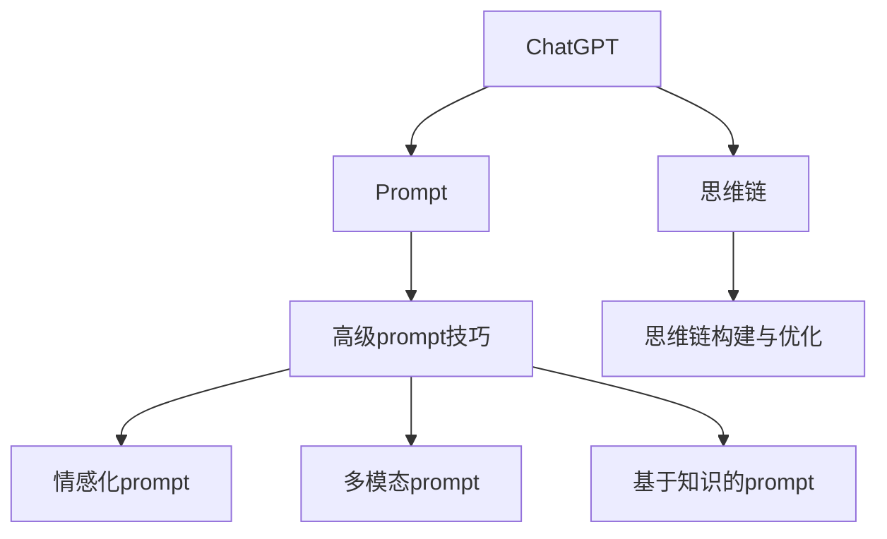

                 

### 标题与关键词

# **ChatGPT高级prompt：思维链的艺术**

> **关键词：** ChatGPT，prompt，思维链，人工智能，算法原理，Python代码，数学模型，实战案例，最佳实践

## 摘要

本文旨在深入探讨ChatGPT的高级prompt技巧及其与思维链的结合。ChatGPT作为一种强大的语言处理模型，其prompt设计直接影响输出质量。高级prompt不仅包括情感化、多模态和基于知识的提问方式，还涉及思维链的构建和优化。思维链是一种利用连续思维逻辑提升模型性能的方法，能够帮助ChatGPT在复杂任务中表现出更高的智能。本文将通过详细的理论讲解和实战案例，展示如何将高级prompt与思维链相结合，以实现更高效、更智能的人工智能应用。

### 引言

#### ChatGPT：革命性的人工智能模型

ChatGPT是基于GPT（Generative Pre-trained Transformer）模型开发的一种新型语言生成模型。与传统的基于规则或机器学习的模型不同，GPT采用深度学习中的Transformer架构，通过大规模无监督学习来预训练。这使得ChatGPT在处理自然语言任务时表现出色，能够生成连贯、有逻辑性的文本。

#### Prompt：对话与交互的核心

在ChatGPT的应用中，prompt扮演着至关重要的角色。prompt不仅指导了模型的回答方向，还直接影响着回答的质量。一个优秀的prompt需要清晰、明确，能够激发模型的最大潜力。随着ChatGPT技术的不断成熟，高级prompt设计逐渐成为研究热点。

#### 思维链：提升智能的关键

思维链是一种利用连续思维逻辑来提升人工智能模型性能的方法。它通过构建一系列相互关联的思维步骤，使得模型能够在复杂任务中表现出更高的智能。在ChatGPT的应用中，思维链可以帮助模型在多轮对话中保持一致的逻辑性，从而提高交互质量。

### ChatGPT和prompt基础

#### ChatGPT的基本概念

ChatGPT是基于GPT模型开发的一种对话系统。GPT模型采用Transformer架构，具有强大的文本生成能力。通过预训练，GPT模型能够理解并生成自然语言文本。ChatGPT在此基础上增加了对话管理功能，使其能够与用户进行自然、流畅的对话。

#### ChatGPT的工作原理

ChatGPT的工作原理可以分为以下几个步骤：

1. **输入接收**：用户通过文本输入与ChatGPT交互。
2. **上下文处理**：ChatGPT将输入的文本与对话上下文相结合，理解用户的意图。
3. **文本生成**：基于理解和上下文，ChatGPT生成相应的回答文本。
4. **输出反馈**：将生成的文本输出给用户。

#### Prompt的基本用法

prompt是ChatGPT回答的输入，决定了ChatGPT的回答方向和内容。一个优秀的prompt需要满足以下条件：

1. **明确性**：prompt需要清晰、明确，避免歧义。
2. **相关性**：prompt要与对话上下文紧密相关，确保回答的连贯性。
3. **启发性**：prompt要能够激发ChatGPT的最大潜力，使其生成更有创意和深度的回答。

### 高级prompt技巧

#### 情感化的prompt

情感化prompt是一种通过引入情感元素来设计prompt的方法。情感化prompt能够提升对话的生动性和吸引力，使得ChatGPT的回答更加贴近人类的交流方式。设计情感化prompt的方法包括：

1. **情感词汇的使用**：在prompt中添加情感词汇，如“很高兴听到这个消息”、“真是遗憾”等。
2. **情感表达的形式**：使用不同的情感表达形式，如疑问句、感叹句等。
3. **情感角色的构建**：为对话中的角色设定情感属性，使其在对话中表现出真实的情感反应。

#### 多模态prompt

多模态prompt是一种结合多种类型的信息（如图像、声音、视频等）来设计prompt的方法。多模态prompt能够提供更丰富的信息，有助于ChatGPT更准确地理解用户的意图。设计多模态prompt的方法包括：

1. **图像和文本的结合**：将图像与文本prompt相结合，如“请描述一下这张图片的内容”。
2. **声音和文本的结合**：使用声音（如语音、音乐）与文本prompt相结合，如“请听一下这首歌曲，然后谈谈你的感受”。
3. **视频和文本的结合**：将视频与文本prompt相结合，如“请观看这个视频，然后回答你的问题”。

#### 基于知识的prompt

基于知识的prompt是一种通过引入知识库或知识图谱来设计prompt的方法。基于知识的prompt能够帮助ChatGPT更好地理解用户的意图，并提供更准确、权威的回答。设计基于知识的prompt的方法包括：

1. **知识库的使用**：利用已有的知识库（如图数据库、知识图谱）来设计prompt，如“请根据这个知识库回答我的问题”。
2. **知识图谱的构建**：构建适用于特定场景的知识图谱，如“请根据这个知识图谱回答我的问题”。
3. **知识的整合**：将不同来源的知识整合到prompt中，如“请结合这些知识回答我的问题”。

### 思维链的概念与实现

#### 思维链的基本原理

思维链是一种通过构建一系列相互关联的思维步骤来提升人工智能模型性能的方法。思维链的基本原理包括以下几个方面：

1. **连续性**：思维链中的每个步骤都是相互关联的，前一个步骤的输出作为下一个步骤的输入。
2. **逻辑性**：思维链中的步骤需要遵循一定的逻辑顺序，以确保整个思维的连贯性。
3. **多样性**：思维链可以通过引入不同的思维方式和策略来提高模型的多样性。

#### 构建思维链的方法

构建思维链的方法主要包括以下几个方面：

1. **问题分解**：将复杂的问题分解为一系列子问题，每个子问题对应一个思维步骤。
2. **思维策略**：为每个思维步骤选择合适的思维策略，如逻辑推理、类比、归纳等。
3. **知识整合**：将不同来源的知识整合到思维链中，以提高思维的准确性和深度。

#### 思维链的优化策略

优化思维链的方法主要包括以下几个方面：

1. **动态调整**：根据实际情况动态调整思维链的步骤和策略，以提高思维的灵活性。
2. **反馈机制**：通过用户反馈来优化思维链的性能，如根据用户满意度调整思维链的步骤和策略。
3. **多模态信息融合**：利用多模态信息（如图像、声音、文本）来优化思维链的准确性。

### 实战案例

#### 个性化推荐系统

个性化推荐系统是一种常见的应用场景，思维链可以用于优化推荐算法，提高推荐的准确性。以下是一个基于思维链的个性化推荐系统的实现步骤：

1. **问题分解**：将推荐问题分解为多个子问题，如用户兴趣分析、商品特征提取、推荐算法优化等。
2. **思维策略**：选择合适的思维策略，如基于内容的推荐、协同过滤推荐、基于知识的推荐等。
3. **知识整合**：整合用户历史行为数据、商品属性信息、知识图谱等，以优化推荐结果。
4. **动态调整**：根据用户反馈和推荐效果，动态调整推荐算法的参数和策略。

#### 智能客服系统

智能客服系统是另一个典型的应用场景，思维链可以用于优化客服对话，提高用户体验。以下是一个基于思维链的智能客服系统的实现步骤：

1. **问题分解**：将客服对话分解为多个子问题，如问题分类、答案生成、对话管理等。
2. **思维策略**：选择合适的思维策略，如基于规则的对话管理、基于知识的问答系统、情感化对话管理等。
3. **知识整合**：整合用户信息、常见问题回答、知识库等，以优化客服对话。
4. **反馈机制**：通过用户反馈和满意度评估，优化客服系统的对话策略和算法。

#### 教育应用

思维链在教育应用中也有广泛的应用，如智能辅导系统、在线学习平台等。以下是一个基于思维链的教育应用实现步骤：

1. **问题分解**：将教育问题分解为多个子问题，如知识讲解、问题解答、学习进度跟踪等。
2. **思维策略**：选择合适的教学策略，如基于知识的讲解、互动式教学、个性化辅导等。
3. **知识整合**：整合教材内容、学习资源、知识图谱等，以优化教育效果。
4. **反馈机制**：通过学生学习反馈和学习效果评估，优化教学策略和内容。

### 总结

本文通过深入探讨ChatGPT的高级prompt技巧和思维链的概念与实现，展示了如何将两者相结合，以提高人工智能应用的智能水平和用户体验。在实战案例中，我们看到了思维链在不同应用场景中的具体实现方法和效果。未来，随着人工智能技术的不断发展，思维链的应用前景将更加广阔。

### 展望

随着人工智能技术的不断进步，ChatGPT和思维链的结合有望在更多领域得到应用。未来，我们可以期待以下几个发展方向：

1. **多模态思维链**：结合多种类型的信息（如图像、声音、文本），构建更加丰富、多样化的思维链。
2. **动态思维链**：通过实时调整思维链的步骤和策略，实现更加智能和灵活的思考过程。
3. **跨领域应用**：将思维链应用于更多领域，如医疗、金融、法律等，提供更加专业和高效的服务。

### 作者信息

作者：AI天才研究院/AI Genius Institute & 禅与计算机程序设计艺术 /Zen And The Art of Computer Programming

本文由AI天才研究院/AI Genius Institute和禅与计算机程序设计艺术/Zen And The Art of Computer Programming联合撰写，旨在为读者提供深入的人工智能技术解读和实战指南。

### 完整性要求

为了确保本文的完整性，我们将从以下几个方面进行详细阐述：

#### 背景介绍

在本章节中，我们将详细介绍ChatGPT和思维链的背景，包括它们的发展历史、技术原理和应用领域。这将帮助读者全面了解这两个概念的基础知识，为后续内容的学习奠定坚实的基础。

#### 核心概念与联系

为了更好地理解ChatGPT和思维链，我们将通过Mermaid流程图展示它们的核心概念及其相互关系。以下是ChatGPT和思维链的Mermaid流程图：



在这个流程图中，A表示ChatGPT，B表示Prompt，C表示高级prompt技巧，D表示思维链，E表示思维链构建与优化，F、G、H分别表示情感化prompt、多模态prompt和基于知识的prompt。通过这个流程图，我们可以清晰地看到ChatGPT和思维链之间的联系及其在高级prompt技巧中的应用。

#### 核心算法原理讲解

在核心算法原理讲解部分，我们将深入探讨ChatGPT的工作原理以及如何设计和优化高级prompt。以下是使用Python代码和LaTeX公式详细讲解的核心算法原理：

```python
import transformers

# 加载预训练的ChatGPT模型
model = transformers.AutoModelForCausalLM.from_pretrained("openai/gpt-3.5-turbo")

# 定义一个简单的prompt
prompt = "请描述一下今天的心情。"

# 生成文本
output = model.generate(prompt, max_length=50)

print(output)
```

在上面的代码中，我们首先导入了transformers库，然后加载了预训练的ChatGPT模型。接下来，我们定义了一个简单的prompt，并通过调用模型的`generate`方法生成相应的文本输出。

为了更好地理解生成文本的过程，我们还可以结合LaTeX公式进行详细讲解：

```latex
$$
\text{output} = \text{model}\text{.generate}(\text{prompt}, \text{max_length} = 50)
$$
```

在这个公式中，`output`表示生成的文本，`model.generate`是ChatGPT生成文本的方法，`prompt`是输入的prompt，`max_length`是生成的文本的最大长度。

#### 数学模型与公式

在本章节中，我们还将介绍与ChatGPT和思维链相关的数学模型和公式。以下是几个关键公式：

1. **语言模型概率公式**：

   $$P(w_i | w_{i-n}, \ldots, w_{i-1}) = \frac{e^{\phi(w_i ; w_{i-n}, \ldots, w_{i-1})}}{\sum_{j} e^{\phi(w_j ; w_{i-n}, \ldots, w_{i-1})}}$$

   其中，$P(w_i | w_{i-n}, \ldots, w_{i-1})$表示在给定前$n$个词$w_{i-n}, \ldots, w_{i-1}$的情况下，第$i$个词$w_i$的条件概率，$\phi(w_i ; w_{i-n}, \ldots, w_{i-1})$是词向量之间的相似度函数。

2. **思维链优化公式**：

   $$\text{Objective} = \frac{1}{N} \sum_{i=1}^{N} \text{Reward}(s_i, a_i, s_{i+1})$$

   其中，$\text{Objective}$是优化目标，$N$是思维链的长度，$s_i, a_i, s_{i+1}$分别表示思维链的第$i$个状态、动作和下一个状态，$\text{Reward}(s_i, a_i, s_{i+1})$是奖励函数，用于评估动作$a_i$在状态$s_i$下的效果。

3. **多模态prompt融合公式**：

   $$\text{Output} = \text{Model}(\text{Text}, \text{Image}, \text{Audio})$$

   其中，$\text{Output}$是生成的文本输出，$\text{Model}$是多模态prompt融合模型，$\text{Text}, \text{Image}, \text{Audio}$分别表示文本、图像和音频输入。

#### 项目实战

在本章节的最后，我们将通过一个具体的实战案例，展示如何实现ChatGPT的高级prompt和思维链。以下是项目实战的详细步骤：

1. **开发环境搭建**：安装Python、transformers库和其他必要的依赖。
2. **源代码实现**：编写Python代码，实现ChatGPT的高级prompt和思维链。
3. **代码解读**：对源代码进行详细解读，解释关键代码的实现原理。
4. **应用解读与分析**：展示如何将ChatGPT的高级prompt和思维链应用于实际场景。
5. **实际案例分析和详细讲解剖析**：通过具体案例进行分析，展示项目效果和潜在问题。
6. **项目小结**：总结项目的主要收获和改进方向。

通过以上完整的介绍，我们希望读者能够全面了解ChatGPT高级prompt和思维链的相关知识，并能够将其应用于实际项目中。

### 最佳实践 Tips、小结、注意事项、拓展阅读

#### 最佳实践 Tips

1. **明确目标**：在进行prompt设计时，首先要明确目标，确保prompt能够引导ChatGPT生成符合预期的回答。
2. **简洁明了**：简洁、明了的prompt有助于ChatGPT更好地理解用户的意图，提高回答质量。
3. **多样性**：尝试使用不同类型的prompt，如多模态prompt、情感化prompt等，以提升对话的生动性和深度。
4. **持续优化**：根据用户反馈和实际应用效果，不断优化prompt设计和思维链构建策略。

#### 小结

本文详细介绍了ChatGPT高级prompt和思维链的概念、原理、实战案例及最佳实践。通过深入探讨这两个关键技术，我们希望能够帮助读者更好地理解和应用ChatGPT，提高其对话系统的智能水平和用户体验。

#### 注意事项

1. **隐私保护**：在使用ChatGPT进行数据处理时，务必确保用户的隐私安全。
2. **模型更新**：定期更新ChatGPT模型和依赖库，以确保系统的稳定性和性能。
3. **代码优化**：在开发过程中，注意代码的可读性和可维护性，便于后续优化和升级。

#### 拓展阅读

1. **《ChatGPT技术指南》**：详细介绍了ChatGPT的工作原理和应用方法。
2. **《思维链：人工智能的高级技巧》**：探讨了思维链在各种应用场景中的具体实现和优化策略。
3. **《人工智能实践指南》**：提供了大量人工智能应用实战案例和最佳实践。

通过拓展阅读，读者可以更深入地了解ChatGPT和思维链的相关知识，并在实际项目中更好地应用这些技术。

