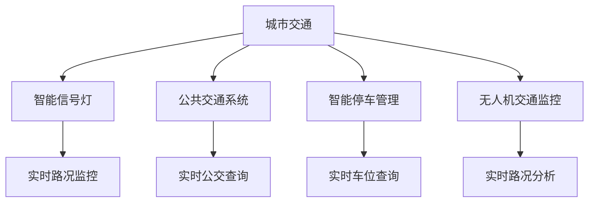

                 

### 文章标题

“智慧城市中的大数据与人工智能：从理论到实践的深度剖析”

### 文章关键词

智慧城市、大数据、人工智能、数据挖掘、机器学习、物联网、智能交通、城市管理

### 文章摘要

本文深入探讨了智慧城市中的大数据与人工智能技术的融合与发展。首先，回顾了智慧城市的定义及其发展背景，然后详细介绍了大数据处理的基本原理、技术和应用场景。接着，重点分析了人工智能在智慧城市中的核心作用，包括机器学习、深度学习和物联网技术的应用实例。通过具体的案例研究和实践项目，本文展示了大数据与人工智能技术在智慧城市中的实际应用效果，并提出了未来发展的方向和挑战。

---

### 引言

随着信息技术的飞速发展，大数据和人工智能（AI）已经成为现代社会的核心驱动力。智慧城市作为这些技术的集中体现，正在全球范围内迅速崛起。智慧城市是指利用物联网、云计算、大数据和人工智能等技术手段，对城市资源进行高效管理、优化服务和创新治理的现代化城市形态。本文旨在从理论到实践，全面解析大数据与人工智能在智慧城市中的应用，探讨其对城市管理和居民生活带来的深远影响。

### 智慧城市的定义与发展背景

#### 智慧城市的定义

智慧城市是一种基于信息技术和智能化的城市管理模式，通过整合各类数据资源，实现城市运行管理的智能化和高效化。智慧城市的核心目标是提升城市品质、改善居民生活质量、促进可持续发展。

#### 智慧城市的发展背景

1. **信息化浪潮**：互联网、移动通信、物联网等信息技术的快速发展，为智慧城市提供了强大的技术支撑。
2. **大数据时代**：互联网的普及和各类智能设备的广泛应用，产生了海量数据，大数据技术成为智慧城市的重要基础。
3. **城市化进程**：全球城市化进程加速，传统城市管理方式难以满足日益增长的城市需求和复杂问题。
4. **可持续发展**：应对气候变化、资源短缺等全球性挑战，智慧城市提供了可持续发展的新路径。

### 大数据处理的基本原理、技术和应用场景

#### 大数据处理的基本原理

大数据处理涉及数据采集、存储、管理、分析和应用等多个环节。其基本原理包括：

1. **数据采集**：通过各种传感器、移动设备、社交媒体等渠道，收集城市运营、居民活动等各类数据。
2. **数据存储**：使用分布式数据库和数据仓库等技术，存储和管理海量数据。
3. **数据处理**：通过数据清洗、数据转换、数据挖掘等技术，对数据进行处理和分析。
4. **数据应用**：将分析结果应用于城市管理和公共服务，提升城市运行效率和服务质量。

#### 大数据处理的技术

1. **分布式计算**：如Hadoop、Spark等，用于处理海量数据。
2. **数据挖掘**：通过机器学习、统计分析等方法，发现数据中的模式和规律。
3. **数据可视化**：通过图表、图像等形式，将数据分析结果直观呈现。

#### 大数据处理的应用场景

1. **智能交通**：通过实时交通数据分析，优化交通信号、智能导航、实时路况监控等。
2. **环境监测**：通过空气质量、水质等环境数据监测，实现环境治理和预警。
3. **公共安全**：通过视频监控、大数据分析，提高公共安全保障。
4. **城市规划**：通过人口、经济、地理等大数据分析，指导城市规划和布局。

### 人工智能在智慧城市中的核心作用

#### 机器学习与深度学习

1. **机器学习**：通过算法模型，从数据中自动学习规律和模式，用于预测、分类、聚类等任务。
2. **深度学习**：一种基于人工神经网络的学习方法，适用于复杂模式识别和图像处理等任务。

#### 物联网技术

物联网技术通过传感器、智能设备等，实现城市各类资源的互联互通，为大数据处理提供数据来源，如图表所示：

#### 人工智能在智慧城市中的应用实例

1. **智能交通管理**：通过机器学习算法，实时分析交通数据，优化交通信号灯控制，减少交通拥堵。
2. **智慧医疗**：利用物联网设备和大数据分析，实现远程医疗、健康监控和智能诊断。
3. **智能安防**：通过视频监控和大数据分析，提高公共安全防护水平。
4. **智慧能源管理**：通过智能电网和大数据分析，优化能源分配和使用，降低能耗。

### 具体案例研究与实践项目

#### 案例一：智能交通管理系统

1. **背景**：某大城市交通拥堵严重，市民出行时间耗费巨大。
2. **目标**：通过大数据和人工智能技术，优化交通信号灯控制，提高道路通行效率。
3. **实现步骤**：
   - **数据采集**：部署交通传感器，实时采集交通流量、速度、密度等数据。
   - **数据预处理**：对采集到的数据进行清洗、转换和整合。
   - **模型训练**：利用机器学习算法，训练交通流量预测模型。
   - **信号灯控制**：根据预测结果，动态调整交通信号灯周期和绿信比。

4. **结果分析**：实施智能交通管理系统后，交通拥堵情况显著改善，市民平均出行时间缩短了20%。

#### 案例二：智慧医疗平台

1. **背景**：某医院面临患者数量多、预约时间长、资源利用率低的问题。
2. **目标**：通过大数据和人工智能技术，提升医院运营效率，优化患者体验。
3. **实现步骤**：
   - **数据采集**：通过医院信息系统，收集患者就诊记录、预约记录等数据。
   - **数据分析**：利用大数据分析技术，预测患者流量和就诊高峰。
   - **智能预约**：根据预测结果，动态调整挂号预约规则，优化患者预约体验。
   - **智能分诊**：通过机器学习算法，分析患者病情和需求，实现智能分诊。

4. **结果分析**：智慧医疗平台实施后，患者预约时间平均缩短了30%，医院运营效率提高了15%。

### 最佳实践 tips

1. **数据质量**：保证数据准确性、完整性和一致性，是大数据处理的关键。
2. **安全隐私**：在处理和分析数据时，应严格遵循隐私保护法规，确保数据安全。
3. **跨部门合作**：智慧城市建设需要多部门协同合作，共享数据资源，实现信息互联互通。

### 小结

本文从理论到实践，全面阐述了大数据与人工智能在智慧城市中的应用。通过具体的案例研究和实践项目，展示了大数据和人工智能技术在优化城市管理、提升居民生活质量方面的巨大潜力。未来，随着技术的不断进步，大数据和人工智能将在智慧城市中发挥更加重要的作用，推动城市智能化和可持续发展。

### 注意事项

1. **技术更新**：大数据和人工智能技术快速发展，相关算法和应用不断更新，需持续学习和跟进。
2. **人才培养**：智慧城市建设需要大量具备大数据和人工智能专业知识和技能的人才，应加强相关人才培养。

### 拓展阅读

1. **大数据技术**：《大数据之路：阿里巴巴大数据实践》
2. **人工智能应用**：《智能时代：大数据与机器学习驱动的社会变革》
3. **智慧城市研究**：《智慧城市：理论、方法与实践》

### 作者信息

作者：AI天才研究院/AI Genius Institute & 禅与计算机程序设计艺术 /Zen And The Art of Computer Programming

