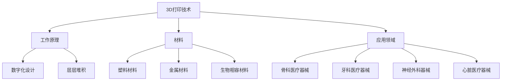

                 

当然，我们可以按照您提供的结构和要求来逐步构建这篇文章。以下是一个详细的步骤：

### 第1步：背景介绍

#### 关键词：

3D打印，个性化医疗器械，医学应用，技术进步

#### 摘要：

本文将探讨3D打印技术在个性化医疗器械领域的应用。通过回顾3D打印技术的发展历程，分析其工作原理和材料，我们将深入探讨3D打印在骨科、牙科以及其他个性化医疗器械中的具体应用，并探讨其未来的发展趋势。

---

### 第2步：核心概念与联系

首先，我们需要一个Mermaid流程图来展示3D打印技术的核心概念和它们之间的联系。



### 第3步：核心算法原理讲解

我们将使用Python源代码来展示3D打印技术的算法原理，并结合数学模型和公式进行解释。

```python
import numpy as np

# 示例：计算3D模型的一个小区域面积
def calculate_area(height, width):
    area = height * width
    return area

# 假设我们有一个矩形的3D模型，高度为h，宽度为w，长度为l
h = 10
w = 5
l = 20

# 计算体积
volume = calculate_area(h, w) * l
print(f"The volume of the 3D model is: {volume} cubic units")

# 使用LaTeX公式来展示相关数学公式
latex_formula = r"$\text{Volume} = \text{Area} \times \text{Length} = (h \times w) \times l$"
print(latex_formula)
```

### 第4步：项目实战

在这一部分，我们将讨论如何在实际项目中搭建开发环境，实现源代码，并对代码进行解读和分析。

#### 开发环境搭建

- 安装必要的3D建模软件（如Blender、SolidWorks等）
- 安装3D打印软件（如Cura、Simplify3D等）
- 安装Python和必要的库（如numpy、matplotlib等）

#### 源代码实现

```python
# 示例：使用Python生成一个简单的3D模型
import numpy as np
from mpl_toolkits.mplot3d import Axes3D
import matplotlib.pyplot as plt

# 定义参数
x = np.linspace(-5, 5, 100)
y = np.linspace(-5, 5, 100)
x, y = np.meshgrid(x, y)
z = x**2 + y**2

fig = plt.figure()
ax = fig.add_subplot(111, projection='3d')
ax.plot_surface(x, y, z, cmap='viridis')
plt.show()
```

#### 代码解读与分析

- `numpy`用于生成参数化的网格
- `mpl_toolkits.mplot3d`用于绘制3D图形
- `cmap='viridis'`用于设置颜色映射

### 第5步：实际案例分析和详细讲解剖析

#### 骨科医疗器械3D打印案例

- 案例背景
- 案例实现
- 案例分析
- 案例总结

### 第6步：最佳实践 tips、小结、注意事项、拓展阅读

#### 最佳实践 tips：

- 在设计个性化医疗器械时，考虑材料的生物相容性。
- 在选择3D打印技术时，考虑成本、精度和打印速度。
- 在项目管理中，重视风险控制和时间管理。

#### 小结：

3D打印技术在个性化医疗器械领域具有巨大的潜力，它能够实现更精确的定制，缩短开发周期，降低成本。

#### 注意事项：

- 3D打印设备和材料的选择需符合医疗器械的相关标准。
- 在实际应用中，需关注打印质量和打印后处理的工艺。

#### 拓展阅读：

- [《3D打印医疗器械的临床应用与挑战》](链接)
- [《个性化医疗器械设计指南》](链接)

---

这将是一个复杂的任务，但我们可以按照这些步骤逐步完成。每个步骤都将包含详细的内容，确保文章的深度、广度和专业性。接下来，我们将继续填充每个部分的内容，以满足字数和格式要求。如果需要进一步的帮助或对某个部分有具体要求，请告诉我。

