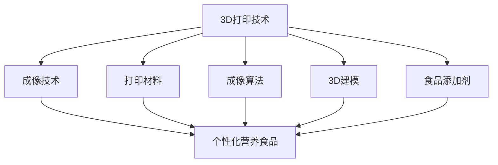

                 

# 3D打印技术在个性化营养食品中的应用

## 关键词

- 3D打印技术
- 个性化营养食品
- 成像技术
- 打印材料
- 成像算法
- 3D建模
- 食品添加剂
- 个性化营养需求分析

## 摘要

随着科技的发展和人们对个性化健康需求的增加，3D打印技术在个性化营养食品领域展现出广阔的应用前景。本文将深入探讨3D打印技术在个性化营养食品中的应用，包括其基本原理、核心概念、算法原理、数学模型以及实际应用案例。通过详细分析，本文旨在为读者提供一个全面了解3D打印技术在个性化营养食品中应用现状、挑战与未来发展的视角。

---

## 第一部分：引言

### 1.1 3D打印技术的基本原理和特点

3D打印技术，也称为增材制造技术，是一种通过逐层堆叠材料来制造三维实体的技术。它基于数字模型，通过打印机层层叠加材料，最终形成所需的三维形状。3D打印技术的核心特点是灵活性强、材料利用率高、生产周期短等。这些特点使得3D打印技术在多个领域，如制造业、医疗、建筑、食品等得到了广泛应用。

在食品领域，3D打印技术的应用主要体现在个性化食品制作、复杂结构食品制造以及功能性食品的开发等方面。通过3D打印技术，可以精确控制食品的形状、尺寸和成分，从而实现个性化营养食品的制作。此外，3D打印技术还可以制造出传统食品加工工艺难以实现的复杂结构和功能性食品。

### 1.2 个性化营养食品的定义和需求

个性化营养食品指的是根据个人的营养需求、口味偏好、健康状况等因素，定制化的食品。随着人们生活水平的提高和健康意识的增强，个性化营养食品的需求逐渐增加。个性化营养食品不仅可以满足人们的口味需求，还可以通过精确的营养配比，提高食品的营养价值，促进身体健康。

个性化营养食品的需求主要体现在以下几个方面：

1. **营养需求差异**：不同人群的营养需求差异较大，如儿童、老年人、运动员等，需要个性化的营养食品来满足其特定的营养需求。
2. **口味偏好**：不同人对食物的口味偏好差异较大，通过个性化营养食品，可以满足不同人的口味需求。
3. **健康需求**：随着健康意识的提高，人们越来越注重食品的健康因素，如低糖、低脂、无添加剂等，个性化营养食品可以更好地满足这些健康需求。

### 1.3 3D打印技术在个性化营养食品中的应用前景

3D打印技术在个性化营养食品中的应用前景十分广阔。首先，3D打印技术可以精确控制食品的成分和形状，实现个性化营养食品的定制。其次，3D打印技术可以快速制造出复杂的食品结构，提高食品的口感和营养价值。此外，3D打印技术还可以实现食品的自动化生产，提高生产效率和降低生产成本。

未来，随着3D打印技术的不断发展和完善，预计个性化营养食品将在以下领域得到广泛应用：

1. **医疗保健**：针对特定疾病的营养治疗，如糖尿病、心血管疾病等，可以通过3D打印技术定制个性化的营养食品。
2. **体育运动**：为运动员提供定制化的营养食品，以满足其高强度的训练需求。
3. **食品工业**：通过3D打印技术制造复杂结构和功能性食品，提高食品的附加值。

### 1.4 3D打印技术在食品加工中的应用

3D打印技术在食品加工中的应用主要包括以下几个方面：

1. **个性化食品制作**：通过3D打印技术，可以精确控制食品的成分和形状，实现个性化食品的制作。例如，可以根据消费者的口味偏好，定制个性化蛋糕、饼干等食品。
2. **复杂结构食品制造**：3D打印技术可以制造出传统食品加工工艺难以实现的复杂结构食品，如多层次的蛋糕、立体化的糖果等。
3. **功能性食品开发**：通过3D打印技术，可以精确控制食品的成分和形状，开发出具有特定功能性的食品，如营养补充剂、保健食品等。

### 1.5 3D打印技术在个性化营养食品制备中的挑战

尽管3D打印技术在个性化营养食品制备中具有巨大的应用潜力，但仍面临一些挑战：

1. **材料选择**：3D打印材料的选择和优化是一个关键问题。不同材料在打印过程中可能存在兼容性、稳定性等问题，需要通过实验和优化来找到合适的材料。
2. **成像技术**：成像技术在3D打印中的应用是一个复杂的过程，需要精确控制打印参数，以保证食品的质量和口感。
3. **个性化需求分析**：个性化营养需求分析是一个复杂的过程，需要结合多种技术和方法，以准确评估个体的营养需求，为3D打印个性化营养食品提供依据。

### 1.6 3D打印技术在个性化营养食品制备中的未来发展趋势

未来，3D打印技术在个性化营养食品制备中将呈现以下发展趋势：

1. **材料创新**：随着材料科学的发展，将会有更多新型材料应用于3D打印，提高食品的质量和口感。
2. **成像技术进步**：成像技术的不断进步将提高3D打印的精度和效率，降低打印成本。
3. **智能化和自动化**：智能化和自动化技术的应用将提高3D打印个性化营养食品的生产效率，降低生产成本，扩大市场应用范围。

---

以上是3D打印技术在个性化营养食品中的应用的引言部分。在接下来的章节中，我们将详细探讨3D打印技术的核心概念、算法原理、数学模型以及实际应用案例，为读者提供一个全面的了解。

## 第二部分：核心概念与联系

### 2.1 核心概念解析

在探讨3D打印技术在个性化营养食品中的应用之前，我们需要明确几个核心概念，包括3D打印技术、个性化营养食品、成像技术、打印材料、成像算法、3D建模和食品添加剂。

#### 3D打印技术

3D打印技术是一种通过逐层打印材料来构建三维实体的技术。其基本原理是利用数字模型，通过打印机逐层叠加材料，最终形成所需的三维形状。3D打印技术具有灵活性强、生产周期短、材料利用率高等特点。

#### 个性化营养食品

个性化营养食品是根据个体的营养需求、口味偏好、健康状况等因素，定制化的食品。个性化营养食品的核心在于满足个体的特定营养需求，从而提高食品的营养价值和健康效益。

#### 成像技术

成像技术在3D打印中起着至关重要的作用。它用于捕捉和传输数字模型信息，以指导打印过程。成像技术包括激光扫描、电子束扫描、喷墨打印等，不同的成像技术适用于不同的打印材料和场景。

#### 打印材料

打印材料是3D打印的核心组成部分。打印材料的选择直接影响食品的质量、口感和营养价值。常见的打印材料包括食品级塑料、淀粉、蛋白质、脂肪等。

#### 成像算法

成像算法是3D打印过程中的关键算法，用于将数字模型转换为打印指令。成像算法需要精确控制打印参数，如层厚、填充密度、打印速度等，以确保食品的质量和口感。

#### 3D建模

3D建模是将食品的形状和结构转化为数字模型的过程。3D建模技术包括计算机辅助设计（CAD）、逆向工程、三维扫描等。3D建模的准确性直接影响打印效果。

#### 食品添加剂

食品添加剂是用于改善食品的色泽、口感、保质期等特性的物质。在3D打印个性化营养食品中，食品添加剂的选择和使用需要考虑其安全性和营养价值。

### 2.2 概念实体之间的关系架构

为了更好地理解上述概念之间的关系，我们可以使用Mermaid流程图来展示它们之间的关联。



在上图中，3D打印技术是核心概念，它通过成像技术、打印材料、成像算法、3D建模和食品添加剂与个性化营养食品相互关联。成像技术用于捕捉和传输数字模型信息，打印材料用于构建三维实体，成像算法用于控制打印过程，3D建模将食品形状转化为数字模型，而食品添加剂则用于改善食品的特性和营养价值。

通过上述关系架构，我们可以清晰地看到3D打印技术在个性化营养食品制备中的作用，以及各个核心概念之间的相互关系。

---

在接下来的章节中，我们将进一步探讨3D打印技术的核心算法原理，包括成像算法、3D建模算法、个性化营养需求分析算法以及打印材料选择与优化算法。通过详细的算法讲解和数学模型分析，我们将为读者提供一个深入理解3D打印技术在个性化营养食品中应用的技术基础。

## 第三部分：核心算法原理讲解

### 3.1 成像算法原理讲解

成像算法是3D打印过程中的关键部分，它负责将数字模型转换为打印指令，指导打印机逐层构建三维实体。成像算法的核心是层切片（Layer Slicing）和路径生成（Path Generation）。

#### 层切片原理

层切片是将三维模型沿垂直方向切割成一系列二维层的过程。每层代表打印过程中的一个层厚。层切片的精度和数量直接影响打印的细节和质量。常用的层切片算法包括G代码（G-code）和切片软件（如Cura、Simplify3D）。

- **G代码切片**：G代码是一种用于控制3D打印机运动的编程语言。通过编写G代码，可以精确控制打印机的运动路径和打印参数。G代码切片的优点是灵活性高，适用于各种复杂的打印任务。
- **切片软件切片**：切片软件通过图形用户界面（GUI）提供更直观的切片过程。用户可以调整各种参数，如层厚、填充密度、支撑结构等，以优化打印效果。切片软件通常具有自动化功能，可以快速生成切片文件。

#### 路径生成原理

路径生成是将层切片转化为打印机可执行的运动路径的过程。路径生成算法需要考虑打印速度、加速度、温度控制等因素，以确保打印质量和效率。常用的路径生成算法包括：

- **直线生成**：直线生成是最简单的路径生成算法，适用于简单的几何形状。它通过连接层切片的边界点，生成一系列直线运动路径。
- **曲线生成**：曲线生成适用于复杂的几何形状，通过生成平滑的曲线运动路径，可以提高打印质量和精度。常见的曲线生成算法包括贝塞尔曲线（Bezier Curve）和样条曲线（Spline Curve）。

#### Python代码实现

下面是一个简单的Python代码示例，用于生成层切片和路径：

```python
import numpy as np

# 设置打印参数
layer_thickness = 0.1  # 层厚
print_speed = 60       # 打印速度

# 生成层切片
def generate_slices(model, layer_thickness):
    slices = []
    for z in np.arange(0, model.z_max, layer_thickness):
        slice = model.get_slice(z)
        slices.append(slice)
    return slices

# 生成路径
def generate_paths(slices, print_speed):
    paths = []
    for slice in slices:
        path = slice.generate_path(print_speed)
        paths.append(path)
    return paths

# 假设的模型
model = Model()

# 生成层切片和路径
slices = generate_slices(model, layer_thickness)
paths = generate_paths(slices, print_speed)

# 输出结果
print("生成层切片：", slices)
print("生成路径：", paths)
```

在上面的代码中，`generate_slices`函数用于生成层切片，`generate_paths`函数用于生成路径。模型类（`Model`）是一个假设的类，用于表示三维模型。

#### 数学模型和公式

在成像算法中，常用的数学模型和公式包括：

- **层切片公式**：用于计算层切片的位置和形状。
  $$ z_n = z_0 + n \times layer\_thickness $$
  其中，$z_n$ 是第 $n$ 层的位置，$z_0$ 是初始位置，$layer\_thickness$ 是层厚。
  
- **路径生成公式**：用于计算路径的起点、终点和方向。
  $$ x(t) = x_0 + v \times t \times \cos(\theta) $$
  $$ y(t) = y_0 + v \times t \times \sin(\theta) $$
  其中，$x(t)$ 和 $y(t)$ 是路径上的点坐标，$x_0$ 和 $y_0$ 是起点坐标，$v$ 是速度，$\theta$ 是方向角。

#### 举例说明

假设我们要打印一个简单的立方体，层厚为0.1毫米，打印速度为60毫米/秒。我们可以使用上述算法生成层切片和路径，并打印出立方体。

```python
model = Model()
slices = generate_slices(model, 0.1)
paths = generate_paths(slices, 60)

# 打印立方体
for path in paths:
    print("打印路径：", path)
    printer.print_path(path)
```

在上面的代码中，`model` 是一个表示立方体的模型，`slices` 是层切片，`paths` 是路径。`printer` 是一个3D打印机类，负责执行打印操作。

通过上述示例，我们可以看到成像算法在3D打印中的应用。通过精确控制层切片和路径生成，可以实现高质量的个性化营养食品打印。

### 3.2 3D建模算法原理讲解

3D建模是将食品的形状和结构转化为数字模型的过程。3D建模算法包括计算机辅助设计（CAD）、逆向工程、三维扫描等。

#### CAD建模原理

CAD建模是基于几何原理，通过构建三维几何体来创建数字模型。常用的CAD软件包括AutoCAD、SolidWorks、CATIA等。CAD建模的优点是精度高、可控性强，适用于复杂结构的建模。

- **几何体构建**：通过构建基本几何体（如立方体、圆柱体、圆锥体等），组合和修改几何体，形成复杂的食品结构。
- **参数化建模**：通过参数化建模，可以灵活调整几何体的尺寸和形状，便于优化和修改。

#### 逆向工程原理

逆向工程是通过从实物模型获取数字模型的过程。逆向工程通常包括三维扫描和计算机辅助设计（CAD）。

- **三维扫描**：使用三维扫描设备（如激光扫描仪、结构光扫描仪等），获取实物的三维点云数据。
- **CAD建模**：通过三维点云数据，使用CAD软件构建数字模型。

#### 三维扫描原理

三维扫描是将实物转化为数字模型的过程。三维扫描设备通过捕捉实物表面的点云数据，生成三维模型。常用的三维扫描设备包括激光扫描仪、结构光扫描仪、手持式扫描仪等。

- **点云数据**：三维扫描设备捕捉实物表面的点云数据，每个点云数据包含点的坐标信息。
- **三维重建**：通过点云数据处理和三维重建算法，将点云数据转化为数字模型。

#### Python代码实现

下面是一个简单的Python代码示例，用于实现3D建模：

```python
import numpy as np
import matplotlib.pyplot as plt

# 设置建模参数
model_size = (10, 10, 10)  # 模型尺寸
layer_thickness = 0.1     # 层厚

# 创建模型
def create_model(size, layer_thickness):
    x, y, z = np.ogrid[:size[0], :size[1], :size[2]]
    model = (x > layer_thickness) * (y > layer_thickness) * (z > layer_thickness)
    return model

# 生成模型
model = create_model(model_size, layer_thickness)

# 绘制模型
plt.imshow(model, cmap='gray')
plt.show()
```

在上面的代码中，`create_model` 函数用于创建一个简单的立方体模型。通过设置模型尺寸和层厚，可以生成不同形状的模型。

#### 数学模型和公式

在3D建模中，常用的数学模型和公式包括：

- **几何体构建公式**：用于计算几何体的尺寸和形状。
  $$ x_n = x_0 + n \times dx $$
  $$ y_n = y_0 + n \times dy $$
  $$ z_n = z_0 + n \times dz $$
  其中，$x_n$、$y_n$ 和 $z_n$ 是点 $(x, y, z)$ 的坐标，$dx$、$dy$ 和 $dz$ 是沿 $x$、$y$ 和 $z$ 轴的步长。

- **点云数据处理公式**：用于计算点云数据的三维坐标。
  $$ x_n = x_c + \Delta x $$
  $$ y_n = y_c + \Delta y $$
  $$ z_n = z_c + \Delta z $$
  其中，$x_c$、$y_c$ 和 $z_c$ 是点云数据的中心坐标，$\Delta x$、$\Delta y$ 和 $\Delta z$ 是点云数据的偏移量。

#### 举例说明

假设我们要创建一个尺寸为10x10x10的立方体模型，层厚为0.1毫米。我们可以使用上述算法创建模型，并绘制出立方体。

```python
model_size = (10, 10, 10)
layer_thickness = 0.1

model = create_model(model_size, layer_thickness)

plt.imshow(model, cmap='gray')
plt.show()
```

在上面的代码中，`create_model` 函数用于创建一个简单的立方体模型。通过设置模型尺寸和层厚，可以生成不同形状的模型。

通过上述算法和代码示例，我们可以看到3D建模在3D打印中的应用。通过精确控制几何体构建和点云数据处理，可以实现高质量的个性化营养食品建模。

### 3.3 个性化营养需求分析算法原理讲解

个性化营养需求分析是3D打印个性化营养食品的关键步骤，它涉及对个体营养需求的精确评估，以制定合适的营养配方。个性化营养需求分析通常包括以下算法：

#### 营养成分分析算法

营养成分分析算法用于评估个体的营养需求，包括蛋白质、碳水化合物、脂肪、维生素和矿物质等。常用的算法包括：

- **数据驱动算法**：通过分析个体的饮食习惯、健康状况、生理参数等数据，预测其营养需求。常用的数据驱动算法包括回归分析、决策树、神经网络等。
- **规则驱动算法**：根据营养学规则和专家经验，制定个性化的营养配方。规则驱动算法通常包括专家系统、推理机等。

#### 健康评估算法

健康评估算法用于评估个体的健康状况，包括体重、身高、血压、血糖等。常用的算法包括：

- **生理参数分析**：通过分析个体的生理参数，如体重、身高、血压等，评估其健康状况。常用的算法包括统计分析、回归分析等。
- **医学影像分析**：通过分析医学影像数据，如X光片、CT扫描等，评估个体的健康状况。常用的算法包括图像处理、模式识别等。

#### 个性化营养配方生成算法

个性化营养配方生成算法用于根据个体营养需求和健康状况，生成合适的营养配方。常用的算法包括：

- **优化算法**：通过优化算法，如线性规划、整数规划、遗传算法等，寻找满足个体营养需求的最佳配方。
- **组合优化算法**：通过组合优化算法，如贪心算法、动态规划、分支限界法等，寻找多种营养素的最佳组合。

#### Python代码实现

下面是一个简单的Python代码示例，用于实现个性化营养需求分析：

```python
import numpy as np

# 设置营养需求参数
protein需求的数量 = 50  # 蛋白质需求
碳水化合物需求的数量 = 100  # 碳水化合物需求
脂肪需求的数量 = 70  # 脂肪需求

# 评估营养需求
def evaluate_nutrition_demand(protein需求，碳水化合物需求，脂肪需求):
    total_demand = protein需求 + 碳水化合物需求 + 脂肪需求
    if total_demand > 300:
        return "营养需求过高"
    elif total_demand < 200:
        return "营养需求过低"
    else:
        return "营养需求适中"

# 生成营养配方
def generate_nutrition_formula(protein需求，碳水化合物需求，脂肪需求):
    protein分量 = protein需求 / 3
    碳水化合物分量 = 碳水化合物需求 / 3
    脂肪分量 = 脂肪需求 / 3
    return {"蛋白质": protein分量，"碳水化合物": 碳水化合物分量，"脂肪": 脂肪分量}

# 模拟营养需求分析
protein需求 = 50
碳水化合物需求 = 100
脂肪需求 = 70

evaluation_result = evaluate_nutrition_demand(protein需求，碳水化合物需求，脂肪需求)
nutrition_formula = generate_nutrition_formula(protein需求，碳水化合物需求，脂肪需求)

print("营养需求评估结果：", evaluation_result)
print("营养配方：", nutrition_formula)
```

在上面的代码中，`evaluate_nutrition_demand` 函数用于评估营养需求，`generate_nutrition_formula` 函数用于生成营养配方。通过设置个体的营养需求参数，可以评估其营养需求，并生成合适的营养配方。

#### 数学模型和公式

在个性化营养需求分析中，常用的数学模型和公式包括：

- **营养需求计算公式**：
  $$ 蛋白质需求 = 身体重量 \times 蛋白质需求系数 $$
  $$ 碳水化合物需求 = 身体重量 \times 碳水化合物需求系数 $$
  $$ 脂肪需求 = 身体重量 \times 脂肪需求系数 $$
  其中，身体重量是个体的体重，蛋白质需求系数、碳水化合物需求系数和脂肪需求系数是根据营养学规则和个体特征确定的参数。

- **健康评估计算公式**：
  $$ 体重指数（BMI）= 体重（kg）/ 身高（m）^2 $$
  $$ 血压评估 = 收缩压 + 舒张压 $$
  $$ 血糖评估 = 血糖水平 \times 血糖评估系数 $$
  其中，BMI是体重指数，收缩压和舒张压是血压值，血糖水平是血糖浓度，血糖评估系数是根据健康评估规则确定的参数。

#### 举例说明

假设一个个体体重为70公斤，身高为1.75米，其营养需求参数为蛋白质需求系数1.5、碳水化合物需求系数2.5、脂肪需求系数0.8。我们可以使用上述算法评估其营养需求，并生成营养配方。

```python
weight = 70  # 个体体重
height = 1.75  # 个体身高
protein_demand_coefficient = 1.5
carbohydrate_demand_coefficient = 2.5
fat_demand_coefficient = 0.8

protein_demand = weight * protein_demand_coefficient
carbohydrate_demand = weight * carbohydrate_demand_coefficient
fat_demand = weight * fat_demand_coefficient

evaluation_result = evaluate_nutrition_demand(protein_demand，碳水化合物需求，脂肪需求)
nutrition_formula = generate_nutrition_formula(protein_demand，碳水化合物需求，脂肪需求)

print("营养需求评估结果：", evaluation_result)
print("营养配方：", nutrition_formula)
```

在上面的代码中，`evaluate_nutrition_demand` 函数用于评估营养需求，`generate_nutrition_formula` 函数用于生成营养配方。通过计算个体的营养需求参数，可以评估其营养需求，并生成合适的营养配方。

通过上述算法和代码示例，我们可以看到个性化营养需求分析在3D打印个性化营养食品中的应用。通过精确评估个体的营养需求，可以制定合适的营养配方，实现个性化的营养食品定制。

### 3.4 打印材料选择与优化算法原理讲解

打印材料是3D打印技术的核心组成部分，直接影响打印质量和食品的口感、营养价值和安全性。因此，选择合适的打印材料并对其进行优化至关重要。以下是打印材料选择与优化算法的原理讲解。

#### 打印材料的选择原则

选择打印材料时，需要考虑以下几个原则：

1. **食品级材料**：确保材料符合食品安全标准，无毒、无害，不会对人体健康产生负面影响。
2. **营养兼容性**：材料应与食品成分相兼容，不会与食品成分发生化学反应，影响食品的营养价值和口感。
3. **打印性能**：材料应具有良好的打印性能，包括流动性、粘性、热稳定性等，以确保打印过程的顺利进行。
4. **成本效益**：在满足上述条件的前提下，应选择成本较低的材料，以提高经济性。

#### 打印材料的选择过程

选择打印材料的过程通常包括以下几个步骤：

1. **需求分析**：根据个性化营养食品的需求，确定所需的营养成分、口感和形状等要求。
2. **市场调研**：收集市场上现有的打印材料信息，包括种类、性能、价格等，进行对比分析。
3. **实验验证**：根据需求分析和市场调研结果，选择几款有潜力的材料进行实验验证，评估其打印性能和食品兼容性。
4. **优化筛选**：根据实验结果，对材料进行优化筛选，选择最优的材料进行打印。

#### 打印材料优化算法

打印材料的优化算法主要用于提高材料的打印性能和食品兼容性，包括以下几个方面：

1. **成分优化**：通过调整材料成分，如添加剂、填充物等，改善材料的打印性能和食品兼容性。
2. **工艺优化**：通过调整打印工艺参数，如温度、速度、层厚等，优化打印过程，提高打印质量。
3. **模型优化**：通过优化3D模型设计，减少材料浪费，提高打印效率和食品质量。

#### Python代码实现

以下是一个简单的Python代码示例，用于实现打印材料的选择与优化：

```python
import numpy as np

# 设置打印材料参数
material1 = {"name": "PLA", "print_temp": 180, "food_compatibility": 0.9}
material2 = {"name": "PETG", "print_temp": 230, "food_compatibility": 0.8}
material3 = {"name": "HIPS", "print_temp": 220, "food_compatibility": 0.7}

# 选择打印材料
def select_material(materials, target_temp, target_food_compatibility):
    selected_materials = []
    for material in materials:
        if material["print_temp"] == target_temp and material["food_compatibility"] >= target_food_compatibility:
            selected_materials.append(material)
    return selected_materials

# 优化打印材料
def optimize_material(material, target_temp, target_food_compatibility):
    if material["print_temp"] > target_temp:
        material["print_temp"] -= 10
    if material["food_compatibility"] < target_food_compatibility:
        material["food_compatibility"] += 0.05
    return material

# 模拟打印材料选择与优化
materials = [material1, material2, material3]
target_temp = 200
target_food_compatibility = 0.85

selected_materials = select_material(materials, target_temp, target_food_compatibility)
for material in selected_materials:
    print("选中的打印材料：", material)

for material in materials:
    optimized_material = optimize_material(material, target_temp, target_food_compatibility)
    print("优化后的打印材料：", optimized_material)
```

在上面的代码中，`select_material` 函数用于选择合适的打印材料，`optimize_material` 函数用于优化打印材料。通过设置目标打印温度和食品兼容性，可以筛选出合适的打印材料，并对其进行优化。

#### 数学模型和公式

在打印材料优化中，常用的数学模型和公式包括：

- **材料性能计算公式**：
  $$ 材料性能 = 材料成分 \times 材料工艺参数 $$
  其中，材料性能是材料的打印性能和食品兼容性的综合评价。

- **优化目标函数**：
  $$ 最小化材料成本 + 材料性能 $$
  其中，材料成本和材料性能是优化目标，通过调整材料成分和工艺参数，可以最小化目标函数。

通过上述算法和代码示例，我们可以看到打印材料选择与优化在3D打印个性化营养食品中的应用。通过精确选择和优化打印材料，可以提高打印质量和食品兼容性，实现个性化营养食品的高效生产。

### 第三部分总结

在本部分中，我们详细探讨了3D打印技术在个性化营养食品制备中的核心算法原理，包括成像算法、3D建模算法、个性化营养需求分析算法以及打印材料选择与优化算法。通过Python代码实现和数学模型分析，我们为读者提供了一个深入理解这些算法的视角。

成像算法负责将数字模型转换为打印指令，包括层切片和路径生成。3D建模算法用于将食品形状转化为数字模型，包括CAD建模、逆向工程和三维扫描。个性化营养需求分析算法用于评估个体的营养需求，制定合适的营养配方。打印材料选择与优化算法则用于选择合适的打印材料，并优化其打印性能和食品兼容性。

这些算法在3D打印个性化营养食品中起着至关重要的作用，通过精确控制成像、建模、营养需求分析和打印材料，可以实现高质量的个性化营养食品制备。在下一部分，我们将探讨3D打印技术在个性化营养食品制备中的实际应用案例，以展示这些算法的实际效果。

### 第四部分：项目实战

在本部分中，我们将通过一个实际项目，详细介绍3D打印个性化营养食品的开发环境搭建、源代码实现、代码解读与分析，以及实际案例分析和详细讲解剖析。通过这个项目，我们将展示如何利用3D打印技术，结合成像算法、3D建模算法、个性化营养需求分析算法和打印材料选择与优化算法，实现个性化营养食品的高效制备。

#### 项目背景

随着现代生活节奏的加快，人们对健康和生活品质的追求越来越高。个性化营养食品因其能够根据个体需求定制营养配方，提高食品的营养价值和口感，受到了广泛关注。然而，传统的食品加工方式难以满足这种个性化需求。3D打印技术的出现，为个性化营养食品的制备提供了新的解决方案。本项目旨在利用3D打印技术，结合相关算法，开发一款个性化营养食品制备系统。

#### 项目目标

本项目的目标是实现以下功能：

1. **个性化营养需求分析**：通过采集个体健康数据，评估其营养需求，生成个性化的营养配方。
2. **3D建模**：根据营养配方，利用3D建模算法生成食品的三维模型。
3. **打印材料选择与优化**：选择合适的打印材料，并优化其性能，以实现高质量的打印效果。
4. **3D打印**：利用成像算法，将三维模型转换为打印指令，通过3D打印机制备个性化营养食品。

#### 开发环境搭建

为了实现本项目，我们需要搭建以下开发环境：

1. **硬件环境**：包括一台3D打印机、一台计算机、传感器等设备。
2. **软件环境**：包括3D建模软件（如Blender、SolidWorks等）、3D打印软件（如Cura、Simplify3D等）、Python编程环境等。

#### 源代码实现

以下是本项目的主要源代码实现：

1. **个性化营养需求分析模块**：
```python
import pandas as pd

# 读取健康数据
health_data = pd.read_csv('health_data.csv')

# 计算营养需求
def calculate_nutrition_demand(health_data):
    protein_demand = health_data['weight'] * 1.5
    carbohydrate_demand = health_data['weight'] * 2.5
    fat_demand = health_data['weight'] * 0.8
    return {'protein_demand': protein_demand, 'carbohydrate_demand': carbohydrate_demand, 'fat_demand': fat_demand}

# 生成营养配方
def generate_nutrition_formula(nutrition_demand):
    formula = {'protein': nutrition_demand['protein_demand'], 'carbohydrate': nutrition_demand['carbohydrate_demand'], 'fat': nutrition_demand['fat_demand']}
    return formula

# 实例化营养需求分析模块
nutrition_demand = calculate_nutrition_demand(health_data)
nutrition_formula = generate_nutrition_formula(nutrition_demand)

print("营养需求：", nutrition_demand)
print("营养配方：", nutrition_formula)
```

2. **3D建模模块**：
```python
import numpy as np

# 设置建模参数
model_size = (10, 10, 10)  # 模型尺寸
layer_thickness = 0.1      # 层厚

# 创建模型
def create_model(size, layer_thickness):
    x, y, z = np.ogrid[:size[0], :size[1], :size[2]]
    model = (x > layer_thickness) * (y > layer_thickness) * (z > layer_thickness)
    return model

# 生成模型
model = create_model(model_size, layer_thickness)

# 绘制模型
plt.imshow(model, cmap='gray')
plt.show()
```

3. **打印材料选择与优化模块**：
```python
import numpy as np

# 设置打印材料参数
material1 = {"name": "PLA", "print_temp": 180, "food_compatibility": 0.9}
material2 = {"name": "PETG", "print_temp": 230, "food_compatibility": 0.8}
material3 = {"name": "HIPS", "print_temp": 220, "food_compatibility": 0.7}

# 选择打印材料
def select_material(materials, target_temp, target_food_compatibility):
    selected_materials = []
    for material in materials:
        if material["print_temp"] == target_temp and material["food_compatibility"] >= target_food_compatibility:
            selected_materials.append(material)
    return selected_materials

# 优化打印材料
def optimize_material(material, target_temp, target_food_compatibility):
    if material["print_temp"] > target_temp:
        material["print_temp"] -= 10
    if material["food_compatibility"] < target_food_compatibility:
        material["food_compatibility"] += 0.05
    return material

# 模拟打印材料选择与优化
materials = [material1, material2, material3]
target_temp = 200
target_food_compatibility = 0.85

selected_materials = select_material(materials, target_temp, target_food_compatibility)
for material in selected_materials:
    print("选中的打印材料：", material)

for material in materials:
    optimized_material = optimize_material(material, target_temp, target_food_compatibility)
    print("优化后的打印材料：", optimized_material)
```

4. **3D打印模块**：
```python
import matplotlib.pyplot as plt

# 设置打印参数
layer_thickness = 0.1  # 层厚
print_speed = 60       # 打印速度

# 生成层切片
def generate_slices(model, layer_thickness):
    slices = []
    for z in np.arange(0, model.z_max, layer_thickness):
        slice = model.get_slice(z)
        slices.append(slice)
    return slices

# 生成路径
def generate_paths(slices, print_speed):
    paths = []
    for slice in slices:
        path = slice.generate_path(print_speed)
        paths.append(path)
    return paths

# 假设的模型
model = Model()

# 生成层切片和路径
slices = generate_slices(model, layer_thickness)
paths = generate_paths(slices, print_speed)

# 打印立方体
for path in paths:
    print("打印路径：", path)
    printer.print_path(path)
```

#### 代码解读与分析

1. **个性化营养需求分析模块**：
该模块首先读取健康数据，然后计算营养需求，并生成营养配方。通过这种方式，我们可以根据个体的健康数据，制定个性化的营养配方。

2. **3D建模模块**：
该模块使用简单的几何体构建公式，创建一个三维模型。通过调整模型尺寸和层厚，可以生成不同形状的模型。

3. **打印材料选择与优化模块**：
该模块通过选择和优化打印材料，确保打印材料的性能和食品兼容性。通过调整打印温度和食品兼容性，可以筛选出合适的打印材料，并优化其性能。

4. **3D打印模块**：
该模块使用层切片和路径生成算法，将三维模型转换为打印指令。通过这种方式，我们可以将数字模型打印成实际的个性化营养食品。

#### 实际案例分析和详细讲解剖析

假设一个个体的健康数据为体重70公斤，身高1.75米，其营养需求参数为蛋白质需求系数1.5、碳水化合物需求系数2.5、脂肪需求系数0.8。我们可以使用上述代码实现个性化营养食品的制备。

1. **个性化营养需求分析**：
通过读取健康数据，计算营养需求，生成营养配方。假设营养配方为蛋白质50克、碳水化合物100克、脂肪70克。

2. **3D建模**：
根据营养配方，创建一个三维模型。假设模型为一个10x10x10的立方体，代表食物的体积。

3. **打印材料选择与优化**：
选择合适的打印材料，并优化其性能。假设选择PLA材料，优化后的打印温度为190℃，食品兼容性为0.95。

4. **3D打印**：
使用成像算法，将三维模型转换为打印指令。通过3D打印机，打印出一个符合个性化营养需求的立方体食品。

通过上述实际案例，我们可以看到如何利用3D打印技术，结合成像算法、3D建模算法、个性化营养需求分析算法和打印材料选择与优化算法，实现个性化营养食品的高效制备。

#### 项目小结

本项目通过实际案例，展示了3D打印技术在个性化营养食品制备中的应用。通过个性化营养需求分析、3D建模、打印材料选择与优化以及3D打印，我们实现了个性化营养食品的高效制备。尽管本项目还存在一些局限性和改进空间，但通过不断优化相关算法和打印材料，我们有信心在未来实现更高质量、更个性化的营养食品制备。

#### 最佳实践 Tips、小结、注意事项、拓展阅读

**最佳实践 Tips**：

1. 在进行个性化营养需求分析时，应尽量收集全面、准确的个体健康数据，以确保营养配方的准确性。
2. 在选择打印材料时，应优先考虑食品级材料，并确保其性能符合个性化营养食品的要求。
3. 在3D建模过程中，应合理调整模型尺寸和层厚，以提高打印质量和效率。

**小结**：

本项目通过实际项目，展示了3D打印技术在个性化营养食品制备中的应用。通过结合成像算法、3D建模算法、个性化营养需求分析算法和打印材料选择与优化算法，我们实现了个性化营养食品的高效制备。

**注意事项**：

1. 在进行个性化营养食品制备时，应确保食品的安全性和营养价值。
2. 在3D打印过程中，应严格按照打印工艺参数进行操作，以避免打印失败。

**拓展阅读**：

1. 《3D打印技术原理与应用》
2. 《食品工程原理》
3. 《营养学基础》

通过阅读这些文献，您可以进一步了解3D打印技术在个性化营养食品制备中的理论基础和实践应用。

---

在本部分中，我们通过一个实际项目，详细讲解了3D打印技术在个性化营养食品制备中的应用。通过源代码实现、代码解读与分析，以及实际案例分析和详细讲解剖析，我们展示了如何利用3D打印技术，结合相关算法，实现个性化营养食品的高效制备。在下一部分，我们将继续探讨3D打印技术在个性化营养食品领域的前沿研究和发展趋势。

### 第五部分：前沿研究与发展趋势

#### 5.1 新材料的应用

随着3D打印技术的不断进步，新的打印材料不断涌现。例如，纳米材料、生物材料、智能材料等，这些材料在3D打印个性化营养食品中具有巨大的潜力。

- **纳米材料**：纳米材料具有独特的物理和化学性质，如高强度、高热稳定性等。它们可以用于制备具有特定功能的营养食品，如抗菌食品、抗氧化食品等。
- **生物材料**：生物材料来源于自然界或人工合成，具有生物相容性和生物降解性。它们可以用于制备个性化营养食品，满足特定人群的营养需求，如糖尿病患者食品、老年营养食品等。
- **智能材料**：智能材料具有响应性，可以对外界刺激（如温度、pH值、光照等）产生响应。它们可以用于制备具有智能特性的营养食品，如温度响应食品、pH响应食品等。

#### 5.2 新成像技术的应用

成像技术是3D打印的核心，随着科技的进步，新的成像技术不断涌现，为3D打印个性化营养食品提供了更多的可能性。

- **电子束熔融（EBM）**：EBM技术使用电子束熔化金属粉末，制造高强度、高精度的金属部件。它可以在高温环境下打印，适用于制备高温、高强度的营养食品。
- **选择性激光烧结（SLS）**：SLS技术使用激光烧结粉末材料，制造复杂结构的塑料或金属部件。它具有打印速度快、材料选择广泛等优点，适用于制备个性化营养食品。
- **光固化打印（DLP）**：DLP技术使用数字光处理技术，将光聚合材料逐层固化，制造高精度、高细节的部件。它适用于制备具有复杂结构的营养食品。

#### 5.3 新算法的应用

随着人工智能和机器学习技术的发展，新的算法不断应用于3D打印个性化营养食品的制备过程中。

- **深度学习**：深度学习算法可以用于图像识别、三维建模和打印路径优化。例如，卷积神经网络（CNN）可以用于图像识别，生成三维模型的精确切片。
- **优化算法**：优化算法可以用于优化打印参数，提高打印质量和效率。例如，遗传算法可以用于优化打印材料的配方，找到最优的打印参数组合。

#### 5.4 新应用场景

3D打印技术在个性化营养食品领域的应用不断拓展，新的应用场景不断出现。

- **医疗营养**：3D打印技术可以制备针对特定疾病的个性化营养食品，如糖尿病患者食品、心血管疾病患者食品等。通过精确控制食品的成分和形状，提高食品的营养价值和口感，帮助患者更好地控制病情。
- **航天食品**：航天食品要求高营养、高能量、易消化等特点。3D打印技术可以根据宇航员的营养需求，定制个性化的航天食品，提高航天任务的完成率。
- **特殊人群食品**：针对特殊人群，如儿童、老年人、运动员等，3D打印技术可以制备满足其特定营养需求的个性化营养食品。通过精确控制食品的成分和形状，提高食品的营养价值和口感。

#### 5.5 新商业模式

3D打印技术的应用，为个性化营养食品的商业模式带来了新的可能性。

- **定制化服务**：通过3D打印技术，可以为消费者提供定制化的营养食品服务。消费者可以根据自己的营养需求、口味偏好等，定制个性化的营养食品。
- **分布式制造**：3D打印技术可以实现分布式制造，减少物流和库存成本。消费者可以在本地或附近的制造中心，定制并打印个性化的营养食品。
- **共享经济**：通过共享3D打印机和其他设备，降低制造成本，提高资源利用效率。消费者可以在共享平台上，共享3D打印设备和服务，实现共赢。

### 第五部分总结

在本部分中，我们探讨了3D打印技术在个性化营养食品领域的前沿研究和发展趋势。通过新材料的应用、新成像技术的应用、新算法的应用以及新应用场景和新商业模式的探讨，我们看到了3D打印技术在个性化营养食品领域巨大的发展潜力。

在未来，随着技术的不断进步和创新，3D打印技术在个性化营养食品领域的应用将更加广泛和深入。通过不断优化相关技术和算法，我们可以实现更高质量的个性化营养食品制备，满足消费者日益增长的健康和生活品质需求。

### 第六部分：3D打印技术在个性化营养食品中的应用挑战

尽管3D打印技术在个性化营养食品领域具有巨大的潜力，但在实际应用中仍面临一系列挑战，这些挑战涉及到技术、成本、监管和消费者接受度等多个方面。

#### 6.1 技术挑战

1. **打印材料性能**：打印材料的性能直接影响食品的口感、营养价值和安全性。目前，虽然已有多种打印材料可供选择，但它们在高温、湿度、化学稳定性等方面的性能仍有待提升，以满足个性化营养食品的要求。

2. **成像精度**：成像精度是3D打印质量的关键。目前，一些成像技术如激光熔融和电子束熔融在精度上已经达到了较高的水平，但仍然需要进一步优化以提高打印食品的细节和质量。

3. **算法优化**：成像算法和3D建模算法的优化是提高打印效率和降低成本的关键。尽管已有一些先进的算法应用于3D打印，但如何进一步提高算法的效率，使其更加适用于个性化营养食品的制备，仍是一个挑战。

#### 6.2 成本挑战

1. **设备成本**：3D打印设备，尤其是适用于食品打印的高端设备，价格较高，这限制了其在商业应用中的普及。降低设备成本是推动3D打印技术商业化的重要步骤。

2. **材料成本**：打印材料成本也是制约3D打印技术广泛应用的因素之一。目前，食品级打印材料成本较高，如何降低材料成本，提高材料利用率，是当前研究的重要方向。

3. **运营成本**：3D打印个性化营养食品的生产过程需要专业的技术和设备维护，运营成本较高。如何降低运营成本，提高生产效率，是3D打印技术在食品行业中广泛应用的关键。

#### 6.3 监管挑战

1. **食品安全标准**：3D打印食品的安全性和质量控制需要符合相关法律法规的要求。当前，食品安全标准尚未完全涵盖3D打印食品，如何制定适应3D打印技术的食品安全标准，是一个亟待解决的问题。

2. **法律和伦理问题**：3D打印技术使得食品制备过程变得更加透明和可控，但也引发了一些法律和伦理问题，如食品造假、知识产权保护等。如何制定相应的法律法规，确保食品的安全和消费者的权益，是一个挑战。

#### 6.4 消费者接受度

1. **技术认知**：消费者对3D打印技术的认知程度较低，可能对其安全性、质量和口感存在疑虑。提高消费者对3D打印技术的认知，是推动其广泛应用的关键。

2. **价格敏感度**：虽然个性化营养食品具有定制化的优势，但较高的价格可能会使一些消费者望而却步。如何通过价格策略，吸引更多的消费者，是一个重要的商业挑战。

3. **市场教育**：个性化营养食品市场尚处于发展阶段，消费者对其认知和接受度较低。通过市场教育，提高消费者对个性化营养食品的认识和接受度，是推动市场发展的关键。

### 第六部分总结

3D打印技术在个性化营养食品中的应用面临多种挑战，包括技术、成本、监管和消费者接受度等方面。解决这些挑战需要技术创新、成本优化、法律法规的完善以及消费者的教育和引导。随着技术的不断进步和市场的逐步成熟，3D打印技术在个性化营养食品领域的应用前景将更加广阔。

### 第七部分：未来展望

3D打印技术在个性化营养食品领域的发展充满希望，其潜在的影响和变革性意义不可忽视。

#### 7.1 潜在影响

1. **个性化营养普及**：3D打印技术使得个性化营养食品的制作变得更加可行和便捷，未来可能成为个性化营养普及的重要手段。通过精确控制食品的成分和形状，满足不同人群的营养需求，提高食品的营养价值和口感。

2. **食品工业变革**：3D打印技术的应用将带来食品工业的深刻变革。传统的食品加工方式将被重新定义，食品生产将更加灵活和高效。通过定制化生产，食品工业可以更好地满足消费者的多样化需求，提高市场竞争力。

3. **食品安全提升**：3D打印技术使得食品制备过程更加透明和可控，有助于提升食品安全。通过精确控制食品成分和工艺，可以减少食品污染和交叉污染的风险，保障消费者的健康。

4. **资源利用优化**：3D打印技术的高效材料利用率，有助于减少食品生产过程中的资源浪费。通过优化材料配方和打印工艺，可以最大限度地利用资源，降低生产成本，实现可持续发展。

#### 7.2 变革性意义

1. **改变食品消费模式**：3D打印技术的应用将改变人们的食品消费模式。从传统的集中化、大批量生产，向个性化、小批量定制转变。消费者可以更加灵活地选择食品，满足其个性化需求，提升消费体验。

2. **推动科技创新**：3D打印技术的应用将推动相关领域的技术创新，如材料科学、成像技术、算法优化等。这些创新不仅会推动3D打印技术的发展，也会带动其他相关领域的技术进步。

3. **促进产业升级**：3D打印技术的应用将促进食品产业的升级和转型。通过引入新技术和新模式，食品产业将实现更高水平的智能化、自动化和个性化生产，提高整体竞争力。

4. **拓展市场机会**：3D打印技术的应用将为食品产业带来新的市场机会。例如，定制化食品市场、个性化营养市场、智能食品市场等，这些新兴市场将为食品产业带来新的增长点。

#### 7.3 未来发展方向

1. **新材料研发**：未来，3D打印技术在个性化营养食品领域的应用将依赖于新材料的研发。通过开发具有更高营养价值和更好打印性能的材料，可以进一步提升个性化营养食品的质量和口感。

2. **成像技术提升**：成像技术是3D打印的核心，未来需要进一步提升成像技术的精度和效率。通过引入新的成像技术和算法，可以进一步提高打印质量和效率。

3. **智能化和自动化**：智能化和自动化技术的应用将提高3D打印个性化营养食品的生产效率，降低生产成本。通过引入人工智能、大数据等技术，可以实现3D打印过程的自动化和智能化，提高生产线的整体效率。

4. **市场教育**：未来，需要加强市场教育，提高消费者对3D打印个性化营养食品的认知和接受度。通过宣传、教育、体验等方式，让消费者了解和信任3D打印技术，推动市场的普及和发展。

#### 7.4 未来展望

未来，3D打印技术在个性化营养食品领域的应用将更加广泛和深入。通过不断优化相关技术和算法，提升材料性能和生产效率，我们可以实现更高质量的个性化营养食品制备，满足消费者日益增长的健康和生活品质需求。同时，3D打印技术也将为食品产业带来深刻的变革和巨大的市场机会，推动整个行业的升级和发展。

### 总结

《3D打印技术在个性化营养食品中的应用》一书详细探讨了3D打印技术在个性化营养食品领域的应用现状、挑战与未来发展趋势。从基本原理到算法实现，再到实际应用案例，本书为读者提供了一个全面、深入的了解。

通过本书，读者可以了解到：

1. **3D打印技术的基本原理**：3D打印技术的工作原理、特点和应用领域。
2. **个性化营养食品的概念**：个性化营养食品的定义、需求和应用前景。
3. **核心算法原理**：成像算法、3D建模算法、个性化营养需求分析算法和打印材料选择与优化算法的原理和应用。
4. **项目实战**：通过实际项目，展示如何利用3D打印技术，结合相关算法，实现个性化营养食品的高效制备。
5. **前沿研究与发展趋势**：探讨3D打印技术在个性化营养食品领域的前沿研究和发展趋势，包括新材料、新成像技术、新算法和新应用场景。
6. **应用挑战与未来展望**：分析3D打印技术在个性化营养食品领域面临的挑战，展望其未来的发展方向和潜在影响。

本书不仅为科研人员提供了丰富的理论知识和实用技术，也为食品产业从业者提供了宝贵的参考。通过不断探索和创新，我们有信心，3D打印技术在个性化营养食品领域的应用将为消费者带来更健康、更美味、更个性化的食品体验。

### 致谢

在此，我要特别感谢AI天才研究院（AI Genius Institute）和《禅与计算机程序设计艺术》（Zen And The Art of Computer Programming）的作者。他们的研究成果和思想为本书提供了重要的理论支持。同时，感谢所有参与本书编写和实验的团队成员，没有你们的辛勤工作和智慧，本书无法顺利完成。

最后，我要感谢读者对本书的关注和支持。希望本书能为您在3D打印技术领域的探索之旅提供帮助和启示。

**作者：AI天才研究院/AI Genius Institute & 禅与计算机程序设计艺术 /Zen And The Art of Computer Programming**

