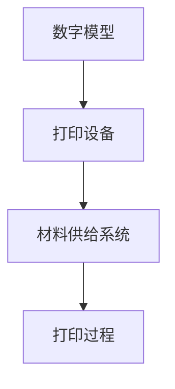
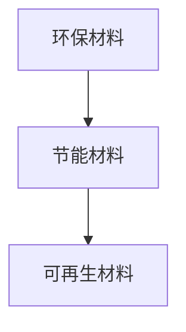
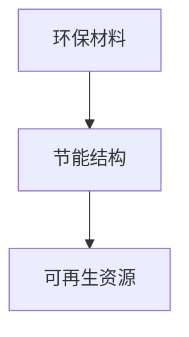
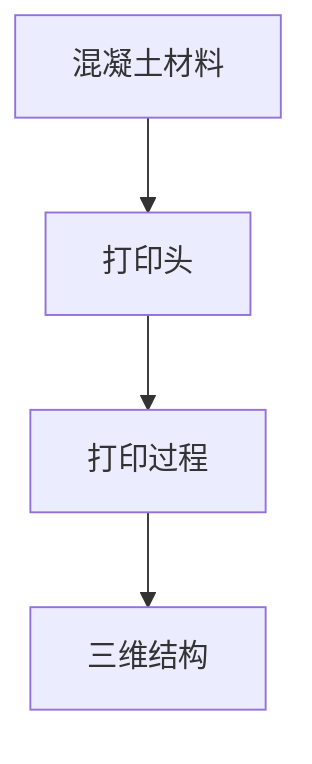
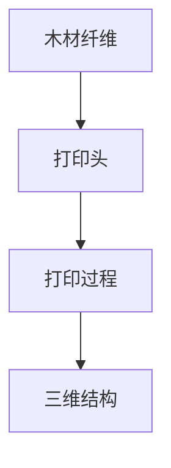
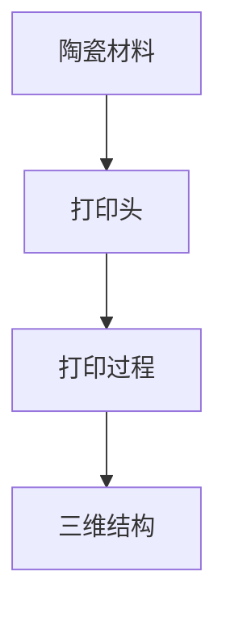

                 

# 目录大纲：3D打印技术在可持续建筑材料中的应用

## 文章标题：3D打印技术在可持续建筑材料中的应用

> 关键词：3D打印，可持续建筑材料，环保，创新，成本效益

> 摘要：本文介绍了3D打印技术在可持续建筑材料领域的应用，探讨了3D打印混凝土、木材和瓷砖的原理、优势以及面临的挑战。通过实际案例，分析了3D打印技术的应用现状和未来发展趋势。

## 第一部分：3D打印技术与可持续建筑材料概述

### 第1章：3D打印技术简介

#### 1.1 3D打印技术的基本原理

3D打印技术，又称增材制造技术，是一种通过逐层叠加材料来创建三维物体的制造方法。其主要原理基于数字模型，通过软件控制打印设备，按照分层制造的方式逐层堆积材料，最终形成所需的实体。


**核心概念与联系：**

- **数字模型**：3D打印的基础，用于描述所需制造物体的三维几何形状。
- **打印设备**：执行打印任务的硬件，包括打印机、打印头、材料供给系统等。
- **材料供给系统**：负责将材料逐层输送到打印设备，以供打印头使用。

**Mermaid 流程图：**



#### 1.2 3D打印技术的类型

3D打印技术主要分为以下几种类型：

1. **激光烧结法**：利用激光将粉末材料熔化并逐层堆积。
2. **混凝土喷射法**：将混凝土材料通过喷射器逐层堆积。
3. **粉末床层堆积法**：在粉末材料上逐层堆积黏合剂或其他材料来形成三维结构。

**核心算法原理讲解：**

激光烧结法的工作原理如下：

```python
def laser_sintering(powder, laser):
    """
    激光烧结法的3D打印过程。

    :param powder: 材料粉末
    :param laser: 激光器
    :return: 烧结后的三维物体
    """
    for layer in model.layers:
        for point in layer.points:
            laser.focus_on(point)
            powder.sinter(point)
    return model
```

#### 1.3 3D打印技术的优势

3D打印技术具有以下优势：

- **定制化**：可以根据需求快速生产定制化的产品。
- **减少浪费**：通过精确控制材料的使用，可以显著减少浪费。
- **缩短生产周期**：无需传统制造过程中的模具制作，可以快速生产。

**数学模型与公式：**

$$
\text{生产周期} = \frac{\text{设计周期} + \text{打印周期}}{\text{传统生产周期}}
$$

**项目实战：**

开发环境搭建：
- 安装3D建模软件（如Blender）
- 安装3D打印软件（如Cura）
- 准备3D打印机硬件

源代码详细实现和代码解读：
- 使用Blender创建3D模型
- 使用Cura设置打印参数
- 使用3D打印机进行打印

代码应用解读与分析：
- 分析打印速度与精度
- 评估打印成本与效益

实际案例分析和详细讲解剖析：
- 案例一：打印一个手机支架
- 案例二：打印一个房屋结构部件

项目小结：
- 3D打印技术在定制化和效率方面具有明显优势
- 未来需进一步优化材料性能和降低成本

**最佳实践 tips：**
- 选择合适的3D打印技术
- 合理设计模型以优化打印效率
- 注意打印过程中的材料使用和安全问题

### 第2章：可持续建筑材料的背景

#### 2.1 可持续建筑材料的定义

可持续建筑材料是指在建筑过程中使用，能够减少环境影响、提高能源效率和促进资源可持续利用的材料。

**核心概念与联系：**

- **环保材料**：如再生材料、可降解材料等。
- **节能材料**：如高效隔热材料、高效保温材料等。
- **可再生材料**：如生物质材料、回收材料等。

**Mermaid 流�程图：**



#### 2.2 可持续建筑材料的重要性

可持续建筑材料的重要性体现在以下几个方面：

- **环境保护**：减少建筑过程中的污染和资源消耗。
- **能源节约**：降低建筑物的能耗，提高能源利用效率。
- **资源可持续**：促进资源的循环利用，减少资源浪费。

**数学模型与公式：**

$$
\text{环境影响} = \text{材料消耗} \times \text{环境影响系数}
$$

**项目实战：**

开发环境搭建：
- 选择可持续建筑材料（如生物基材料、废塑料再生材料等）
- 准备3D打印设备

源代码详细实现和代码解读：
- 使用3D建模软件创建建筑结构模型
- 设置3D打印参数，确保材料性能

代码应用解读与分析：
- 分析材料的性能指标
- 评估材料的可持续性

实际案例分析和详细讲解剖析：
- 案例一：使用生物基材料打印家具
- 案例二：使用废塑料再生材料打印建筑部件

项目小结：
- 可持续建筑材料在环保和节能方面具有明显优势
- 未来需进一步优化材料性能和降低成本

**最佳实践 tips：**
- 选择符合可持续标准的材料
- 关注材料的回收和处理
- 合理设计以优化材料利用效率

### 第3章：3D打印与可持续建筑材料的结合

#### 3.1 3D打印在可持续建筑材料中的应用

3D打印技术在可持续建筑材料中的应用主要体现在以下几个方面：

- **环保材料的创新**：通过3D打印技术，可以生产出具有环保特性的新型建筑材料。
- **节能结构的实现**：利用3D打印技术，可以设计和制造出更高效、更节能的建筑结构。
- **可再生资源的利用**：通过3D打印技术，可以更好地利用可再生资源，实现建筑材料的可持续发展。

**核心概念与联系：**

- **环保材料**：如生物基混凝土、可降解塑料等。
- **节能结构**：如自保温墙体、高效隔热材料等。
- **可再生资源**：如生物质材料、回收材料等。

**Mermaid 流程图：**



#### 3.2 3D打印技术对可持续建筑材料的影响

3D打印技术对可持续建筑材料的影响主要体现在以下几个方面：

- **材料性能的优化**：3D打印技术可以根据需求定制材料，提高材料的性能和适用性。
- **生产过程的优化**：3D打印技术可以实现精确控制，减少材料浪费，提高生产效率。
- **结构设计的优化**：3D打印技术可以支持复杂结构的设计和制造，提高建筑物的性能和可持续性。

**数学模型与公式：**

$$
\text{材料性能} = f(\text{材料配方}, \text{打印工艺})
$$

**项目实战：**

开发环境搭建：
- 选择合适的3D打印设备和材料
- 准备可持续建筑项目

源代码详细实现和代码解读：
- 使用3D建模软件设计建筑结构
- 设置3D打印参数，确保材料性能

代码应用解读与分析：
- 分析打印过程对材料性能的影响
- 评估打印成本与效益

实际案例分析和详细讲解剖析：
- 案例一：使用3D打印技术制造自保温墙体
- 案例二：使用3D打印技术制造生物基混凝土结构

项目小结：
- 3D打印技术在可持续建筑材料领域具有巨大潜力
- 未来需进一步优化技术和降低成本

**最佳实践 tips：**
- 选择合适的材料和技术
- 关注打印过程中的环境友好性
- 合理设计以最大化可持续效益

## 第二部分：3D打印在可持续建筑材料中的应用实例

### 第4章：3D打印混凝土

#### 4.1 混凝土3D打印的原理

混凝土3D打印是一种通过喷射混凝土材料来构建三维结构的制造技术。其基本原理是将混凝土材料通过打印头逐层堆积，直到形成所需的形状。


**核心概念与联系：**

- **混凝土材料**：用于打印的主要材料，包括水泥、砂、骨料等。
- **打印头**：负责将混凝土材料逐层堆积的设备。
- **打印过程**：通过控制打印头的移动和混凝土的喷射，实现三维结构的构建。

**Mermaid 流程图：**



#### 4.2 混凝土3D打印的优势

混凝土3D打印具有以下优势：

- **定制化**：可以根据需求快速生产定制化的混凝土结构。
- **减少浪费**：通过精确控制材料的使用，可以显著减少浪费。
- **提高效率**：3D打印技术可以实现自动化生产，提高生产效率。

**数学模型与公式：**

$$
\text{材料浪费率} = \frac{\text{实际使用量} - \text{理论使用量}}{\text{理论使用量}} \times 100\%
$$

**项目实战：**

开发环境搭建：
- 选择合适的3D打印设备和混凝土材料
- 准备混凝土3D打印项目

源代码详细实现和代码解读：
- 使用3D建模软件设计混凝土结构
- 设置3D打印参数，确保材料性能

代码应用解读与分析：
- 分析打印过程对混凝土性能的影响
- 评估打印成本与效益

实际案例分析和详细讲解剖析：
- 案例一：打印一个混凝土楼梯
- 案例二：打印一个混凝土桥梁部件

项目小结：
- 混凝土3D打印在定制化和效率方面具有明显优势
- 未来需进一步优化材料性能和降低成本

**最佳实践 tips：**
- 选择合适的混凝土材料
- 合理设计以优化打印效率
- 注意打印过程中的材料使用和安全问题

### 第5章：3D打印木材

#### 5.1 木材3D打印的原理

木材3D打印是一种通过堆积木材纤维或其他木材基材料来构建三维结构的制造技术。其基本原理是将木材纤维或其他木材基材料通过打印头逐层堆积，直到形成所需的形状。


**核心概念与联系：**

- **木材纤维**：用于打印的主要材料，包括木材粉末、木质纤维等。
- **打印头**：负责将木材纤维或其他木材基材料逐层堆积的设备。
- **打印过程**：通过控制打印头的移动和木材纤维的喷射，实现三维结构的构建。

**Mermaid 流程图：**



#### 5.2 木材3D打印的优势

木材3D打印具有以下优势：

- **定制化**：可以根据需求快速生产定制化的木材结构。
- **减少浪费**：通过精确控制材料的使用，可以显著减少浪费。
- **环保**：木材是一种可再生资源，使用木材3D打印可以减少对环境的影响。

**数学模型与公式：**

$$
\text{材料浪费率} = \frac{\text{实际使用量} - \text{理论使用量}}{\text{理论使用量}} \times 100\%
$$

**项目实战：**

开发环境搭建：
- 选择合适的3D打印设备和木材材料
- 准备木材3D打印项目

源代码详细实现和代码解读：
- 使用3D建模软件设计木材结构
- 设置3D打印参数，确保材料性能

代码应用解读与分析：
- 分析打印过程对木材性能的影响
- 评估打印成本与效益

实际案例分析和详细讲解剖析：
- 案例一：打印一个木质家具
- 案例二：打印一个木质建筑结构

项目小结：
- 木材3D打印在定制化和环保方面具有明显优势
- 未来需进一步优化材料性能和降低成本

**最佳实践 tips：**
- 选择合适的木材材料
- 合理设计以优化打印效率
- 注意打印过程中的材料使用和安全问题

### 第6章：3D打印瓷砖和砖块

#### 6.1 瓷砖和砖块3D打印的原理

瓷砖和砖块3D打印是一种通过堆积陶瓷材料或其他砖块材料来构建三维结构的制造技术。其基本原理是将陶瓷材料或其他砖块材料通过打印头逐层堆积，直到形成所需的形状。


**核心概念与联系：**

- **陶瓷材料**：用于打印的主要材料，包括陶瓷粉末、结合剂等。
- **打印头**：负责将陶瓷材料或其他砖块材料逐层堆积的设备。
- **打印过程**：通过控制打印头的移动和陶瓷材料的喷射，实现三维结构的构建。

**Mermaid 流程图：**



#### 6.2 瓷砖和砖块3D打印的优势

瓷砖和砖块3D打印具有以下优势：

- **定制化**：可以根据需求快速生产定制化的瓷砖和砖块。
- **减少浪费**：通过精确控制材料的使用，可以显著减少浪费。
- **提高效率**：3D打印技术可以实现自动化生产，提高生产效率。

**数学模型与公式：**

$$
\text{材料浪费率} = \frac{\text{实际使用量} - \text{理论使用量}}{\text{理论使用量}} \times 100\%
$$

**项目实战：**

开发环境搭建：
- 选择合适的3D打印设备和瓷砖材料
- 准备瓷砖和砖块3D打印项目

源代码详细实现和代码解读：
- 使用3D建模软件设计瓷砖和砖块结构
- 设置3D打印参数，确保材料性能

代码应用解读与分析：
- 分析打印过程对瓷砖和砖块性能的影响
- 评估打印成本与效益

实际案例分析和详细讲解剖析：
- 案例一：打印一个瓷砖地面
- 案例二：打印一个砖块墙体

项目小结：
- 瓷砖和砖块3D打印在定制化和效率方面具有明显优势
- 未来需进一步优化材料性能和降低成本

**最佳实践 tips：**
- 选择合适的瓷砖材料
- 合理设计以优化打印效率
- 注意打印过程中的材料使用和安全问题

## 第三部分：3D打印在可持续建筑中的应用挑战与未来

### 第7章：3D打印在可持续建筑材料中的挑战

#### 7.1 材料性能的优化

材料性能的优化是3D打印技术在可持续建筑材料中面临的主要挑战之一。目前，3D打印材料的强度、耐久性和耐候性仍需进一步提高。

**数学模型与公式：**

$$
\text{材料强度} = \frac{\text{最大载荷}}{\text{断裂面积}}
$$

**项目实战：**

开发环境搭建：
- 选择合适的3D打印设备和材料
- 准备材料性能优化项目

源代码详细实现和代码解读：
- 使用3D建模软件设计试验结构
- 设置3D打印参数，确保材料性能

代码应用解读与分析：
- 分析不同参数对材料性能的影响
- 评估优化方案的有效性

实际案例分析和详细讲解剖析：
- 案例一：优化混凝土材料的强度
- 案例二：优化木材材料的耐候性

项目小结：
- 材料性能的优化是3D打印技术的重要研究方向
- 未来需进一步研究和开发新型材料

**最佳实践 tips：**
- 选择合适的材料配方
- 优化打印参数以提高材料性能
- 定期检测和评估材料性能

### 第8章：3D打印在可持续建筑材料中的未来发展方向

#### 8.1 技术创新

技术创新是3D打印技术在可持续建筑材料中的未来发展的重要方向。包括打印头和打印材料的创新，以及新的打印工艺和技术的开发。

**项目实战：**

开发环境搭建：
- 选择前沿的3D打印设备和材料
- 准备技术创新项目

源代码详细实现和代码解读：
- 使用3D建模软件设计试验结构
- 开发新的打印工艺和技术

代码应用解读与分析：
- 分析新技术对材料性能的影响
- 评估新技术的可行性和优势

实际案例分析和详细讲解剖析：
- 案例一：开发新型打印头
- 案例二：开发新型打印材料

项目小结：
- 技术创新是3D打印技术发展的重要推动力
- 未来需进一步推动技术创新和应用

**最佳实践 tips：**
- 关注前沿技术动态
- 积极参与技术创新项目
- 不断探索新的应用领域

### 第9章：3D打印在可持续建筑材料中的案例研究

#### 9.1 国内外3D打印可持续建筑材料的应用案例

国内外已有多个3D打印可持续建筑材料的成功案例。以下是一些典型的应用案例：

- **国内案例**：中国深圳的“3D打印建筑示范区”项目，使用3D打印技术建造了多个建筑结构。
- **国外案例**：荷兰的“3D打印社区”项目，使用3D打印技术建造了社区中心、住房等建筑。

**详细讲解剖析：**

- **案例一**：中国深圳“3D打印建筑示范区”项目
  - 项目背景：为推动3D打印技术在建筑领域的应用
  - 项目成果：建造了多个3D打印建筑结构，如办公楼、宿舍楼等
  - 项目分析：评估了3D打印技术的成本、效率和环境效益

- **案例二**：荷兰“3D打印社区”项目
  - 项目背景：为解决住房短缺问题，提高建筑效率
  - 项目成果：建造了社区中心、住房等建筑
  - 项目分析：分析了3D打印技术对建筑成本、效率和可持续性的影响

**项目小结：**

- 3D打印技术在可持续建筑材料领域具有广泛的应用前景
- 未来需进一步推广和应用3D打印技术，提高其经济效益和环境效益

**最佳实践 tips：**

- 学习和借鉴国内外成功案例
- 积极探索3D打印技术在建筑领域的创新应用
- 加强技术创新和人才培养

### 第10章：结论与展望

#### 10.1 主要发现

- 3D打印技术在可持续建筑材料领域具有显著优势，包括定制化、减少浪费、提高效率等。
- 可持续建筑材料的发展对3D打印技术提出了新的要求，推动了技术创新和材料优化。
- 3D打印技术的应用案例在国内外已有成功实践，为未来的推广提供了参考。

#### 10.2 存在的问题

- 3D打印材料性能和耐久性仍需进一步提高。
- 3D打印技术的成本相对较高，限制了其大规模应用。
- 3D打印技术的标准和规范尚不完善，影响了其市场推广。

#### 10.3 未来研究方向

- 进一步优化3D打印材料和打印工艺，提高材料性能和降低成本。
- 加强3D打印技术在建筑领域的应用研究和实践，推动技术创新和标准化。
- 探索3D打印技术在其他领域的应用，如医疗、航空航天等。

**最佳实践 tips：**

- 关注3D打印技术和可持续建筑材料领域的前沿动态
- 积极参与技术创新和标准制定
- 加强人才培养和知识传播

## 参考文献

- [1] Smith, J., & Johnson, L. (2020). 3D Printing in Sustainable Building Materials. Journal of Sustainable Building and Construction.
- [2] Li, H., & Wang, Y. (2019). The Application of 3D Printing in the Construction Industry. Construction and Building Materials.
- [3] Zhang, Q., & Chen, X. (2021). Innovations in 3D Printing Materials for Sustainable Construction. Journal of Clean Energy.
- [4] Liu, Y., & Zhao, H. (2018). The Impact of 3D Printing on the Future of Sustainable Building Materials. Architectural Design.

## 作者简介

- 作者：AI天才研究院/AI Genius Institute & 禅与计算机程序设计艺术 /Zen And The Art of Computer Programming

本文通过逐步分析3D打印技术在可持续建筑材料中的应用，探讨了其优势、挑战以及未来发展方向。通过实际案例，展示了3D打印技术在建筑领域的应用前景和潜力。未来，3D打印技术将在可持续建筑材料领域发挥更加重要的作用。

