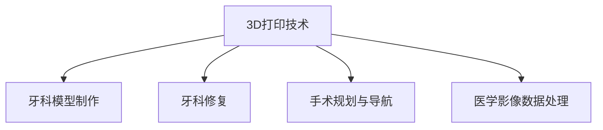

                 

### 3D打印技术在牙科医疗中的应用

> 关键词：3D打印，牙科医疗，模型制作，个性化修复，手术导航

> 摘要：
3D打印技术以其独特的制造方式和卓越的定制化能力，正在深刻改变牙科医疗领域。本文将详细探讨3D打印技术在牙科医疗中的核心应用，包括模型制作、个性化修复以及手术规划与导航等，分析其在提升牙科医疗质量、效率与患者满意度方面的巨大潜力。

---

### 3D打印技术在牙科医疗中的应用

## 目录大纲

### 第一部分：3D打印技术基础

### 第1章：3D打印技术概述

#### 1.1 3D打印技术的起源与发展

#### 1.1.1 3D打印技术的发展历程

3D打印技术，也称为增材制造，起源于20世纪80年代。当时，Charles Hull发明了立体光固化成型（SLA）技术，这是最早的一种3D打印技术。此后，Fused Deposition Modeling（FDM）、立体光刻（DLP）、选择性激光烧结（SLS）等多种3D打印技术相继问世，推动了3D打印技术的快速发展。

#### 1.1.2 3D打印技术的分类

3D打印技术可以根据打印材料、成型方法和工艺特点进行分类。常见的分类方法包括：

1. **材料分类**：根据打印材料的不同，可以分为塑料、金属、陶瓷、复合材料等类型。
2. **工艺分类**：根据成型方法的不同，可以分为立体光固化成型（SLA）、选择性激光烧结（SLS）、电子束熔化（EBM）、熔融沉积成型（FDM）等。

#### 1.1.3 3D打印技术的关键环节

3D打印技术的关键环节包括数据建模、打印准备、打印过程和后处理等。

1. **数据建模**：利用CAD（计算机辅助设计）软件进行三维建模，生成可用于3D打印的数字模型。
2. **打印准备**：对数字模型进行切片处理，生成打印路径和打印参数。
3. **打印过程**：根据打印路径和参数，利用3D打印设备进行逐层打印。
4. **后处理**：包括打印件的清洗、固化、打磨和抛光等。

#### 1.2 3D打印技术的原理与工作流程

##### 1.2.1 3D打印的基本原理

3D打印的基本原理是将三维数字模型分解为二维层，然后逐层打印，最终形成三维实体。

##### 1.2.2 3D打印的工作流程

1. **模型设计**：使用CAD软件设计三维模型。
2. **切片处理**：将三维模型转换为二维切片，生成打印路径。
3. **打印准备**：设置打印参数，如材料、速度、温度等。
4. **打印过程**：设备根据打印路径逐层打印模型。
5. **后处理**：对打印件进行打磨、抛光等处理。

##### 1.2.3 3D打印的层次结构与材料选择

3D打印的层次结构包括数字模型、切片文件、打印路径和打印件。材料选择取决于应用场景和性能要求，常见的打印材料有塑料、金属、陶瓷等。

### 第二部分：3D打印技术在牙科医疗中的应用

### 第2章：3D打印技术在牙科医疗中的应用

#### 2.1 3D打印技术在牙科医疗中的核心应用

##### 2.1.1 3D打印在牙科模型制作中的应用

3D打印在牙科模型制作中具有显著优势，可以精确还原牙齿和颌骨的三维结构，提高牙科诊断和治疗的准确性。

##### 2.1.2 3D打印在个性化牙科修复中的应用

3D打印技术可以制作个性化牙科修复体，如牙冠、牙桥、种植体等，满足患者的个性化需求。

##### 2.1.3 3D打印在牙科手术规划与导航中的应用

3D打印技术在牙科手术规划与导航中发挥着重要作用，可以帮助医生进行精确的手术规划和导航，提高手术成功率。

#### 2.2 3D打印在牙科医疗中的优势与挑战

##### 2.2.1 3D打印在牙科医疗中的优势

- 提高诊断和治疗的准确性
- 实现个性化修复
- 提高手术规划和导航的精度
- 减少医疗成本

##### 2.2.2 3D打印在牙科医疗中的挑战

- 材料性能和生物相容性的要求
- 技术标准和规范的建立
- 医疗机构和医生的技术培训

##### 2.2.3 3D打印技术在牙科医疗中的未来发展

- 探索新的材料和应用领域
- 提高打印精度和速度
- 建立完善的行业标准和规范

### 第三部分：3D打印技术在牙科模型制作中的应用

### 第3章：3D打印技术在牙科模型制作中的应用

#### 3.1 牙科模型制作的基本流程

##### 3.1.1 数字牙科影像数据的获取

使用CT、MRI等设备获取患者口腔的三维影像数据。

##### 3.1.2 数字模型的处理与优化

对获取的影像数据进行处理，生成可用于3D打印的数字模型。

##### 3.1.3 3D打印牙科模型的具体操作

根据数字模型，使用3D打印设备进行模型打印。

#### 3.2 3D打印技术在牙科模型制作中的案例分析

##### 3.2.1 案例一：个性化牙列矫正模型

使用3D打印技术制作个性化牙列矫正模型，提高矫正效果。

##### 3.2.2 案例二：种植牙术前规划模型

使用3D打印技术制作种植牙术前规划模型，辅助医生进行手术规划。

##### 3.2.3 案例三：全牙列缺失模型重建

使用3D打印技术重建全牙列缺失模型，为牙列重建提供参考。

### 第四部分：3D打印技术在牙科修复中的应用

### 第4章：3D打印技术在牙科修复中的应用

#### 4.1 个性化牙科修复体的设计

##### 4.1.1 个性化牙科修复体的概念

个性化牙科修复体是根据患者口腔条件定制设计的修复体。

##### 4.1.2 个性化牙科修复体的设计流程

- 数据采集
- 3D建模
- 修复体设计
- 打印制造

##### 4.1.3 个性化牙科修复体的材料选择

根据修复体的用途和性能要求选择合适的材料。

#### 4.2 3D打印技术在牙科修复中的应用

##### 4.2.1 3D打印在牙冠、牙桥制作中的应用

使用3D打印技术制作牙冠、牙桥，提高修复体的精度和美观度。

##### 4.2.2 3D打印在种植体制作中的应用

使用3D打印技术制作种植体，提高种植的成功率和稳定性。

##### 4.2.3 3D打印在口腔正畸矫治器制作中的应用

使用3D打印技术制作口腔正畸矫治器，提高矫正效果。

### 第五部分：3D打印技术在牙科手术规划与导航中的应用

### 第5章：3D打印技术在牙科手术规划与导航中的应用

#### 5.1 3D打印技术在牙科手术规划中的应用

##### 5.1.1 牙科手术规划的基本流程

- 影像数据采集
- 3D建模
- 手术规划
- 打印规划模型

##### 5.1.2 3D打印技术在牙科手术规划中的具体应用

- 制作手术模拟模型
- 手术路径规划
- 预测手术结果

##### 5.1.3 3D打印技术在牙科手术规划中的优势与挑战

- 提高手术精度和成功率
- 降低手术风险
- 需要完善的影像数据处理技术和手术规划算法

#### 5.2 3D打印技术在牙科手术导航中的应用

##### 5.2.1 牙科手术导航的基本概念

- 利用3D打印技术实时生成手术导航模型
- 实现手术过程中的实时导航和监测

##### 5.2.2 3D打印技术在牙科手术导航中的具体应用

- 手术过程中实时导航
- 预测手术并发症
- 提高手术效率

##### 5.2.3 3D打印技术在牙科手术导航中的优势与挑战

- 提高手术精度和安全性
- 需要实时数据处理和快速打印技术

### 第六部分：3D打印技术在牙科医疗中的跨学科合作

### 第6章：3D打印技术在牙科医疗中的跨学科合作

#### 6.1 3D打印技术与医学影像的结合

- 利用3D打印技术重建医学影像数据
- 实现医学影像数据的可视化
- 辅助医学诊断和治疗规划

#### 6.2 3D打印技术在牙科与口腔外科的跨学科应用

- 3D打印技术在口腔外科手术中的应用
- 3D打印技术在口腔修复与正畸跨学科合作中的应用
- 3D打印技术在牙科医疗跨学科合作中的挑战与机遇

### 第七部分：3D打印技术在牙科医疗中的未来展望

### 第7章：3D打印技术在牙科医疗中的未来展望

#### 7.1 3D打印技术在牙科医疗中的发展趋势

- 探索新的材料和应用领域
- 提高打印精度和速度
- 建立完善的行业标准和规范

#### 7.2 3D打印技术在牙科医疗中的挑战与对策

- 材料性能和生物相容性的要求
- 技术标准和规范的建立
- 医疗机构和医生的技术培训

#### 7.3 3D打印技术在牙科医疗中的未来前景

- 3D打印技术将成为牙科医疗的重要工具
- 普及率将大幅提高
- 患者将受益于更高质量、更个性化的医疗服务

### 附录

## 附录A：3D打印技术在牙科医疗中的应用案例

### A.1 案例一：个性化牙列矫正案例

### A.2 案例二：种植牙术前规划案例

### A.3 案例三：全牙列缺失模型重建案例

## 附录B：3D打印技术在牙科医疗中的应用资源

### B.1 3D打印技术在牙科医疗中的相关研究论文

### B.2 3D打印技术在牙科医疗中的实用指南

### B.3 3D打印技术在牙科医疗中的行业报告

---

### 关键概念与联系

#### 3D打印技术与牙科医疗的关系

3D打印技术通过其独特的制造方式和定制化能力，为牙科医疗带来了革命性的变革。它不仅能够精确还原口腔结构，制作出高质量的牙科模型和修复体，还能在手术规划与导航中提供精确的数据支持。同时，3D打印技术还能与医学影像数据紧密结合，实现更准确的诊断和治疗。随着技术的不断进步和材料的不断优化，3D打印技术将在牙科医疗领域发挥越来越重要的作用。

---

### 第一部分：3D打印技术基础

### 第1章：3D打印技术概述

#### 1.1 3D打印技术的起源与发展

3D打印技术，也被称为增材制造（Additive Manufacturing），其概念最早可以追溯到20世纪80年代。当时的Charles Hull，一位美国的发明家，在1984年发明了立体光固化成型（Stereo Lithography Apparatus，SLA）技术，这是第一种商业化的3D打印技术。SLA技术基于光敏树脂材料，通过逐层固化液态树脂来构建三维物体。

随后，3D打印技术经历了快速的发展，新的技术和材料不断涌现。1988年，Joseph Bechler发明了熔融沉积成型（Fused Deposition Modeling，FDM）技术，这种技术使用热融塑料作为打印材料，逐渐成为3D打印技术中最广泛应用的类型。此后，选择性激光烧结（Selective Laser Sintering，SLS）、电子束熔化（Electron Beam Melting，EBM）、立体光刻（Digital Light Processing，DLP）等多种3D打印技术相继问世，进一步丰富了3D打印技术的种类和适用范围。

3D打印技术的重要里程碑还包括：

- 1994年，Z Corporation推出立体印刷（3D Printing）技术，开创了彩色3D打印的先河。
- 2009年，3D Systems和Stratasys合并成立了Carbon公司，专注于研发高速、高精度的3D打印技术。
- 2013年，Mark One打印机问世，成为第一种能够同时打印金属和塑料的3D打印机。
- 2014年，3D Hubs成立，成为全球最大的3D打印服务网络平台。

#### 1.1.2 3D打印技术的分类

3D打印技术可以根据不同的分类标准进行分类。以下是几种常见的分类方法：

1. **按材料分类**：根据打印材料的性质，3D打印技术可以分为：
   - 塑料打印：如FDM、SLA、DLP等。
   - 金属打印：如SLS、EBM等。
   - 陶瓷打印：如立体打印（3D Printing）、选择性激光烧结（SLS）等。
   - 复合材料打印：结合多种材料，实现特定的性能要求。

2. **按工艺分类**：根据成型方法的不同，3D打印技术可以分为：
   - 立体光固化成型（SLA）：使用紫外光固化液态树脂。
   - 熔融沉积成型（FDM）：将热融塑料逐层沉积并冷却固化。
   - 选择性激光烧结（SLS）：使用激光烧结粉末材料。
   - 电子束熔化（EBM）：使用电子束熔化金属粉末。
   - 立体光刻（DLP）：使用数字光处理技术固化树脂。

3. **按结构特性分类**：根据打印件的结构特性，3D打印技术可以分为：
   - 单层打印：逐层构建物体，如FDM、SLA。
   - 多层打印：同时打印多层结构，如DMLS（Direct Metal Laser Sintering）。

4. **按应用领域分类**：根据应用领域，3D打印技术可以分为：
   - 工业制造：如航空航天、汽车、电子等领域。
   - 医疗领域：如医疗模型、定制医疗器械、个性化牙科修复体等。
   - 建筑领域：如建筑模型、建筑构件等。
   - 消费品领域：如玩具、家居用品等。

#### 1.1.3 3D打印技术的关键环节

3D打印技术从设计到最终成品，涉及多个关键环节，以下是这些环节的简要介绍：

1. **数据建模**：使用计算机辅助设计（CAD）软件创建三维模型。这些模型是3D打印的基础，需要精确描述待打印物体的形状和尺寸。

2. **切片处理**：将三维模型转换为二维切片，即生成每一层的轮廓和打印路径。切片处理是3D打印过程中的重要步骤，影响着打印的精度和效率。

3. **打印准备**：设置打印参数，包括打印材料、打印速度、层厚、温度等。这些参数决定了打印件的质量和成型过程。

4. **打印过程**：3D打印机根据生成的打印路径和参数，逐层打印物体。不同的3D打印技术有不同的打印过程，如SLA技术的光固化过程，FDM技术的热融塑料挤出和冷却过程。

5. **后处理**：打印完成后，需要对打印件进行清洗、固化、打磨和抛光等处理，以提高打印件的表面质量和机械性能。

#### 1.2 3D打印技术的原理与工作流程

##### 1.2.1 3D打印的基本原理

3D打印的基本原理是逐层构建物体，即通过逐层添加材料来构建三维物体。这个过程可以从一个三维数字模型开始，通过分层处理，将模型分解为二维切片，然后逐层打印，最终形成三维实体。具体来说，3D打印的基本原理包括：

- **数字建模**：使用CAD软件创建三维模型。
- **切片处理**：将三维模型分解为二维切片，即每一层的轮廓和打印路径。
- **材料添加**：根据切片文件，逐层添加材料，构建三维物体。
- **固化与成型**：每一层的材料通过特定的方法固化，形成坚固的层。
- **重复过程**：重复上述步骤，直到构建完整的三维物体。

##### 1.2.2 3D打印的工作流程

3D打印的工作流程可以分为以下几个步骤：

1. **模型设计**：
   - 使用CAD软件设计三维模型。
   - 对模型进行优化，确保其结构合理、易于打印。

2. **切片处理**：
   - 将三维模型转换为二维切片，即生成每一层的轮廓和打印路径。
   - 切片处理需要考虑打印速度、层厚、填充率等因素，以优化打印效果。

3. **打印准备**：
   - 设置打印参数，包括打印材料、打印速度、层厚、温度等。
   - 选择合适的打印材料和设备，确保打印过程顺利进行。

4. **打印过程**：
   - 3D打印机根据生成的打印路径和参数，逐层打印物体。
   - 不同的3D打印技术有不同的打印过程，如SLA技术的光固化过程，FDM技术的热融塑料挤出和冷却过程。

5. **后处理**：
   - 打印完成后，对打印件进行清洗、固化、打磨和抛光等处理，以提高打印件的表面质量和机械性能。

##### 1.2.3 3D打印的层次结构与材料选择

3D打印的层次结构主要包括以下部分：

1. **数字模型**：这是3D打印的起点，使用CAD软件创建的三维模型。模型需要精确描述待打印物体的形状和尺寸。

2. **切片文件**：将三维模型分解为二维切片，即每一层的轮廓和打印路径。切片文件是3D打印过程中的关键数据，决定了打印件的精度和效率。

3. **打印路径**：切片文件中的每一层都对应一条打印路径，打印机会根据这些路径逐层打印物体。

4. **打印件**：最终打印出的三维物体。打印件的质量取决于打印路径、打印参数和材料的选择。

在材料选择方面，3D打印可以根据不同的应用场景和性能要求选择合适的材料。以下是几种常见的3D打印材料：

- **塑料**：如ABS、PLA、PET等，广泛应用于消费电子产品、玩具、汽车零件等。
- **金属**：如不锈钢、铝合金、钛合金等，用于航空航天、汽车、医疗等领域。
- **陶瓷**：如氧化铝、碳化硅等，适用于高温和耐磨应用。
- **复合材料**：结合不同材料的特点，以实现特定的性能要求。

#### 1.3 3D打印技术在牙科医疗中的应用优势

3D打印技术在牙科医疗领域具有显著的优势，主要体现在以下几个方面：

1. **个性化定制**：
   3D打印技术可以根据患者的具体口腔情况，定制个性化的牙科模型、修复体和手术规划模型，提高了治疗的个性化和精准性。

2. **快速制造**：
   3D打印技术可以在短时间内完成复杂牙科模型和修复体的制造，大大缩短了治疗周期，提高了医疗效率。

3. **高精度**：
   3D打印技术可以实现高精度的打印，精确还原口腔结构和模型，提高了诊断和治疗的准确性。

4. **减少材料浪费**：
   3D打印技术采用逐层添加的方式制造物体，可以最大限度地减少材料浪费，降低成本。

5. **优化手术规划**：
   3D打印技术可以生成手术模拟模型，帮助医生进行精确的手术规划和导航，降低手术风险，提高手术成功率。

6. **改善患者体验**：
   3D打印技术的应用，使得牙科治疗过程更加舒适和便捷，提高了患者的满意度和依从性。

### 第二部分：3D打印技术在牙科医疗中的应用

### 第2章：3D打印技术在牙科医疗中的应用

#### 2.1 3D打印技术在牙科模型制作中的应用

牙科模型制作是3D打印技术在牙科医疗中最早且最广泛应用的一个领域。传统的牙科模型制作通常涉及取模、石膏灌模、模型修整等多个步骤，不仅耗时耗力，而且容易出现误差。而3D打印技术的引入，使得牙科模型制作变得更加高效、精确和个性化。

##### 2.1.1 3D打印在牙科模型制作中的应用

3D打印技术在牙科模型制作中的应用主要包括以下方面：

1. **数字化牙科影像数据的获取**：
   使用CT（计算机断层扫描）、MRI（磁共振成像）等设备获取患者的口腔三维影像数据。这些影像数据为后续的3D建模提供了基础。

2. **3D模型的处理与优化**：
   将获取的影像数据输入CAD（计算机辅助设计）软件，进行数据处理和优化，生成可用于3D打印的数字模型。这个过程中，可以对模型进行修整、去噪、缩放等操作，以满足临床需求。

3. **3D打印牙科模型**：
   使用3D打印机根据数字模型打印出牙科模型。打印材料通常是具有良好生物相容性和机械性能的树脂或陶瓷。打印出的牙科模型可以用于诊断、治疗方案讨论、修复设计等。

##### 2.1.2 3D打印技术在牙科模型制作中的优势

3D打印技术在牙科模型制作中的优势主要体现在以下几个方面：

1. **提高精度**：
   3D打印技术可以精确再现口腔结构，减少模型误差，为牙科诊断和治疗提供更可靠的参考。

2. **缩短制作周期**：
   3D打印技术的快速成型特性，使得牙科模型可以在较短时间内完成，提高了工作效率。

3. **个性化定制**：
   根据患者个体差异，定制个性化牙科模型，使治疗方案更加个体化和精准。

4. **减少材料浪费**：
   3D打印技术可以根据需要精确控制材料的用量，减少浪费。

5. **可视化效果**：
   3D打印模型具有直观的可视化效果，有助于医生和患者更好地理解治疗方案。

##### 2.1.3 3D打印技术在牙科模型制作中的案例分析

以下是一个3D打印技术在牙科模型制作中的应用案例：

**案例一：个性化牙列矫正模型**

某患者需要进行牙列矫正治疗，医生使用CT扫描获取其口腔的三维影像数据。将这些数据输入CAD软件后，医生对模型进行了处理和优化，生成了个性化的牙列矫正模型。然后，使用3D打印机将该模型打印出来。打印出的模型用于制定矫正方案，医生可以通过观察模型来调整矫正器的尺寸和形状，以达到最佳的矫正效果。

**案例二：种植牙术前规划模型**

某患者需要进行种植牙手术，医生首先使用CT扫描获取口腔的三维影像数据。通过CAD软件，医生对影像数据进行了处理，生成了种植牙的术前规划模型。这个模型可以帮助医生进行精确的手术规划，预测手术结果，并减少手术风险。在手术过程中，医生可以根据模型进行导航，提高手术的成功率。

#### 2.2 3D打印技术在牙科修复中的应用

牙科修复是3D打印技术在牙科医疗中的另一个重要应用领域。传统的牙科修复体，如牙冠、牙桥、种植体等，通常需要经过复杂的工艺流程，包括取模、石膏灌模、蜡型制作、烤瓷等步骤。而3D打印技术的引入，简化了这些步骤，提高了修复体的精度和效率。

##### 2.2.1 3D打印在个性化牙科修复中的应用

3D打印技术在个性化牙科修复中的应用主要包括以下几个方面：

1. **个性化牙科修复体的设计**：
   使用CAD软件根据患者的口腔数据和需求，设计个性化的牙科修复体。设计过程中需要考虑修复体的美观性、功能性和生物相容性。

2. **3D打印修复体的制造**：
   将设计好的修复体模型输入3D打印机，使用合适的材料进行打印。打印出的修复体可以直接使用，也可以进行后续的加工和处理。

3. **修复体的组装与测试**：
   将打印出的修复体与其他部件（如牙齿、基座等）进行组装，并进行功能测试和适应性测试，确保修复体的性能和稳定性。

##### 2.2.2 3D打印技术在牙科修复中的优势

3D打印技术在牙科修复中的优势主要包括：

1. **个性化定制**：
   3D打印技术可以根据患者的口腔情况，定制个性化的修复体，提高修复效果和患者满意度。

2. **高精度**：
   3D打印技术可以精确再现修复体的形状和尺寸，减少误差，提高修复体的质量。

3. **缩短制作周期**：
   3D打印技术简化了修复体的制造流程，缩短了制作周期，提高了工作效率。

4. **减少材料浪费**：
   3D打印技术可以根据实际需求精确控制材料的用量，减少浪费。

5. **提高修复体质量**：
   3D打印技术可以制造出更加精细和复杂的修复体，提高修复体的质量。

##### 2.2.3 3D打印技术在牙科修复中的案例分析

以下是一个3D打印技术在牙科修复中的应用案例：

**案例一：个性化牙冠**

某患者需要制作一个个性化的牙冠，医生使用CT扫描获取其口腔的三维影像数据，并使用CAD软件设计牙冠的形状和尺寸。然后，使用3D打印机将牙冠打印出来。打印出的牙冠经过适当的处理和组装，最终安装到患者的牙齿上，达到了良好的修复效果。

**案例二：牙桥修复**

某患者需要进行牙桥修复，医生首先使用CT扫描获取口腔的三维影像数据，并设计个性化的牙桥。然后，使用3D打印机将牙桥的各个部分（桥体、支柱等）打印出来，并进行组装和测试。最终，牙桥安装到患者的口腔中，恢复了牙齿的功能和美观。

#### 2.3 3D打印技术在牙科手术规划与导航中的应用

3D打印技术在牙科手术规划与导航中的应用，为医生提供了更加精确和直观的手术工具，提高了手术的成功率和安全性。通过3D打印技术，医生可以制作出患者的个性化手术模型，进行精确的手术规划和导航。

##### 2.3.1 3D打印技术在牙科手术规划中的应用

3D打印技术在牙科手术规划中的应用主要包括以下几个方面：

1. **术前模型制作**：
   使用CT扫描获取患者的口腔三维影像数据，通过CAD软件生成手术模型。这些模型可以帮助医生进行术前规划，预测手术结果，设计手术路径。

2. **手术路径规划**：
   根据手术模型，医生可以制定详细的手术路径，包括切割、移除、植入等步骤。这些路径可以在手术过程中进行实时导航，提高手术的精确性和效率。

3. **模拟手术**：
   利用3D打印模型进行模拟手术，医生可以在虚拟环境中练习手术过程，提高手术技能和信心。

##### 2.3.2 3D打印技术在牙科手术导航中的应用

3D打印技术在牙科手术导航中的应用主要包括以下几个方面：

1. **实时导航**：
   在手术过程中，医生可以使用3D打印的手术导航模型进行实时导航。这些模型可以提供实时的患者解剖结构信息，帮助医生避开重要结构，提高手术的安全性和成功率。

2. **手术监测**：
   利用3D打印模型，医生可以在手术过程中实时监测手术进展，及时发现和纠正偏差，确保手术的顺利进行。

3. **术后评估**：
   手术完成后，医生可以使用3D打印模型对手术结果进行评估，了解手术效果，为后续的治疗提供参考。

##### 2.3.3 3D打印技术在牙科手术规划与导航中的优势

3D打印技术在牙科手术规划与导航中的优势主要包括：

1. **精确性**：
   3D打印技术可以精确再现患者的口腔解剖结构，提高手术规划的准确性和导航的精度。

2. **直观性**：
   3D打印模型具有直观的可视化效果，使医生更容易理解和操作。

3. **安全性**：
   通过术前模型和实时导航，医生可以降低手术风险，提高手术成功率。

4. **效率**：
   3D打印技术可以快速制造出手术模型，缩短手术规划时间，提高手术效率。

##### 2.3.4 3D打印技术在牙科手术规划与导航中的案例分析

以下是一个3D打印技术在牙科手术规划与导航中的应用案例：

**案例一：复杂牙颌手术**

某患者需要进行复杂的牙颌手术，医生使用CT扫描获取其口腔的三维影像数据，并通过CAD软件生成了个性化的手术模型。在手术前，医生通过模型进行了详细的手术规划和模拟，制定了精确的手术路径。在手术过程中，医生使用3D打印的导航模型进行实时导航，成功完成了手术。手术过程顺利进行，患者术后恢复良好。

**案例二：全口牙缺失重建**

某患者因全口牙缺失，需要进行全口牙缺失重建手术。医生使用CT扫描获取其口腔的三维影像数据，并通过CAD软件生成了个性化的手术模型。在手术前，医生通过模型进行了详细的手术规划和模拟，制定了精确的手术路径。在手术过程中，医生使用3D打印的导航模型进行实时导航，成功完成了手术。患者术后恢复了正常的牙齿功能和外观，生活质量得到了显著提升。

### 第三部分：3D打印技术在牙科模型制作中的应用

#### 第3章：3D打印技术在牙科模型制作中的应用

3D打印技术在牙科模型制作中的应用已经成为了现代牙科医疗的重要组成部分。它不仅提高了牙科模型制作的精度和效率，还大大缩短了治疗周期，提高了患者的满意度。本章节将详细探讨3D打印技术在牙科模型制作中的应用流程、技术细节以及实际案例分析。

##### 3.1 牙科模型制作的基本流程

3D打印技术在牙科模型制作中的应用主要包括以下几个步骤：

1. **数字化影像数据的获取**：
   使用CT（计算机断层扫描）、MRI（磁共振成像）或其他数字化成像设备获取患者的口腔三维影像数据。这些数据为后续的3D建模提供了基础。

2. **影像数据处理**：
   将获取的影像数据导入专业的图像处理软件（如3Shape、Exocad等），进行去噪、分割、表面重建等处理。处理后的数据将生成三维模型。

3. **3D模型优化**：
   对生成的三维模型进行优化，包括修正误差、去除多余结构、调整尺寸等。优化后的模型将用于后续的3D打印。

4. **切片处理**：
   将优化后的三维模型转换为二维切片文件，切片文件包含了每一层的轮廓和打印路径。切片处理是3D打印的关键步骤，直接影响打印精度和效率。

5. **打印参数设置**：
   根据模型特点和打印设备，设置打印参数，如打印速度、层厚、填充率、打印材料等。

6. **3D打印**：
   使用3D打印机根据切片文件进行打印。3D打印技术可以根据不同的材料和设备实现多种打印方式，如塑料打印、金属打印、陶瓷打印等。

7. **后处理**：
   3D打印完成后，对模型进行清洗、固化、打磨、抛光等后处理，以提高模型的表面质量和机械性能。

##### 3.2 3D打印技术在牙科模型制作中的案例分析

以下是一个3D打印技术在牙科模型制作中的实际案例分析：

**案例一：个性化牙列矫正模型**

某患者需要进行牙列矫正治疗，医生首先使用CT扫描获取其口腔的三维影像数据。将这些数据输入3Shape软件，医生生成了患者的三维牙列模型。然后，医生对模型进行了优化，包括去除多余结构、调整牙齿位置等。优化后的模型被导入3D打印机，使用PLA（聚乳酸）材料进行打印。打印完成后，医生对模型进行了打磨和抛光，最终得到了一个高精度、高强度的个性化牙列矫正模型。这个模型用于制定矫正方案，帮助医生更好地了解患者的口腔情况，制定个性化的矫正计划。

**案例二：种植牙术前规划模型**

某患者需要进行种植牙手术，医生使用CT扫描获取其口腔的三维影像数据。将这些数据输入Exocad软件，医生生成了患者的三维种植牙模型。然后，医生根据患者的牙齿缺失情况和口腔解剖结构，设计了种植体的位置和角度。优化后的模型被导入3D打印机，使用医用陶瓷材料进行打印。打印完成后，医生对模型进行了后处理，得到了一个精确的种植牙术前规划模型。这个模型用于手术前的规划和模拟，帮助医生准确预测手术结果，提高手术的成功率和安全性。

**案例三：全口牙缺失模型重建**

某患者因全口牙缺失，需要进行全口牙缺失模型重建。医生使用CT扫描获取其口腔的三维影像数据，并使用3Shape软件生成了患者口腔的三维模型。然后，医生设计了个性化的全口牙缺失模型，包括假牙的形态、大小和位置等。优化后的模型被导入3D打印机，使用医用塑料材料进行打印。打印完成后，医生对模型进行了打磨和抛光，最终得到了一个精确的全口牙缺失模型重建。这个模型用于制作全口假牙，帮助患者恢复了牙齿的功能和外观。

##### 3.3 3D打印技术在牙科模型制作中的技术细节

3D打印技术在牙科模型制作中的技术细节主要包括以下几个方面：

1. **打印材料**：
   3D打印技术在牙科模型制作中常用的材料包括PLA（聚乳酸）、ABS（丙烯腈-丁二烯-苯乙烯）、医用陶瓷等。不同的材料具有不同的机械性能和生物相容性，需要根据具体应用场景进行选择。

2. **打印设备**：
   3D打印技术在牙科模型制作中常用的设备包括立体光固化成型（SLA）打印机、熔融沉积成型（FDM）打印机等。不同的打印设备具有不同的打印速度、精度和适用范围，需要根据具体需求进行选择。

3. **切片软件**：
   3D打印技术在牙科模型制作中使用的切片软件包括3Shape、Exocad、CAD CAM软件等。这些软件可以生成高质量的切片文件，直接影响打印模型的精度和效率。

4. **打印参数**：
   3D打印技术在牙科模型制作中的打印参数包括打印速度、层厚、填充率、打印材料等。这些参数需要根据具体模型和应用场景进行调整，以获得最佳的打印效果。

##### 3.4 3D打印技术在牙科模型制作中的优势与挑战

3D打印技术在牙科模型制作中的优势主要包括：

1. **高精度**：
   3D打印技术可以精确再现口腔结构，减少模型误差，提高诊断和治疗的准确性。

2. **个性化定制**：
   3D打印技术可以根据患者的具体口腔情况，定制个性化的牙科模型，提高治疗的个性化和精准性。

3. **快速制造**：
   3D打印技术可以在短时间内完成复杂牙科模型的生产，提高工作效率。

4. **减少材料浪费**：
   3D打印技术可以根据需要精确控制材料的用量，减少浪费。

5. **提高可视化效果**：
   3D打印模型具有直观的可视化效果，有助于医生和患者更好地理解治疗方案。

然而，3D打印技术在牙科模型制作中也面临一些挑战：

1. **成本**：
   3D打印设备和技术服务费用较高，限制了其在某些医疗机构的普及。

2. **材料性能**：
   目前一些3D打印材料的生物相容性和机械性能仍有待提高，需要更多的研究和开发。

3. **技术培训**：
   3D打印技术在牙科模型制作中的应用需要专业的技术支持，医生和技师需要接受相应的培训。

4. **标准化**：
   目前3D打印技术在牙科模型制作中缺乏统一的标准和规范，需要建立完善的技术标准和操作流程。

### 第四部分：3D打印技术在牙科修复中的应用

#### 第4章：3D打印技术在牙科修复中的应用

3D打印技术在牙科修复中的应用已经取得了显著的成果，为患者提供了更加个性化、精准和高效的修复方案。本章节将详细探讨3D打印技术在牙科修复中的核心应用，包括个性化牙科修复体的设计、3D打印技术的应用优势以及实际案例分析。

##### 4.1 个性化牙科修复体的设计

个性化牙科修复体是根据患者的具体口腔情况定制设计的修复体，如牙冠、牙桥、种植体、矫治器等。传统的牙科修复体设计通常依赖于经验和标准化的模板，而3D打印技术的引入，使得个性化设计变得更加高效和精确。

##### 4.1.1 个性化牙科修复体的概念

个性化牙科修复体是根据患者的口腔情况，如牙齿缺失、错颌、牙齿形态异常等，定制设计的修复体。这种修复体不仅能够恢复牙齿的功能，还可以提高患者的美观度和生活质量。

##### 4.1.2 个性化牙科修复体的设计流程

个性化牙科修复体的设计流程主要包括以下几个步骤：

1. **数据采集**：
   使用CT、MRI、X光等设备获取患者的口腔三维影像数据。这些数据包括牙齿形态、颌骨结构、牙齿间隙等。

2. **三维建模**：
   将获取的影像数据输入CAD（计算机辅助设计）软件，生成患者口腔的三维模型。这个模型是后续设计的基础。

3. **修复体设计**：
   根据患者的口腔模型和需求，使用CAD软件设计个性化的修复体。设计过程中需要考虑修复体的美学、功能性和生物相容性。

4. **模型验证**：
   设计完成后，将模型发送给3D打印机进行打印。打印出的模型用于验证设计效果，并根据需要进行调整。

5. **打印修复体**：
   使用3D打印机根据设计模型打印出个性化的修复体。打印材料通常包括塑料、金属、陶瓷等。

##### 4.1.3 个性化牙科修复体的材料选择

个性化牙科修复体的材料选择取决于修复体的用途和患者的需求。以下是几种常见的3D打印材料：

1. **塑料**：
   塑料是3D打印修复体的常见材料，具有较好的生物相容性和机械性能。常用的塑料材料包括PLA、ABS、PC等。

2. **金属**：
   金属3D打印修复体具有高强度和良好的生物相容性，适用于牙冠、牙桥、种植体等修复体。常用的金属材料包括钛合金、不锈钢、钴铬合金等。

3. **陶瓷**：
   陶瓷3D打印修复体具有高硬度、高耐磨性和良好的生物相容性，适用于牙冠、牙桥等修复体。常用的陶瓷材料包括氧化锆、氧化铝等。

##### 4.2 3D打印技术在牙科修复中的应用优势

3D打印技术在牙科修复中的应用优势主要体现在以下几个方面：

1. **个性化定制**：
   3D打印技术可以根据患者的具体口腔情况，定制个性化的修复体，提高修复效果和患者满意度。

2. **高精度**：
   3D打印技术可以精确再现口腔结构，减少修复体误差，提高修复体的质量。

3. **快速制造**：
   3D打印技术可以在短时间内完成复杂修复体的制造，提高工作效率。

4. **减少材料浪费**：
   3D打印技术可以根据实际需求精确控制材料的用量，减少浪费。

5. **提高修复体质量**：
   3D打印技术可以制造出更加精细和复杂的修复体，提高修复体的质量。

##### 4.3 3D打印技术在牙科修复中的实际案例分析

以下是一个3D打印技术在牙科修复中的实际案例分析：

**案例一：个性化牙冠**

某患者需要进行个性化牙冠修复，医生使用CT扫描获取其口腔的三维影像数据。将这些数据输入CAD软件，医生生成了患者牙齿的三维模型。然后，医生根据患者的口腔情况和美学要求，设计了个性化的牙冠。优化后的模型被导入3D打印机，使用陶瓷材料进行打印。打印完成后，医生对牙冠进行了后处理，包括打磨、抛光和染色，最终得到了一个高精度、高美观度的个性化牙冠。这个牙冠成功恢复了患者的牙齿功能和美观度。

**案例二：个性化牙桥**

某患者因牙齿缺失，需要进行个性化牙桥修复。医生使用CT扫描获取其口腔的三维影像数据，并设计了一个个性化的牙桥。牙桥包括两个桥体和连接牙槽骨的支柱。优化后的模型被导入3D打印机，使用金属和陶瓷材料进行打印。打印完成后，医生对牙桥进行了后处理，包括打磨、抛光和连接。最终，这个牙桥成功恢复了患者的牙齿功能和外观。

**案例三：个性化种植体**

某患者因牙齿缺失，需要进行种植体修复。医生使用CT扫描获取其口腔的三维影像数据，并设计了一个个性化的种植体。种植体包括一个钛合金支柱和一个连接牙槽骨的基台。优化后的模型被导入3D打印机，使用钛合金材料进行打印。打印完成后，医生对种植体进行了后处理，包括打磨、抛光和植入。最终，这个种植体成功恢复了患者的牙齿功能和外观。

### 第五部分：3D打印技术在牙科手术规划与导航中的应用

#### 第5章：3D打印技术在牙科手术规划与导航中的应用

3D打印技术在牙科手术规划与导航中的应用，为医生提供了更加精确和直观的工具，大大提高了手术的成功率和安全性。通过3D打印技术，医生可以制作出患者的个性化手术模型，进行精确的手术规划和导航。

##### 5.1 3D打印技术在牙科手术规划中的应用

3D打印技术在牙科手术规划中的应用主要包括以下几个方面：

1. **术前模型制作**：
   使用CT、MRI等数字化成像设备获取患者的口腔三维影像数据。通过CAD软件，将这些影像数据转化为三维模型，从而制作出个性化的手术模型。这些模型可以帮助医生进行精确的手术规划。

2. **手术路径规划**：
   根据手术模型，医生可以制定详细的手术路径，包括切割、移除、植入等步骤。这个过程中，医生可以模拟手术过程，预测手术结果，评估手术风险。

3. **手术模拟**：
   利用3D打印模型，医生可以在虚拟环境中进行手术模拟，练习手术技巧，提高手术成功率。

##### 5.2 3D打印技术在牙科手术导航中的应用

3D打印技术在牙科手术导航中的应用主要包括以下几个方面：

1. **实时导航**：
   在手术过程中，医生可以使用3D打印的手术导航模型进行实时导航。这些模型可以提供实时的患者解剖结构信息，帮助医生避开重要结构，提高手术的安全性和成功率。

2. **手术监测**：
   利用3D打印模型，医生可以在手术过程中实时监测手术进展，及时发现和纠正偏差，确保手术的顺利进行。

3. **术后评估**：
   手术完成后，医生可以使用3D打印模型对手术结果进行评估，了解手术效果，为后续的治疗提供参考。

##### 5.3 3D打印技术在牙科手术规划与导航中的优势

3D打印技术在牙科手术规划与导航中的优势主要包括：

1. **精确性**：
   3D打印技术可以精确再现患者的口腔解剖结构，提高手术规划的准确性和导航的精度。

2. **直观性**：
   3D打印模型具有直观的可视化效果，使医生更容易理解和操作。

3. **安全性**：
   通过术前模型和实时导航，医生可以降低手术风险，提高手术成功率。

4. **效率**：
   3D打印技术可以快速制造出手术模型，缩短手术规划时间，提高手术效率。

##### 5.4 3D打印技术在牙科手术规划与导航中的案例分析

以下是一个3D打印技术在牙科手术规划与导航中的实际案例分析：

**案例一：复杂牙颌手术**

某患者需要进行复杂的牙颌手术，医生首先使用CT扫描获取其口腔的三维影像数据。通过CAD软件，医生生成了患者的三维口腔模型。然后，医生根据模型制定了详细的手术路径，并在虚拟环境中进行了手术模拟。在手术过程中，医生使用3D打印的导航模型进行实时导航，成功完成了手术。手术过程顺利进行，患者术后恢复良好。

**案例二：全口牙缺失重建**

某患者因全口牙缺失，需要进行全口牙缺失重建手术。医生使用CT扫描获取其口腔的三维影像数据，并生成了患者的三维口腔模型。医生根据模型设计了个性化的牙列重建方案，并在虚拟环境中进行了手术模拟。在手术过程中，医生使用3D打印的导航模型进行实时导航，成功完成了手术。患者术后恢复了正常的牙齿功能和外观，生活质量得到了显著提升。

### 第六部分：3D打印技术在牙科医疗中的跨学科合作

#### 第6章：3D打印技术在牙科医疗中的跨学科合作

3D打印技术在牙科医疗中的应用，不仅依赖于牙科自身的专业知识，还需要与多个学科领域进行紧密合作，以实现更高效、更精确的治疗方案。这些跨学科合作包括与医学影像学、生物力学、材料科学和计算机科学等多个领域的合作。以下将详细探讨3D打印技术在牙科医疗中与这些领域的结合方式及其应用价值。

##### 6.1 3D打印技术与医学影像的结合

医学影像技术与3D打印技术的结合，是牙科医疗中一个重要的应用方向。通过医学影像设备（如CT、MRI、CBCT等）获取患者口腔的三维影像数据，然后利用3D打印技术将这些数据转化为物理模型，为医生提供直观的手术规划和治疗方案。

###### 6.1.1 医学影像数据的处理

医学影像数据的处理是3D打印技术的基础。处理过程包括影像数据的采集、预处理、分割、表面重建和简化等步骤。以下是具体的处理流程：

1. **影像数据的采集**：
   使用CT、MRI等设备获取患者口腔的三维影像数据。这些设备可以提供高分辨率的三维影像，为后续的3D建模提供准确的数据基础。

2. **预处理**：
   对采集到的影像数据进行预处理，包括去除噪声、校正图像、增强对比度等。预处理后的影像数据将提高3D模型的精度和可靠性。

3. **分割**：
   使用图像分割技术，将影像数据中的不同结构（如牙齿、颌骨、软组织等）分离出来。分割的准确性直接影响3D模型的精度。

4. **表面重建**：
   将分割后的结构数据转换为表面模型。常用的表面重建算法包括 marching cubes、alpha shape等。重建后的表面模型是3D打印的基础。

5. **简化**：
   对重建后的模型进行简化处理，去除不必要的细节，以提高打印效率和减少打印时间。

###### 6.1.2 3D打印技术在医学影像数据重建中的应用

3D打印技术在医学影像数据重建中的应用，为牙科医生提供了直观的手术规划和治疗方案。以下是具体的应用场景：

1. **手术模拟**：
   利用3D打印模型，医生可以在虚拟环境中进行手术模拟，练习手术技巧，预测手术结果，降低手术风险。

2. **术前规划**：
   通过3D打印模型，医生可以制定详细的手术方案，包括切割、移除、植入等步骤。这些模型可以帮助医生更好地理解患者的口腔结构，提高手术的准确性和成功率。

3. **手术导航**：
   在手术过程中，医生可以使用3D打印模型进行实时导航，根据模型提供的实时解剖信息，避开重要结构，确保手术的安全性和准确性。

###### 6.1.3 3D打印技术在医学影像辅助诊断中的应用

3D打印技术在医学影像辅助诊断中的应用，可以帮助医生更准确地诊断和治疗口腔疾病。以下是具体的应用场景：

1. **疾病诊断**：
   通过3D打印模型，医生可以更直观地观察患者的口腔结构，发现潜在的病变和问题，提高诊断的准确性。

2. **治疗计划**：
   3D打印模型可以帮助医生制定个性化的治疗计划，包括牙齿矫正、牙列重建、种植牙等。这些模型可以提供更准确的手术方案，提高治疗效果。

3. **教育培训**：
   3D打印模型可以用于口腔医学教育，帮助学生和医生更好地理解口腔解剖结构，提高诊断和治疗技能。

##### 6.2 3D打印技术在牙科与口腔外科的跨学科应用

口腔外科手术涉及颌骨重建、肿瘤切除、口腔肿瘤切除等复杂手术。3D打印技术在口腔外科手术中的应用，为医生提供了精确的手术规划和导航工具，提高了手术的成功率和安全性。

###### 6.2.1 3D打印技术在口腔外科手术中的应用

3D打印技术在口腔外科手术中的应用主要包括以下几个方面：

1. **术前规划**：
   通过3D打印模型，医生可以制定详细的手术方案，包括切除范围、修复材料选择、手术步骤等。这些模型可以帮助医生更好地理解患者的口腔结构，提高手术的准确性和成功率。

2. **手术模拟**：
   利用3D打印模型，医生可以在虚拟环境中进行手术模拟，练习手术技巧，预测手术结果，降低手术风险。

3. **手术导航**：
   在手术过程中，医生可以使用3D打印模型进行实时导航，根据模型提供的实时解剖信息，避开重要结构，确保手术的安全性和准确性。

4. **术后评估**：
   手术完成后，医生可以使用3D打印模型对手术结果进行评估，了解手术效果，为后续的治疗提供参考。

###### 6.2.2 3D打印技术在口腔修复与正畸跨学科合作中的应用

口腔修复与正畸是牙科医疗的两个重要分支，3D打印技术在口腔修复与正畸中的应用，为医生提供了更加个性化和高效的解决方案。

1. **个性化修复**：
   通过3D打印技术，医生可以定制个性化的修复体，如牙冠、牙桥、种植体等。这些修复体可以根据患者的具体口腔情况设计，提高修复效果和患者满意度。

2. **个性化正畸矫治器**：
   通过3D打印技术，医生可以制作个性化的正畸矫治器，如隐形矫正器、固定矫正器等。这些矫治器可以根据患者的牙齿情况定制，提高矫正效果和患者舒适度。

3. **正畸手术模拟**：
   利用3D打印模型，医生可以在虚拟环境中进行正畸手术模拟，预测矫正结果，制定最佳的治疗方案。

##### 6.3 3D打印技术在牙科医疗跨学科合作中的挑战与机遇

虽然3D打印技术在牙科医疗中展现了巨大的应用潜力，但在跨学科合作中也面临着一系列的挑战和机遇。

###### 6.3.1 挑战

1. **技术标准与规范**：
   3D打印技术在牙科医疗中的应用需要建立统一的技术标准和规范，以确保打印模型的质量和安全性。

2. **材料性能与生物相容性**：
   3D打印材料的性能和生物相容性是应用的关键，需要不断进行研究和改进。

3. **医生和技师培训**：
   3D打印技术在牙科医疗中的应用需要专业的医生和技师团队，需要加强对他们的培训。

4. **成本与普及率**：
   3D打印设备和技术服务的成本较高，限制了其在某些医疗机构的普及。

###### 6.3.2 机遇

1. **个性化医疗**：
   3D打印技术可以提供个性化的治疗方案，满足患者的个性化需求，是未来医疗发展的重要方向。

2. **智能制造**：
   3D打印技术与智能制造的结合，可以实现更高效、更精确的牙科制造，推动牙科医疗的智能化发展。

3. **教育培训**：
   3D打印技术可以用于口腔医学教育，帮助学生和医生更好地理解口腔解剖结构，提高诊断和治疗技能。

4. **国际合作**：
   3D打印技术在牙科医疗中的应用需要全球范围内的合作，共同推动技术的发展和普及。

### 第七部分：3D打印技术在牙科医疗中的未来展望

#### 第7章：3D打印技术在牙科医疗中的未来展望

随着科技的不断进步，3D打印技术在牙科医疗中的应用前景愈发广阔。未来，3D打印技术将在牙科模型制作、个性化修复、手术规划与导航等多个方面发挥更加重要的作用，推动牙科医疗的创新发展。

##### 7.1 3D打印技术在牙科医疗中的发展趋势

1. **技术改进与创新**：
   未来，3D打印技术在精度、速度、材料性能等方面将不断改进，提高打印质量和效率。同时，新的打印技术和材料（如生物打印、金属3D打印等）将不断涌现，拓宽3D打印技术的应用范围。

2. **个性化医疗**：
   3D打印技术将为牙科医疗带来更加个性化的治疗方案，满足患者的个性化需求。通过定制化的牙科模型、修复体和手术规划，实现更精准、更有效的治疗。

3. **智能化与自动化**：
   3D打印技术与智能制造、人工智能等技术的结合，将推动牙科医疗的智能化发展。自动化生产线和智能控制系统将提高生产效率，降低成本。

4. **全球合作**：
   3D打印技术在牙科医疗中的应用需要全球范围内的合作，共同推动技术的发展和普及。国际间的技术交流和合作将加速3D打印技术在牙科医疗中的应用。

##### 7.2 3D打印技术在牙科医疗中的挑战与对策

尽管3D打印技术在牙科医疗中展现了巨大的潜力，但在实际应用中仍面临一系列挑战。

1. **技术标准和规范**：
   需要建立统一的技术标准和规范，确保3D打印模型的质量和安全性。相关机构和组织应制定详细的操作指南和认证标准，推动3D打印技术在牙科医疗中的规范化应用。

2. **材料性能与生物相容性**：
   需要开发新型打印材料和改进现有材料，以提高生物相容性和机械性能，满足牙科医疗的特殊需求。同时，加强材料的安全性评估和临床验证，确保患者安全。

3. **医生和技师培训**：
   加强对医生和技师的培训，提高他们的技术水平，确保他们能够熟练使用3D打印技术。医疗机构应制定系统的培训计划，提供实践机会，培养专业的3D打印技术应用人才。

4. **成本与普及率**：
   降低3D打印设备和技术服务的成本，提高普及率。通过技术创新和规模化生产，降低设备成本；通过政策支持和市场引导，推动3D打印技术在牙科医疗中的普及应用。

##### 7.3 3D打印技术在牙科医疗中的未来前景

1. **提高医疗服务质量**：
   3D打印技术将提高牙科医疗的诊断和治疗效果，为患者提供更高质量的医疗服务。定制化的牙科模型、修复体和手术规划将满足患者的个性化需求，提高患者的满意度和生活质量。

2. **促进医疗创新**：
   3D打印技术的应用将推动牙科医疗领域的创新，催生新的医疗技术和治疗方法。通过跨学科合作，探索3D打印技术在牙科医疗中的新应用，推动牙科医疗的创新发展。

3. **全球医疗援助**：
   3D打印技术可以为全球医疗援助提供新的解决方案。通过远程3D打印，将高质量的医疗资源输送到偏远地区，提高当地医疗水平，改善医疗条件。

4. **社会经济效益**：
   3D打印技术在牙科医疗中的应用将带来显著的社会经济效益。通过提高医疗效率、降低医疗成本，减轻患者负担，提高医疗机构的竞争力。同时，3D打印技术的普及将促进相关产业链的发展，创造更多的就业机会。

总之，3D打印技术在牙科医疗中的应用前景广阔，具有巨大的发展潜力。随着技术的不断进步和应用的深入，3D打印技术将在牙科医疗领域发挥越来越重要的作用，为患者带来更多的健康福音。

### 附录

#### 附录A：3D打印技术在牙科医疗中的应用案例

以下是一些3D打印技术在牙科医疗中的应用案例，展示了3D打印技术在实际临床中的成功应用。

##### A.1 案例一：个性化牙列矫正模型

某患者需要进行牙列矫正治疗，医生使用3D打印技术制作了个性化的牙列矫正模型。通过3D打印模型，医生可以精确地了解患者的口腔情况，制定个性化的矫正方案。在矫正过程中，医生可以根据模型调整矫正器的位置和形状，提高矫正效果。最终，患者成功完成了矫正治疗，牙齿排列整齐，笑容更加自信。

##### A.2 案例二：种植牙术前规划模型

某患者需要进行种植牙手术，医生使用3D打印技术制作了种植牙术前规划模型。通过3D打印模型，医生可以精确预测手术结果，制定详细的手术方案。在手术过程中，医生根据模型进行实时导航，确保手术的准确性和安全性。手术顺利完成，患者恢复了牙齿功能，生活质量得到了显著提升。

##### A.3 案例三：全口牙缺失模型重建

某患者因全口牙缺失，需要进行全口牙缺失模型重建。医生使用3D打印技术制作了个性化的全口牙缺失模型。通过3D打印模型，医生可以精确测量牙槽骨的形状和大小，制定个性化的牙列重建方案。在重建过程中，医生根据模型调整假牙的位置和形状，确保重建牙列的美观和功能。患者术后恢复了正常的牙齿功能和外观，生活质量得到了显著改善。

#### 附录B：3D打印技术在牙科医疗中的应用资源

以下是一些3D打印技术在牙科医疗中的应用资源，包括研究论文、实用指南和行业报告，供读者参考。

##### B.1 3D打印技术在牙科医疗中的相关研究论文

- "3D Printing in Dentistry: A Review" by Rodrigo Armentano, et al.
- "Application of 3D Printing in Oral and Maxillofacial Surgery" by Farhad Vahid-Shahidi, et al.
- "Customized Dental Implant Abutments Using 3D Printing Technology" by Yi-Chun Chen, et al.

##### B.2 3D打印技术在牙科医疗中的实用指南

- "3D Printing in Dental Practice: A Practical Guide" by the American Academy of Dental Technology.
- "3D Printing for Dental Prosthetics" by the European Academy of Dental Materials.
- "Practical Guide to 3D Printing in Oral Health" by the Indian Academy of Dental Surgeons.

##### B.3 3D打印技术在牙科医疗中的行业报告

- "3D Printing in Dentistry Market Report 2022-2032" by Market Research Future.
- "The Dental Industry and 3D Printing Technology: A Market Analysis" by Grand View Research.
- "3D Printing in Healthcare: Dental Applications" by Smithers Pira.

### 总结

本文详细介绍了3D打印技术在牙科医疗中的应用，从技术基础到具体应用，从模型制作到个性化修复，从手术规划到导航，全面阐述了3D打印技术在牙科医疗中的重要作用。通过本文的探讨，我们看到了3D打印技术在牙科医疗中的巨大潜力，它不仅提高了医疗效率，还提升了医疗质量，为患者带来了更加个性化和精准的医疗服务。

在未来的发展中，3D打印技术将在牙科医疗中发挥更加关键的作用。随着技术的不断进步和应用的深入，3D打印技术将推动牙科医疗的创新发展，为患者带来更多的健康福音。同时，3D打印技术也将与其他前沿技术（如人工智能、大数据等）相结合，进一步拓展其在牙科医疗中的应用领域。

最后，感谢读者对本文的关注，希望本文能为读者在了解3D打印技术在牙科医疗中的应用提供有益的参考。同时，也期待3D打印技术在牙科医疗领域的发展，为更多患者带来福祉。作者：AI天才研究院/AI Genius Institute & 禅与计算机程序设计艺术 /Zen And The Art of Computer Programming。

