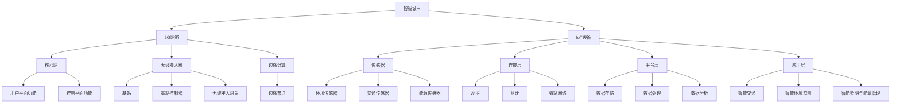

                 

### 引言

智能城市的概念正在逐渐成为现实，而5G（第五代移动通信技术）和IoT（物联网）被认为是实现这一愿景的关键基础设施。本文将深入探讨5G和IoT在智能城市基础设施建设中的重要作用。

5G技术的到来为通信速度和覆盖范围带来了革命性的提升。它不仅提供了高达1Gbps的峰值下载速度，还支持大规模机器类型通信和极其低延迟的通信，这意味着实时数据传输成为可能。IoT则通过连接各种设备和传感器，实现了万物互联，使城市的数据采集和分析更加高效。

智能城市基础设施的需求日益增加，主要体现在以下几个方面：

1. **智能交通管理**：实时交通信息采集、智能信号灯控制、自动驾驶车辆通信等，以提升交通效率和减少拥堵。
2. **城市安全监控**：视频监控、智能报警系统、火灾和烟雾探测等，以保障城市安全。
3. **智能环境监测**：空气质量、水质、噪音等环境参数的实时监测，以保护城市生态环境。
4. **智能照明与能源管理**：智能照明控制、能源消耗监测、可再生能源整合等，以实现节能和可持续发展。

本文将首先介绍5G和IoT的技术基础，然后探讨5G与IoT的结合及其在智能城市中的应用案例，最后分析5G与IoT实现智能城市的挑战与机遇，以及展望未来趋势。希望通过这篇文章，能够帮助读者理解5G和IoT在智能城市中的重要作用，并启发更多创新应用。

### 5G技术基础

5G技术，即第五代移动通信技术，相较于前几代移动通信技术，具有显著的性能提升，为智能城市的建设提供了强有力的支持。以下是5G技术的几个关键特性及其技术架构的详细介绍。

#### 5G的关键特性

1. **通信速率**：5G网络的峰值下载速度可达到1Gbps，上传速度也达到数百Mbps。这一速度大幅提升了数据传输的效率和用户体验。
   
2. **覆盖范围**：5G采用了更高频段的毫米波频段，虽然传输距离较短，但通过小基站（小细胞）的密集部署，可以实现良好的覆盖效果。

3. **低延迟**：5G网络具有低至1毫秒的端到端延迟，这使得实时通信和数据处理成为可能。这对于智能交通管理、远程医疗、工业自动化等应用尤为重要。

4. **高连接密度**：5G能够支持每平方米高达100万个设备的连接，满足大规模物联网设备的同时接入需求。

#### 5G的技术架构

5G的技术架构包括核心网（Core Network）、无线接入网（Access Network）和终端设备（Terminal Equipment）三大部分。

1. **5G核心网**：5G核心网是整个5G网络的“大脑”，负责处理数据传输、连接管理和网络功能虚拟化。核心网采用服务化架构（SA），实现了网络功能的模块化和可扩展性。关键组件包括：
   - **无线接入网管理功能**：负责用户设备的接入管理和无线资源分配。
   - **用户平面功能**：负责用户数据传输的路由和转发。
   - **控制平面功能**：负责网络连接的建立、维护和释放。

2. **5G无线接入网**：无线接入网是5G网络的数据传输通道，负责连接用户设备和核心网。5G无线接入网采用大规模MIMO（多输入多输出）、波束成形和载波聚合等先进技术，提高了频谱效率和通信速率。主要组件包括：
   - **基站**：提供无线信号覆盖和接入服务。
   - **基站控制器**：负责基站间的协调和管理。
   - **无线接入网关**：连接无线接入网和核心网，实现数据传输。

3. **5G终端设备**：终端设备是5G网络的接入点，包括智能手机、平板电脑、物联网设备等。5G终端设备通常具备多模能力，支持2G、3G、4G和5G等多种通信模式。关键特性包括：
   - **高速数据传输**：支持高达1Gbps的下载速度。
   - **低功耗**：通过节能技术延长设备电池寿命。
   - **智能连接管理**：根据网络状况和设备需求智能调整通信参数。

#### 5G在智能城市中的应用

5G技术在智能城市中的应用场景广泛，以下为几个典型的应用实例：

1. **智能交通管理**：5G技术能够实现车辆与基础设施之间的实时通信，优化交通信号控制和车辆调度，减少交通拥堵，提高道路使用效率。

2. **城市安全监控**：5G网络的高带宽和低延迟特性，使得高清视频监控数据能够实时传输和处理，提高城市的安全监控水平。

3. **智能照明与能源管理**：通过5G网络，智能照明系统能够实时采集环境数据，根据光照需求调整灯光亮度，实现节能目标。

4. **远程医疗**：5G网络提供了稳定的低延迟连接，支持远程医疗诊断和手术，提高医疗服务的覆盖和效率。

5. **工业自动化**：5G技术助力工业物联网设备的实时数据采集和监控，提高生产线的自动化程度和效率。

通过上述介绍，可以看出5G技术为智能城市建设提供了坚实的基础设施，未来5G技术将继续在智能城市中发挥重要作用。

### IoT技术基础

物联网（IoT）是指通过互联网将各种物理设备、传感器、软件和网络连接起来，实现智能交互和协同工作的系统。在智能城市基础设施建设中，IoT技术起着关键作用，为城市管理和公共服务提供了更加智能化和高效化的解决方案。以下将介绍IoT的核心概念、技术架构和主要应用场景。

#### IoT的核心概念

1. **物联网的构成**：物联网主要由以下几部分构成：
   - **传感器**：用于感知环境信息，如温度、湿度、光照、运动等。
   - **连接层**：包括无线通信模块和网络连接，如Wi-Fi、蓝牙、蜂窝网络等，用于传输传感器数据。
   - **平台层**：负责数据收集、处理、存储和分析，包括云平台、大数据平台和边缘计算平台。
   - **应用层**：基于平台层提供的数据和应用服务，实现各种智能化应用，如智能家居、智能交通、智能医疗等。

2. **物联网的通信协议**：物联网设备的通信协议决定了数据传输的效率和安全性。常见的通信协议包括：
   - **ZigBee**：低功耗、短距离的无线通信协议，适用于家庭和工业物联网。
   - **Z-Wave**：另一种低功耗无线通信协议，主要用于家庭自动化。
   - **Wi-Fi**：广泛使用的无线通信协议，提供高带宽和较远的传输距离。
   - **蓝牙**：短距离无线通信协议，适用于低功耗设备之间的数据传输。
   - **MQTT**：一种轻量级的消息队列协议，适用于物联网设备之间的消息传递。

3. **物联网的安全挑战**：物联网设备的广泛连接和数据的实时传输带来了巨大的安全挑战，主要包括：
   - **数据隐私**：设备收集和处理的数据可能涉及用户隐私，需要确保数据的安全传输和存储。
   - **设备安全**：物联网设备可能成为黑客攻击的入口，需要采取安全措施保护设备不被入侵。
   - **通信安全**：数据在传输过程中可能被窃取或篡改，需要加密通信协议来保证数据安全。

#### IoT在智能城市中的应用

物联网技术在智能城市中的应用非常广泛，以下是一些典型的应用场景：

1. **智能环境监测**：通过部署各种传感器，实时监测城市的空气质量、水质和噪音水平，为城市环境管理提供数据支持。

2. **智能家居**：物联网技术使得家庭设备和家电可以互联互通，实现远程控制、自动化管理和能源节约。

3. **智能农业**：利用传感器和物联网技术，实时监测土壤湿度、气象条件等信息，实现精准农业管理和生产。

4. **智能交通**：通过车辆和交通设施的物联网连接，实现交通流量监控、道路状况分析和智能信号控制。

5. **智能公共安全**：利用物联网技术，构建城市视频监控系统、智能报警系统和应急指挥系统，提高城市的安全防范能力。

6. **智能能源管理**：通过物联网技术，实现智能电网的建设和管理，优化能源分配和使用，实现节能降耗。

通过以上介绍，可以看出物联网技术在智能城市中具有广泛的应用前景和重要的战略意义。随着技术的不断进步和应用的深入，物联网将为智能城市建设带来更多的创新和机遇。

### 5G与IoT的结合

5G和IoT的结合为智能城市基础设施带来了前所未有的发展机遇。5G的高速率、低延迟和大连接密度特性，与IoT设备的智能化和互联互通需求完美契合，两者的融合不仅提升了物联网设备的数据传输效率和可靠性，还大幅扩展了智能城市应用的广度和深度。以下是5G与IoT结合的架构、实际应用和协同工作模式的详细分析。

#### 5G与IoT的融合架构

5G与IoT的融合架构可以概括为以下几个层次：

1. **设备层**：在这一层，各种物联网设备通过5G网络进行连接，这些设备可以是传感器、摄像头、智能表计、车辆等。5G网络提供了高速、低延迟的连接，使得设备能够实时传输大量数据。

2. **网络层**：5G网络为物联网设备提供了可靠的传输通道。5G网络通过小基站（Small Cell）和大规模MIMO（Massive MIMO）技术，实现了更高的网络容量和更广的覆盖范围。此外，5G网络的边缘计算能力，使得部分数据处理可以在靠近数据源的边缘节点完成，降低了网络延迟。

3. **平台层**：在平台层，5G网络与IoT平台进行深度融合。IoT平台负责数据收集、存储、处理和分析，5G网络则提供了数据传输的稳定性和高效性。通过这一层，可以构建一个统一的智能城市数据平台，实现不同设备和系统之间的数据共享和协同工作。

4. **应用层**：应用层是整个架构的最高层次，涵盖了各种智能城市应用，如智能交通、智能安防、智能照明等。5G与IoT的结合，使得这些应用能够实现实时数据采集和处理，提高了系统的反应速度和决策准确性。

#### 5G网络中的IoT节点

在5G网络中，IoT节点是指那些通过5G网络进行通信的物联网设备。这些节点可以是简单的传感器，也可以是复杂的智能终端。5G网络为这些节点提供了以下几个关键支持：

1. **低延迟**：5G网络的低延迟特性，使得IoT节点能够实时响应，这在智能交通管理、智能医疗等场景中尤为重要。

2. **高带宽**：5G网络的高带宽支持，使得IoT节点能够传输大量数据，这在视频监控、工业物联网等应用中非常有用。

3. **大规模连接**：5G网络支持大规模设备连接，这意味着城市中的各种设备可以同时通过5G网络进行通信，不会因为连接数过多而出现网络拥堵。

4. **边缘计算**：5G网络具备边缘计算能力，可以在靠近数据源的边缘节点进行数据处理，减少了数据传输的延迟和网络负担。

#### IoT设备与5G网络的连接

IoT设备与5G网络的连接方式多种多样，以下是几种常见的连接方式：

1. **蜂窝网络连接**：通过5G蜂窝网络直接连接到互联网，适用于需要广域覆盖和高速数据的IoT应用。

2. **Wi-Fi连接**：利用现有的Wi-Fi网络进行连接，适用于室内或覆盖范围较小的应用场景。

3. **蓝牙和ZigBee连接**：通过短距离无线通信协议连接，适用于设备之间需要频繁通信的场景。

4. **LPWAN连接**：如LoRa和NB-IoT，这些协议提供了低功耗、长距离的通信能力，适用于需要长时间运行和远程监测的IoT应用。

#### 5G网络对IoT设备的支持

5G网络为IoT设备提供了多方面的支持，以下是一些具体的技术和功能：

1. **网络切片**：5G网络支持网络切片技术，可以根据IoT设备的需求，为不同设备分配特定的网络资源，确保每个设备都能获得最优的网络性能。

2. **边缘计算**：5G网络具备强大的边缘计算能力，可以在靠近数据源的边缘节点进行数据处理，减少数据传输的延迟，提高系统的响应速度。

3. **雾计算**：雾计算是一种将计算和存储能力分布到网络边缘的技术，可以与5G网络相结合，实现更加灵活和高效的数据处理。

4. **高可靠低延迟通信**：5G网络支持高可靠低延迟通信（URLLC），确保关键应用如自动驾驶、远程手术等能够实现实时通信。

#### 5G与IoT协同工作

5G与IoT的协同工作体现在多个方面，以下是一些关键协同工作模式：

1. **实时数据处理**：5G网络的高带宽和低延迟特性，使得IoT设备能够实时传输和处理大量数据，实现快速响应和精准控制。

2. **大数据分析**：5G网络支持海量物联网数据的高效传输，可以与大数据分析技术相结合，实现对数据的高效分析和智能决策。

3. **人工智能应用**：5G与IoT的结合，为人工智能技术提供了丰富的应用场景，如智能交通管理、智能安防、智能医疗等。

4. **自动化与优化**：5G与IoT的协同工作，可以实现自动化控制和优化管理，提高系统的效率和可靠性。

通过以上分析，可以看出5G与IoT的结合不仅为智能城市基础设施的建设提供了关键技术支持，还推动了智能城市应用的快速发展。随着技术的不断进步，5G与IoT的融合将为智能城市带来更多的创新和变革。

### 智能城市基础设施的应用案例

智能城市基础设施的应用已经深入到城市管理的方方面面，通过5G和IoT技术的结合，实现了交通管理、环境监测、照明与能源管理等方面的智能化。以下是几个典型的应用案例，展示5G和IoT如何赋能智能城市。

#### 4.1 智能交通系统

智能交通系统利用5G和IoT技术，通过实时数据采集和分析，实现交通流量的优化和管理，从而减少拥堵，提高道路通行效率。

1. **实时交通信息采集与分析**：
   - **部署传感器**：在主要道路和交通节点部署传感器，实时监测车辆流量、速度和方向。
   - **数据传输**：通过5G网络，将传感器数据快速传输到交通管理平台。
   - **数据处理**：交通管理平台对数据进行分析，生成交通流量图和预测模型。

2. **自动驾驶车辆通信**：
   - **V2X通信**：车辆之间通过5G网络进行通信，共享交通信息，实现协同驾驶。
   - **车路协同**：车辆与道路基础设施之间通过5G网络进行通信，实现车辆与道路的智能互动。

3. **城市交通流量优化**：
   - **动态信号控制**：根据实时交通流量数据，动态调整交通信号灯的时长和顺序。
   - **智能调度**：根据交通预测模型，优化公共交通路线和时间表。

#### 4.2 智能环境监测

智能环境监测系统利用物联网传感器和5G网络，实时监测城市的空气、水和噪音等环境参数，为环境保护和管理提供数据支持。

1. **空气质量监测**：
   - **传感器部署**：在城市各个区域部署空气质量传感器，监测PM2.5、PM10、二氧化碳等指标。
   - **数据传输**：传感器通过5G网络将空气质量数据实时传输到环境监测平台。
   - **数据分析**：环境监测平台对空气质量数据进行分析，生成污染源地图和预警系统。

2. **水质监测**：
   - **传感器部署**：在河流、湖泊和水源地部署水质传感器，监测水质指标。
   - **数据传输**：水质传感器通过5G网络将数据传输到水环境监测平台。
   - **数据分析**：水环境监测平台对水质数据进行分析，实现水源保护和预警。

3. **噪音监测**：
   - **传感器部署**：在噪音源附近和居民区部署噪音传感器，监测噪音水平。
   - **数据传输**：噪音传感器通过5G网络将数据传输到噪音监测平台。
   - **数据分析**：噪音监测平台对噪音数据进行分析，生成噪音污染地图和预警系统。

#### 4.3 智能照明与能源管理

智能照明与能源管理系统通过5G和IoT技术，实现城市照明系统的自动化控制和管理，提高能源利用效率。

1. **智能照明控制**：
   - **传感器部署**：在主要道路和公共区域部署光照传感器，监测环境光照强度。
   - **数据传输**：光照传感器通过5G网络将数据传输到照明控制系统。
   - **智能调节**：照明控制系统根据环境光照强度自动调节灯光亮度，实现节能目标。

2. **能源消耗监测**：
   - **传感器部署**：在能源消耗设备上部署传感器，监测能源消耗情况。
   - **数据传输**：能源消耗传感器通过5G网络将数据传输到能源管理系统。
   - **数据分析**：能源管理系统对能源消耗数据进行分析，识别能源浪费点，提出节能措施。

3. **可再生能源整合**：
   - **太阳能和风能**：利用太阳能电池板和风力涡轮机等可再生能源设备，为城市供电。
   - **智能调度**：能源管理系统根据实时能源消耗和可再生能源发电情况，智能调度能源分配，实现绿色能源最大化利用。

通过以上应用案例可以看出，5G和IoT技术为智能城市基础设施建设提供了强大的支持，使得城市在交通管理、环境监测和能源管理等方面更加高效和智能。随着技术的不断发展和应用的深入，智能城市将迎来更多的创新和变革。

### 5G与IoT实现智能城市的挑战与机遇

#### 5G与IoT技术发展面临的挑战

尽管5G和IoT技术在智能城市建设中展现了巨大的潜力，但实现这一目标仍面临诸多挑战。以下是一些关键挑战及其解决方案：

1. **网络容量与覆盖**：
   - **挑战**：随着物联网设备的激增，网络容量和覆盖范围成为一大难题。5G网络虽然支持大规模设备连接，但高频段的信号覆盖范围有限。
   - **解决方案**：通过部署更多的5G基站和利用边缘计算技术，提高网络容量和覆盖范围。此外，可以考虑采用低频段5G频谱，以扩展覆盖范围。

2. **安全性问题**：
   - **挑战**：物联网设备连接广泛，数据传输和存储的安全性面临威胁，包括设备被攻击、数据泄露等。
   - **解决方案**：加强网络安全防护措施，如采用加密技术、身份验证和访问控制，确保数据传输和存储的安全性。此外，建立统一的安全标准和法规，加强行业监管。

3. **数据隐私保护**：
   - **挑战**：物联网设备收集的数据可能涉及个人隐私，如何保护这些数据不被滥用是一个重要问题。
   - **解决方案**：制定数据隐私保护政策，明确数据收集、存储和使用的规范。采用去标识化技术，减少数据泄露的风险。此外，通过用户知情同意和数据最小化原则，确保用户隐私权。

#### 5G与IoT为智能城市带来的机遇

尽管面临挑战，5G和IoT技术为智能城市带来了诸多机遇：

1. **城市管理的智能化**：
   - **机遇**：通过5G和IoT技术，可以实现城市管理的智能化，提高城市运行效率和服务质量。
   - **解决方案**：利用实时数据分析和预测模型，实现智能交通管理、智能能源管理和智能环境监测，提高城市管理的精确性和灵活性。

2. **效率的提升**：
   - **机遇**：5G和IoT技术可以优化城市资源分配，提高效率，降低成本。
   - **解决方案**：通过实时数据分析和智能调度，优化交通流量、能源消耗和公共资源配置，提高城市运行效率。

3. **成本的控制**：
   - **机遇**：5G和IoT技术可以降低城市建设和运营成本，实现可持续发展。
   - **解决方案**：通过智能照明和智能能源管理系统，降低能源消耗和维护成本。此外，通过大数据分析和优化，降低城市基础设施的运营成本。

通过应对挑战和抓住机遇，5G和IoT技术将在智能城市建设中发挥重要作用，推动城市向着更高效、更智能、更可持续的方向发展。

### 未来趋势与展望

随着5G和IoT技术的不断进步，智能城市的发展趋势日益明显，未来将在多个方面实现突破。以下是未来智能城市发展的几个关键趋势：

#### 6G的展望

尽管5G技术已经带来了显著的变革，但6G（第六代移动通信技术）的研发正在如火如荼地进行。预计6G将在以下几个方面实现重大突破：

1. **更高的通信速率**：6G预计将达到数Tbps的通信速率，远超5G。这将极大地提升数据传输效率，支持更复杂的应用场景。

2. **更低的延迟**：6G的目标是将延迟降低至亚毫秒级，实现真正的实时通信。这将使得自动驾驶、远程医疗等应用更加安全和高效。

3. **更广的覆盖范围**：通过使用新的频段和传播技术，6G将实现更广泛的覆盖范围，包括地下、水下等难以覆盖的区域。

4. **更智能的网联**：6G将引入更加智能的网联技术，包括更高密度的网络节点、智能网络管理和自优化功能，提高网络的整体性能和可靠性。

#### 物联网设备的普及

物联网设备将在未来智能城市中发挥更加关键的作用，其普及程度将继续扩大：

1. **智能设备的多样化**：随着传感器技术和通信技术的进步，物联网设备将更加多样化，涵盖家居、交通、能源、环境等各个领域。

2. **物联网设备的智能化**：物联网设备将具备更加先进的处理能力和自主学习能力，通过人工智能技术实现自主决策和优化。

3. **物联网设备的标准化**：未来，物联网设备将遵循更加统一的通信协议和标准，实现跨平台、跨厂商的互操作性，推动物联网生态系统的健康发展。

#### 智慧城市生态系统的构建

智慧城市生态系统的构建是未来智能城市发展的重要方向，将实现多个系统和领域的协同运作：

1. **数据共享与融合**：通过建立统一的数据平台，实现城市各类数据的共享和融合，为智能决策提供支持。

2. **跨部门协同**：智慧城市生态系统将促进城市不同部门之间的信息共享和协同工作，提高城市治理效率和公共服务质量。

3. **智能治理与监管**：利用大数据、人工智能等技术，实现智能治理和监管，提高城市安全水平和管理效率。

#### 5G与IoT在智能城市中的应用展望

5G和IoT技术将在未来智能城市中发挥更加重要的作用，推动城市在多个方面实现智能化：

1. **智能交通**：通过5G和IoT技术，实现自动驾驶、车联网和智能交通管理，提升交通效率和安全性。

2. **智能环境监测**：利用物联网传感器和5G网络，实现空气、水质、噪音等环境参数的实时监测，提高城市生态环境质量。

3. **智能能源管理**：通过5G和IoT技术，实现智能电网、智能照明和智能能源调度，提高能源利用效率，实现可持续发展。

4. **智能公共安全**：利用5G和IoT技术，建立智能安防系统，提升城市公共安全水平。

5. **智能医疗**：通过5G和IoT技术，实现远程医疗、智能医疗设备和健康管理系统，提高医疗服务质量和覆盖范围。

未来，5G和IoT技术将继续在智能城市中发挥重要作用，推动城市向更加智能、高效、可持续的方向发展。

### 附录

#### 5G与IoT标准与规范

要深入了解5G和IoT技术，以下是一些重要的标准与规范：

1. **5G标准**：
   - **3GPP**：第三代合作伙伴计划（3rd Generation Partnership Project）负责制定5G标准。
   - **ITU-R**：国际电信联盟无线电通信部门（ITU-R）发布了5G频率分配和性能要求。

2. **IoT标准**：
   - **IEEE 802.15.4**：定义了低功耗无线个人区域网络（WPAN）的标准。
   - **IEEE 802.11**：定义了Wi-Fi通信的标准。
   - **ISO/IEC 27001**：信息安全管理标准，用于保护物联网设备的数据安全。

#### 5G与IoT技术相关书籍与资源推荐

为了深入了解5G和IoT技术，以下是一些推荐的书籍和在线资源：

1. **书籍推荐**：
   - 《5G无线网络：下一代移动通信技术》
   - 《物联网：概念、架构与实现》
   - 《人工智能与物联网：创新与未来》

2. **在线资源**：
   - **3GPP官方网站**：提供最新的5G标准和技术文档。
   - **IEEE官方网站**：提供各种IoT相关的标准和技术文档。
   - **开放网络基金会**：提供关于边缘计算和IoT的开源项目和资源。

### 撰写Mermaid流程图

以下是5G与IoT在智能城市基础设施中的架构关系的Mermaid流程图：

### 总结

本文详细探讨了5G和IoT在智能城市基础设施中的关键作用，从技术基础到应用案例，再到未来展望，全面阐述了这两项技术如何共同推动智能城市的建设。5G的高速率、低延迟和大连接密度特性，与IoT的互联互通和智能化需求相辅相成，为智能城市的各个方面提供了强有力的支持。虽然面临网络容量、安全性和数据隐私等挑战，但通过技术创新和标准化，这些挑战有望得到有效解决。未来，随着6G和更先进物联网设备的出现，智能城市将迎来更多创新和变革，为人们带来更加智能、高效、可持续的生活环境。

### 作者信息

作者：AI天才研究院/AI Genius Institute & 禅与计算机程序设计艺术 /Zen And The Art of Computer Programming

本文由AI天才研究院/AI Genius Institute与《禅与计算机程序设计艺术》作者联合撰写，旨在通过深入的技术分析，探讨5G和IoT在智能城市中的应用与未来趋势。希望本文能为您在智能城市领域的探索提供有价值的参考。

