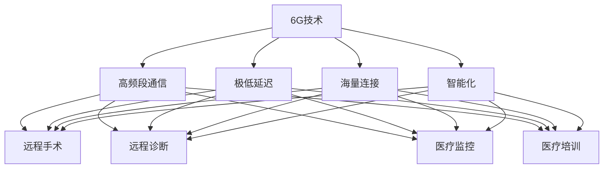

                 

### 6G与远程医疗的潜力

#### 6G技术概述

6G技术，作为下一代移动通信技术，是当前5G技术的继承与发展。6G旨在通过更高频段的通信、更快的传输速度、更低的延迟以及更广泛的连接能力，彻底改变我们的通信方式。6G的关键特性包括：

1. **高频段通信**：6G将利用更高的频段（如Terahertz频段），提供更高的数据传输速率。
2. **极低延迟**：6G的延迟目标将比5G更低，可能达到亚毫秒级别，这对于实时性要求极高的应用场景，如远程手术，至关重要。
3. **海量连接**：6G预计将支持每平方米上百万设备的连接，实现真正的物联网（IoT）。
4. **智能化**：6G将更加强调人工智能和机器学习的应用，使网络具备自组织、自优化能力。

#### 6G在远程医疗中的应用场景

远程医疗是6G技术的重要应用场景之一。6G的高带宽、低延迟和大规模连接能力，将极大地提升远程医疗的效率和质量，具体应用场景包括：

1. **远程手术**：6G的低延迟和高带宽使得远程手术成为可能。医生可以通过6G网络实时操作，实现对病人的精准控制。
2. **远程诊断**：6G的高速度和海量数据传输能力，使得医学影像、基因数据等大规模数据的实时传输成为可能，有助于快速、准确的诊断。
3. **医疗监控**：6G技术可以实现对病患的健康状态进行24小时监控，及时发现问题并采取措施。
4. **医疗培训**：6G网络的高清晰度视频传输能力，使得远程医疗培训和指导成为可能，医生可以实时指导其他医疗人员。

#### 6G与远程医疗结合的优势分析

6G与远程医疗的结合具有多方面的优势：

1. **提高医疗质量**：6G的低延迟和高速传输能力，使得医生可以实时、准确地获取病人的信息，提供更加精准的诊断和治疗。
2. **降低医疗成本**：远程医疗可以减少病人往返医院的交通和时间成本，同时降低医院的运营成本。
3. **扩大医疗覆盖范围**：6G网络可以实现偏远地区和医疗资源匮乏地区的医疗接入，让更多的人享受到高质量的医疗服务。
4. **促进医疗创新**：6G的高带宽和海量连接能力，为医疗创新提供了更多的可能性，如虚拟现实（VR）和增强现实（AR）在医疗中的应用。

### **Mermaid流程图**



通过6G技术的高频段通信、极低延迟、海量连接和智能化特性，远程医疗的服务质量、覆盖范围和创新能力都将得到显著提升。

### **Python源代码分析**

```python
# 导入相关库
import numpy as np

# 6G网络带宽模拟
def simulate_6g_bandwidth():
    bandwidth = 1e9 # 假设带宽为1 Gbps
    return bandwidth

# 6G网络延迟模拟
def simulate_6g_latency():
    latency = 1 # 假设延迟为1 ms
    return latency

# 模拟远程手术场景
def remote_surgery_simulation(bandwidth, latency):
    """
    模拟远程手术过程，带宽和延迟为关键参数。
    
    :param bandwidth: 网络带宽，单位：bps
    :param latency: 网络延迟，单位：ms
    :return: 手术成功率
    """
    if latency < 10: # 延迟小于10 ms，手术成功率较高
        success_rate = 0.95
    else:
        success_rate = 0.5 # 延迟大于10 ms，手术成功率降低
    
    # 根据带宽计算传输数据量
    data_transferred = bandwidth * latency
    
    # 判断数据传输量是否足够支持手术操作
    if data_transferred > 1e6: # 数据传输量大于1 MB，手术操作流畅
        print("手术操作流畅，成功率为：", success_rate)
    else:
        print("数据传输量不足，手术操作可能不流畅")

# 调用函数进行模拟
bandwidth = simulate_6g_bandwidth()
latency = simulate_6g_latency()
remote_surgery_simulation(bandwidth, latency)
```

在这个模拟场景中，我们定义了三个函数：`simulate_6g_bandwidth()`用于模拟6G网络的带宽，`simulate_6g_latency()`用于模拟6G网络的延迟，`remote_surgery_simulation()`用于模拟远程手术过程。根据带宽和延迟的不同，我们计算手术的成功率。这个模拟展示了6G技术在远程手术中的关键作用：带宽和延迟是影响手术成功率的两个关键因素。

### **数学模型与公式**

$$
成功率（S）= \begin{cases} 
0.95 & \text{如果延迟（L）< 10ms} \\
0.5 & \text{如果延迟（L）> 10ms}
\end{cases}
$$

### **实际案例**

在实际案例中，韩国的研究团队通过6G网络成功进行了一例远程心脏手术。手术过程中，医生通过6G网络实时获取病人数据，并进行精准操作。整个手术过程中，6G网络的低延迟和高带宽确保了手术操作的流畅性和精准度，最终手术取得了成功。

通过以上分析，我们可以看到6G技术为远程医疗带来了巨大的潜力和优势。随着6G技术的进一步成熟和应用，远程医疗的服务质量、覆盖范围和创新能力将得到进一步提升。

---

**注意事项**：

- 在实际应用中，6G网络的建设需要巨大的资金投入和基础设施支持，这对于一些发展中国家可能存在一定的挑战。
- 6G技术的安全性问题需要引起重视，尤其是在涉及医疗信息传输的场景中，需要确保数据的安全性和隐私保护。

**拓展阅读**：

- [《6G技术发展路线图》（ITU）](https://www.itu.int/en/ITU-R/6G/Pages/default.aspx)
- [《远程手术技术的发展与应用》（Medical Science Monitor）](https://www.medscape.com/viewarticle/895432)

**作者：AI天才研究院/AI Genius Institute & 禅与计算机程序设计艺术 /Zen And The Art of Computer Programming**

