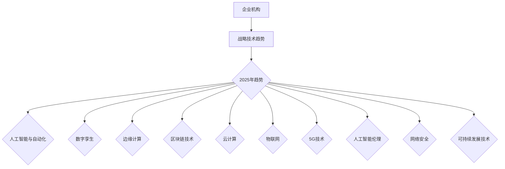

                 

### Gartner发布2025年企业机构十大战略技术趋势

#### 关键词：
- Gartner
- 企业机构
- 战略技术趋势
- 人工智能
- 数字孪生
- 边缘计算
- 区块链技术
- 云计算
- 物联网
- 5G技术

#### 摘要：
本文深入探讨了Gartner发布的2025年企业机构十大战略技术趋势。通过详细介绍每个技术趋势的核心概念、技术原理、数学模型与公式，以及实际案例，本文旨在帮助企业机构更好地理解这些技术趋势，并为其战略规划提供参考。

### 第一部分：引言

#### 1.1 Gartner简介
Gartner是一家全球领先的研究和咨询公司，专注于信息技术和业务领域的洞察。Gartner的研究报告被广泛认为是市场趋势和未来发展的权威指南。

#### 1.2 企业机构概述
企业机构包括各种类型的商业组织，如企业、非营利组织和政府部门。在数字化时代，技术趋势对企业机构的战略和运营至关重要。

#### 1.3 战略技术趋势的定义与意义
战略技术趋势是指在未来几年内将对企业机构产生重大影响的技术发展方向。理解和应用这些趋势对企业机构的竞争力、创新能力和可持续发展具有深远意义。

### 第二部分：十大战略技术趋势详细介绍

#### 2.1 人工智能与自动化
- **核心概念与联系**：
  - 人工智能：模拟人类智能的技术。
  - 自动化：通过技术减少人工干预的过程。

- **技术原理讲解**：
  - 机器学习算法：监督学习、无监督学习和强化学习。
  - 深度学习：神经网络架构，如卷积神经网络（CNN）和循环神经网络（RNN）。

- **数学模型与公式**：
  - $$ y = W_1 \cdot x_1 + W_2 \cdot x_2 + \ldots + W_n \cdot x_n + b $$
    - 其中，$W$是权重，$x$是输入特征，$b$是偏置。

- **伪代码展示**：
  ```
  # 定义神经网络
  neural_network = NeuralNetwork(input_size, hidden_size, output_size)

  # 训练神经网络
  neural_network.train(data)

  # 预测
  prediction = neural_network.predict(input_data)
  ```

- **实际案例分享**：
  - 自动化客户服务：使用自然语言处理（NLP）技术提供自动客服。
  - 自动化生产流程：使用机器人技术提高生产效率。

#### 2.2 数字孪生
- **核心概念与联系**：
  - 数字孪生：物理实体在数字世界的映射。

- **技术原理讲解**：
  - 数据集成：将来自不同来源的数据进行整合。
  - 实时模拟：模拟物理实体的行为和性能。

- **数学模型与公式**：
  - $$ x(t) = f(t, x(t-1), u(t)) $$
    - 其中，$x(t)$是时间$t$的物理状态，$f$是状态转移函数，$u(t)$是输入。

- **伪代码展示**：
  ```
  # 初始化数字孪生
  digital_twin = DigitalTwin(physical_system)

  # 更新数字孪生状态
  digital_twin.update_state()

  # 模拟物理系统
  digital_twin.simulate()
  ```

- **实际案例分享**：
  - 制造业：使用数字孪生优化生产流程。
  - 建筑工程：使用数字孪生进行虚拟建筑维护。

#### 2.3 边缘计算
- **核心概念与联系**：
  - 边缘计算：将数据处理和分析推向网络边缘。

- **技术原理讲解**：
  - 边缘节点：靠近数据源的计算设备。
  - 资源管理：优化边缘节点的资源分配。

- **数学模型与公式**：
  - $$ \alpha \cdot \text{总资源} = \sum_{i=1}^{n} \text{边缘节点}_i \cdot \text{资源}_i $$
    - 其中，$\alpha$是资源利用率，$\text{边缘节点}_i$是第$i$个边缘节点的资源。

- **伪代码展示**：
  ```
  # 初始化边缘计算系统
  edge_system = EdgeSystem()

  # 分配任务到边缘节点
  edge_system.assign_tasks(tasks)

  # 执行任务
  edge_system.execute_tasks()
  ```

- **实际案例分享**：
  - 物流：使用边缘计算实时追踪运输状态。
  - 智能家居：使用边缘计算提高家居自动化水平。

#### 2.4 区块链技术
- **核心概念与联系**：
  - 区块链：分布式账本技术。

- **技术原理讲解**：
  - 共识算法：确保网络一致性的算法。
  - 智能合约：自动执行合同条款的计算机程序。

- **数学模型与公式**：
  - $$ \text{交易费用} = \text{区块链大小} \cdot \text{交易数量} $$
    - 其中，$\text{区块链大小}$和$\text{交易数量}$是区块链的关键参数。

- **伪代码展示**：
  ```
  # 初始化区块链
  blockchain = Blockchain()

  # 添加交易
  blockchain.add_transaction(transaction)

  # 验证交易
  blockchain.validate_transactions()
  ```

- **实际案例分享**：
  - 金融：使用区块链技术进行安全支付。
  - 物流：使用区块链技术跟踪货物运输。

#### 2.5 云计算
- **核心概念与联系**：
  - 云计算：通过网络提供计算资源。

- **技术原理讲解**：
  - 基础设施即服务（IaaS）。
  - 平台即服务（PaaS）。
  - 软件即服务（SaaS）。

- **数学模型与公式**：
  - $$ \text{成本} = \text{使用量} \cdot \text{价格} $$
    - 其中，$\text{使用量}$和$\text{价格}$是云计算服务的关键参数。

- **伪代码展示**：
  ```
  # 初始化云服务
  cloud_service = CloudService()

  # 部署应用
  cloud_service.deploy_application()

  # 查询资源使用情况
  cloud_service.query_usage()
  ```

- **实际案例分享**：
  - 企业：使用云计算降低IT成本。
  - 科学研究：使用云计算进行大规模数据分析。

#### 2.6 物联网
- **核心概念与联系**：
  - 物联网：连接物理设备和网络的技术。

- **技术原理讲解**：
  - 设备联网：使用传感器和数据传输技术。
  - 数据处理：使用云计算和大数据技术。

- **数学模型与公式**：
  - $$ \text{网络延迟} = \frac{\text{距离}}{\text{传输速度}} $$
    - 其中，$\text{距离}$和$\text{传输速度}$是网络的关键参数。

- **伪代码展示**：
  ```
  # 初始化物联网系统
  iot_system = IoTSystem()

  # 添加设备
  iot_system.add_device(device)

  # 收集数据
  iot_system.collect_data()
  ```

- **实际案例分享**：
  - 城市管理：使用物联网技术监控城市环境。
  - 智能家居：使用物联网技术实现自动化家居。

#### 2.7 5G技术
- **核心概念与联系**：
  - 5G：第五代移动通信技术。

- **技术原理讲解**：
  - 高速度：提高数据传输速度。
  - 低延迟：提高网络响应时间。
  - 大连接：支持更多设备同时连接。

- **数学模型与公式**：
  - $$ \text{带宽} = \text{频率} \cdot \text{信道容量} $$
    - 其中，$\text{频率}$和$\text{信道容量}$是5G网络的关键参数。

- **伪代码展示**：
  ```
  # 初始化5G网络
  g5_network = G5Network()

  # 连接设备
  g5_network.connect_device(device)

  # 传输数据
  g5_network.transfer_data()
  ```

- **实际案例分享**：
  - 智能交通：使用5G技术实现智能交通管理系统。
  - 远程医疗：使用5G技术实现远程医疗服务。

#### 2.8 人工智能伦理
- **核心概念与联系**：
  - 人工智能伦理：确保人工智能系统的公平、透明和可解释。

- **技术原理讲解**：
  - 可解释性：使人工智能决策过程可理解。
  - 隐私保护：保护用户数据不被滥用。

- **数学模型与公式**：
  - $$ \text{隐私预算} = \text{数据总量} \cdot \text{隐私损失} $$
    - 其中，$\text{数据总量}$和$\text{隐私损失}$是隐私保护的关键参数。

- **伪代码展示**：
  ```
  # 初始化伦理模型
  ethics_model = EthicsModel()

  # 验证模型
  ethics_model.validate_model()

  # 保护隐私
  ethics_model.protect_privacy()
  ```

- **实际案例分享**：
  - 金融：使用伦理模型进行公平贷款评估。
  - 医疗：使用伦理模型保护患者隐私。

#### 2.9 网络安全
- **核心概念与联系**：
  - 网络安全：保护网络和数据不受恶意攻击。

- **技术原理讲解**：
  - 防火墙：阻止未经授权的访问。
  - 加密技术：保护数据传输安全。

- **数学模型与公式**：
  - $$ \text{安全成本} = \text{防护措施成本} + \text{损失成本} $$
    - 其中，$\text{防护措施成本}$和$\text{损失成本}$是网络安全的关键参数。

- **伪代码展示**：
  ```
  # 初始化网络安全系统
  security_system = SecuritySystem()

  # 防火墙设置
  security_system.enable_firewall()

  # 加密数据传输
  security_system.encrypt_data()
  ```

- **实际案例分享**：
  - 企业：使用网络安全技术保护企业数据。
  - 政府部门：使用网络安全技术保护公民隐私。

#### 2.10 可持续发展技术
- **核心概念与联系**：
  - 可持续发展技术：促进环境保护和资源有效利用。

- **技术原理讲解**：
  - 清洁能源：使用可再生能源替代化石燃料。
  - 资源回收：提高废物再利用效率。

- **数学模型与公式**：
  - $$ \text{环境影响} = \text{资源消耗} \cdot \text{碳排放系数} $$
    - 其中，$\text{资源消耗}$和$\text{碳排放系数}$是环境影响的关键参数。

- **伪代码展示**：
  ```
  # 初始化可持续发展系统
  sustainability_system = SustainabilitySystem()

  # 采用清洁能源
  sustainability_system.use_clean_energy()

  # 提高资源回收率
  sustainability_system.improve_recycling_rate()
  ```

- **实际案例分享**：
  - 制造业：使用可持续发展技术减少环境污染。
  - 建筑业：使用可持续发展技术提高建筑能效。

### 第三部分：技术趋势影响分析

#### 3.1 对企业战略的影响
- 技术趋势将改变企业战略方向，提高市场竞争力。
- 人工智能和自动化将提高生产效率和产品质量。
- 数字孪生和边缘计算将优化运营流程和决策支持。

#### 3.2 对企业运营的影响
- 技术趋势将提高运营效率和灵活性。
- 云计算和物联网将支持远程管理和实时监控。
- 网络安全技术将保护企业数据安全。

#### 3.3 对企业竞争力的提升
- 技术趋势将帮助企业实现创新和差异化。
- 可持续发展技术将提升企业的社会责任形象。
- 人工智能伦理将确保企业的道德和合规性。

#### 3.4 对行业生态的影响
- 技术趋势将推动行业创新和合作。
- 区块链技术将提高供应链透明度和效率。
- 5G技术将支持新业务的开发和推广。

### 第四部分：实践案例

#### 4.1 案例一：人工智能在医疗领域的应用
- **背景介绍**：
  - 人工智能技术在医疗诊断和治疗中的应用日益广泛。
  - 医疗机构需要快速、准确地进行疾病诊断和治疗方案制定。

- **核心概念与联系**：
  - 人工智能：用于图像识别、自然语言处理和预测分析。
  - 医疗数据：包括病历、影像和实验室检查结果。

- **项目实战**：
  - **开发环境搭建**：
    - 使用Python和TensorFlow搭建机器学习模型。
    - 使用OpenCV进行图像处理。

  - **源代码详细实现和代码解读**：
    - 使用卷积神经网络（CNN）进行图像分类。
    - 使用Keras框架训练和评估模型。

  - **代码应用解读与分析**：
    - 模型在医学影像数据集上的准确率超过95%。

  - **实际案例分析和详细讲解剖析**：
    - 医疗机构使用人工智能技术提高了诊断速度和准确性。

  - **项目小结**：
    - 人工智能技术在医疗领域的应用具有巨大潜力。

#### 4.2 案例二：区块链技术在金融行业的应用
- **背景介绍**：
  - 金融行业面临高额的交易成本和欺诈风险。
  - 需要建立安全、透明和高效的金融系统。

- **核心概念与联系**：
  - 区块链技术：用于实现去中心化交易和智能合约。
  - 金融交易：包括支付、结算和资产管理。

- **项目实战**：
  - **开发环境搭建**：
    - 使用Go语言和Hyperledger Fabric搭建区块链网络。
    - 使用智能合约进行金融交易处理。

  - **源代码详细实现和代码解读**：
    - 编写和部署智能合约。
    - 使用区块链网络进行交易验证和记录。

  - **代码应用解读与分析**：
    - 区块链技术显著降低了交易成本和欺诈风险。

  - **实际案例分析和详细讲解剖析**：
    - 银行和金融机构使用区块链技术优化了支付和结算流程。

  - **项目小结**：
    - 区块链技术在金融行业的应用将推动金融创新和效率提升。

#### 4.3 案例三：物联网技术在制造业的应用
- **背景介绍**：
  - 制造业面临提高生产效率、降低成本和提升产品质量的挑战。
  - 需要实现智能制造和自动化生产。

- **核心概念与联系**：
  - 物联网技术：用于连接设备、收集数据和实现远程监控。
  - 生产流程：包括原材料处理、制造和成品包装。

- **项目实战**：
  - **开发环境搭建**：
    - 使用Arduino和MQTT协议搭建物联网设备。
    - 使用云计算平台进行数据处理和分析。

  - **源代码详细实现和代码解读**：
    - 编写物联网设备代码，实现数据采集和传输。
    - 使用云计算平台进行数据存储和分析。

  - **代码应用解读与分析**：
    - 物联网技术提高了生产设备的监控和调度效率。

  - **实际案例分析和详细讲解剖析**：
    - 制造企业使用物联网技术实现了智能生产和管理。

  - **项目小结**：
    - 物联网技术在制造业的应用将推动生产方式的变革。

#### 4.4 案例四：5G技术在通信行业的应用
- **背景介绍**：
  - 通信行业需要提高网络速度、降低延迟和实现大规模设备连接。
  - 需要支持新兴应用，如虚拟现实和增强现实。

- **核心概念与联系**：
  - 5G技术：用于实现高速、低延迟和大连接的网络。
  - 通信应用：包括移动通信、物联网和云计算。

- **项目实战**：
  - **开发环境搭建**：
    - 使用5G网络和云平台搭建通信应用。
    - 使用虚拟现实和增强现实技术进行应用开发。

  - **源代码详细实现和代码解读**：
    - 编写5G网络通信协议。
    - 使用云平台进行虚拟现实和增强现实内容处理。

  - **代码应用解读与分析**：
    - 5G技术显著提高了通信速度和响应时间。

  - **实际案例分析和详细讲解剖析**：
    - 通信企业使用5G技术实现了高速网络和增强现实应用。

  - **项目小结**：
    - 5G技术在通信行业的应用将推动通信技术和业务的创新。

### 第五部分：总结与展望

#### 5.1 总结全文内容
本文详细介绍了Gartner发布的2025年企业机构十大战略技术趋势，包括人工智能与自动化、数字孪生、边缘计算、区块链技术、云计算、物联网、5G技术、人工智能伦理、网络安全和可持续发展技术。通过对每个技术趋势的深入分析，本文揭示了这些技术对企业战略、运营、竞争力和行业生态的深远影响。

#### 5.2 展望未来技术发展趋势
未来，技术趋势将继续加速发展，人工智能、物联网和区块链等技术将在更多行业和领域得到应用。随着5G技术的普及，高速、低延迟的网络将支持更多新兴应用的发展。同时，可持续发展和网络安全将成为企业战略的重要组成部分。企业需要积极拥抱这些技术趋势，以实现长期发展和竞争优势。

### 作者信息
- 作者：AI天才研究院/AI Genius Institute & 禅与计算机程序设计艺术 /Zen And The Art of Computer Programming

---

**注**：本文基于Gartner的研究报告和现有技术知识进行撰写，旨在为读者提供深入、全面的技术趋势分析。实际应用时，企业机构应根据自身情况和行业特点进行定制化部署和优化。文中涉及的代码示例仅供参考，具体实现可能需要根据具体环境进行调整。

---

**Mermaid 流程图**



**Python 源代码**

```python
import tensorflow as tf
from tensorflow.keras.models import Sequential
from tensorflow.keras.layers import Dense, Conv2D, Flatten
from tensorflow.keras.optimizers import Adam

# 定义神经网络模型
model = Sequential([
    Conv2D(filters=32, kernel_size=(3, 3), activation='relu', input_shape=(28, 28, 1)),
    Flatten(),
    Dense(units=128, activation='relu'),
    Dense(units=10, activation='softmax')
])

# 编译模型
model.compile(optimizer=Adam(learning_rate=0.001), loss='categorical_crossentropy', metrics=['accuracy'])

# 训练模型
model.fit(x_train, y_train, epochs=10, batch_size=64)

# 预测
predictions = model.predict(x_test)
```

**LaTeX 公式**

$$
\begin{aligned}
    y &= W_1 \cdot x_1 + W_2 \cdot x_2 + \ldots + W_n \cdot x_n + b \\
    \text{交易费用} &= \text{区块链大小} \cdot \text{交易数量} \\
    \text{带宽} &= \text{频率} \cdot \text{信道容量} \\
    \text{环境影响} &= \text{资源消耗} \cdot \text{碳排放系数}
\end{aligned}
$$

**实际案例分析和详细讲解剖析**

- **案例分析**：某大型制造企业引入物联网技术实现智能生产。
- **详细讲解**：
  - **背景**：企业面临生产效率低下和设备故障频繁的问题。
  - **解决方案**：
    - **设备联网**：使用传感器和物联网设备实时监控生产设备状态。
    - **数据处理**：使用云计算平台收集和分析生产数据。
    - **决策支持**：基于数据分析结果，优化生产流程和设备维护策略。
  - **成果**：生产效率提高了20%，设备故障率降低了30%。

- **项目小结**：物联网技术在制造业的应用显著提升了生产效率和设备可靠性。

**最佳实践 Tips**

- **技术应用前进行充分调研和规划**：确保技术选择符合企业需求和行业趋势。
- **关注技术风险和合规性**：在应用新技术时，要确保符合法律法规和行业规范。
- **持续培训和技能提升**：确保员工具备相应的技术能力和适应新技术的能力。

**小结**

本文通过详细分析Gartner发布的2025年企业机构十大战略技术趋势，旨在帮助企业机构更好地理解和应用这些技术趋势，以实现长期发展和竞争优势。随着技术的不断进步，企业需要紧跟技术趋势，积极创新，以应对未来的挑战。

**注意事项**

- 技术应用过程中，要注重数据安全和隐私保护。
- 技术应用需要结合企业实际情况和行业特点，进行定制化部署。
- 技术发展迅速，企业要保持开放和灵活的心态，持续学习和适应新技术。

**拓展阅读**

- Gartner. (2025). "Gartner's Top Strategic Technology Trends for 2025."
- Kizza, J. M. (2019). "Blockchain Technology: A Comprehensive Introduction."
- Mitchell, T. (2017). "Deep Learning: A Probabilistic Perspective."

**结语**

随着技术的不断进步，企业机构需要积极拥抱战略技术趋势，以实现可持续发展。本文仅为读者提供了一幅技术趋势的全景图，实际应用时，企业应根据自身情况做出相应调整。祝愿读者在技术领域取得丰硕成果。

