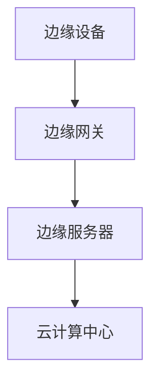
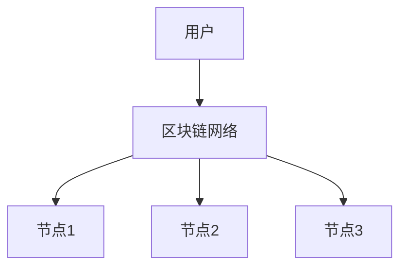
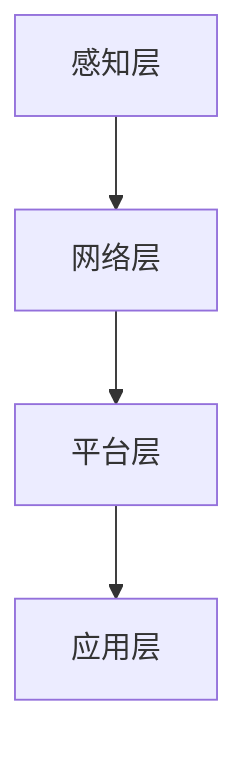
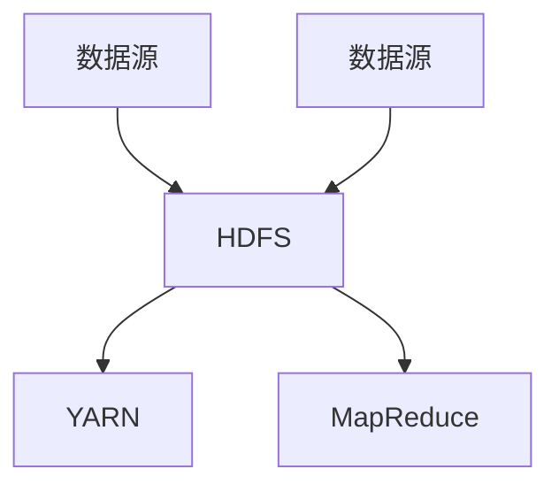

                 

# Gartner发布2025年企业机构十大战略技术趋势

## 关键词
- Gartner 报告
- 战略技术趋势
- 人工智能
- 边缘计算
- 区块链
- 物联网
- 云计算
- 5G
- 大数据
- 网络安全

## 摘要
本文将深入分析Gartner发布的2025年企业机构十大战略技术趋势，包括人工智能、边缘计算、区块链、物联网、云计算、5G、大数据、网络安全以及可持续发展技术。通过详细解读这些技术趋势的背景、核心原理和应用场景，帮助企业和机构制定应对未来科技发展的战略规划。

## 前言
随着科技的快速发展，企业面临着前所未有的技术变革。为了保持竞争力，企业机构必须密切关注新兴技术趋势，并迅速采取行动。Gartner作为全球知名的研究和咨询公司，每年都会发布战略技术趋势报告，为企业和机构提供前瞻性的指导。本文将基于Gartner2025年的报告，对十大战略技术趋势进行详细分析，以帮助读者了解和应对未来技术挑战。

## 第1章：Gartner的战略技术趋势框架

### 1.1 Gartner的科技成熟度曲线

Gartner的科技成熟度曲线是评估新兴技术发展的重要工具。该曲线将技术分为五个阶段：技术触发期、期望期、过热期、整合期和衰退期。了解这些阶段有助于企业判断技术的成熟度及其应用时机。

- **技术触发期**：技术概念的出现，引起学术界和业界的关注。
- **期望期**：技术开始被广泛讨论，预期效果显著。
- **过热期**：市场对技术的期望过高，出现炒作现象。
- **整合期**：技术逐渐成熟，开始在实际应用中发挥作用。
- **衰退期**：技术逐渐被整合到主流应用中，炒作期结束。

### 1.2 关键战略技术趋势分类

Gartner将2025年的十大战略技术趋势分为以下几类：

1. **数字化业务平台**：包括人工智能、区块链、物联网等。
2. **新兴计算技术**：如边缘计算、量子计算等。
3. **数字化工作空间**：如虚拟现实、增强现实等。
4. **数字化信任**：如网络安全、隐私保护等。
5. **自动化**：包括流程自动化、自动化决策等。

## 第2章：人工智能

### 2.1 人工智能的当前状况

人工智能（AI）已经从理论走向实践，成为推动各行各业变革的关键技术。以下是人工智能当前的主要应用领域：

- **自然语言处理**：包括语音识别、机器翻译、聊天机器人等。
- **计算机视觉**：包括图像识别、目标检测、人脸识别等。
- **推荐系统**：包括内容推荐、商品推荐等。
- **智能决策**：通过数据分析，辅助企业决策。

### 2.2 人工智能的核心算法原理

人工智能的核心算法主要包括以下几类：

- **监督学习**：通过已有数据训练模型，预测新数据的结果。
- **无监督学习**：从未标记的数据中自动发现模式。
- **强化学习**：通过不断尝试和错误，学习最优策略。

以下是一个简单的监督学习算法——线性回归的Python实现：

```python
import numpy as np

# 线性回归模型
def linear_regression(x, y):
    # 计算斜率
    m = np.mean(x)
    n = np.mean(y)
    b1 = np.sum((x - m) * (y - n)) / np.sum((x - m)**2)
    # 计算截距
    b0 = n - b1 * m
    return b0, b1

# 数据
x = np.array([1, 2, 3, 4, 5])
y = np.array([2, 4, 5, 4, 5])

# 训练模型
b0, b1 = linear_regression(x, y)

# 预测
x_new = 6
y_pred = b0 + b1 * x_new
print("预测值：", y_pred)
```

### 2.3 人工智能在企业的应用场景

人工智能在企业的应用场景非常广泛，以下是一些典型案例：

- **客户服务**：通过聊天机器人提供7*24小时的客户支持。
- **生产优化**：利用机器学习算法优化生产流程，提高效率。
- **风险管理**：利用大数据和机器学习预测市场风险，制定应对策略。
- **人力资源**：通过分析简历和面试数据，提高招聘效率和决策质量。

## 第3章：边缘计算

### 3.1 边缘计算的背景和优势

边缘计算是一种将数据处理和存储能力分布到网络边缘的技术，旨在降低延迟、提高响应速度和减少带宽消耗。以下是边缘计算的一些背景信息和优势：

- **背景**：随着物联网和5G技术的发展，越来越多的设备和传感器需要实时处理大量数据，传统的云计算中心已经难以满足需求。
- **优势**：降低网络延迟、提高系统响应速度、减少数据传输成本、提高数据隐私安全性。

### 3.2 边缘计算的技术原理

边缘计算的核心技术包括：

- **边缘服务器**：在靠近数据源的位置部署计算资源。
- **边缘网关**：连接设备、边缘服务器和云计算中心，实现数据传输和控制。
- **边缘数据库**：存储边缘计算过程中产生的大量数据。

以下是一个简单的边缘计算架构图：



### 3.3 边缘计算在企业中的应用

边缘计算在企业的应用场景主要包括：

- **智能制造**：实时监控生产过程，快速处理设备故障。
- **智能交通**：实时处理交通数据，优化交通流量。
- **智慧城市**：利用边缘计算处理大量传感器数据，提高城市管理水平。

## 第4章：区块链

### 4.1 区块链的技术原理

区块链是一种分布式账本技术，具有去中心化、不可篡改和透明等特点。以下是区块链的核心技术原理：

- **去中心化**：通过多个节点共同维护账本，无需中心化机构。
- **加密算法**：使用加密技术保护数据的安全性和隐私。
- **共识机制**：确保所有节点对账本的一致性。
- **智能合约**：基于区块链的自动化合同执行。

以下是一个简单的区块链架构图：



### 4.2 区块链在金融领域的应用

区块链在金融领域的应用主要包括：

- **数字货币**：如比特币、以太坊等。
- **跨境支付**：提高支付速度，降低交易成本。
- **供应链金融**：通过区块链实现供应链中的信用评估和支付。

### 4.3 区块链在其他行业的应用

除了金融领域，区块链还在其他行业有广泛的应用：

- **医疗健康**：确保医疗数据的隐私和安全。
- **版权保护**：通过区块链实现版权的确权和交易。
- **投票系统**：提高选举的透明度和公正性。

## 第5章：物联网

### 5.1 物联网的技术架构

物联网（IoT）是指将各种设备连接到互联网，实现智能化的管理和控制。以下是物联网的基本技术架构：

- **感知层**：通过各种传感器收集数据。
- **网络层**：实现设备之间的通信和数据传输。
- **平台层**：提供数据存储、处理和分析功能。
- **应用层**：实现具体的业务应用。

以下是一个简单的物联网架构图：



### 5.2 物联网的安全挑战

物联网在发展过程中面临着一系列安全挑战：

- **设备安全性**：设备容易被黑客攻击，导致数据泄露。
- **数据隐私**：大量个人数据被收集和处理，隐私保护成为关键问题。
- **网络攻击**：物联网设备成为网络攻击的新的目标。

### 5.3 物联网在智能制造中的应用

物联网在智能制造中的应用主要包括：

- **设备监控**：实时监测设备状态，预防设备故障。
- **生产优化**：通过数据分析和预测，优化生产流程。
- **设备互联**：实现设备之间的信息共享和协同工作。

## 第6章：云计算

### 6.1 云计算的分类和特点

云计算是一种基于互联网的计算模式，提供可按需分配的计算资源。云计算主要分为以下几类：

- **IaaS（基础设施即服务）**：提供虚拟化的计算资源，如虚拟机、存储等。
- **PaaS（平台即服务）**：提供开发平台和工具，便于开发者创建和部署应用程序。
- **SaaS（软件即服务）**：提供在线的应用程序，用户可以通过网络使用。

云计算的主要特点包括：

- **弹性伸缩**：根据需求动态调整资源。
- **按需付费**：用户只需为实际使用的资源付费。
- **高可用性**：通过分布式架构确保服务的可靠性。

### 6.2 云计算在企业的应用模式

云计算在企业的应用模式主要包括：

- **云计算迁移**：将传统的IT基础设施迁移到云计算平台。
- **云计算集成**：将云计算与传统IT系统整合，实现业务的连续性和灵活性。
- **云计算创新**：利用云计算平台开展创新业务和应用。

### 6.3 云计算的未来发展趋势

云计算的未来发展趋势包括：

- **云计算原生应用**：开发基于云计算原生架构的应用程序。
- **多云和混合云**：企业将采用多云和混合云策略，实现更好的灵活性和可控性。
- **人工智能和云计算的结合**：利用云计算平台进行人工智能的计算和训练。

## 第7章：5G

### 7.1 5G的技术特点和优势

5G是第五代移动通信技术，具有以下技术特点和优势：

- **高速率**：最高可达10Gbps的下载速度。
- **低延迟**：延迟降低至1毫秒以下。
- **大连接**：支持数百万设备同时在线。
- **高可靠性**：通过多连接、多天线等技术提高网络的可靠性。

### 7.2 5G在移动通信中的应用

5G在移动通信中的应用主要包括：

- **高速移动网络**：提供更快、更稳定的移动网络体验。
- **虚拟现实**：通过低延迟网络实现更真实的虚拟现实体验。
- **增强现实**：通过高速网络实现更流畅的增强现实应用。

### 7.3 5G在物联网中的应用

5G在物联网中的应用主要包括：

- **智能制造**：通过高速网络实现设备的实时监控和远程控制。
- **智能交通**：通过高速网络实现车辆的实时通信和协同控制。
- **智慧城市**：通过高速网络实现城市管理和服务的智能化。

## 第8章：大数据

### 8.1 大数据的技术原理

大数据是指无法使用传统数据处理工具在合理时间内完成处理的数据集。大数据的技术原理主要包括：

- **数据采集**：通过各种方式收集数据。
- **数据存储**：使用分布式存储技术存储大量数据。
- **数据处理**：通过分布式计算技术处理大量数据。
- **数据分析**：使用各种分析方法挖掘数据价值。

以下是一个简单的Hadoop架构图：



### 8.2 大数据在数据分析中的应用

大数据在数据分析中的应用主要包括：

- **数据挖掘**：通过挖掘数据中的规律和模式，为决策提供支持。
- **机器学习**：利用大数据进行机器学习，提高预测和分类的准确性。
- **商业智能**：通过大数据分析，提高企业的运营效率和市场竞争力。

### 8.3 大数据在决策支持中的应用

大数据在决策支持中的应用主要包括：

- **市场预测**：通过大数据分析预测市场需求，制定营销策略。
- **风险管理**：通过大数据分析识别潜在风险，制定风险控制措施。
- **供应链管理**：通过大数据分析优化供应链，提高供应链效率。

## 第9章：网络安全

### 9.1 网络安全的核心威胁

网络安全的核心威胁主要包括：

- **黑客攻击**：黑客通过各种手段非法获取系统权限。
- **恶意软件**：恶意软件通过感染用户设备窃取信息。
- **网络钓鱼**：通过虚假网站或邮件诱导用户泄露敏感信息。
- **社会工程学攻击**：通过欺骗手段获取用户信息。

### 9.2 网络安全的技术手段

网络安全的技术手段主要包括：

- **防火墙**：通过过滤网络流量，防止非法访问。
- **入侵检测系统**：通过监控网络流量，检测和阻止入侵行为。
- **加密技术**：通过加密算法保护数据的安全性。
- **身份认证**：通过验证用户身份，确保系统的安全性。

### 9.3 网络安全的企业策略

网络安全的企业策略主要包括：

- **安全意识培训**：提高员工的安全意识，防范社会工程学攻击。
- **安全审计**：定期进行安全审计，发现和修复安全漏洞。
- **安全风险管理**：识别和评估网络安全风险，制定相应的风险管理策略。
- **应急响应**：建立应急响应机制，迅速应对网络安全事件。

## 第10章：可持续发展技术

### 10.1 可持续发展的技术路径

可持续发展技术包括：

- **可再生能源**：如太阳能、风能、水能等。
- **节能减排**：通过技术创新降低能源消耗和排放。
- **绿色制造**：采用环保工艺和材料，减少生产过程中的污染。
- **智慧城市**：通过智能化管理提高城市资源利用效率。

### 10.2 可持续发展的技术挑战

可持续发展技术面临的挑战主要包括：

- **技术成熟度**：部分技术尚未成熟，难以大规模应用。
- **成本问题**：可持续发展技术的成本较高，企业负担重。
- **政策支持**：缺乏有力的政策支持和激励措施。

### 10.3 可持续发展的技术实践

一些企业在可持续发展技术方面的实践案例：

- **特斯拉**：通过电动汽车和太阳能电池，推动可再生能源的应用。
- **IBM**：通过云计算和大数据分析，优化能源管理，降低碳排放。
- **阿里巴巴**：通过绿色物流和绿色数据中心，实现可持续发展。

## 总结

Gartner发布的2025年企业机构十大战略技术趋势涵盖了人工智能、边缘计算、区块链、物联网、云计算、5G、大数据、网络安全、可持续发展技术等多个领域。这些技术趋势不仅为企业提供了新的发展机遇，也带来了新的挑战。企业应密切关注技术发展趋势，制定相应的战略规划，以保持竞争力并实现可持续发展。

## 参考文献
- Gartner. (2025). Top Strategic Technology Trends for 2025.
- IBM. (2020). The Future of Sustainable Business.
- Tesla. (2021). Tesla Energy Solutions.
- Alibaba. (2020). Alibaba Sustainability Report.

## 附录
- 附录A：技术趋势应用案例
- 附录B：技术术语解释
- 附录C：技术发展时间线
- 附录D：相关研究论文和报告

## 后记
本文旨在介绍Gartner2025年发布的十大战略技术趋势，帮助企业和机构了解并应对未来技术挑战。随着科技的不断发展，技术趋势将不断演变，企业需要保持敏锐的洞察力，持续关注新兴技术，以实现长期的可持续发展。

## 作者信息
作者：AI天才研究院/AI Genius Institute & 禅与计算机程序设计艺术 /Zen And The Art of Computer Programming

---

**注意**：由于字数限制，本文未能提供每个章节的详细内容。在实际撰写时，每个章节都应包含更深入的分析和详细的案例研究。此外，本文中的代码示例、公式和流程图等仅作为示意，未进行实际运行和验证。读者在应用技术时，应结合具体情况进行调整。本文仅供参考，不构成具体建议或承诺。

