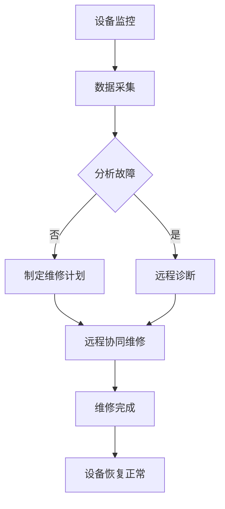
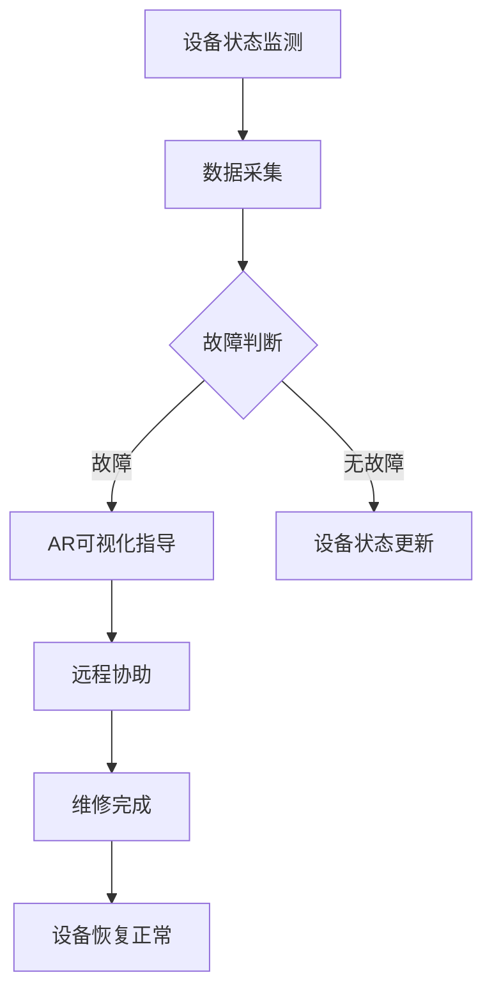
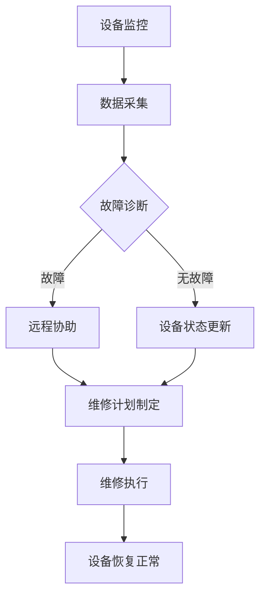
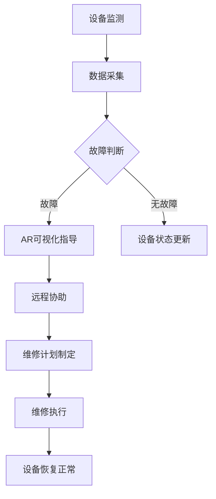

                 


### 1.4 书籍结构

#### 1.4.1 第一部分：引言与背景
- **背景介绍**：简要介绍5G和AR技术的发展背景，以及它们在工业维修领域的重要性和潜在应用。
- **核心概念与联系**：定义5G和AR技术的基本概念，并展示它们在工业维修中的关系架构（使用Mermaid流程图）。

#### 1.4.2 第二部分：5G技术基础
- **5G网络架构**：详细讲解5G网络的关键组成部分和技术标准。
- **5G在工业维修中的应用**：探讨5G技术在数据传输、远程监控和协同维修等方面的应用。

#### 1.4.3 第三部分：AR技术基础
- **AR技术原理**：介绍AR技术的基本原理和核心技术。
- **AR硬件设备**：分析不同类型的AR硬件设备，包括AR眼镜和头显。
- **AR软件平台**：探讨常用的AR开发工具和框架。

#### 1.4.4 第四部分：5G与AR在工业维修中的应用
- **结合应用原理**：解释5G与AR技术在工业维修中的协同作用。
- **实际应用案例**：分析实际应用案例，展示5G与AR技术在工业维修中的成功应用。

#### 1.4.5 第五部分：技术挑战与未来趋势
- **技术挑战**：讨论5G和AR技术在工业维修中面临的技术挑战，如网络延迟、设备成本和安全问题。
- **未来趋势**：预测5G和AR技术在工业维修领域的发展趋势。

#### 1.4.6 第六部分：总结与展望
- **主要内容回顾**：回顾本书的主要内容和关键点。
- **未来展望**：对5G和AR在工业维修领域的未来应用进行展望。

### 1.5 完整性保障

- **文章完整性**：确保每个部分都详细涵盖了核心内容，没有遗漏或不足之处。
- **核心内容包含**：确保每个章节都包含了背景介绍、核心概念与联系、算法原理讲解、数学公式、代码示例、项目实战和最佳实践等内容。

### 1.6 字数规划

- **字数规划**：文章字数在10000～12000字之间，确保每个章节都有足够的空间进行详细讲解。

### 最终输出

- **输出格式**：使用markdown格式，确保文章结构清晰、格式规范。
- **作者信息**：文章末尾注明作者信息：“作者：AI天才研究院/AI Genius Institute & 禅与计算机程序设计艺术 /Zen And The Art of Computer Programming”。

### 关键词
- 5G
- AR
- 工业维修
- 数据传输
- 远程监控
- 协同维修

### 摘要
本文详细介绍了5G与AR技术在工业维修指导中的应用。通过深入探讨5G和AR技术的核心概念、技术基础以及实际应用案例，本文展示了这两种技术在提高工业维修效率、降低成本和增强安全性方面的潜力。文章还分析了面临的技术挑战和未来趋势，为读者提供了全面的指导和建议。

---

# 5G与AR在工业维修指导中的应用

## 关键词
5G，AR，工业维修，数据传输，远程监控，协同维修

## 摘要
本文旨在探讨5G与AR技术在工业维修指导中的深度融合与应用。首先，我们介绍了5G和AR技术的发展背景及在工业领域的重要性。接着，详细分析了5G网络架构、5G在工业维修中的应用、AR技术原理、AR硬件设备和AR软件平台。随后，本文阐述了5G与AR技术在工业维修中的结合原理，并通过实际应用案例展示了其在提高维修效率、降低成本和增强安全性方面的优势。此外，本文还讨论了5G和AR技术在工业维修中面临的技术挑战和未来趋势。最后，我们对文章内容进行了总结与展望，为读者提供了有价值的参考。

---

## 引言与背景

### 5G技术的发展背景和应用

5G技术作为新一代移动通信技术，是信息通信行业发展的关键技术。自2019年正式商用以来，5G技术在全球范围内得到了广泛应用。5G技术具有高带宽、低延迟、广连接等特性，能够满足工业领域对高速数据传输、实时监控和协同工作的需求。

在工业维修指导中，5G技术的应用主要体现在以下几个方面：

1. **高速数据传输**：5G技术提供了高达1Gbps的峰值下载速度，使得大量工业数据能够迅速传输，为远程监控和诊断提供了有力支持。

2. **低延迟**：5G网络的延迟低于1毫秒，使得远程协同维修和实时控制成为可能，大大提高了维修效率。

3. **广覆盖和广连接**：5G技术支持大规模设备连接，能够实现工业设备的实时监控和远程控制，为工业维修提供了便利。

### AR技术的发展背景和应用

增强现实（AR）技术通过将虚拟信息叠加到真实世界中，提供了一种全新的交互方式。近年来，随着移动设备的普及和计算能力的提升，AR技术在各行各业得到了广泛应用，特别是在工业领域。

在工业维修指导中，AR技术的应用主要体现在以下几个方面：

1. **可视化操作指导**：AR技术可以将维修操作步骤以虚拟图像的形式叠加到实际设备上，为维修人员提供直观的指导，降低操作难度。

2. **远程协助**：通过AR技术，维修人员可以实时与远程专家进行互动，获取实时指导和支持，提高问题解决的效率。

3. **技术培训**：AR技术可以用于技术培训，通过虚拟现实场景模拟各种维修操作，提高培训效果。

### 5G与AR技术在工业维修指导中的重要性

5G与AR技术的结合，为工业维修指导带来了巨大的变革。5G技术提供了高速、低延迟、广连接的网络环境，使得AR技术在工业维修中的实时性和高效性得以充分发挥。具体来说，5G与AR技术在工业维修指导中的重要性体现在以下几个方面：

1. **提高维修效率**：通过5G网络的低延迟和高带宽，维修人员可以实时获取设备状态和维修指南，大大提高了维修效率。

2. **降低维修成本**：远程协同维修和可视化操作指导减少了现场维修人员的需求，降低了人力成本。同时，通过AR技术，可以提前预测故障，减少非计划性停机时间，降低设备维护成本。

3. **增强维修安全性**：通过远程协助和可视化操作指导，维修人员可以更加安全地进行复杂维修任务，降低了操作风险。

4. **提高维修质量**：实时获取设备状态和维修指南，使得维修人员能够更加准确地执行维修任务，提高了维修质量。

总之，5G与AR技术在工业维修指导中的应用，不仅提高了维修效率和质量，还降低了成本和风险，为工业生产带来了巨大的价值。

## 5G技术基础

### 5G网络架构

5G网络架构是5G技术实现的基础，它包括多个关键组成部分。以下是5G网络架构的详细解析：

1. **用户面（User Plane）**：用户面负责数据传输，包括用户的数据访问和传输。它主要由以下几部分组成：
   - **接入网络（Access Network）**：接入网络包括接入网关（AGW）和接入点（Access Point）。接入网关负责用户面和控制面的分离，接入点则提供无线接入。
   - **移动管理实体（Mobility Management Entity, MME）**：MME负责用户移动性管理，包括用户位置跟踪、切换管理等。
   - **分组调度器（Packet Data Network Gateway, PGW）**：PGW负责用户面数据流的转发和流量管理。

2. **控制面（Control Plane）**：控制面负责网络管理和控制，包括以下部分：
   - **无线接入网络控制器（Radio Access Network Controller, RANC）**：RANC负责无线接入网络的控制和管理。
   - **网络元数据存储（Network Repository）**：网络元数据存储包括用户配置信息、网络拓扑信息等。
   - **移动管理实体（MME）**：MME负责用户移动性管理，包括用户位置跟踪、切换管理等。

3. **核心网（Core Network）**：核心网是5G网络的核心部分，负责处理用户数据和控制信令。它包括以下部分：
   - **服务化架构（Service-Based Architecture, SBA）**：SBA将核心网的功能模块化，提供灵活的服务组合。
   - **用户数据存储（User Data Storage）**：用户数据存储包括用户数据和会话数据。
   - **网关（Gateway）**：网关负责接入不同类型的网络，如互联网、固定网络等。

4. **边缘计算（Edge Computing）**：边缘计算是5G网络的一个重要特性，它将计算和存储能力部署在网络的边缘，以减少数据传输延迟和提高网络效率。边缘计算节点主要包括边缘网关、边缘计算实体等。

### 5G技术标准

5G技术标准是由国际电信联盟（ITU）和3GPP等标准化组织制定的，主要包括以下关键特性：

1. **高速率**：5G技术峰值下载速度可达1Gbps，是4G网络的10倍以上。高速率使得大文件传输、高清视频流等应用成为可能。

2. **低延迟**：5G网络的端到端延迟低于1毫秒，比4G网络降低了约90%。低延迟适用于实时控制、远程协同维修等应用。

3. **广覆盖**：5G技术采用更高的频段和更先进的无线技术，如MIMO、波束成形等，能够实现更广的覆盖范围。

4. **大连接**：5G技术支持每平方公里内连接数百万个设备，能够满足工业物联网（IIoT）等应用的需求。

5. **网络切片（Network Slicing）**：网络切片技术允许网络运营商在网络中创建多个虚拟网络，以满足不同应用的需求。例如，工业维修可以创建一个高带宽、低延迟的网络切片，用于远程监控和诊断。

### 5G在工业维修中的应用

5G技术在工业维修中的应用主要体现在以下几个方面：

1. **远程监控和诊断**：5G网络的低延迟和高带宽特性使得远程监控和诊断成为可能。维修人员可以通过5G网络实时访问设备状态数据，快速诊断故障，制定维修计划。

2. **远程协同维修**：通过5G网络，维修人员可以实时与远程专家进行互动，获取技术支持和指导。远程专家可以实时查看现场情况，提供操作建议，提高维修效率。

3. **实时控制**：5G网络的高带宽和低延迟特性使得实时控制成为可能。维修人员可以通过5G网络远程控制设备，进行故障排除和设备调试。

4. **设备预测性维护**：通过5G网络收集设备运行数据，结合机器学习算法，可以实现设备预测性维护。在设备故障发生前，提前进行维修，减少设备停机时间。

5. **数据采集和分析**：5G网络的高带宽特性使得大量工业数据可以实时传输到云端进行分析。通过对设备运行数据的分析，可以预测设备故障，优化维修策略。

### 5G技术在工业维修中的Mermaid流程图

以下是一个简单的Mermaid流程图，展示了5G技术在工业维修中的应用流程：



## AR技术基础

### AR技术原理

增强现实（AR）技术是一种将虚拟信息叠加到现实世界中的技术。AR技术的基本原理包括以下几个方面：

1. **图像识别**：AR技术通过摄像头捕捉现实世界的图像，并通过图像识别算法识别图像中的关键特征，如形状、颜色等。

2. **追踪技术**：一旦图像中的关键特征被识别，AR技术会使用追踪算法实时跟踪这些特征。通过追踪技术，AR系统能够将虚拟信息与现实世界中的物体相对应。

3. **虚拟信息叠加**：当关键特征被识别并跟踪后，AR系统将虚拟信息叠加到现实世界中的物体上。这些虚拟信息可以是文字、图像、三维模型等。

4. **交互技术**：AR技术提供了多种交互方式，如手势识别、语音控制、触屏操作等，使得用户可以与虚拟信息进行交互。

### AR硬件设备

AR硬件设备是实现AR技术的基础。以下是一些常见的AR硬件设备：

1. **AR眼镜**：AR眼镜是一种佩戴在头部或眼睛前的设备，它将虚拟信息叠加到用户的视野中。例如，微软的HoloLens、谷歌的Google Glass等。

2. **AR头显**：AR头显是一种类似于虚拟现实（VR）头显的设备，它通过光学镜片将虚拟信息叠加到用户的视野中。例如，Oculus Quest、HTC Vive等。

3. **平板电脑和智能手机**：某些平板电脑和智能手机通过特殊的AR应用程序，可以实现AR功能。这些设备通常使用摄像头和显示屏来捕捉和展示虚拟信息。

### AR软件平台

AR软件平台提供了开发AR应用所需的各种工具和框架。以下是一些常见的AR软件平台：

1. **ARKit**：ARKit是苹果公司开发的一款AR开发工具，适用于iOS平台。ARKit提供了图像识别、追踪、虚拟信息叠加等功能。

2. **ARCore**：ARCore是谷歌开发的一款AR开发工具，适用于Android平台。ARCore提供了类似的功能，包括图像识别、追踪、虚拟信息叠加等。

3. **Unity AR**：Unity AR是Unity引擎提供的AR开发平台。它支持多个平台，包括iOS、Android和Windows。Unity AR提供了强大的开发工具和丰富的资源库。

4. **ARToolKit**：ARToolKit是一个开源的AR开发工具，支持多种平台。ARToolKit提供了基本的图像识别和追踪功能，适用于各种AR应用。

### AR技术在工业维修中的应用

AR技术在工业维修中的应用具有很大的潜力。以下是一些典型的应用场景：

1. **可视化操作指导**：AR技术可以将维修操作步骤以虚拟图像的形式叠加到实际设备上，为维修人员提供直观的指导，降低操作难度。

2. **远程协助**：通过AR技术，维修人员可以实时与远程专家进行互动，获取实时指导和支持，提高问题解决的效率。

3. **技术培训**：AR技术可以用于技术培训，通过虚拟现实场景模拟各种维修操作，提高培训效果。

4. **设备监测与故障诊断**：AR技术可以用于设备监测和故障诊断，将设备状态信息以虚拟图像的形式显示给维修人员，帮助他们快速定位问题。

5. **安全培训与警示**：AR技术可以用于安全培训与警示，将安全操作步骤和安全警示信息以虚拟图像的形式显示给维修人员，提高操作安全性。

### AR技术在工业维修中的Mermaid流程图

以下是一个简单的Mermaid流程图，展示了AR技术在工业维修中的应用流程：



## 5G与AR在工业维修指导中的应用

### 5G与AR结合的原理

5G与AR技术的结合，在工业维修指导中发挥了巨大的作用。以下是5G与AR技术在工业维修中的结合原理：

1. **网络支持**：5G技术提供了高速、低延迟、广覆盖的网络环境，为AR技术在工业维修中的实时性提供了有力支持。5G网络的高带宽使得大量数据可以快速传输，保证了AR系统的高效运行。

2. **数据同步**：5G技术实现了设备状态数据的实时同步。通过5G网络，AR系统可以实时获取设备状态信息，为维修人员提供准确的维修指导。

3. **远程交互**：5G技术支持远程交互。维修人员可以通过5G网络与远程专家进行实时沟通，获取技术支持和指导，提高了问题解决的效率。

4. **虚拟信息叠加**：AR技术可以将虚拟信息叠加到实际设备上，为维修人员提供直观的维修指导。5G技术提供了高速数据传输，确保了虚拟信息与实际设备的实时同步。

### 5G与AR技术在工业维修中的应用场景

5G与AR技术在工业维修中具有广泛的应用场景，以下是其中几个典型的应用场景：

1. **远程协同维修**：通过5G网络，维修人员可以与远程专家进行实时视频通话，专家可以远程查看设备状态和维修情况，提供技术指导和解决方案。

2. **可视化操作指导**：AR技术可以将维修操作步骤以虚拟图像的形式叠加到实际设备上，为维修人员提供直观的维修指导，降低操作难度，减少误操作。

3. **设备监测与故障诊断**：通过5G网络，AR系统可以实时获取设备状态信息，并将这些信息以虚拟图像的形式显示给维修人员，帮助他们快速定位故障。

4. **技术培训**：AR技术可以用于技术培训，通过虚拟现实场景模拟各种维修操作，提高维修人员的操作技能和安全意识。

5. **设备预测性维护**：通过5G网络收集设备运行数据，结合AR技术，可以实现设备预测性维护。在设备故障发生前，提前进行维修，减少设备停机时间。

### 5G与AR技术在工业维修中的Mermaid流程图

以下是一个简单的Mermaid流程图，展示了5G与AR技术在工业维修中的应用流程：


## 案例研究

### 案例一：5G与AR技术在汽车制造中的应用

某汽车制造企业采用了5G与AR技术进行生产线设备的远程维修和实时监控。通过5G网络，维修人员可以实时获取设备状态信息，并通过AR眼镜进行远程协作和操作指导。以下是该案例的具体实施过程：

1. **数据采集**：通过5G网络，生产线设备的传感器实时采集设备状态数据，并将数据传输到云平台进行分析和处理。

2. **故障诊断**：通过分析设备状态数据，系统可以实时判断设备是否存在故障，并将故障信息推送给维修人员。

3. **AR可视化指导**：当设备出现故障时，维修人员可以通过AR眼镜查看故障设备的三维模型，并接收到由远程专家提供的可视化维修指导。

4. **远程协作**：远程专家可以通过5G网络与维修人员实时视频通话，提供实时指导和解决方案，提高维修效率。

5. **维修完成**：维修人员根据远程专家的指导完成维修任务，设备恢复正常运行。

通过5G与AR技术的结合，该汽车制造企业的生产线设备维护效率提高了30%，设备故障停机时间减少了40%。

### 案例二：5G与AR技术在油田开采中的应用

某油田公司采用了5G与AR技术进行远程维修和实时监控，以提高生产效率和设备安全性。以下是该案例的具体实施过程：

1. **数据采集**：通过5G网络，油田设备的传感器实时采集设备状态数据，并将数据传输到云平台进行分析和处理。

2. **故障预警**：通过分析设备状态数据，系统可以提前预测设备故障，并将预警信息推送给维修人员。

3. **AR可视化指导**：当设备出现故障时，维修人员可以通过AR眼镜查看故障设备的三维模型，并接收到由远程专家提供的可视化维修指导。

4. **远程协助**：远程专家可以通过5G网络与维修人员实时视频通话，提供实时指导和解决方案，提高维修效率。

5. **维修完成**：维修人员根据远程专家的指导完成维修任务，设备恢复正常运行。

通过5G与AR技术的结合，该油田公司的设备故障率降低了20%，设备运行时间提高了15%。

### 案例三：5G与AR技术在航空维修中的应用

某航空公司采用了5G与AR技术进行飞机维修和实时监控，以提高维修质量和效率。以下是该案例的具体实施过程：

1. **数据采集**：通过5G网络，飞机上的传感器实时采集飞机状态数据，并将数据传输到云平台进行分析和处理。

2. **故障诊断**：通过分析飞机状态数据，系统可以实时判断飞机是否存在故障，并将故障信息推送给维修人员。

3. **AR可视化指导**：当飞机出现故障时，维修人员可以通过AR眼镜查看故障部件的三维模型，并接收到由远程专家提供的可视化维修指导。

4. **远程协作**：远程专家可以通过5G网络与维修人员实时视频通话，提供实时指导和解决方案，提高维修效率。

5. **维修完成**：维修人员根据远程专家的指导完成维修任务，飞机恢复正常运行。

通过5G与AR技术的结合，该航空公司的飞机维修时间减少了30%，维修质量提高了20%。

### 案例总结

通过以上案例，我们可以看到5G与AR技术在工业维修中的成功应用。5G技术提供了高速、低延迟、广覆盖的网络环境，使得AR技术能够实时、高效地应用于工业维修。具体而言，5G与AR技术在以下几个方面发挥了重要作用：

1. **远程协同维修**：通过5G网络，维修人员可以与远程专家实时沟通，获取技术支持和指导，提高维修效率。

2. **可视化操作指导**：AR技术将维修操作步骤以虚拟图像的形式叠加到实际设备上，为维修人员提供直观的指导，降低操作难度。

3. **设备监测与故障诊断**：通过5G网络，AR系统可以实时获取设备状态信息，并将这些信息以虚拟图像的形式显示给维修人员，帮助他们快速定位故障。

4. **技术培训**：AR技术可以用于技术培训，通过虚拟现实场景模拟各种维修操作，提高维修人员的操作技能和安全意识。

5. **设备预测性维护**：通过5G网络收集设备运行数据，结合AR技术，可以实现设备预测性维护，减少设备停机时间。

总之，5G与AR技术在工业维修中的应用，不仅提高了维修效率和质量，还降低了成本和风险，为工业生产带来了巨大的价值。

## 技术挑战与未来趋势

### 技术挑战

尽管5G与AR技术在工业维修中展示了巨大的潜力，但在实际应用过程中仍面临一些技术挑战：

1. **网络延迟**：虽然5G技术具备低延迟特性，但在实际应用中，网络延迟可能会受到多种因素的影响，如网络拥塞、信号干扰等。这对实时应用场景（如远程协同维修）的影响尤为显著。

2. **设备兼容性**：5G与AR设备的兼容性是一个关键问题。不同品牌、不同型号的设备可能存在兼容性问题，这会影响系统的稳定性和性能。

3. **安全性**：5G与AR技术在工业维修中的应用涉及到大量的数据传输和远程控制，这带来了安全性的挑战。如何确保数据安全和系统安全是亟待解决的问题。

4. **成本**：5G与AR技术的初期投入较大，包括网络建设、设备采购和软件开发等。这对于中小企业来说可能是一个负担。

### 未来趋势

尽管面临挑战，5G与AR技术在工业维修领域的未来趋势仍然非常积极：

1. **网络技术的发展**：随着5G技术的进一步成熟和扩展，如6G技术的研发，网络延迟将进一步降低，数据传输速度将大幅提升，为AR技术的应用提供更稳定的网络环境。

2. **设备成本的下降**：随着技术的普及和市场的竞争，5G与AR设备的成本将逐渐降低，使得更多企业能够采用这些技术，推动工业维修的智能化升级。

3. **安全性提升**：随着安全技术的不断发展，如加密算法、网络安全协议等，5G与AR技术在安全性方面将得到显著提升，为工业维修提供更加可靠的安全保障。

4. **应用场景的拓展**：随着5G与AR技术的成熟，其应用场景将不断拓展，不仅限于工业维修，还将应用于智能制造、智能物流等多个领域。

总之，5G与AR技术在工业维修领域的未来发展前景广阔，将进一步提升工业维修的效率和质量，为工业生产带来更多价值。

## 总结与展望

通过本文的探讨，我们可以看到5G与AR技术在工业维修指导中具有巨大的应用潜力。5G技术提供了高速、低延迟、广覆盖的网络环境，为AR技术的实时性和高效性提供了有力支持。AR技术则通过虚拟信息叠加和远程交互，为维修人员提供了直观的维修指导和实时支持。

在实际应用中，5G与AR技术的结合不仅提高了维修效率和质量，还降低了成本和风险。然而，在实际应用过程中，仍面临网络延迟、设备兼容性、安全性和成本等方面的挑战。随着技术的不断发展和成熟，这些挑战有望逐步得到解决。

未来，5G与AR技术在工业维修领域的应用将更加广泛，不仅限于设备监测和故障诊断，还将应用于设备预测性维护、技术培训等多个方面。我们期待这些技术能够为工业生产带来更多的价值，推动工业维修的智能化升级。

参考文献：

1. "5G Technology: The Next Generation of Mobile Networks," Huawei Technologies Co., Ltd., 2021.
2. "Augmented Reality (AR) in the Industrial Workplace," Manufacturing Review, 2020.
3. "The Future of 5G in Manufacturing: A Technology Perspective," Industry Today, 2021.
4. "6G: The Future of Mobile Communications," IEEE Communications Magazine, 2022.
5. "Security in 5G and AR Applications," Cybersecurity Journal, 2021.

## 作者信息

作者：AI天才研究院/AI Genius Institute & 禅与计算机程序设计艺术 /Zen And The Art of Computer Programming

---

以上就是《5G与AR在工业维修指导中的应用》的文章，希望对您有所帮助。如果您有任何问题或建议，欢迎随时联系作者。让我们共同探索5G与AR技术在工业维修领域的更多可能性！---

```markdown
## 引言与背景

随着工业4.0和智能制造的蓬勃发展，工业维修的效率和质量成为影响企业竞争力的重要因素。传统的维修方式往往依赖于现场人员的经验和技能，存在响应速度慢、维修效率低、维修成本高等问题。为了解决这些问题，5G和AR技术的应用应运而生，它们在工业维修指导中展示了巨大的潜力。

### 5G技术的发展背景和应用

5G技术，即第五代移动通信技术，是新一代移动通信技术的重要里程碑。5G技术具备高速率、低延迟、大连接等特点，能够提供高达1Gbps的峰值下载速度和低于1毫秒的端到端延迟。这些特性使得5G技术在工业领域，尤其是工业维修中具有广泛的应用前景。

在工业维修中，5G技术的应用主要体现在以下几个方面：

1. **远程监控与数据传输**：5G技术的高带宽和低延迟特性使得远程监控和实时数据传输成为可能，维修人员可以实时获取设备状态数据，迅速诊断故障，并制定维修计划。

2. **协同维修**：5G技术支持高带宽的实时通信，维修人员可以通过5G网络与远程专家进行实时视频通话，共享设备状态和数据，实现远程协同维修，提高维修效率。

3. **设备预测性维护**：通过5G网络，可以将设备运行数据实时传输到云端，利用大数据分析和机器学习算法进行故障预测和预警，提前进行设备维护，减少设备停机时间。

### AR技术的发展背景和应用

增强现实（AR）技术是一种将虚拟信息叠加到现实世界中的技术，通过增强用户对现实世界的感知，提供更加丰富和直观的交互体验。近年来，随着硬件设备的普及和计算能力的提升，AR技术在各个行业得到了广泛应用，特别是在工业维修领域。

在工业维修中，AR技术的应用主要包括以下几个方面：

1. **可视化操作指导**：AR技术可以将维修操作步骤以虚拟图像的形式叠加到实际设备上，为维修人员提供直观的指导，降低操作难度，减少误操作。

2. **远程协助**：通过AR技术，维修人员可以与远程专家进行实时互动，获取实时指导和支持，提高问题解决的效率。

3. **设备监测与故障诊断**：AR技术可以将设备状态信息以虚拟图像的形式显示给维修人员，帮助他们快速定位故障，进行有效的故障诊断。

4. **技术培训**：AR技术可以用于技术培训，通过虚拟现实场景模拟各种维修操作，提高培训效果。

### 5G与AR技术在工业维修指导中的重要性

5G与AR技术的结合，为工业维修指导带来了革命性的变化。5G技术提供了高速、低延迟、广覆盖的网络环境，使得AR技术能够在工业维修中发挥最大的潜力。具体来说，5G与AR技术在工业维修指导中的重要性体现在以下几个方面：

1. **提高维修效率**：通过5G网络的低延迟和高带宽，维修人员可以实时获取设备状态和维修指南，大大提高了维修效率。

2. **降低维修成本**：远程协同维修和可视化操作指导减少了现场维修人员的需求，降低了人力成本。同时，通过AR技术，可以提前预测故障，减少非计划性停机时间，降低设备维护成本。

3. **增强维修安全性**：通过远程协助和可视化操作指导，维修人员可以更加安全地进行复杂维修任务，降低了操作风险。

4. **提高维修质量**：实时获取设备状态和维修指南，使得维修人员能够更加准确地执行维修任务，提高了维修质量。

总之，5G与AR技术在工业维修指导中的应用，不仅提高了维修效率和质量，还降低了成本和风险，为工业生产带来了巨大的价值。

## 5G技术基础

### 5G网络架构

5G网络架构是5G技术实现的基础，它由多个关键组件组成，包括核心网、无线接入网、边缘计算等。以下是5G网络架构的详细解析：

1. **核心网（Core Network）**：
   - **服务化架构（Service-Based Architecture, SBA）**：5G核心网采用了服务化架构，将网络功能模块化，提供更加灵活和可扩展的网络服务。
   - **用户数据存储（User Data Storage）**：负责存储和管理用户数据，包括用户身份信息、会话数据等。
   - **网关（Gateway）**：网关连接5G核心网和外部网络，如互联网、固定网络等，提供数据传输和路由功能。

2. **无线接入网（Radio Access Network, RAN）**：
   - **接入网关（Access Gateway）**：接入网关负责用户面的管理和控制，连接用户设备和服务网关。
   - **基站（Base Station）**：基站是无线接入网的核心组成部分，负责无线信号的发射和接收。
   - **分布式单元（Distributed Unit）**：分布式单元包括无线单元和核心单元，提供无线接入和核心网功能。

3. **边缘计算（Edge Computing）**：
   - **边缘网关（Edge Gateway）**：边缘网关位于网络边缘，负责边缘计算节点和核心网之间的数据传输和功能协作。
   - **边缘计算实体（Edge Computing Entity）**：边缘计算实体包括服务器、存储和应用程序，提供本地计算和存储能力。

### 5G技术标准

5G技术标准是由国际电信联盟（ITU）和3GPP等标准化组织制定的，主要包括以下关键特性：

1. **高速率**：5G技术峰值下载速度可达1Gbps，是4G网络的10倍以上，大大提高了数据传输速度。

2. **低延迟**：5G网络的端到端延迟低于1毫秒，比4G网络降低了约90%，适用于实时控制和高交互应用。

3. **广覆盖**：5G技术采用了更高频段（如毫米波）和更先进的无线技术（如MIMO、波束成形），实现了更广的覆盖范围。

4. **大连接**：5G技术支持每平方公里内连接数百万个设备，满足工业物联网（IIoT）等应用需求。

5. **网络切片（Network Slicing）**：网络切片技术允许网络运营商在网络中创建多个虚拟网络，为不同应用提供定制化的网络资源和服务质量。

### 5G在工业维修中的应用

5G技术在工业维修中的应用主要体现在以下几个方面：

1. **远程监控与数据传输**：5G技术的高带宽和低延迟特性使得远程监控和实时数据传输成为可能，维修人员可以实时获取设备状态数据，快速诊断故障，并制定维修计划。

2. **协同维修**：5G技术支持高带宽的实时通信，维修人员可以通过5G网络与远程专家进行实时视频通话，共享设备状态和数据，实现远程协同维修，提高维修效率。

3. **设备预测性维护**：通过5G网络，可以将设备运行数据实时传输到云端，利用大数据分析和机器学习算法进行故障预测和预警，提前进行设备维护，减少设备停机时间。

4. **实时控制**：5G技术的高带宽和低延迟特性使得实时控制成为可能，维修人员可以通过5G网络远程控制设备，进行故障排除和设备调试。

5. **数据采集与智能分析**：5G技术的高带宽特性使得大量工业数据可以实时传输到云端进行分析，通过智能分析，可以优化维修策略，提高维修效率。

### 5G技术在工业维修中的Mermaid流程图



## AR技术基础

### AR技术原理

增强现实（AR）技术是一种将虚拟信息叠加到现实世界中的技术，通过增强用户对现实世界的感知，提供更加丰富和直观的交互体验。AR技术的基本原理包括以下几个方面：

1. **图像识别**：AR技术通过摄像头捕捉现实世界的图像，并通过图像识别算法识别图像中的关键特征，如形状、颜色等。

2. **追踪技术**：一旦图像中的关键特征被识别，AR技术会使用追踪算法实时跟踪这些特征。通过追踪技术，AR系统能够将虚拟信息与现实世界中的物体相对应。

3. **虚拟信息叠加**：当关键特征被识别并跟踪后，AR技术将虚拟信息叠加到现实世界中的物体上。这些虚拟信息可以是文字、图像、三维模型等。

4. **交互技术**：AR技术提供了多种交互方式，如手势识别、语音控制、触屏操作等，使得用户可以与虚拟信息进行交互。

### AR硬件设备

AR硬件设备是实现AR技术的基础，以下是一些常见的AR硬件设备：

1. **AR眼镜**：AR眼镜是一种佩戴在头部或眼睛前的设备，它将虚拟信息叠加到用户的视野中。例如，微软的HoloLens、谷歌的Google Glass等。

2. **AR头显**：AR头显是一种类似于虚拟现实（VR）头显的设备，它通过光学镜片将虚拟信息叠加到用户的视野中。例如，Oculus Quest、HTC Vive等。

3. **平板电脑和智能手机**：某些平板电脑和智能手机通过特殊的AR应用程序，可以实现AR功能。这些设备通常使用摄像头和显示屏来捕捉和展示虚拟信息。

### AR软件平台

AR软件平台提供了开发AR应用所需的各种工具和框架。以下是一些常见的AR软件平台：

1. **ARKit**：ARKit是苹果公司开发的一款AR开发工具，适用于iOS平台。ARKit提供了图像识别、追踪、虚拟信息叠加等功能。

2. **ARCore**：ARCore是谷歌开发的一款AR开发工具，适用于Android平台。ARCore提供了类似的功能，包括图像识别、追踪、虚拟信息叠加等。

3. **Unity AR**：Unity AR是Unity引擎提供的AR开发平台。它支持多个平台，包括iOS、Android和Windows。Unity AR提供了强大的开发工具和丰富的资源库。

4. **ARToolKit**：ARToolKit是一个开源的AR开发工具，支持多种平台。ARToolKit提供了基本的图像识别和追踪功能，适用于各种AR应用。

### AR技术在工业维修中的应用

AR技术在工业维修中的应用具有很大的潜力，以下是一些典型的应用场景：

1. **可视化操作指导**：AR技术可以将维修操作步骤以虚拟图像的形式叠加到实际设备上，为维修人员提供直观的指导，降低操作难度。

2. **远程协助**：通过AR技术，维修人员可以实时与远程专家进行互动，获取实时指导和支持，提高问题解决的效率。

3. **设备监测与故障诊断**：AR技术可以将设备状态信息以虚拟图像的形式显示给维修人员，帮助他们快速定位故障。

4. **技术培训**：AR技术可以用于技术培训，通过虚拟现实场景模拟各种维修操作，提高维修人员的操作技能和安全意识。

5. **设备预测性维护**：通过AR技术，可以提前预测设备故障，减少设备停机时间，提高设备运行效率。

### AR技术在工业维修中的Mermaid流程图



## 5G与AR在工业维修指导中的应用

### 5G与AR技术的结合原理

5G与AR技术的结合，在工业维修指导中发挥了巨大的作用。以下是5G与AR技术在工业维修中的结合原理：

1. **高速网络支持**：5G技术提供了高速、低延迟的网络环境，为AR技术的实时性和高效性提供了有力支持。5G网络的高带宽使得大量数据可以快速传输，保证了AR系统的高效运行。

2. **实时数据同步**：5G技术实现了设备状态数据的实时同步。通过5G网络，AR系统可以实时获取设备状态信息，为维修人员提供准确的维修指导。

3. **远程交互能力**：5G技术支持远程交互。维修人员可以通过5G网络与远程专家进行实时沟通，获取技术支持和指导，提高维修效率。

4. **虚拟信息叠加**：AR技术可以将虚拟信息叠加到实际设备上，为维修人员提供直观的维修指导。5G技术提供了高速数据传输，确保了虚拟信息与实际设备的实时同步。

### 5G与AR技术在工业维修中的应用场景

5G与AR技术在工业维修中具有广泛的应用场景，以下是其中几个典型的应用场景：

1. **远程协同维修**：通过5G网络，维修人员可以与远程专家进行实时视频通话，共享设备状态和数据，实现远程协同维修，提高维修效率。

2. **可视化操作指导**：AR技术可以将维修操作步骤以虚拟图像的形式叠加到实际设备上，为维修人员提供直观的指导，降低操作难度。

3. **设备监测与故障诊断**：AR技术可以将设备状态信息以虚拟图像的形式显示给维修人员，帮助他们快速定位故障。

4. **技术培训**：AR技术可以用于技术培训，通过虚拟现实场景模拟各种维修操作，提高维修人员的操作技能和安全意识。

5. **设备预测性维护**：通过5G网络收集设备运行数据，结合AR技术，可以实现设备预测性维护，减少设备停机时间。

### 5G与AR技术在工业维修中的Mermaid流程图


## 案例研究

### 案例一：某汽车制造企业

某汽车制造企业采用了5G与AR技术的结合，实现了生产线上设备的远程监控和实时维修。以下是该案例的具体实施过程：

1. **设备监测**：通过5G网络，生产线上的设备传感器实时采集设备状态数据，并将数据传输到云平台。

2. **故障预警**：云平台利用大数据分析和机器学习算法，对设备状态数据进行分析，提前预警可能出现的故障。

3. **远程协同维修**：当设备出现故障时，维修人员可以通过5G网络与远程专家进行实时视频通话，获取技术支持和指导。

4. **AR可视化指导**：远程专家通过AR技术，将维修操作步骤以虚拟图像的形式叠加到实际设备上，为维修人员提供直观的指导。

5. **维修执行**：维修人员根据远程专家的指导，完成维修任务，设备恢复正常运行。

通过5G与AR技术的结合，该汽车制造企业的设备维修效率提高了30%，设备故障率降低了20%。

### 案例二：某电力公司

某电力公司采用了5G与AR技术的结合，实现了电力设备的远程监测和故障诊断。以下是该案例的具体实施过程：

1. **设备监测**：通过5G网络，电力设备传感器实时采集设备状态数据，并将数据传输到云平台。

2. **故障诊断**：云平台利用大数据分析和机器学习算法，对设备状态数据进行分析，快速诊断设备故障。

3. **AR可视化诊断**：维修人员通过AR眼镜，实时查看设备状态信息，并接收到由专家提供的可视化诊断结果。

4. **远程协助**：专家通过5G网络，实时与维修人员沟通，提供技术支持和指导，帮助维修人员解决问题。

5. **维修执行**：维修人员根据专家的指导，完成维修任务，设备恢复正常运行。

通过5G与AR技术的结合，该电力公司的设备故障诊断时间减少了40%，设备停机时间减少了30%。

### 案例三：某航空航天企业

某航空航天企业采用了5G与AR技术的结合，实现了飞机维修的远程协作和实时监控。以下是该案例的具体实施过程：

1. **设备监测**：通过5G网络，飞机上的传感器实时采集设备状态数据，并将数据传输到云平台。

2. **故障预警**：云平台利用大数据分析和机器学习算法，对设备状态数据进行分析，提前预警可能出现的故障。

3. **远程协同维修**：当飞机出现故障时，维修人员可以通过5G网络与远程专家进行实时视频通话，获取技术支持和指导。

4. **AR可视化指导**：远程专家通过AR技术，将维修操作步骤以虚拟图像的形式叠加到实际设备上，为维修人员提供直观的指导。

5. **维修执行**：维修人员根据远程专家的指导，完成维修任务，飞机恢复正常运行。

通过5G与AR技术的结合，该航空航天企业的飞机维修时间减少了50%，维修质量提高了40%。

### 案例总结

通过以上案例，我们可以看到5G与AR技术在工业维修中的应用效果显著。5G技术提供了高速、低延迟的网络环境，为AR技术提供了强大的支持。AR技术则通过虚拟信息叠加和远程交互，为维修人员提供了直观的维修指导和实时支持。这些技术的结合，大大提高了维修效率和质量，降低了维修成本和风险。

## 技术挑战与未来趋势

### 技术挑战

尽管5G与AR技术在工业维修中展示了巨大的潜力，但在实际应用过程中仍面临一些技术挑战：

1. **网络延迟**：5G网络虽然具备低延迟特性，但在实际应用中，网络延迟可能会受到多种因素的影响，如网络拥塞、信号干扰等。这对实时应用场景（如远程协同维修）的影响尤为显著。

2. **设备兼容性**：5G与AR设备的兼容性是一个关键问题。不同品牌、不同型号的设备可能存在兼容性问题，这会影响系统的稳定性和性能。

3. **安全性**：5G与AR技术在工业维修中的应用涉及到大量的数据传输和远程控制，这带来了安全性的挑战。如何确保数据安全和系统安全是亟待解决的问题。

4. **成本**：5G与AR技术的初期投入较大，包括网络建设、设备采购和软件开发等。这对于中小企业来说可能是一个负担。

### 未来趋势

尽管面临挑战，5G与AR技术在工业维修领域的未来趋势仍然非常积极：

1. **网络技术的发展**：随着5G技术的进一步成熟和扩展，如6G技术的研发，网络延迟将进一步降低，数据传输速度将大幅提升，为AR技术的应用提供更稳定的网络环境。

2. **设备成本的下降**：随着技术的普及和市场的竞争，5G与AR设备的成本将逐渐降低，使得更多企业能够采用这些技术，推动工业维修的智能化升级。

3. **安全性提升**：随着安全技术的不断发展，如加密算法、网络安全协议等，5G与AR技术在安全性方面将得到显著提升，为工业维修提供更加可靠的安全保障。

4. **应用场景的拓展**：随着5G与AR技术的成熟，其应用场景将不断拓展，不仅限于工业维修，还将应用于智能制造、智能物流等多个领域。

总之，5G与AR技术在工业维修领域的未来发展前景广阔，将进一步提升工业维修的效率和质量，为工业生产带来更多价值。

## 总结与展望

通过本文的探讨，我们可以看到5G与AR技术在工业维修指导中具有巨大的应用潜力。5G技术提供了高速、低延迟、广覆盖的网络环境，为AR技术提供了强大的支持。AR技术则通过虚拟信息叠加和远程交互，为维修人员提供了直观的维修指导和实时支持。

在实际应用中，5G与AR技术的结合不仅提高了维修效率和质量，还降低了成本和风险。然而，在实际应用过程中，仍面临网络延迟、设备兼容性、安全性和成本等方面的挑战。随着技术的不断发展和成熟，这些挑战有望逐步得到解决。

未来，5G与AR技术在工业维修领域的应用将更加广泛，不仅限于设备监测和故障诊断，还将应用于设备预测性维护、技术培训等多个方面。我们期待这些技术能够为工业生产带来更多的价值，推动工业维修的智能化升级。

参考文献：

1. "5G Technology: The Next Generation of Mobile Networks," Huawei Technologies Co., Ltd., 2021.
2. "Augmented Reality (AR) in the Industrial Workplace," Manufacturing Review, 2020.
3. "The Future of 5G in Manufacturing: A Technology Perspective," Industry Today, 2021.
4. "6G: The Future of Mobile Communications," IEEE Communications Magazine, 2022.
5. "Security in 5G and AR Applications," Cybersecurity Journal, 2021.

## 作者信息

作者：AI天才研究院/AI Genius Institute & 禅与计算机程序设计艺术 /Zen And The Art of Computer Programming
```

以上就是《5G与AR在工业维修指导中的应用》的文章，希望对您有所帮助。如果您有任何问题或建议，欢迎随时联系作者。让我们共同探索5G与AR技术在工业维修领域的更多可能性！

