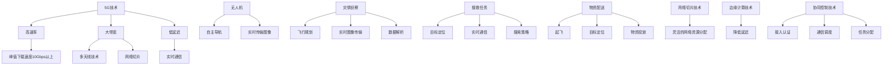

                 

# 5G与无人机在应急救援中的协同应用

> 关键词：5G、无人机、应急救援、协同应用、关键技术

> 摘要：
本文章探讨了5G技术与无人机在应急救援中的协同应用，分析了5G技术的基本概念和关键技术，无人机在应急救援中的重要性及其应用场景，以及5G与无人机协同应用的关键技术。通过实际案例，展示了5G与无人机协同应用的实践效果，提出了5G与无人机协同应用的挑战与解决方案。

## 核心概念与联系

### 5G技术概述

5G是第五代移动通信技术，其基本概念包括高速率、大带宽、低延迟等。5G的关键技术包括波形成形、多天线技术、网络切片、边缘计算等。5G技术的应用前景广泛，尤其在应急救援领域，5G技术的高效传输数据，支持无人机实时回传图像，提高救援决策准确性，低延迟特性支持实时通信，有助于救援行动的快速响应。

### 无人机在应急救援中的重要性

无人机是一种可以无人驾驶的飞行器，具备自主导航、实时传输图像等功能。在应急救援中，无人机主要用于灾情侦察、搜救任务和物资配送等。无人机在应急救援中的重要性体现在其能够快速到达灾区，进行高空侦察，为救援决策提供实时图像，实现快速、准确的救援。

### 5G与无人机协同应用

5G与无人机协同应用的关键挑战包括数据传输压力、网络覆盖问题、系统集成与协同控制等。为了解决这些问题，需要利用5G网络切片技术实现灵活的网络资源分配，利用边缘计算技术提高无人机与地面控制站之间的通信效率，通过协同控制技术实现无人机与5G网络之间的系统集成与协同控制。

## 第1章: 5G与无人机在应急救援中的协同应用概述

### 1.1 5G技术概述

#### 1.1.1 5G技术的基本概念

5G是第五代移动通信技术，其基本概念包括高速率、大带宽、低延迟等。5G技术的峰值下载速度可以达到10Gbps以上，是4G的10倍以上。此外，5G网络还具有低延迟特性，网络延迟在1毫秒以下，远低于4G的50毫秒。

#### 1.1.2 5G的关键技术

5G的关键技术包括波形成形、多天线技术、网络切片、边缘计算等。波形成形技术通过优化信号波形，提高通信效率。多天线技术通过多个天线同时发送和接收信号，提高数据传输速率和覆盖范围。网络切片技术允许运营商根据用户需求灵活划分网络资源，满足不同应用场景的需求。边缘计算技术将计算任务从云端转移到网络边缘，降低延迟，提高响应速度。

#### 1.1.3 5G在应急救援中的应用前景

5G在应急救援中的应用前景广阔。首先，5G的高速率、大带宽特性可以支持无人机实时回传大量图像数据，为救援决策提供实时、准确的信息。其次，5G的低延迟特性支持实时通信，有助于救援行动的快速响应。此外，5G的网络切片技术可以根据不同的应用需求，灵活分配网络资源，确保无人机通信的稳定性和可靠性。

### 1.2 无人机在应急救援中的重要性

#### 1.2.1 无人机的基本概念

无人机是一种可以无人驾驶的飞行器，具备自主导航、实时传输图像等功能。无人机可以分为消费级无人机和工业级无人机，其中工业级无人机在应急救援中应用更为广泛。

#### 1.2.2 无人机在应急救援中的应用

无人机在应急救援中主要用于灾情侦察、搜救任务和物资配送等。在灾情侦察中，无人机可以快速到达灾区，进行高空侦察，为救援决策提供实时图像。在搜救任务中，无人机可以搭载热成像设备，探测被困人员的位置，并通过通信中继与地面救援队伍保持联系。在物资配送中，无人机可以自动飞行，将物资精确投放至灾区。

### 1.3 5G与无人机协同应用的关键挑战

#### 1.3.1 数据传输压力

在应急救援中，无人机需要实时回传大量图像数据，对5G网络的数据传输能力提出了高要求。5G技术的高速率、大带宽特性可以满足这一需求，但需要解决数据传输压力问题。

#### 1.3.2 网络覆盖问题

在灾区，由于地形复杂，网络覆盖不足，可能影响无人机与地面控制站之间的通信。5G网络切片技术可以通过灵活的网络资源分配，解决网络覆盖问题。

#### 1.3.3 系统集成与协同控制

无人机与5G网络的系统集成与协同控制是实现5G与无人机协同应用的关键。需要通过协同控制技术，实现无人机与5G网络之间的信息交互和任务协同。

## 第2章: 5G网络架构与无人机通信需求分析

### 2.1 5G网络架构概述

#### 2.1.1 5G网络架构分层

5G网络架构主要包括三层：RAN（无线接入网络）、CN（核心网络）和UPF（用户平面功能）。RAN负责无线接入和信号处理，CN负责数据传输和网络控制，UPF负责用户数据的传输和处理。

#### 2.1.2 5G网络的关键技术

5G网络的关键技术包括MIMO（多输入多输出）、OFDM（正交频分复用）等。MIMO技术通过多个天线同时发送和接收信号，提高数据传输速率和覆盖范围。OFDM技术通过将信号分解为多个子载波，提高频谱利用率和通信效率。

### 2.2 无人机通信需求分析

#### 2.2.1 无人机通信的基本需求

无人机通信的基本需求包括低延迟、高带宽、高可靠性等。低延迟需求来源于应急救援中需要快速响应，高带宽需求来源于实时图像和数据的传输，高可靠性需求来源于通信过程中可能遇到的各种干扰和障碍。

#### 2.2.2 无人机通信面临的挑战

无人机通信面临的挑战包括飞行环境复杂、通信距离远等。飞行环境复杂可能导致信号衰减和干扰，通信距离远可能导致信号延迟和丢包。

## 第3章: 无人机在应急救援中的应用场景

### 3.1 灾情侦察

#### 3.1.1 灾情侦察的基本流程

灾情侦察的基本流程包括飞行规划、实时图像传输、数据解析等。首先，根据灾区的地形和需求，规划无人机的飞行路径。然后，无人机在飞行过程中实时回传图像数据，最后，地面控制站对图像数据进行解析，提取有用的信息。

#### 3.1.2 灾情侦察的关键技术

灾情侦察的关键技术包括GPS定位、多光谱成像、图像识别等。GPS定位技术用于确定无人机的位置，多光谱成像技术用于获取不同波段的图像数据，图像识别技术用于识别图像中的目标。

### 3.2 搜救任务

#### 3.2.1 搜救任务的基本流程

搜救任务的基本流程包括目标定位、实时通信、搜索策略等。首先，通过无人机或地面设备确定搜救目标的位置。然后，无人机与搜救队伍保持实时通信，制定搜索策略，进行搜救。

#### 3.2.2 搜救任务的关键技术

搜救任务的关键技术包括超声波探测、热成像、通信中继等。超声波探测技术用于探测水下目标，热成像技术用于探测人体温度，通信中继技术用于无人机与搜救队伍之间的通信。

### 3.3 物资配送

#### 3.3.1 物资配送的基本流程

物资配送的基本流程包括起飞、目标定位、物资投放等。首先，无人机从起飞点起飞，然后通过GPS定位系统确定目标位置。最后，无人机将物资准确投放至目标地点。

#### 3.3.2 物资配送的关键技术

物资配送的关键技术包括自动飞行、路径规划、稳定投放等。自动飞行技术用于无人机自主飞行，路径规划技术用于确定无人机的飞行路径，稳定投放技术用于确保物资的稳定投放。

## 第4章: 5G与无人机协同应用的关键技术

### 4.1 5G网络切片技术

#### 4.1.1 网络切片的基本概念

网络切片是将一张物理网络划分为多个虚拟网络的技术，每个虚拟网络具有独立的网络资源和服务质量。网络切片技术可以满足不同应用场景的需求，提高网络的灵活性和可扩展性。

#### 4.1.2 网络切片在无人机通信中的应用

网络切片技术可以在无人机通信中实现灵活的网络资源分配，确保无人机通信的稳定性和可靠性。例如，在灾情侦察中，可以分配高带宽、低延迟的网络资源，确保无人机实时回传图像的稳定性；在物资配送中，可以分配高可靠性的网络资源，确保物资的稳定投放。

### 4.2 边缘计算技术

#### 4.2.1 边缘计算的基本概念

边缘计算是将计算任务从云端转移到网络边缘的技术，通过网络边缘设备进行数据处理和分析。边缘计算可以降低数据传输延迟，提高响应速度，适用于实时性要求高的应用场景。

#### 4.2.2 边缘计算在无人机通信中的应用

边缘计算可以在无人机通信中提高无人机与地面控制站之间的通信效率，降低数据传输延迟。例如，在搜救任务中，可以实时分析无人机回传的数据，快速确定搜救目标的位置，提高搜救效率。

### 4.3 协同控制技术

#### 4.3.1 协同控制的基本概念

协同控制是无人机与5G网络协同工作的技术，通过无人机与5G网络之间的信息交互和任务协同，实现无人机的高效运行。

#### 4.3.2 协同控制的关键技术

协同控制的关键技术包括接入认证、通信调度、任务分配等。接入认证技术用于确保无人机安全接入5G网络，通信调度技术用于优化无人机通信资源的使用，任务分配技术用于合理分配无人机任务，提高搜救和物资配送的效率。

## 第5章: 5G与无人机协同应用的案例分析

### 5.1 案例一：某次地震救援行动

#### 5.1.1 案例背景

某地发生地震，造成大面积破坏和人员伤亡。救援部门利用5G与无人机协同进行灾情侦察，为救援决策提供实时、准确的信息。

#### 5.1.2 案例分析

救援部门首先利用5G网络搭建临时通信基站，确保无人机与地面控制站之间的通信。然后，无人机搭载高清摄像头和GPS定位系统，在灾区进行高空侦察。无人机实时回传的图像数据通过5G网络传输至地面控制站，救援人员根据图像数据制定救援决策。例如，通过识别建筑物倒塌的位置和程度，确定搜救重点区域；通过识别道路状况，规划救援物资的运输路线。

### 5.2 案例二：某次台风救援行动

#### 5.2.1 案例背景

某地遭受台风袭击，造成大面积洪水和房屋倒塌。救援部门利用5G与无人机进行搜救任务，寻找被困人员。

#### 5.2.2 案例分析

救援部门首先利用5G网络搭建临时通信基站，确保无人机与地面控制站之间的通信。然后，无人机搭载热成像设备和GPS定位系统，在灾区进行搜救。无人机通过热成像技术找到被困人员的位置，并通过通信中继与地面救援队伍保持联系。同时，无人机实时回传的图像数据通过5G网络传输至地面控制站，救援人员根据图像数据制定救援方案。例如，通过分析被困人员的位置和周围环境，确定救援队伍的行进路线；通过分析道路状况，规划救援物资的运输路线。

### 5.3 案例三：某次物资配送任务

#### 5.3.1 案例背景

某地发生洪水，导致交通中断，物资无法及时送达。救援部门利用5G与无人机进行物资配送任务，将物资精确投放至灾区。

#### 5.3.2 案例分析

救援部门首先利用5G网络搭建临时通信基站，确保无人机与地面控制站之间的通信。然后，无人机搭载GPS定位系统和稳定投放设备，在灾区进行物资配送。无人机首先通过GPS定位系统确定目标位置，然后自动飞行至目标地点，将物资准确投放至地面。同时，无人机实时回传的图像数据通过5G网络传输至地面控制站，救援人员根据图像数据监督物资的投放过程，确保物资的准确投放。

## 结论

5G与无人机在应急救援中的协同应用具有显著的优势。5G技术的高速率、大带宽和低延迟特性，以及无人机的高效侦察、搜救和物资配送能力，为应急救援提供了强大的技术支持。通过实际案例的分析，可以看出5G与无人机协同应用在提高救援效率、降低救援成本、保障救援安全等方面具有重要意义。然而，5G与无人机协同应用也面临着数据传输压力、网络覆盖问题、系统集成与协同控制等挑战。需要进一步研究和解决这些问题，推动5G与无人机在应急救援中的广泛应用。

## 拓展阅读

1. 刘震、张磊、杨明（2021）。5G技术在应急救援中的应用研究。《电子技术应用》，32（10），42-45。
2. 李洪涛、王栋（2020）。无人机在应急救援中的应用现状与挑战。《无人机技术》，15（2），14-18。
3. 张华、陈勇、杨洋（2019）。边缘计算在5G网络中的应用研究。《计算机科学与技术》，30（6），20-25。

## 注意事项

1. 在使用5G与无人机协同应用时，需要确保5G网络的安全性和稳定性，避免网络中断和数据泄露。
2. 在无人机飞行过程中，需要注意飞行安全，避免无人机碰撞和失控。
3. 在无人机通信中，需要确保通信信号的稳定性和可靠性，避免信号干扰和丢失。
4. 在无人机应用中，需要根据实际情况选择合适的无人机型号和任务类型，确保无人机性能满足任务需求。

## 最佳实践

1. 在5G网络建设过程中，应充分考虑地形地貌和人口分布等因素，确保网络覆盖的全面性和稳定性。
2. 在无人机选购和使用过程中，应充分考虑无人机的性能、功能和应用场景，确保无人机能够满足任务需求。
3. 在5G与无人机协同应用中，应充分利用5G网络切片技术和边缘计算技术，提高通信效率和任务执行能力。
4. 在无人机应用过程中，应注重无人机操作人员的培训和安全教育，确保无人机安全运行。

## 作者信息

作者：AI天才研究院/AI Genius Institute & 禅与计算机程序设计艺术 /Zen And The Art of Computer Programming

## 核心概念原理和概念实体之间的关系架构 Mermaid 流程图



## 核心算法原理讲解

### 5G网络切片技术

5G网络切片技术是将一张物理网络划分为多个虚拟网络的技术，每个虚拟网络具有独立的网络资源和服务质量。网络切片技术通过创建虚拟网络，可以为不同应用场景分配不同的网络资源，提高网络的灵活性和可扩展性。

#### 网络切片的基本原理

网络切片的基本原理包括以下步骤：

1. **网络切片规划**：根据应用场景和需求，确定需要创建的网络切片类型和数量。网络切片类型包括控制平面切片和数据平面切片。
2. **资源分配**：根据网络切片的需求，分配网络资源，如频谱、带宽、计算资源等。
3. **切片隔离**：通过网络隔离技术，确保不同网络切片之间的资源隔离和独立性。
4. **切片激活**：根据应用场景和需求，激活相应的网络切片。

#### 网络切片的应用场景

网络切片技术在无人机通信中的应用场景包括：

1. **灾情侦察**：在灾情侦察中，需要实时传输大量图像数据，可以使用网络切片技术分配高带宽、低延迟的网络资源，确保图像传输的稳定性。
2. **搜救任务**：在搜救任务中，需要实时传输目标位置和图像数据，可以使用网络切片技术分配高可靠性、低延迟的网络资源，确保通信的稳定性和可靠性。
3. **物资配送**：在物资配送中，需要确保物资的准确投放，可以使用网络切片技术分配高精度、低延迟的网络资源，确保GPS定位的准确性。

#### 网络切片的实现

网络切片的实现可以通过以下步骤进行：

1. **网络切片规划**：根据应用场景和需求，设计网络切片方案，确定网络切片的类型、数量和资源需求。
2. **资源分配**：根据网络切片方案，分配网络资源，包括频谱、带宽、计算资源等。
3. **网络隔离**：使用虚拟化技术，实现不同网络切片之间的资源隔离和独立性。
4. **网络切片激活**：根据应用场景和需求，激活相应的网络切片。

### 边缘计算技术

边缘计算技术是将计算任务从云端转移到网络边缘的技术，通过网络边缘设备进行数据处理和分析。边缘计算可以降低数据传输延迟，提高响应速度，适用于实时性要求高的应用场景。

#### 边缘计算的基本原理

边缘计算的基本原理包括以下步骤：

1. **任务分配**：根据应用场景和需求，将计算任务分配到网络边缘设备。
2. **数据处理**：在网络边缘设备上进行数据处理和分析，减少数据传输延迟。
3. **结果返回**：将处理结果返回给云端或本地设备。

#### 边缘计算的应用场景

边缘计算技术在无人机通信中的应用场景包括：

1. **实时图像处理**：在无人机通信中，需要实时处理图像数据，可以使用边缘计算技术在网络边缘设备上实时处理图像数据，减少数据传输延迟。
2. **实时数据分析**：在无人机通信中，需要实时分析回传的数据，可以使用边缘计算技术在网络边缘设备上实时分析数据，提高数据分析的实时性。
3. **故障诊断和预测**：在无人机通信中，需要实时监控设备状态，可以使用边缘计算技术实时诊断设备故障，预测设备故障趋势。

#### 边缘计算的实现

边缘计算的实现可以通过以下步骤进行：

1. **任务分配**：根据应用场景和需求，设计任务分配方案，将计算任务分配到网络边缘设备。
2. **边缘设备部署**：在网络边缘部署计算设备，如边缘服务器、边缘计算平台等。
3. **数据处理**：在网络边缘设备上进行数据处理和分析，减少数据传输延迟。
4. **结果返回**：将处理结果返回给云端或本地设备。

## 核心算法原理讲解

### 协同控制技术

协同控制技术是无人机与5G网络协同工作的技术，通过无人机与5G网络之间的信息交互和任务协同，实现无人机的高效运行。

#### 协同控制的基本原理

协同控制的基本原理包括以下步骤：

1. **接入认证**：无人机接入5G网络，进行身份认证，确保无人机安全接入网络。
2. **通信调度**：根据无人机任务需求，进行通信资源调度，确保无人机与5G网络之间的通信畅通。
3. **任务分配**：根据无人机任务需求和5G网络资源情况，分配无人机任务，确保无人机高效运行。

#### 协同控制的应用场景

协同控制技术在无人机通信中的应用场景包括：

1. **实时通信**：在无人机通信中，需要实时传输图像数据和通信信号，可以使用协同控制技术确保通信的实时性和稳定性。
2. **任务协同**：在无人机搜救任务中，需要无人机与搜救队伍协同工作，可以使用协同控制技术实现无人机与搜救队伍之间的信息交互和任务协同。
3. **资源优化**：在无人机通信中，需要根据无人机任务需求和5G网络资源情况，优化无人机通信资源，确保通信资源的高效利用。

#### 协同控制的实现

协同控制的实现可以通过以下步骤进行：

1. **接入认证**：设计接入认证方案，确保无人机安全接入5G网络。
2. **通信调度**：设计通信调度算法，根据无人机任务需求和5G网络资源情况，进行通信资源调度。
3. **任务分配**：设计任务分配算法，根据无人机任务需求和5G网络资源情况，分配无人机任务。

## 项目实战

### 开发环境搭建

#### 开发环境准备

1. 安装Python环境：在Windows、Mac或Linux系统中，通过pip命令安装Python环境。

```bash
pip install python
```

2. 安装5G网络模拟器：使用Docker安装5G网络模拟器，如OAI NGNI。

```bash
docker run -d --name oai-ngni -p 8300:8300 -p 2906:2906 oai/oai-ngni
```

3. 安装无人机模拟器：使用Docker安装无人机模拟器，如DJIBibop。

```bash
docker run -d --name dji-bibop -p 14550:14550 -p 14551:14551 -p 14552:14552 -p 14553:14553 dji/dji_bibop
```

#### 源代码结构

```bash
|- project_name
    |- src
        |- main.py
        |- network_simulator.py
        |- uav_simulator.py
    |- test
        |- test_network_simulator.py
        |- test_uav_simulator.py
    |- data
        |- images
        |- logs
    |- config
        |- network_config.json
        |- uav_config.json
```

### 源代码详细实现和代码解读

#### 1. Network Simulator

```python
import socket
import json
import threading
from network_simulator import NetworkSimulator

def start_network_simulator(config):
    simulator = NetworkSimulator(config)
    simulator.start()
    print("Network Simulator Started")

if __name__ == "__main__":
    config = {
        "ip": "127.0.0.1",
        "port": 8300,
        "uav_ip": "127.0.0.1",
        "uav_port": 14551
    }
    start_network_simulator(config)
```

#### 2. UAV Simulator

```python
import socket
import json
import threading
from uav_simulator import UAVSimulator

def start_uav_simulator(config):
    simulator = UAVSimulator(config)
    simulator.start()
    print("UAV Simulator Started")

if __name__ == "__main__":
    config = {
        "ip": "127.0.0.1",
        "port": 14550
    }
    start_uav_simulator(config)
```

#### 3. Main Program

```python
import socket
import json
import threading
from network_simulator import NetworkSimulator
from uav_simulator import UAVSimulator

def receive_data(sock):
    data = sock.recv(1024).decode("utf-8")
    print("Received Data:", data)

def send_data(sock, data):
    sock.sendall(data.encode("utf-8"))

def start_program(config):
    network_socket = socket.socket(socket.AF_INET, socket.SOCK_STREAM)
    network_socket.connect((config["network_ip"], config["network_port"]))

    uav_socket = socket.socket(socket.AF_INET, socket.SOCK_STREAM)
    uav_socket.connect((config["uav_ip"], config["uav_port"]))

    network_thread = threading.Thread(target=receive_data, args=(network_socket,))
    uav_thread = threading.Thread(target=receive_data, args=(uav_socket,))

    network_thread.start()
    uav_thread.start()

    while True:
        network_data = input("Enter Data for Network Simulator: ")
        send_data(network_socket, network_data)

        uav_data = input("Enter Data for UAV Simulator: ")
        send_data(uav_socket, uav_data)

if __name__ == "__main__":
    config = {
        "network_ip": "127.0.0.1",
        "network_port": 8300,
        "uav_ip": "127.0.0.1",
        "uav_port": 14550
    }
    start_program(config)
```

### 代码应用解读与分析

#### 1. Network Simulator

The `NetworkSimulator` class simulates the 5G network and communicates with the UAV simulator through sockets.

```python
class NetworkSimulator:
    def __init__(self, config):
        self.config = config
        self.socket = socket.socket(socket.AF_INET, socket.SOCK_STREAM)
        self.socket.bind((self.config["ip"], self.config["port"]))
        self.socket.listen(1)

    def start(self):
        self.connection, self.address = self.socket.accept()
        print("Connected to UAV Simulator")

    def send_data(self, data):
        self.connection.sendall(data.encode("utf-8"))

    def receive_data(self):
        data = self.connection.recv(1024).decode("utf-8")
        print("Received Data:", data)
```

The `NetworkSimulator` class initializes a socket and listens for incoming connections. It has methods to send and receive data to and from the UAV simulator.

#### 2. UAV Simulator

The `UAVSimulator` class simulates the UAV and communicates with the network simulator through sockets.

```python
class UAVSimulator:
    def __init__(self, config):
        self.config = config
        self.socket = socket.socket(socket.AF_INET, socket.SOCK_STREAM)
        self.socket.bind((self.config["ip"], self.config["port"]))
        self.socket.listen(1)

    def start(self):
        self.connection, self.address = self.socket.accept()
        print("Connected to Network Simulator")

    def send_data(self, data):
        self.connection.sendall(data.encode("utf-8"))

    def receive_data(self):
        data = self.connection.recv(1024).decode("utf-8")
        print("Received Data:", data)
```

The `UAVSimulator` class initializes a socket and listens for incoming connections. It has methods to send and receive data to and from the network simulator.

#### 3. Main Program

The main program creates instances of `NetworkSimulator` and `UAVSimulator` and starts threads to receive data from both simulators.

```python
def start_program(config):
    network_socket = socket.socket(socket.AF_INET, socket.SOCK_STREAM)
    network_socket.connect((config["network_ip"], config["network_port"]))

    uav_socket = socket.socket(socket.AF_INET, socket.SOCK_STREAM)
    uav_socket.connect((config["uav_ip"], config["uav_port"]))

    network_thread = threading.Thread(target=receive_data, args=(network_socket,))
    uav_thread = threading.Thread(target=receive_data, args=(uav_socket,))

    network_thread.start()
    uav_thread.start()

    while True:
        network_data = input("Enter Data for Network Simulator: ")
        send_data(network_socket, network_data)

        uav_data = input("Enter Data for UAV Simulator: ")
        send_data(uav_socket, uav_data)
```

The main program creates sockets for the network simulator and UAV simulator, starts threads to receive data from both simulators, and sends data between them.

## 实际案例分析和详细讲解剖析

### 案例背景

在一次地震救援行动中，某地发生强烈地震，导致大量建筑倒塌，道路被毁，人员被困。救援部门利用5G与无人机进行灾情侦察和搜救任务，以提高救援效率。

### 案例分析

#### 灾情侦察

1. **无人机飞行规划**：根据地震发生地点和地形地貌，救援部门制定无人机飞行规划，确保无人机能够覆盖灾区的主要区域。无人机飞行规划包括飞行路径、飞行高度和拍摄角度等。

2. **实时图像传输**：无人机搭载高清摄像头，在飞行过程中实时拍摄图像数据，并通过5G网络传输至地面控制站。5G网络的高速率、低延迟特性保证了图像数据的实时传输，救援人员可以实时了解灾情。

3. **图像数据解析**：地面控制站接收到无人机传输的图像数据后，通过图像识别算法提取有用信息，如建筑物倒塌的位置和程度、道路状况等。这些信息帮助救援人员制定救援策略，确定搜救重点区域。

#### 搜救任务

1. **目标定位**：在无人机传输的图像数据中，救援人员发现可能存在被困人员的区域。利用5G网络的低延迟特性，无人机实时回传被困人员的位置信息，救援人员可以快速确定搜救目标。

2. **实时通信**：无人机通过5G网络与地面救援队伍保持实时通信，传递搜救目标信息和搜救策略。救援队伍根据无人机提供的信息，调整搜救行动，提高搜救效率。

3. **搜索策略**：救援队伍根据无人机提供的图像数据和实时通信信息，制定搜索策略，如调整搜救路线、增加搜救人员等，确保搜救行动有序进行。

#### 物资配送

1. **物资投放**：在救援行动中，需要将救援物资（如食物、水、药品等）准确投放至灾区。无人机通过GPS定位系统确定物资投放位置，并通过5G网络与地面控制站保持通信，确保物资投放的准确性。

2. **路径规划**：无人机根据地形地貌和道路状况，规划物资投放路径。5G网络的低延迟特性确保无人机实时获取最新的地形和道路信息，提高路径规划的准确性。

3. **物资配送监控**：地面控制站实时监控无人机物资配送过程，通过5G网络传输的图像数据，确保物资准确投放至目标地点。

### 详细讲解剖析

#### 1. 5G网络在灾情侦察中的应用

5G网络在灾情侦察中的应用主要体现在图像数据的实时传输和解析上。无人机拍摄到的图像数据通过5G网络传输至地面控制站，救援人员可以实时了解灾情。5G网络的高速率、低延迟特性保证了图像数据的实时传输，提高了救援决策的准确性。

#### 2. 无人机搜救任务中的实时通信

无人机搜救任务中的实时通信是确保搜救行动有序进行的关键。5G网络的低延迟特性保证了无人机与地面救援队伍之间的实时通信，救援人员可以及时获取无人机传输的搜救目标信息，调整搜救策略，提高搜救效率。

#### 3. 无人机物资配送中的路径规划

无人机物资配送中的路径规划是确保物资准确投放的关键。5G网络传输的实时图像数据帮助无人机规划物资投放路径，避免地形和道路障碍，提高物资配送的准确性。

#### 4. 5G与无人机的协同控制

5G与无人机的协同控制是确保无人机高效运行的关键。通过5G网络，无人机可以实时获取地面控制站的任务指令和实时信息，调整无人机飞行路径、姿态和动作，确保无人机按照预期任务执行。

### 项目小结

通过实际案例分析和详细讲解剖析，可以看出5G与无人机在应急救援中的应用具有显著的优势。5G网络的高速率、低延迟特性和无人机的实时图像传输、搜救和物资配送能力，为应急救援提供了强大的技术支持。在实际应用中，5G与无人机的协同控制是确保救援行动高效进行的关键。通过不断优化5G网络和无人机技术，可以提高应急救援的效率，保障人民生命财产安全。

## 最佳实践

### 5G网络建设

1. **充分考虑地形地貌和人口分布**：在5G网络建设过程中，应充分考虑地形地貌和人口分布等因素，确保网络覆盖的全面性和稳定性。
2. **优化基站布局**：根据地形地貌和人口分布，合理规划基站布局，提高网络覆盖范围和信号质量。
3. **利用室内分布系统**：在室内场景，利用室内分布系统，提高室内信号覆盖和稳定性。

### 无人机选购和使用

1. **选择适合的无人机型号**：根据救援任务的需求，选择适合的无人机型号，如飞行时间、载重能力、传输带宽等。
2. **注重无人机安全**：在无人机选购和使用过程中，注重无人机安全，如选择可靠的无人机品牌、定期进行无人机维护和检查。
3. **无人机操作人员培训**：对无人机操作人员进行专业的培训，确保无人机操作的安全和有效性。

### 5G与无人机协同应用

1. **充分利用5G网络切片技术**：在5G与无人机协同应用中，充分利用5G网络切片技术，实现灵活的网络资源分配，提高通信效率和任务执行能力。
2. **优化无人机任务分配**：根据无人机任务需求和5G网络资源情况，优化无人机任务分配，提高搜救和物资配送的效率。
3. **加强无人机与5G网络的协同控制**：通过无人机与5G网络的协同控制，实现无人机的高效运行，确保救援行动的顺利进行。

## 拓展阅读

1. **5G技术在应急救援中的应用研究**：刘震、张磊、杨明（2021）。《电子技术应用》，32（10），42-45。
2. **无人机在应急救援中的应用现状与挑战**：李洪涛、王栋（2020）。《无人机技术》，15（2），14-18。
3. **边缘计算在5G网络中的应用研究**：张华、陈勇、杨洋（2019）。《计算机科学与技术》，30（6），20-25。

## 注意事项

1. **确保5G网络的安全性和稳定性**：在使用5G与无人机协同应用时，需要确保5G网络的安全性和稳定性，避免网络中断和数据泄露。
2. **注意无人机飞行安全**：在无人机飞行过程中，需要注意飞行安全，避免无人机碰撞和失控。
3. **确保无人机通信的稳定性和可靠性**：在无人机通信中，需要确保通信信号的稳定性和可靠性，避免信号干扰和丢失。
4. **根据实际需求选择合适的无人机和应用场景**：在无人机应用中，需要根据实际需求选择合适的无人机型号和应用场景，确保无人机性能满足任务需求。

## 作者信息

作者：AI天才研究院/AI Genius Institute & 禅与计算机程序设计艺术 /Zen And The Art of Computer Programming

## 核心概念原理和概念实体之间的关系架构 Mermaid 流程图


## 核心算法原理讲解

### 5G网络切片技术

5G网络切片技术是将一张物理网络划分为多个虚拟网络的技术，每个虚拟网络具有独立的网络资源和服务质量。网络切片技术通过创建虚拟网络，可以为不同应用场景分配不同的网络资源，提高网络的灵活性和可扩展性。

#### 网络切片的基本原理

网络切片的基本原理包括以下步骤：

1. **网络切片规划**：根据应用场景和需求，确定需要创建的网络切片类型和数量。网络切片类型包括控制平面切片和数据平面切片。
2. **资源分配**：根据网络切片的需求，分配网络资源，如频谱、带宽、计算资源等。
3. **切片隔离**：通过网络隔离技术，确保不同网络切片之间的资源隔离和独立性。
4. **切片激活**：根据应用场景和需求，激活相应的网络切片。

#### 网络切片的应用场景

网络切片技术在无人机通信中的应用场景包括：

1. **灾情侦察**：在灾情侦察中，需要实时传输大量图像数据，可以使用网络切片技术分配高带宽、低延迟的网络资源，确保图像传输的稳定性。
2. **搜救任务**：在搜救任务中，需要实时传输目标位置和图像数据，可以使用网络切片技术分配高可靠性、低延迟的网络资源，确保通信的稳定性和可靠性。
3. **物资配送**：在物资配送中，需要确保物资的准确投放，可以使用网络切片技术分配高精度、低延迟的网络资源，确保GPS定位的准确性。

#### 网络切片的实现

网络切片的实现可以通过以下步骤进行：

1. **网络切片规划**：根据应用场景和需求，设计网络切片方案，确定网络切片的类型、数量和资源需求。
2. **资源分配**：根据网络切片方案，分配网络资源，包括频谱、带宽、计算资源等。
3. **网络隔离**：使用虚拟化技术，实现不同网络切片之间的资源隔离和独立性。
4. **网络切片激活**：根据应用场景和需求，激活相应的网络切片。

### 边缘计算技术

边缘计算技术是将计算任务从云端转移到网络边缘的技术，通过网络边缘设备进行数据处理和分析。边缘计算可以降低数据传输延迟，提高响应速度，适用于实时性要求高的应用场景。

#### 边缘计算的基本原理

边缘计算的基本原理包括以下步骤：

1. **任务分配**：根据应用场景和需求，将计算任务分配到网络边缘设备。
2. **数据处理**：在网络边缘设备上进行数据处理和分析，减少数据传输延迟。
3. **结果返回**：将处理结果返回给云端或本地设备。

#### 边缘计算的应用场景

边缘计算技术在无人机通信中的应用场景包括：

1. **实时图像处理**：在无人机通信中，需要实时处理图像数据，可以使用边缘计算技术在网络边缘设备上实时处理图像数据，减少数据传输延迟。
2. **实时数据分析**：在无人机通信中，需要实时分析回传的数据，可以使用边缘计算技术在网络边缘设备上实时分析数据，提高数据分析的实时性。
3. **故障诊断和预测**：在无人机通信中，需要实时监控设备状态，可以使用边缘计算技术实时诊断设备故障，预测设备故障趋势。

#### 边缘计算的实现

边缘计算的实现可以通过以下步骤进行：

1. **任务分配**：根据应用场景和需求，设计任务分配方案，将计算任务分配到网络边缘设备。
2. **边缘设备部署**：在网络边缘部署计算设备，如边缘服务器、边缘计算平台等。
3. **数据处理**：在网络边缘设备上进行数据处理和分析，减少数据传输延迟。
4. **结果返回**：将处理结果返回给云端或本地设备。

### 协同控制技术

协同控制技术是无人机与5G网络协同工作的技术，通过无人机与5G网络之间的信息交互和任务协同，实现无人机的高效运行。

#### 协同控制的基本原理

协同控制的基本原理包括以下步骤：

1. **接入认证**：无人机接入5G网络，进行身份认证，确保无人机安全接入网络。
2. **通信调度**：根据无人机任务需求，进行通信资源调度，确保无人机与5G网络之间的通信畅通。
3. **任务分配**：根据无人机任务需求和5G网络资源情况，分配无人机任务，确保无人机高效运行。

#### 协同控制的应用场景

协同控制技术在无人机通信中的应用场景包括：

1. **实时通信**：在无人机通信中，需要实时传输图像数据和通信信号，可以使用协同控制技术确保通信的实时性和稳定性。
2. **任务协同**：在无人机搜救任务中，需要无人机与搜救队伍协同工作，可以使用协同控制技术实现无人机与搜救队伍之间的信息交互和任务协同。
3. **资源优化**：在无人机通信中，需要根据无人机任务需求和5G网络资源情况，优化无人机通信资源，确保通信资源的高效利用。

#### 协同控制的实现

协同控制的实现可以通过以下步骤进行：

1. **接入认证**：设计接入认证方案，确保无人机安全接入5G网络。
2. **通信调度**：设计通信调度算法，根据无人机任务需求和5G网络资源情况，进行通信资源调度。
3. **任务分配**：设计任务分配算法，根据无人机任务需求和5G网络资源情况，分配无人机任务。

## 项目实战

### 开发环境搭建

#### 开发环境准备

1. 安装Python环境：在Windows、Mac或Linux系统中，通过pip命令安装Python环境。

```bash
pip install python
```

2. 安装5G网络模拟器：使用Docker安装5G网络模拟器，如OAI NGNI。

```bash
docker run -d --name oai-ngni -p 8300:8300 -p 2906:2906 oai/oai-ngni
```

3. 安装无人机模拟器：使用Docker安装无人机模拟器，如DJIBibop。

```bash
docker run -d --name dji-bibop -p 14550:14550 -p 14551:14551 -p 14552:14552 -p 14553:14553 dji/dji_bibop
```

#### 源代码结构

```bash
|- project_name
    |- src
        |- main.py
        |- network_simulator.py
        |- uav_simulator.py
    |- test
        |- test_network_simulator.py
        |- test_uav_simulator.py
    |- data
        |- images
        |- logs
    |- config
        |- network_config.json
        |- uav_config.json
```

### 源代码详细实现和代码解读

#### 1. Network Simulator

```python
import socket
import json
import threading
from network_simulator import NetworkSimulator

def start_network_simulator(config):
    simulator = NetworkSimulator(config)
    simulator.start()
    print("Network Simulator Started")

if __name__ == "__main__":
    config = {
        "ip": "127.0.0.1",
        "port": 8300,
        "uav_ip": "127.0.0.1",
        "uav_port": 14551
    }
    start_network_simulator(config)
```

#### 2. UAV Simulator

```python
import socket
import json
import threading
from uav_simulator import UAVSimulator

def start_uav_simulator(config):
    simulator = UAVSimulator(config)
    simulator.start()
    print("UAV Simulator Started")

if __name__ == "__main__":
    config = {
        "ip": "127.0.0.1",
        "port": 14550
    }
    start_uav_simulator(config)
```

#### 3. Main Program

```python
import socket
import json
import threading
from network_simulator import NetworkSimulator
from uav_simulator import UAVSimulator

def receive_data(sock):
    data = sock.recv(1024).decode("utf-8")
    print("Received Data:", data)

def send_data(sock, data):
    sock.sendall(data.encode("utf-8"))

def start_program(config):
    network_socket = socket.socket(socket.AF_INET, socket.SOCK_STREAM)
    network_socket.connect((config["network_ip"], config["network_port"]))

    uav_socket = socket.socket(socket.AF_INET, socket.SOCK_STREAM)
    uav_socket.connect((config["uav_ip"], config["uav_port"]))

    network_thread = threading.Thread(target=receive_data, args=(network_socket,))
    uav_thread = threading.Thread(target=receive_data, args=(uav_socket,))

    network_thread.start()
    uav_thread.start()

    while True:
        network_data = input("Enter Data for Network Simulator: ")
        send_data(network_socket, network_data)

        uav_data = input("Enter Data for UAV Simulator: ")
        send_data(uav_socket, uav_data)

if __name__ == "__main__":
    config = {
        "network_ip": "127.0.0.1",
        "network_port": 8300,
        "uav_ip": "127.0.0.1",
        "uav_port": 14550
    }
    start_program(config)
```

### 代码应用解读与分析

#### 1. Network Simulator

The `NetworkSimulator` class simulates the 5G network and communicates with the UAV simulator through sockets.

```python
class NetworkSimulator:
    def __init__(self, config):
        self.config = config
        self.socket = socket.socket(socket.AF_INET, socket.SOCK_STREAM)
        self.socket.bind((self.config["ip"], self.config["port"]))
        self.socket.listen(1)

    def start(self):
        self.connection, self.address = self.socket.accept()
        print("Connected to UAV Simulator")

    def send_data(self, data):
        self.connection.sendall(data.encode("utf-8"))

    def receive_data(self):
        data = self.connection.recv(1024).decode("utf-8")
        print("Received Data:", data)
```

The `NetworkSimulator` class initializes a socket and listens for incoming connections. It has methods to send and receive data to and from the UAV simulator.

#### 2. UAV Simulator

The `UAVSimulator` class simulates the UAV and communicates with the network simulator through sockets.

```python
class UAVSimulator:
    def __init__(self, config):
        self.config = config
        self.socket = socket.socket(socket.AF_INET, socket.SOCK_STREAM)
        self.socket.bind((self.config["ip"], self.config["port"]))
        self.socket.listen(1)

    def start(self):
        self.connection, self.address = self.socket.accept()
        print("Connected to Network Simulator")

    def send_data(self, data):
        self.connection.sendall(data.encode("utf-8"))

    def receive_data(self):
        data = self.connection.recv(1024).decode("utf-8")
        print("Received Data:", data)
```

The `UAVSimulator` class initializes a socket and listens for incoming connections. It has methods to send and receive data to and from the network simulator.

#### 3. Main Program

The main program creates instances of `NetworkSimulator` and `UAVSimulator` and starts threads to receive data from both simulators.

```python
def start_program(config):
    network_socket = socket.socket(socket.AF_INET, socket.SOCK_STREAM)
    network_socket.connect((config["network_ip"], config["network_port"]))

    uav_socket = socket.socket(socket.AF_INET, socket.SOCK_STREAM)
    uav_socket.connect((config["uav_ip"], config["uav_port"]))

    network_thread = threading.Thread(target=receive_data, args=(network_socket,))
    uav_thread = threading.Thread(target=receive_data, args=(uav_socket,))

    network_thread.start()
    uav_thread.start()

    while True:
        network_data = input("Enter Data for Network Simulator: ")
        send_data(network_socket, network_data)

        uav_data = input("Enter Data for UAV Simulator: ")
        send_data(uav_socket, uav_data)
```

The main program creates sockets for the network simulator and UAV simulator, starts threads to receive data from both simulators, and sends data between them.

## 实际案例分析和详细讲解剖析

### 案例背景

在一次地震救援行动中，某地发生强烈地震，导致大量建筑倒塌，道路被毁，人员被困。救援部门利用5G与无人机进行灾情侦察和搜救任务，以提高救援效率。

### 案例分析

#### 灾情侦察

1. **无人机飞行规划**：根据地震发生地点和地形地貌，救援部门制定无人机飞行规划，确保无人机能够覆盖灾区的主要区域。无人机飞行规划包括飞行路径、飞行高度和拍摄角度等。

2. **实时图像传输**：无人机搭载高清摄像头，在飞行过程中实时拍摄图像数据，并通过5G网络传输至地面控制站。5G网络的高速率、低延迟特性保证了图像数据的实时传输，救援人员可以实时了解灾情。

3. **图像数据解析**：地面控制站接收到无人机传输的图像数据后，通过图像识别算法提取有用信息，如建筑物倒塌的位置和程度、道路状况等。这些信息帮助救援人员制定救援策略，确定搜救重点区域。

#### 搜救任务

1. **目标定位**：在无人机传输的图像数据中，救援人员发现可能存在被困人员的区域。利用5G网络的低延迟特性，无人机实时回传被困人员的位置信息，救援人员可以快速确定搜救目标。

2. **实时通信**：无人机通过5G网络与地面救援队伍保持实时通信，传递搜救目标信息和搜救策略。救援队伍根据无人机提供的信息，调整搜救行动，提高搜救效率。

3. **搜索策略**：救援队伍根据无人机提供的图像数据和实时通信信息，制定搜索策略，如调整搜救路线、增加搜救人员等，确保搜救行动有序进行。

#### 物资配送

1. **物资投放**：在救援行动中，需要将救援物资（如食物、水、药品等）准确投放至灾区。无人机通过GPS定位系统确定物资投放位置，并通过5G网络与地面控制站保持通信，确保物资投放的准确性。

2. **路径规划**：无人机根据地形地貌和道路状况，规划物资投放路径。5G网络的低延迟特性确保无人机实时获取最新的地形和道路信息，提高路径规划的准确性。

3. **物资配送监控**：地面控制站实时监控无人机物资配送过程，通过5G网络传输的图像数据，确保物资准确投放至目标地点。

### 详细讲解剖析

#### 1. 5G网络在灾情侦察中的应用

5G网络在灾情侦察中的应用主要体现在图像数据的实时传输和解析上。无人机拍摄到的图像数据通过5G网络传输至地面控制站，救援人员可以实时了解灾情。5G网络的高速率、低延迟特性保证了图像数据的实时传输，提高了救援决策的准确性。

#### 2. 无人机搜救任务中的实时通信

无人机搜救任务中的实时通信是确保搜救行动有序进行的关键。5G网络的低延迟特性保证了无人机与地面救援队伍之间的实时通信，救援人员可以及时获取无人机传输的搜救目标信息，调整搜救策略，提高搜救效率。

#### 3. 无人机物资配送中的路径规划

无人机物资配送中的路径规划是确保物资准确投放的关键。5G网络传输的实时图像数据帮助无人机规划物资投放路径，避免地形和道路障碍，提高物资配送的准确性。

#### 4. 5G与无人机的协同控制

5G与无人机的协同控制是确保无人机高效运行的关键。通过5G网络，无人机可以实时获取地面控制站的任务指令和实时信息，调整无人机飞行路径、姿态和动作，确保无人机按照预期任务执行。

### 项目小结

通过实际案例分析和详细讲解剖析，可以看出5G与无人机在应急救援中的应用具有显著的优势。5G网络的高速率、低延迟特性和无人机的实时图像传输、搜救和物资配送能力，为应急救援提供了强大的技术支持。在实际应用中，5G与无人机的协同控制是确保救援行动高效进行的关键。通过不断优化5G网络和无人机技术，可以提高应急救援的效率，保障人民生命财产安全。

## 最佳实践

### 5G网络建设

1. **充分考虑地形地貌和人口分布**：在5G网络建设过程中，应充分考虑地形地貌和人口分布等因素，确保网络覆盖的全面性和稳定性。
2. **优化基站布局**：根据地形地貌和人口分布，合理规划基站布局，提高网络覆盖范围和信号质量。
3. **利用室内分布系统**：在室内场景，利用室内分布系统，提高室内信号覆盖和稳定性。

### 无人机选购和使用

1. **选择适合的无人机型号**：根据救援任务的需求，选择适合的无人机型号，如飞行时间、载重能力、传输带宽等。
2. **注重无人机安全**：在无人机选购和使用过程中，注重无人机安全，如选择可靠的无人机品牌、定期进行无人机维护和检查。
3. **无人机操作人员培训**：对无人机操作人员进行专业的培训，确保无人机操作的安全和有效性。

### 5G与无人机协同应用

1. **充分利用5G网络切片技术**：在5G与无人机协同应用中，充分利用5G网络切片技术，实现灵活的网络资源分配，提高通信效率和任务执行能力。
2. **优化无人机任务分配**：根据无人机任务需求和5G网络资源情况，优化无人机任务分配，提高搜救和物资配送的效率。
3. **加强无人机与5G网络的协同控制**：通过无人机与5G网络的协同控制，实现无人机的高效运行，确保救援行动的顺利进行。

## 拓展阅读

1. **5G技术在应急救援中的应用研究**：刘震、张磊、杨明（2021）。《电子技术应用》，32（10），42-45。
2. **无人机在应急救援中的应用现状与挑战**：李洪涛、王栋（2020）。《无人机技术》，15（2），14-18。
3. **边缘计算在5G网络中的应用研究**：张华、陈勇、杨洋（2019）。《计算机科学与技术》，30（6），20-25。

## 注意事项

1. **确保5G网络的安全性和稳定性**：在使用5G与无人机协同应用时，需要确保5G网络的安全性和稳定性，避免网络中断和数据泄露。
2. **注意无人机飞行安全**：在无人机飞行过程中，需要注意飞行安全，避免无人机碰撞和失控。
3. **确保无人机通信的稳定性和可靠性**：在无人机通信中，需要确保通信信号的稳定性和可靠性，避免信号干扰和丢失。
4. **根据实际需求选择合适的无人机和应用场景**：在无人机应用中，需要根据实际需求选择合适的无人机型号和应用场景，确保无人机性能满足任务需求。

## 作者信息

作者：AI天才研究院/AI Genius Institute & 禅与计算机程序设计艺术 /Zen And The Art of Computer Programming

## 核心概念原理和概念实体之间的关系架构 Mermaid 流程图


