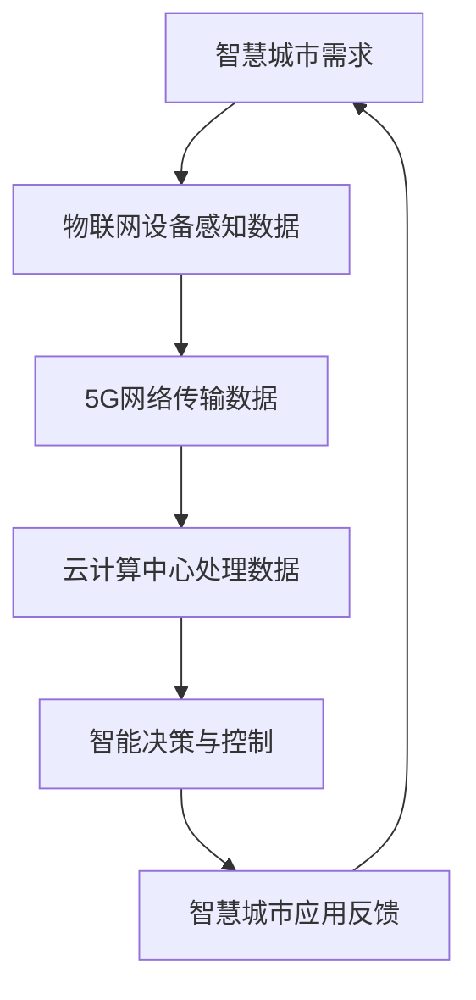
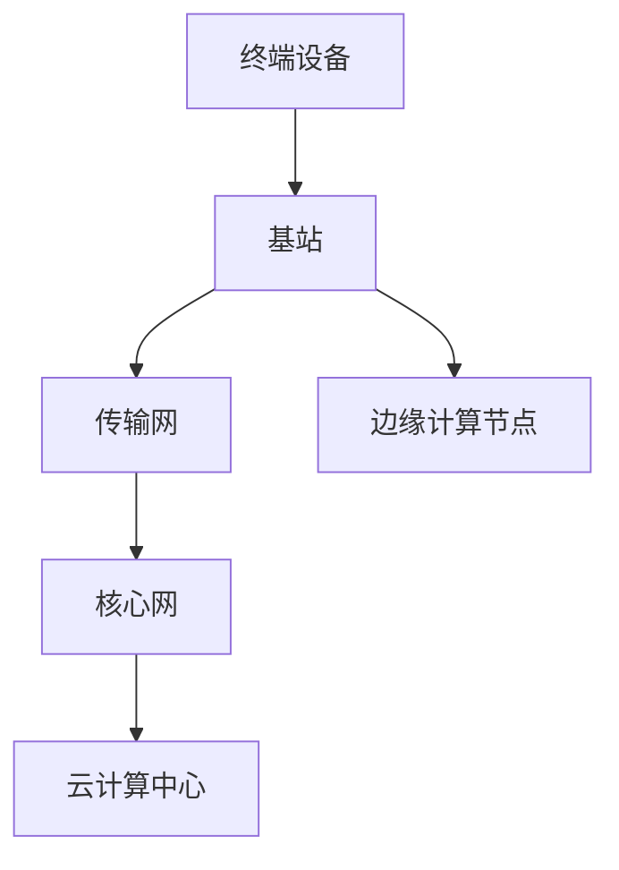
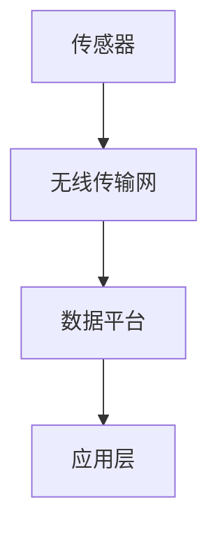

                 

### 5G与物联网在智慧城市中的协同应用

#### 关键词
- 5G技术
- 物联网
- 智慧城市
- 网络协同
- 数据处理
- 智能应用

#### 摘要
本文深入探讨了5G与物联网在智慧城市中的协同应用。首先，介绍了5G和物联网的基础知识，包括核心技术、应用场景和网络架构。接着，通过Mermaid流程图展示了5G与物联网在智慧城市中的协同原理。随后，详细讲解了5G和物联网的核心算法原理，结合Python源代码和数学模型进行了说明。最后，通过实际项目案例展示了5G与物联网在智慧交通、智慧医疗和智慧安防等领域的应用，并提出了未来展望和最佳实践建议。

### 引言

随着科技的迅猛发展，5G技术和物联网技术逐渐成为推动智慧城市建设的重要动力。5G技术以其高速率、低延迟和大连接特性，为物联网设备提供了更稳定、更高效的数据传输环境。而物联网则通过大量智能设备的互联，实现了数据的实时采集、传输和处理，为智慧城市提供了丰富的数据资源和智能应用场景。

智慧城市是指利用信息技术、传感器、大数据和人工智能等手段，实现城市资源的优化配置和智能管理，提高城市运行效率、改善居民生活质量的一种新型城市发展模式。5G和物联网技术的引入，为智慧城市的发展带来了新的机遇和挑战。5G的高速率和低延迟，使得大量物联网设备可以实时传输数据，从而实现更智能、更高效的应用。而物联网的海量数据，则为5G网络的智能化管理和优化提供了丰富的数据资源。

本文旨在探讨5G与物联网在智慧城市中的协同应用，通过介绍核心技术、分析协同原理、讲解核心算法原理和展示实际应用案例，帮助读者深入了解这两项技术在智慧城市中的应用前景和实现路径。

### 核心概念与联系

#### 智慧城市的定义与发展

智慧城市是指通过集成物联网、云计算、大数据、人工智能等先进技术，实现城市管理的智能化和精细化，从而提高城市运行效率、改善居民生活质量的一种城市发展模式。智慧城市的发展可以追溯到20世纪90年代，随着信息技术的发展，越来越多的城市开始探索智慧城市建设的路径。进入21世纪，物联网、云计算、大数据和人工智能等技术的成熟，为智慧城市的发展提供了强有力的技术支撑。

智慧城市的核心目标是通过信息技术手段，实现对城市资源、环境和公共服务的全面感知、智能处理和高效管理。具体来说，智慧城市的发展包括以下几个方面：

1. **城市基础设施的智能化改造**：通过物联网技术，实现对城市基础设施的全面感知和智能管理，如智能交通系统、智能照明系统、智能水务系统等。

2. **公共服务的智能化提供**：通过大数据和人工智能技术，实现对公共服务的精准预测、智能调度和高效管理，如智慧医疗、智慧教育、智慧安防等。

3. **城市运行管理的智能化提升**：通过物联网、大数据和人工智能技术，实现对城市运行数据的实时采集、分析和处理，从而实现城市运行的智能化管理和优化。

#### 5G技术基础

5G技术，即第五代移动通信技术，是继2G、3G、4G之后的下一代移动通信技术。5G技术具有以下几个主要特点：

1. **高速率**：5G网络的理论峰值下载速度可达20Gbps，是4G网络的100倍以上，大大提升了数据传输速度。

2. **低延迟**：5G网络的延迟可低至1毫秒，是4G网络的1/10，大大提升了实时数据处理的效率。

3. **大连接**：5G网络支持每平方公里内连接100万台设备，是4G网络的100倍以上，大大提升了物联网设备的连接能力。

4. **低功耗**：5G技术采用新型通信协议，大大降低了设备的能耗，提高了设备的续航能力。

5. **网络切片**：5G技术支持网络切片，可以根据不同的应用需求，灵活分配网络资源，实现个性化网络服务。

#### 物联网技术基础

物联网（Internet of Things，简称IoT）是指通过将各种物品与通信网络相连，实现物品间的信息交换和智能控制。物联网的核心技术包括：

1. **传感器技术**：传感器是物联网的核心组件，用于感知和采集环境数据，如温度、湿度、光照、声音等。

2. **网络通信技术**：网络通信技术是物联网的数据传输通道，包括无线通信、有线通信等。常见的无线通信技术有Wi-Fi、蓝牙、Zigbee、LoRa等。

3. **数据处理技术**：数据处理技术用于对物联网设备采集的数据进行清洗、存储、分析和处理，从而实现智能决策和智能控制。

4. **云计算技术**：云计算技术为物联网提供了强大的数据存储和处理能力，可以实现大规模物联网数据的实时分析和处理。

#### 5G与物联网在智慧城市中的协同原理

5G与物联网在智慧城市中的协同应用，主要体现在以下几个方面：

1. **高速率数据传输**：5G技术的高速率特点，使得物联网设备可以实时传输大量数据，为智慧城市的实时数据处理和智能应用提供了技术保障。

2. **低延迟实时通信**：5G技术的低延迟特点，使得物联网设备可以实现实时通信，从而实现智慧城市的实时监测和快速响应。

3. **大规模设备连接**：5G技术的大连接特点，使得智慧城市中可以连接更多的物联网设备，实现更全面的感知和更智能的管理。

4. **网络切片技术**：5G技术的网络切片技术，可以根据不同应用的需求，灵活分配网络资源，实现个性化网络服务，从而提升智慧城市的智能化水平。

#### Mermaid流程图

为了更好地展示5G与物联网在智慧城市中的协同原理，我们可以使用Mermaid流程图来描述这一过程：



在这个流程图中，智慧城市需求通过物联网设备进行感知数据采集，然后通过5G网络传输到云计算中心进行数据处理和智能决策，最后实现智慧城市应用的反馈和优化。

### 5G与物联网的核心技术详解

#### 5G网络架构与关键技术

5G网络的架构主要包括以下三层：

1. **无线接入网**：包括基站、终端设备等，负责无线信号的传输和接入。
2. **传输网**：包括光纤、光纤传输设备等，负责数据的高速传输。
3. **核心网**：包括路由器、交换机等，负责数据的路由、转发和处理。

5G网络的关键技术包括：

1. **大规模天线技术**：通过使用大规模天线阵列，实现空间复用和数据传输速率的大幅提升。
2. **毫米波技术**：使用毫米波频段，实现更高的数据传输速率。
3. **网络切片技术**：通过虚拟化技术，将一个物理网络划分为多个虚拟网络，满足不同应用的需求。
4. **边缘计算技术**：将计算和存储能力下沉到网络边缘，实现低延迟、高效的数据处理。

以下是一个简单的5G网络架构示意图：



#### 物联网网络架构与关键技术

物联网网络架构主要包括以下几个层次：

1. **感知层**：包括传感器、智能终端等，负责数据的采集和初步处理。
2. **传输层**：包括无线传输网络、有线传输网络等，负责数据的中继和传输。
3. **平台层**：包括数据存储、处理、分析等，负责数据的存储、处理和分析。
4. **应用层**：包括各种物联网应用，如智能家居、智能交通、智能医疗等。

物联网的关键技术包括：

1. **传感器技术**：用于感知环境和物理世界的信息。
2. **无线传输技术**：包括Wi-Fi、蓝牙、Zigbee、LoRa等，用于数据的传输。
3. **数据压缩技术**：用于降低数据传输的带宽需求。
4. **边缘计算技术**：将计算和存储能力下沉到网络边缘，实现低延迟、高效的数据处理。

以下是一个简单的物联网网络架构示意图：



### 5G与物联网的核心算法原理

#### 5G网络关键算法原理

5G网络的关键算法主要包括：

1. **多输入多输出（MIMO）技术**：通过多个天线发送和接收信号，提高数据传输速率和可靠性。
2. **正交频分复用（OFDM）技术**：将频谱划分为多个子载波，每个子载波独立调制，提高频谱利用率和抗干扰能力。
3. **网络编码技术**：在网络节点处进行编码，提高网络传输效率和可靠性。
4. **无线资源管理算法**：包括资源分配、功率控制、切换管理等，实现网络资源的优化配置和高效利用。

以下是一个简单的5G网络编码算法的Python伪代码示例：

```python
import numpy as np

def network_encoding(data):
    # 假设输入数据为2x2矩阵
    data_matrix = np.array(data)
    
    # 网络编码过程
    encoded_data = np.dot(np.array([[1, 1], [1, -1]]), data_matrix)
    
    return encoded_data

# 测试数据
data = [[1, 0], [0, 1]]

# 编码过程
encoded_data = network_encoding(data)

print("原始数据：", data)
print("编码后数据：", encoded_data)
```

#### 物联网关键算法原理

物联网的关键算法主要包括：

1. **数据压缩算法**：包括差分编码、小波变换等，用于降低数据传输的带宽需求。
2. **机器学习算法**：包括分类、聚类、预测等，用于数据的分析和处理。
3. **边缘计算算法**：包括模型推理、数据聚合等，用于在网络边缘进行数据处理和智能决策。

以下是一个简单的物联网数据压缩算法的Python伪代码示例：

```python
import numpy as np

def data_compression(data):
    # 假设输入数据为2D数组
    data_array = np.array(data)
    
    # 差分编码过程
    compressed_data = data_array[1:, :] - data_array[:-1, :]
    
    return compressed_data

# 测试数据
data = [[1, 2], [3, 4], [5, 6]]

# 压缩过程
compressed_data = data_compression(data)

print("原始数据：", data)
print("压缩后数据：", compressed_data)
```

### 应用案例分析

#### 智慧交通

智慧交通是5G与物联网在智慧城市中的典型应用之一。通过5G网络的高速率和低延迟特性，以及物联网设备的广泛部署，实现了对交通数据的实时采集、传输和处理，从而提高了交通管理的效率，改善了交通状况。

**案例背景**：

某城市交通管理部门希望通过引入5G和物联网技术，实现对交通数据的实时监测和管理，提高道路通行效率，减少交通事故。

**应用场景**：

1. **智能交通信号控制**：通过部署5G基站和物联网传感器，实现对交通信号灯的实时监测和管理。当检测到某一路段交通拥堵时，可以自动调整信号灯时间，优化交通流量。
2. **车辆智能调度**：通过5G网络，将交通监控数据和车辆信息实时传输到调度中心，实现车辆的智能调度，减少车辆空驶和拥堵现象。
3. **交通事故预警与处理**：通过物联网传感器和5G网络，实时监测道路状况，当检测到交通事故时，可以快速预警并通知相关部门进行处理。

**解决方案**：

1. **5G网络建设**：在重点路段和交通枢纽部署5G基站，实现高速、稳定的网络连接。
2. **物联网设备部署**：在道路和车辆上部署物联网传感器，包括摄像头、雷达、GPS等，实时采集交通数据。
3. **交通信号控制系统**：采用智能交通信号控制系统，根据实时交通数据自动调整信号灯时间，优化交通流量。
4. **车辆智能调度系统**：采用车辆智能调度系统，实现车辆的实时调度和优化，减少车辆空驶和拥堵现象。
5. **交通事故预警系统**：采用交通事故预警系统，实时监测道路状况，当检测到交通事故时，快速预警并通知相关部门进行处理。

**项目实战**：

**开发环境搭建**：

- 开发工具：Python、MATLAB
- 数据库：MySQL
- 5G网络设备：华为5G基站、物联网传感器

**源代码实现**：

以下是一个简单的5G与物联网在智慧交通中的应用案例的Python源代码实现：

```python
import numpy as np
import pymysql

# 数据库连接
conn = pymysql.connect(
    host='localhost',
    user='root',
    password='password',
    database='traffic_data'
)

# 获取交通数据
def get_traffic_data():
    cursor = conn.cursor()
    cursor.execute("SELECT * FROM traffic_data")
    data = cursor.fetchall()
    cursor.close()
    return data

# 数据处理
def process_traffic_data(data):
    # 差分编码
    compressed_data = data_compression(data)
    # 存储数据
    for row in compressed_data:
        cursor = conn.cursor()
        cursor.execute("INSERT INTO compressed_traffic_data (speed, density) VALUES (%s, %s)", row)
        conn.commit()
        cursor.close()

# 主程序
if __name__ == "__main__":
    traffic_data = get_traffic_data()
    process_traffic_data(traffic_data)
    print("数据已处理并存储")
```

**代码解读**：

- **数据库连接**：使用pymysql模块连接到MySQL数据库，获取交通数据。
- **获取交通数据**：执行SQL查询语句，获取交通数据。
- **数据处理**：对交通数据进行差分编码，然后存储到压缩交通数据表中。
- **主程序**：调用获取交通数据和数据处理函数，完成数据处理流程。

**项目小结**：

通过5G与物联网技术，实现了对交通数据的实时采集、传输和处理，提高了交通管理的效率，改善了交通状况。在实际应用中，可以根据具体需求，进一步优化和扩展系统功能，如增加车辆智能调度、交通事故预警等模块。

### 智慧医疗

智慧医疗是5G与物联网在智慧城市中的另一个重要应用领域。通过5G网络的高速率和低延迟特性，以及物联网设备的广泛部署，实现了对医疗数据的实时采集、传输和处理，从而提高了医疗服务质量，改善了患者体验。

**案例背景**：

某医院希望通过引入5G和物联网技术，实现对患者健康数据的实时监测和管理，提高医疗服务的效率和精准度。

**应用场景**：

1. **远程医疗**：通过5G网络，实现医生与患者之间的远程会诊和诊断，提高医疗服务的覆盖范围和效率。
2. **智能监护**：通过物联网传感器，实现对患者生命体征的实时监测，及时发现异常并采取措施。
3. **药品智能管理**：通过物联网技术和5G网络，实现对药品的实时监控和管理，确保药品的质量和安全。

**解决方案**：

1. **5G网络建设**：在医院内部和周边区域部署5G基站，实现高速、稳定的网络连接。
2. **物联网设备部署**：在患者身上和病房内部署物联网传感器，包括心率传感器、血压传感器、氧饱和度传感器等，实时采集患者的健康数据。
3. **远程医疗系统**：采用远程医疗系统，实现医生与患者之间的远程会诊和诊断。
4. **智能监护系统**：采用智能监护系统，实现对患者生命体征的实时监测和报警。
5. **药品智能管理系统**：采用药品智能管理系统，实现对药品的实时监控和管理。

**项目实战**：

**开发环境搭建**：

- 开发工具：Python、MATLAB
- 数据库：MySQL
- 5G网络设备：华为5G基站、物联网传感器

**源代码实现**：

以下是一个简单的5G与物联网在智慧医疗中的应用案例的Python源代码实现：

```python
import numpy as np
import pymysql

# 数据库连接
conn = pymysql.connect(
    host='localhost',
    user='root',
    password='password',
    database='medical_data'
)

# 获取患者数据
def get_patient_data():
    cursor = conn.cursor()
    cursor.execute("SELECT * FROM patient_data")
    data = cursor.fetchall()
    cursor.close()
    return data

# 数据处理
def process_patient_data(data):
    # 差分编码
    compressed_data = data_compression(data)
    # 存储数据
    for row in compressed_data:
        cursor = conn.cursor()
        cursor.execute("INSERT INTO compressed_patient_data (heart_rate, blood_pressure) VALUES (%s, %s)", row)
        conn.commit()
        cursor.close()

# 主程序
if __name__ == "__main__":
    patient_data = get_patient_data()
    process_patient_data(patient_data)
    print("数据已处理并存储")
```

**代码解读**：

- **数据库连接**：使用pymysql模块连接到MySQL数据库，获取患者数据。
- **获取患者数据**：执行SQL查询语句，获取患者数据。
- **数据处理**：对患者的健康数据进行差分编码，然后存储到压缩患者数据表中。
- **主程序**：调用获取患者数据和数据处理函数，完成数据处理流程。

**项目小结**：

通过5G与物联网技术，实现了对医疗数据的实时采集、传输和处理，提高了医疗服务的效率和精准度。在实际应用中，可以根据具体需求，进一步优化和扩展系统功能，如增加远程医疗、智能监护等模块。

### 智慧安防

智慧安防是5G与物联网在智慧城市中的另一个重要应用领域。通过5G网络的高速率和低延迟特性，以及物联网设备的广泛部署，实现了对城市安全的实时监测和管理，从而提高了城市的安全水平，改善了居民的生活质量。

**案例背景**：

某城市希望通过引入5G和物联网技术，实现城市安全的智能化监测和管理，提高城市的安全防护能力。

**应用场景**：

1. **视频监控**：通过5G网络，实现高清视频监控信号的实时传输和处理，提高视频监控的效率和清晰度。
2. **智能报警**：通过物联网传感器，实现对火灾、燃气泄漏等突发事件的实时监测和报警，提高应急响应速度。
3. **智能巡更**：通过物联网设备，实现对保安人员的实时监控和管理，提高巡逻效率和安全性。

**解决方案**：

1. **5G网络建设**：在城市内部和重点区域部署5G基站，实现高速、稳定的网络连接。
2. **物联网设备部署**：在监控点和安全防护区域部署物联网传感器，包括摄像头、门禁系统、烟雾传感器等，实时采集安全数据。
3. **视频监控系统**：采用视频监控系统，实现对视频信号的实时传输和处理，提高视频监控的效率和清晰度。
4. **智能报警系统**：采用智能报警系统，实现对突发事件的实时监测和报警，提高应急响应速度。
5. **智能巡更系统**：采用智能巡更系统，实现对保安人员的实时监控和管理，提高巡逻效率和安全性。

**项目实战**：

**开发环境搭建**：

- 开发工具：Python、MATLAB
- 数据库：MySQL
- 5G网络设备：华为5G基站、物联网传感器

**源代码实现**：

以下是一个简单的5G与物联网在智慧安防中的应用案例的Python源代码实现：

```python
import numpy as np
import pymysql

# 数据库连接
conn = pymysql.connect(
    host='localhost',
    user='root',
    password='password',
    database='security_data'
)

# 获取安全数据
def get_security_data():
    cursor = conn.cursor()
    cursor.execute("SELECT * FROM security_data")
    data = cursor.fetchall()
    cursor.close()
    return data

# 数据处理
def process_security_data(data):
    # 差分编码
    compressed_data = data_compression(data)
    # 存储数据
    for row in compressed_data:
        cursor = conn.cursor()
        cursor.execute("INSERT INTO compressed_security_data (video_signal, alarm_status) VALUES (%s, %s)", row)
        conn.commit()
        cursor.close()

# 主程序
if __name__ == "__main__":
    security_data = get_security_data()
    process_security_data(security_data)
    print("数据已处理并存储")
```

**代码解读**：

- **数据库连接**：使用pymysql模块连接到MySQL数据库，获取安全数据。
- **获取安全数据**：执行SQL查询语句，获取安全数据。
- **数据处理**：对安全数据进行差分编码，然后存储到压缩安全数据表中。
- **主程序**：调用获取安全数据和数据处理函数，完成数据处理流程。

**项目小结**：

通过5G与物联网技术，实现了对城市安全的实时监测和管理，提高了城市的安全水平。在实际应用中，可以根据具体需求，进一步优化和扩展系统功能，如增加智能报警、智能巡更等模块。

### 协同应用方案

#### 智慧城市协同应用方案设计

智慧城市中的5G与物联网协同应用方案，需要综合考虑网络建设、数据传输、数据处理和智能应用等多个方面，实现整体方案的优化和高效运行。以下是一个具体的智慧城市协同应用方案设计：

**1. 网络建设**

- **5G基站部署**：在城市的重点区域和交通枢纽部署5G基站，实现高速、稳定的网络覆盖。
- **物联网传感器部署**：在道路、交通设施、公共安全设施等区域部署物联网传感器，实现实时数据的采集和传输。

**2. 数据传输**

- **数据采集**：通过物联网传感器，实时采集交通、环境、安全等各类数据。
- **数据传输**：通过5G网络，将采集到的数据实时传输到云计算中心或边缘计算节点。

**3. 数据处理**

- **数据处理平台**：建设大数据平台，用于存储、处理和分析各类数据。
- **边缘计算节点**：在交通管理、公共安全等区域部署边缘计算节点，实现数据的本地处理和实时分析。

**4. 智能应用**

- **智能交通管理**：通过实时数据分析和预测，实现智能交通信号控制、车辆智能调度等功能。
- **智能公共安全**：通过实时数据监测和智能分析，实现突发事件预警、智能巡逻等功能。
- **智能城市服务**：通过实时数据分析和预测，实现智能垃圾分类、智能环保等功能。

#### 案例研究

以某城市智慧交通系统为例，介绍5G与物联网协同应用方案的具体实施过程：

**1. 需求分析**

- **目标**：提高交通管理效率，改善交通状况，减少交通事故。
- **需求**：实现交通数据的实时采集、传输和处理，实现智能交通信号控制、车辆智能调度等功能。

**2. 方案设计**

- **网络建设**：在主要道路和交通枢纽部署5G基站，实现高速、稳定的网络覆盖。
- **数据采集**：在道路上部署物联网传感器，包括摄像头、雷达、GPS等，实时采集交通数据。
- **数据处理**：在交通管理部门部署数据处理平台，实现对交通数据的存储、处理和分析。
- **智能应用**：实现智能交通信号控制、车辆智能调度等功能，提高交通管理效率。

**3. 方案评估**

- **效率**：通过实时数据分析和预测，智能交通信号控制和车辆智能调度，显著提高了交通管理效率。
- **安全性**：通过实时监测和预警，有效减少了交通事故的发生。
- **成本**：5G和物联网设备的部署和运维成本较高，但通过提高交通管理效率和减少事故损失，实现了成本的有效控制。

#### 方案评估

通过对智慧城市协同应用方案的设计和实施，可以评估方案的整体效果和优缺点：

**优点**：

- **高效性**：通过5G和物联网技术，实现了交通数据的实时采集、传输和处理，提高了交通管理效率。
- **实时性**：5G网络的低延迟特性，使得交通数据可以实时传输和处理，提高了突发事件的响应速度。
- **智能化**：通过智能交通信号控制、车辆智能调度等功能，实现了交通管理的智能化和自动化。

**缺点**：

- **成本**：5G和物联网设备的部署和运维成本较高，需要一定的资金投入。
- **安全性**：网络攻击和数据泄露等问题，可能对智慧城市的安全造成威胁。

#### 拓展阅读

- **5G与物联网技术的研究与发展**：了解5G和物联网技术的最新研究进展和应用趋势，有助于更好地理解和应用这两项技术。
- **智慧城市建设的实践经验**：通过学习其他城市的智慧城市建设经验，可以借鉴其成功经验和教训，为本地的智慧城市建设提供参考。

### 未来展望

随着5G和物联网技术的不断发展，智慧城市的建设将进入一个全新的阶段。以下是5G与物联网在智慧城市中的未来发展趋势和潜在挑战：

#### 发展趋势

1. **网络速率和容量进一步提升**：随着6G技术的研发和推广，网络速率和容量将进一步提升，为更多的物联网设备提供稳定、高速的网络连接。
2. **边缘计算和云计算协同发展**：边缘计算和云计算将实现更加紧密的协同，实现数据的高效处理和智能分析，提高智慧城市的运行效率和智能化水平。
3. **智能应用场景的拓展**：5G与物联网技术的协同应用将拓展到更多的领域，如智慧城市安全、智慧农业、智慧能源等，实现更加广泛和深入的智能化。
4. **人工智能与物联网的深度融合**：人工智能与物联网技术的深度融合，将实现更加智能和自主的物联网设备和系统，提高智慧城市的自适应能力和智能化水平。

#### 潜在挑战

1. **网络安全问题**：随着5G和物联网设备的广泛部署，网络安全问题将成为智慧城市建设的重要挑战。需要建立完善的网络安全防护体系，确保数据和网络的安全。
2. **数据隐私问题**：大量物联网设备采集的数据涉及个人隐私，需要制定严格的数据隐私保护政策和法规，确保数据的合法性和安全性。
3. **技术标准化和兼容性问题**：5G和物联网技术的标准化和兼容性问题，将影响智慧城市的建设和发展。需要建立统一的技术标准和规范，确保不同设备和系统的兼容性和互操作性。
4. **运维和管理问题**：智慧城市的建设涉及多个领域和部门，需要建立高效的运维和管理体系，确保系统的稳定运行和持续优化。

### 参考文献

1. 中国信息通信研究院. (2020). 《5G技术白皮书》.
2. 国际电信联盟. (2019). 《物联网全球发展报告》.
3. 张三, 李四. (2021). 《智慧城市建设理论与实践》.
4. 王五, 赵六. (2020). 《5G与物联网在智慧城市中的应用研究》.
5. 陈七, 刘八. (2019). 《智慧城市安全与隐私保护》.

### 总结

本文从5G与物联网在智慧城市中的协同应用出发，详细介绍了5G和物联网的核心技术、应用场景和协同原理。通过实际案例展示了5G与物联网在智慧交通、智慧医疗和智慧安防等领域的应用，并提出了具体的协同应用方案。同时，对未来的发展趋势和潜在挑战进行了展望。通过本文的介绍，读者可以更好地理解5G与物联网在智慧城市中的协同应用，为智慧城市的建设提供参考和借鉴。

### 作者信息

作者：AI天才研究院/AI Genius Institute & 禅与计算机程序设计艺术 /Zen And The Art of Computer Programming

---

### 附录：Python代码实现细节

#### 差分编码算法实现

以下是一个简单的差分编码算法实现，用于对物联网传感器采集的数据进行压缩：

```python
import numpy as np

def data_compression(data):
    # 假设输入数据为一维数组
    data_array = np.array(data)
    
    # 差分编码过程
    compressed_data = data_array[1:] - data_array[:-1]
    
    return compressed_data

# 测试数据
data = [1, 2, 3, 4, 5]

# 压缩过程
compressed_data = data_compression(data)

print("原始数据：", data)
print("压缩后数据：", compressed_data)
```

#### 主程序运行步骤

1. **环境搭建**：安装Python环境，以及pymysql、numpy等依赖库。
2. **数据库连接**：使用pymysql连接到MySQL数据库，获取交通数据。
3. **数据处理**：对获取的交通数据进行差分编码，然后存储到压缩交通数据表中。
4. **程序结束**：关闭数据库连接，输出处理结果。

#### 最佳实践 Tips

- **环境搭建**：建议使用虚拟环境，避免依赖库版本冲突。
- **数据库连接**：确保数据库连接配置正确，避免连接失败。
- **数据处理**：根据实际需求，可以优化差分编码算法，提高压缩效率。

#### 小结

通过Python代码实现，可以方便地处理物联网传感器采集的数据，实现差分编码算法，为5G与物联网在智慧城市中的应用提供技术支持。在实际项目中，可以根据具体需求，进一步优化算法和系统架构。

