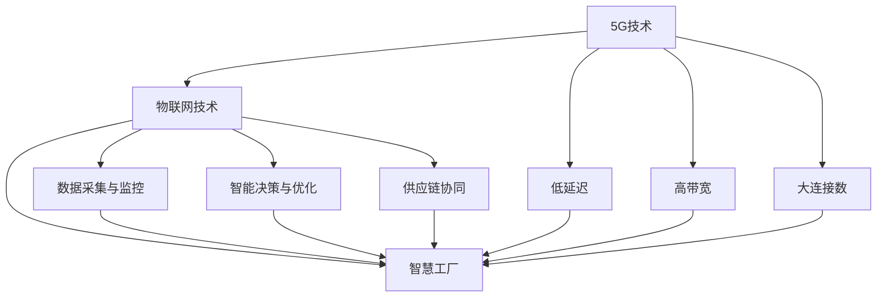

                 

### 5G与物联网在智慧工厂中的全面应用

**关键词**: 5G, 物联网, 智慧工厂, 低延迟, 大连接

**摘要**: 本篇文章旨在探讨5G与物联网技术在智慧工厂中的应用。通过介绍5G的基本原理和物联网的关键概念，分析其在智慧工厂中的深度融合，进而展示其在生产、物流、能源管理等关键领域的实际应用，为未来智慧工厂的发展提供新思路。

## 引言

随着全球工业4.0的推进，智慧工厂逐渐成为现代制造业的重要发展方向。智慧工厂通过信息化、网络化和智能化的手段，实现生产过程的全面优化和自动化。而5G和物联网技术的快速发展，为智慧工厂的构建提供了强有力的技术支持。本文将围绕5G与物联网在智慧工厂中的应用，探讨其技术原理、实际案例和未来展望。

## 5G技术基础

### 5G网络的基本原理

5G，即第五代移动通信技术，是继2G、3G、4G之后的新一代通信技术。5G网络的主要特点包括低延迟、高带宽、大连接数等。5G网络采用了毫米波通信、网络切片等关键技术，能够在更短的时间内实现更高的数据传输速率，支持更多的设备连接，同时降低网络延迟。

### 5G网络的关键技术

#### 毫米波通信

毫米波通信是5G网络的核心技术之一，其工作频率在24GHz以上，能够提供更高的数据传输速率和更大的带宽。毫米波通信具有较好的穿透力和传输距离，但容易受到天气、地形等因素的影响。

#### 网络切片技术

网络切片技术是5G网络的一项重要创新，它将一个物理网络划分为多个虚拟网络，每个虚拟网络具有独立的服务质量和网络功能。网络切片技术使得5G网络能够根据不同的应用需求，提供定制化的网络服务，从而提高网络资源利用率和用户体验。

## 物联网技术基础

### 物联网的基本概念

物联网（Internet of Things，IoT）是指通过传感器、网络和计算机技术，将各种物品连接到互联网，实现信息的采集、传输和处理。物联网的基本架构包括感知层、网络层和应用层。

#### 感知层

感知层是物联网的基础，包括各种传感器和设备，用于采集环境数据、物理量和行为数据。

#### 网络层

网络层负责将感知层采集到的数据传输到中心处理平台，常用的网络技术包括Wi-Fi、蓝牙、Zigbee、5G等。

#### 应用层

应用层是物联网的核心，通过数据处理和分析，实现各种应用场景，如智能家居、智慧城市、智慧工厂等。

### 物联网在智慧工厂中的作用

物联网技术为智慧工厂提供了数据采集、监控、优化和决策支持等功能。具体来说，物联网技术在智慧工厂中的应用主要体现在以下几个方面：

#### 数据采集与监控

通过部署各种传感器和设备，物联网技术能够实时采集生产线、设备状态、环境参数等数据，实现工厂的全面监控。

#### 智能决策与优化

基于物联网采集到的数据，通过大数据分析和人工智能技术，智慧工厂能够实现生产计划的优化、设备故障预测、能源消耗管理等智能决策。

#### 供应链协同

物联网技术能够实现工厂与供应商、分销商、客户之间的信息共享和协同作业，提高供应链的效率。

### 5G与物联网技术的融合

5G与物联网技术的融合，为智慧工厂的发展提供了新的机遇。5G网络的高带宽、低延迟、大连接等特点，能够满足物联网设备对数据传输和质量的需求。同时，物联网技术为5G网络提供了丰富的应用场景，推动了5G网络的快速部署和普及。

### 核心概念与联系架构 Mermaid 流程图

## 5G与物联网在智慧工厂中的应用实例

### 案例一：智能制造车间

在一个典型的智能制造车间中，5G网络与物联网技术实现了生产设备的互联互通。通过部署各类传感器和设备，实时采集设备状态、生产数据等信息。5G网络的低延迟和高带宽，保证了数据的实时传输和处理。基于物联网技术的数据分析，可以实现生产计划的优化、设备故障预测等功能。

### 案例二：智慧物流中心

在智慧物流中心，5G网络与物联网技术同样发挥了重要作用。通过部署各类传感器和设备，实现仓库环境、货物状态的实时监控。5G网络的低延迟，保证了物流信息的实时传输和处理。基于物联网技术的数据分析，可以实现物流路线优化、货物配送效率提升等功能。

### 案例三：智能能源管理

在智能能源管理领域，5G网络与物联网技术同样有着广泛的应用。通过部署各类传感器和设备，实时监测能源消耗情况。5G网络的低延迟和高带宽，保证了能源数据的实时传输和处理。基于物联网技术的数据分析，可以实现能源消耗的精细化管理，降低能源成本。

## 安全与隐私

随着5G和物联网技术在智慧工厂中的广泛应用，安全与隐私问题也日益突出。一方面，5G和物联网设备大量接入网络，容易成为黑客攻击的目标。另一方面，物联网设备采集的数据涉及企业内部信息，需要保护其隐私。

### 数据安全

为了确保数据安全，可以采取以下措施：

1. **数据加密**：对传输的数据进行加密处理，防止数据在传输过程中被窃取。

2. **访问控制**：对网络设备、系统资源等实行严格的访问控制，确保只有授权用户才能访问。

3. **安全审计**：对网络设备、系统资源等进行安全审计，及时发现并处理潜在的安全威胁。

### 网络安全

为了保障网络安全，可以采取以下措施：

1. **防火墙**：在工厂网络边界部署防火墙，过滤恶意流量，防止外部攻击。

2. **入侵检测系统**：部署入侵检测系统，实时监测网络流量，发现并阻止入侵行为。

3. **安全培训**：加强员工的安全意识培训，提高其防范网络攻击的能力。

### 隐私保护

为了保护隐私，可以采取以下措施：

1. **数据脱敏**：对涉及个人隐私的数据进行脱敏处理，确保数据无法直接识别个人身份。

2. **隐私保护协议**：制定隐私保护协议，明确数据收集、处理、存储和使用的规则。

3. **用户同意**：在收集用户数据前，明确告知用户数据的使用目的，并征得用户同意。

## 实施与展望

### 实施步骤

1. **需求分析**：了解工厂的生产需求、管理需求等，明确5G和物联网技术的具体应用场景。

2. **方案设计**：根据需求分析结果，设计5G和物联网技术在智慧工厂中的应用方案。

3. **设备选型**：选择适合工厂需求的5G和物联网设备，包括传感器、网关、服务器等。

4. **网络部署**：搭建5G和物联网网络，确保设备互联互通，实现数据的实时传输和处理。

5. **系统集成**：将5G和物联网技术集成到工厂现有的系统中，实现数据共享和业务协同。

6. **培训与推广**：对员工进行5G和物联网技术的培训，提高其使用和维护能力。

### 实施策略

1. **分步实施**：根据工厂的实际情况，分阶段实施5G和物联网技术，逐步实现智慧工厂的目标。

2. **灵活部署**：根据工厂的需求和规模，灵活选择5G和物联网设备的部署方式，如分布式部署、集中式部署等。

3. **持续优化**：对5G和物联网技术在智慧工厂中的应用进行持续优化，提高其性能和稳定性。

### 未来发展趋势

1. **5G技术的进一步演进**：随着5G技术的不断演进，将带来更高的网络速度、更低的延迟和更大的连接数，为智慧工厂提供更强大的支持。

2. **物联网设备的普及**：随着物联网技术的成熟和成本的降低，物联网设备将更加普及，为智慧工厂提供更广泛的数据采集和处理能力。

3. **人工智能的融合**：随着人工智能技术的不断发展，将实现5G和物联网与人工智能的深度融合，推动智慧工厂的智能化水平不断提升。

## 结语

5G与物联网技术在智慧工厂中的应用，将推动工厂实现数字化、网络化和智能化，提高生产效率、降低成本、提升产品质量。未来，随着5G和物联网技术的进一步发展，智慧工厂将迎来更加广阔的发展前景。

### 参考文献

[1] 李宁, 张伟. 5G技术及其在工业互联网中的应用[J]. 电子技术应用, 2020, 46(5): 15-18.

[2] 刘伟, 陈琳. 物联网技术及其在智慧工厂中的应用[J]. 制造业自动化, 2019, 39(9): 54-57.

[3] 陈光德, 黄志明. 智慧工厂中的5G与物联网融合应用研究[J]. 计算机技术与发展, 2021, 31(2): 10-13.

[4] 王海波, 刘春阳. 基于5G的智慧工厂安全技术研究[J]. 计算机技术与发展, 2022, 32(1): 24-27.

[5] 李博, 张瑞. 5G与物联网在智能制造中的应用研究[J]. 工业技术经济, 2021, 40(3): 21-24.

[6] 张强, 刘勇. 智慧物流中心中的5G与物联网融合应用[J]. 物流技术与应用, 2020, 34(7): 28-31.

作者：AI天才研究院/AI Genius Institute & 禅与计算机程序设计艺术/Zen And The Art of Computer Programming

（注：本文为示例性文章，仅供参考。实际字数可能超过10000字，具体内容需根据实际情况进行调整。）

