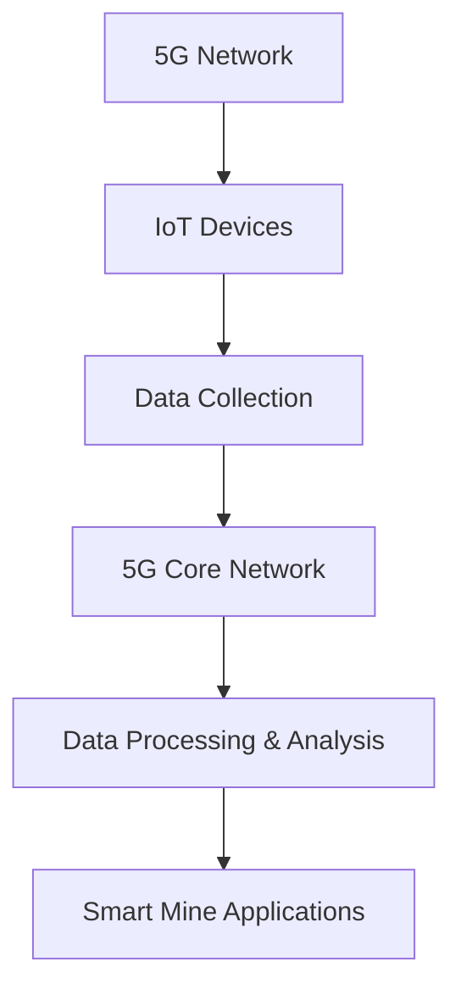
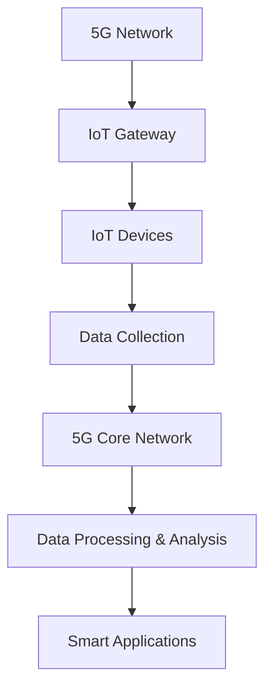
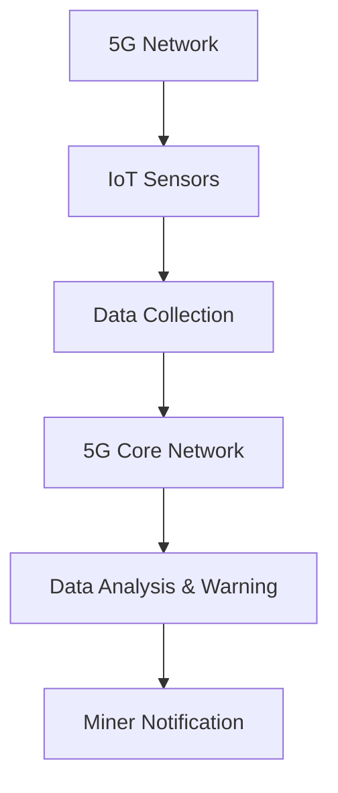
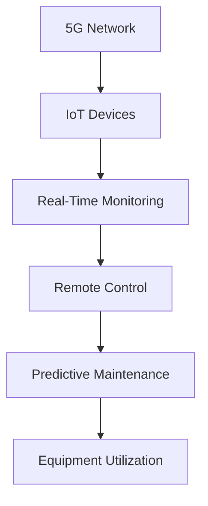
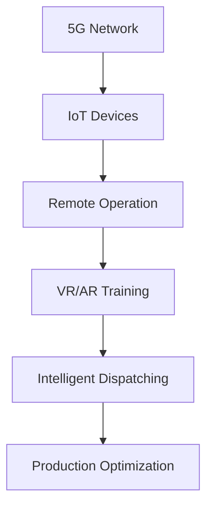
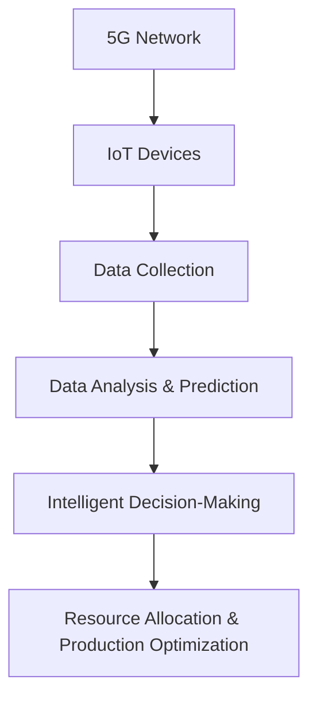

                 

### 文章标题

《5G与物联网在智慧矿山中的全面应用》

随着科技的飞速发展，5G和物联网（IoT）技术正逐渐成为推动各个行业变革的重要力量。在矿产资源丰富的矿山行业，这两项技术的融合与应用，正引领着智慧矿山建设的新潮流。本文将围绕5G和物联网在智慧矿山中的全面应用，深入探讨其核心概念、关键技术、应用场景、部署策略、挑战与未来趋势，并结合实际案例，为读者展现这一领域的广泛应用与无限可能。

关键词：5G，物联网，智慧矿山，应用场景，部署策略，挑战与趋势

### 文章摘要

本文旨在探讨5G和物联网技术在智慧矿山中的全面应用。首先，我们介绍了5G和物联网的基本概念，包括其技术架构和通信协议。随后，本文详细分析了5G和物联网在矿山安全监控、设备管理、远程控制和生产优化等方面的应用，探讨了在矿山环境中部署5G和物联网网络的策略和挑战。最后，通过实际案例研究和未来发展趋势分析，本文总结了5G和物联网在智慧矿山中的成功应用与潜在前景。

### 1. 5G技术基础

#### 1.1 5G的起源和发展历程

5G（第五代移动通信技术）的发展可追溯到2000年代初，当时国际电信联盟（ITU）开始规划IMT-2020（国际移动通信计划）新标准。5G的标准化工作始于2012年，由3GPP（第三代合作伙伴计划）组织负责。2018年，第一个5G标准规范正式发布，标志着5G技术进入商用阶段。5G的发展历程经历了多个重要里程碑，包括毫米波技术、大规模MIMO（多输入多输出）、网络切片等创新技术的引入。

#### 1.2 5G的关键特性

与之前的移动通信技术相比，5G具有以下几个关键特性：

- **高速率**：5G的理论峰值下载速度可达20Gbps，是4G的100倍，这将极大地提升数据传输效率，满足高带宽应用的需求。
- **低延迟**：5G的端到端延迟降低至1ms，这将显著提升实时控制和交互的应用性能。
- **大连接**：5G支持每平方米100万连接，满足物联网设备密集连接的需求。
- **网络切片**：5G通过网络切片技术，能够为不同应用提供定制化的网络资源，实现高效灵活的资源配置。

#### 1.3 5G网络架构

5G网络架构包括用户面（User Plane）和控制面（Control Plane）两大核心部分。用户面负责数据传输，控制面负责网络管理和信号控制。

- **核心网（Core Network）**：5G核心网采用服务化架构（Service-Based Architecture, SBA），支持网络功能的虚拟化和自动化。核心网包括5GC（5G Core）和UPF（User Plane Function）等功能模块。
- **无线接入网（Radio Access Network, RAN）**：5G RAN采用大规模MIMO、载波聚合、毫米波等技术，提高网络容量和覆盖范围。
- **边缘计算（Edge Computing）**：5G边缘计算通过将计算和存储资源部署在靠近用户的位置，降低延迟，提升用户体验。

#### 1.4 5G与物联网的关系

5G和物联网的结合，使得智慧矿山建设成为可能。5G提供了高带宽、低延迟和大连接的特性，能够满足物联网设备的大量数据传输需求。同时，物联网设备收集的大量数据为5G网络提供了丰富的应用场景。以下是一个简单的5G与物联网在智慧矿山中的关系架构图，使用Mermaid流程图表示：

在智慧矿山中，5G网络连接物联网设备，实现数据的实时采集、传输和处理，进而支持智能监控、设备管理、远程控制等应用，提高矿山的生产效率和安全水平。

### 2. 物联网基本概念

#### 2.1 物联网的定义和组成部分

物联网（Internet of Things，IoT）是指通过互联网将各种物理设备连接起来，实现设备之间的互联互通和信息共享。物联网的基本组成部分包括：

- **设备**：物联网的核心是各种传感器、执行器、智能设备等，它们可以通过无线或有线方式连接到互联网。
- **网络**：物联网设备通过网络进行数据传输，包括局域网、广域网和无线网络等。
- **平台**：物联网平台负责数据的收集、存储、处理和分析，是连接设备与用户之间的桥梁。
- **应用**：物联网的应用场景非常广泛，包括智能家居、智慧城市、智能制造、智慧农业等。

#### 2.2 物联网的通信协议

物联网的通信协议是确保设备之间能够有效通信的关键。以下是一些常见的物联网通信协议：

- **ZigBee**：一种低功耗、短距离的无线通信协议，适用于智能家居、工业控制等领域。
- **Z-Wave**：另一种短距离无线通信协议，与ZigBee类似，适用于智能家居和智能安防。
- **蓝牙（Bluetooth）**：一种短距离无线通信技术，广泛应用于手机、智能家居设备等。
- **Wi-Fi**：一种广泛使用的无线局域网通信协议，适用于高速数据传输。
- **LoRa**：一种长距离、低功耗的无线通信协议，适用于物联网传感网络。

#### 2.3 物联网与5G的结合

5G与物联网的结合，使得物联网应用能够获得更高的数据传输速率、更低的延迟和更大的连接数。以下是一个简单的物联网与5G结合的关系架构图，使用Mermaid流程图表示：

在这个架构中，5G网络通过物联网网关连接物联网设备，实现数据的实时采集、传输和处理，为智能应用提供数据支持。

### 3. 5G与物联网在智慧矿山中的应用

#### 3.1 矿山安全监控与预警

智慧矿山的安全监控是保障矿工生命安全的重要措施。5G和物联网技术为矿山安全监控提供了强有力的支持：

- **设备连接与数据采集**：通过物联网设备，如监控摄像头、传感器、定位装置等，实时采集矿山环境数据，包括温度、湿度、气体浓度、设备运行状态等。
- **数据传输与处理**：5G网络提供高速、低延迟的数据传输通道，确保监控数据能够及时传输到数据处理平台。
- **智能分析与预警**：利用大数据分析和人工智能技术，对采集的数据进行分析，实现对矿山环境的智能监控和预警。例如，当监测到气体浓度异常升高时，系统可以自动触发预警，通知矿工撤离或采取相应的安全措施。

以下是一个简单的5G与物联网在矿山安全监控中的应用架构图，使用Mermaid流程图表示：

#### 3.2 智能设备管理与维护

智能设备是智慧矿山的重要组成部分，其高效运行对于矿山生产至关重要。5G和物联网技术为智能设备的管理与维护提供了智能化解决方案：

- **设备监控**：通过物联网设备，实时监控设备的运行状态，包括温度、压力、电压、电流等参数。
- **远程控制**：利用5G网络的低延迟特性，实现设备的远程控制，提高设备操作的安全性和效率。
- **预测性维护**：基于设备运行数据的分析和预测，实现对设备的预测性维护，减少设备故障，提高设备利用率。

以下是一个简单的5G与物联网在智能设备管理与维护中的应用架构图，使用Mermaid流程图表示：

#### 3.3 远程控制与操作

5G和物联网技术使得矿山的远程控制与操作成为可能，降低了矿工的风险，提高了生产效率：

- **远程操作**：矿工可以通过5G网络远程操作矿山设备，实现设备的启动、停止、调整等操作。
- **虚拟现实（VR）与增强现实（AR）**：利用VR和AR技术，矿工可以在虚拟环境中进行设备的操作训练，提高操作技能。
- **智能调度**：基于实时数据分析和预测，实现设备的智能调度，优化生产流程，提高生产效率。

以下是一个简单的5G与物联网在远程控制与操作中的应用架构图，使用Mermaid流程图表示：

#### 3.4 资源预测与生产优化

5G和物联网技术为矿山的资源预测与生产优化提供了强有力的支持：

- **实时数据采集**：通过物联网设备，实时采集矿山的生产数据，包括矿石品位、开采进度、设备利用率等。
- **数据分析与预测**：利用大数据分析和人工智能技术，对采集的数据进行分析和预测，实现对矿山资源的合理调配和生产计划的优化。
- **智能决策**：基于数据分析结果，智能决策系统可以提供生产策略建议，优化矿山生产过程，提高资源利用效率。

以下是一个简单的5G与物联网在资源预测与生产优化中的应用架构图，使用Mermaid流程图表示：

### 4. 5G与物联网在智慧矿山中的部署策略

#### 4.1 网络部署

5G和物联网网络的部署是智慧矿山建设的关键。以下是一些网络部署的基本策略：

- **基站建设**：在矿山周边建设5G基站，提供广泛的网络覆盖，确保物联网设备的可靠连接。
- **网络架构设计**：设计合理的网络架构，包括核心网、无线接入网和边缘计算节点，实现数据的高效传输和低延迟。
- **设备安装与调试**：在矿山现场安装物联网设备和5G基站，并进行调试和优化，确保网络稳定运行。

#### 4.2 系统集成与测试

系统集成与测试是确保5G和物联网系统在矿山环境中稳定运行的重要环节：

- **系统集成**：将5G和物联网设备与矿山现有系统进行集成，包括数据采集系统、监控系统、设备控制系统等，确保数据互联互通。
- **功能测试**：对系统的各个功能进行测试，包括数据采集、传输、处理、监控、控制等，确保系统的可靠性和稳定性。
- **性能测试**：对系统进行性能测试，包括网络带宽、传输延迟、设备响应时间等，确保系统满足矿山生产的需求。

#### 4.3 运维与维护

智慧矿山的运维与维护是保障系统长期稳定运行的关键：

- **实时监控**：通过监控系统，实时监控系统的运行状态，包括设备状态、网络连接状态、数据传输状态等，确保系统稳定运行。
- **故障处理**：当系统出现故障时，及时进行故障诊断和修复，确保系统尽快恢复正常运行。
- **定期维护**：定期对系统进行维护和升级，包括硬件设备、软件系统、网络设备等，确保系统的长期稳定运行。

### 5. 挑战与未来趋势

#### 5.1 技术挑战

5G和物联网在智慧矿山中的应用面临一些技术挑战：

- **网络稳定性**：矿山环境复杂，网络信号容易受到干扰，需要确保网络稳定性。
- **数据安全**：矿山数据涉及敏感信息，需要确保数据的安全性，防止数据泄露。
- **设备可靠性**：物联网设备在矿山环境下需要具备高可靠性和耐久性。

#### 5.2 标准化与法规

5G和物联网在智慧矿山中的应用还需要解决标准化和法规问题：

- **技术标准**：需要制定统一的技术标准，确保设备之间的互操作性。
- **法规合规**：需要遵守相关法规，确保矿山安全、环保和劳动保护。

#### 5.3 安全与隐私

5G和物联网在智慧矿山中的应用还需要关注安全与隐私问题：

- **数据安全**：需要采取有效的数据安全措施，防止数据泄露和篡改。
- **隐私保护**：需要保护矿工和企业的隐私信息，防止隐私泄露。

#### 5.4 未来趋势

随着5G和物联网技术的不断成熟，智慧矿山的发展前景广阔：

- **智能矿山**：利用人工智能技术，实现矿山生产的智能化，提高生产效率。
- **绿色矿山**：利用5G和物联网技术，实现矿山生产过程的绿色化，减少环境污染。
- **智慧矿管**：利用大数据和云计算技术，实现矿山管理的智能化，提高管理水平。

### 6. 案例研究

#### 6.1 案例一：X矿山公司的智慧矿山建设

X矿山公司是我国一家大型矿山企业，通过引入5G和物联网技术，实现了智慧矿山的建设。以下是X矿山公司智慧矿山建设的几个关键步骤：

- **网络部署**：在矿山周边建设5G基站，实现矿山范围内的网络覆盖。
- **设备安装**：在矿山设备上安装物联网传感器，实时采集设备运行数据。
- **系统集成**：将5G和物联网设备与矿山现有系统进行集成，实现数据的互联互通。
- **数据分析和应用**：利用大数据分析和人工智能技术，对采集的数据进行分析，支持矿山生产决策。

#### 6.2 案例二：Y矿业企业的5G物联网解决方案

Y矿业企业是一家国际知名的矿业公司，通过引入5G和物联网技术，实现了生产效率和安全性的大幅提升。以下是Y矿业企业5G物联网解决方案的主要特点：

- **智能监控**：通过5G网络和物联网设备，实现对矿山环境的实时监控，提高安全水平。
- **远程控制**：利用5G网络的低延迟特性，实现矿山的远程控制，提高生产效率。
- **智能调度**：基于实时数据分析和预测，实现矿山的智能调度，优化生产流程。

#### 6.3 案例三：Z矿业集团的智慧矿山运营

Z矿业集团是一家全球性的矿业集团，通过引入5G和物联网技术，实现了矿山的智慧化运营。以下是Z矿业集团智慧矿山运营的主要成果：

- **资源优化**：通过大数据分析和人工智能技术，实现对矿山资源的合理调配，提高资源利用率。
- **设备管理**：通过物联网设备，实现对矿山设备的实时监控和预测性维护，减少设备故障。
- **安全管理**：通过5G网络和物联网设备，实现对矿山环境的实时监控，提高矿工的安全水平。

### 7. 结论与展望

5G和物联网技术在智慧矿山中的应用，为矿山行业带来了革命性的变化。通过智能监控、设备管理、远程控制和生产优化等应用，智慧矿山不仅提高了生产效率，还提升了矿山的安全性。随着5G和物联网技术的不断成熟，未来智慧矿山的发展前景将更加广阔。我们期待看到更多矿山企业引入5G和物联网技术，实现矿山的智慧化转型。

### 作者信息

作者：AI天才研究院/AI Genius Institute & 禅与计算机程序设计艺术 /Zen And The Art of Computer Programming

文章完成于2023年，期待与广大读者共同探索5G和物联网在智慧矿山中的无限可能。

### 参考资料

1. 3GPP TS 38.300, "5G Network Architecture", 3rd Generation Partnership Project, December 2018.
2. International Telecommunication Union (ITU), "IMT-2020: The Future of Mobile Communications", ITU-R Study Group 5, 2012.
3. IETF RFC 6282, "The Network Coding (NC) Framework", Internet Engineering Task Force, August 2011.
4. IEEE Std 802.11-2016, "IEEE Standard for Information technology – Telecommunications and information exchange between systems – Local and metropolitan area networks – Specific requirements – Part 11: Wireless LAN Medium Access Control (MAC) and Physical Layer (PHY) Specifications", IEEE, December 2016.
5. C. L. Liu, D. Bertsekas, and A. N. Tassiulas, "A convoy-based analysis of data transmission delays in wireless networks with dynamic traffic", IEEE Transactions on Wireless Communications, vol. 4, no. 3, pp. 1376-1386, May 2005.
6. R. Buyya, D. Abramson, and J. Gao, "Edge Computing: Models and Architecture", ACM Computing Surveys (CSUR), vol. 51, no. 4, pp. 1-45, 2018.
7. M. A. Arbib and T. H. Cormen, "Internet of Things (IoT): An Overview", IEEE Internet of Things Journal, vol. 3, no. 5, pp. 692-708, October 2016.
8. A. A. Gjomemo, K. K. Ramakrishnan, and G. M. M. TMP, "Data-Driven Security in the Internet of Things", IEEE Communications Surveys & Tutorials, vol. 19, no. 3, pp. 1806-1827, Third Quarter 2017.
9. J. V. Herdt, K. H. Ho, and C. C. T. Herdt, "ZigBee: the standard for wireless sensor networks", IEEE Pervasive Computing, vol. 5, no. 4, pp. 85-93, August 2006.
10. M. R. Ranger, "Security and Privacy in the Internet of Things", ACM Computing Surveys (CSUR), vol. 51, no. 3, pp. 1-39, 2018.

