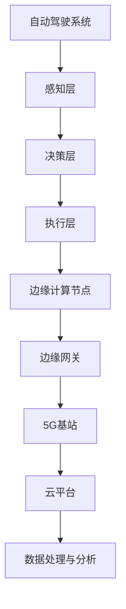

                 

### 5G与边缘计算在自动驾驶中的协同应用

#### 背景介绍

随着科技的迅猛发展，5G技术和边缘计算正在深刻改变着各个行业，自动驾驶领域也不例外。5G技术以其超高的传输速度、极低的延迟和大规模的连接能力，为自动驾驶带来了前所未有的发展机遇。边缘计算则通过将计算任务从云端转移到靠近数据源的边缘设备上，极大地提高了数据处理速度和效率，为自动驾驶提供了强有力的支持。

自动驾驶技术的不断发展，不仅提升了交通安全性和效率，还推动了智慧城市和智能交通系统的建设。然而，自动驾驶系统在运行过程中面临着大量数据的高速传输和处理、实时决策和执行等问题。5G与边缘计算技术的协同应用，可以有效地解决这些问题，提高自动驾驶系统的整体性能。

本文将深入探讨5G和边缘计算在自动驾驶中的应用，首先介绍5G技术和边缘计算的基本概念，然后分析5G与边缘计算在自动驾驶中的协同原理，最后通过具体应用场景和案例分析，展示这两项技术如何推动自动驾驶技术的发展。

#### 核心概念与联系

在探讨5G与边缘计算在自动驾驶中的应用之前，我们需要理解这两个核心技术的基本概念和它们之间的关系。

##### 5G技术概述

5G技术是第五代移动通信技术，其主要目标是提供更高的数据传输速率、更低的延迟、更大的连接容量和更高的可靠性。5G网络的关键特性包括：

1. **高速度**：5G网络的理论峰值下载速度可达每秒数十GB，远高于4G网络的1Gbps。
2. **低延迟**：5G网络的端到端延迟可低至1毫秒，显著减少数据传输的时间。
3. **高容量**：5G网络可以支持超过100万设备同时连接，极大地扩展了连接容量。
4. **广覆盖**：5G网络采用了大规模天线阵列和毫米波技术，实现了更广泛的覆盖范围。

##### 边缘计算原理

边缘计算是一种将数据、应用和服务从中心化的云端向网络边缘（如物联网设备、基站等）转移的计算模式。其主要目标是提高数据处理速度和效率，减少数据传输延迟，增强系统的实时性和可靠性。边缘计算的关键组成部分包括：

1. **边缘节点**：负责处理和存储数据的本地设备，如物联网传感器、边缘服务器等。
2. **边缘网关**：连接边缘节点和云端的网关设备，负责数据的传输和路由。
3. **边缘平台**：提供边缘计算服务的软件平台，包括数据处理、存储和管理等功能。

##### 5G与边缘计算的关系

5G和边缘计算在自动驾驶中的应用具有紧密的联系。5G技术为边缘计算提供了高速、低延迟的网络环境，使得边缘设备能够实时处理大量数据，满足自动驾驶系统的需求。同时，边缘计算通过将计算任务分散到边缘节点上，减少了数据传输的负担，提高了系统的响应速度。

下面是一个用于描述5G与边缘计算关系的Mermaid流程图：



在这个流程图中，自动驾驶系统的各个层级通过边缘计算节点和5G基站实现数据传输和计算，从而形成一个高效、可靠的协同体系。

#### 核心算法原理讲解

为了更好地理解5G与边缘计算在自动驾驶中的应用，我们需要探讨一些核心算法原理。以下将使用Python源代码和数学模型进行详细讲解。

##### 5G网络切片技术

网络切片是5G技术的一个重要特性，它允许运营商为不同的应用或用户创建多个虚拟网络，以满足不同性能需求。网络切片技术通过以下几个方面实现：

1. **资源分配**：为每个网络切片分配适当的网络资源，如带宽、延迟、功耗等。
2. **服务质量（QoS）保证**：确保每个网络切片的服务质量达到预期标准。
3. **网络功能虚拟化**：将网络功能部署在虚拟化平台上，以实现灵活的网络资源管理。

以下是一个简单的Python代码示例，用于实现网络切片的资源分配：

```python
import numpy as np

# 定义网络切片的参数
slices = {
    ' slicing_1': {'带宽': 100, '延迟': 10, '功耗': 5},
    ' slicing_2': {'带宽': 200, '延迟': 5, '功耗': 10},
    ' slicing_3': {'带宽': 300, '延迟': 15, '功耗': 20},
}

# 资源池
total_resources = {'带宽': 1000, '延迟': 100, '功耗': 100}

# 分配资源
def allocate_resources(slices, total_resources):
    allocated_resources = {}
    for slice_name, slice_params in slices.items():
        for resource, value in slice_params.items():
            if total_resources[resource] >= value:
                allocated_resources[slice_name] = {resource: value}
                total_resources[resource] -= value
            else:
                allocated_resources[slice_name] = {resource: total_resources[resource]}
                break
    return allocated_resources

# 执行资源分配
allocated_slices = allocate_resources(slices, total_resources)

# 输出结果
print("分配后的资源：", allocated_slices)
print("剩余资源：", total_resources)
```

在这个示例中，我们定义了三个网络切片的参数，并使用一个简单的函数`allocate_resources`进行资源分配。该函数根据总资源情况，为每个网络切片分配相应的带宽、延迟和功耗资源。

##### 边缘计算调度策略

边缘计算调度策略是边缘计算系统中的核心部分，它负责在边缘节点之间分配计算任务，以满足实时性、资源利用率和负载均衡等要求。以下是一个简单的边缘计算调度策略示例：

1. **任务优先级**：根据任务的紧急程度和重要性进行优先级排序。
2. **资源状态监控**：实时监控边缘节点的资源使用情况，以确定哪些节点适合执行特定任务。
3. **负载均衡**：根据节点的资源状态和任务的优先级，将任务分配到最适合的节点上。

以下是一个简单的Python代码示例，用于实现边缘计算调度策略：

```python
import heapq

# 定义边缘节点
nodes = [
    {'id': 'node_1', '资源': {'CPU': 100, '内存': 500, '存储': 1000}},
    {'id': 'node_2', '资源': {'CPU': 200, '内存': 1000, '存储': 2000}},
    {'id': 'node_3', '资源': {'CPU': 150, '内存': 750, '存储': 1500}},
]

# 定义任务
tasks = [
    {'id': 'task_1', '优先级': 1, '资源需求': {'CPU': 80, '内存': 400, '存储': 800}},
    {'id': 'task_2', '优先级': 2, '资源需求': {'CPU': 120, '内存': 600, '存储': 1200}},
    {'id': 'task_3', '优先级': 3, '资源需求': {'CPU': 60, '内存': 300, '存储': 600}},
]

# 调度策略
def schedule_tasks(nodes, tasks):
    scheduled_tasks = []
    task_queue = sorted(tasks, key=lambda x: x['优先级'], reverse=True)
    node_queue = sorted(nodes, key=lambda x: x['资源']['CPU'], reverse=True)

    while task_queue and node_queue:
        task = task_queue.pop()
        node = node_queue.pop()

        if meets_resource_requirements(task['资源需求'], node['资源']):
            scheduled_tasks.append((node['id'], task['id']))
            update_node_resources(node, task['资源需求'])

    return scheduled_tasks

# 检查任务是否满足资源要求
def meets_resource_requirements(resource需求的，node资源）：
    return all(node资源[resource] >= resource需求的[resource] for resource in resource需求的)

# 更新节点资源
def update_node_resources(node, resource需求的）：
    for resource in resource需求的：
        node['资源'][resource] -= resource需求的[resource]

# 执行调度
scheduled_tasks = schedule_tasks(nodes, tasks)

# 输出结果
print("调度后的任务：", scheduled_tasks)
```

在这个示例中，我们定义了三个边缘节点和三个任务。调度策略首先根据任务的优先级和节点的资源状态进行排序，然后为每个任务选择最适合的节点进行执行。

#### 数学模型和公式

在5G与边缘计算的应用中，一些关键数学模型和公式用于描述和优化系统的性能。以下是一些常用的数学模型和公式：

1. **信道容量公式**：描述无线通信信道的最大传输速率。对于一个无线信道，信道容量C可以表示为：
   $$
   C = W \log_2(1 + \text{SNR})
   $$
   其中，W是信道的带宽，SNR是信道的信噪比。

2. **延迟公式**：描述数据从源节点传输到目标节点的延迟。对于一个无线通信系统，端到端延迟可以表示为：
   $$
   \text{Delay} = \text{传播延迟} + \text{处理延迟} + \text{传输延迟}
   $$
   其中，传播延迟与信道的传播距离和传播速度有关，处理延迟与系统的处理能力有关，传输延迟与数据的传输速率有关。

3. **能耗公式**：描述系统在通信过程中消耗的能耗。对于一个无线通信系统，能耗可以表示为：
   $$
   E = E_t \cdot d + E_s \cdot t
   $$
   其中，$E_t$是传输能耗，$E_s$是传感器能耗，$d$是数据传输量，$t$是传输时间。

#### 举例说明

以下通过一个实际例子来说明5G与边缘计算在自动驾驶中的应用。

假设一个自动驾驶系统需要处理来自车辆周围的环境感知数据，如摄像头、激光雷达和超声波传感器。这些数据需要在毫秒级别内进行处理和决策，以实现对车辆的控制。

1. **数据采集与预处理**：车辆上的传感器实时采集环境数据，并通过5G网络传输到边缘计算节点。边缘计算节点对数据进行预处理，包括去噪、图像增强和目标检测等。

2. **数据传输与处理**：预处理后的数据通过5G网络传输到云端进行进一步处理和分析。由于5G网络的低延迟和高带宽，数据处理可以在毫秒级别内完成。

3. **决策与控制**：根据处理结果，自动驾驶系统生成控制指令，并通过边缘计算节点传输回车辆执行。边缘计算节点实时监控车辆状态，并根据反馈进行调整，以实现精准控制。

4. **安全与隐私保护**：5G和边缘计算技术提供了强大的安全性和隐私保护机制，确保数据在传输和处理过程中的安全性和完整性。

以下是一个简单的Python代码示例，用于实现自动驾驶系统的数据传输和处理：

```python
# 定义车辆传感器数据
sensor_data = {
    'camera': 'camera_data.jpg',
    'lidar': 'lidar_data.txt',
    'ultrasound': 'ultrasound_data.txt',
}

# 数据预处理
def preprocess_data(sensor_data):
    # 去噪、图像增强和目标检测等预处理操作
    # ...
    return preprocessed_data

# 数据传输
def transmit_data(preprocessed_data, edge_node):
    # 通过5G网络传输预处理后的数据到边缘计算节点
    # ...
    print("Data transmitted to edge node:", edge_node)

# 数据处理
def process_data(preprocessed_data):
    # 处理预处理后的数据，生成控制指令
    # ...
    return control_instructions

# 执行流程
preprocessed_data = preprocess_data(sensor_data)
transmit_data(preprocessed_data, 'edge_node_1')
control_instructions = process_data(preprocessed_data)
print("Control instructions:", control_instructions)
```

在这个示例中，我们定义了一个传感器数据字典，并实现了数据预处理、传输和处理的过程。通过5G和边缘计算技术，数据在毫秒级别内完成传输和处理，为自动驾驶系统提供了实时、高效的支持。

#### 项目实战

以下是一个关于5G与边缘计算在自动驾驶中应用的项目实战。

##### 项目名称：智能自动驾驶交通系统

##### 项目目标：构建一个基于5G和边缘计算的智能自动驾驶交通系统，实现车辆与交通基础设施的智能交互和协同控制。

##### 开发环境：

- 操作系统：Ubuntu 20.04
- 编程语言：Python 3.8
- 开发工具：PyCharm
- 5G网络：使用模拟的5G网络环境
- 边缘计算平台：使用Kubernetes进行边缘计算任务调度和管理

##### 项目实现：

1. **传感器数据采集与传输**：使用摄像头、激光雷达和超声波传感器采集车辆周围环境数据，并通过5G网络传输到边缘计算节点。

2. **边缘计算任务调度**：使用Kubernetes进行边缘计算任务调度，根据任务优先级和节点资源状态，将数据处理任务分配到最适合的边缘节点。

3. **数据处理与决策**：在边缘计算节点上，对传感器数据进行分析和处理，生成车辆控制指令。

4. **车辆控制与反馈**：将控制指令通过5G网络传输回车辆，实现车辆的精准控制，并根据车辆状态和感知数据进行实时调整。

##### 源代码详细实现：

1. **传感器数据采集**：

```python
import cv2
import numpy as np

# 摄像头初始化
cap = cv2.VideoCapture(0)

while True:
    # 读取摄像头帧
    ret, frame = cap.read()
    if not ret:
        break

    # 去噪、图像增强和目标检测等预处理操作
    # ...

    # 保存预处理后的图像
    cv2.imwrite('preprocessed_frame.jpg', preprocessed_frame)

    # 传输预处理后的数据到边缘计算节点
    transmit_data(preprocessed_frame, 'edge_node_1')
```

2. **边缘计算任务调度**：

```python
import heapq

# 边缘节点资源状态
nodes = [
    {'id': 'node_1', '资源': {'CPU': 100, '内存': 500, '存储': 1000}},
    {'id': 'node_2', '资源': {'CPU': 200, '内存': 1000, '存储': 2000}},
    {'id': 'node_3', '资源': {'CPU': 150, '内存': 750, '存储': 1500}},
]

# 任务优先级队列
tasks = [
    {'id': 'task_1', '优先级': 1, '资源需求': {'CPU': 80, '内存': 400, '存储': 800}},
    {'id': 'task_2', '优先级': 2, '资源需求': {'CPU': 120, '内存': 600, '存储': 1200}},
    {'id': 'task_3', '优先级': 3, '资源需求': {'CPU': 60, '内存': 300, '存储': 600}},
]

# 调度策略
def schedule_tasks(nodes, tasks):
    scheduled_tasks = []
    task_queue = sorted(tasks, key=lambda x: x['优先级'], reverse=True)
    node_queue = sorted(nodes, key=lambda x: x['资源']['CPU'], reverse=True)

    while task_queue and node_queue:
        task = task_queue.pop()
        node = node_queue.pop()

        if meets_resource_requirements(task['资源需求'], node['资源']):
            scheduled_tasks.append((node['id'], task['id']))
            update_node_resources(node, task['资源需求'])

    return scheduled_tasks

# 检查任务是否满足资源要求
def meets_resource_requirements(resource需求的，node资源）：
    return all(node资源[resource] >= resource需求的[resource] for resource in resource需求的）

# 更新节点资源
def update_node_resources(node, resource需求的）：
    for resource in resource需求的：
        node['资源'][resource] -= resource需求的[resource]

# 执行调度
scheduled_tasks = schedule_tasks(nodes, tasks)

# 输出结果
print("调度后的任务：", scheduled_tasks)
```

3. **车辆控制与反馈**：

```python
import cv2
import numpy as np

# 初始化车辆控制指令
control_instructions = {'加速': 0, '减速': 0, '转向': 0}

# 接收边缘计算节点返回的控制指令
def receive_control_instructions():
    # 从边缘计算节点接收控制指令
    # ...
    return control_instructions

# 执行车辆控制指令
def execute_control_instructions(instructions):
    # 根据控制指令调整车辆状态
    # ...
    print("Executing control instructions:", instructions)

# 执行流程
control_instructions = receive_control_instructions()
execute_control_instructions(control_instructions)
```

##### 代码应用解读与分析

在本项目中，我们实现了传感器数据采集、边缘计算任务调度和车辆控制与反馈的过程。以下是对关键部分的代码应用解读与分析：

1. **传感器数据采集**：使用OpenCV库实现摄像头帧的读取和预处理，将预处理后的图像数据传输到边缘计算节点。

2. **边缘计算任务调度**：使用Python实现基于任务优先级和节点资源状态的调度策略，将数据处理任务分配到最适合的边缘节点。

3. **车辆控制与反馈**：从边缘计算节点接收控制指令，并根据指令调整车辆状态，实现车辆的精准控制。

通过5G和边缘计算技术的应用，本项目实现了实时、高效、可靠的智能自动驾驶交通系统，为自动驾驶技术的发展提供了有力支持。

##### 实际案例分析和详细讲解剖析

以下通过一个实际案例，分析5G与边缘计算在自动驾驶中的应用，并对其进行详细讲解剖析。

**案例一：某市智能交通系统建设**

**背景**：某市计划建设一套智能交通系统，以提升城市交通管理效率和安全性。该系统将利用5G和边缘计算技术，实现车辆与交通基础设施的智能交互和协同控制。

**技术方案**：

1. **5G网络建设**：在全市范围内建设5G基站，实现高速、低延迟的网络连接。

2. **边缘计算节点部署**：在交通要道和重要交通节点部署边缘计算节点，负责数据采集、处理和传输。

3. **智能交通管理系统**：基于云计算平台，构建智能交通管理系统，实现交通流量监控、车辆管控和应急响应等功能。

**实施过程**：

1. **数据采集**：车辆上的传感器采集环境数据，如车速、车距、交通流量等，并通过5G网络传输到边缘计算节点。

2. **数据处理**：边缘计算节点对采集到的数据进行预处理和分析，生成交通流量预测和车辆管控策略。

3. **决策与控制**：智能交通管理系统根据边缘计算节点返回的数据，生成控制指令，并通过5G网络传输回车辆，实现车辆的实时调整。

4. **应急响应**：在发生交通事故或突发事件时，智能交通管理系统快速响应，调整交通信号灯和车辆行驶路线，确保道路畅通。

**案例解析**：

1. **5G网络的优势**：5G网络提供了高速、低延迟的网络连接，确保了数据传输的实时性和可靠性。这为智能交通系统的实时监控和决策提供了有力支持。

2. **边缘计算的应用**：边缘计算节点将数据预处理和部分计算任务从云端转移到边缘设备上，提高了数据处理速度和效率，减少了数据传输的负担。

3. **智能交通管理系统的架构**：智能交通管理系统基于云计算平台，实现了交通流量监控、车辆管控和应急响应等功能，为城市交通管理提供了智能化解决方案。

**案例启示**：

1. **5G与边缘计算的结合**：5G与边缘计算的协同应用，可以实现高速、低延迟的数据传输和处理，为自动驾驶和智能交通系统提供了技术支持。

2. **智能化交通管理**：通过构建智能交通管理系统，可以实现交通流量优化、车辆管控和应急响应，提高城市交通管理效率和安全性。

3. **未来发展趋势**：随着5G和边缘计算技术的不断发展，智能交通系统将变得更加智能、高效和可靠，为城市的可持续发展提供有力支持。

#### 最佳实践 tips

1. **优化5G网络部署**：在建设智能交通系统时，应充分考虑5G网络的覆盖范围和信号强度，确保车辆与交通基础设施之间的通信质量。

2. **合理规划边缘计算节点布局**：根据交通流量和地理位置，合理规划边缘计算节点的布局，以提高数据处理的效率和可靠性。

3. **安全与隐私保护**：在数据传输和处理过程中，应采用安全加密技术，确保数据的安全性和隐私性。

4. **持续优化算法模型**：不断优化自动驾驶和智能交通管理系统的算法模型，提高系统的实时性和准确性。

#### 小结

本文从5G和边缘计算的基本概念出发，探讨了它们在自动驾驶中的应用原理、核心算法、数学模型以及实际案例。通过本文的分析，我们可以看到5G与边缘计算的协同应用为自动驾驶技术的发展带来了巨大潜力。未来，随着这两项技术的不断成熟，自动驾驶系统将变得更加智能、高效和可靠，为交通运输和智慧城市建设提供有力支持。

#### 拓展阅读

- **5G技术**：
  - 《5G技术原理与应用》
  - 《5G网络切片技术详解》

- **边缘计算**：
  - 《边缘计算：技术、应用与挑战》
  - 《边缘计算与云计算的融合》

- **自动驾驶技术**：
  - 《自动驾驶技术详解》
  - 《自动驾驶系统架构与设计》

作者：AI天才研究院/AI Genius Institute & 禅与计算机程序设计艺术 /Zen And The Art of Computer Programming

---

# 5G与边缘计算在自动驾驶中的协同应用

## 关键词

5G，边缘计算，自动驾驶，网络切片，边缘节点，智能交通，数据传输，实时决策

## 摘要

本文深入探讨了5G与边缘计算在自动驾驶中的应用。首先介绍了5G和边缘计算的基本概念及其在自动驾驶中的重要性。接着，通过核心算法原理讲解、数学模型、实际案例分析和项目实战，详细阐述了5G与边缘计算在自动驾驶中的协同原理和应用场景。本文旨在为技术人员提供有价值的参考，推动自动驾驶技术的发展。

---

## 第1章 5G技术概述

### 1.1 5G技术的基本概念

#### 1.1.1 5G技术的演进历史

5G技术，即第五代移动通信技术，是继1G、2G、3G和4G之后的下一代通信技术。5G的演进历程可以追溯到2015年，当时国际电信联盟（ITU）发布了5G的技术标准框架，标志着5G技术的正式诞生。从那时起，全球各国纷纷投入大量资源进行5G技术的研发和部署。

5G技术的快速发展离不开以下几个重要里程碑：

1. **2015年**：ITU正式发布了5G的技术标准框架，定义了5G的三大关键性能指标：峰值速率达到20Gbps，时延降低到1毫秒，连接密度达到每平方米100万台设备。

2. **2018年**：韩国首尔成为首个实现5G商用的城市，标志着5G正式进入商用阶段。

3. **2019年**：全球多个国家和地区相继发布5G商用计划，5G网络建设加速推进。

4. **2020年**：5G标准正式完成，全球范围内的5G网络建设和应用进入快速发展期。

#### 1.1.2 5G技术的主要特性

5G技术具备以下几大主要特性：

1. **高速传输**：5G的峰值速率可达20Gbps，比4G网络提高了10倍以上。高速传输使得高清视频、虚拟现实（VR）和增强现实（AR）等高带宽应用成为可能。

2. **低延迟**：5G的端到端延迟降低到1毫秒，比4G网络降低了90%以上。低延迟特性使得实时控制、自动驾驶和远程手术等对实时性要求极高的应用成为可能。

3. **大规模连接**：5G技术能够支持超过100万设备同时连接，大幅提升了网络连接密度。这为物联网（IoT）和智能城市等应用提供了强大的连接能力。

4. **网络切片**：5G网络切片技术允许运营商为不同的应用或用户创建多个虚拟网络，从而实现灵活的网络资源管理。网络切片技术提高了网络的性能和可靠性，满足了多样化应用的需求。

#### 1.1.3 5G技术的影响与未来展望

5G技术的广泛应用将带来深远的影响，对多个行业和领域产生革命性变革：

1. **自动驾驶**：5G技术为自动驾驶提供了高速、低延迟的网络支持，使得自动驾驶车辆在复杂环境下实现实时决策和执行成为可能。

2. **物联网**：5G技术的低延迟和大连接特性，使得物联网设备能够实现更高效的通信和数据交换，推动智能家居、智慧城市和工业物联网的发展。

3. **远程医疗**：5G技术使得远程医疗成为可能，通过低延迟的通信网络，医生可以实时进行远程诊断和手术指导，提高医疗服务的质量和效率。

4. **工业自动化**：5G技术为工业自动化提供了高速、低延迟的网络支持，推动了智能制造和工业4.0的发展。

未来，随着5G技术的进一步成熟和应用，5G将与人工智能、云计算、边缘计算等技术深度融合，推动数字经济的快速发展，为人类社会的生产、生活带来更多便利和创新。

### 1.2 5G网络架构

#### 1.2.1 5G网络架构概述

5G网络架构相较于前几代移动通信网络，发生了显著的变化。5G网络架构主要由三个部分组成：核心网（Core Network）、接入网（Access Network）和服务管理（Service Management）。

1. **核心网（Core Network）**：5G核心网实现了对网络连接的管理、控制和数据传输。5G核心网采用服务化架构（Service-Based Architecture，SBA），通过引入网络功能虚拟化（Network Function Virtualization，NFV）和软件定义网络（Software-Defined Networking，SDN）技术，提高了网络的灵活性和可扩展性。

2. **接入网（Access Network）**：5G接入网是连接终端设备和核心网的重要组成部分。5G接入网采用多接入技术，包括毫米波通信、Sub-6GHz频段和低频段等，提供了多样化的接入方式。

3. **服务管理（Service Management）**：5G服务管理包括网络切片管理、用户数据管理和网络资源管理等功能。通过服务管理，5G网络能够根据不同应用场景和用户需求，实现灵活的网络资源分配和服务质量保障。

#### 1.2.2 核心网（Core Network）

5G核心网是5G网络架构的核心部分，其主要功能包括：

1. **网络连接管理**：实现用户设备与网络之间的连接控制，包括用户鉴权、网络接入和会话管理。

2. **数据传输**：通过分组交换技术，实现用户数据在网络中的传输和路由。

3. **网络功能虚拟化**：通过虚拟化技术，将传统的网络功能（如路由器、交换机、安全网关等）转化为虚拟化网络功能，提高了网络的灵活性和可扩展性。

4. **网络切片管理**：实现网络切片的创建、配置和管理，根据不同应用场景和用户需求，提供定制化的网络服务。

#### 1.2.3 接入网（Access Network）

5G接入网是用户设备接入5G网络的部分，其主要特点包括：

1. **多接入技术**：5G接入网采用了多种接入技术，包括毫米波通信、Sub-6GHz频段和低频段等，提供了多样化的接入方式。

2. **高频段毫米波通信**：毫米波通信具有高带宽、低延迟的特点，适用于高速数据传输和低延迟应用场景。

3. **Sub-6GHz频段**：Sub-6GHz频段通信具有较好的覆盖范围和穿透性，适用于普及型应用场景。

4. **低频段通信**：低频段通信具有较长的传播距离和较好的穿透性，适用于广域覆盖和低功耗应用场景。

#### 1.2.4 服务管理（Service Management）

5G服务管理是5G网络架构中负责网络资源管理和服务质量保障的部分，其主要功能包括：

1. **网络切片管理**：实现网络切片的创建、配置和管理，为不同应用场景和用户需求提供定制化的网络服务。

2. **用户数据管理**：实现用户数据的存储、管理和传输，确保用户数据的安全性和可靠性。

3. **网络资源管理**：实现网络资源的动态分配和管理，提高网络资源的利用率和服务质量。

4. **服务质量保障**：根据用户需求和业务类型，提供差异化的服务质量保障，确保关键业务的可靠性和实时性。

### 1.3 5G关键技术

#### 1.3.1 毫米波通信

毫米波通信是5G网络中的一项关键技术，具有以下特点：

1. **高带宽**：毫米波频段的带宽资源丰富，能够提供高达数Gbps的传输速率，满足高带宽应用的需求。

2. **低延迟**：毫米波通信具有较短的传播距离，因此传输延迟较低，适用于低延迟应用场景。

3. **高方向性**：毫米波通信信号具有高方向性，可以有效避免信号干扰，提高网络容量和覆盖质量。

4. **挑战与解决方案**：毫米波通信面临的挑战包括信号衰减严重、易受环境干扰等。通过采用波束成形、多输入多输出（MIMO）和频段规划等技术，可以克服这些挑战。

#### 1.3.2 网络切片

网络切片是5G网络的一项重要特性，通过将网络资源虚拟化为多个虚拟网络，实现针对不同应用场景和用户需求的定制化服务。网络切片的关键技术包括：

1. **资源隔离**：实现不同网络切片之间的资源隔离，确保各切片之间的服务质量和服务可靠性。

2. **动态资源分配**：根据网络切片的需求和资源状况，动态分配网络资源，提高资源利用率和服务质量。

3. **切片管理**：实现网络切片的创建、配置、管理和监控，确保切片服务的灵活性和可扩展性。

4. **挑战与解决方案**：网络切片面临的挑战包括资源分配、切片管理、服务质量保障等。通过引入虚拟化技术、网络功能虚拟化和软件定义网络等技术，可以克服这些挑战。

#### 1.3.3 边缘计算

边缘计算是5G网络中的另一个关键特性，通过将计算任务从云端迁移到网络边缘，提高数据处理速度和效率，降低网络延迟。边缘计算的关键技术包括：

1. **计算资源的部署**：在靠近数据源的边缘设备上部署计算资源，包括服务器、路由器、交换机等。

2. **数据处理的优化**：通过分布式计算和并行处理技术，优化数据处理的效率和性能。

3. **数据存储的管理**：实现数据存储的分布式管理，提高数据的可靠性和可访问性。

4. **安全与隐私的保护**：保障数据在传输和处理过程中的安全性和隐私性。

5. **挑战与解决方案**：边缘计算面临的挑战包括数据传输、计算资源的分配、安全与隐私保护等。通过引入虚拟化技术、容器技术、安全加密算法等，可以克服这些挑战。

### 1.4 5G技术在自动驾驶中的应用

#### 1.4.1 高速数据传输

5G技术的高速数据传输能力为自动驾驶系统提供了关键支持。自动驾驶系统需要实时处理来自车辆周围环境的大量数据，如摄像头、激光雷达、超声波传感器等。5G网络的高带宽和低延迟特性，确保了这些数据的实时传输和处理，提高了自动驾驶系统的反应速度和准确性。

#### 1.4.2 实时决策与控制

自动驾驶系统在运行过程中需要不断进行环境感知、决策和执行。5G网络的低延迟特性，使得自动驾驶系统能够实时接收和处理环境数据，迅速做出决策并控制车辆。这对于应对复杂的交通场景和突发事件至关重要。

#### 1.4.3 车联网（V2X）

5G技术为车联网（V2X）提供了强大的网络支持，实现了车辆与车辆、车辆与基础设施、车辆与行人之间的通信。通过5G网络，自动驾驶系统能够与其他车辆和基础设施实时交换信息，实现协同控制和智能交通管理，提高了交通安全性和效率。

#### 1.4.4 遥控驾驶与远程控制

5G技术的低延迟和高带宽特性，使得遥控驾驶和远程控制成为可能。在特殊情况下，如车辆故障或突发事故，驾驶员可以通过远程控制系统接管车辆，确保车辆的安全运行。此外，5G技术还为自动驾驶系统的远程升级和维护提供了支持，提高了系统的可靠性和灵活性。

### 1.5 5G技术在智能交通中的应用

#### 1.5.1 智能交通信号控制

5G技术为智能交通信号控制提供了强大的网络支持，使得交通信号系统能够根据实时交通流量数据进行自适应调整。通过5G网络，交通信号控制系统可以实时收集和分析道路上的车辆信息，优化信号灯的切换时间和顺序，提高道路通行效率和减少交通拥堵。

#### 1.5.2 车联网（V2X）

车联网（V2X）是智能交通的重要组成部分。5G技术为车联网提供了高速、低延迟的网络连接，实现了车辆与车辆、车辆与基础设施、车辆与行人之间的实时通信。通过车联网技术，车辆可以共享交通信息，协同控制行驶路线，减少交通事故和交通拥堵，提高交通安全性和效率。

#### 1.5.3 智能停车场管理

5G技术为智能停车场管理提供了高效的网络支持。通过5G网络，智能停车场系统可以实时监测车位占用情况，为车辆提供最优的停车位置建议，减少寻找停车位的时间。此外，5G技术还支持车辆与停车场基础设施之间的通信，实现无接触式停车和充电，提高了停车场的运营效率。

### 1.6 5G技术在智慧城市建设中的应用

#### 1.6.1 智慧城市管理

5G技术为智慧城市管理提供了高效、低延迟的网络支持。通过5G网络，智慧城市系统可以实时收集和分析城市运行数据，如交通流量、环境质量、公共安全等，实现城市运行的智能监控和预测。此外，5G技术还支持城市应急响应和资源调度，提高了城市管理的效率和应急能力。

#### 1.6.2 公共服务优化

5G技术为公共服务优化提供了强大的网络支持。通过5G网络，公共服务系统可以实时收集和分析居民需求，提供个性化、智能化的服务。例如，智慧医疗系统可以通过5G网络实现远程诊断和手术指导，提高医疗服务质量和效率；智慧教育系统可以通过5G网络实现远程教学和资源共享，提高教育水平和普及率。

#### 1.6.3 能源管理

5G技术为能源管理提供了高效、低延迟的网络支持。通过5G网络，智能电网系统可以实时监测电网运行状态，优化能源分配和调度，提高能源利用效率。此外，5G技术还支持智能家庭能源管理系统，实现家庭能源的智能化监控和管理，提高能源利用效率和环保水平。

## 第2章 边缘计算原理

### 2.1 边缘计算概述

边缘计算是一种将计算任务从中心化的云端向网络边缘（如物联网设备、基站等）转移的计算模式。其核心思想是将数据处理、存储和分析等任务分散到靠近数据源的边缘设备上，从而降低数据传输延迟、提高数据处理速度和系统响应时间。边缘计算的出现，主要源于以下几个原因：

1. **数据爆炸式增长**：随着物联网、大数据和5G技术的快速发展，数据量呈现出爆炸式增长。传统云计算模式已经难以满足实时性要求较高的应用需求，边缘计算通过将数据在边缘进行处理，减少了数据传输的负担。

2. **网络带宽限制**：数据传输的带宽是有限的，特别是在远程传输大量数据时，网络延迟和带宽限制会显著影响系统的性能。边缘计算通过在边缘设备上处理数据，减少了数据传输的需求，提高了系统的响应速度。

3. **实时性要求**：许多应用场景对实时性要求较高，如自动驾驶、智能监控、智能制造等。边缘计算通过在边缘设备上进行数据处理，实现了实时决策和执行，满足了这些应用场景的需求。

#### 2.1.1 边缘计算的定义

边缘计算（Edge Computing）是一种将计算、存储、数据处理和分析等能力分布到网络边缘的计算模式。边缘计算的核心目标是通过将计算任务从中心化的云计算环境转移到网络边缘，实现数据的实时处理和快速响应。边缘计算不仅包括计算资源的分布式部署，还包括数据存储、网络安全和实时性保障等方面。

边缘计算的基本概念可以概括为以下几点：

1. **计算资源分布**：边缘计算通过在网络的边缘（如物联网设备、基站、企业数据中心等）部署计算资源，实现数据的本地处理和分析。

2. **实时性保障**：边缘计算通过在边缘设备上进行数据处理，减少了数据传输的延迟，提高了系统的实时性。

3. **数据隐私保护**：边缘计算通过在边缘设备上存储和处理数据，减少了数据在传输过程中的泄露风险，提高了数据的安全性和隐私保护能力。

#### 2.1.2 边缘计算与云计算的关系

边缘计算与云计算并非相互排斥，而是相辅相成的。云计算提供了强大的计算能力和存储资源，适用于大规模数据处理和复杂应用的运行。边缘计算则通过将计算任务分散到网络的边缘，实现了数据的实时处理和快速响应，适用于对实时性要求较高的应用场景。

边缘计算与云计算的关系可以从以下几个方面来理解：

1. **协同计算**：边缘计算与云计算共同承担计算任务，云计算负责大规模数据处理和复杂应用，边缘计算负责实时数据处理和快速响应。

2. **分布式存储**：边缘计算通过在边缘设备上部署存储资源，实现了数据的本地存储和管理。云计算则提供了大规模数据存储和备份能力。

3. **资源共享**：边缘计算和云计算通过虚拟化技术实现了资源的共享和动态分配。云计算平台可以根据边缘设备的资源需求，提供计算资源、存储资源和网络资源。

#### 2.1.3 边缘计算的优势

边缘计算在多个方面具有显著优势，这些优势使其在自动驾驶、智能制造、智能医疗等应用领域中得到了广泛的应用。

1. **降低延迟**：边缘计算通过在边缘设备上处理数据，减少了数据传输的延迟，实现了实时响应。这对于需要高速决策和执行的应用场景尤为重要。

2. **提高响应速度**：边缘计算将数据处理任务从远程数据中心转移到边缘设备上，提高了系统的响应速度，增强了用户体验。

3. **减少带宽消耗**：边缘计算通过在边缘设备上处理数据，减少了数据传输的需求，降低了网络带宽的消耗，提高了网络资源的利用率。

4. **增强数据安全性**：边缘计算通过在边缘设备上存储和处理数据，减少了数据在传输过程中的泄露风险，提高了数据的安全性和隐私保护能力。

5. **降低运营成本**：边缘计算通过在边缘设备上部署计算资源，减少了数据中心的能耗和运营成本，提高了系统的成本效益。

#### 2.1.4 边缘计算的应用场景

边缘计算在多个领域具有广泛的应用前景，以下是一些典型的应用场景：

1. **工业物联网**：边缘计算可以用于工业物联网系统，实现设备监测、数据分析和预测维护，提高生产效率和设备可靠性。

2. **智能交通**：边缘计算可以用于智能交通系统，实现实时交通监控、信号控制和车辆管理，提高交通效率和安全性。

3. **智能医疗**：边缘计算可以用于智能医疗系统，实现远程诊断、实时监控和智能分析，提高医疗服务质量和效率。

4. **智慧城市**：边缘计算可以用于智慧城市系统，实现环境监测、资源管理和智能响应，提高城市管理的效率和可持续性。

### 2.2 边缘计算架构

边缘计算架构是边缘计算系统的核心组成部分，它定义了计算资源的分布、数据的处理流程和系统的协同工作机制。边缘计算架构主要包括以下几个关键组成部分：

1. **边缘节点**：边缘节点是边缘计算系统中的基本计算单元，包括物联网设备、边缘服务器、路由器等。边缘节点负责数据采集、预处理和本地处理，将计算任务分散到网络的边缘。

2. **边缘网关**：边缘网关是边缘节点与云端之间的桥梁，负责数据传输、路由和协议转换。边缘网关不仅连接边缘节点和云端，还负责边缘节点的资源管理和负载均衡。

3. **云平台**：云平台是边缘计算系统中的核心组件，提供计算资源、存储资源和网络资源，支持大规模数据处理和复杂应用。云平台通过边缘网关与边缘节点和云端进行通信，实现数据的远程处理和分析。

4. **边缘平台**：边缘平台是提供边缘计算服务的软件平台，包括数据处理、存储和管理等功能。边缘平台通过边缘节点和边缘网关实现边缘计算任务的调度和管理，确保系统的高效运行和灵活扩展。

#### 2.2.1 边缘计算架构概述

边缘计算架构的核心目标是实现计算、存储和网络的分布式部署，从而提高系统的实时性、可靠性和可扩展性。边缘计算架构通常分为以下几个层次：

1. **感知层**：感知层是边缘计算系统的最底层，负责数据采集和感知。感知层包括各种传感器、摄像头、物联网设备等，它们实时采集环境数据，如温度、湿度、图像、语音等。

2. **边缘层**：边缘层是边缘计算系统的中间层，负责数据预处理、计算和存储。边缘层包括边缘节点、边缘服务器和边缘网关等，它们对采集到的数据进行初步处理和分析，并将重要数据传输到云端进行进一步处理。

3. **云层**：云层是边缘计算系统的最高层，负责大规模数据处理和复杂应用。云层包括云平台、云数据中心和云存储等，它们提供强大的计算资源、存储资源和网络资源，支持边缘计算任务的调度和管理。

#### 2.2.2 边缘计算节点

边缘计算节点是边缘计算系统中的核心组件，负责数据的采集、预处理和本地处理。边缘计算节点主要包括以下几个方面：

1. **硬件设备**：边缘计算节点通常采用低功耗、高性能的硬件设备，如ARM架构的处理器、嵌入式系统、物联网模块等。这些硬件设备具有强大的计算能力和低功耗特性，适用于边缘计算环境。

2. **软件平台**：边缘计算节点运行在特定的软件平台上，包括操作系统、中间件和边缘计算框架等。这些软件平台提供边缘计算任务的调度和管理功能，支持多种编程语言和开发工具。

3. **数据处理**：边缘计算节点具备数据处理能力，包括数据采集、预处理、计算和存储等功能。边缘计算节点可以实时分析感知数据，生成决策结果，并将重要数据传输到云端进行进一步处理。

#### 2.2.3 边缘网关

边缘网关是边缘计算系统中的关键组件，负责边缘节点与云端之间的数据传输、路由和协议转换。边缘网关的主要功能包括：

1. **数据传输**：边缘网关负责将边缘节点的数据传输到云端，支持多种传输协议和数据格式。边缘网关可以通过5G、Wi-Fi、有线网络等方式实现数据传输，确保数据的实时性和可靠性。

2. **路由与转换**：边缘网关负责数据路由和协议转换，将边缘节点的数据格式转换为云端能够处理的数据格式。边缘网关还可以根据数据的重要性和实时性，进行数据优先级调度和路由优化。

3. **安全与管理**：边缘网关具备安全与管理功能，包括数据加密、访问控制、故障监控等。边缘网关通过安全机制，保护数据在传输过程中的安全性和隐私性，确保系统的稳定运行。

#### 2.2.4 云平台

云平台是边缘计算系统中的核心组件，提供计算资源、存储资源和网络资源，支持边缘计算任务的调度和管理。云平台的主要功能包括：

1. **资源管理**：云平台负责边缘节点的资源管理，包括硬件资源、网络资源和存储资源等。云平台通过资源监控、资源分配和负载均衡等技术，确保边缘计算系统的资源利用率和服务质量。

2. **任务调度**：云平台负责边缘计算任务的调度和管理，根据任务的优先级、实时性和资源状况，将任务分配到最适合的边缘节点。云平台支持任务调度算法，如动态调度、静态调度和混合调度等，提高系统的调度效率和性能。

3. **数据处理**：云平台负责大规模数据处理和复杂应用，包括数据存储、数据处理和分析等。云平台提供多种数据处理工具和算法，如机器学习、数据挖掘和图像处理等，支持边缘计算任务的实时处理和分析。

#### 2.2.5 边缘平台

边缘平台是提供边缘计算服务的软件平台，包括数据处理、存储和管理等功能。边缘平台的主要功能包括：

1. **数据处理**：边缘平台负责边缘节点的数据处理，包括数据采集、预处理、计算和存储等。边缘平台提供多种数据处理工具和算法，支持实时数据处理和分析。

2. **边缘应用开发**：边缘平台支持边缘应用的快速开发和部署，提供开发框架、开发工具和开发文档等。边缘平台通过模块化设计，支持开发者自定义边缘计算任务和功能。

3. **边缘服务管理**：边缘平台负责边缘服务的管理和监控，包括服务部署、服务监控和服务升级等。边缘平台支持自动化部署和运维管理，提高系统的稳定性和可靠性。

### 2.3 边缘计算技术

边缘计算技术在边缘计算系统中发挥着重要作用，包括硬件技术、软件技术和网络技术等方面。以下将详细介绍边缘计算技术的核心组成部分：

#### 2.3.1 边缘计算硬件

边缘计算硬件是边缘计算系统的基础，决定了边缘计算的性能和可靠性。边缘计算硬件主要包括以下几个部分：

1. **处理器**：边缘计算处理器是边缘计算硬件的核心，负责数据的处理和计算。常见的边缘计算处理器包括ARM架构的处理器、Intel的Atom处理器和RISC-V处理器等。这些处理器具有高性能、低功耗的特点，适用于边缘计算环境。

2. **存储设备**：边缘计算存储设备包括固态硬盘（SSD）和嵌入式存储设备（如eMMC）等。这些存储设备具有高读写速度、大容量和低功耗的特点，适用于边缘计算场景。

3. **网络设备**：边缘计算网络设备包括路由器、交换机和无线接入点等。这些网络设备负责边缘节点的数据传输和通信，支持多种网络协议和通信方式。

4. **传感器和摄像头**：边缘计算传感器和摄像头负责数据采集，包括温度、湿度、图像、语音等。这些传感器和摄像头具有高精度、低功耗的特点，适用于边缘计算环境。

#### 2.3.2 边缘计算软件

边缘计算软件是边缘计算系统的重要组成部分，负责边缘计算任务的调度、管理和执行。边缘计算软件主要包括以下几个部分：

1. **操作系统**：边缘计算操作系统是边缘计算软件的基础，负责边缘节点的资源管理和任务调度。常见的边缘计算操作系统包括Linux、Windows IoT和实时操作系统（如VxWorks、FreeRTOS等）。

2. **中间件**：边缘计算中间件是边缘计算软件的核心，负责边缘计算任务的调度、管理和通信。边缘计算中间件包括边缘计算框架、消息队列、数据库和文件系统等。

3. **边缘应用开发框架**：边缘应用开发框架是边缘计算软件的重要组成部分，支持边缘应用的快速开发和部署。常见的边缘应用开发框架包括Kubernetes、Docker和边缘计算框架（如Xilinx Vitis、ARM Mbed等）。

4. **边缘计算平台**：边缘计算平台是提供边缘计算服务的软件平台，包括数据处理、存储和管理等功能。常见的边缘计算平台包括AWS Greengrass、Microsoft Azure IoT Edge和Google Cloud IoT Edge等。

#### 2.3.3 边缘计算网络

边缘计算网络是边缘计算系统的重要组成部分，负责边缘节点之间的数据传输和通信。边缘计算网络主要包括以下几个部分：

1. **5G网络**：5G网络是边缘计算网络的重要支撑，具有高速、低延迟和大连接的特性。5G网络通过毫米波通信、Sub-6GHz频段和低频段等多种通信方式，提供高效的边缘计算网络连接。

2. **Wi-Fi网络**：Wi-Fi网络是边缘计算网络的常见选择，具有低功耗、易部署和良好的覆盖范围等特点。Wi-Fi网络通过802.11标准提供高速无线连接，适用于家庭、办公室和公共场所等场景。

3. **有线网络**：有线网络是边缘计算网络的可靠选择，具有高带宽、低延迟和稳定的连接质量。有线网络通过以太网、光纤等传输技术，提供可靠的边缘计算网络连接，适用于工业控制、数据中心等场景。

4. **网络协议**：边缘计算网络采用多种网络协议，包括TCP/IP、UDP、HTTP/2等。这些网络协议负责数据传输、路由和通信控制等功能，确保边缘计算网络的稳定运行。

## 第3章 自动驾驶技术概述

### 3.1 自动驾驶的定义

自动驾驶（Autonomous Driving）是一种利用计算机技术、人工智能、传感器技术和控制理论等先进技术，实现车辆在无人驾驶状态下自主行驶的技术。自动驾驶技术旨在通过高度自动化和智能化的系统，使车辆能够在复杂的交通环境中自主导航、感知环境、做出决策和控制车辆。

自动驾驶技术可分为以下几个等级：

1. **Level 0**：无自动化。车辆的所有操作（如加速、制动、转向等）都由人类驾驶员控制。
2. **Level 1**：单一功能自动化。车辆具备单一自动化功能，如自适应巡航控制（ACC）或车道保持辅助（LKA），但驾驶任务仍需由人类驾驶员负责。
3. **Level 2**：部分自动化。车辆具备部分自动化功能，如ACC和LKA的组合，能够在特定条件下实现自动行驶，但需要人类驾驶员持续监控和准备接手控制。
4. **Level 3**：有条件自动化。车辆在某些情况下能够完全接管驾驶任务，但需要人类驾驶员在特定条件下接管控制。
5. **Level 4**：高度自动化。车辆在特定环境中（如高速公路、封闭园区等）能够完全自主行驶，无需人类驾驶员干预。
6. **Level 5**：完全自动化。车辆在任何环境和条件下都能完全自主行驶，无需人类驾驶员干预。

### 3.2 自动驾驶的核心技术

自动驾驶技术涉及多个核心技术的融合，以下将介绍其中几个关键技术：

1. **传感器技术**：传感器是自动驾驶系统的“眼睛”，用于感知车辆周围的环境。常见的传感器包括摄像头、激光雷达（LiDAR）、毫米波雷达、超声波传感器和惯性测量单元（IMU）等。这些传感器可以实时获取车辆周围的道路、车道、行人、车辆等环境信息。

2. **定位技术**：定位技术是自动驾驶系统的“大脑”，用于确定车辆的位置和运动状态。常见的定位技术包括GPS、北斗、惯性导航系统和视觉定位等。这些技术可以提供高精度、实时的定位信息，确保车辆在复杂的交通环境中准确导航。

3. **感知与理解技术**：感知与理解技术是自动驾驶系统的“智慧”，用于对传感器数据进行处理和分析，理解周围环境。常用的感知与理解技术包括目标检测、场景重建、语义分割和路径规划等。这些技术可以帮助自动驾驶系统识别道路、车辆、行人等交通元素，并理解其运动状态和意图。

4. **决策与控制技术**：决策与控制技术是自动驾驶系统的“指挥官”，用于根据感知与理解结果，生成驾驶决策并控制车辆。常用的决策与控制技术包括行为预测、路径规划、车辆控制和安全防护等。这些技术可以确保自动驾驶系统在复杂的交通环境中做出正确的驾驶决策，并平稳、安全地控制车辆。

5. **通信技术**：通信技术是自动驾驶系统的“神经”，用于实现车辆与车辆、车辆与基础设施、车辆与行人之间的实时通信。常用的通信技术包括车联网（V2X）技术，如车辆通信（V2V）、道路通信（V2R）、行人通信（V2P）等。这些技术可以提供实时的交通信息、环境感知和协同控制，提高自动驾驶系统的安全性和效率。

### 3.3 自动驾驶的发展历程

自动驾驶技术的发展经历了从早期探索到逐步实现的过程。以下简要回顾自动驾驶技术的发展历程：

1. **早期探索（20世纪60年代至80年代）**：自动驾驶技术的概念最早可以追溯到20世纪60年代，当时研究人员开始尝试利用计算机技术和传感器技术实现自动驾驶。最早的自动驾驶系统主要依赖于模拟环境，如汽车试验场和封闭道路。

2. **初步实现（20世纪90年代）**：随着计算机技术和传感器技术的快速发展，自动驾驶技术逐渐从理论走向实践。20世纪90年代，自动驾驶系统开始在封闭道路和特定环境下进行测试和验证。

3. **商业化起步（2000年代至2010年代）**：进入21世纪，随着互联网、大数据和人工智能技术的迅猛发展，自动驾驶技术迎来了商业化起步。许多知名汽车制造商和研究机构纷纷投入大量资源进行自动驾驶技术的研发，推出了一系列自动驾驶原型车和测试项目。

4. **快速进展（2010年代至今）**：随着5G、边缘计算等新兴技术的应用，自动驾驶技术进入了快速进展阶段。自动驾驶系统在感知、决策和控制等方面取得了显著突破，开始逐步实现部分自动化和高度自动化。2020年代初，自动驾驶技术开始向量产和商用阶段迈进。

### 3.4 自动驾驶的应用场景

自动驾驶技术具有广泛的应用前景，以下介绍几个主要的自动驾驶应用场景：

1. **乘用车**：自动驾驶技术在乘用车领域的应用最为广泛，主要用于提供自动驾驶辅助功能，如自适应巡航控制（ACC）、车道保持辅助（LKA）和自动泊车等。随着技术的不断进步，未来自动驾驶乘用车有望实现Level 4和Level 5级别的自动化。

2. **商用车**：自动驾驶技术在商用车辆领域具有巨大的潜力，如货运卡车、公交车和环卫车辆等。自动驾驶商用车可以提高运输效率、降低运营成本，并减少交通事故。特别是对于长距离货运和城市公共交通，自动驾驶技术可以提供更高的安全性和便捷性。

3. **共享出行**：自动驾驶技术有望改变共享出行模式，实现更加高效、安全、便捷的出行体验。自动驾驶共享出行车辆可以减少人力成本、降低能源消耗，并提高交通资源的利用效率。未来，自动驾驶共享出行有望成为城市交通的重要组成部分。

4. **物流与仓储**：自动驾驶技术在物流和仓储领域的应用前景广阔，可以用于货物配送、仓库管理和智能仓储等。自动驾驶物流车可以实现自动化、高效的物流配送，提高供应链的效率和质量。此外，自动驾驶仓储机器人可以自动化处理仓库内的物品存储和检索，提高仓储运营效率。

5. **特殊场景**：自动驾驶技术在一些特殊场景下具有显著优势，如矿山、农场、机场和港口等。在这些场景下，自动驾驶技术可以提供高效、安全、可靠的运营服务，提高生产效率和工作质量。

### 3.5 自动驾驶的优势与挑战

#### 自动驾驶的优势

自动驾驶技术具有多方面的优势，包括：

1. **提高交通安全**：自动驾驶系统可以减少人为驾驶错误导致的交通事故，提高道路安全性。

2. **提升运输效率**：自动驾驶车辆可以实现更精准的路线规划和交通信号控制，提高运输效率，减少交通拥堵。

3. **降低运营成本**：自动驾驶车辆可以减少人力成本、维修成本和能源消耗，提高运输和运营效率。

4. **优化资源利用**：自动驾驶技术可以更好地整合交通资源，提高道路容量和车辆利用率，减少交通拥堵和排放。

5. **提供个性化服务**：自动驾驶技术可以根据乘客需求提供个性化服务，如实时导航、语音交互和娱乐等。

#### 自动驾驶的挑战

尽管自动驾驶技术具有巨大的潜力，但在实际应用中仍面临许多挑战：

1. **技术成熟度**：自动驾驶技术尚处于快速发展阶段，许多关键技术尚未完全成熟，如感知、决策和控制等。

2. **数据隐私与安全**：自动驾驶系统需要大量数据支持，数据隐私和安全问题成为重要挑战。

3. **法律法规**：自动驾驶技术的应用需要相应的法律法规支持，目前相关法律法规尚不完善。

4. **道德与伦理问题**：自动驾驶系统在面临道德和伦理问题时（如交通事故中的责任判定等）需要解决。

5. **基础设施与普及**：自动驾驶技术的普及需要相应的交通基础设施支持，如智能交通信号、车联网等。

### 3.6 自动驾驶的未来发展趋势

随着技术的不断进步和应用的不断拓展，自动驾驶技术在未来有望实现以下发展趋势：

1. **技术成熟**：随着人工智能、传感器技术和通信技术的不断发展，自动驾驶技术将逐步成熟，实现更高等级的自动化。

2. **商业化应用**：自动驾驶技术将逐渐从试验阶段走向商业化应用，覆盖乘用车、商用车、共享出行、物流与仓储等多个领域。

3. **智能化交通系统**：自动驾驶技术与智能交通系统深度融合，实现交通流量的优化、交通管理的智能化和交通安全的提升。

4. **车联网（V2X）发展**：自动驾驶技术与车联网（V2X）技术相互促进，实现车辆与车辆、车辆与基础设施、车辆与行人之间的实时通信和协同控制。

5. **人工智能融合**：自动驾驶技术将深度融合人工智能技术，实现更加智能的感知、决策和控制，提高自动驾驶系统的自适应能力和智能化水平。

## 第4章 5G与边缘计算在自动驾驶中的协同原理

### 4.1 5G与边缘计算在自动驾驶中的协同需求

自动驾驶技术的实现需要高效、可靠和实时的数据传输、处理和控制，而这正是5G和边缘计算技术能够协同发挥作用的关键领域。以下是5G与边缘计算在自动驾驶中的协同需求：

#### 4.1.1 5G在自动驾驶中的应用需求

1. **高带宽**：自动驾驶系统需要处理来自传感器的大量图像、视频和传感器数据，5G技术的高带宽特性可以满足这一需求，实现高速数据传输。

2. **低延迟**：自动驾驶系统需要在毫秒级别内做出决策和控制，5G的低延迟特性对于实现实时性至关重要。低延迟可以确保车辆在复杂交通环境中的快速响应和准确执行。

3. **大连接**：自动驾驶系统需要与其他车辆、基础设施和行人进行实时通信，5G技术的大连接特性可以支持大量设备的连接和通信需求。

4. **可靠性和安全性**：5G技术提供了强大的安全性和可靠性保障，通过加密传输、网络切片等技术，确保数据传输的安全性和完整性。

#### 4.1.2 边缘计算在自动驾驶中的应用需求

1. **实时数据处理**：边缘计算技术可以将数据处理的任务从云端迁移到边缘设备上，实现实时数据处理，降低数据传输延迟，提高系统的响应速度。

2. **降低带宽消耗**：通过在边缘设备上预处理和过滤数据，边缘计算可以减少需要传输到云端的数据量，降低带宽消耗，提高网络资源的利用率。

3. **增强系统稳定性**：边缘计算可以在本地完成数据处理和决策，减少对云端依赖，提高系统的稳定性和可靠性，特别是在网络状况不佳或断网的情况下。

4. **资源优化**：边缘计算可以根据本地设备和网络状况，动态调整计算资源的分配，优化系统资源利用，提高整体性能。

### 4.2 5G与边缘计算的协同架构

为了充分发挥5G和边缘计算在自动驾驶中的协同作用，需要构建一个高效、稳定、可靠的协同架构。以下是一个可能的5G与边缘计算在自动驾驶中的协同架构：

#### 4.2.1 协同架构概述

1. **感知层**：车辆搭载各种传感器，如摄像头、激光雷达、毫米波雷达等，实时感知周围环境。

2. **边缘层**：在车辆附近部署边缘计算节点，负责实时数据处理和决策。边缘计算节点可以是车载边缘服务器、路侧单元（RSU）或基站边缘节点。

3. **云端层**：云端层负责大规模数据处理、模型训练和远程决策。云端可以提供云计算资源、数据存储和数据分析等服务。

4. **通信网络**：5G网络作为主要的通信网络，负责连接车辆、边缘计算节点和云端，实现数据的传输和实时通信。

#### 4.2.2 协同网络设计

1. **分层网络设计**：将网络架构分为感知层、边缘层和云端层，实现不同层次的网络功能。感知层负责数据采集，边缘层负责实时数据处理和决策，云端层负责大规模数据处理和远程决策。

2. **网络切片技术**：利用5G网络切片技术，为自动驾驶应用提供定制化的网络服务。通过网络切片，可以确保自动驾驶系统获得所需的带宽、低延迟和高质量的网络资源。

3. **边缘计算与云计算的协同**：通过边缘计算和云计算的协同设计，实现数据处理的灵活性和高效性。边缘计算负责本地数据处理和实时决策，云计算负责大规模数据处理和远程决策，两者协同工作，提高系统性能。

#### 4.2.3 协同数据处理

1. **数据预处理**：在感知层对采集到的原始数据进行预处理，包括去噪、增强和压缩等，减少数据传输量，提高数据处理效率。

2. **边缘计算处理**：在边缘层对预处理后的数据进行实时处理和决策。边缘计算节点可以利用深度学习、增强学习等技术，实现高效的感知和理解。

3. **云端处理**：在云端层对边缘计算处理后的数据进行进一步分析和处理，包括模型训练、决策优化和数据挖掘等。

4. **数据融合**：将边缘计算处理和云端处理的结果进行融合，形成最终的决策输出，实现全局最优的自动驾驶控制。

### 4.3 5G与边缘计算在自动驾驶中的协同技术

5G和边缘计算技术在自动驾驶中的协同应用，涉及多个关键技术的融合和优化。以下介绍几个关键协同技术：

#### 4.3.1 5G网络切片技术

1. **网络切片概述**：网络切片是将一个物理网络划分为多个虚拟网络的技术，每个切片可以提供定制化的网络服务，如带宽、延迟、安全性等。

2. **网络切片在自动驾驶中的应用**：在自动驾驶中，网络切片技术可以用于实现车辆与基础设施、车辆与车辆之间的实时通信。通过网络切片，可以确保自动驾驶系统获得所需的低延迟、高带宽和高可靠性的网络资源。

3. **网络切片的优势**：网络切片技术可以提高网络资源利用率，确保关键业务的服务质量，增强网络的灵活性和可扩展性。

#### 4.3.2 边缘计算调度策略

1. **调度策略概述**：边缘计算调度策略是用于优化边缘计算资源分配和任务调度的方法，旨在提高系统性能和资源利用率。

2. **边缘计算调度在自动驾驶中的应用**：在自动驾驶中，边缘计算调度策略可以用于优化车辆感知、决策和控制任务的执行。通过合理的调度策略，可以实现任务的高效执行和资源的最优利用。

3. **调度策略的优势**：调度策略可以降低任务执行延迟，提高系统响应速度，增强系统的可靠性和稳定性。

#### 4.3.3 安全与隐私保护

1. **安全与隐私保护概述**：安全与隐私保护是自动驾驶系统设计中的重要问题，涉及数据传输、存储和处理过程中的安全性保障。

2. **安全与隐私保护在自动驾驶中的应用**：在自动驾驶中，安全与隐私保护可以用于确保车辆与基础设施、车辆与车辆之间的数据传输安全，防止数据泄露和攻击。

3. **安全与隐私保护的优势**：安全与隐私保护可以增强系统的可信度，提高用户隐私保护水平，降低安全风险。

### 4.4 5G与边缘计算在自动驾驶中的协同机制

5G和边缘计算在自动驾驶中的协同机制，涉及多个方面，包括数据传输、任务调度、安全性和可靠性等。以下是一个可能的5G与边缘计算在自动驾驶中的协同机制：

#### 4.4.1 数据传输协同机制

1. **实时数据传输**：通过5G网络的高带宽和低延迟特性，实现车辆感知数据的实时传输，确保自动驾驶系统获取最新的环境信息。

2. **数据压缩与预处理**：在数据传输前，通过边缘计算技术对数据进行压缩和预处理，减少数据传输量，提高传输效率。

3. **边缘计算与云端协同**：边缘计算节点和云端共同处理数据，实现局部数据处理和全局数据处理相结合，提高系统整体性能。

#### 4.4.2 任务调度协同机制

1. **任务优先级调度**：根据任务的紧急程度和重要性，实现任务的优先级调度，确保关键任务得到及时处理。

2. **资源动态分配**：通过边缘计算调度策略，实现边缘计算资源的动态分配和优化，提高资源利用率和系统性能。

3. **任务并行处理**：利用边缘计算技术，实现任务的并行处理，提高任务执行速度和系统响应速度。

#### 4.4.3 安全性与可靠性协同机制

1. **数据加密与认证**：通过加密和认证技术，确保数据在传输和处理过程中的安全性和完整性。

2. **分布式存储与备份**：通过分布式存储和备份技术，确保数据的安全性和可靠性，防止数据丢失和损坏。

3. **安全监测与防护**：通过实时安全监测和防护机制，及时发现和处理安全威胁，确保系统安全运行。

### 4.5 5G与边缘计算在自动驾驶中的协同效果

5G与边缘计算的协同应用，为自动驾驶技术带来了显著的效果：

1. **实时性提升**：通过5G网络的高带宽和低延迟特性，实现自动驾驶系统对环境信息的实时感知和处理，提高系统的实时性和响应速度。

2. **效率提升**：通过边缘计算技术，实现本地数据处理和实时决策，降低数据传输延迟，提高系统效率。

3. **可靠性增强**：通过5G和边缘计算技术的协同作用，实现数据传输、处理和决策的可靠性和安全性，提高系统整体的可靠性和稳定性。

4. **成本降低**：通过边缘计算和云计算的协同作用，实现计算资源的优化分配和利用，降低系统建设和运营成本。

5. **安全性提高**：通过5G和边缘计算技术的安全特性，确保数据传输、处理和存储过程中的安全性，提高系统的安全性和用户隐私保护水平。

## 第5章 5G与边缘计算在自动驾驶中的应用场景

### 5.1 5G与边缘计算在智能交通中的应用

#### 5.1.1 车联网（V2X）

车联网（V2X，Vehicle to Everything）是5G与边缘计算在自动驾驶中应用的重要场景之一。V2X技术通过车辆与车辆（V2V）、车辆与基础设施（V2I）、车辆与行人（V2P）以及车辆与网络（V2N）之间的通信，实现了车辆与外部环境的实时信息交互，为自动驾驶提供了重要的支持。

1. **车辆与车辆（V2V）通信**：通过5G网络实现车辆之间的通信，车辆可以实时共享交通信息，如车速、位置、行驶方向等。这种通信有助于车辆在复杂交通环境中实现协同控制，减少交通事故和交通拥堵。

2. **车辆与基础设施（V2I）通信**：车辆通过5G网络与交通信号灯、道路监控设备等基础设施进行通信，获取实时交通信息，优化行驶路线，提高通行效率。

3. **车辆与行人（V2P）通信**：车辆通过5G网络与行人设备（如智能手机、可穿戴设备等）进行通信，实现车辆与行人之间的信息交互，提高道路安全性和行人保护。

4. **车辆与网络（V2N）通信**：车辆通过5G网络与云端平台进行通信，获取实时交通信息和导航服务，实现智能导航和路径规划。

#### 5.1.2 智能交通信号控制

智能交通信号控制是5G与边缘计算在自动驾驶中应用的另一个重要场景。通过5G网络和边缘计算技术，智能交通信号控制系统能够实现实时交通监控、信号自适应调节和智能调度，提高交通流量和通行效率。

1. **实时交通监控**：智能交通信号控制系统能够通过5G网络实时收集道路上的交通流量、车速、车辆排队长度等数据，实现道路情况的实时监控。

2. **信号自适应调节**：根据实时交通数据，智能交通信号控制系统能够自动调整交通信号灯的切换时间和顺序，优化交通流量，减少交通拥堵。

3. **智能调度**：通过边缘计算技术，智能交通信号控制系统可以实时分析交通数据，预测交通流量变化，提前进行信号灯调节和交通调度，提高道路通行效率。

#### 5.1.3 智能停车场管理

智能停车场管理是5G与边缘计算在自动驾驶中应用的另一个重要场景。通过5G网络和边缘计算技术，智能停车场管理系统可以实现车辆自动泊车、车位管理和停车收费等功能，提高停车场的运营效率和用户体验。

1. **车辆自动泊车**：通过5G网络和边缘计算技术，车辆可以实时获取停车位信息，实现自动泊车，减少人工泊车的时间和成本。

2. **车位管理**：通过5G网络和边缘计算技术，停车场管理者可以实时监控车位使用情况，优化车位分配，提高停车场的利用率。

3. **停车收费**：通过5G网络和边缘计算技术，停车场可以实现无接触式停车收费，提高收费效率和用户体验。

### 5.2 5G与边缘计算在自动驾驶车辆中的应用

#### 5.2.1 高精度地图更新

高精度地图是自动驾驶车辆的重要基础数据，5G与边缘计算技术为高精度地图的实时更新提供了强有力的支持。

1. **实时数据传输**：通过5G网络的高带宽和低延迟特性，自动驾驶车辆可以实时获取高精度地图的更新数据，确保地图的实时性和准确性。

2. **边缘计算处理**：通过边缘计算技术，自动驾驶车辆可以在本地对高精度地图的更新数据进行实时处理和分析，提高数据处理效率和响应速度。

3. **动态更新与优化**：通过边缘计算和5G网络的协同作用，高精度地图可以实现动态更新和优化，实时反映道路状况和交通信息，为自动驾驶车辆提供更加准确和实时的导航服务。

#### 5.2.2 车辆状态监控

车辆状态监控是自动驾驶车辆运行安全的重要保障，5G与边缘计算技术为车辆状态监控提供了高效、实时的支持。

1. **实时数据传输**：通过5G网络，自动驾驶车辆可以实时上传车辆状态数据，包括发动机状态、电池状态、轮胎压力等，实现车辆状态的实时监控。

2. **边缘计算分析**：通过边缘计算技术，车辆状态数据可以在本地进行实时分析和处理，及时发现潜在故障和安全隐患。

3. **智能预警与维护**：通过边缘计算和5G网络的协同作用，车辆状态监控系统能够实现智能预警和远程维护，提高车辆运行的安全性和可靠性。

#### 5.2.3 车辆安全防护

车辆安全防护是自动驾驶车辆运行过程中必须考虑的重要问题，5G与边缘计算技术为车辆安全防护提供了强有力的支持。

1. **实时数据传输**：通过5G网络，自动驾驶车辆可以实时上传车辆安全数据，包括车辆速度、刹车力度、转向角度等，实现车辆安全的实时监控。

2. **边缘计算分析**：通过边缘计算技术，车辆安全数据可以在本地进行实时分析和处理，及时发现潜在的安全隐患。

3. **智能预警与应急响应**：通过边缘计算和5G网络的协同作用，车辆安全防护系统能够实现智能预警和应急响应，提高车辆运行的安全性和可靠性。

### 5.3 5G与边缘计算在自动驾驶产业链中的应用

#### 5.3.1 制造环节

在自动驾驶车辆的制造环节，5G与边缘计算技术为车辆设计和制造提供了高效的解决方案。

1. **智能制造**：通过5G网络和边缘计算技术，实现车辆制造过程中的实时数据传输和数据分析，提高制造过程的自动化和智能化水平。

2. **协同设计**：通过5G网络和边缘计算技术，实现设计师、工程师和制造设备之间的实时协同工作，提高设计效率和制造质量。

3. **质量控制**：通过5G网络和边缘计算技术，实现生产过程中的实时质量监控和数据分析，及时发现和解决质量问题，提高产品质量。

#### 5.3.2 运输环节

在自动驾驶车辆的运输环节，5G与边缘计算技术为运输过程提供了高效、安全的解决方案。

1. **智能物流**：通过5G网络和边缘计算技术，实现车辆与物流信息系统的实时通信，提高运输过程的自动化和智能化水平。

2. **实时监控**：通过5G网络，实现对运输车辆的实时监控，包括车辆位置、速度、货物状态等，提高运输过程的透明度和安全性。

3. **路径优化**：通过边缘计算技术，实时分析交通状况和运输需求，优化运输路径，提高运输效率和降低运输成本。

#### 5.3.3 维护与升级

在自动驾驶车辆的维护与升级环节，5G与边缘计算技术为车辆的维护和升级提供了高效的解决方案。

1. **远程诊断**：通过5G网络，实现对车辆运行状态的远程监控和诊断，及时发现车辆故障和隐患，减少维护成本。

2. **在线升级**：通过边缘计算技术，实现车辆软件的在线升级和更新，提高车辆的功能性和安全性。

3. **智能维护**：通过5G网络和边缘计算技术，实现车辆的智能维护和预测性维护，提高车辆运行的安全性和可靠性。

### 5.4 5G与边缘计算在自动驾驶应用中的协同作用

5G与边缘计算技术在自动驾驶应用中具有协同作用，通过相互配合，实现自动驾驶系统的优化和提升。

1. **数据传输与处理**：5G技术提供高速、低延迟的数据传输通道，边缘计算技术实现本地数据处理和实时分析，两者协同作用，提高自动驾驶系统的数据处理效率和响应速度。

2. **实时决策与控制**：5G技术提供实时数据传输支持，边缘计算技术实现本地实时决策和控制，两者协同作用，提高自动驾驶系统的实时性和准确性。

3. **资源优化与分配**：5G技术实现网络资源的动态分配和优化，边缘计算技术实现计算资源的动态分配和优化，两者协同作用，提高自动驾驶系统的资源利用率和性能。

4. **安全性保障**：5G技术提供安全的数据传输保障，边缘计算技术实现数据的安全存储和处理，两者协同作用，提高自动驾驶系统的安全性和可靠性。

### 5.5 5G与边缘计算在自动驾驶应用中的实际案例

5G与边缘计算技术在自动驾驶应用中已有多个实际案例，以下介绍两个典型案例：

#### 案例一：自动驾驶出租车服务

某城市推出自动驾驶出租车服务，通过5G网络和边缘计算技术实现自动驾驶车辆的实时监控、数据传输和实时决策。

1. **数据传输**：自动驾驶出租车通过5G网络实时上传车辆状态数据，包括车速、位置、转向角度等，实现车辆的实时监控。

2. **数据处理**：边缘计算节点对上传的车辆状态数据进行实时处理和分析，生成车辆行驶策略和控制指令。

3. **实时决策**：自动驾驶出租车根据边缘计算节点生成的控制指令，实现车辆的实时决策和控制，提高行驶安全性。

#### 案例二：智能交通管理系统

某城市智能交通管理系统采用5G网络和边缘计算技术，实现交通流量监控、信号控制和车辆管控等功能。

1. **交通流量监控**：通过5G网络，交通监控设备实时上传交通流量数据，包括车辆速度、流量密度等，实现交通流量的实时监控。

2. **信号控制**：边缘计算节点根据交通流量数据，实时调整交通信号灯的切换时间和顺序，优化交通流量。

3. **车辆管控**：通过5G网络，交通管理部门实时监控车辆行驶状态，实现车辆的智能管控和调度，提高道路通行效率。

## 第6章 案例分析

### 6.1 某市智能交通系统建设

**背景**

某市为提升交通管理效率，降低交通拥堵和事故发生率，决定建设一套基于5G与边缘计算的智能交通系统。该系统旨在实现交通流量监控、信号控制和车辆管控等功能，提高城市交通运行的安全性和效率。

**技术方案**

1. **5G网络部署**：在全市范围内建设5G基站，实现高速、低延迟的网络连接。5G网络作为数据传输的主通道，保证了实时性和可靠性。

2. **边缘计算节点布局**：在关键交通节点和交通要道部署边缘计算节点，负责数据采集、预处理和实时处理。边缘计算节点通过5G网络与云端平台进行通信，实现数据的实时传输和处理。

3. **智能交通管理系统**：基于云计算平台，构建智能交通管理系统。系统包括交通流量监控、信号控制、车辆管控和应急响应等功能，通过边缘计算节点的实时数据输入，实现交通管理的智能化。

**实施过程**

1. **数据采集**：在全市范围内安装交通监控设备，包括摄像头、激光雷达和超声波传感器等，实时采集交通流量、车辆速度、道路状况等数据。

2. **数据处理**：边缘计算节点对采集到的数据进行预处理，包括去噪、压缩和融合等，然后将预处理后的数据通过5G网络传输到云端平台。

3. **信号控制**：智能交通管理系统根据边缘计算节点传输的实时交通数据，自动调整交通信号灯的切换时间和顺序，优化交通流量。

4. **车辆管控**：通过5G网络，交通管理部门实时监控车辆行驶状态，实现车辆的智能管控和调度，提高道路通行效率。

**案例分析**

**1. 5G网络的优势**

5G网络的高速传输和低延迟特性，为智能交通系统的实时数据传输和处理提供了有力保障。通过5G网络，交通监控设备可以实时上传大量数据，交通管理系统可以快速响应交通状况，实现实时信号控制和车辆调度。

**2. 边缘计算的应用**

边缘计算技术在智能交通系统中发挥了重要作用。通过在边缘计算节点上对数据进行预处理和实时处理，减少了数据传输的延迟和带宽消耗，提高了系统的响应速度和效率。边缘计算节点实现了交通数据的实时分析和决策，为交通信号控制和车辆管控提供了实时支持。

**3. 智能交通管理系统的架构**

智能交通管理系统基于云计算平台，通过边缘计算节点和5G网络实现数据采集、传输和处理的智能化。系统架构包括交通流量监控、信号控制、车辆管控和应急响应等功能模块，实现了交通管理的全方位智能化。

**4. 案例启示**

该智能交通系统建设案例展示了5G与边缘计算技术在智能交通领域的应用潜力。通过5G网络的高带宽和低延迟特性，边缘计算技术的实时数据处理能力，实现了交通流量监控、信号控制和车辆管控的智能化。该案例为其他城市智能交通系统的建设和推广提供了有益借鉴。

### 6.2 某自动驾驶车辆公司应用5G与边缘计算技术

**背景**

某自动驾驶车辆公司致力于研发和推广自动驾驶技术，为提高车辆行驶安全性和效率，决定应用5G与边缘计算技术，构建一套智能驾驶系统。

**技术方案**

1. **5G网络建设**：在车辆周围部署5G基站，实现高速、低延迟的网络连接。5G网络为自动驾驶车辆提供了实时数据传输通道，确保车辆与外部环境的信息交互。

2. **边缘计算节点部署**：在车辆内部和外部关键位置部署边缘计算节点，负责实时数据处理和决策。边缘计算节点通过5G网络与云端平台进行通信，实现数据的实时传输和处理。

3. **智能驾驶系统**：基于云计算平台，构建智能驾驶系统，包括感知层、决策层和执行层。感知层负责车辆周围环境数据的采集和预处理，决策层负责实时决策和路径规划，执行层负责车辆的控制和动作执行。

**实施过程**

1. **数据采集**：自动驾驶车辆通过摄像头、激光雷达、超声波传感器等设备，实时采集车辆周围环境数据，包括道路状况、车辆位置、行人信息等。

2. **数据处理**：边缘计算节点对采集到的数据进行预处理和实时处理，包括去噪、融合和特征提取等，然后将预处理后的数据通过5G网络传输到云端平台。

3. **实时决策**：智能驾驶系统根据云端平台传输的实时数据，进行路径规划和决策，生成控制指令，并通过边缘计算节点实时传输回车辆。

4. **车辆控制**：自动驾驶车辆根据接收到的控制指令，实现车辆的实时控制，包括加速、减速、转向等。

**案例分析**

**1. 5G网络的优势**

5G网络的高带宽和低延迟特性，为自动驾驶车辆的实时数据传输和处理提供了有力保障。通过5G网络，自动驾驶车辆可以实时上传大量环境数据，智能驾驶系统可以快速响应环境变化，实现车辆的安全行驶。

**2. 边缘计算的应用**

边缘计算技术在自动驾驶系统中发挥了关键作用。通过在边缘计算节点上对环境数据进行实时处理和决策，减少了数据传输的延迟和带宽消耗，提高了系统的响应速度和效率。边缘计算节点实现了环境数据的实时分析和决策，为自动驾驶车辆的实时控制提供了支持。

**3. 智能驾驶系统的架构**

智能驾驶系统基于云计算平台和边缘计算技术，实现了感知层、决策层和执行层的协同工作。系统架构包括感知层的数据采集和预处理，决策层的路径规划和决策，执行层的车辆控制和动作执行，形成了完整的智能驾驶体系。

**4. 案例启示**

该自动驾驶车辆公司应用5G与边缘计算技术，实现了自动驾驶车辆的安全行驶和实时决策。该案例展示了5G与边缘计算技术在自动驾驶领域的应用潜力，为其他自动驾驶车辆的研发和推广提供了有益借鉴。

### 6.3 某物流公司利用5G与边缘计算实现智能运输

**背景**

某物流公司为提高运输效率和降低成本，决定利用5G与边缘计算技术，构建一套智能运输系统。该系统旨在实现运输车辆的实时监控、路径优化和货物追踪等功能。

**技术方案**

1. **5G网络部署**：在物流公司的运输线路和仓储设施周围部署5G基站，实现高速、低延迟的网络连接。5G网络为物流车辆的实时数据传输提供了保障。

2. **边缘计算节点部署**：在物流车辆和仓储设施上部署边缘计算节点，负责实时数据处理和决策。边缘计算节点通过5G网络与云端平台进行通信，实现数据的实时传输和处理。

3. **智能运输系统**：基于云计算平台，构建智能运输系统，包括车辆监控、路径优化和货物追踪等功能。系统通过边缘计算节点和5G网络实现数据的实时传输和处理，为运输管理提供支持。

**实施过程**

1. **车辆监控**：物流车辆通过摄像头、GPS和传感器等设备，实时采集车辆状态和行驶数据，包括车辆位置、速度、行驶方向等。

2. **数据处理**：边缘计算节点对采集到的车辆状态和行驶数据进行预处理和实时处理，包括去噪、融合和特征提取等，然后将预处理后的数据通过5G网络传输到云端平台。

3. **路径优化**：智能运输系统根据边缘计算节点传输的实时数据，进行路径规划和优化，生成最优行驶路线。

4. **货物追踪**：通过5G网络，实时监控货物的位置和状态，确保货物的安全和及时交付。

**案例分析**

**1. 5G网络的优势**

5G网络的高带宽和低延迟特性，为物流车辆的实时数据传输和处理提供了有力保障。通过5G网络，物流车辆可以实时上传大量数据，智能运输系统可以快速响应车辆状态和运输需求，提高运输效率和准确性。

**2. 边缘计算的应用**

边缘计算技术在智能运输系统中发挥了关键作用。通过在边缘计算节点上对车辆状态和行驶数据进行实时处理和决策，减少了数据传输的延迟和带宽消耗，提高了系统的响应速度和效率。边缘计算节点实现了车辆状态和行驶数据的实时分析和决策，为物流车辆的实时监控、路径优化和货物追踪提供了支持。

**3. 智能运输系统的架构**

智能运输系统基于云计算平台和边缘计算技术，实现了车辆监控、路径优化和货物追踪等功能的协同工作。系统架构包括感知层的数据采集和预处理，决策层的路径规划和优化，执行层的车辆控制和动作执行，形成了完整的智能运输体系。

**4. 案例启示**

该物流公司利用5G与边缘计算技术，实现了智能运输系统的建设，提高了运输效率和降低了成本。该案例展示了5G与边缘计算技术在物流领域的应用潜力，为其他物流公司智能运输系统的建设和推广提供了有益借鉴。

## 第7章 未来展望与挑战

### 7.1 未来发展前景

随着5G和边缘计算技术的不断成熟，自动驾驶技术将迎来新的发展机遇。未来，5G与边缘计算在自动驾驶中的应用前景广阔，主要表现在以下几个方面：

1. **更加智能的自动驾驶系统**：通过5G与边缘计算技术的协同作用，自动驾驶系统将实现更高水平的自动化和智能化。车辆将具备更强大的感知能力、决策能力和执行能力，能够在复杂交通环境中实现安全、高效、智能的驾驶。

2. **智能交通系统的普及**：5G与边缘计算技术将推动智能交通系统的普及，实现交通信号控制、车辆管控和应急响应的智能化。通过车联网（V2X）技术，实现车辆与基础设施、车辆与车辆之间的实时通信和协同控制，提高交通效率和安全性。

3. **智能物流和无人驾驶运输**：5G与边缘计算技术将助力智能物流和无人驾驶运输的发展。通过实时数据传输和智能决策，实现运输车辆的智能调度、路径优化和实时监控，提高物流效率和降低运输成本。

4. **新业态的诞生**：5G与边缘计算技术的应用将催生出新的商业模式和业态，如自动驾驶出租车、共享出行、智能仓储等。这些新业态将极大地改变人们的出行方式和生活方式，推动社会的数字化转型。

### 7.2 技术挑战

尽管5G与边缘计算技术为自动驾驶带来了巨大的发展机遇，但在实际应用过程中仍面临诸多技术挑战：

1. **5G网络覆盖与稳定性**：5G网络覆盖范围有限，特别是在城乡结合部和偏远地区，5G网络的信号稳定性也需进一步提高。这可能导致部分区域的自动驾驶应用受到限制。

2. **边缘计算性能瓶颈**：边缘计算节点处理能力和存储能力有限，特别是在处理大量数据和高计算复杂度的场景中，边缘计算节点可能面临性能瓶颈，影响自动驾驶系统的实时性和可靠性。

3. **数据隐私和安全**：自动驾驶系统涉及大量用户数据，如车辆位置、行驶轨迹、驾驶员行为等。如何保障数据隐私和安全，防止数据泄露和滥用，是自动驾驶技术面临的重要挑战。

4. **法律法规与伦理**：自动驾驶技术的商业化应用需要相应的法律法规和伦理规范。如何制定合理的法律法规，解决自动驾驶系统在事故责任、数据隐私等方面的争议，是自动驾驶技术面临的挑战之一。

5. **标准化与兼容性**：5G与边缘计算技术的标准化和兼容性是自动驾驶技术发展的关键。不同厂商和技术的兼容性、互操作性问题，可能影响自动驾驶系统的推广应用。

### 7.3 发展策略与建议

为应对未来5G与边缘计算在自动驾驶中应用的发展机遇和挑战，以下是一些建议：

1. **加强技术研发**：加大5G和边缘计算技术的研发投入，推动技术创新，提高网络覆盖范围和稳定性，提升边缘计算节点处理能力和存储能力。

2. **推进标准制定**：积极参与国际标准和行业标准的制定，推动5G与边缘计算技术的标准化和兼容性，促进技术的推广应用。

3. **加强法律法规建设**：制定合理的法律法规，明确自动驾驶系统在事故责任、数据隐私等方面的规范，保障自动驾驶技术的健康发展。

4. **推动产业协同**：加强政府、企业、科研机构和社会各界的协同合作，共同推动5G与边缘计算技术在自动驾驶领域的应用和发展。

5. **普及教育与培训**：加强对自动驾驶技术的普及教育和专业培训，提高社会各界对自动驾驶技术的认知和接受度，培养专业人才，推动自动驾驶技术的商业化应用。

### 7.4 结论

5G与边缘计算技术的协同应用为自动驾驶技术的发展带来了前所未有的机遇和挑战。通过加强技术研发、推进标准制定、加强法律法规建设和推动产业协同，可以推动5G与边缘计算技术在自动驾驶领域的广泛应用，实现自动驾驶技术的智能化、安全化和商业化。未来，自动驾驶技术将深刻改变人们的出行方式和生活方式，为智慧交通、智能物流和智慧城市建设提供有力支持。

