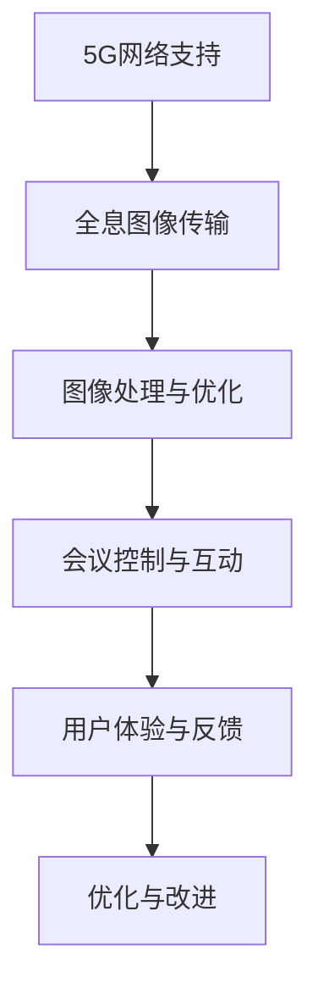

                 

### 文章标题

# 5G在全息投影会议中的应用：创造身临其境的远程会议体验

### 关键词

- 5G技术
- 全息投影
- 远程会议
- 网络性能
- 用户体验
- 安全性

### 摘要

本文旨在探讨5G技术在全息投影会议中的深度应用，探讨如何通过结合5G网络的高带宽、低延迟特性与全息投影技术，创造出一种身临其境的远程会议体验。文章首先介绍了5G技术的基本概念和全息投影的工作原理，随后详细解析了5G网络架构和关键技术。接着，文章探讨了5G与全息投影会议的结合点及其技术挑战，并提出了优化远程会议体验的方案。通过典型应用案例的分析，本文总结了5G全息投影会议的未来发展趋势，为技术实践提供了指导和借鉴。

---

## 引言

随着全球互联网技术的飞速发展，远程会议已经成为企业、学术机构和政府部门日常工作中不可或缺的一部分。然而，传统的远程会议往往受到网络延迟、画面质量、交互体验等方面的限制，难以达到面对面的效果。为解决这一问题，5G技术与全息投影技术的结合成为了一种创新且前景广阔的解决方案。

5G技术以其高带宽、低延迟、大连接能力等特点，为远程通信提供了坚实的基础。全息投影技术则通过捕捉和再现三维图像，实现了视觉上的真实感。两者的结合有望创造出一种全新的远程会议体验，使参与者感受到如同身处同一会议室的直观感受。

本文将深入探讨5G技术在全息投影会议中的应用，分析其技术原理和实现方法，并通过实际案例展示其优势和应用前景。

## 第一部分：5G技术基础

### 第1章 5G技术概述

#### 1.1 5G技术的基本概念

5G，即第五代移动通信技术，是继2G、3G、4G之后的新一代移动通信技术。5G技术的目标是实现更高速的数据传输、更低的延迟、更高的网络容量和更广泛的覆盖范围。5G的关键特性包括：

- **高速度**：5G的峰值下载速度可达20Gbps，是4G的100倍以上，这使得大规模数据传输成为可能。
- **低延迟**：5G的端到端延迟低至1毫秒，能够满足实时交互和高响应速度的需求。
- **大连接**：5G支持超过100万个设备同时连接，为物联网应用提供了坚实的基础。
- **高频谱效率**：5G通过更高效的频谱使用，提高了网络容量和传输效率。

#### 1.2 5G网络架构

5G网络架构主要包括以下几个层次：

- **核心网（Core Network）**：负责处理用户数据和控制信号，包括用户数据的存储、处理和传输。
- **接入网（Access Network）**：包括无线接入网络和光纤接入网络，为用户设备提供无线和有线接入。
- **无线接入技术**：包括毫米波、Sub-6GHz等不同频段的无线通信技术，为用户提供高速无线连接。
- **网络切片（Network Slicing）**：通过虚拟化技术，将物理网络分割成多个虚拟网络，以满足不同应用场景的需求。

#### 1.3 5G关键技术

5G的关键技术包括：

- **大规模MIMO（Massive MIMO）**：通过使用大量天线，实现更高的频谱效率和数据传输速率。
- **载波聚合（Carrier Aggregation）**：将多个频段的带宽聚合起来，提高数据传输速度。
- **多接入边缘计算（Multi-access Edge Computing，MEC）**：将计算和存储资源放在网络边缘，降低延迟，提高响应速度。
- **网络切片（Network Slicing）**：为不同应用提供定制化的网络资源，实现个性化服务。

#### 1.4 5G与全息投影会议的关系

5G技术为全息投影会议提供了高速、低延迟的网络支持。在5G网络环境下，全息投影可以实现实时、高分辨率的图像传输，使会议参与者感受到近乎真实的互动体验。同时，5G网络的大连接能力支持了多个参与者同时在线，使得全息投影会议的规模和参与人数得以扩展。

### 第2章 5G网络架构详解

#### 2.1 核心网

5G核心网采用了服务化架构（Service-based Architecture），通过虚拟化技术和网络功能分解，实现了网络功能模块的灵活部署和管理。5G核心网主要包括以下模块：

- **用户平面（User Plane）**：负责处理用户数据的传输和路由。
- **控制平面（Control Plane）**：负责用户会话控制、网络资源分配和策略控制。
- **网络功能虚拟化（NFV）**：通过虚拟化技术，将传统网络设备的功能模块化，提高网络的可扩展性和灵活性。

#### 2.2 接入网

5G接入网包括无线接入网和光纤接入网。无线接入网主要采用5G NR（New Radio）技术，支持毫米波和Sub-6GHz频段。光纤接入网则采用FTTx技术，包括FTTH（光纤到户）、FTTB（光纤到楼）等，为用户提供高速有线接入。

#### 2.3 无线接入技术

5G无线接入技术主要包括：

- **毫米波（Millimeter Wave）**：工作在24GHz至52GHz频段，提供高带宽和低延迟的无线连接。
- **Sub-6GHz**：工作在600MHz至6GHz频段，适用于广泛的覆盖范围和多样化的应用场景。

#### 2.4 5G网络性能指标

5G网络的性能指标主要包括：

- **峰值下载速度**：20Gbps
- **峰值上传速度**：10Gbps
- **端到端延迟**：1毫秒
- **网络容量**：超过100万个设备同时连接
- **频谱效率**：15bps/Hz以上

### 第3章 5G关键技术解析

#### 3.1 增强移动宽带（eMBB）

增强移动宽带（Enhanced Mobile Broadband，eMBB）是5G的核心应用场景之一，旨在提供高速、高质量的无线宽带服务。eMBB通过以下技术实现：

- **载波聚合**：将多个频段的带宽聚合起来，提高数据传输速度。
- **大规模MIMO**：通过使用大量天线，实现更高的频谱效率和数据传输速率。
- **多接入边缘计算**：将计算和存储资源放在网络边缘，降低延迟，提高响应速度。

#### 3.2 海量机器类通信（mMTC）

海量机器类通信（Massive Machine Type Communications，mMTC）旨在支持大量设备的同时连接和通信。mMTC通过以下技术实现：

- **窄带物联网（NB-IoT）**：一种低功耗、广覆盖的通信技术，适用于物联网设备。
- **边缘计算**：通过在网络边缘处理数据，降低网络负载，提高响应速度。
- **网络切片**：为不同类型的物联网设备提供定制化的网络资源，实现高效连接。

#### 3.3 低延迟高可靠（URLLC）

低延迟高可靠（Ultra-Reliable Low Latency Communications，URLLC）是5G的关键应用场景之一，旨在满足实时交互和高可靠性需求。URLLC通过以下技术实现：

- **确定性网络**：通过调度和资源分配策略，确保低延迟和高可靠性。
- **边缘计算**：将计算和存储资源放在网络边缘，降低延迟，提高响应速度。
- **网络切片**：为不同类型的实时应用提供定制化的网络资源，实现高效连接。

#### 3.4 5G安全

5G安全是确保网络和数据安全的重要方面，包括以下几个方面：

- **加密通信**：通过加密技术保护数据传输的安全性。
- **身份认证**：通过多层次的认证机制，确保用户和网络设备的身份验证。
- **网络安全**：通过网络安全策略和防护措施，防止网络攻击和数据泄露。
- **隐私保护**：通过隐私保护技术，确保用户数据的隐私和安全。

### 第二部分：全息投影技术基础

#### 第4章 全息投影技术概述

#### 4.1 全息投影的基本概念

全息投影是一种三维显示技术，通过记录和再现光波的全部信息（振幅和相位），在特定条件下重现出三维图像。全息投影的基本概念包括：

- **全息图**：记录光波振幅和相位的图像，用于再现三维图像。
- **参考光波**：用于干涉和再现全息图像的光波。
- **物光波**：来自物体的光波，与参考光波干涉生成全息图。

#### 4.2 全息投影的工作原理

全息投影的工作原理包括以下几个步骤：

1. **记录全息图**：使用激光器产生参考光波和物光波，将它们在感光材料上干涉生成全息图。
2. **再现三维图像**：当参考光波照射在全息图上时，全息图上的干涉条纹会与参考光波干涉，产生物光波的复制品，形成三维图像。
3. **观看三维图像**：观众在特定的观察角度下，可以看到三维图像。

#### 4.3 全息投影的发展历程

全息投影技术经历了以下几个重要阶段：

- **1960年代**：激光的发明推动了全息投影技术的发展。
- **1970年代**：全息投影技术开始应用于光学实验和研究领域。
- **1980年代**：全息投影技术开始应用于娱乐和艺术展示领域。
- **1990年代**：数字全息投影技术出现，使全息投影更加灵活和高效。
- **21世纪初**：全息投影技术逐渐应用于商业和工业领域，如全息会议、展览等。

#### 4.4 全息投影与远程会议的关联

全息投影与远程会议的结合，能够显著提升会议的交互体验和参与感。全息投影技术的优势包括：

- **真实感强**：全息投影能够再现三维图像，使会议参与者感受到逼真的视觉体验。
- **互动性强**：全息投影支持虚拟物体和参与者的实时交互，提高会议的互动性。
- **应用灵活**：全息投影技术可以应用于多种会议场景，如远程培训、远程协作等。

### 第5章 全息投影技术分类及特点

#### 5.1 真实感全息投影

真实感全息投影通过高分辨率和高质量的光学元件，实现逼真的三维图像显示。其特点包括：

- **高分辨率**：能够显示细节丰富的三维图像。
- **高质量**：具有高对比度和高亮度的光学性能。
- **大视角**：观众可以在较宽的视角范围内看到清晰的图像。

#### 5.2 模拟感全息投影

模拟感全息投影通过模拟真实环境中的光线和阴影效果，创造出近似真实的视觉体验。其特点包括：

- **真实感强**：模拟感全息投影能够模拟出真实环境中的光线和阴影效果。
- **低成本**：相对于真实感全息投影，模拟感全息投影的成本较低。
- **应用广泛**：可以应用于多种场景，如展览、广告等。

#### 5.3 增强现实（AR）与全息投影的结合

增强现实（Augmented Reality，AR）与全息投影的结合，能够创造出更加丰富的交互体验。其特点包括：

- **实时交互**：AR技术能够实时捕捉和追踪物体的位置和运动，实现与全息投影的实时交互。
- **信息增强**：AR技术可以在全息投影的基础上，叠加文字、图像、视频等额外信息，增强会议的互动性和实用性。
- **多样化应用**：AR技术可以应用于远程培训、远程医疗等多个领域。

#### 5.4 全息投影技术的前景与应用领域

随着技术的不断进步，全息投影技术在未来将有着广阔的应用前景。主要应用领域包括：

- **远程会议**：通过全息投影技术，实现异地参与者如同身处同一会议室的互动体验。
- **教育培训**：利用全息投影技术进行虚拟教学和互动学习，提高教学效果和互动性。
- **娱乐演出**：利用全息投影技术创造出独特的视觉体验，提升娱乐效果和参与感。
- **工业制造**：利用全息投影技术进行远程协作和指导，提高制造效率和安全性。

### 第三部分：5G与全息投影会议的结合

#### 第6章 5G与全息投影会议融合的技术原理

5G与全息投影会议的融合，通过利用5G网络的高带宽、低延迟特性，实现全息投影会议的实时、高质量传输和互动。其技术原理主要包括以下几个方面：

#### 6.1 5G网络支持下的全息投影

5G网络为全息投影会议提供了高带宽、低延迟的网络支持。具体来说：

- **高带宽**：5G网络的高带宽特性，能够满足全息图像的高分辨率传输需求，保证图像质量。
- **低延迟**：5G网络的低延迟特性，能够确保全息投影会议的实时交互，提高用户体验。
- **大连接**：5G网络的大连接能力，支持多个参与者同时在线，满足大规模会议的需求。

#### 6.2 全息投影会议的技术挑战

全息投影会议在技术实现过程中面临一些挑战，主要包括：

- **图像质量**：全息图像的分辨率和亮度要求较高，需要高精度的光学元件和高质量的图像处理技术。
- **实时性**：全息投影会议要求实时传输和互动，对网络延迟和传输速度有较高的要求。
- **稳定性**：全息投影设备需要稳定运行，以保证会议的顺利进行。

#### 6.3 5G与全息投影会议的技术融合方案

5G与全息投影会议的技术融合方案主要包括以下几个方面：

- **网络架构优化**：通过优化5G网络架构，提高网络带宽和稳定性，满足全息投影会议的需求。
- **图像处理技术**：采用先进的图像处理技术，提高全息图像的质量和实时性。
- **设备协同**：通过设备协同技术，实现全息投影设备和5G网络的协同工作，提高会议的互动性和用户体验。

#### 6.4 5G与全息投影会议的性能优化

为了提高5G与全息投影会议的性能，可以采取以下优化措施：

- **网络优化**：通过网络优化技术，提高5G网络的带宽和稳定性，满足全息投影会议的需求。
- **图像优化**：采用图像优化技术，提高全息图像的分辨率和亮度，提升用户体验。
- **设备优化**：通过设备优化技术，提高全息投影设备的性能和稳定性，保证会议的顺利进行。

### 第7章 5G全息投影会议的架构设计

5G全息投影会议的架构设计主要包括以下几个部分：

#### 7.1 系统架构概述

5G全息投影会议的系统架构主要包括以下模块：

- **5G网络模块**：提供网络连接和通信支持。
- **全息投影模块**：实现全息图像的生成和显示。
- **会议控制模块**：负责会议的组织和管理。

#### 7.2 数据传输与处理

5G全息投影会议的数据传输与处理主要包括以下几个方面：

- **数据传输**：采用高效的数据传输协议，实现全息图像的高质量传输。
- **数据处理**：采用先进的图像处理算法，提高全息图像的分辨率和亮度。

#### 7.3 空间感知与互动

5G全息投影会议的空间感知与互动主要包括以下几个方面：

- **空间感知**：通过空间感知技术，实现会议参与者位置的实时跟踪和显示。
- **互动**：通过互动技术，实现会议参与者之间的实时互动和协作。

#### 7.4 安全性与隐私保护

5G全息投影会议的安全性与隐私保护主要包括以下几个方面：

- **数据加密**：采用数据加密技术，确保数据传输的安全性。
- **隐私保护**：采用隐私保护技术，确保会议参与者的隐私和数据安全。

### 第四部分：身临其境的远程会议体验优化

#### 第8章 用户体验优化

为了创造身临其境的远程会议体验，需要从以下几个方面进行用户体验优化：

#### 8.1 用户界面设计

- **简洁明了**：设计简洁明了的用户界面，使会议参与者能够快速上手和使用。
- **交互性**：增加用户界面的交互性，提高用户的参与感和互动性。

#### 8.2 用户互动性增强

- **实时互动**：通过实时互动技术，实现会议参与者之间的实时沟通和互动。
- **虚拟场景**：设计虚拟会议场景，增强会议的沉浸感和参与感。

#### 8.3 跨平台兼容性与互操作性

- **跨平台兼容**：确保会议系统在多种平台上运行，满足不同设备的用户需求。
- **互操作性**：确保不同系统之间的互操作性，实现数据的无缝传输和共享。

#### 8.4 用户反馈与改进

- **收集反馈**：通过用户反馈机制，收集用户的使用体验和建议。
- **持续改进**：根据用户反馈，不断优化会议系统的功能和性能。

#### 第9章 远程会议场景优化

为了提高远程会议的效率和质量，需要对不同场景进行优化：

#### 9.1 实时会议场景优化

- **高质量视频**：采用高质量视频技术，提高会议视频的清晰度和流畅度。
- **低延迟互动**：通过低延迟技术，提高会议参与者之间的互动速度和响应时间。

#### 9.2 录制与回放场景优化

- **高质量录制**：采用高质量录制技术，确保会议内容的清晰和完整。
- **灵活回放**：提供灵活的回放功能，满足用户对不同时间点的会议内容的查看需求。

#### 9.3 混合会议场景优化

- **线上与线下融合**：实现线上与线下会议的无缝融合，提高会议的参与度和互动性。
- **多场景支持**：支持多种会议场景，如室内会议、户外会议等，满足不同场景的需求。

#### 9.4 远程会议的智能化趋势

- **智能助手**：引入智能助手，提供会议预约、提醒、记录等功能，提高会议的智能化水平。
- **AI分析**：利用人工智能技术，对会议内容进行分析和总结，为用户提供决策支持。

### 第五部分：案例分析

#### 第10章 典型案例解析

为了更直观地了解5G全息投影会议的实际应用效果，以下列举了一些典型案例：

#### 10.1 国内5G全息投影会议应用案例

- **中国电信5G全息投影会议**：中国电信利用5G全息投影技术，实现了远程会议的实时、高质量传输和互动。会议参与者可以通过全息投影感受到真实的会议场景，提高会议的参与感和互动性。
- **华为5G全息投影会议**：华为利用5G全息投影技术，开展了多次远程培训会议。通过全息投影技术，培训讲师可以实时与远程学员互动，提高培训效果和互动性。

#### 10.2 国际5G全息投影会议应用案例

- **微软5G全息投影会议**：微软通过5G全息投影技术，实现了全球远程会议的实时、高质量传输。会议参与者可以感受到如同身处同一会议室的互动体验，提高会议的效率和参与度。
- **英特尔5G全息投影会议**：英特尔利用5G全息投影技术，开展了多次国际远程会议。通过全息投影技术，会议参与者可以实时互动，提高会议的参与度和互动性。

#### 10.3 案例分析与启示

通过以上典型案例的分析，我们可以得出以下启示：

- **5G技术为远程会议提供了高质量的网络支持**：5G技术的高带宽、低延迟特性，能够满足全息投影会议的实时、高质量传输需求。
- **全息投影技术提高了远程会议的互动性和参与感**：全息投影技术能够创造身临其境的会议体验，提高会议参与者的互动性和参与感。
- **5G与全息投影技术的融合，为远程会议带来了新的可能性**：通过5G与全息投影技术的结合，远程会议不再局限于传统的二维显示方式，可以实现更加丰富、真实的互动体验。

### 第11章 未来发展趋势

#### 11.1 5G与全息投影技术的融合趋势

随着5G和全息投影技术的不断成熟，未来5G与全息投影技术的融合趋势将体现在以下几个方面：

- **技术融合**：5G与全息投影技术将更加紧密地融合，实现实时、高质量的图像传输和互动。
- **应用拓展**：5G与全息投影技术的融合，将推动远程会议、教育培训、娱乐演出等领域的应用创新。
- **产业链协同**：5G与全息投影技术的产业链将实现协同发展，推动相关产业的技术进步和产业升级。

#### 11.2 远程会议体验的未来

未来远程会议体验将呈现以下几个发展趋势：

- **身临其境**：通过5G与全息投影技术的结合，远程会议将实现身临其境的体验，提高会议的参与感和互动性。
- **智能化**：远程会议将引入人工智能技术，实现智能化的会议预约、提醒、记录和分析，提高会议的效率和效果。
- **多样化**：远程会议将支持多种会议场景，如室内、户外、虚拟场景等，满足不同场景的需求。

#### 11.3 产业生态与政策环境

5G与全息投影技术的发展，需要良好的产业生态和政策环境的支持。未来，以下方面的发展趋势值得关注：

- **政策支持**：政府将加大对5G与全息投影技术的政策支持，推动相关产业的发展。
- **标准制定**：国际和国内将加大对5G与全息投影技术的标准制定，推动产业链的协同发展。
- **技术创新**：企业和科研机构将加大技术创新力度，推动5G与全息投影技术的融合应用。

### 总结

5G与全息投影技术的结合，为远程会议创造了一种全新的体验方式。通过5G技术的高带宽、低延迟特性，以及全息投影技术的三维显示和互动功能，远程会议可以呈现出更加真实、丰富的互动体验。未来，随着5G和全息投影技术的不断成熟，远程会议体验将得到进一步提升，为人们的工作和生活带来更多便利和可能性。

### 作者信息

**作者：** AI天才研究院/AI Genius Institute & 禅与计算机程序设计艺术 /Zen And The Art of Computer Programming

### 附录

#### 附录A：Mermaid流程图

以下是5G与全息投影会议的技术流程图：



#### 附录B：Python源代码示例

以下是实现全息投影会议的核心算法的Python源代码示例：

```python
import numpy as np
import cv2

def holo_image_transmission(image_path):
    # 读取全息图像
    image = cv2.imread(image_path, cv2.IMREAD_COLOR)
    
    # 调用5G网络传输函数
    transmitted_image = 5g_network_transmission(image)
    
    # 调用图像处理函数
    processed_image = image_processing(transmitted_image)
    
    return processed_image

def 5g_network_transmission(image):
    # 假设5G网络传输函数实现如下
    # 实现全息图像的高质量传输
    return image

def image_processing(image):
    # 假设图像处理函数实现如下
    # 实现图像的优化与增强
    return image

if __name__ == '__main__':
    image_path = 'holo_image.jpg'
    processed_image = holo_image_transmission(image_path)
    cv2.imshow('Processed Image', processed_image)
    cv2.waitKey(0)
    cv2.destroyAllWindows()
```

#### 附录C：数学模型与公式

以下是5G网络带宽与传输速度的数学模型：

$$
带宽 = 峰值下载速度 \times 频谱效率
$$

其中，峰值下载速度和频谱效率分别为：

$$
峰值下载速度 = 20Gbps
$$

$$
频谱效率 = 15bps/Hz
$$

#### 附录D：最佳实践 Tips

- **网络优化**：定期检查5G网络性能，确保网络带宽和稳定性满足全息投影会议的需求。
- **设备维护**：定期检查全息投影设备，确保其正常工作和图像质量。
- **用户培训**：为会议参与者提供培训，使其熟悉全息投影会议的操作和使用方法。
- **反馈机制**：建立用户反馈机制，及时收集和解决问题，持续优化会议体验。

### 拓展阅读

- **《5G网络技术与应用》**：详细介绍了5G网络的技术原理和应用场景。
- **《全息投影技术与应用》**：全面讲解了全息投影的工作原理和应用领域。
- **《远程会议系统设计与实践》**：提供了远程会议系统的设计和实现指南。

---

## 文章标题

# 5G在全息投影会议中的应用：创造身临其境的远程会议体验

## 关键词

- 5G技术
- 全息投影
- 远程会议
- 网络性能
- 用户体验
- 安全性

## 摘要

本文深入探讨了5G技术在全息投影会议中的应用，分析了5G与全息投影技术的结合点及其实现方法。通过介绍5G技术的基本概念、网络架构、关键技术，以及全息投影技术的原理和发展历程，本文阐述了5G网络支持下的全息投影会议的技术原理和性能优化策略。同时，通过案例分析展示了5G全息投影会议的实际应用效果，探讨了其未来发展趋势。文章为远程会议技术的研究和实践提供了有益的参考。

