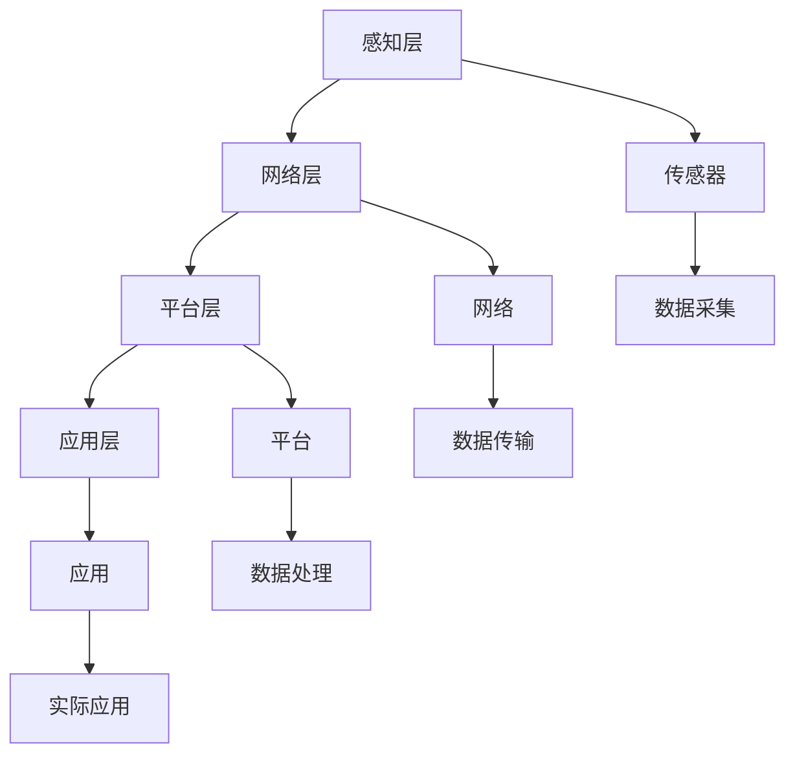

                 

# 5G在工业互联网中的应用：实现工厂全面数字化

关键词：5G，工业互联网，工厂自动化，远程控制，设备维护，智能工厂

摘要：
本文深入探讨了5G技术在工业互联网中的应用，阐述了5G技术的基本概念、工业互联网的基础概念，以及5G在工业互联网中的多种应用场景。通过详细分析5G在工厂自动化、远程控制和设备维护等领域的实际应用案例，揭示了5G技术在工业互联网中的挑战和解决方案，并对未来的发展趋势和机遇进行了展望。文章旨在为读者提供一份全面、深入的5G在工业互联网中应用的技术指南。

## 第1章：5G技术概述

5G技术作为下一代通信技术的代表，其核心特点在于高速率、低延迟和大连接。5G的发展历程可以追溯到2000年代初，当时国际电信联盟（ITU）开始规划IMT-2020（即5G）的标准。经过多年的研究和试验，5G技术于2019年底正式商用，标志着通信技术进入了一个新的时代。

### 1.1 5G技术的基本概念

5G技术，即第五代移动通信技术（5th Generation Mobile Network Technology），是最新一代蜂窝移动通信技术，其目标是提供更快的数据传输速度、更低的延迟和更大的网络容量。

- **发展历程**：
  - **2000年代初**：ITU开始规划IMT-2020，即5G标准。
  - **2013年**：ITU正式发布5G标准框架。
  - **2019年底**：5G商用化，韩国、美国、中国等国家和地区率先推出5G服务。
  - **2020年以后**：5G网络逐渐普及，全球各国都在积极推进5G网络建设。

- **核心特点**：
  - **高速率**：5G的峰值下载速度可以达到每秒数十Gbps，比4G速度快数十倍。
  - **低延迟**：5G的端到端延迟可以降低到1毫秒以下，比4G低几十倍。
  - **大连接**：5G能够支持更多的设备同时连接，每平方米的连接密度可以达到数十万个设备。

- **关键技术**：
  - **毫米波技术**：利用毫米波频段提供更高的数据传输速率。
  - **大规模MIMO**：通过使用大量天线来提高网络容量和信号质量。
  - **网络切片**：将一个物理网络划分为多个虚拟网络，满足不同应用的需求。

### 1.2 5G与工业互联网的关联

5G技术为工业互联网提供了强大的基础设施支持，使得工业生产过程可以实现全面数字化和智能化。

- **高速率**：5G的高速率特点可以支持大量的数据采集和实时传输，为工业物联网提供了必要的网络基础。
- **低延迟**：5G的低延迟特性能够满足工业自动化和远程控制对实时响应的需求。
- **大连接**：5G的大连接能力可以支持大量的设备连接，为工业生产过程中的设备互联互通提供了技术保障。

### 1.3 本章总结

通过本章的介绍，我们了解了5G技术的基本概念、发展历程和核心特点，以及5G与工业互联网的紧密关联。5G技术作为下一代通信技术的代表，将在工业互联网中发挥重要作用，推动工厂实现全面数字化。

## 第2章：工业互联网的基础概念

工业互联网（Industrial Internet，简称IIoT）是指通过物联网、大数据、云计算、人工智能等新一代信息通信技术与传统工业体系深度融合，实现工业智能化和数字化转型的一种新型工业体系。工业互联网不仅改变了工业生产的方式，还推动了产业升级和经济发展。

### 2.1 工业互联网的概念

- **定义**：工业互联网是指通过新一代信息通信技术，将人、机、物互联，实现智能化的生产和管理。
- **核心**：工业互联网的核心是数据，通过数据的采集、传输、分析和利用，实现生产过程的优化和智能化。
- **目标**：工业互联网的目标是提高生产效率、降低成本、提高产品质量和增强企业的竞争力。

### 2.2 工业互联网的架构

工业互联网的架构可以分为感知层、网络层、平台层和应用层四个层次。

- **感知层**：负责数据采集，包括传感器、RFID、摄像头等设备，用于实时监测生产设备和环境参数。
- **网络层**：负责数据传输，通过5G、物联网等网络技术，实现数据的快速传输和低延迟通信。
- **平台层**：负责数据处理和分析，通过云计算、大数据分析等技术，对采集到的数据进行分析和处理，为上层应用提供支持。
- **应用层**：负责实际应用，包括工业自动化、远程控制、设备维护、智能工厂等，实现工业生产的智能化和数字化转型。

### 2.3 工业互联网的核心组件

工业互联网的核心组件包括传感器、网络、平台和应用。

- **传感器**：用于实时监测生产设备和环境，采集各种数据。
- **网络**：实现数据的高速传输和低延迟通信，为工业互联网提供基础设施支持。
- **平台**：负责数据存储、处理和分析，为上层应用提供支持。
- **应用**：实现具体的工业生产和管理功能，包括自动化控制、设备维护、生产优化等。

### 2.4 工业互联网的应用领域

工业互联网的应用领域广泛，包括以下几个方面：

- **工厂自动化**：通过工业机器人、自动化生产线等实现生产过程的自动化。
- **远程控制**：通过5G网络实现远程监控和操作，提高生产效率。
- **设备维护**：通过数据分析和预测维护，降低设备故障率和维修成本。
- **生产优化**：通过大数据分析和人工智能技术，优化生产计划和调度，提高生产效率。
- **智能工厂**：通过集成物联网、大数据、云计算等新技术，实现工厂的全面数字化和智能化。

### 2.5 本章总结

通过本章的介绍，我们了解了工业互联网的基本概念、架构、核心组件和应用领域。工业互联网作为新一代工业体系的代表，正逐渐改变传统的工业生产方式，推动工业生产向数字化、智能化和高效化方向发展。

### 2.6 Mermaid 流程图

下面是一个简单的Mermaid流程图，展示了工业互联网架构的层次结构。

## 第3章：5G在工业互联网中的应用场景

5G技术作为下一代通信技术，其在工业互联网中的应用场景丰富且多样化。本章将详细探讨5G在工厂自动化、远程控制和设备维护等领域的应用，通过具体实例展示5G技术如何助力工业互联网的发展。

### 3.1 5G在工厂自动化中的应用

5G技术在工厂自动化中的应用主要体现在以下几个方面：

#### 3.1.1 5G与机器人自动化

随着5G网络的广泛应用，工业机器人正在迎来新的发展机遇。5G网络的高速率和低延迟特点，使得工业机器人可以实时响应生产指令，提高生产效率。

- **应用实例**：在汽车制造领域，5G网络的应用使得机器人可以实时监测生产线上的每个部件，快速调整生产参数，实现高效、精准的装配。

#### 3.1.2 5G与机器视觉

机器视觉技术在工业生产中的应用越来越广泛，5G网络的高带宽和低延迟特性，为机器视觉技术提供了更好的支持。

- **应用实例**：在电子制造业中，5G网络使得机器视觉系统可以实时监控产品的质量，快速检测和排除故障，提高生产质量和效率。

#### 3.1.3 5G与柔性制造

柔性制造系统（Flexible Manufacturing System，FMS）是一种能够适应多种产品生产的制造系统。5G网络的高速率和低延迟特性，为柔性制造系统的实现提供了有力支持。

- **应用实例**：在服装制造业中，5G网络的应用使得生产线可以根据市场需求快速调整，实现多种产品的快速切换和高效生产。

#### 3.1.4 5G与工业物联网

5G技术的高带宽和低延迟特性，使得工业物联网（IIoT）的应用更加广泛。工业物联网通过将各种设备连接起来，实现数据的实时传输和共享，为工厂自动化提供了重要支撑。

- **应用实例**：在化工行业，5G网络的应用使得生产设备可以实时监测和分析生产数据，实现智能化的生产控制和优化。

### 3.2 5G在远程控制中的应用

5G技术在远程控制中的应用，主要体现在以下几个方面：

#### 3.2.1 5G在远程监控中的角色

5G网络的高带宽和低延迟特性，使得远程监控系统的实时性和准确性得到了显著提升。

- **应用实例**：在石油和天然气行业，5G网络的应用使得工作人员可以通过远程监控系统实时监控现场情况，快速响应突发事件，保障生产安全。

#### 3.2.2 5G在远程操作中的应用

5G网络的高带宽和低延迟特性，使得远程操作成为可能。通过远程操作，可以实现对设备的远程控制和操作，提高生产效率。

- **应用实例**：在风电行业，5G网络的应用使得工作人员可以通过远程控制系统对风力发电机进行实时监控和操作，提高设备利用率和生产效率。

#### 3.2.3 5G在智能运维中的应用

智能运维（Smart Maintenance）是指通过大数据分析和人工智能技术，实现设备运行状态的实时监控和预测性维护。5G网络的高带宽和低延迟特性，为智能运维提供了重要支持。

- **应用实例**：在制造业，5G网络的应用使得企业可以通过远程监控系统实时监测设备的运行状态，通过数据分析实现预测性维护，降低设备故障率和维修成本。

### 3.3 5G在设备维护中的应用

5G技术在设备维护中的应用，主要体现在以下几个方面：

#### 3.3.1 5G在预测维护中的应用

预测性维护（Predictive Maintenance）是指通过实时监测设备运行状态，预测设备可能的故障，提前进行维护，避免设备故障带来的生产中断。

- **应用实例**：在机械制造业，5G网络的应用使得企业可以通过实时监测设备运行数据，预测设备故障，提前安排维护，降低设备故障率和维修成本。

#### 3.3.2 5G在设备状态监测中的应用

设备状态监测（Equipment Status Monitoring）是指通过传感器和监测系统，实时监测设备的工作状态，为设备维护提供数据支持。

- **应用实例**：在制造业，5G网络的应用使得企业可以通过传感器实时监测设备的运行状态，通过数据分析，及时发现设备故障，提高设备运行效率。

#### 3.3.3 5G在设备远程诊断中的应用

远程诊断（Remote Diagnostic）是指通过远程监控系统，对设备运行中的问题进行诊断和分析，提供解决方案。

- **应用实例**：在航空航天行业，5G网络的应用使得企业可以通过远程诊断系统，实时监测飞机发动机的运行状态，快速诊断故障，提高飞行安全。

### 3.4 本章总结

通过本章的介绍，我们了解了5G技术在工业互联网中的应用场景，包括工厂自动化、远程控制和设备维护等方面。5G技术的高速率、低延迟和大连接特性，为工业互联网的发展提供了强大支持，使得工业生产过程可以实现全面数字化和智能化。在接下来的章节中，我们将进一步探讨5G技术在工业互联网中面临的挑战和解决方案。

## 第4章：5G在工业互联网中的挑战与解决方案

尽管5G技术在工业互联网中展示了巨大的潜力和应用前景，但其实际应用过程中仍然面临一系列挑战。这些挑战涉及到网络延迟和稳定性、数据安全和隐私保护、设备和人员培训以及标准化和兼容性问题。在本章中，我们将详细分析这些挑战，并提出相应的解决方案。

### 4.1 5G在工业互联网中的挑战

#### 4.1.1 网络延迟和稳定性

网络延迟和稳定性是5G在工业互联网中面临的主要挑战之一。在工业生产过程中，任何网络延迟都会导致生产线的停顿，从而影响生产效率。因此，5G网络需要具备极高的稳定性和低延迟特性。

- **挑战**：5G网络在实际应用中，可能会遇到信号干扰、网络拥塞等问题，导致网络延迟和稳定性下降。
- **影响**：网络延迟和稳定性下降会影响工业互联网的实时性和可靠性，导致生产中断和效率降低。

#### 4.1.2 数据安全和隐私保护

在工业互联网中，数据安全和隐私保护至关重要。工业生产过程中涉及大量的敏感数据，如生产计划、工艺参数、设备状态等。如果这些数据被泄露或篡改，将可能导致生产事故、经济损失甚至国家安全的威胁。

- **挑战**：5G网络的高连接密度和数据传输量，使得数据安全和隐私保护面临更大的压力。
- **影响**：数据安全和隐私保护不当，可能导致数据泄露、工业间谍活动等，严重威胁企业的安全和竞争力。

#### 4.1.3 设备和人员培训

5G技术在工业互联网中的应用，需要企业进行设备更新和人员培训。然而，许多企业对于新兴技术的理解和应用能力有限，导致设备利用率和人员工作效率不高。

- **挑战**：5G技术的应用需要专业的设备操作和运维人员，而企业现有的技术人员可能缺乏相关技能。
- **影响**：设备和人员培训不足，将导致5G技术在工业互联网中的应用效果不佳，甚至可能造成设备损坏和生产事故。

#### 4.1.4 标准化和兼容性问题

在工业互联网中，不同设备和系统之间的标准化和兼容性是确保其顺利运行的关键。然而，5G技术的多样性和复杂性，使得不同设备和系统之间的兼容性问题难以解决。

- **挑战**：5G技术在工业互联网中的应用，需要解决不同设备、系统和平台之间的标准化和兼容性问题。
- **影响**：标准化和兼容性问题会导致设备互操作性差，影响工业互联网的集成和扩展能力。

### 4.2 5G在工业互联网中的解决方案

针对上述挑战，我们可以采取以下解决方案，以确保5G技术在工业互联网中的顺利应用。

#### 4.2.1 网络增强技术

为了提高5G网络的稳定性和低延迟特性，可以采用以下技术：

- **边缘计算**：通过在工厂现场部署边缘计算设备，将数据处理和分析任务从云端转移到现场，降低网络延迟。
- **网络优化**：通过对5G网络进行优化，提高网络带宽和降低延迟，确保网络稳定性和实时性。

#### 4.2.2 安全技术

为了确保数据安全和隐私保护，可以采取以下措施：

- **数据加密**：采用先进的加密算法，对传输的数据进行加密，确保数据在传输过程中不被窃取或篡改。
- **安全认证**：通过安全认证机制，确保网络访问的安全性和合法性，防止未授权访问。

#### 4.2.3 融合创新

为了提高5G技术在工业互联网中的应用效果，可以采取以下措施：

- **跨领域合作**：加强不同行业和企业之间的合作，共同推动5G技术在工业互联网中的应用。
- **技术创新**：通过技术创新，解决5G技术在工业互联网中面临的技术难题，提高设备的互操作性和兼容性。

#### 4.2.4 政策和标准制定

为了推动5G技术在工业互联网中的广泛应用，需要加强政策和标准制定：

- **政策支持**：政府可以通过政策支持，鼓励企业投资5G技术和工业互联网应用，推动产业升级和转型。
- **标准制定**：加强国际和国家标准化组织在5G和工业互联网领域的合作，制定统一的标准化和兼容性规范。

### 4.3 本章总结

通过本章的分析，我们了解了5G技术在工业互联网中面临的挑战，并提出了相应的解决方案。只有通过技术创新、政策支持和跨领域合作，才能充分发挥5G技术在工业互联网中的应用潜力，推动工厂实现全面数字化和智能化。

## 第5章：5G在工业互联网中的典型案例分析

在本章中，我们将通过分析两个5G在工业互联网中的成功应用案例——智能工厂和智能矿山，探讨其实施过程、效果和启示。

### 5.1 案例一：智能工厂

#### 5.1.1 案例背景

某汽车制造企业为了提高生产效率和产品质量，决定建设一个智能工厂。该智能工厂集成了5G网络、工业机器人、机器视觉、物联网等技术，实现了生产过程的全面数字化和智能化。

#### 5.1.2 案例实施过程

1. **网络建设**：首先，企业部署了5G网络，覆盖整个工厂区域，确保数据的高速传输和低延迟通信。
2. **设备升级**：企业对生产线上的设备进行了升级，引入了工业机器人和机器视觉系统，实现自动化生产和质量检测。
3. **系统集成**：通过物联网技术，将各种设备连接起来，实现数据的实时采集和共享，为生产管理和决策提供数据支持。
4. **智能分析**：利用大数据分析和人工智能技术，对生产数据进行分析和处理，实现生产过程的优化和预测性维护。

#### 5.1.3 案例效果分析

1. **生产效率提高**：通过自动化生产，企业生产效率提高了30%以上，生产周期缩短了20%。
2. **产品质量提升**：机器视觉系统实现了对产品质量的实时监测和检测，产品质量合格率提高了10%。
3. **设备利用率提高**：通过预测性维护，设备故障率降低了15%，设备利用率提高了10%。

#### 5.1.4 案例启示

1. **技术融合**：智能工厂的成功建设表明，5G、工业机器人、机器视觉、物联网等技术的融合，是提升生产效率和产品质量的关键。
2. **数据驱动**：大数据分析和人工智能技术在生产过程的优化和预测性维护中发挥了重要作用，数据驱动将成为未来工厂的核心。

### 5.2 案例二：智能矿山

#### 5.2.1 案例背景

某矿业企业为了提高矿山生产效率和安全性，决定建设一个智能矿山。该智能矿山集成了5G网络、物联网、大数据分析、人工智能等技术，实现了矿山生产的全面数字化和智能化。

#### 5.2.2 案例实施过程

1. **网络建设**：企业部署了5G网络，覆盖整个矿区，确保数据的高速传输和低延迟通信。
2. **设备升级**：企业对矿山设备进行了升级，引入了物联网传感器和智能控制系统，实现设备的实时监测和远程控制。
3. **系统集成**：通过物联网技术，将各种设备连接起来，实现数据的实时采集和共享，为生产管理和决策提供数据支持。
4. **智能分析**：利用大数据分析和人工智能技术，对生产数据进行分析和处理，实现矿山生产的优化和预测性维护。

#### 5.2.3 案例效果分析

1. **生产效率提高**：通过智能化设备的应用，矿山生产效率提高了20%以上。
2. **安全性提升**：通过实时监测和远程控制，矿山事故率降低了30%。
3. **设备利用率提高**：通过预测性维护，设备故障率降低了15%，设备利用率提高了10%。

#### 5.2.4 案例启示

1. **智能化升级**：智能矿山表明，通过5G、物联网、大数据分析等技术的应用，矿山生产可以实现全面智能化，提高生产效率和安全性。
2. **数据驱动**：大数据分析和人工智能技术在矿山生产的优化和预测性维护中发挥了重要作用，数据驱动将成为未来矿山生产的重要模式。

### 5.3 本章总结

通过两个典型案例的分析，我们看到了5G技术在工业互联网中的应用如何实现工厂和矿山生产的全面数字化和智能化。这些案例表明，5G技术不仅提高了生产效率和产品质量，还提升了设备利用率和安全性。未来，随着5G技术的进一步普及和成熟，工业互联网将在更多领域实现广泛应用，推动工业生产向更高效、更智能的方向发展。

## 第6章：未来展望

随着5G技术的不断发展和成熟，其在工业互联网中的应用前景愈发广阔。未来，5G技术与工业互联网的深度融合将带来一系列新的发展趋势和机遇。

### 6.1 5G在工业互联网中的未来发展趋势

#### 6.1.1 5G与工业互联网的融合创新

未来，5G与工业互联网的融合将带来更多创新应用。例如，5G与人工智能、大数据、物联网等技术的结合，将推动工业生产的自动化、智能化和高效化。通过5G网络，工业互联网可以实现更广泛的数据采集和实时传输，为人工智能算法提供更多训练数据和决策依据。

#### 6.1.2 5G在工业自动化中的应用

5G技术将在工业自动化领域发挥更大的作用。随着5G网络的普及，工业机器人、自动化生产线等将实现更高效、更灵活的运作。5G的低延迟特性将使工业自动化系统更加实时和精准，提高生产效率和产品质量。

#### 6.1.3 5G在智能制造中的应用

智能制造是工业互联网的核心，5G技术将在智能制造中发挥重要作用。通过5G网络，企业可以实现生产设备的远程监控、操作和维护，实现设备的智能化升级和优化。此外，5G技术还将支持智能工厂的建设，实现生产过程的全面数字化和智能化。

### 6.2 5G在工业互联网中的机遇

#### 6.2.1 产业升级与转型

5G技术的广泛应用将为工业互联网的发展提供强大动力，推动传统产业向数字化、智能化方向升级和转型。企业可以通过引入5G技术，实现生产过程的优化和效率提升，提高市场竞争力。

#### 6.2.2 提高生产效率

5G技术的高速率、低延迟和大连接特性，将大幅提高工业生产效率。通过5G网络，企业可以实现更广泛的数据采集和实时传输，实现生产过程的自动化和智能化，降低生产成本，提高产品质量。

#### 6.2.3 创新商业模式

5G技术在工业互联网中的应用，将带来新的商业模式。例如，通过5G网络，企业可以实现设备远程监控和维护，提供智能运维服务；通过大数据分析，为企业提供定制化的生产优化方案，实现精准营销和定制化生产。

### 6.3 本章总结

未来，5G技术在工业互联网中的应用将带来更多创新和发展机遇。通过5G与工业互联网的融合创新，工业生产将实现自动化、智能化和高效化，推动产业升级和转型。5G技术的广泛应用，将为工业互联网的发展提供强大动力，助力企业提高生产效率和创新能力，开启新的商业时代。

## 第7章：总结与建议

### 7.1 全书总结

本文从5G技术概述、工业互联网的基础概念、5G在工业互联网中的应用场景、挑战与解决方案、典型案例分析以及未来展望等方面，系统阐述了5G技术在工业互联网中的应用。5G技术作为下一代通信技术的代表，具有高速率、低延迟和大连接等特点，为工业互联网的发展提供了强有力的基础设施支持。通过5G技术的应用，工厂可以实现全面数字化和智能化，提高生产效率、降低成本、提高产品质量和增强企业的竞争力。

### 7.2 应用建议

#### 7.2.1 企业策略

- **积极引入5G技术**：企业应积极引入5G技术，推动生产过程的自动化和智能化，提高生产效率和产品质量。
- **制定长期发展规划**：企业应制定长期发展规划，明确5G技术在工业互联网中的应用目标和实施路径。
- **加强人才培养**：企业应加强5G和工业互联网相关技术人才的培养，提高员工的技术水平和创新能力。

#### 7.2.2 技术发展

- **推动技术创新**：政府和企业应共同推动5G技术在工业互联网中的应用研究，加大技术创新力度，推动产业升级和转型。
- **加强国际交流与合作**：积极参与国际标准和规范的制定，加强与国际企业和研究机构的交流与合作，提升我国在5G和工业互联网领域的国际竞争力。

#### 7.2.3 人才培养

- **完善教育体系**：加强5G和工业互联网相关课程设置，培养具备实践能力和创新精神的专业人才。
- **开展技术培训**：企业应开展5G和工业互联网技术培训，提高员工的技术水平和应用能力。
- **鼓励创新实践**：政府和企业应鼓励创新实践，为技术人员提供更多的实践机会和平台，培养创新型人才。

### 7.3 小结

5G技术在工业互联网中的应用具有广阔的前景和巨大的潜力。通过全面引入和应用5G技术，企业可以实现生产过程的全面数字化和智能化，提高生产效率和产品质量，增强企业的竞争力。同时，政府和企业应共同努力，推动5G技术和工业互联网的发展，培养专业人才，为工业互联网的广泛应用奠定坚实基础。

### 7.4 拓展阅读

- **《工业互联网：定义、架构与关键技术》**
- **《5G技术原理与应用》**
- **《智能制造：理论与实践》**
- **《物联网：技术与应用》**

通过阅读这些书籍，可以进一步了解工业互联网和5G技术的相关知识和应用，为实践提供指导和支持。

