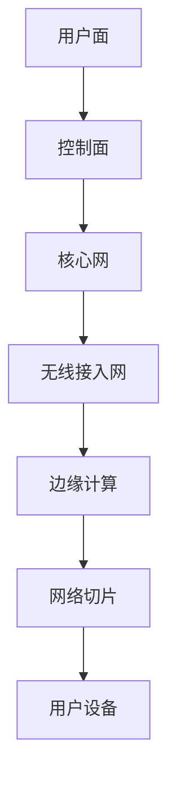
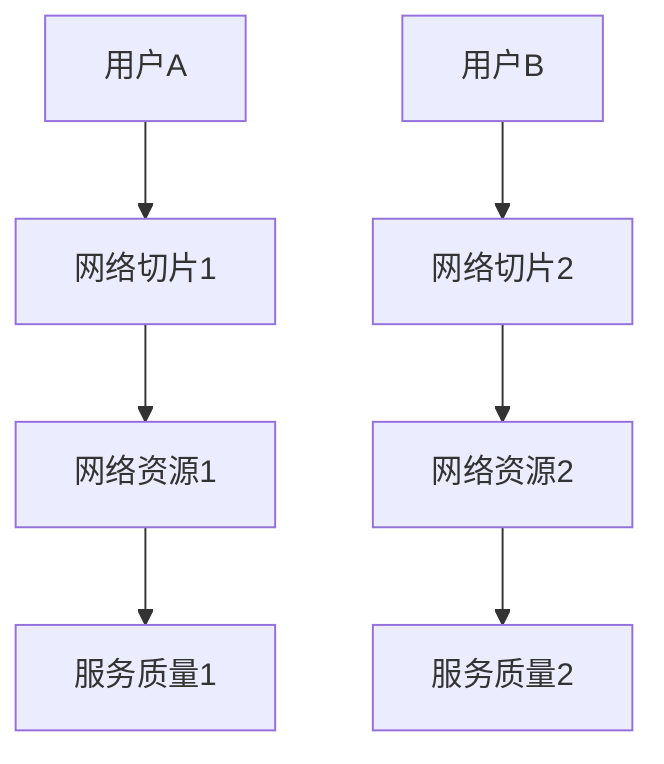
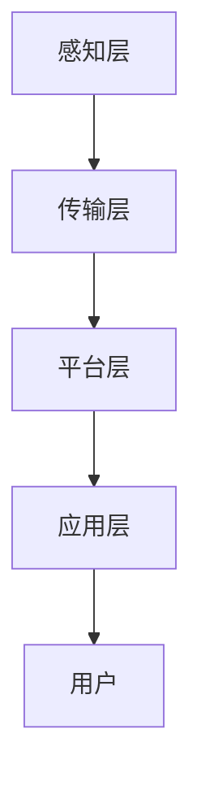

                 

### 文章标题

《5G在工业物联网中的应用：实现大规模设备互联》

#### 文章关键词

5G、工业物联网（IIoT）、大规模设备互联、网络架构、边缘计算、网络切片技术、智能制造、工业监控、工业自动化、Python源代码、数学模型、项目实战、案例分析

#### 文章摘要

本文深入探讨了5G技术在工业物联网（IIoT）中的应用，重点分析了5G的关键特性及其在实现大规模设备互联中的重要作用。首先，文章简要介绍了5G技术的基本概念和标准，然后详细解析了5G网络架构与关键技术，如新无线电（NR）技术、多接入边缘计算（MEC）和网络切片技术。接着，文章探讨了工业物联网的基本概念、架构及其在工业中的应用挑战。随后，文章重点阐述了5G网络在工业物联网中的应用场景，包括智能制造、工业监控和工业自动化。通过具体的应用实例，文章详细解析了5G技术如何实现大规模设备互联。最后，文章对未来5G与IIoT融合发展的趋势进行了展望，并提出了相关挑战和最佳实践。

### 第一部分：5G技术基础

#### 第1章：5G技术概述

#### 1.1 5G技术标准

5G，即第五代移动通信技术，是继1G模拟通信、2G数字通信、3G互联网接入、4G高速互联网后的最新一代通信技术。5G技术标准由国际电信联盟（ITU）制定，主要目标是实现更高的数据传输速度、更低的延迟和更大的连接密度。5G技术标准包括几个关键性能指标，如峰值下载速度、峰值上传速度、时延和连接密度。

- **峰值下载速度**：5G网络的峰值下载速度预期达到20Gbps，比4G网络的1Gbps快20倍。
- **峰值上传速度**：5G网络的峰值上传速度预期达到10Gbps，比4G网络的50Mbps快200倍。
- **时延**：5G网络的端到端时延预期降低到1毫秒，比4G网络的10-50毫秒低一个数量级。
- **连接密度**：5G网络能够支持每平方米100万连接，比4G网络的10万连接密度高10倍。

#### 1.2 5G关键特性

5G技术具有以下几个关键特性：

- **高速度**：5G网络提供的高速数据传输能力，使得大数据量应用成为可能，如高清视频流、虚拟现实（VR）和增强现实（AR）。
- **低延迟**：5G网络的低延迟特性使其成为实时应用的关键，如自动驾驶、工业自动化和远程医疗。
- **高可靠性**：5G网络采用新的无线接入技术，如毫米波通信和大规模MIMO（多输入多输出），提高了网络的可靠性和覆盖范围。
- **大规模连接**：5G网络能够支持更多设备同时连接，满足物联网设备的巨大增长需求。

#### 1.3 5G网络架构

5G网络架构包括多个关键组件，如下所示：

- **用户面**：负责处理用户的通信需求，包括数据传输、语音通信等。
- **控制面**：负责控制和管理网络资源，包括连接建立、网络选择等。
- **核心网**：包括5G服务化架构（5G SA）和5G非服务化架构（5G NSA）。5G SA支持独立组网，而5G NSA依赖于4G核心网。
- **无线接入网**：包括5G基站（gNB）、有源和被动天线系统等，负责无线信号的传输。
- **边缘计算**：通过将计算和存储资源部署在靠近用户的网络边缘，降低时延，提高数据处理效率。
- **网络切片**：将网络资源按需分配给不同的用户和服务，提供定制化的网络服务质量。

### Mermaid流程图：5G网络架构



#### 第2章：5G网络架构与关键技术

##### 2.1 NR（新无线电）技术

新无线电（NR）技术是5G网络的核心技术之一，负责实现无线接入网络。NR技术采用新的频率范围和调制技术，提高了网络的传输速度和覆盖范围。

- **频率范围**：NR技术使用低频段（sub-6GHz）和高频段（mmWave，毫米波）。低频段提供广覆盖和大容量，而高频段提供高速度和低延迟。
- **调制技术**：NR采用新型调制技术，如正交频分多址（OFDM）和滤波器组型多载波（ Filter Bank Multi-Carrier, FBMC）。这些技术提高了频谱利用效率和传输速率。

##### 2.2 5G多接入边缘计算（MEC）

多接入边缘计算（MEC）是一种将计算和存储资源部署在靠近用户和网络边缘的技术。MEC的关键特性如下：

- **低延迟**：通过在靠近用户的地方处理数据，减少数据传输的距离，从而降低时延。
- **高效率**：将计算和存储资源分布到边缘节点，减少了核心网络的负载，提高了网络效率。
- **灵活性**：MEC支持多种网络应用，如工业物联网、智能交通和虚拟现实。

##### 2.3 5G网络切片技术

网络切片是一种将网络资源按需分配给不同用户和服务的技术。网络切片的关键特性如下：

- **定制化服务**：网络切片允许运营商为不同用户提供定制化的网络服务质量（QoS），如带宽、时延和可靠性。
- **资源隔离**：网络切片通过逻辑分离网络资源，确保不同用户和服务之间互不干扰。
- **灵活扩展**：网络切片可以根据需求动态分配和调整网络资源，提高网络的可扩展性。

### Mermaid流程图：5G网络切片技术



### 第二部分：工业物联网（IIoT）基础

#### 第3章：工业物联网概述

##### 3.1 IIoT的定义

工业物联网（Industrial Internet of Things，IIoT）是指通过将传感器、机器、设备和系统连接到互联网，实现设备间的数据交换和智能协作。IIoT的目标是提高工业生产的效率、可靠性和灵活性。

- **设备连接**：IIoT通过无线和有线网络将各种工业设备和机器连接起来，形成一个庞大的设备网络。
- **数据采集**：通过传感器和监测设备，IIoT能够实时采集设备运行数据，如温度、压力、湿度等。
- **数据交换**：IIoT设备通过互联网进行数据交换，实现设备间的信息共享和协同工作。
- **智能分析**：通过数据分析技术，IIoT可以从采集的数据中提取有价值的信息，实现预测性维护、优化生产流程等。

##### 3.2 IIoT的架构

IIoT的架构包括以下几个关键组件：

- **感知层**：包括传感器、监测设备和边缘计算节点，负责数据采集和初步处理。
- **传输层**：包括有线和无线网络，负责数据传输和通信。
- **平台层**：包括数据中心、云平台和边缘计算平台，负责数据存储、处理和分析。
- **应用层**：包括各种工业应用，如智能制造、智能监控和智能维护，利用数据分析结果实现业务优化。

##### 3.3 IIoT的关键挑战

尽管IIoT具有巨大的潜力，但其实施过程中仍面临一些关键挑战：

- **数据隐私和安全**：IIoT涉及大量的设备连接和数据传输，需要确保数据的安全和隐私。
- **数据传输和处理**：工业环境中的设备数量庞大，数据传输和处理需要高效的网络架构和计算资源。
- **设备兼容性和互操作性**：不同设备和系统的兼容性和互操作性是IIoT实现的关键。
- **标准化**：IIoT标准的制定和实施对于促进技术发展和设备互操作性至关重要。

### Mermaid流程图：IIoT架构



### 第三部分：5G与IIoT的融合应用

#### 第5章：5G网络在IIoT中的应用场景

##### 5.1 智能制造

智能制造是IIoT和5G技术融合的重要应用场景之一。5G技术为智能制造提供了以下几个关键优势：

- **高速度**：5G网络的高速度使得大数据量传输成为可能，支持实时监控、远程控制和智能分析。
- **低延迟**：5G网络的低延迟特性使得实时控制成为可能，提高了生产效率和产品质量。
- **高可靠性**：5G网络采用先进的无线接入技术，提高了网络的可靠性和覆盖范围，确保生产设备的稳定运行。

在智能制造中，5G技术可以应用于以下几个方面：

- **设备监控**：通过5G网络，企业可以实时监控生产设备的运行状态，及时发现问题并进行维护。
- **远程控制**：5G网络使得远程控制成为可能，操作员可以通过远程终端实时控制生产设备，提高生产灵活性。
- **数据采集与分析**：5G网络支持大量设备的数据传输，企业可以通过数据分析实现预测性维护、优化生产流程等。

##### 5.2 工业监控

工业监控是IIoT和5G技术的重要应用场景之一，通过5G网络，企业可以实现以下功能：

- **实时监控**：5G网络的高速度和低延迟特性使得实时监控成为可能，企业可以实时监控生产设备的运行状态，确保生产过程的连续性和安全性。
- **远程诊断与维护**：通过5G网络，企业可以实现远程诊断和设备维护，提高维护效率和设备利用率。
- **智能分析**：5G网络支持大量数据传输，企业可以通过数据分析实现设备运行状态的预测性分析，提前发现潜在问题，预防设备故障。

在工业监控中，5G技术可以应用于以下几个方面：

- **生产过程监控**：通过5G网络，企业可以实时监控生产过程，确保生产过程的连续性和安全性。
- **设备状态监控**：通过5G网络，企业可以实时监控设备状态，及时发现设备故障并进行维护。
- **环境监测**：通过5G网络，企业可以实时监测生产环境，如温度、湿度等，确保生产环境的稳定。

##### 5.3 工业自动化

工业自动化是IIoT和5G技术的重要应用场景之一，通过5G网络，企业可以实现以下功能：

- **远程控制**：5G网络使得远程控制成为可能，企业可以通过远程终端实时控制生产设备，提高生产灵活性。
- **智能调度**：5G网络支持大量数据传输，企业可以通过数据分析实现生产任务的智能调度，提高生产效率。
- **设备协同**：5G网络支持大量设备同时连接，企业可以实现设备间的智能协同，提高生产效率。

在工业自动化中，5G技术可以应用于以下几个方面：

- **生产设备控制**：通过5G网络，企业可以通过远程终端实时控制生产设备，提高生产灵活性。
- **生产任务调度**：通过5G网络，企业可以通过数据分析实现生产任务的智能调度，提高生产效率。
- **设备协同控制**：通过5G网络，企业可以实现生产设备间的智能协同，提高生产效率。

### 第6章：大规模设备互联的实现

#### 6.1 设备接入

大规模设备互联的第一步是设备接入网络。5G网络提供了多种设备接入方式，包括：

- **蜂窝网络接入**：设备通过5G基站（gNB）接入5G网络，实现高速数据传输。
- **Wi-Fi接入**：设备通过Wi-Fi接入点接入5G网络，实现无线连接。
- **LPWAN（低功耗广域网）接入**：如NB-IoT和LoRa，适用于功耗低、传输距离远的设备。

设备接入网络的关键技术包括：

- **接入认证**：设备接入网络前需进行认证，确保网络安全性。
- **设备管理**：通过设备管理平台，实现设备的在线状态监测、远程配置和故障诊断。

#### 6.2 数据传输与处理

大规模设备互联需要高效的数据传输与处理机制。5G网络提供了以下几个关键技术：

- **边缘计算**：通过在靠近用户的网络边缘部署计算资源，降低数据传输的时延，提高数据处理效率。
- **网络切片**：为不同设备提供定制化的网络服务质量，确保关键应用的数据传输稳定性和可靠性。
- **SDN/NFV**：软件定义网络（SDN）和网络功能虚拟化（NFV）技术，实现网络资源的灵活配置和高效管理。

数据传输与处理的关键流程包括：

- **数据采集**：设备采集运行数据，通过传感器和监测系统传输至数据平台。
- **数据处理**：通过边缘计算节点和数据中心，对采集的数据进行预处理、存储和分析。
- **数据传输**：通过5G网络，将处理后的数据传输至应用层，实现设备间的信息共享和协同工作。

#### 6.3 设备管理

设备管理是实现大规模设备互联的关键环节。5G网络提供了以下几个关键技术：

- **设备监控**：实时监测设备状态，包括在线状态、运行参数、故障诊断等。
- **设备配置**：通过远程配置，实现设备的软件更新、参数调整等功能。
- **设备维护**：通过远程维护和预测性维护，提高设备的可靠性和利用率。

设备管理的核心流程包括：

- **设备注册与认证**：设备接入网络前需进行注册和认证，确保网络安全性。
- **设备状态监测**：实时监测设备状态，及时发现设备故障并进行处理。
- **远程配置与维护**：通过远程终端，实现设备的软件更新、参数调整和远程维护。

### 第7章：5G在工业物联网中的应用案例

#### 7.1 案例一：智能制造工厂

智能制造工厂是5G技术在工业物联网中应用的典型案例。通过5G网络，企业可以实现以下应用：

- **设备监控**：通过5G网络，企业可以实时监控生产设备的运行状态，包括温度、速度、负载等关键参数，确保设备安全高效运行。
- **远程控制**：操作员可以通过远程终端实时控制生产设备，调整设备参数，提高生产灵活性和效率。
- **数据采集与分析**：5G网络支持大量设备的数据传输，企业可以通过数据分析实现生产过程的优化、预测性维护和资源调度。

**开发环境搭建**：

- **硬件环境**：搭建一个模拟的智能制造工厂环境，包括PLC（可编程逻辑控制器）、传感器、执行器等。
- **软件环境**：使用Python编程语言和相关的工业物联网开发工具，如OpenWrt、Mongoose OS等。

**源代码实现**：

```python
# Python代码示例：设备监控与远程控制

import serial
import time

# 设备连接
ser = serial.Serial('COM3', 9600)

while True:
    # 读取设备状态
    state = ser.readline().decode().strip()
    print(f"设备状态：{state}")
    
    # 远程控制
    command = input("请输入控制命令：")
    ser.write(command.encode())
    
    time.sleep(1)
```

**代码解读**：

该代码示例通过串行通信（串口）连接到PLC，实现设备状态的读取和远程控制。操作员可以通过输入命令控制设备的运行。

**实际案例分析**：

某大型制造企业通过5G网络实现了设备的实时监控和远程控制，提高了生产效率和设备利用率。通过数据分析，企业实现了生产过程的优化和预测性维护，减少了设备故障率。

**项目小结**：

5G技术在智能制造工厂中的应用，实现了设备的实时监控、远程控制和数据采集与分析。通过5G网络，企业能够提高生产效率和设备利用率，实现智能制造。

#### 7.2 案例二：智慧能源管理

智慧能源管理是5G技术在工业物联网中的另一个重要应用场景。通过5G网络，企业可以实现以下应用：

- **设备监控**：通过5G网络，企业可以实时监控能源设备的运行状态，包括温度、电压、电流等关键参数，确保设备安全高效运行。
- **数据采集与分析**：5G网络支持大量设备的数据传输，企业可以通过数据分析实现能源消耗的优化、能源设备的预测性维护和能源调度。
- **智能控制**：通过5G网络，企业可以实现能源设备的远程控制和自动化调节，提高能源利用效率。

**开发环境搭建**：

- **硬件环境**：搭建一个模拟的智慧能源管理环境，包括光伏板、储能系统、负载设备等。
- **软件环境**：使用Python编程语言和相关的工业物联网开发工具，如OpenWrt、Mongoose OS等。

**源代码实现**：

```python
# Python代码示例：设备监控与数据采集

import serial
import time

# 设备连接
ser = serial.Serial('COM3', 9600)

while True:
    # 读取设备状态
    state = ser.readline().decode().strip()
    print(f"设备状态：{state}")
    
    # 采集数据
    data = ser.readline().decode().strip()
    print(f"采集数据：{data}")
    
    time.sleep(1)
```

**代码解读**：

该代码示例通过串行通信（串口）连接到能源设备，实现设备状态的读取和数据采集。企业可以通过实时数据分析和智能控制，优化能源消耗和设备运行。

**实际案例分析**：

某能源管理公司通过5G网络实现了能源设备的实时监控和数据采集，通过数据分析优化了能源消耗，提高了能源利用效率。同时，通过远程控制和自动化调节，企业实现了能源设备的预测性维护和高效运行。

**项目小结**：

5G技术在智慧能源管理中的应用，实现了设备的实时监控、数据采集和智能控制。通过5G网络，企业能够优化能源消耗、提高能源利用效率和实现设备预测性维护。

#### 7.3 案例三：智能交通系统

智能交通系统是5G技术在工业物联网中的又一重要应用场景。通过5G网络，企业可以实现以下应用：

- **车辆监控**：通过5G网络，企业可以实时监控车辆的位置、速度、行驶方向等关键参数，确保车辆安全高效运行。
- **数据采集与分析**：5G网络支持大量车辆的数据传输，企业可以通过数据分析实现交通流量的优化、车辆调度和路线规划。
- **智能控制**：通过5G网络，企业可以实现车辆的远程控制和自动化调节，提高交通效率和安全性。

**开发环境搭建**：

- **硬件环境**：搭建一个模拟的智能交通系统环境，包括车辆传感器、道路监测设备等。
- **软件环境**：使用Python编程语言和相关的工业物联网开发工具，如OpenWrt、Mongoose OS等。

**源代码实现**：

```python
# Python代码示例：车辆监控与数据采集

import serial
import time

# 车辆连接
ser = serial.Serial('COM3', 9600)

while True:
    # 读取车辆状态
    state = ser.readline().decode().strip()
    print(f"车辆状态：{state}")
    
    # 采集数据
    data = ser.readline().decode().strip()
    print(f"采集数据：{data}")
    
    time.sleep(1)
```

**代码解读**：

该代码示例通过串行通信（串口）连接到车辆传感器，实现车辆状态的读取和数据采集。企业可以通过实时数据分析和智能控制，优化交通流量和车辆调度。

**实际案例分析**：

某城市智能交通管理系统通过5G网络实现了车辆的实时监控和数据采集，通过数据分析优化了交通流量和车辆调度，提高了交通效率和安全性。同时，通过远程控制和自动化调节，企业实现了交通设备的预测性维护和高效运行。

**项目小结**：

5G技术在智能交通系统中的应用，实现了车辆的实时监控、数据采集和智能控制。通过5G网络，企业能够优化交通流量、提高交通效率和实现设备预测性维护。

### 第8章：未来展望

#### 8.1 5G与IIoT融合的发展趋势

随着5G技术的不断成熟和普及，5G与工业物联网（IIoT）的融合将呈现以下发展趋势：

- **更广泛的应用场景**：5G技术将推动IIoT在更多工业领域的应用，如智慧城市、智能医疗、智能农业等。
- **更高的连接密度**：5G网络将支持更多设备同时连接，实现更广泛的设备互联。
- **更高效的边缘计算**：边缘计算技术将得到进一步发展，提高数据处理和智能分析能力。
- **更智能的网络管理**：通过网络切片和SDN/NFV技术，实现网络资源的动态分配和优化。

#### 8.2 5G在工业物联网中的潜在挑战

尽管5G技术在工业物联网中具有巨大的潜力，但其实施过程中仍面临一些潜在挑战：

- **标准化问题**：5G技术的标准化工作仍在进行中，不同厂商和技术的兼容性可能成为瓶颈。
- **数据隐私和安全**：大规模设备互联带来了数据隐私和安全问题，需要采取有效的安全措施。
- **网络基础设施**：5G网络基础设施的建设和维护成本较高，需要政府和企业共同投资。
- **人才培养**：5G与IIoT技术需要高水平的专业人才，人才培养和引进是关键。

#### 8.3 5G与IIoT的未来应用场景

未来，5G与IIoT的融合将带来更多创新应用场景：

- **智能制造**：通过5G网络，实现生产设备的实时监控、远程控制和智能分析，提高生产效率和产品质量。
- **智能工厂**：构建一个高度互联的智能工厂，实现设备、人员和系统的无缝协作，实现智能化生产。
- **智慧城市**：利用5G网络实现城市基础设施的智能化管理和优化，提高城市运行效率和居民生活质量。
- **智能交通**：通过5G网络实现车辆、道路和交通管理系统的实时互联，优化交通流量，提高交通安全和效率。

### 作者信息

作者：AI天才研究院/AI Genius Institute & 禅与计算机程序设计艺术 /Zen And The Art of Computer Programming

### 最佳实践 tips

- **全面评估需求**：在实施5G与IIoT项目时，需全面评估实际需求，确保项目的可行性和实用性。
- **安全第一**：在数据传输和处理过程中，务必采取有效的安全措施，确保数据隐私和网络安全。
- **持续优化**：项目实施过程中，需不断优化网络架构和应用场景，提高系统性能和稳定性。
- **人才培养**：加强人才培训，提升专业人员的技能水平，为5G与IIoT项目提供有力支持。

### 小结

本文详细介绍了5G技术在工业物联网中的应用，分析了5G的关键特性、网络架构以及IIoT的基本概念和挑战。通过具体的应用案例，展示了5G技术在智能制造、智慧能源管理和智能交通系统中的实际应用。未来，随着5G技术的不断成熟，5G与IIoT的融合将带来更多创新应用场景，推动工业物联网的发展。然而，在实施过程中，仍需关注标准化、数据隐私和安全等问题，以确保项目的成功和可持续发展。

