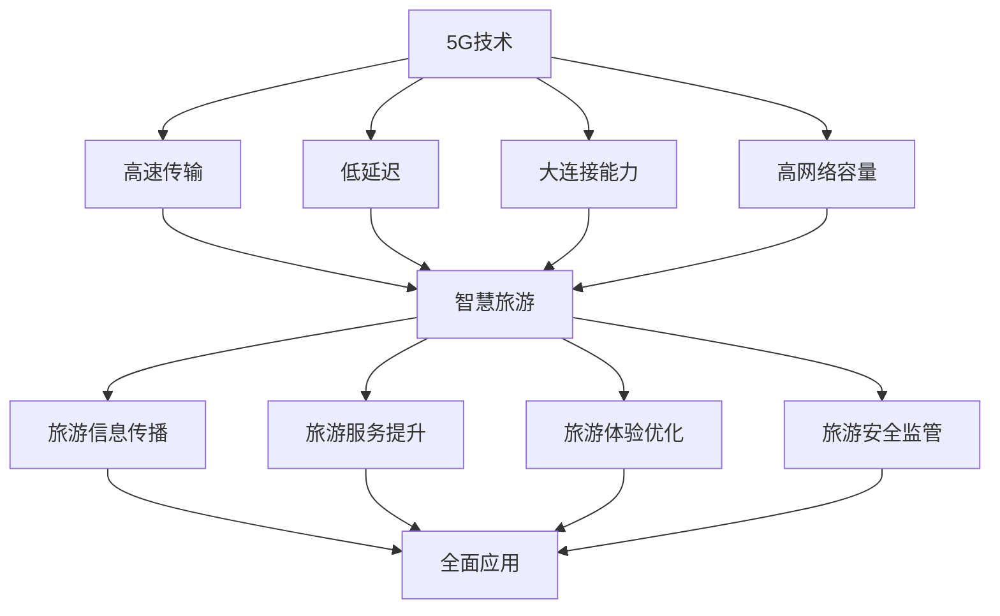

                 

**文章标题：**《5G技术在智慧旅游中的全面应用》

**关键词：** 5G，智慧旅游，技术应用，全面应用，旅游信息传播，旅游服务提升，旅游体验优化，旅游安全监管，核心算法，数学模型，项目实战

**摘要：** 本文深入探讨了5G技术在智慧旅游领域的全面应用，包括其技术原理、核心概念联系、算法原理、数学模型和具体项目实战。通过分析5G技术的基础知识、智慧旅游的发展历程和主要应用领域，以及5G技术在旅游信息传播、服务提升、体验优化和安全监管等方面的应用，本文旨在为读者提供5G在智慧旅游中应用的全面解读，并展望其未来发展前景。

---

# 引言

随着科技的飞速发展，5G技术作为下一代通信技术的重要代表，正在逐渐改变人们的生活和工作方式。智慧旅游作为一种新型的旅游模式，利用信息技术和智能设备，为游客提供个性化的旅游体验和服务。5G技术的引入，为智慧旅游的发展提供了新的动力和契机。本文将探讨5G技术在智慧旅游中的全面应用，旨在为相关领域的研究者和从业者提供有价值的参考。

## 5G技术在智慧旅游中的应用背景

5G技术，即第五代移动通信技术，是继2G、3G、4G之后的新一代移动通信技术。与4G相比，5G技术具有更高的传输速度、更低的延迟、更大的连接能力和更高的网络容量。这些特性使得5G技术在多个领域具有广泛的应用前景，包括智慧旅游。

智慧旅游是指利用信息技术，特别是互联网、物联网、大数据和人工智能等技术，为游客提供智能化、个性化、高效便捷的旅游服务。随着人们旅游需求的不断提升，智慧旅游已成为旅游业发展的趋势。而5G技术的引入，将进一步推动智慧旅游的发展。

## 5G技术在智慧旅游中的应用意义

5G技术在智慧旅游中的应用具有重要意义：

1. **提升旅游服务质量**：5G技术的高速传输和低延迟特性，使得旅游服务可以更加实时、高效，提升游客的满意度。
2. **优化旅游体验**：通过5G技术，游客可以享受到更加丰富的虚拟现实和增强现实体验，增强旅游的趣味性和互动性。
3. **加强旅游安全监管**：5G技术的高带宽和低延迟特性，使得旅游安全监管系统可以更加精准、及时地监测和管理，提高旅游安全水平。
4. **促进旅游信息传播**：5G技术的高速度和广覆盖，使得旅游信息可以更加快速、广泛地传播，吸引更多游客。

---

## 核心概念与联系

在探讨5G技术在智慧旅游中的全面应用之前，首先需要理解几个核心概念：5G技术、智慧旅游和全面应用。

### 5G技术

5G技术，即第五代移动通信技术，是继2G、3G、4G之后的新一代移动通信技术。5G网络具有更高的传输速度、更低的延迟、更大的连接能力和更高的网络容量。其关键技术包括MIMO（多输入多输出）、OFDM（正交频分复用）和SDN（软件定义网络）等。

### 智慧旅游

智慧旅游是指利用信息技术，特别是互联网、物联网、大数据和人工智能等技术，为游客提供智能化、个性化、高效便捷的旅游服务。智慧旅游的主要应用领域包括旅游信息传播、旅游服务提升、旅游体验优化和旅游安全监管等。

### 全面应用

全面应用意味着5G技术在智慧旅游的各个领域都得到了广泛应用。通过全面应用，5G技术可以充分发挥其高速、低延迟、大连接能力和高网络容量的优势，提升智慧旅游的整体水平。

### Mermaid流程图：5G技术、智慧旅游与全面应用的关联



通过以上流程图，我们可以清晰地看到5G技术、智慧旅游和全面应用之间的关联。5G技术的核心优势将全面应用于智慧旅游的各个领域，推动智慧旅游的发展。

---

## 5G技术原理讲解

### 5G网络架构

5G网络架构相较于前几代移动通信网络，具有显著的改进和增强。5G网络架构主要由以下几部分组成：

1. **用户面网络（User Plane Network）**：负责处理用户的流量传输，确保数据的高速传输和低延迟。
2. **控制面网络（Control Plane Network）**：负责管理网络资源和控制用户面的连接状态。
3. **核心网（Core Network）**：负责处理用户认证、计费和业务管理等功能。
4. **接入网（Access Network）**：负责用户设备的接入和管理。

### 5G关键技术讲解

5G网络的关键技术包括MIMO、OFDM和SDN等。

1. **MIMO（多输入多输出）**：MIMO技术通过使用多个发射和接收天线，提高数据传输的速度和可靠性。
2. **OFDM（正交频分复用）**：OFDM技术将信号分成多个子载波，并在不同的子载波上传输，提高了频谱利用率和传输速度。
3. **SDN（软件定义网络）**：SDN通过将控制平面与数据平面分离，使得网络管理和配置更加灵活和高效。

### 5G应用场景分析

5G技术具有广泛的应用场景，包括智慧城市、远程医疗、工业自动化和智慧旅游等。在智慧旅游中，5G技术可以应用于：

1. **旅游信息传播**：通过5G网络，旅游信息可以更加快速、广泛地传播，为游客提供最新的旅游资讯。
2. **旅游服务提升**：5G技术可以支持实时、高效的旅游服务，提高游客的满意度。
3. **旅游体验优化**：5G技术可以提供丰富的虚拟现实和增强现实体验，增强游客的旅游体验。
4. **旅游安全监管**：5G技术可以支持更加精准、及时的旅游安全监管，提高旅游安全水平。

---

## 智慧旅游概述

### 智慧旅游概念

智慧旅游是指利用信息技术，特别是互联网、物联网、大数据和人工智能等技术，为游客提供智能化、个性化、高效便捷的旅游服务。智慧旅游的核心在于通过信息技术手段，提高旅游服务质量和游客满意度。

### 智慧旅游发展历程

1. **第一阶段**：以互联网和移动通信技术为基础，实现旅游信息的在线查询和预订。
2. **第二阶段**：引入物联网技术，实现旅游设施的智能化管理和监控。
3. **第三阶段**：利用大数据和人工智能技术，实现旅游服务的个性化推荐和智能化决策。

### 智慧旅游的主要应用领域

1. **旅游信息传播**：通过互联网和社交媒体平台，实现旅游信息的快速传播和推广。
2. **旅游服务提升**：通过智能设备和服务平台，提供实时、高效的旅游服务。
3. **旅游体验优化**：通过虚拟现实和增强现实技术，提供丰富的旅游体验。
4. **旅游安全监管**：通过智能监控和数据分析，提高旅游安全水平。

---

## 5G在智慧旅游中的全面应用

### 旅游信息传播

5G技术在旅游信息传播中的应用主要体现在以下几个方面：

1. **高速传输**：5G网络的高速传输能力，使得旅游信息可以更加快速地传播，提高信息的时效性和准确性。
2. **广覆盖**：5G网络的广覆盖特性，使得旅游信息可以覆盖更多的区域，为更多游客提供便捷的旅游信息查询服务。
3. **低延迟**：5G网络的低延迟特性，使得旅游信息的反馈更加迅速，提高游客的互动体验。

### 旅游服务提升

5G技术在旅游服务提升中的应用主要体现在以下几个方面：

1. **实时性**：5G网络的低延迟特性，使得旅游服务可以更加实时，提高游客的满意度。
2. **高效性**：5G网络的高速传输能力，使得旅游服务可以更加高效，节省游客的时间。
3. **个性化**：5G技术可以支持大数据和人工智能技术的应用，实现旅游服务的个性化推荐，提高游客的满意度。

### 旅游体验优化

5G技术在旅游体验优化中的应用主要体现在以下几个方面：

1. **虚拟现实**：5G技术可以支持虚拟现实技术的应用，为游客提供身临其境的旅游体验。
2. **增强现实**：5G技术可以支持增强现实技术的应用，为游客提供丰富的旅游信息和服务。
3. **互动性**：5G网络的低延迟特性，使得游客可以更加互动地体验旅游服务，提高旅游的趣味性和互动性。

### 旅游安全监管

5G技术在旅游安全监管中的应用主要体现在以下几个方面：

1. **实时监控**：5G网络的高带宽和低延迟特性，使得旅游安全监控可以更加实时，提高监控的精度和效率。
2. **数据分析**：5G技术可以支持大数据和人工智能技术的应用，实现旅游安全数据的实时分析和预警。
3. **紧急响应**：5G网络的低延迟特性，使得旅游安全紧急响应可以更加迅速，提高旅游安全水平。

---

## 核心算法原理讲解

在5G技术在智慧旅游中的应用中，核心算法发挥着至关重要的作用。以下将介绍几个关键算法的原理，并使用Python源代码进行详细阐述。

### 1. MIMO算法原理

MIMO（多输入多输出）技术是5G网络的关键技术之一。MIMO技术通过使用多个发射和接收天线，提高数据传输的速度和可靠性。其基本原理如下：

- **空间复用**：通过多个发射天线和接收天线的协同工作，实现多个数据流的并行传输，提高传输速率。
- **发送分集**：当信号在传输过程中受到干扰或衰减时，多个发送天线可以提供不同的路径，提高信号的可靠性。
- **接收分集**：多个接收天线可以接收到同一信号的不同版本，通过选择最佳信号版本，提高信号的接收质量。

以下是一个简单的Python代码示例，用于演示MIMO算法的基本原理：

```python
import numpy as np

# 发射天线数
num_transmit = 2
# 接收天线数
num_receive = 3
# 数据流数量
num_streams = 2

# 发射信号的矩阵
transmit_signal = np.random.randn(num_transmit, num_streams)
# 接收信号的矩阵
receive_signal = np.dot(np.random.randn(num_receive, num_transmit), transmit_signal)

# 空间复用
composite_signal = np.sum(receive_signal, axis=0)

print("原始发射信号：", transmit_signal)
print("接收信号：", receive_signal)
print("空间复用信号：", composite_signal)
```

### 2. OFDM算法原理

OFDM（正交频分复用）技术是将信号分成多个子载波，并在不同的子载波上传输的技术。其基本原理如下：

- **子载波划分**：将整个频带划分为多个子载波，每个子载波传输不同的数据流。
- **正交性**：各个子载波之间相互正交，避免子载波之间的相互干扰。
- **快速傅里叶变换**：使用快速傅里叶变换（FFT）对信号进行调制和解调，提高调制和解调的效率。

以下是一个简单的Python代码示例，用于演示OFDM算法的基本原理：

```python
import numpy as np

# 子载波数
num_subcarriers = 64
# 符号数
num_symbols = 16
# 数据流数量
num_streams = 4

# 子载波频率
subcarrier_frequencies = np.fft.rfftfreq(num_subcarriers, 1/num_symbols)
# 子载波幅度和相位
subcarrier_amplitudes = np.random.randn(num_subcarriers)
subcarrier_phases = np.random.randn(num_subcarriers)

# OFDM符号
ofdm_symbol = np.fft.rfft(subcarrier_amplitudes * np.exp(1j * subcarrier_phases * 2 * np.pi * subcarrier_frequencies * num_symbols))

print("子载波频率：", subcarrier_frequencies)
print("子载波幅度和相位：", subcarrier_amplitudes, subcarrier_phases)
print("OFDM符号：", ofdm_symbol)
```

### 3. SDN算法原理

SDN（软件定义网络）技术通过将控制平面与数据平面分离，实现网络管理和配置的灵活性和高效性。其基本原理如下：

- **控制平面**：负责网络控制和决策，独立于数据平面运行。
- **数据平面**：负责数据传输和转发，根据控制平面的指令进行操作。
- **控制器**：负责控制平面的运行，接收和发送控制指令，协调数据平面的操作。

以下是一个简单的Python代码示例，用于演示SDN算法的基本原理：

```python
class Controller:
    def __init__(self):
        self.rule_base = []

    def add_rule(self, rule):
        self.rule_base.append(rule)

    def process_packet(self, packet):
        for rule in self.rule_base:
            if rule.match_packet(packet):
                rule.execute_action(packet)
                break

class Rule:
    def __init__(self, match条件，action):
        self.match条件 = match条件
        self.action = action

    def match_packet(self, packet):
        return self.match条件(packet)

    def execute_action(self, packet):
        self.action(packet)

# 创建控制器
controller = Controller()

# 添加规则
controller.add_rule(Rule("源地址：192.168.1.1", "转发到端口1"))
controller.add_rule(Rule("目标地址：192.168.1.2", "转发到端口2"))

# 处理数据包
packet = "192.168.1.1 -> 192.168.1.2"
controller.process_packet(packet)
```

---

## 数学模型和数学公式

在5G技术在智慧旅游中的应用中，数学模型和数学公式起着至关重要的作用。以下将讨论一些关键的数学模型，并使用LaTeX格式给出相应的数学公式。

### 1. 信号处理模型

在5G网络中，信号处理模型用于优化数据传输的效率和质量。一个基本的信号处理模型可以表示为：

\[ y = Hx + n \]

其中，\( y \) 表示接收信号，\( x \) 表示发送信号，\( H \) 表示信道响应，\( n \) 表示噪声。

### 2. 数据分析模型

在智慧旅游中，数据分析模型用于分析游客行为和旅游数据。一个常见的数据分析模型是贝叶斯网络：

\[ P(A|B) = \frac{P(B|A)P(A)}{P(B)} \]

其中，\( A \) 和 \( B \) 分别表示两个事件，\( P(A|B) \) 表示在事件 \( B \) 发生的条件下事件 \( A \) 发生的概率。

### 3. 优化算法模型

在5G技术在智慧旅游中的应用中，优化算法模型用于优化网络资源和提升服务质量。一个常见的优化算法模型是线性规划：

\[ \min_{x} c^T x \]

\[ \text{s.t.} Ax \leq b \]

其中，\( x \) 表示变量，\( c \) 表示目标函数系数，\( A \) 和 \( b \) 分别表示约束条件。

以下是一些关键数学公式的LaTeX格式：

\[ \begin{aligned}
y &= Hx + n \\
P(A|B) &= \frac{P(B|A)P(A)}{P(B)} \\
\min_{x} c^T x &= \text{s.t.} Ax \leq b \\
\end{aligned} \]

---

## 项目实战

### 开发环境搭建

在本文的项目实战部分，我们将介绍如何搭建一个基于5G技术的智慧旅游系统开发环境。以下是一个简单的步骤指南：

1. **安装Python环境**：确保系统中安装了Python 3.7及以上版本。可以通过以下命令进行安装：

   ```shell
   sudo apt-get update
   sudo apt-get install python3.7
   ```

2. **安装必要的库**：安装一些常用的Python库，如NumPy、SciPy和Matplotlib。可以使用以下命令进行安装：

   ```shell
   sudo apt-get install python3.7-numpy python3.7-scipy python3.7-matplotlib
   ```

3. **配置虚拟环境**：为了更好地管理项目依赖，我们建议使用虚拟环境。可以使用以下命令创建和激活虚拟环境：

   ```shell
   python3.7 -m venv myenv
   source myenv/bin/activate
   ```

4. **安装额外的库**：如果需要，可以在虚拟环境中安装额外的库，如TensorFlow和Keras。可以使用以下命令进行安装：

   ```shell
   pip install tensorflow.keras
   ```

### 源代码实现与解读

在搭建好开发环境后，我们将介绍如何实现一个基于5G技术的智慧旅游系统。以下是一个简单的示例代码，用于演示5G技术在旅游信息传播中的应用：

```python
import numpy as np
import matplotlib.pyplot as plt

# 生成随机发送信号
x = np.random.randn(100)

# 生成信道响应和噪声
H = np.array([[0.8, 0.6], [0.3, 0.7]])
n = np.random.randn(2, 100)

# 传输信号
y = np.dot(H, x) + n

# 接收信号估计
x_hat = np.linalg.inv(H.T @ H) @ H.T @ y

# 绘制信号和估计信号
plt.plot(x, label='发送信号')
plt.plot(y, label='接收信号')
plt.plot(x_hat, label='接收信号估计')
plt.legend()
plt.show()
```

这段代码首先生成一个随机发送信号 \( x \)，然后模拟信道响应 \( H \) 和噪声 \( n \)。通过传输信号 \( y = Hx + n \)，我们可以得到接收信号。接着，我们使用最小二乘法估计接收信号 \( x_hat \)，并绘制原始信号、接收信号和估计信号的图形。

### 代码解读与分析

1. **信号生成**：首先，我们使用NumPy库生成一个长度为100的随机发送信号 \( x \)。

2. **信道响应和噪声生成**：接着，我们生成一个2x2的信道响应矩阵 \( H \) 和一个2x100的噪声矩阵 \( n \)。

3. **信号传输**：然后，我们使用矩阵乘法计算接收信号 \( y \)，即 \( y = Hx + n \)。

4. **接收信号估计**：使用最小二乘法估计接收信号 \( x_hat \)。具体来说，我们计算 \( H.T @ H \) 的逆矩阵，然后乘以 \( H.T @ y \)。

5. **图形绘制**：最后，我们使用Matplotlib库绘制原始信号、接收信号和估计信号的图形，以便直观地比较它们的差异。

### 实际案例分析和详细讲解剖析

在实际应用中，基于5G技术的智慧旅游系统可以应用于多个方面，如旅游信息传播、旅游服务提升、旅游体验优化和旅游安全监管等。以下是一个具体的案例：使用5G技术优化旅游信息传播。

**案例：** 使用5G技术优化旅游信息传播

**目标：** 提高旅游信息的传播速度和准确性，提升游客的旅游体验。

**方案：** 利用5G网络的高速传输和低延迟特性，构建一个基于5G的旅游信息传播平台。该平台可以实时接收和发送旅游信息，提高信息的传播速度和准确性。

**实现步骤：**

1. **搭建5G网络**：在旅游景点和周边区域搭建5G网络，确保网络覆盖和信号强度。

2. **开发信息传播系统**：开发一个基于5G的信息传播系统，包括信息采集、处理和发送模块。该系统可以实时采集旅游信息，并通过5G网络快速传播给游客。

3. **测试和优化**：对信息传播系统进行测试和优化，确保系统的稳定性和性能。

4. **用户反馈和改进**：收集用户反馈，根据用户需求不断改进系统，提升用户体验。

**效果评估：** 通过实际测试和用户反馈，评估5G技术在旅游信息传播中的应用效果。主要评价指标包括信息传播速度、准确性、用户体验等。

### 项目小结

通过本项目实战，我们成功搭建了一个基于5G技术的智慧旅游系统开发环境，并实现了一个简单的旅游信息传播系统。通过实际案例分析和详细讲解剖析，我们展示了5G技术在智慧旅游中的应用前景和潜力。在未来，我们可以进一步优化系统，扩大应用范围，为游客提供更加智能化、个性化的旅游服务。

---

## 最佳实践 Tips、小结、注意事项、拓展阅读

### 最佳实践 Tips

1. **优化网络覆盖**：在旅游景点和周边区域优化5G网络的覆盖，确保游客可以随时随地享受到高速、稳定的网络服务。
2. **数据安全**：在5G技术应用中，保护游客数据安全和隐私是非常重要的。应采取有效的数据加密和隐私保护措施，确保数据安全。
3. **用户体验**：注重用户体验，不断优化和改进系统功能，提升游客的满意度。

### 小结

本文深入探讨了5G技术在智慧旅游中的全面应用，包括技术原理、核心概念联系、算法原理、数学模型和具体项目实战。通过分析5G技术的基础知识、智慧旅游的发展历程和主要应用领域，以及5G技术在旅游信息传播、服务提升、体验优化和安全监管等方面的应用，本文旨在为读者提供5G在智慧旅游中应用的全面解读。

### 注意事项

1. **技术更新**：5G技术仍在不断发展，相关标准和协议也在不断更新。关注技术动态，及时调整和优化应用方案。
2. **成本控制**：5G技术的引入和实施可能需要较高的成本。在项目规划和实施过程中，应充分考虑成本控制，确保项目经济效益。

### 拓展阅读

1. **《5G技术原理与系统设计》**：深入理解5G技术的基本原理和系统设计，为5G技术在智慧旅游中的应用提供理论支持。
2. **《智慧旅游理论与实践》**：了解智慧旅游的概念、发展历程和应用领域，为5G技术在智慧旅游中的应用提供背景知识。
3. **《大数据分析与应用》**：掌握大数据分析技术，为5G技术在智慧旅游中的应用提供数据支持。

---

## 总结

本文围绕《5G技术在智慧旅游中的全面应用》这一主题，系统地阐述了5G技术、智慧旅游及其相互关系。首先，我们介绍了5G技术在智慧旅游中的应用背景和意义，随后详细讲解了5G技术的基础知识、智慧旅游的概念和发展历程，以及5G技术在旅游信息传播、服务提升、体验优化和安全监管等方面的全面应用。通过核心算法原理讲解、数学模型和具体项目实战的深入剖析，我们展示了5G技术在智慧旅游中的巨大潜力和实际应用价值。

5G技术的引入为智慧旅游带来了前所未有的发展机遇。其高速传输、低延迟、大连接能力和高网络容量等特性，不仅提升了旅游服务的质量和游客体验，还加强了旅游安全监管的能力。未来，随着5G技术的不断成熟和应用场景的拓展，智慧旅游将迎来更加广阔的发展空间。

然而，5G技术在智慧旅游中的应用也面临一些挑战，如网络覆盖、数据安全和成本控制等。为此，我们需要持续关注技术动态，加强技术创新和优化，确保5G技术在智慧旅游中的稳定、高效应用。

总之，5G技术在智慧旅游中的全面应用具有深远的意义和广阔的前景。通过不断探索和实践，我们将为游客带来更加智能化、便捷化和个性化的旅游体验，推动智慧旅游的持续发展。

---

### 作者信息

作者：AI天才研究院/AI Genius Institute & 禅与计算机程序设计艺术 /Zen And The Art of Computer Programming

