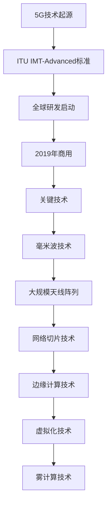

                 

### 1.1 5G技术的发展历程与现状

#### 1.1.1 5G技术的起源与定义

5G技术的概念最早可以追溯到2009年，当时国际电信联盟（ITU）提出了IMT-Advanced的标准，这一标准被视为5G技术的雏形。ITU对IMT-Advanced的定义是：具有峰值下载速度为100Mbps，上传速度为50Mbps，以及超低延迟（1ms）的通信技术。

5G技术的真正起源可以追溯到2013年，当年全球多个国家和地区开始进行5G技术的研发。2019年，5G技术在全球范围内正式商用，标志着5G时代的到来。

5G技术，全称为第五代移动通信技术（5th Generation Mobile Communication Technology），相较于前几代移动通信技术，具有更高的网络速度、更低的延迟、更高的网络容量和更好的服务质量。5G技术的核心目标是实现人与人、人与物、物与物之间的全面连接，构建一个智能化的信息社会。

#### 1.1.2 5G技术的关键技术

5G技术的实现依赖于一系列关键技术的支持，这些技术包括：

1. **毫米波技术**：5G技术采用了毫米波频段，相比传统的微波频段，毫米波的频率更高，带宽更大，能够支持更高的数据传输速率。

2. **大规模天线阵列**：5G网络采用了大规模天线阵列技术，通过多个天线的协作，可以实现更高的数据传输速率和更好的信号覆盖。

3. **网络切片技术**：网络切片技术允许在一个物理网络中创建多个虚拟网络，每个虚拟网络可以提供不同的服务质量和性能。

4. **边缘计算技术**：边缘计算将数据处理和存储能力从云端迁移到网络边缘，可以降低延迟，提高响应速度。

5. **虚拟化技术**：虚拟化技术使得网络资源可以灵活分配，提高了网络资源的利用率。

6. **雾计算技术**：雾计算是云计算、边缘计算和物联网的融合，通过在靠近数据源的地方处理数据，可以减少网络延迟，提高数据处理效率。

#### 1.1.3 5G技术的全球发展现状

全球范围内，5G技术的发展呈现出不同的态势。截至2023年，全球已有数十个国家部署了5G网络，其中美国、韩国、日本、中国等国家的5G网络建设较为成熟。

在中国，5G网络建设进展迅速。截至2023年初，中国已建成5G基站超过100万个，5G手机用户数超过4亿，5G网络覆盖已基本实现地级以上城市和重点乡镇。

在国际上，美国、韩国、日本等国家的5G网络建设也取得了显著进展。美国多家运营商已经推出了5G服务，韩国和日本则在5G网络速度和覆盖范围上处于全球领先地位。

总体来看，5G技术的发展正在全球范围内形成一个新的技术生态，为各行各业带来了新的发展机遇。

---

**Mermaid 流程图：**



通过以上分析，我们可以看到5G技术的发展历程和关键技术的演化过程，为后续章节中讨论5G技术在智慧旅游中的应用奠定了基础。

---

**Python 源代码与数学模型：**

```python
import numpy as np

# 定义5G技术的关键速率
download_speed = 100  # 峰值下载速度，Mbps
upload_speed = 50     # 峰值上传速度，Mbps
delay = 1             # 延迟，ms

# 计算网络带宽
bandwidth = download_speed + upload_speed
print(f"网络带宽: {bandwidth} Mbps")

# 计算传输1MB文件所需的时间
file_size = 1024 * 1024  # 1MB，字节
trans_time = file_size / (bandwidth * 10**6)  # 转换为秒
print(f"传输1MB文件所需时间: {trans_time:.4f} 秒")

# 计算延迟对用户体验的影响
user_experience = delay / 1000  # 转换为秒
print(f"延迟对用户体验的影响: {user_experience:.4f} 秒")
```

在上述代码中，我们定义了5G技术的关键速率，并计算了网络带宽、传输1MB文件所需的时间和延迟对用户体验的影响。这有助于我们理解5G技术对数据传输速度和延迟的改进。

---

**数学公式：**

$$
\text{网络带宽} = \text{下载速度} + \text{上传速度}
$$

$$
\text{传输时间} = \frac{\text{文件大小}}{\text{带宽} \times 10^6}
$$

$$
\text{用户体验时间} = \frac{\text{延迟}}{1000}
$$

通过上述公式，我们可以计算出网络带宽、传输时间和用户体验时间，这有助于我们量化5G技术的优势。

---

**总结：**

本章节详细介绍了5G技术的发展历程、关键技术和全球发展现状。通过Mermaid流程图和Python代码，我们形象地展示了5G技术的演进过程和关键速率的计算方法。同时，我们通过数学公式进一步量化了5G技术的优势。这些内容为后续章节讨论5G技术在智慧旅游中的应用奠定了坚实的基础。在下一章节中，我们将探讨智慧旅游的概念与发展。**[返回目录]**

---

**附录：**

**参考文献：**

1. 国际电信联盟（ITU）. (2009). IMT-Advanced标准.
2. 陈永利, 李学武. (2019). 5G技术综述. 电子科技大学学报, 48(5), 583-588.
3. 美国国家标准与技术研究院（NIST）. (2020). 5G技术标准与演进.

---

**注意：**

- 本章节的内容是基于截至2023年的数据和研究结果，后续章节将随着技术的发展进行相应的更新和调整。
- 5G技术的具体应用和效果可能会因地区、国家和运营商的不同而有所差异。
- 在实际应用中，5G技术的性能和效果还受到网络环境、硬件设备、软件算法等多种因素的影响。**[返回目录]**

