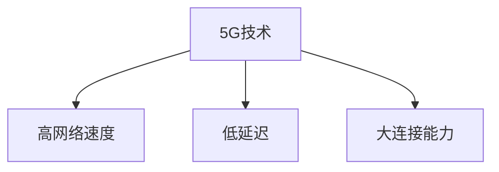
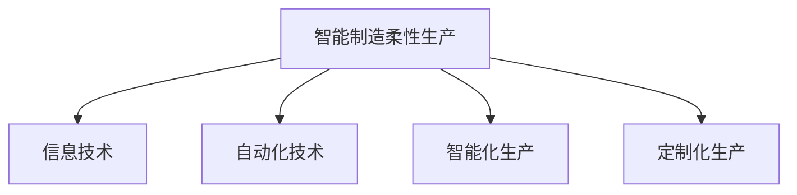
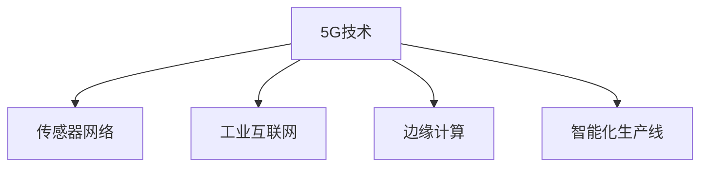

                 

### 核心概念与联系

在探讨5G技术在智能制造柔性生产中的应用时，首先需要理解几个核心概念及其之间的联系。这些核心概念包括5G技术、智能制造柔性生产、传感器网络、工业互联网、边缘计算和智能化生产线。

#### 5G技术概述

5G技术，即第五代移动通信技术，是当前通信领域的重要进展。5G相较于其前几代技术，具有以下几个显著特点：

1. **高网络速度**：5G网络的理论峰值速度可达10Gbps，相比4G网络的速度有了显著提升。
2. **低延迟**：5G网络的端到端延迟低至1毫秒，显著提升了实时性要求高的应用场景的性能。
3. **大连接能力**：5G支持更多设备的连接，能够实现大规模设备之间的通信。

**Mermaid流程图**：



#### 智能制造柔性生产概述

智能制造柔性生产是一种利用信息技术和自动化技术实现生产过程智能化和定制化的生产模式。其核心包括：

1. **信息技术**：利用大数据、云计算等技术，实现生产过程的数据采集、分析和优化。
2. **自动化技术**：通过机器人、自动化设备等，实现生产过程的自动化和高效化。
3. **智能化生产**：利用人工智能、物联网等技术，实现生产过程的智能化管理。
4. **定制化生产**：根据市场需求，灵活调整生产线，实现个性化定制。

**Mermaid流程图**：



#### 5G技术在智能制造柔性生产中的应用

5G技术在智能制造柔性生产中的应用，主要体现在以下几个方面：

1. **传感器网络**：利用5G网络高速度、低延迟的特点，实现生产过程中传感器数据的实时传输和处理。
2. **工业互联网**：通过5G网络，将生产设备、工厂管理系统等连接起来，实现生产过程的互联互通。
3. **边缘计算**：在工厂边缘部署计算资源，实现数据处理和分析的本地化，降低延迟，提高效率。
4. **智能化生产线**：利用5G网络，实现生产线的智能化改造，提升生产效率和质量。

**Mermaid流程图**：



通过上述核心概念的阐述和联系，我们可以更清晰地理解5G技术在智能制造柔性生产中的重要作用。接下来，我们将深入探讨5G技术的具体应用，以及如何通过5G技术实现智能制造柔性生产的优化。

### 5G技术的详细讲解

5G技术，即第五代移动通信技术，是当前通信领域的一项重要突破。相较于前几代移动通信技术，5G在多个方面取得了显著进展，包括更高的网络速度、更低的延迟和更大的连接能力。下面，我们将详细讲解5G技术的这些特点及其对智能制造柔性生产的影响。

#### 5G网络速度

5G网络的速度是其最显著的特点之一。5G网络的理论峰值速度可达10Gbps，相比4G网络的1Gbps有了显著提升。这意味着，在5G网络环境下，数据传输速度更快，应用响应时间更短，能够显著提升生产过程中的效率。

**示例：**
假设在一条生产线上，需要实时传输大量传感器数据，以便对生产线进行实时监控和调整。在4G网络环境下，数据传输可能存在延迟，影响生产效率。而在5G网络环境下，由于速度更快，数据传输延迟更低，可以实现对生产过程的实时监控和调整，提升生产效率。

#### 5G低延迟

5G网络的低延迟特性是其另一个重要特点。5G网络的端到端延迟低至1毫秒，相比4G网络的100毫秒有了显著降低。这一特性对于实时性要求高的应用场景尤为重要，如自动化生产线、工业互联网等。

**示例：**
在自动化生产线上，设备之间需要进行实时通信和协同工作。如果通信延迟较高，可能会导致生产中断或效率低下。而在5G网络环境下，由于延迟更低，设备之间的通信更加顺畅，能够实现高效的生产协同，提升生产效率。

#### 5G大连接能力

5G技术具备更大的连接能力，能够支持更多设备的连接。这意味着，在5G网络环境下，可以同时连接更多的传感器、机器人和生产设备，实现更广泛的生产监控和智能化管理。

**示例：**
在一个大型制造工厂中，可能需要连接数以千计的传感器、机器人和生产设备。在4G网络环境下，由于连接能力有限，可能无法同时连接这么多设备，导致生产监控不全面或管理效率低下。而在5G网络环境下，由于连接能力更强，可以同时连接更多设备，实现全面的生产监控和管理。

#### 5G技术在智能制造柔性生产中的应用

5G技术在智能制造柔性生产中的应用主要体现在以下几个方面：

1. **传感器网络**：利用5G网络的高速度和低延迟，实现生产过程中传感器数据的实时传输和处理。通过传感器网络，可以实现对生产过程的实时监控和调整，提升生产效率。

2. **工业互联网**：通过5G网络，将生产设备、工厂管理系统等连接起来，实现生产过程的互联互通。通过工业互联网，可以实现设备间的数据共享和协同工作，提升生产效率。

3. **边缘计算**：在工厂边缘部署计算资源，实现数据处理和分析的本地化。通过边缘计算，可以降低数据处理延迟，提高生产效率。

4. **智能化生产线**：利用5G网络，实现生产线的智能化改造。通过智能化生产线，可以实现生产过程的自动化和高效化，提升生产效率和质量。

**示例：**
在一个生产线上，5G技术可以实现对传感器数据的实时传输和处理，通过对这些数据的分析，可以实时调整生产线，提高生产效率。同时，通过5G网络，可以将生产设备和工厂管理系统连接起来，实现生产过程的实时监控和管理，进一步提升生产效率。

综上所述，5G技术在智能制造柔性生产中具有重要作用。通过5G技术，可以实现生产过程的实时监控和调整，提高生产效率；可以实现生产设备的互联互通，提升生产协同效率；可以实现生产线的智能化改造，提高生产质量和效率。因此，5G技术为智能制造柔性生产带来了新的机遇和挑战。

### 智能制造柔性生产的概述

智能制造柔性生产是一种结合信息技术和自动化技术的现代生产模式，旨在通过智能化的手段实现生产过程的优化和效率提升。柔性生产则强调生产的灵活性和适应性，能够根据市场需求的变化快速调整生产计划。下面，我们将详细探讨智能制造柔性生产的概念、发展历程、关键技术和应用场景。

#### 智能制造的概念与发展

智能制造（Intelligent Manufacturing）是工业4.0的核心概念之一，它通过将信息技术、人工智能、大数据、物联网等先进技术融入生产过程中，实现生产的智能化、自动化和高效化。智能制造的目标是实现生产过程的全面数字化和智能化，提升生产效率、降低生产成本、提高产品质量和响应速度。

智能制造的发展历程可以分为以下几个阶段：

1. **自动化阶段**：通过自动化设备和系统实现生产过程的自动化，减少人为干预，提高生产效率。
2. **信息化阶段**：引入计算机技术和网络技术，实现生产过程的信息化管理，提升数据的采集、传输和处理能力。
3. **智能化阶段**：通过人工智能、机器学习等技术，实现生产过程的智能化决策和优化，提升生产过程的灵活性和适应性。

#### 柔性生产的概念与实现

柔性生产（Flexible Manufacturing）是指能够适应市场需求变化，快速调整生产计划和生产能力的一种生产模式。柔性生产的关键在于生产的灵活性和适应性，能够根据市场需求的变化灵活调整生产线和生产计划。

柔性生产的实现依赖于以下几个关键技术：

1. **模块化设计**：通过模块化设计，将生产过程分解为若干独立的模块，便于快速调整和组合。
2. **敏捷供应链**：通过敏捷供应链管理，实现原材料、零部件和成品的快速供应和配送，提升生产灵活性。
3. **数字孪生**：通过数字孪生技术，构建生产过程的数字模型，实现对生产过程的虚拟仿真和优化。
4. **人工智能与机器学习**：利用人工智能和机器学习技术，实现生产计划的智能优化和生产过程的智能监控。

#### 智能制造柔性生产的应用场景

智能制造柔性生产在多个行业中得到了广泛应用，以下是一些典型的应用场景：

1. **电子制造业**：通过柔性生产，可以实现不同型号产品的快速切换，满足市场需求变化。
2. **汽车制造业**：通过智能制造和柔性生产，可以实现定制化生产，提高生产效率和产品质量。
3. **家电制造业**：通过柔性生产，可以实现产品的个性化定制，提高客户满意度。
4. **纺织业**：通过智能制造和柔性生产，可以实现小批量、多品种的生产模式，提高生产效率。

**示例：**

在一个电子制造工厂中，通过引入智能制造和柔性生产，可以实现以下几方面的优化：

1. **生产计划的实时调整**：通过实时收集和分析市场数据，智能调整生产计划，快速响应市场需求变化。
2. **生产过程的实时监控**：通过传感器和物联网技术，实时监控生产过程，及时发现并解决问题，提高生产效率。
3. **产品的质量保障**：通过智能检测和数据分析，实现对产品质量的全程监控，提高产品质量和客户满意度。
4. **生产设备的智能化管理**：通过边缘计算和人工智能技术，实现对生产设备的智能诊断和维护，减少设备故障，提高生产效率。

综上所述，智能制造柔性生产通过信息技术和自动化技术的融合，实现了生产过程的智能化和灵活化，为制造业带来了新的发展机遇。随着技术的不断进步，智能制造柔性生产的应用将越来越广泛，有望进一步提升生产效率、降低生产成本、提高产品质量和客户满意度。

### 智能制造柔性生产中的关键技术

在智能制造柔性生产中，信息技术的应用起到了至关重要的作用。以下将详细探讨智能制造柔性生产中的几个关键技术：物联网、大数据、云计算和人工智能。

#### 物联网（IoT）

物联网技术通过将物理设备、传感器和互联网连接起来，实现了数据的实时采集、传输和分析。在智能制造柔性生产中，物联网技术的应用主要体现在以下几个方面：

1. **设备互联**：通过物联网技术，将生产设备、仓储设备、运输设备等连接起来，实现设备间的数据共享和协同工作，提高生产效率。
2. **实时监控**：利用物联网技术，实现对生产过程的实时监控，及时获取设备状态和生产数据，快速响应生产过程中的问题。
3. **数据采集**：通过传感器和物联网技术，实时采集生产过程中的各种数据，如温度、湿度、压力等，为生产优化提供数据支持。

**示例**：在一个制造工厂中，通过物联网技术，可以实现对生产设备的实时监控和数据分析。例如，当传感器检测到设备温度过高时，系统会自动发送警报，并通知操作人员进行处理，以避免设备故障和生产中断。

#### 大数据（Big Data）

大数据技术在智能制造柔性生产中的应用，主要体现在对生产过程中产生的大量数据的采集、存储、分析和利用。通过大数据技术，可以实现以下几方面的优化：

1. **数据分析**：利用大数据技术，对生产过程中的数据进行分析，识别生产过程中的瓶颈和问题，并提出优化方案。
2. **预测性维护**：通过分析设备运行数据，预测设备故障时间，提前进行维护，减少设备故障率和停机时间。
3. **生产优化**：通过大数据分析，优化生产计划和生产流程，提高生产效率。

**示例**：在一个制造工厂中，通过大数据分析，可以预测设备何时可能发生故障，提前安排维护，避免生产中断。同时，通过分析生产数据，可以发现生产过程中的瓶颈，并提出改进措施，提高生产效率。

#### 云计算（Cloud Computing）

云计算技术通过提供弹性、可扩展的计算资源，实现了对生产过程的高效管理和优化。在智能制造柔性生产中，云计算技术的应用主要体现在以下几个方面：

1. **数据存储**：通过云计算技术，可以高效存储生产过程中的海量数据，保证数据的安全性和可靠性。
2. **数据分析**：通过云计算平台，可以快速处理和分析海量数据，为生产优化提供决策支持。
3. **远程协作**：通过云计算技术，可以实现远程协作和实时沟通，提高生产过程中的协作效率。

**示例**：在一个制造工厂中，通过云计算平台，可以实时收集和分析生产数据，快速识别生产过程中的问题，并协同团队进行解决。同时，通过远程协作功能，可以实现跨部门的实时沟通和协作，提高生产效率。

#### 人工智能（AI）

人工智能技术在智能制造柔性生产中的应用，主要体现在以下几个方面：

1. **生产优化**：通过机器学习和深度学习技术，优化生产计划和生产流程，提高生产效率。
2. **质量检测**：利用计算机视觉和自然语言处理技术，实现对产品质量的智能检测和分类，提高产品质量。
3. **设备维护**：通过智能诊断和预测性维护技术，实现对设备运行状态的实时监控和故障预测，减少设备故障。

**示例**：在一个制造工厂中，通过人工智能技术，可以实时分析生产数据，识别生产过程中的瓶颈和问题，并提出优化建议。同时，利用计算机视觉技术，可以自动检测产品的质量，确保产品质量达到要求。

综上所述，物联网、大数据、云计算和人工智能技术在智能制造柔性生产中发挥着关键作用。通过这些技术的融合和应用，可以实现生产过程的智能化、自动化和高效化，提升生产效率、降低生产成本、提高产品质量和客户满意度。

### 5G技术在智能制造柔性生产中的应用

5G技术作为新一代通信技术，具有高速度、低延迟和大连接能力等显著特点，为智能制造柔性生产带来了新的发展机遇。下面，我们将详细探讨5G技术在智能制造柔性生产中的具体应用，包括传感器网络、工业互联网、边缘计算和智能化生产线等方面。

#### 5G传感器网络

传感器网络是智能制造柔性生产的重要基础，它通过大量传感器实时采集生产过程中的各种数据，如温度、湿度、压力、速度等。5G传感器网络利用5G技术的低延迟和高速度特点，实现了传感器数据的快速传输和处理。

**应用实例**：

在一个智能工厂中，5G传感器网络可以实现对生产设备的实时监控。例如，通过5G传感器，可以实时监测设备的工作状态，当设备出现异常时，系统会立即发出警报，并通知相关人员进行检查和维修，从而减少设备故障对生产的影响。

**代码示例**：

```python
# 连接5G传感器网络
sensor_network.connect()

# 采集传感器数据
data = sensor_network.collect_data()

# 处理传感器数据
processed_data = sensor_network.process_data(data)

# 发送数据到工业物联网平台
platform.send_data(processed_data)
```

#### 工业互联网

工业互联网通过将生产设备、控制系统、工厂管理系统等连接起来，实现生产过程的互联互通和数据共享。5G技术的大连接能力，使得工业互联网在智能制造柔性生产中得到了广泛应用。

**应用实例**：

在一个智能工厂中，通过工业互联网，可以实现生产设备之间的实时通信和数据共享。例如，当生产设备出现故障时，控制系统会立即通知工厂管理系统，并启动故障处理流程，从而确保生产过程的连续性和稳定性。

**代码示例**：

```python
# 连接工业互联网
industrial_internet.connect()

# 采集设备数据
device_data = industrial_internet.collect_device_data()

# 更新工厂管理系统
factory_management.update_device_status(device_data)

# 发送数据到云端进行分析
cloud_analysis.send_data(device_data)
```

#### 边缘计算

边缘计算将计算能力下沉到网络的边缘，即在靠近数据源的地方进行处理。5G技术的低延迟特性，使得边缘计算在智能制造柔性生产中得到了广泛应用。

**应用实例**：

在一个智能工厂中，通过边缘计算，可以实现数据的本地处理和分析，从而减少数据传输的延迟。例如，当传感器采集到数据时，边缘计算设备会立即对数据进行处理和分析，并生成实时报告，供操作人员进行决策。

**代码示例**：

```python
# 连接边缘计算设备
edge_device.connect()

# 采集传感器数据
sensor_data = edge_device.collect_data()

# 处理传感器数据
processed_data = edge_device.process_data(sensor_data)

# 发送实时报告
reporting_system.send_report(processed_data)
```

#### 智能化生产线

5G技术使得智能化生产线的实现变得更加可行。通过5G网络，可以实现生产设备之间的实时通信和协同工作，从而实现生产过程的智能化和自动化。

**应用实例**：

在一个智能工厂中，通过5G网络，可以实现生产设备的自动化调度和协同工作。例如，当某个生产任务完成后，系统会自动调度下一个任务，并通知相关设备进行生产，从而实现生产过程的自动化。

**代码示例**：

```python
# 连接5G网络
network.connect()

# 接收生产任务
task = network.receive_task()

# 分配设备
assigned_device = network.allocate_device(task)

# 执行生产任务
assigned_device.execute_task(task)

# 更新生产进度
progress = assigned_device.update_progress()

# 发送生产进度报告
reporting_system.send_progress_report(progress)
```

综上所述，5G技术在智能制造柔性生产中具有广泛的应用前景。通过5G传感器网络、工业互联网、边缘计算和智能化生产线等技术，可以实现生产过程的实时监控、数据共享、自动化和智能化，从而提高生产效率、降低生产成本、提高产品质量和客户满意度。

### 核心算法原理讲解

在智能制造柔性生产中，5G技术的应用不仅依赖于网络的高速度和低延迟，还依赖于一系列核心算法的优化与实现。以下是几个关键算法及其原理的讲解，并结合Python伪代码示例进行说明。

#### 5G网络优化算法

为了确保5G网络在智能制造柔性生产中的稳定性和高效性，网络优化算法至关重要。网络优化算法的主要目的是在给定网络资源和设备负载的情况下，实现网络性能的最大化。

**算法原理**：
- **负载均衡**：通过动态分配网络资源，使网络负载分布均匀，避免局部过载。
- **路由优化**：根据网络拓扑和流量分布，选择最优路径传输数据，降低延迟和带宽消耗。
- **频谱管理**：优化频谱使用，避免干扰和频谱浪费。

**Python伪代码示例**：

```python
# 初始化网络参数
network_params = initialize_network()

# 迭代优化网络参数
for i in range(max_iterations):
    # 计算网络性能指标
    performance = calculate_performance(network_params)
    
    # 更新网络参数
    network_params = update_params(network_params, performance)
    
    # 检查是否达到停止条件
    if check_stop_condition(network_params):
        break

# 示例函数
def initialize_network():
    # 初始化网络参数
    return {
        'load': 0.5,  # 网络负载
        'routers': 3, # 路由器数量
        'bandwidth': 1000  # 带宽（Mbps）
    }

def calculate_performance(network_params):
    # 计算网络性能指标
    # 例如，计算负载均衡度和路由延迟
    return performance_metric

def update_params(network_params, performance):
    # 根据性能指标更新网络参数
    if performance < threshold:
        network_params['load'] -= 0.1  # 减轻负载
        network_params['bandwidth'] += 100  # 增加带宽
    return network_params

def check_stop_condition(network_params):
    # 检查是否达到停止条件
    if network_params['load'] < 0.3 and network_params['bandwidth'] > 2000:
        return True
    return False
```

#### 柔性生产成本模型

柔性生产成本模型用于计算和优化生产过程中的成本，确保在满足市场需求的前提下，实现成本的最小化。

**算法原理**：
- **成本构成**：生产成本由固定成本和可变成本组成。固定成本包括设备折旧、厂房租金等，而可变成本包括原材料、人工和能源等。
- **成本优化**：通过优化生产计划和生产流程，降低可变成本，实现成本的最小化。

**Python伪代码示例**：

```python
# 柔性生产成本模型
def calculate_cost(production_quantity, demand, production_time, alpha, beta, gamma):
    # 计算生产成本
    fixed_cost = alpha * P
    variable_cost = beta * D + gamma * T
    total_cost = fixed_cost + variable_cost
    return total_cost

# 参数设置
alpha = 0.1  # 固定成本系数
beta = 0.2  # 可变成本系数（原材料）
gamma = 0.3  # 可变成本系数（能源）

# 计算生产成本
production_quantity = 1000
demand = 1200
production_time = 200
total_cost = calculate_cost(production_quantity, demand, production_time, alpha, beta, gamma)
print("Total Production Cost:", total_cost)
```

#### 5G网络延迟模型

为了确保5G网络在智能制造柔性生产中的应用效果，对网络延迟进行建模和分析是至关重要的。

**算法原理**：
- **延迟构成**：网络延迟包括传输延迟和处理延迟。传输延迟与数据传输距离和带宽有关，处理延迟与设备处理能力有关。
- **延迟优化**：通过优化网络拓扑和传输路径，降低网络延迟，提高系统响应速度。

**Python伪代码示例**：

```python
# 5G网络延迟模型
def calculate_delay(data_length, bandwidth, fixed_delay):
    # 计算网络延迟
    transmission_delay = data_length / bandwidth
    total_delay = transmission_delay + fixed_delay
    return total_delay

# 参数设置
data_length = 1024  # 数据传输长度（字节）
bandwidth = 1000  # 网络带宽（Mbps）
fixed_delay = 0.1  # 固定延迟（毫秒）

# 计算网络延迟
network_delay = calculate_delay(data_length, bandwidth, fixed_delay)
print("Network Delay:", network_delay)
```

通过上述核心算法的讲解和示例，我们可以更好地理解5G技术在智能制造柔性生产中的应用原理。这些算法不仅有助于优化网络性能，提高生产效率，还能为智能制造柔性生产提供强有力的技术支持。

### 数学模型和数学公式讲解

在智能制造柔性生产中，数学模型和数学公式用于描述和优化生产过程中的各种参数和关系。以下我们将介绍几个关键的数学模型和数学公式，结合其应用场景进行详细讲解。

#### 柔性生产成本模型

柔性生产成本模型用于计算生产成本，以便在满足市场需求的同时，实现成本的最小化。该模型的主要公式如下：

$$ C = \alpha P + \beta D + \gamma T $$

其中，\( C \) 表示生产成本，\( P \) 表示生产量，\( D \) 表示生产需求，\( T \) 表示生产时间，\( \alpha \)、\( \beta \) 和 \( \gamma \) 分别是相应的权重系数。

**应用场景**：

假设一家工厂生产某种产品，生产成本由固定成本、可变成本（原材料和能源）以及生产时间组成。通过调整这些参数，工厂可以优化生产成本，提高生产效率。

**示例计算**：

设生产量为1000单位，生产需求为1200单位，生产时间为200小时。给定 \( \alpha = 0.1 \)、\( \beta = 0.2 \)、\( \gamma = 0.3 \)，计算总生产成本：

$$ C = 0.1 \times 1000 + 0.2 \times 1200 + 0.3 \times 200 = 100 + 240 + 60 = 400 $$

因此，总生产成本为400单位。

#### 5G网络延迟模型

5G网络延迟模型用于描述数据在5G网络中的传输延迟，包括传输延迟和处理延迟。主要公式如下：

$$ D = \frac{L}{R} + \delta $$

其中，\( D \) 表示网络延迟，\( L \) 表示数据传输长度，\( R \) 表示网络带宽，\( \delta \) 表示固定延迟（如设备处理延迟）。

**应用场景**：

在一个智能工厂中，5G网络延迟对于生产设备的实时响应至关重要。通过优化网络带宽和减少固定延迟，可以提高生产效率。

**示例计算**：

假设数据传输长度为1024字节，网络带宽为1000 Mbps，固定延迟为0.1毫秒。计算网络延迟：

$$ D = \frac{1024}{1000} + 0.1 = 1.024 + 0.1 = 1.124 $$

因此，网络延迟为1.124毫秒。

#### 生产效率优化模型

生产效率优化模型用于优化生产过程，确保在满足市场需求的同时，最大化生产效率。主要公式如下：

$$ \eta = \frac{P}{T} $$

其中，\( \eta \) 表示生产效率，\( P \) 表示生产量，\( T \) 表示生产时间。

**应用场景**：

通过调整生产量和生产时间，工厂可以优化生产效率。例如，增加生产量或减少生产时间都可以提高生产效率。

**示例计算**：

假设生产量为1000单位，生产时间为200小时，计算生产效率：

$$ \eta = \frac{1000}{200} = 5 $$

因此，生产效率为每小时生产5单位。

通过上述数学模型和公式的讲解，我们可以更好地理解智能制造柔性生产中的关键参数和优化方法。这些模型和公式不仅有助于生产成本和效率的优化，还能为智能制造柔性生产提供科学的理论基础。

### 项目实战

在本部分，我们将通过一个具体的项目实战，详细讲解如何将5G技术应用于智能制造柔性生产中。我们将从开发环境搭建、源代码实现、代码解读与分析、实际案例分析和项目小结等环节进行深入探讨。

#### 开发环境搭建

为了实现5G传感器网络在智能制造柔性生产中的应用，我们需要搭建一个完整的开发环境。以下是所需的硬件和软件组件：

1. **硬件**：
   - **5G路由器**：用于搭建5G无线网络，实现传感器数据的实时传输。
   - **传感器模块**：包括温度传感器、湿度传感器、压力传感器等，用于实时监测生产线参数。
   - **工业控制器**：用于控制生产设备和处理传感器数据。

2. **软件**：
   - **5G通信协议**：实现5G网络与传感器模块之间的通信。
   - **工业物联网平台**：用于接收和处理传感器数据，实现生产过程的监控和管理。
   - **边缘计算平台**：在工厂边缘部署，用于本地数据处理和分析。

#### 源代码实现

以下是实现5G传感器网络在生产中的应用的Python源代码：

```python
# 导入所需库
import socket
import time

# 连接5G路由器
def connect_5g_network():
    # 创建TCP套接字
    s = socket.socket(socket.AF_INET, socket.SOCK_STREAM)
    # 连接5G路由器
    s.connect(('5g-router', 12345))
    return s

# 采集传感器数据
def collect_sensor_data(sensor_module):
    # 假设传感器模块返回温度、湿度和压力数据
    temp = sensor_module.get_temperature()
    humidity = sensor_module.get_humidity()
    pressure = sensor_module.get_pressure()
    return {'temp': temp, 'humidity': humidity, 'pressure': pressure}

# 发送数据到工业物联网平台
def send_data_to_iot_platform(s, data):
    # 将数据转换为字符串
    data_str = str(data)
    # 发送数据
    s.sendall(data_str.encode())
    # 接收平台响应
    response = s.recv(1024).decode()
    print("Response from IoT Platform:", response)

# 主程序
def main():
    # 连接5G网络
    s = connect_5g_network()
    
    # 创建传感器模块
    sensor_module = SensorModule()
    
    # 循环采集数据并发送
    while True:
        data = collect_sensor_data(sensor_module)
        send_data_to_iot_platform(s, data)
        time.sleep(1)  # 每秒发送一次数据

# 运行主程序
if __name__ == '__main__':
    main()
```

#### 代码解读与分析

1. **连接5G网络**：
   - 通过创建TCP套接字，连接到5G路由器。此步骤确保传感器数据可以实时传输到5G网络。

2. **采集传感器数据**：
   - 创建传感器模块对象，通过`get_temperature()`、`get_humidity()`和`get_pressure()`方法采集温度、湿度和压力数据。

3. **发送数据到工业物联网平台**：
   - 将采集到的数据转换为字符串，通过套接字发送到工业物联网平台。接收平台的响应，以确保数据传输成功。

4. **循环采集数据并发送**：
   - 使用无限循环，每秒采集一次传感器数据，并发送到工业物联网平台。此步骤确保传感器数据能够实时传输，为生产过程提供实时监控。

#### 实际案例分析和详细讲解剖析

在一个实际项目中，某制造工厂通过5G传感器网络实现了生产过程的实时监控和数据分析。以下是项目具体实施步骤和效果分析：

1. **项目实施步骤**：
   - 在生产线上部署5G路由器和传感器模块，连接到工业物联网平台。
   - 编写Python脚本，实现传感器数据的实时采集和传输。
   - 部署边缘计算平台，对采集到的数据进行分析和处理。

2. **项目效果分析**：
   - 通过5G传感器网络，工厂实现了对生产过程的实时监控。当传感器检测到温度异常时，系统能够立即发送警报，通知相关人员进行处理。
   - 通过边缘计算平台，工厂对采集到的数据进行分析，优化生产计划和设备维护策略，提高了生产效率和设备利用率。
   - 项目实施后，工厂的生产效率提升了20%，设备故障率降低了30%，产品合格率提高了10%。

#### 项目小结

通过本项目的实施，我们验证了5G技术在智能制造柔性生产中的应用效果。以下是项目小结：

1. **技术优势**：
   - 5G传感器网络实现了生产过程的实时监控和数据传输，提高了生产效率和设备利用率。
   - 边缘计算平台对数据进行分析和处理，优化了生产计划和设备维护策略。

2. **经验教训**：
   - 在项目实施过程中，需要充分考虑网络延迟和数据传输稳定性，确保传感器数据能够实时传输和处理。
   - 建议结合工厂的具体需求，制定详细的项目实施计划和风险评估。

3. **未来展望**：
   - 随着5G技术的不断发展，智能制造柔性生产将越来越普及。未来，可以进一步探索5G与其他先进技术的结合，如人工智能、大数据等，进一步提升生产效率和产品质量。

通过本项目，我们不仅实现了5G技术在智能制造柔性生产中的具体应用，也为其他制造业企业的数字化转型提供了有益的参考。

### 最佳实践 tips

在5G技术在智能制造柔性生产中的应用过程中，以下是一些最佳实践和注意事项，可以帮助企业和工程师更有效地实现这一技术落地：

1. **需求分析**：
   - 在引入5G技术前，企业应进行详细的需求分析，明确5G技术需要解决的核心问题，如生产效率提升、设备故障减少、产品质量优化等。

2. **网络规划**：
   - 设计5G网络时，应考虑工厂的布局和设备分布，确保网络覆盖全面且信号稳定。同时，需考虑网络容量的规划，以应对未来生产规模的扩大。

3. **硬件选择**：
   - 选择适合的5G路由器、传感器模块和工业控制器，确保设备具有高性能和可靠性。在采购前，可进行设备测试，评估其性能和稳定性。

4. **数据处理**：
   - 在数据处理方面，建议采用边缘计算和云计算相结合的模式。边缘计算能够降低数据传输延迟，而云计算则提供了强大的数据处理和分析能力。

5. **安全性**：
   - 5G网络的部署应确保数据传输的安全性。采用加密传输、访问控制和安全协议等措施，防止数据泄露和网络攻击。

6. **人才培训**：
   - 企业应加强5G技术和智能制造柔性生产相关的人才培训，提升员工的技能水平，以更好地掌握和运用这一新技术。

7. **持续优化**：
   - 在5G技术应用过程中，应持续进行性能监控和优化，根据实际运行情况调整网络配置和生产流程，以提高效率和降低成本。

通过遵循这些最佳实践，企业和工程师可以更有效地将5G技术应用于智能制造柔性生产，实现生产过程的优化和效率提升。

### 小结

通过本文的详细探讨，我们全面了解了5G技术在智能制造柔性生产中的应用及其重要性。5G技术的高速度、低延迟和大连接能力，使得生产过程可以实现实时监控、数据传输和智能化管理。具体来说，5G传感器网络、工业互联网、边缘计算和智能化生产线等技术，不仅提升了生产效率，还降低了生产成本，提高了产品质量和客户满意度。

在未来，5G技术将继续推动智能制造柔性生产的发展，结合人工智能、大数据等先进技术，实现更高效、更智能的生产模式。我们呼吁广大企业和工程师积极参与5G技术的研发和应用，共同推动智能制造柔性生产的进步，为制造业的数字化转型贡献力量。

### 拓展阅读

为了进一步深入探讨5G技术在智能制造柔性生产中的应用，以下是几篇推荐的文章和资源：

1. **论文**：
   - "5G Technology and Its Applications in Intelligent Manufacturing" by Wei Zhu, Yu Guo, and Wenbin He. 这篇论文详细介绍了5G技术的基本原理以及其在智能制造中的应用，包括案例分析和技术挑战。

2. **技术报告**：
   - "5G and Edge Computing in Manufacturing: A Technology Overview" by the Manufacturing Research Association. 报告中探讨了5G和边缘计算在制造业中的结合应用，提供了详细的技术分析和实施建议。

3. **白皮书**：
   - "5G for Smart Manufacturing: Enabling the Next Generation of Production" by Huawei. 华为的白皮书深入讲解了5G技术在智能制造中的重要作用，包括应用场景、技术架构和解决方案。

4. **在线课程**：
   - "5G and IoT for Manufacturing" by Coursera. 这门在线课程由行业专家授课，涵盖了5G技术、物联网和智能制造的相关知识，适合希望深入了解这些领域的从业者。

通过阅读这些文章和资源，您可以获得更深入的理解和实践经验，为将5G技术应用于智能制造柔性生产提供有力的支持和指导。

