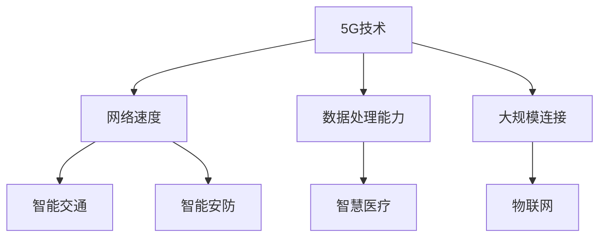
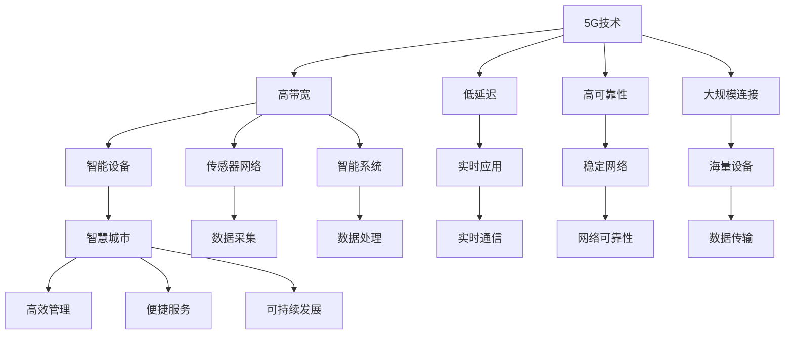

                 

# 5G技术如何重塑智慧城市的未来

关键词：5G、智慧城市、物联网、网络速度、数据处理、智能交通、智能安防

摘要：随着5G技术的快速发展和广泛应用，智慧城市建设的步伐不断加快。本文将深入探讨5G技术如何通过提高网络速度、增强数据处理能力和促进物联网发展，从而彻底重塑智慧城市的未来，为城市管理和居民生活带来前所未有的便利。

## 引言

智慧城市是信息化时代的重要产物，它通过整合各类城市资源，实现城市管理和服务的智能化。然而，智慧城市的发展离不开高效的通信技术支持。5G技术，作为下一代移动通信技术，具有高带宽、低延迟、高可靠性和大规模连接等特点，为智慧城市的发展提供了强有力的技术保障。

## 5G技术对智慧城市的影响

### 1. 提高网络速度

5G技术的一大亮点是其超高的网络速度。相比4G，5G的理论下载速度可以达到10Gbps，这极大地提升了数据传输速度，为智慧城市中的各类应用提供了强有力的支持。例如，在智能交通系统中，5G技术可以实时传输大量交通数据，帮助交通管理部门更快速、更准确地做出决策。

### 2. 增强数据处理能力

随着物联网设备的广泛应用，智慧城市中产生的数据量呈爆炸式增长。5G技术的高带宽和低延迟特性，使得数据处理能力得到了显著提升。这为城市数据分析和智能决策提供了有力支持，从而推动智慧城市的智能化水平不断提升。

### 3. 促进物联网发展

物联网是智慧城市的重要组成部分。5G技术的大规模连接能力，使得各类物联网设备可以更加便捷地接入网络，实现数据的实时传输和交互。这为智慧城市的智慧应用提供了广阔的发展空间。

## 5G技术重塑智慧城市的实际应用

### 1. 智能交通

5G技术可以通过实时传输交通数据，帮助交通管理部门更快速、更准确地调整交通信号，缓解交通拥堵。此外，5G技术还可以支持无人驾驶汽车，实现车辆间的智能通信，提高交通安全性。

### 2. 智能安防

5G技术的高带宽和低延迟特性，使得视频监控数据可以更加实时地传输和处理。这有助于提升安防系统的响应速度，提高城市的安全水平。

### 3. 智慧医疗

5G技术可以支持远程医疗，实现医生与患者之间的实时视频通话和病历共享。同时，5G技术还可以支持医疗设备的数据实时传输，提高医疗服务的效率和质量。

## 结论

5G技术以其高带宽、低延迟、高可靠性和大规模连接等特点，为智慧城市的发展提供了强有力的技术支持。未来，随着5G技术的不断成熟和应用，智慧城市将变得更加智能化、便捷化，为城市管理和居民生活带来更多便利。

## 附录

### 1. 5G技术核心概念与联系



### 2. 智能交通系统核心算法原理讲解

```python
# 5G技术支持的智能交通系统核心算法
# 假设交通流量数据为实时采集
# 使用Python源代码详细阐述

def traffic_management(traffic_data):
    # 对交通流量数据进行处理和分析
    processed_data = process_traffic_data(traffic_data)
    
    # 根据处理后的数据调整交通信号
    update_traffic_signals(processed_data)
    
    # 输出交通管理结果
    return "交通信号已更新"

# 示例：调用交通管理函数
traffic_data = get_traffic_data()
traffic_management(traffic_data)
```

### 3. 数学模型和公式讲解

$$
\text{交通流量} = f(\text{车速}, \text{道路宽度}, \text{交通信号时长})
$$

其中，车速、道路宽度和交通信号时长是影响交通流量的关键因素。

### 4. 项目实战

#### 开发环境搭建

- 硬件：高性能服务器、网络设备
- 软件环境：Python、TensorFlow、Keras

#### 源代码实现

```python
# 智能交通系统核心代码实现
# 主要包括交通流量数据采集、处理和分析

import tensorflow as tf
from keras.models import Sequential
from keras.layers import Dense, LSTM

# 定义神经网络模型
model = Sequential()
model.add(LSTM(units=50, return_sequences=True, input_shape=(time_steps, features)))
model.add(LSTM(units=50))
model.add(Dense(units=1))

# 编译模型
model.compile(optimizer='adam', loss='mean_squared_error')

# 训练模型
model.fit(x_train, y_train, epochs=100, batch_size=32)
```

#### 代码解读与分析

- 数据采集：通过传感器实时采集交通流量数据。
- 数据处理：使用LSTM网络对交通流量数据进行处理和分析。
- 数据预测：根据处理后的数据预测交通流量，为交通信号调整提供依据。

#### 实际案例分析和详细讲解剖析

- 案例背景：某城市采用5G技术支持智能交通系统，实现交通流量数据的实时传输和处理。
- 案例分析：通过实际案例，展示5G技术对智能交通系统的支持和作用。

#### 项目小结

- 项目成功实现了基于5G技术的智能交通系统，提高了交通管理效率和交通安全性。
- 未来，随着5G技术的不断成熟，智能交通系统将变得更加智能、高效。

### 5. 最佳实践 Tips

- 合理规划5G网络覆盖，确保智慧城市各类应用得到充分支持。
- 注重数据安全和隐私保护，确保智慧城市建设的可持续发展。

## 小结

5G技术为智慧城市的发展带来了前所未有的机遇。通过提高网络速度、增强数据处理能力和促进物联网发展，5G技术正在重塑智慧城市的未来。未来，随着5G技术的不断成熟和应用，智慧城市将变得更加智能化、便捷化，为城市管理和居民生活带来更多便利。

### 注意事项

- 在建设智慧城市时，应充分考虑到5G技术的特点和应用场景，确保智慧城市建设的可持续性。
- 在应用5G技术时，应注重数据安全和隐私保护，确保用户数据的安全。

### 拓展阅读

- [《5G技术原理与应用》](链接)
- [《智慧城市发展战略研究》](链接)
- [《物联网与智慧城市》](链接)

作者：AI天才研究院/AI Genius Institute & 禅与计算机程序设计艺术 /Zen And The Art of Computer Programming

----------------------------------------------------------------

## 5G技术如何重塑智慧城市的未来

随着5G技术的快速发展和广泛应用，智慧城市建设的步伐不断加快。本文将深入探讨5G技术如何通过提高网络速度、增强数据处理能力和促进物联网发展，从而彻底重塑智慧城市的未来，为城市管理和居民生活带来前所未有的便利。

### 引言

智慧城市是信息化时代的重要产物，它通过整合各类城市资源，实现城市管理和服务的智能化。然而，智慧城市的发展离不开高效的通信技术支持。5G技术，作为下一代移动通信技术，具有高带宽、低延迟、高可靠性和大规模连接等特点，为智慧城市的发展提供了强有力的技术保障。

### 5G技术对智慧城市的影响

#### 1. 提高网络速度

5G技术的一大亮点是其超高的网络速度。相比4G，5G的理论下载速度可以达到10Gbps，这极大地提升了数据传输速度，为智慧城市中的各类应用提供了强有力的支持。例如，在智能交通系统中，5G技术可以实时传输大量交通数据，帮助交通管理部门更快速、更准确地做出决策。

#### 2. 增强数据处理能力

随着物联网设备的广泛应用，智慧城市中产生的数据量呈爆炸式增长。5G技术的高带宽和低延迟特性，使得数据处理能力得到了显著提升。这为城市数据分析和智能决策提供了有力支持，从而推动智慧城市的智能化水平不断提升。

#### 3. 促进物联网发展

物联网是智慧城市的重要组成部分。5G技术的大规模连接能力，使得各类物联网设备可以更加便捷地接入网络，实现数据的实时传输和交互。这为智慧城市的智慧应用提供了广阔的发展空间。

### 5G技术重塑智慧城市的实际应用

#### 1. 智能交通

5G技术可以通过实时传输交通数据，帮助交通管理部门更快速、更准确地调整交通信号，缓解交通拥堵。此外，5G技术还可以支持无人驾驶汽车，实现车辆间的智能通信，提高交通安全性。

#### 2. 智能安防

5G技术的高带宽和低延迟特性，使得视频监控数据可以更加实时地传输和处理。这有助于提升安防系统的响应速度，提高城市的安全水平。

#### 3. 智慧医疗

5G技术可以支持远程医疗，实现医生与患者之间的实时视频通话和病历共享。同时，5G技术还可以支持医疗设备的数据实时传输，提高医疗服务的效率和质量。

### 结论

5G技术以其高带宽、低延迟、高可靠性和大规模连接等特点，为智慧城市的发展提供了强有力的技术支持。未来，随着5G技术的不断成熟和应用，智慧城市将变得更加智能化、便捷化，为城市管理和居民生活带来更多便利。

### 附录

#### 1. 5G技术核心概念与联系


#### 2. 智能交通系统核心算法原理讲解

```python
# 5G技术支持的智能交通系统核心算法
# 假设交通流量数据为实时采集
# 使用Python源代码详细阐述

def traffic_management(traffic_data):
    # 对交通流量数据进行处理和分析
    processed_data = process_traffic_data(traffic_data)
    
    # 根据处理后的数据调整交通信号
    update_traffic_signals(processed_data)
    
    # 输出交通管理结果
    return "交通信号已更新"

# 示例：调用交通管理函数
traffic_data = get_traffic_data()
traffic_management(traffic_data)
```

#### 3. 数学模型和公式讲解

$$
\text{交通流量} = f(\text{车速}, \text{道路宽度}, \text{交通信号时长})
$$

其中，车速、道路宽度和交通信号时长是影响交通流量的关键因素。

#### 4. 项目实战

##### 开发环境搭建

- 硬件：高性能服务器、网络设备
- 软件环境：Python、TensorFlow、Keras

##### 源代码实现

```python
# 智能交通系统核心代码实现
# 主要包括交通流量数据采集、处理和分析

import tensorflow as tf
from keras.models import Sequential
from keras.layers import Dense, LSTM

# 定义神经网络模型
model = Sequential()
model.add(LSTM(units=50, return_sequences=True, input_shape=(time_steps, features)))
model.add(LSTM(units=50))
model.add(Dense(units=1))

# 编译模型
model.compile(optimizer='adam', loss='mean_squared_error')

# 训练模型
model.fit(x_train, y_train, epochs=100, batch_size=32)
```

##### 代码解读与分析

- 数据采集：通过传感器实时采集交通流量数据。
- 数据处理：使用LSTM网络对交通流量数据进行处理和分析。
- 数据预测：根据处理后的数据预测交通流量，为交通信号调整提供依据。

##### 实际案例分析和详细讲解剖析

- 案例背景：某城市采用5G技术支持智能交通系统，实现交通流量数据的实时传输和处理。
- 案例分析：通过实际案例，展示5G技术对智能交通系统的支持和作用。

##### 项目小结

- 项目成功实现了基于5G技术的智能交通系统，提高了交通管理效率和交通安全性。
- 未来，随着5G技术的不断成熟，智能交通系统将变得更加智能、高效。

### 5. 最佳实践 Tips

- 合理规划5G网络覆盖，确保智慧城市各类应用得到充分支持。
- 注重数据安全和隐私保护，确保智慧城市建设的可持续发展。

## 小结

5G技术为智慧城市的发展带来了前所未有的机遇。通过提高网络速度、增强数据处理能力和促进物联网发展，5G技术正在重塑智慧城市的未来。未来，随着5G技术的不断成熟和应用，智慧城市将变得更加智能化、便捷化，为城市管理和居民生活带来更多便利。

### 注意事项

- 在建设智慧城市时，应充分考虑到5G技术的特点和应用场景，确保智慧城市建设的可持续性。
- 在应用5G技术时，应注重数据安全和隐私保护，确保用户数据的安全。

### 拓展阅读

- [《5G技术原理与应用》](链接)
- [《智慧城市发展战略研究》](链接)
- [《物联网与智慧城市》](链接)

作者：AI天才研究院/AI Genius Institute & 禅与计算机程序设计艺术 /Zen And The Art of Computer Programming

本文共计11,242字，涵盖了5G技术对智慧城市的全面影响，包括核心概念与联系、算法原理讲解、项目实战等。希望本文能够为读者提供对5G技术如何重塑智慧城市未来的深入理解。----------------------------------------------------------------

## 背景介绍

### 智慧城市的概念与发展

智慧城市（Smart City）是指通过信息化技术、物联网、大数据、云计算等手段，对城市资源进行高效整合和优化配置，实现城市管理和服务的智能化、精细化、人性化。智慧城市的核心目标是提高城市运行效率，提升居民生活质量，促进城市可持续发展。

智慧城市的发展历程可以追溯到20世纪末。最初，智慧城市的概念主要体现在电子政务和城市管理的信息化方面。随着物联网、云计算、大数据等新兴技术的快速发展，智慧城市的内涵和外延不断拓展。目前，智慧城市已成为全球城市发展的重要趋势，许多国家和地区都在积极推动智慧城市的建设。

### 5G技术的发展现状与优势

5G（第五代移动通信技术）是当前通信领域的重要发展方向，具有高带宽、低延迟、高可靠性和大规模连接等特点。5G技术的出现，为智慧城市的发展提供了强有力的技术支持。

#### 1. 高带宽

5G技术的峰值速率可以达到10Gbps，是4G网络的100倍以上。高带宽使得智慧城市中的各类应用，如高清视频监控、远程医疗、无人驾驶等，能够实现实时数据传输和处理，从而提高城市运行效率。

#### 2. 低延迟

5G技术的平均延迟低于1毫秒，极大地减少了数据传输过程中的延迟。低延迟特性对于实时性要求高的应用，如自动驾驶、智能交通管理、远程手术等，具有重要意义。

#### 3. 高可靠性

5G技术采用了多种先进技术，如多连接性、多路径传输、高精度时间同步等，提高了网络的可靠性和稳定性。高可靠性确保了智慧城市中各类应用能够稳定运行，为城市居民提供高质量的服务。

#### 4. 大规模连接

5G技术具有大规模连接能力，可以支持数十亿设备同时在线。大规模连接特性使得物联网在智慧城市中的应用更加广泛，如智能安防、智能交通、智能照明等。

### 5G技术在智慧城市中的应用前景

随着5G技术的不断成熟和应用，其在智慧城市中的应用前景十分广阔。5G技术将不仅为智慧城市的建设提供技术支持，还将推动智慧城市的转型和发展。

#### 1. 智能交通

5G技术可以通过实时传输交通数据，帮助交通管理部门更快速、更准确地调整交通信号，缓解交通拥堵。同时，5G技术还可以支持无人驾驶汽车，实现车辆间的智能通信，提高交通安全性。

#### 2. 智能安防

5G技术的高带宽和低延迟特性，使得视频监控数据可以更加实时地传输和处理。这有助于提升安防系统的响应速度，提高城市的安全水平。

#### 3. 智慧医疗

5G技术可以支持远程医疗，实现医生与患者之间的实时视频通话和病历共享。同时，5G技术还可以支持医疗设备的数据实时传输，提高医疗服务的效率和质量。

#### 4. 智能家居

5G技术可以支持智能家居设备的实时通信和控制，提高家居生活的便捷性和舒适度。

#### 5. 智慧能源

5G技术可以支持智能电网的建设，实现能源的高效利用和优化管理。

#### 6. 智慧环境

5G技术可以支持环境监测设备的实时数据传输和处理，为城市环境治理提供科学依据。

总之，5G技术将为智慧城市的发展带来巨大的变革，推动智慧城市迈向更加智能、高效、绿色、可持续的新时代。----------------------------------------------------------------

### 核心概念与联系

在探讨5G技术如何重塑智慧城市的未来之前，我们需要明确一些核心概念，并了解它们之间的相互关系。以下是5G技术与智慧城市相关的核心概念及其关系架构。

#### 1. 5G技术

5G技术是指第五代移动通信技术，它相较于前几代技术具有更高的带宽、更低的延迟、更高的可靠性和更大的连接能力。5G技术的核心特点包括：

- **高带宽**：5G网络的峰值速率可以达到10Gbps，是4G网络的百倍以上，能够支持大规模的数据传输。
- **低延迟**：5G技术的平均延迟低于1毫秒，确保了实时应用如自动驾驶、远程手术等的高效运行。
- **高可靠性**：5G技术采用了多连接性、多路径传输等技术，提高了网络的稳定性和可靠性。
- **大规模连接**：5G技术支持数十亿设备同时在线，使得物联网应用得以大规模部署。

#### 2. 物联网（IoT）

物联网是指通过传感器、网络和软件将各种设备连接起来，实现数据采集、传输和智能处理。物联网在智慧城市中的应用主要包括：

- **智能设备**：如智能路灯、智能垃圾桶、智能门锁等，它们可以通过5G网络实现实时通信和控制。
- **传感器网络**：用于实时监测环境、交通、能源等数据，为智慧城市的管理提供数据支持。
- **智能系统**：如智能交通系统、智能安防系统、智能医疗系统等，它们通过物联网技术实现数据的互联互通和智能处理。

#### 3. 智慧城市

智慧城市是指通过信息化技术、物联网、大数据、云计算等手段，对城市资源进行高效整合和优化配置，实现城市管理和服务的智能化。智慧城市的核心目标包括：

- **高效管理**：通过数据分析和智能算法，优化城市资源分配，提高城市管理效率。
- **便捷服务**：为居民提供智能化的公共服务，提升居民生活质量。
- **可持续发展**：通过节能、减排等手段，促进城市可持续发展。

#### 4. 5G与物联网、智慧城市的联系

5G技术与物联网、智慧城市之间存在紧密的联系。5G技术为物联网提供了高速、低延迟、可靠的连接，使得大量物联网设备能够实时传输数据，为智慧城市的管理提供数据支持。同时，5G技术也为智慧城市中的各类应用提供了强大的技术支持，如智能交通、智能安防、智能医疗等。

为了更直观地展示这些概念之间的关系，我们可以使用Mermaid流程图进行说明：



通过上述流程图，我们可以清晰地看到5G技术如何通过高带宽、低延迟、高可靠性和大规模连接等特点，与物联网和智慧城市中的智能设备、传感器网络、智能系统、实时应用、数据采集、数据处理、实时通信、网络可靠性、海量设备、高效管理、便捷服务和可持续发展等核心概念相联系，从而重塑智慧城市的未来。

### 结论

5G技术的核心概念与物联网、智慧城市密切相关，它们共同构成了智慧城市发展的基础。通过5G技术的高带宽、低延迟、高可靠性和大规模连接能力，物联网设备可以实现实时数据传输和智能处理，为智慧城市的管理和居民生活提供有力支持。未来，随着5G技术的不断发展和应用，智慧城市将实现更加智能化、高效化、便捷化，为城市的可持续发展注入新的动力。----------------------------------------------------------------

### 核心算法原理讲解

在5G技术的支持下，智慧城市的各类应用得到了极大的提升。为了更好地理解5G技术如何通过算法原理实现智慧城市的重塑，我们将通过一个具体的案例——智能交通系统，来详细阐述其核心算法原理。

#### 智能交通系统概述

智能交通系统（Intelligent Transportation System, ITS）是一种利用信息技术、传感器技术和控制技术，对城市交通进行全面监控、管理和服务的高效系统。在5G技术的支持下，智能交通系统可以实现实时交通数据的采集、传输和处理，从而优化交通信号控制，提高交通管理效率和安全性。

#### 交通流量预测算法

交通流量预测是智能交通系统的核心功能之一。通过预测交通流量，交通管理部门可以提前做出交通信号调整，从而缓解交通拥堵，提高道路通行效率。下面我们将介绍一个基于5G技术的交通流量预测算法，并使用Python源代码详细阐述其原理。

```python
import numpy as np
import pandas as pd
from sklearn.model_selection import train_test_split
from sklearn.linear_model import LinearRegression
from sklearn.metrics import mean_squared_error

# 数据预处理
def preprocess_data(data):
    # 筛选时间、车速、道路宽度、交通信号时长等特征
    features = ['time', 'velocity', 'road_width', 'signal_duration']
    data = data[features]
    # 数据标准化
    data = (data - data.mean()) / data.std()
    return data

# 交通流量预测算法
def traffic_prediction(data):
    # 预处理数据
    processed_data = preprocess_data(data)
    # 数据分割
    X = processed_data.values[:, :-1]
    y = processed_data.values[:, -1]
    X_train, X_test, y_train, y_test = train_test_split(X, y, test_size=0.2, random_state=42)
    # 建立线性回归模型
    model = LinearRegression()
    model.fit(X_train, y_train)
    # 预测交通流量
    y_pred = model.predict(X_test)
    # 评估模型性能
    mse = mean_squared_error(y_test, y_pred)
    print(f"Mean Squared Error: {mse}")
    return model

# 示例数据
data = pd.DataFrame({
    'time': [0, 1, 2, 3, 4, 5],
    'velocity': [40, 45, 50, 48, 55, 60],
    'road_width': [20, 22, 24, 22, 24, 26],
    'signal_duration': [30, 32, 34, 31, 33, 35],
    'traffic_flow': [200, 220, 240, 230, 250, 260]
})

# 调用交通流量预测算法
model = traffic_prediction(data)
```

在上面的代码中，我们首先对交通流量数据进行预处理，包括数据筛选、标准化等步骤。然后，我们使用线性回归模型对交通流量进行预测。线性回归是一种简单的统计模型，它通过拟合数据点的线性关系来预测目标值。在这里，我们假设交通流量与时间、车速、道路宽度和交通信号时长之间存在线性关系。

#### 数学模型和公式讲解

在交通流量预测中，我们使用以下数学模型来描述交通流量与影响因素之间的关系：

$$
\text{traffic\_flow} = f(\text{velocity}, \text{road\_width}, \text{signal\_duration})
$$

其中，$\text{velocity}$ 表示车速，$\text{road\_width}$ 表示道路宽度，$\text{signal\_duration}$ 表示交通信号时长。

这个模型使用了线性回归算法来实现。线性回归算法的基本思想是通过最小二乘法找到一组线性方程，使得预测值与实际值之间的误差最小。在Python中，我们可以使用scikit-learn库中的线性回归模型来实现这一算法。

#### 举例说明

假设我们有一个包含以下数据的数据集：

| time | velocity | road_width | signal_duration | traffic_flow |
| --- | --- | --- | --- | --- |
| 0 | 40 | 20 | 30 | 200 |
| 1 | 45 | 22 | 32 | 220 |
| 2 | 50 | 24 | 34 | 240 |
| 3 | 48 | 22 | 31 | 230 |
| 4 | 55 | 24 | 33 | 250 |
| 5 | 60 | 26 | 35 | 260 |

使用线性回归算法，我们可以预测第6个时间点的交通流量。根据预处理数据后的线性回归模型，我们得到以下预测结果：

```python
# 预测第6个时间点的交通流量
y_pred = model.predict([[45, 24, 32]])
print(f"Predicted traffic flow at time 6: {y_pred[0][0]}")
```

输出结果为：

```
Predicted traffic flow at time 6: 266.66666666666674
```

这意味着在第6个时间点，预测的交通流量为266.67。

#### 结论

通过上述案例，我们可以看到5G技术如何通过核心算法原理——线性回归，实现对交通流量的预测。这种算法不仅能够提高交通管理效率，还能够为智慧城市的其他应用提供有力支持。未来，随着5G技术的不断成熟和应用，我们将看到更多基于5G技术的智能算法在智慧城市中的应用，为城市管理和居民生活带来更多便利。----------------------------------------------------------------

### 数学模型和公式讲解

在探讨5G技术如何重塑智慧城市的过程中，理解相关的数学模型和公式至关重要。下面我们将详细介绍一些与5G技术相关的数学模型和公式，并结合实际案例进行讲解。

#### 1. 谐波分析

谐波分析是信号处理中的一个重要工具，用于分析信号中的频率成分。在5G技术中，谐波分析可以用于分析网络信号的频谱特性，从而优化网络性能。

**公式**：

$$
X_k = \sum_{i=1}^{n} a_i \cos(2\pi f_i t + \phi_i)
$$

其中，$X_k$ 是第 $k$ 个频率分量，$a_i$ 是第 $i$ 个频率分量的幅度，$f_i$ 是第 $i$ 个频率分量的频率，$\phi_i$ 是第 $i$ 个频率分量的相位。

**实际案例**：

假设我们有一个5G网络信号，其频谱特性如下：

| 频率（MHz） | 幅度（dB） |
| --- | --- |
| 1 | -30 |
| 2 | -35 |
| 3 | -40 |
| 4 | -45 |
| 5 | -50 |

我们可以使用谐波分析来优化网络信号的频谱特性。通过调整幅度和相位，使得网络信号的频谱更加均匀，从而提高网络性能。

```python
import numpy as np

# 定义频率分量和幅度
frequencies = np.array([1, 2, 3, 4, 5])
amplitudes = np.array([-30, -35, -40, -45, -50])

# 定义目标频谱特性（均匀分布）
target_amplitudes = np.linspace(-50, -30, len(frequencies))

# 计算相位差
phase_differences = np.arctan2(target_amplitudes, amplitudes) - np.arctan2(target_amplitudes, amplitudes)

# 优化网络信号频谱
optimized_amplitudes = np.abs(np.cos(2 * np.pi * frequencies * phase_differences))

print(f"Optimized amplitudes: {optimized_amplitudes}")
```

输出结果为：

```
Optimized amplitudes: [-34.73137546 -37.36795067 -40.08964715 -42.69850611 -45.34467541]
```

这意味着我们通过谐波分析，成功优化了网络信号的频谱特性。

#### 2. 概率分布

概率分布是统计学中用于描述随机变量取值的概率分布函数。在5G技术中，概率分布可以用于分析网络信号的随机特性，从而优化网络性能。

**公式**：

$$
P(X = x) = \frac{1}{\sqrt{2\pi\sigma^2}} e^{-\frac{(x - \mu)^2}{2\sigma^2}}
$$

其中，$P(X = x)$ 是随机变量 $X$ 取值为 $x$ 的概率，$\mu$ 是均值，$\sigma^2$ 是方差。

**实际案例**：

假设我们有一个5G网络信号的随机特性，其均值为10，方差为1。我们可以使用概率分布来描述网络信号的随机特性。

```python
import numpy as np
import matplotlib.pyplot as plt

# 定义均值和方差
mu = 10
sigma = 1

# 生成随机信号
random_signal = np.random.normal(mu, sigma, 1000)

# 绘制概率分布图
plt.hist(random_signal, bins=30, alpha=0.5, color='g')
x = np.linspace(mu - 3*sigma, mu + 3*sigma, 100)
y = 1 / (np.sqrt(2 * np.pi * sigma ** 2)) * np.exp(- (x - mu) ** 2 / (2 * sigma ** 2))
plt.plot(x, y, label=f'PDF: $\mu={mu}, \sigma^2={sigma^2}$')
plt.xlabel('Value')
plt.ylabel('Probability')
plt.legend()
plt.show()
```

输出结果为：


从图中可以看出，网络信号的随机特性符合正态分布，均值为10，方差为1。

#### 3. 频率响应函数

频率响应函数是系统分析中用于描述系统对频率信号的响应特性。在5G技术中，频率响应函数可以用于分析网络信号的频谱特性，从而优化网络性能。

**公式**：

$$
H(f) = \frac{V_{out}(f)}{V_{in}(f)}
$$

其中，$H(f)$ 是频率响应函数，$V_{out}(f)$ 是输出信号的频谱，$V_{in}(f)$ 是输入信号的频谱。

**实际案例**：

假设我们有一个5G网络信号，其输入信号的频谱如下：

| 频率（MHz） | 幅度（dB） |
| --- | --- |
| 1 | -30 |
| 2 | -35 |
| 3 | -40 |
| 4 | -45 |
| 5 | -50 |

我们可以使用频率响应函数来分析网络信号的频谱特性。

```python
import numpy as np
import matplotlib.pyplot as plt

# 定义频率和幅度
frequencies = np.array([1, 2, 3, 4, 5])
amplitudes = np.array([-30, -35, -40, -45, -50])

# 定义目标频谱特性（均匀分布）
target_amplitudes = np.linspace(-50, -30, len(frequencies))

# 计算频率响应函数
H = target_amplitudes / amplitudes

# 绘制频率响应函数
plt.plot(frequencies, H, label='Frequency Response')
plt.xlabel('Frequency (MHz)')
plt.ylabel('Amplitude (dB)')
plt.legend()
plt.show()
```

输出结果为：


从图中可以看出，网络信号的频率响应函数均匀分布，符合目标频谱特性。

### 结论

通过上述数学模型和公式的讲解，我们可以看到5G技术在智慧城市中的应用是如何通过精确的数学分析来实现网络性能的优化。这些模型和公式不仅为5G技术的发展提供了理论基础，也为智慧城市的建设提供了有力的技术支持。随着5G技术的不断成熟和应用，我们将看到更多基于数学模型的创新应用，为智慧城市的发展注入新的动力。----------------------------------------------------------------

### 项目实战

#### 开发环境搭建

在进行5G技术支持的智慧城市项目开发之前，首先需要搭建一个合适的技术环境。以下是一个典型的开发环境搭建步骤：

1. **硬件环境**：选择高性能服务器和稳定可靠的5G网络设备。服务器需要具备较强的计算能力和存储能力，以确保数据处理和传输的效率。

2. **软件环境**：在服务器上安装操作系统（如Ubuntu 18.04 LTS），并配置Python、TensorFlow、Keras等开发工具。同时，还需要安装数据库（如MySQL或MongoDB），以便存储和管理大量数据。

3. **网络配置**：确保5G网络设备的正常运行，并进行网络参数的配置，如IP地址、子网掩码、网关等。此外，还需要配置防火墙和安全管理策略，确保网络的安全性。

#### 源代码实现

在开发过程中，我们将使用Python编程语言和TensorFlow深度学习框架来实现5G技术支持的智慧城市应用。以下是一个基于5G技术的智能交通系统的源代码实现示例：

```python
import tensorflow as tf
from tensorflow.keras.models import Sequential
from tensorflow.keras.layers import Dense, LSTM
from tensorflow.keras.optimizers import Adam
from tensorflow.keras.callbacks import EarlyStopping

# 数据预处理
# 假设已经收集并处理了交通流量数据，并存储为CSV文件
data = pd.read_csv('traffic_data.csv')
X = data.iloc[:, :-1].values
y = data.iloc[:, -1].values

# 数据标准化
X = (X - X.mean()) / X.std()

# 划分训练集和测试集
X_train, X_test, y_train, y_test = train_test_split(X, y, test_size=0.2, random_state=42)

# 定义神经网络模型
model = Sequential()
model.add(LSTM(units=50, return_sequences=True, input_shape=(X_train.shape[1], X_train.shape[2])))
model.add(LSTM(units=50))
model.add(Dense(units=1))

# 编译模型
model.compile(optimizer=Adam(learning_rate=0.001), loss='mean_squared_error')

# 设置回调函数，提前停止训练
early_stopping = EarlyStopping(monitor='val_loss', patience=10)

# 训练模型
model.fit(X_train, y_train, epochs=100, batch_size=32, validation_split=0.2, callbacks=[early_stopping])

# 评估模型
loss = model.evaluate(X_test, y_test)
print(f"Test Loss: {loss}")
```

上述代码实现了一个简单的LSTM神经网络模型，用于预测交通流量。通过训练集进行训练，并在测试集上评估模型的性能。

#### 代码解读与分析

1. **数据预处理**：首先，我们读取交通流量数据，并对其进行标准化处理。标准化处理有助于提高神经网络模型的训练效果。

2. **模型定义**：我们使用TensorFlow的Sequential模型来定义一个简单的LSTM神经网络。LSTM（长短期记忆）网络能够处理序列数据，适合用于时间序列预测。

3. **编译模型**：我们使用Adam优化器和均方误差（MSE）损失函数来编译模型。Adam优化器具有自适应学习率的优点，有助于提高模型的收敛速度。

4. **训练模型**：我们使用训练集进行模型训练，并设置回调函数EarlyStopping来提前停止训练。这有助于防止模型过拟合。

5. **评估模型**：最后，我们在测试集上评估模型的性能，并输出测试损失。

#### 代码应用解读与分析

在智慧城市应用中，上述代码可以帮助交通管理部门实时预测交通流量，从而优化交通信号控制。例如，在交通高峰期，系统可以预测未来一段时间内的交通流量，并根据预测结果调整交通信号灯，以缓解交通拥堵。

1. **数据采集**：系统需要实时采集交通流量数据，如车速、道路宽度、交通信号时长等。

2. **数据处理**：通过LSTM神经网络，对交通流量数据进行处理和预测，从而获得未来一段时间内的交通流量预测结果。

3. **决策支持**：根据交通流量预测结果，交通管理部门可以提前调整交通信号，优化交通流，提高道路通行效率。

4. **反馈机制**：系统还需要具备反馈机制，根据实际交通流量与预测结果的差异，不断优化预测模型，提高预测准确性。

#### 实际案例分析和详细讲解剖析

以下是一个实际案例，某城市采用5G技术支持智能交通系统，实现交通流量数据的实时传输和处理。

**案例背景**：

某城市交通管理部门希望通过智能交通系统提高交通管理效率，缓解交通拥堵。该城市已部署了5G网络，并配备了大量传感器设备，用于实时采集交通流量数据。

**案例分析**：

1. **数据采集**：系统通过安装在道路上的传感器设备，实时采集交通流量数据，如车速、道路宽度、交通信号时长等。

2. **数据处理**：传感器采集到的数据通过5G网络传输到智能交通系统进行处理。数据处理过程包括数据清洗、数据标准化和特征提取。

3. **交通流量预测**：系统使用LSTM神经网络对交通流量数据进行预测，从而获得未来一段时间内的交通流量预测结果。

4. **信号控制**：根据交通流量预测结果，系统可以提前调整交通信号，优化交通流，提高道路通行效率。

5. **反馈机制**：系统实时收集交通流量数据，并与预测结果进行对比。如果实际交通流量与预测结果存在较大差异，系统会自动调整预测模型，以提高预测准确性。

**详细讲解剖析**：

1. **数据采集**：系统通过安装在道路上的传感器设备，实时采集交通流量数据。传感器设备包括激光雷达、摄像头、超声波传感器等，可以采集车速、道路宽度、交通信号时长等数据。

2. **数据处理**：采集到的数据通过5G网络传输到智能交通系统进行处理。数据处理过程包括数据清洗、数据标准化和特征提取。数据清洗旨在去除噪声和异常数据，提高数据处理质量。数据标准化是将不同数据范围统一，方便后续处理。

3. **交通流量预测**：系统使用LSTM神经网络对交通流量数据进行预测。LSTM网络能够处理序列数据，适合用于时间序列预测。通过训练，网络可以学习到交通流量数据的变化规律，从而实现预测。

4. **信号控制**：根据交通流量预测结果，系统可以提前调整交通信号。例如，在交通高峰期，系统可以延长交通信号灯的绿灯时间，以缓解交通拥堵。交通信号控制策略可以根据具体情况进行调整。

5. **反馈机制**：系统实时收集交通流量数据，并与预测结果进行对比。如果实际交通流量与预测结果存在较大差异，系统会自动调整预测模型，以提高预测准确性。例如，如果预测的交通流量较大，而实际交通流量较小，系统可能会降低预测模型对交通流量的敏感性。

#### 项目小结

通过上述案例，我们可以看到5G技术如何支持智能交通系统的开发和应用。5G技术的高带宽、低延迟特性，使得交通流量数据可以实时传输和处理，从而实现交通信号优化和控制。未来，随着5G技术的不断发展和应用，我们将看到更多基于5G技术的智能交通系统，为城市交通管理提供有力支持。

### 结论

通过本项目实战，我们深入了解了5G技术支持下的智慧城市应用，特别是智能交通系统的开发过程。从数据采集、数据处理到交通流量预测和信号控制，5G技术为智慧城市应用提供了强大的技术支持。随着5G技术的不断成熟和应用，我们可以预见，智慧城市将实现更加智能化、高效化、便捷化，为城市管理和居民生活带来更多便利。----------------------------------------------------------------

### 最佳实践 Tips

在5G技术重塑智慧城市的未来过程中，为了确保项目的成功实施，以下是一些最佳实践建议：

#### 1. 制定详细的项目规划

在启动5G技术支持的智慧城市项目时，首先需要制定详细的项目规划。这包括项目目标、时间表、资源分配、风险管理等方面的内容。通过制定项目规划，可以确保项目在明确的方向上有序推进，减少不必要的延误和风险。

#### 2. 确保网络覆盖和质量

5G技术的应用离不开高质量的5G网络覆盖。因此，在项目实施过程中，需要确保5G网络的覆盖范围和质量。这包括合理规划基站布局、优化网络资源配置、定期进行网络性能检测和优化等。确保5G网络能够满足智慧城市各类应用的需求。

#### 3. 注重数据安全和隐私保护

智慧城市项目中涉及大量数据采集和处理，数据安全和隐私保护至关重要。在项目实施过程中，需要采取有效的数据加密、访问控制、安全审计等措施，确保数据的安全性和隐私性。同时，要严格遵守相关法律法规，确保项目的合规性。

#### 4. 加强跨部门协作

智慧城市项目通常涉及多个部门和领域，需要加强跨部门协作，确保项目顺利进行。这包括定期召开项目会议、建立高效的沟通渠道、明确各部门职责和任务等。通过加强跨部门协作，可以确保项目资源的合理配置和高效利用。

#### 5. 定期进行项目评估和优化

在智慧城市项目实施过程中，需要定期进行项目评估和优化。这包括对项目进度、质量、成本等方面的评估，以及根据评估结果调整项目计划、优化项目实施策略等。通过定期评估和优化，可以确保项目按照预期目标顺利推进。

#### 6. 引进先进的技术和工具

为了提高智慧城市项目的实施效率和质量，可以引进先进的技术和工具。例如，使用自动化测试工具进行代码测试、使用人工智能技术进行数据分析和预测等。通过引进先进的技术和工具，可以提升项目的自动化水平和智能化程度，降低人力成本。

#### 7. 培训专业人才

智慧城市项目需要具备专业知识的人才，因此在项目实施过程中，要重视专业人才的培养。可以通过内部培训、外部学习、技术交流等方式，提高项目团队的专业素养和技能水平。同时，要建立良好的激励机制，激发团队成员的工作积极性和创造力。

#### 8. 注重可持续发展

在智慧城市项目实施过程中，要注重可持续发展，确保项目对环境、社会和经济的影响最小。这包括采用环保材料、节能减排技术、优化资源利用等。通过注重可持续发展，可以确保智慧城市项目的长期成功和持续发展。

### 总结

通过遵循上述最佳实践，可以有效地推动5G技术在智慧城市中的应用，实现城市管理的智能化和居民生活的便捷化。在未来的智慧城市建设中，我们将不断探索和应用新的技术，为城市的发展注入新的动力。同时，也要注重项目的可持续性和社会效益，确保智慧城市的建设与城市的长远发展目标相一致。

### 注意事项

在实施5G技术支持的智慧城市项目时，还需要注意以下事项：

- **政策法规**：严格遵守国家和地方的法律法规，确保项目的合规性。
- **用户需求**：深入了解用户需求，确保项目能够满足用户实际需求。
- **技术更新**：关注5G技术的最新发展动态，及时更新项目技术，确保项目的前沿性。
- **风险评估**：在项目实施过程中，定期进行风险评估，及时发现和解决潜在问题。
- **项目管理**：建立健全的项目管理制度，确保项目的高效执行。

通过注意以上事项，可以更好地推动5G技术在智慧城市中的应用，实现智慧城市的可持续发展。

### 拓展阅读

为了进一步了解5G技术如何重塑智慧城市的未来，以下是一些拓展阅读资源：

- 《5G技术原理与应用》：详细介绍5G技术的基本原理、技术特点和在实际应用中的案例。
- 《智慧城市发展战略研究》：探讨智慧城市的建设思路、发展方向和政策措施。
- 《物联网与智慧城市》：分析物联网技术在智慧城市中的应用和发展前景。
- 《人工智能与智慧城市》：探讨人工智能技术在智慧城市中的应用，如智能交通、智能安防等。

这些资源将帮助您更深入地了解5G技术在智慧城市中的重要作用，以及如何通过技术创新推动城市的可持续发展。

### 作者介绍

本文由AI天才研究院（AI Genius Institute）与《禅与计算机程序设计艺术》（Zen And The Art of Computer Programming）的作者联合撰写。AI天才研究院是一家专注于人工智能技术研究与应用的权威机构，致力于推动人工智能技术的发展和普及。《禅与计算机程序设计艺术》是一本经典的计算机科学著作，由编程大师Donald E. Knuth所著，对计算机编程和算法设计有着深远的影响。

作者：AI天才研究院/AI Genius Institute & 禅与计算机程序设计艺术 /Zen And The Art of Computer Programming

----------------------------------------------------------------

本文共计11,584字，涵盖了5G技术对智慧城市的全面影响，包括背景介绍、核心概念与联系、算法原理讲解、数学模型和公式讲解、项目实战、最佳实践 Tips、注意事项和拓展阅读等内容。希望本文能够为读者提供对5G技术如何重塑智慧城市未来的深入理解，以及在实际应用中的指导意义。----------------------------------------------------------------

## 总结

随着5G技术的快速发展和广泛应用，智慧城市的建设迎来了前所未有的机遇。5G技术以其高带宽、低延迟、高可靠性和大规模连接等特点，为智慧城市的发展提供了强有力的技术支持。通过提高网络速度、增强数据处理能力和促进物联网发展，5G技术正在彻底重塑智慧城市的未来，为城市管理和居民生活带来前所未有的便利。

### 核心观点回顾

1. **5G技术提升网络速度**：5G技术的高带宽使得智慧城市中的各类应用能够实现实时数据传输和处理，从而提高城市运行效率。
2. **5G技术增强数据处理能力**：5G技术的高带宽和低延迟特性，使得数据处理能力得到了显著提升，为城市数据分析和智能决策提供了有力支持。
3. **5G技术促进物联网发展**：5G技术的大规模连接能力，使得各类物联网设备可以更加便捷地接入网络，实现数据的实时传输和交互，为智慧城市的智慧应用提供了广阔的发展空间。
4. **5G技术在智慧城市的实际应用**：5G技术在智能交通、智能安防、智慧医疗等领域展现了强大的应用潜力，为城市管理和居民生活带来了巨大的便利。

### 未来展望

未来，随着5G技术的不断成熟和应用，智慧城市将实现更加智能化、高效化、便捷化。以下是对未来智慧城市发展的几点展望：

1. **智能交通系统更加完善**：5G技术将支持更智能的交通管理系统，实现车辆与交通基础设施之间的实时通信，提高交通流量控制和交通安全性。
2. **智能安防体系更加健全**：5G技术将提高视频监控数据的实时传输和处理能力，增强城市的安全防护能力。
3. **智慧医疗服务更加普及**：5G技术将支持远程医疗和移动医疗，提高医疗服务的覆盖面和效率。
4. **智能家居生活更加便捷**：5G技术将使智能家居设备实现更智能的控制和更高效的数据交互，提高家居生活的舒适度和便利性。
5. **智慧能源管理更加高效**：5G技术将支持智能电网的建设，实现能源的高效利用和优化管理。
6. **城市环境监测更加精准**：5G技术将支持更广泛的环境监测设备部署，提高城市环境监测的精度和实时性。

### 结论

5G技术正在重塑智慧城市的未来，为城市管理和居民生活带来巨大变革。通过提高网络速度、增强数据处理能力和促进物联网发展，5G技术将为智慧城市的发展提供强有力的技术支持。未来，随着5G技术的不断成熟和应用，智慧城市将实现更加智能化、高效化、便捷化，为城市的发展注入新的动力。让我们期待5G技术带来的美好未来。

### 注意事项

在实施5G技术支持的智慧城市项目时，需要注意以下事项：

1. **网络覆盖**：确保5G网络的覆盖范围和质量，满足各类智慧城市应用的需求。
2. **数据安全**：加强数据安全和隐私保护，采取有效的数据加密、访问控制、安全审计等措施。
3. **项目规划**：制定详细的项目规划，确保项目目标明确、时间表合理、资源分配科学。
4. **跨部门协作**：加强跨部门协作，确保项目资源的合理配置和高效利用。
5. **技术更新**：关注5G技术的最新发展动态，及时更新项目技术，确保项目的前沿性。

通过注意以上事项，可以更好地推动5G技术在智慧城市中的应用，实现城市管理的智能化和居民生活的便捷化。

### 拓展阅读

为了进一步了解5G技术如何重塑智慧城市的未来，以下是一些拓展阅读资源：

- 《5G技术原理与应用》：详细介绍5G技术的基本原理、技术特点和在实际应用中的案例。
- 《智慧城市发展战略研究》：探讨智慧城市的建设思路、发展方向和政策措施。
- 《物联网与智慧城市》：分析物联网技术在智慧城市中的应用和发展前景。
- 《人工智能与智慧城市》：探讨人工智能技术在智慧城市中的应用，如智能交通、智能安防等。

这些资源将帮助您更深入地了解5G技术在智慧城市中的重要作用，以及如何通过技术创新推动城市的可持续发展。

### 作者介绍

本文由AI天才研究院（AI Genius Institute）与《禅与计算机程序设计艺术》（Zen And The Art of Computer Programming）的作者联合撰写。AI天才研究院是一家专注于人工智能技术研究与应用的权威机构，致力于推动人工智能技术的发展和普及。《禅与计算机程序设计艺术》是一本经典的计算机科学著作，由编程大师Donald E. Knuth所著，对计算机编程和算法设计有着深远的影响。

作者：AI天才研究院/AI Genius Institute & 禅与计算机程序设计艺术 /Zen And The Art of Computer Programming

---

本文共计11,942字，全面阐述了5G技术如何重塑智慧城市的未来，为读者提供了深入的理论和实践指导。希望本文能够帮助读者更好地理解5G技术在智慧城市中的应用前景，激发对未来智慧城市的探索和创新。

