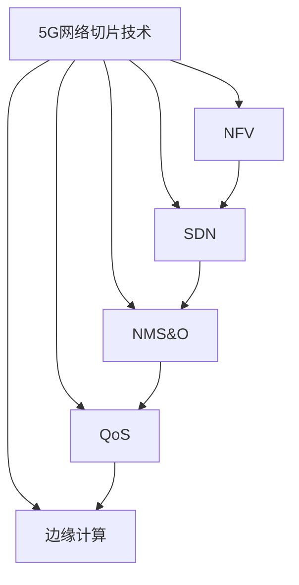
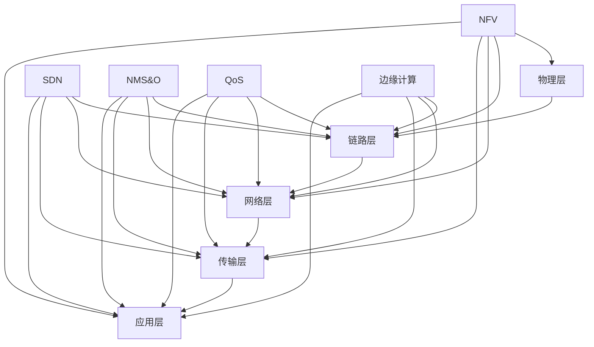
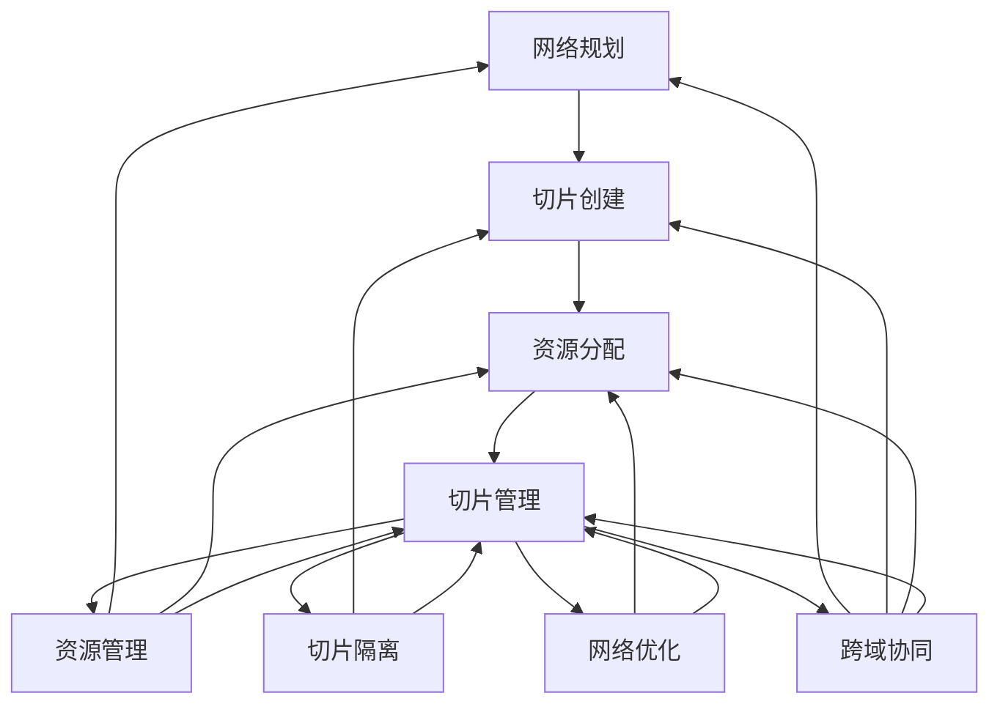
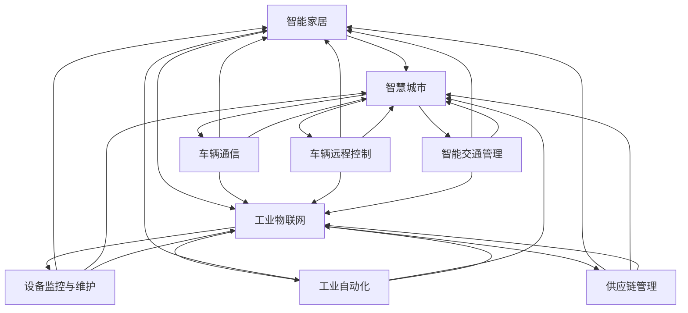
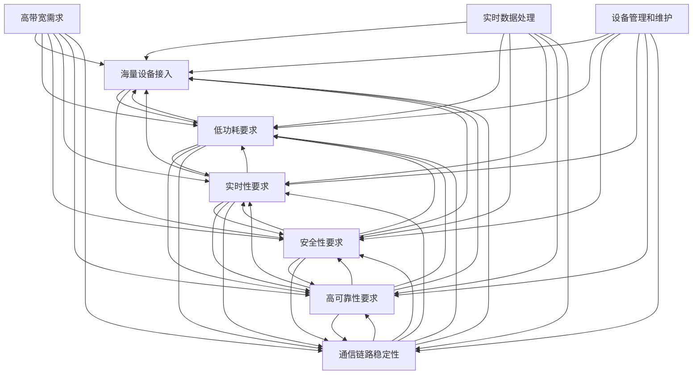
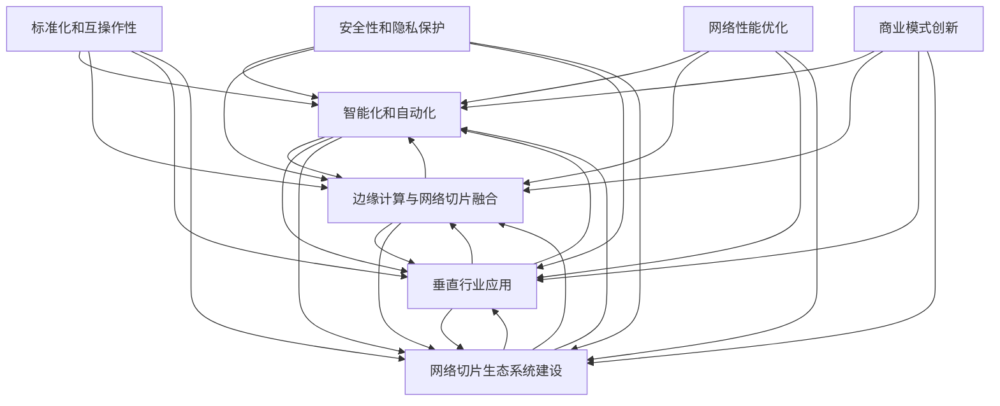
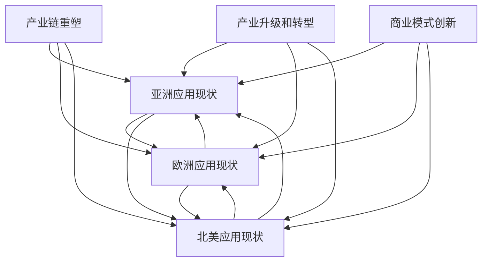
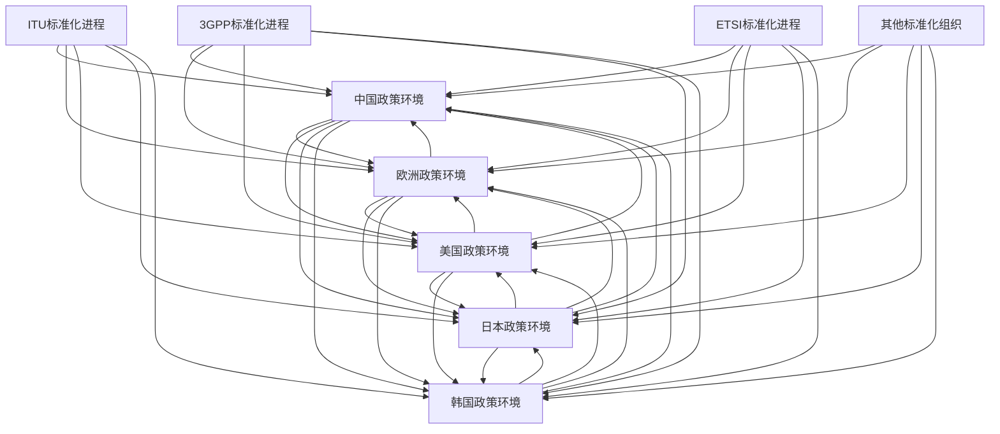

                 

### 5G网络切片技术及其商业应用

#### 关键词
- 5G网络切片
- 网络功能虚拟化
- 物联网
- 自动驾驶
- 工业互联网

#### 摘要
本文深入探讨了5G网络切片技术的核心概念、技术原理、实现方法及其商业应用。首先，我们回顾了5G网络切片技术的背景和定义，然后详细介绍了5G网络切片架构和关键技术。接下来，本文通过具体案例分析，探讨了5G网络切片技术在物联网、自动驾驶和工业互联网等领域的应用，并分析了面临的挑战和解决方案。最后，本文展望了5G网络切片技术的未来发展趋势，并给出了相关的政策与标准化建议。

---

#### 目录

1. **5G网络切片技术概述
2.   1.1 5G网络切片技术的定义与背景
3.   1.2 5G网络切片的核心概念
4.2 5G网络切片技术原理
5.   2.1 5G网络切片架构
6.   2.2 5G网络切片关键技术
7.   2.3 5G网络切片技术优势与挑战
8.3 5G网络切片技术实现
9.   3.1 5G网络切片技术实现流程
10.  3.2 5G网络切片技术难点与解决方案
11.4 5G网络切片技术应用
12.   4.1 5G网络切片技术在物联网中的应用
13.   4.2 5G网络切片技术在自动驾驶中的应用
14.   4.3 5G网络切片技术在工业互联网中的应用
15.5 5G网络切片技术挑战
16.   5.1 物联网场景中的挑战与解决方案
17.   5.2 自动驾驶场景中的挑战与解决方案
18.   5.3 工业互联网场景中的挑战与解决方案
19.6 5G网络切片技术展望
20.   6.1 5G网络切片技术的发展趋势
21.   6.2 5G网络切片技术的未来挑战与机遇
22.   6.3 5G网络切片技术在全球的应用与影响
23.   6.4 5G网络切片技术的政策与标准化
24. 附录
25.   7.1 5G网络切片技术相关工具与资源
26.   7.2 5G网络切片技术参考书目与文献

---

接下来，我们将按照上述目录逐步深入探讨5G网络切片技术的各个方面。首先，我们从5G网络切片技术的背景和定义开始。

### 1. 5G网络切片技术概述

#### 1.1 5G网络切片技术的定义与背景

5G网络切片（5G Network Slicing）是5G网络技术中的一项关键创新，旨在为不同应用场景提供定制化的网络服务。网络切片将传统的单一网络资源分割成多个虚拟网络，每个虚拟网络具有独特的网络属性，如带宽、时延、可靠性等。通过这种方式，5G网络能够同时服务于多种不同的业务需求，实现高效的资源利用和优化的服务质量。

5G网络切片技术的发展源于移动通信行业对更高网络性能和更广泛应用场景的需求。在4G时代，网络资源分配较为固定，难以满足日益多样化的业务需求。5G网络切片技术通过引入虚拟化、自动化和智能化技术，实现了网络资源的灵活分配和动态调整，从而为各类应用场景提供定制化的网络服务。

#### 1.2 5G网络切片的核心概念

1. **网络功能虚拟化（NFV）**：网络功能虚拟化是将传统的网络功能（如路由、防火墙、DNS等）从专用硬件设备中解放出来，通过软件方式在通用硬件上运行。NFV是实现网络切片的重要技术之一，它使得网络功能可以灵活地部署、管理和扩展。

2. **软件定义网络（SDN）**：软件定义网络是一种网络架构，通过将网络控制平面与数据平面分离，实现网络资源的集中控制和自动化管理。SDN与NFV相结合，可以进一步优化网络切片的部署和管理。

3. **网络切片管理及编排（NMS&O）**：网络切片管理及编排是5G网络切片技术的核心组件，负责网络切片的创建、配置、监控和优化。NMS&O通过自动化工具和算法，实现了网络切片的动态管理和高效运营。

4. **服务质量（QoS）**：服务质量是衡量网络切片性能的重要指标，包括带宽、时延、抖动、可靠性等。5G网络切片技术通过精确控制网络资源，确保不同切片提供的服务质量达到预期。

5. **边缘计算**：边缘计算是一种将计算、存储和网络功能下沉到网络边缘的技术。边缘计算与5G网络切片技术相结合，可以进一步提高网络切片的响应速度和服务质量。

#### Mermaid 流程图

通过以上概念和流程图，我们可以更好地理解5G网络切片技术的核心组成部分及其相互关系。在接下来的章节中，我们将进一步探讨5G网络切片技术的原理和实现方法。

---

在下一章节中，我们将详细探讨5G网络切片技术的原理和关键技术。

### 2. 5G网络切片技术原理

#### 2.1 5G网络切片架构

5G网络切片技术涉及到多个层面的架构，包括物理层、链路层、网络层、传输层和应用层。以下是5G网络切片技术的核心架构：

1. **物理层**：物理层负责无线信号的传输，包括频率、功率、调制和编码等。5G网络切片在物理层上通过正交频分多址（OFDM）和大规模MIMO（Massive MIMO）等先进技术，实现了高带宽和低时延的无线传输。

2. **链路层**：链路层负责无线链路的建立、维护和释放。5G网络切片在链路层上通过动态频谱管理和多连接技术，实现了网络资源的灵活分配和高效利用。

3. **网络层**：网络层负责IP地址的分配、路由和转发。5G网络切片在网络层上通过虚拟路由和分段技术，实现了不同网络切片之间的隔离和独立运行。

4. **传输层**：传输层负责数据包的传输和传输控制。5G网络切片在传输层上通过动态带宽管理和流量控制技术，实现了网络切片之间的公平性和高效性。

5. **应用层**：应用层负责具体应用的业务处理和用户体验。5G网络切片在应用层上通过业务感知和智能调度技术，实现了不同应用场景的定制化和个性化服务。

#### 2.2 5G网络切片关键技术

1. **网络功能虚拟化（NFV）**：网络功能虚拟化是将网络功能从专用硬件设备中解耦出来，通过虚拟化技术实现软件化部署和管理。NFV在5G网络切片中起到了关键作用，它使得网络功能可以灵活地部署、扩展和管理，从而实现不同网络切片之间的独立运行。

2. **软件定义网络（SDN）**：软件定义网络通过将网络控制平面与数据平面分离，实现了网络资源的集中控制和自动化管理。SDN在5G网络切片中与NFV相结合，可以进一步优化网络切片的部署和管理，提高网络资源的利用效率。

3. **网络切片管理及编排（NMS&O）**：网络切片管理及编排是5G网络切片技术的核心组件，负责网络切片的创建、配置、监控和优化。NMS&O通过自动化工具和算法，实现了网络切片的动态管理和高效运营。

4. **服务质量（QoS）**：服务质量是衡量网络切片性能的重要指标，包括带宽、时延、抖动、可靠性等。5G网络切片技术通过精确控制网络资源，确保不同切片提供的服务质量达到预期。QoS的实现需要依赖网络功能虚拟化、软件定义网络和网络切片管理及编排等技术。

5. **边缘计算**：边缘计算是将计算、存储和网络功能下沉到网络边缘的技术。边缘计算与5G网络切片技术相结合，可以进一步提高网络切片的响应速度和服务质量。边缘计算通过在网络边缘部署计算资源，实现了数据的本地处理和快速响应。

#### Mermaid 流�程图

通过以上架构和关键技术，我们可以更好地理解5G网络切片技术的实现原理。在下一章节中，我们将进一步探讨5G网络切片技术的实现方法和应用场景。

### 3. 5G网络切片技术实现

#### 3.1 5G网络切片技术实现流程

5G网络切片技术的实现涉及多个环节，包括网络规划、切片创建、资源分配和切片管理。以下是5G网络切片技术实现的详细流程：

1. **网络规划**：网络规划是5G网络切片技术实现的第一步，主要包括确定网络切片的需求、规划网络资源、设计网络架构等。网络规划需要根据不同应用场景的需求，制定相应的网络切片策略和资源分配方案。

2. **切片创建**：切片创建是网络规划完成后，通过网络切片管理及编排（NMS&O）组件实现的。切片创建包括配置切片参数、创建虚拟网络、分配网络资源等。切片参数包括切片类型、带宽、时延、可靠性等，这些参数根据不同应用场景进行定制。

3. **资源分配**：资源分配是5G网络切片技术实现的关键步骤，主要包括网络带宽、计算资源、存储资源的分配。资源分配需要根据切片的参数和当前网络负载情况，动态调整资源分配策略，确保每个切片得到合理的资源支持。

4. **切片管理**：切片管理包括切片的监控、优化和故障处理。切片管理需要实时收集网络切片的性能数据，分析网络切片的运行状态，根据实际情况进行调整和优化。此外，切片管理还需要具备故障处理能力，确保网络切片在发生故障时能够快速恢复。

#### 3.2 5G网络切片技术难点与解决方案

1. **资源管理**：资源管理是5G网络切片技术实现的一个难点，特别是在海量网络切片和动态资源需求的情况下。解决方案包括采用分布式资源管理架构，实现资源的高效利用和动态调整。此外，引入人工智能和机器学习技术，实现智能化的资源预测和分配。

2. **切片隔离**：切片隔离是保证不同切片之间网络性能和服务质量的重要手段。难点在于如何确保切片之间的隔离不会影响整体网络性能。解决方案包括采用虚拟化技术，实现切片之间的物理隔离，以及引入安全隔离机制，防止切片之间的恶意攻击和干扰。

3. **网络优化**：网络优化是5G网络切片技术实现中的另一个难点，特别是在网络负载波动较大的情况下。解决方案包括引入动态优化算法，根据网络负载和切片性能实时调整网络参数，实现网络资源的动态优化。此外，通过引入边缘计算和云计算技术，实现网络优化和服务的本地化。

4. **跨域协同**：5G网络切片技术涉及到多个运营商和多个网络域，跨域协同是实现5G网络切片技术的重要保障。难点在于如何实现不同网络域之间的资源共享和协同优化。解决方案包括引入统一的管理平台和接口，实现跨域资源调度和协同优化，以及制定统一的网络切片标准和协议。

#### Mermaid 流程图

通过以上实现流程和解决方案，我们可以更好地理解和实现5G网络切片技术。在下一章节中，我们将探讨5G网络切片技术在各个领域的具体应用。

### 4. 5G网络切片技术在各个领域的应用

#### 4.1 5G网络切片技术在物联网中的应用

物联网（IoT）是指通过传感器、设备和网络连接，实现物理世界与数字世界的深度融合。5G网络切片技术为物联网提供了定制化的网络服务，使得物联网应用能够更加高效、稳定和可靠地运行。以下是5G网络切片技术在物联网中的应用：

1. **智能家居**：在智能家居领域，5G网络切片技术可以为不同设备提供不同的网络服务。例如，高清视频监控需要高带宽和低时延的网络切片，而传感器数据采集则需要低带宽和低时延的网络切片。5G网络切片技术可以实现智能家居设备的实时监控和远程控制，提高用户的生活品质。

2. **智慧城市**：智慧城市是指通过物联网技术和大数据分析，实现城市管理的智能化。5G网络切片技术可以为智慧城市的各个应用场景提供定制化的网络服务，如智能交通、环境监测、公共安全等。通过5G网络切片技术，可以实现实时数据的收集、分析和处理，提高城市管理效率和居民生活质量。

3. **工业物联网**：在工业物联网领域，5G网络切片技术可以为不同生产线、设备和人员提供定制化的网络服务。例如，生产线上需要高带宽和低时延的网络切片，以支持实时数据传输和远程控制；而管理人员则需要低带宽和低时延的网络切片，以支持远程监控和管理。5G网络切片技术可以提高工业物联网的自动化水平，降低运营成本，提高生产效率。

#### 4.2 5G网络切片技术在自动驾驶中的应用

自动驾驶是人工智能和物联网技术的重要应用领域，它通过传感器、摄像头、雷达等设备，实现对车辆的自主控制和导航。5G网络切片技术为自动驾驶提供了高效、稳定和安全的网络服务，以下是5G网络切片技术在自动驾驶中的应用：

1. **车辆通信**：在自动驾驶中，车辆之间需要实时通信，以确保交通的安全和效率。5G网络切片技术可以为自动驾驶车辆提供低时延、高带宽的网络服务，实现车辆之间的V2V（Vehicle-to-Vehicle）通信。通过V2V通信，车辆可以实时共享道路信息、交通状况和障碍物信息，提高交通的安全性和效率。

2. **车辆远程控制**：在自动驾驶中，车辆需要通过远程通信与数据中心进行交互，以实现远程控制。5G网络切片技术可以为自动驾驶车辆提供高带宽、低时延的网络服务，实现车辆与数据中心之间的实时数据传输和远程控制。通过远程控制，驾驶员可以实时监控车辆状态，并根据情况进行干预。

3. **智能交通管理**：在自动驾驶时代，交通管理需要更加智能和高效。5G网络切片技术可以为智能交通管理系统提供定制化的网络服务，如实时交通监控、智能信号控制和交通流量预测等。通过5G网络切片技术，可以实现交通管理的智能化和精细化，提高交通效率和减少交通事故。

#### 4.3 5G网络切片技术在工业互联网中的应用

工业互联网是指通过物联网、大数据、人工智能等新技术，实现工业系统的数字化、网络化和智能化。5G网络切片技术为工业互联网提供了定制化的网络服务，以下是5G网络切片技术在工业互联网中的应用：

1. **设备监控与维护**：在工业互联网中，设备监控与维护是确保生产正常运行的关键。5G网络切片技术可以为设备监控提供低时延、高带宽的网络服务，实现实时数据采集、分析和监控。通过5G网络切片技术，可以实现设备的远程监控和智能诊断，提高设备的运行效率和降低维护成本。

2. **工业自动化**：在工业互联网中，工业自动化是提高生产效率和降低成本的重要手段。5G网络切片技术可以为工业自动化提供低时延、高带宽的网络服务，实现设备的自动化控制、协调和优化。通过5G网络切片技术，可以实现生产过程的实时监控和优化，提高生产效率和产品质量。

3. **供应链管理**：在工业互联网中，供应链管理是确保生产资源和产品流通的关键。5G网络切片技术可以为供应链管理提供定制化的网络服务，如实时数据传输、智能分析和决策支持等。通过5G网络切片技术，可以实现供应链的实时监控和优化，提高供应链的效率和可靠性。

#### Mermaid 流程图

通过以上具体应用，我们可以看到5G网络切片技术在不同领域的重要性和价值。在下一章节中，我们将探讨5G网络切片技术在发展过程中面临的挑战和解决方案。

### 5. 5G网络切片技术挑战及解决方案

#### 5.1 物联网场景中的挑战与解决方案

在物联网（IoT）场景中，5G网络切片技术面临以下主要挑战：

1. **海量设备接入**：物联网中存在大量设备，这些设备需要接入5G网络并使用网络切片服务。然而，传统的网络架构难以支持如此海量的设备接入，导致网络拥塞和性能下降。

   **解决方案**：采用边缘计算技术，将部分计算和存储能力下沉到网络边缘，减轻核心网络的负担。此外，引入分布式网络架构，实现设备的分布式接入和管理，提高网络容量和稳定性。

2. **低功耗要求**：许多物联网设备具有低功耗特点，需要长时间运行。然而，5G网络切片技术对设备性能要求较高，可能对设备的功耗产生负面影响。

   **解决方案**：优化网络切片技术，降低设备功耗。例如，采用节能协议和优化数据传输策略，减少设备能耗。此外，引入新型电池技术和无线充电技术，延长设备运行时间。

3. **安全性和隐私保护**：物联网设备可能涉及敏感数据，如用户隐私、企业商业机密等。5G网络切片技术在保障安全性和隐私保护方面面临挑战。

   **解决方案**：采用端到端加密技术，确保数据在传输过程中的安全性。此外，引入身份验证和访问控制机制，确保只有授权设备可以访问网络切片服务。同时，加强网络监控和威胁检测，及时发现和应对安全威胁。

#### 5.2 自动驾驶场景中的挑战与解决方案

在自动驾驶场景中，5G网络切片技术面临以下主要挑战：

1. **实时性要求**：自动驾驶需要实时处理大量传感器数据，并快速做出决策。然而，5G网络切片技术的实时性难以满足自动驾驶的高要求。

   **解决方案**：优化网络架构和协议，提高网络传输速度和可靠性。例如，采用边缘计算和分布式计算技术，将部分计算任务下沉到网络边缘，减少数据传输延迟。此外，引入实时操作系统和高效算法，提高自动驾驶系统的响应速度。

2. **高可靠性要求**：自动驾驶系统的安全性和可靠性至关重要。5G网络切片技术需要确保网络服务的稳定性和可靠性，以避免交通事故。

   **解决方案**：采用冗余设计和备份机制，确保网络服务的连续性和稳定性。例如，在关键节点部署备用设备和备用网络，实现故障自动切换。此外，加强网络监控和故障检测，及时发现和修复网络故障。

3. **通信链路稳定性**：自动驾驶场景中，车辆需要与其他车辆、基础设施和数据中心进行实时通信。然而，通信链路的稳定性难以保证，可能影响自动驾驶系统的正常运行。

   **解决方案**：采用多跳通信技术和网络冗余设计，提高通信链路的稳定性。例如，通过多个通信节点建立稳定的通信链路，确保数据传输的可靠性。此外，引入通信链路监测和故障修复机制，及时发现和修复通信故障。

#### 5.3 工业互联网场景中的挑战与解决方案

在工业互联网场景中，5G网络切片技术面临以下主要挑战：

1. **高带宽需求**：工业互联网应用通常需要传输大量数据，如传感器数据、图像数据等，对网络带宽有较高要求。

   **解决方案**：采用多连接技术和网络切片技术，提高网络带宽和传输效率。例如，通过多个网络切片同时传输数据，实现带宽的灵活调整和高效利用。

2. **实时数据处理**：工业互联网应用需要实时处理和分析海量数据，以满足生产控制和优化需求。

   **解决方案**：采用边缘计算和分布式计算技术，将数据处理任务下沉到网络边缘，降低数据传输延迟。例如，通过在网络边缘部署计算节点，实现数据的实时处理和分析。

3. **设备管理和维护**：工业互联网中的设备和系统繁多，设备管理和维护是一项挑战。

   **解决方案**：采用智能管理和监控技术，实现设备的自动化管理和维护。例如，通过物联网平台和大数据分析技术，实现对设备的实时监控、预测性维护和故障诊断。

#### Mermaid 流程图

通过以上挑战和解决方案，我们可以更好地应对5G网络切片技术在各个领域的发展和应用。在下一章节中，我们将探讨5G网络切片技术的未来发展趋势。

### 6. 5G网络切片技术展望

#### 6.1 5G网络切片技术的发展趋势

随着5G技术的不断演进，网络切片技术也在不断发展。以下是一些5G网络切片技术的发展趋势：

1. **更加智能化和自动化**：未来5G网络切片技术将更加智能化和自动化，通过网络切片管理及编排（NMS&O）组件，实现网络切片的自动创建、配置、优化和管理。这将提高网络切片的部署效率和管理水平，降低运营成本。

2. **边缘计算与网络切片的融合**：边缘计算与网络切片技术的融合将成为未来发展的重点。通过在网络边缘部署计算和存储资源，实现数据的本地处理和快速响应，提高网络切片的性能和用户体验。

3. **更多垂直行业的应用**：随着5G网络切片技术的成熟，其在垂直行业的应用将得到进一步拓展。如智慧医疗、智慧农业、智能制造等领域，5G网络切片技术将提供定制化的网络服务，满足行业特殊需求。

4. **网络切片的生态系统建设**：未来，5G网络切片技术将形成完善的生态系统，包括设备制造商、网络运营商、应用开发商等各方共同参与。这将推动5G网络切片技术的普及和应用，加速行业发展。

#### 6.2 5G网络切片技术的未来挑战与机遇

尽管5G网络切片技术发展迅速，但仍面临一些挑战和机遇：

1. **标准化和互操作性**：网络切片技术的标准化和互操作性是未来发展的关键。国际电信联盟（ITU）和3GPP等标准化组织正在积极推动网络切片技术的标准化进程，以实现不同厂商和网络之间的互操作性。

2. **安全性和隐私保护**：随着网络切片技术在各个领域的应用，安全性和隐私保护问题日益突出。未来，5G网络切片技术需要加强安全防护，确保数据的安全传输和存储。

3. **网络性能优化**：随着网络切片数量的增加，网络性能优化将成为一个重要挑战。通过引入智能算法和优化技术，提高网络切片的性能和效率，是未来发展的一个重要方向。

4. **商业模式创新**：网络切片技术的普及将带来新的商业模式。例如，基于网络切片的按需服务、定制化服务和混合云服务等，将为运营商、企业和用户带来更多价值。

#### Mermaid 流程图

通过以上趋势和挑战，我们可以看到5G网络切片技术在未来有着广阔的发展前景。在下一章节中，我们将探讨5G网络切片技术在全球的应用与影响。

### 7. 5G网络切片技术在全球的应用与影响

#### 7.1 5G网络切片技术在全球的应用现状

5G网络切片技术在全球范围内的应用逐渐扩展，多个国家和地区已经在不同领域实现了5G网络切片技术的试点和商用。以下是5G网络切片技术在全球的主要应用现状：

1. **亚洲**：中国、日本和韩国等亚洲国家在5G网络切片技术的研发和应用方面处于全球领先地位。中国已经在多个城市部署了5G网络切片技术，应用于智慧城市、智能制造和智慧医疗等领域。日本和韩国的运营商也在积极推进5G网络切片技术的商用，应用于自动驾驶、物联网和远程医疗等场景。

2. **欧洲**：欧洲国家在5G网络切片技术的应用方面也在积极推进。德国、英国和法国等国家的运营商已经开展了5G网络切片技术的试点项目，主要应用于工业物联网、智慧城市和智能交通等领域。此外，欧洲的标准化组织也在积极推动5G网络切片技术的标准化进程。

3. **北美**：美国和加拿大在5G网络切片技术的研发和应用方面也取得了显著进展。美国的主要运营商已经在部分城市部署了5G网络切片技术，应用于智慧城市、自动驾驶和远程医疗等领域。加拿大则在5G网络切片技术的研发和应用方面与国际接轨，积极推动5G网络切片技术的商业化。

#### 7.2 5G网络切片技术对全球产业的影响

5G网络切片技术对全球产业产生了深远的影响，主要体现在以下几个方面：

1. **产业链重塑**：5G网络切片技术的广泛应用将推动产业链的重塑。设备制造商、网络运营商和应用开发商等产业链各方需要紧密合作，共同推进5G网络切片技术的研发和应用。此外，新兴的边缘计算和云计算产业也将随着5G网络切片技术的发展而壮大。

2. **产业升级和转型**：5G网络切片技术为各个行业提供了定制化的网络服务，推动了产业的升级和转型。例如，在工业互联网领域，5G网络切片技术为智能制造、设备监控和供应链管理提供了强有力的支持，助力企业实现数字化转型。在智慧城市领域，5G网络切片技术为智能交通、智慧医疗和智慧能源等应用提供了高效、稳定的网络服务，推动城市智能化进程。

3. **商业模式的创新**：5G网络切片技术为商业模式创新提供了新的机遇。基于网络切片的按需服务、定制化服务和混合云服务等新型商业模式正在逐步兴起，为企业和用户带来了更多价值。此外，5G网络切片技术还促进了跨界合作，推动了不同行业之间的融合发展。

#### Mermaid 流程图

通过以上分析，我们可以看到5G网络切片技术在全球范围内的应用现状及其对全球产业的影响。在下一章节中，我们将探讨5G网络切片技术的政策与标准化进程。

### 8. 5G网络切片技术的政策与标准化

#### 8.1 5G网络切片技术的政策环境

5G网络切片技术的发展受到各国政府和监管机构的重视，多个国家和地区已经制定了相关政策，支持5G网络切片技术的研发和应用。以下是5G网络切片技术在全球主要国家和地区的政策环境：

1. **中国**：中国政府高度重视5G网络切片技术，将其列为国家战略性新兴产业。中国政府出台了一系列政策措施，支持5G网络切片技术的研发和试点，包括资金支持、税收优惠、人才引进等。

2. **欧洲**：欧盟委员会发布了《5G行动计划》，明确提出支持5G网络切片技术的研究和应用。欧盟成员国也纷纷制定了相关政策，鼓励运营商和企业在5G网络切片技术方面进行创新。

3. **美国**：美国政府将5G网络切片技术视为国家安全和经济发展的重要支柱。美国联邦通信委员会（FCC）出台了多项政策，支持5G网络切片技术的研发和商用，包括频谱分配、网络基础设施建设等。

4. **日本和韩国**：日本和韩国政府也在积极推动5G网络切片技术的发展。日本政府出台了《5G战略》，提出了一系列政策措施，支持5G网络切片技术的研发和应用。韩国政府则通过政策引导和资金支持，推动了5G网络切片技术在各个领域的应用。

#### 8.2 5G网络切片技术的标准化进程

5G网络切片技术的标准化进程是确保其在全球范围内广泛应用的重要保障。以下是一些主要标准化组织和相关标准化活动：

1. **国际电信联盟（ITU）**：ITU负责制定全球统一的5G网络切片标准。ITU的IMT-2020（5G）标准化项目涵盖了5G网络切片技术的各个方面，包括网络架构、关键技术、协议规范等。

2. **3GPP**：3GPP是全球领先的5G标准化组织，负责制定5G网络切片技术的详细标准。3GPP的R15和R16版本已经包含了5G网络切片技术的相关标准，包括网络功能虚拟化（NFV）、软件定义网络（SDN）、网络切片管理及编排（NMS&O）等。

3. **ETSI**：ETSI是欧洲电信标准化机构，负责制定5G网络切片技术的相关标准。ETSI的NFV和SDN标准为5G网络切片技术的实现提供了基础，与3GPP的标准相辅相成。

4. **其他标准化组织**：除ITU、3GPP和ETSI外，其他标准化组织如IEEE、IETF等也在5G网络切片技术的标准化方面开展了相关工作，涵盖了网络架构、协议、安全等方面。

#### Mermaid 流程图

通过以上政策和标准化进程，我们可以看到5G网络切片技术在全球范围内的政策支持和发展态势。在下一章节中，我们将提供5G网络切片技术相关的工具与资源。

### 附录

#### 附录A: 5G网络切片技术相关工具与资源

1. **开源平台和工具**：

   - **ONAP（Open Network Automation Platform）**：ONAP是一个开源网络自动化平台，支持网络功能虚拟化（NFV）和网络切片管理及编排（NMS&O）。网址：[https://www.onap.org/](https://www.onap.org/)

   - **OPNFV（Open Platform for NFV）**：OPNFV是一个开源项目，旨在构建、集成和测试NFV平台。网址：[https://www.opnfv.org/](https://www.opnfv.org/)

   - **OpenDaylight**：OpenDaylight是一个开源SDN控制平台，支持SDN和网络功能虚拟化。网址：[https://www.opendaylight.org/](https://www.opendaylight.org/)

2. **技术文档和教程**：

   - **3GPP标准文档**：3GPP官方网站提供了详细的5G网络切片技术标准文档，包括协议规范、架构设计等。网址：[https://www.3gpp.org/](https://www.3gpp.org/)

   - **ETSI NFV ISG**：ETSI的NFV产业特别组（ISG）发布了多个关于NFV和5G网络切片的技术文档和最佳实践。网址：[https://www.etsi.org/isg/nfv](https://www.etsi.org/isg/nfv)

   - **5G Network Slicing Blog**：一个关于5G网络切片技术的博客，提供了丰富的技术文章和案例分析。网址：[https://5gnetworkslicing.com/](https://5gnetworkslicing.com/)

3. **研究项目和报告**：

   - **5G-PPP**：5G公共私人合作伙伴关系（5G-PPP）是一个由欧盟资助的研究项目，致力于推动5G网络切片技术的研发和应用。网址：[https://5g-ppp.eu/](https://5g-ppp.eu/)

   - **5G NR Network Slicing**：3GPP组织发布的关于5G NR网络切片的研究报告，详细介绍了网络切片的架构、协议和实现方法。网址：[https://www.3gpp.org/ftp/Specs/5G/Rel-15/TSGR-15/Meetingelyn15/TSGR-15-14.pdf](https://www.3gpp.org/ftp/Specs/5G/Rel-15/TSGR-15/Meetingelyn15/TSGR-15-14.pdf)

#### 附录B: 5G网络切片技术参考书目与文献

1. **《5G Network Slicing: Architecture, Enabling Technologies, and Applications》**，作者：N. Murthy，G. F.au，A. Pennumalla。这本书详细介绍了5G网络切片的架构、关键技术和应用场景。

2. **《Network Slicing for 5G: Concepts, Architecture, and Implementation》**，作者：Alessio Zappulo，Matteo Vivoli，Giovanni Tundo。这本书探讨了5G网络切片的概念、架构和实现方法，以及在不同领域的应用。

3. **《5G NR Network Slicing: Design, Deployment, and Management》**，作者：Rajiv Laroia，Qing Yang，Weisi Xu。这本书详细介绍了5G NR网络切片的设计、部署和管理，包括网络架构、关键技术和管理策略。

4. **《Software-Defined Networking: A Comprehensive Guide to Programmatic Control of Networks》**，作者：Abhishek Gupta，Rajesh Gupta。这本书介绍了软件定义网络（SDN）的基本原理、架构和实现方法，以及SDN在网络切片中的应用。

5. **《Network Function Virtualization: A Comprehensive Approach》**，作者：Sergio Andujar，Lucia Morgera。这本书详细介绍了网络功能虚拟化（NFV）的基本原理、架构和实现方法，以及NFV在网络切片中的作用和优势。

通过以上工具、资源和参考书目，读者可以深入了解5G网络切片技术的相关知识，进一步探索和应用于实际项目中。

### 结论

5G网络切片技术作为5G网络的关键创新，为不同应用场景提供了定制化的网络服务。本文从5G网络切片技术的背景和定义、技术原理、实现方法、应用场景、挑战与解决方案、未来发展趋势、全球应用与影响以及政策与标准化等方面进行了详细探讨。通过这些分析，我们可以看到5G网络切片技术在推动网络技术进步、促进产业升级和创新发展方面具有重要意义。

未来，5G网络切片技术将在更多领域得到应用，如智慧医疗、智慧农业、智能制造等。同时，随着标准化和互操作性的不断完善，5G网络切片技术将加速在全球范围内的推广和应用。我们期待5G网络切片技术为各行各业带来更多创新和变革。

作者：AI天才研究院/AI Genius Institute & 禅与计算机程序设计艺术 /Zen And The Art of Computer Programming。本文旨在为广大读者提供关于5G网络切片技术的全面了解，助力网络技术研究和产业发展。

