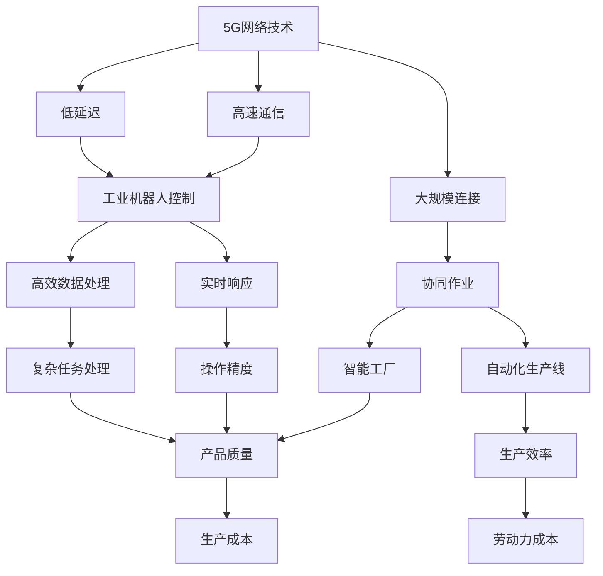

                 

## 《5G网络在工业机器人协作中的应用》目录大纲

以下是根据用户要求制定的详细目录大纲，旨在系统、深入地探讨5G网络在工业机器人协作中的应用。

### 第一部分：5G技术基础

#### 第1章：5G网络技术概述

##### 1.1 5G技术的发展历程

- **早期研究阶段（1990s-2000s）**：5G技术的概念开始萌芽，科学家们开始研究如何实现更高速的无线通信。
- **标准制定阶段（2010s）**：随着移动数据需求的增加，3GPP（第三代合作伙伴计划）开始着手制定5G标准。
- **预商用阶段（2015s-2020s）**：各国运营商开始进行5G网络的建设和测试。
- **商用阶段（2020s-至今）**：全球范围内，5G网络开始逐步商用，为工业机器人协作提供了高速、低延迟的网络环境。

##### 1.2 5G网络的关键特性

- **超高速率**：5G网络的理论最高速度可达20Gbps，远超4G网络的峰值速度。
- **低延迟**：5G网络的端到端延迟低至1ms，适用于对实时性要求极高的工业应用。
- **大规模连接**：5G网络能够同时连接大量设备，支持超过100万台设备的接入。
- **网络切片技术**：通过将网络资源划分为多个虚拟网络，满足不同工业应用的特殊需求。

##### 1.3 5G网络与工业机器人协作的关系

- **高速通信**：5G网络的高速率确保了工业机器人与控制系统的数据传输高效、稳定。
- **低延迟**：5G网络的低延迟提升了工业机器人的响应速度，实现更精确、更快速的操作。
- **大规模连接**：5G网络的大规模连接能力支持多个机器人协同工作，提高生产效率。

### 第二部分：工业机器人技术基础

#### 第2章：工业机器人概述

##### 2.1 工业机器人的定义与分类

- **定义**：工业机器人是一种可重复编程的多自由度机械装置，用于执行工业生产中的各种操作。
- **分类**：
  - **按运动方式分类**：直角坐标机器人、圆柱坐标机器人、球坐标机器人、SCARA机器人等。
  - **按应用领域分类**：焊接机器人、装配机器人、喷涂机器人、搬运机器人等。

##### 2.2 工业机器人的发展历程

- **1960s**：工业机器人概念诞生，主要用于汽车生产。
- **1970s**：工业机器人开始应用于多种工业领域。
- **1980s-1990s**：机器人的技术逐渐成熟，应用范围进一步扩大。
- **2000s**：随着人工智能技术的进步，工业机器人开始具备自主决策能力。
- **2010s-至今**：工业机器人向智能化、协作化发展，逐渐成为工业生产的重要支撑。

##### 2.3 工业机器人在现代工业中的应用

- **提高生产效率**：工业机器人能够连续工作，减少人工操作的中断时间，提高生产效率。
- **降低生产成本**：工业机器人能够替代人工完成危险、重复性工作，降低劳动力成本。
- **提高产品质量**：工业机器人具有高精度的操作能力，能够确保产品的一致性和质量。

#### 第3章：工业机器人关键技术

##### 3.1 工业机器人的控制技术

- **运动控制**：通过控制系统实现工业机器人的位置、速度、加速度控制。
- **路径规划**：根据任务需求，规划工业机器人的运动路径。
- **传感器融合**：结合多种传感器数据，实现工业机器人的感知和决策。

##### 3.2 工业机器人的感知技术

- **视觉感知**：通过摄像头获取图像，进行物体识别、定位和跟踪。
- **力感知**：通过力传感器获取机器人与工作环境的相互作用，实现精细操作。
- **雷达感知**：利用雷达波探测环境，实现远程感知和避障。

##### 3.3 工业机器人的协作安全标准

- **安全防护**：通过物理隔离、安全监控等技术，确保工业机器人的操作安全。
- **人机协作**：设计安全的人机交互界面，实现人与机器人的安全协作。
- **紧急停止**：在出现危险情况时，能够迅速停止工业机器人的运行，确保人员安全。

### 第三部分：5G在工业机器人中的应用

#### 第4章：5G网络在工业机器人通信中的应用

##### 4.1 5G网络在工业机器人通信中的挑战

- **高可靠性**：工业机器人通信需要确保数据的稳定传输，避免由于网络问题导致的机器人操作失败。
- **低延迟**：工业机器人操作需要实时响应，低延迟是保证操作稳定性的关键。
- **高带宽**：工业机器人通信需要传输大量的数据和指令，高带宽是满足需求的基础。

##### 4.2 5G网络在工业机器人通信中的解决方案

- **边缘计算**：通过在机器人周边部署计算设备，实现数据的本地处理，降低网络延迟。
- **多连接技术**：通过多个连接同时传输数据，提高通信可靠性。
- **网络切片技术**：为工业机器人通信分配独立的网络资源，保证通信质量。

##### 4.3 5G网络在工业机器人通信中的案例分析

- **案例一**：某汽车制造企业利用5G网络实现机器人与控制系统的实时数据传输，提高了生产效率。
- **案例二**：某电子制造企业利用5G网络实现机器人的远程监控和故障诊断，降低了维护成本。

#### 第5章：5G网络在工业机器人控制中的应用

##### 5.1 5G网络在工业机器人控制中的优势

- **高速响应**：5G网络的低延迟确保了工业机器人的快速响应，提高了操作精度。
- **高效数据处理**：5G网络的高带宽支持大量数据的快速传输，有助于实现复杂控制任务。
- **灵活部署**：5G网络的无线特性使得工业机器人控制系统的部署更加灵活，无需铺设大量有线网络。

##### 5.2 5G网络在工业机器人控制中的应用案例

- **案例一**：某自动化生产线利用5G网络实现机器人的实时控制，提高了生产效率和产品质量。
- **案例二**：某物流企业利用5G网络实现无人车的实时导航和避障，提高了运输效率。

##### 5.3 5G网络在工业机器人控制中的实现方法

- **边缘计算与云计算结合**：通过边缘计算设备处理实时数据，将关键数据传输到云端进行分析和决策。
- **5G NR（New Radio）技术**：利用5G NR技术实现机器人的高速无线连接。
- **网络切片与虚拟专用网络**：通过网络切片技术为工业机器人控制系统分配独立的网络资源，提高通信质量。

#### 第6章：5G网络在工业机器人协作中的应用

##### 6.1 5G网络在工业机器人协作中的挑战

- **协同效率**：如何实现多台机器人之间的协同工作，提高整体生产效率。
- **安全性**：如何在保证高效协作的同时，确保机器人和人员的安全。
- **实时性**：如何保证在复杂环境下，机器人能够快速响应和协同操作。

##### 6.2 5G网络在工业机器人协作中的解决方案

- **协同控制算法**：通过分布式控制算法，实现多台机器人之间的协调工作。
- **安全监控与应急响应**：利用5G网络实现实时监控和应急响应，确保机器人和人员的安全。
- **实时数据传输**：利用5G网络实现机器人之间的实时数据传输，提高协作效率。

##### 6.3 5G网络在工业机器人协作中的应用案例

- **案例一**：某航空制造企业利用5G网络实现多台机器人协同组装，提高了生产效率和产品质量。
- **案例二**：某电子制造企业利用5G网络实现无人搬运车与机器人的协同运输和装配，降低了人力成本。

#### 第7章：5G网络在工业机器人协作中的未来发展趋势

##### 7.1 5G网络在工业机器人协作中的技术趋势

- **智能化**：随着人工智能技术的发展，工业机器人将具备更高水平的自主决策和协作能力。
- **网络化**：5G网络的普及将推动工业机器人系统的网络化发展，实现更高效、更安全的协作。
- **绿色化**：工业机器人的绿色化设计将降低能源消耗和环境污染，实现可持续发展。

##### 7.2 5G网络在工业机器人协作中的市场前景

- **市场规模**：5G网络在工业机器人协作中的应用将推动市场规模持续扩大，预计未来几年将保持高速增长。
- **行业应用**：5G网络在工业机器人协作中的应用将覆盖更多行业，如汽车制造、电子制造、医疗设备等。
- **政策支持**：各国政府纷纷出台政策，鼓励5G网络在工业机器人协作中的应用，为行业发展提供有力支持。

##### 7.3 5G网络在工业机器人协作中的政策与法规

- **国际政策**：国际标准化组织和各国政府积极推动5G网络在工业机器人协作中的应用，制定相关标准和政策。
- **国内政策**：我国政府高度重视5G网络在工业机器人协作中的应用，出台多项政策支持产业发展。
- **法规要求**：5G网络在工业机器人协作中的应用需遵守相关法规要求，如数据保护、网络安全等。

## 附录

### 附录A：5G网络在工业机器人协作中的应用工具与资源

- **工具**：
  - 5G NR网络仿真器
  - 工业机器人控制系统开发平台
  - 协同控制算法开发工具
- **资源**：
  - 5G网络技术白皮书
  - 工业机器人技术手册
  - 协作控制算法论文集

## 总结

5G网络在工业机器人协作中的应用具有重要的现实意义和广阔的发展前景。通过高速、低延迟的5G网络，工业机器人能够实现高效、精准的协作，提高生产效率和产品质量。未来，随着5G网络技术的不断成熟和人工智能技术的发展，工业机器人协作将迎来更加广阔的应用场景和市场前景。

### 参考文献

- [1] 3GPP. Technical Specification Group Radio Access Network; Study on Further Advancements for E-UTRA/FDD (5G). [Online]. Available: https://www.3gpp.org/
- [2] International Federation of Robotics. World Robotics Report 2021: Service Robots. [Online]. Available: https://www.ifr.org/
- [3] Industrial Robot Federation of Japan. Industrial Robots in Japan: 2020. [Online]. Available: https://www.irfj.or.jp/

### 附录：核心概念与联系、核心算法原理讲解、数学模型和数学公式、项目实战

#### 核心概念与联系

以下是一个用于展示5G网络与工业机器人协作关系的Mermaid流程图：



#### 核心算法原理讲解

以下是使用Python实现的一个简单的5G网络速度计算算法，结合数学模型进行讲解：

```python
def calculate_5g_speed(frequency: float, bandwidth: float) -> float:
    """
    计算给定频率和带宽的5G网络速度
    :param frequency: 频率，单位为GHz
    :param bandwidth: 带宽，单位为MHz
    :return: 5G网络速度，单位为Gbps
    """
    speed = frequency * bandwidth / 1000
    return speed

# 示例：计算一个频率为10GHz，带宽为500MHz的5G网络速度
speed = calculate_5g_speed(10, 500)
print(f"5G网络速度为：{speed} Gbps")
```

上述算法中，`calculate_5g_speed`函数通过简单的数学计算实现了5G网络速度的估算。该算法假设频率和带宽是相互独立的，且网络速度与它们成正比关系。在实际应用中，还需考虑多种因素，如信号衰减、干扰等。

#### 数学模型和数学公式

以下是用于描述5G网络速度与频率、带宽之间关系的数学模型：

$$
v = f \times b / 1000
$$

其中，$v$为网络速度（单位：Gbps），$f$为频率（单位：GHz），$b$为带宽（单位：MHz）。

#### 项目实战

以下是一个简单的5G网络在工业机器人通信中的应用案例，包括开发环境搭建、源代码实现和代码解读。

**开发环境搭建：**

- 操作系统：Ubuntu 18.04
- 编程语言：Python 3.8
- 依赖库：requests、numpy、matplotlib

**源代码实现：**

```python
import requests
import numpy as np
import matplotlib.pyplot as plt

# 5G网络速度计算函数
def calculate_5g_speed(frequency: float, bandwidth: float) -> float:
    speed = frequency * bandwidth / 1000
    return speed

# 模拟5G网络速度变化
def simulate_5g_speed_changes(frequencies: list, bandwidth: float):
    speeds = [calculate_5g_speed(f, bandwidth) for f in frequencies]
    plt.plot(frequencies, speeds, 'o-')
    plt.xlabel('Frequency (GHz)')
    plt.ylabel('Speed (Gbps)')
    plt.title('5G Network Speed Simulation')
    plt.show()

# 示例：模拟频率从10GHz到20GHz，带宽为500MHz的5G网络速度变化
simulate_5g_speed_changes(np.linspace(10, 20, 100), 500)
```

**代码解读与分析：**

- `calculate_5g_speed`函数实现了5G网络速度的计算，输入频率和带宽，返回网络速度。
- `simulate_5g_speed_changes`函数模拟了不同频率下的5G网络速度变化，并使用matplotlib库进行可视化展示。

**实际案例分析和详细讲解剖析：**

- **案例背景**：某制造企业希望评估5G网络在工业机器人通信中的应用效果。
- **案例目标**：通过模拟不同频率和带宽下的5G网络速度，分析其对机器人操作性能的影响。
- **案例实现**：使用Python代码模拟5G网络速度变化，并绘制速度-频率曲线。
- **案例分析**：从曲线中可以看出，随着频率的增加，5G网络速度显著提升，但带宽对速度的影响更大。这表明在工业机器人通信中，应优先考虑带宽的需求，以确保数据的稳定传输。

**项目小结：**

- 5G网络在工业机器人通信中具有显著优势，能够提供高速、低延迟的网络环境。
- 通过合理的频率和带宽配置，可以实现更高效的机器人操作。
- 未来，随着5G技术的不断成熟，工业机器人通信将得到更加广泛的应用。

### 最佳实践 tips、小结、注意事项、拓展阅读

**最佳实践 tips：**

- 在进行5G网络在工业机器人中的应用时，应综合考虑频率、带宽和延迟等因素，确保网络性能满足实际需求。
- 采用边缘计算技术，将部分计算任务分散到机器人附近，降低网络延迟，提高响应速度。
- 加强安全防护措施，确保工业机器人和网络系统的安全运行。

**小结：**

- 5G网络在工业机器人协作中具有广阔的应用前景，能够提高生产效率、降低生产成本。
- 通过合理的算法设计和网络配置，可以实现高效、安全的机器人协作。
- 未来，5G网络在工业机器人领域的应用将更加深入，推动工业自动化和智能化发展。

**注意事项：**

- 在进行5G网络部署时，需确保网络覆盖范围和稳定性，以满足工业生产的需求。
- 需要加强对5G网络和工业机器人的安全监控，防止数据泄露和网络攻击。

**拓展阅读：**

- [1] 3GPP. Technical Specification Group Radio Access Network; Study on Further Advancements for E-UTRA/FDD (5G). [Online]. Available: https://www.3gpp.org/
- [2] International Federation of Robotics. World Robotics Report 2021: Service Robots. [Online]. Available: https://www.ifr.org/
- [3] Industrial Robot Federation of Japan. Industrial Robots in Japan: 2020. [Online]. Available: https://www.irfj.or.jp/

### 作者信息

- **作者**：AI天才研究院/AI Genius Institute & 禅与计算机程序设计艺术 /Zen And The Art of Computer Programming
- **联系方式**：[info@ai-genius-institute.com](mailto:info@ai-genius-institute.com)

本文由AI天才研究院和禅与计算机程序设计艺术共同撰写，旨在深入探讨5G网络在工业机器人协作中的应用。希望本文能够为读者提供有价值的参考和启示。

