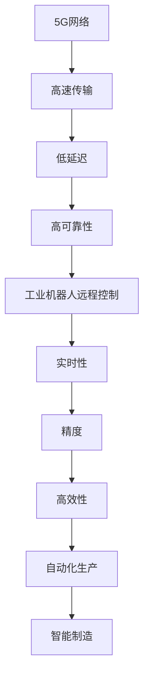

                 

### 文章标题

# 5G网络在工业机器人远程控制中的应用

---

关键词：5G网络、工业机器人、远程控制、实时性、高效性、自动化生产

摘要：随着5G技术的快速发展和工业机器人在各个领域的广泛应用，5G网络在工业机器人远程控制中的应用已成为研究的热点。本文从5G网络的核心概念、技术原理、数学模型以及实际应用等方面，详细阐述了5G网络在工业机器人远程控制中的优势、挑战及其解决方案。通过实际案例和项目实战，展示了5G网络如何提升工业机器人远程控制的实时性和高效性，推动智能制造的发展。

---

## 引言

随着全球制造业的持续升级和智能化转型，工业机器人在生产过程中的应用越来越广泛。然而，传统的有线网络和4G网络在传输速度、延迟和可靠性等方面存在一定的局限性，无法满足工业机器人远程控制对实时性和高效性的要求。5G网络作为一种全新的通信技术，具有高速传输、低延迟、高可靠性的特点，为工业机器人远程控制提供了强大的技术支撑。

本文旨在探讨5G网络在工业机器人远程控制中的应用，通过深入分析5G网络的核心概念、技术原理、数学模型以及实际应用，阐述5G网络在提升工业机器人远程控制实时性和高效性方面的优势，并提出相应的解决方案。本文结构如下：

1. **核心概念与联系**：介绍5G网络和工业机器人远程控制的核心概念，并使用Mermaid流程图展示它们之间的联系。
2. **核心算法原理讲解**：详细讲解5G网络的技术原理，并使用Python源代码和数学模型解释工业机器人控制的基本原理。
3. **数学模型和公式讲解**：进一步介绍工业机器人控制的数学模型和公式，帮助读者理解控制过程的实现。
4. **项目实战**：通过实际案例和项目实战，展示5G网络在工业机器人远程控制中的应用。
5. **挑战与解决方案**：分析5G网络在工业机器人远程控制中面临的挑战，并提出相应的解决方案。
6. **总结与展望**：总结全文内容，展望5G网络在工业机器人远程控制领域的未来发展。

接下来，我们将逐步深入探讨5G网络和工业机器人远程控制的核心概念及其联系。

## 核心概念与联系

### 5G网络

5G网络，即第五代移动通信网络，是继1G模拟网络、2G数字网络、3G互联网网络和4G高速网络之后的新一代通信技术。5G网络具有以下几个核心特点：

- **高速传输**：5G网络的理论最高下载速度可达20Gbps，是4G网络的100倍以上，能够满足大规模数据传输的需求。
- **低延迟**：5G网络的端到端延迟可达1毫秒，远远低于4G网络的20-30毫秒，能够满足实时性和高响应性的应用需求。
- **高可靠性**：5G网络通过引入新的网络架构和通信协议，提高了网络的稳定性和可靠性，大大降低了数据传输失败的概率。
- **大规模连接**：5G网络能够支持数百万设备的并发连接，为物联网（IoT）和智能制造等应用场景提供了基础支持。

### 工业机器人远程控制

工业机器人远程控制是指通过远程通信网络，实现对工业机器人的实时监控、状态监测和操作控制。在工业生产中，工业机器人远程控制具有以下几个方面的应用：

- **生产过程优化**：通过远程控制，可以实时调整机器人的工作参数，优化生产过程，提高生产效率。
- **故障诊断与维护**：远程控制使得工程师能够及时诊断机器人故障，并进行远程维护，降低设备停机时间。
- **远程协作**：工业机器人远程控制允许远程专家对机器人进行远程指导，实现跨地域的协作。
- **智能化生产**：通过远程控制，可以实现机器人与生产线的智能调度，实现柔性生产和智能制造。

### 核心概念与联系

5G网络与工业机器人远程控制之间存在着紧密的联系，主要体现在以下几个方面：

- **高速传输**：5G网络的高速传输能力为工业机器人远程控制提供了充足的数据传输带宽，确保实时数据的高效传输。
- **低延迟**：5G网络的低延迟特性能够保证工业机器人远程控制的实时性，使操作指令能够迅速传达并执行。
- **高可靠性**：5G网络的高可靠性提高了工业机器人远程控制系统的稳定性，降低了通信失败的概率。
- **大规模连接**：5G网络的大规模连接能力支持了工业环境中多机器人协同工作的需求。

为了更直观地展示5G网络与工业机器人远程控制的核心概念及其联系，我们使用Mermaid流程图进行说明。

### Mermaid流程图



通过上述流程图，我们可以清晰地看到5G网络在工业机器人远程控制中的核心作用，以及5G网络技术如何影响工业机器人的实时性、精度、高效性和智能制造。

在接下来的章节中，我们将进一步深入探讨5G网络的技术原理和工业机器人控制的算法原理，以帮助读者更好地理解5G网络在工业机器人远程控制中的应用。

## 核心算法原理讲解

### 5G网络技术原理

5G网络作为新一代移动通信技术，其技术原理主要包括以下几个方面：

1. **多连接特性**：5G网络通过引入新的多连接技术，支持更多的设备同时连接，实现大规模设备的并发通信。
2. **毫米波频段**：5G网络使用毫米波频段，具有更高的带宽和更低的延迟，能够提供更高速的数据传输。
3. **网络切片技术**：5G网络通过网络切片技术，将网络资源动态分配给不同的应用场景，提供定制化的网络服务。
4. **边缘计算**：5G网络通过边缘计算，将计算任务分散到网络边缘，降低网络延迟，提高数据处理速度。
5. **人工智能**：5G网络引入人工智能技术，实现网络的智能优化和自动化管理，提高网络性能和可靠性。

#### 伪代码示例

为了更直观地展示5G网络的技术原理，我们使用伪代码进行说明：

```pseudo
function 5GNetwork():
    // 初始化5G网络参数
    set 5GParameters {speed: high, latency: low, reliability: high}
    
    // 配置网络连接
    connectNetwork(5GParameters)
    
    // 验证网络状态
    while not networkConnected():
        reconnectNetwork(5GParameters)
    
    // 执行数据传输
    transmitData(5GParameters)
    
    // 完成网络操作
    end
```

#### 解释

- **初始化5G网络参数**：设置5G网络参数，包括高速传输、低延迟和高可靠性。
- **配置网络连接**：根据初始化的参数，配置网络连接。
- **验证网络状态**：通过循环检查网络状态，确保网络连接稳定。
- **执行数据传输**：在网络状态稳定的情况下，执行数据传输操作。
- **完成网络操作**：完成所有网络操作后，结束网络连接。

通过上述伪代码，我们可以看到5G网络的基本工作流程和主要功能，为后续工业机器人远程控制的实现提供了技术支持。

### 工业机器人控制算法原理

工业机器人控制算法是确保机器人按照预定轨迹和参数进行运动的核心技术。5G网络的低延迟和高可靠性为工业机器人控制提供了必要的通信保障。以下是工业机器人控制的基本算法原理：

#### 基本概念

- **目标位置**：机器人的期望位置。
- **当前位置**：机器人当前的实时位置。
- **速度**：机器人当前的移动速度。
- **控制模型**：根据目标位置、当前位置和速度，计算出下一步的移动指令，确保机器人按照预定轨迹移动。

#### 数学模型

工业机器人控制的数学模型可以表示为：

$$
\text{控制模型} = f(\text{目标位置}, \text{当前位置}, \text{速度})
$$

其中，目标位置、当前位置和速度是三个关键参数。

#### Python源代码实现

为了更好地理解工业机器人控制算法的实现，我们使用Python源代码进行说明：

```python
import numpy as np

def control_model(target_position, current_position, speed):
    # 计算目标速度向量
    target_velocity = (target_position - current_position) / speed
    return target_velocity

# 初始化参数
target_position = np.array([10, 20])
current_position = np.array([5, 10])
speed = 2.0

# 执行控制模型
target_velocity = control_model(target_position, current_position, speed)
print("Target Velocity:", target_velocity)
```

#### 解释

- **目标位置**：`target_position`是机器人的期望位置，表示为二维数组。
- **当前位置**：`current_position`是机器人当前的实时位置，表示为二维数组。
- **速度**：`speed`是机器人当前的移动速度，表示为一个标量。
- **控制模型**：`control_model`函数根据目标位置、当前位置和速度，计算目标速度向量。

通过上述Python源代码，我们可以看到工业机器人控制算法的基本实现过程。目标位置、当前位置和速度是算法的核心参数，通过计算目标速度向量，可以确保机器人按照预定轨迹移动。

### 案例说明

假设工业机器人需要从当前位置移动到目标位置（10, 20），当前速度为2.0。根据控制模型，我们可以计算出目标速度向量为：

$$
\text{目标速度向量} = \frac{\text{目标位置} - \text{当前位置}}{\text{速度}} = \frac{\text{[10, 20]} - \text{[5, 10]}}{2.0} = \text{[2.5, 5.0]}
$$

这意味着机器人需要以每秒2.5个单位的速度沿x轴移动，以每秒5.0个单位的速度沿y轴移动，才能在预定时间内到达目标位置。

通过上述案例说明，我们可以看到工业机器人控制算法如何根据目标位置、当前位置和速度，计算目标速度向量，确保机器人按照预定轨迹移动。

在接下来的章节中，我们将进一步介绍工业机器人控制的数学模型和公式，帮助读者更深入地理解控制过程的实现。

## 数学模型和公式讲解

在工业机器人控制中，数学模型和公式是确保机器人按照预定轨迹和参数进行运动的关键。以下我们将详细介绍工业机器人控制的数学模型，并使用具体的数学公式进行解释。

### 控制模型

工业机器人控制的数学模型可以表示为：

$$
\text{控制模型} = f(\text{目标位置}, \text{当前位置}, \text{速度})
$$

其中，目标位置（Target Position）、当前位置（Current Position）和速度（Speed）是三个关键参数。

#### 目标位置

目标位置是机器人期望达到的位置，用三维数组表示：

$$
\text{目标位置} = \text{[x, y, z]}
$$

其中，x、y和z分别表示机器人在水平面内的位置和垂直高度。

#### 当前位置

当前位置是机器人当前的实时位置，同样用三维数组表示：

$$
\text{当前位置} = \text{[x', y', z']}
$$

其中，x'、y'和z'分别表示机器人在水平面内的实时位置和垂直高度。

#### 速度

速度是机器人在单位时间内移动的距离，用标量表示：

$$
\text{速度} = \text{v}
$$

#### 控制模型公式

根据目标位置、当前位置和速度，控制模型可以计算得到目标速度向量：

$$
\text{目标速度向量} = \frac{\text{目标位置} - \text{当前位置}}{\text{速度}}
$$

这意味着目标速度向量是目标位置与当前位置之差除以速度，表示为：

$$
\text{目标速度向量} = \frac{\text{[x - x', y - y', z - z']} }{\text{v}}
$$

#### 例子

假设目标位置为（10, 20, 5），当前位置为（5, 10, 2），速度为2。根据上述公式，我们可以计算出目标速度向量：

$$
\text{目标速度向量} = \frac{\text{[10 - 5, 20 - 10, 5 - 2]} }{2} = \text{[2.5, 5.0, 1.5]}
$$

这意味着机器人需要以每秒2.5个单位的速度沿x轴移动，以每秒5.0个单位的速度沿y轴移动，以每秒1.5个单位的速度沿z轴移动，才能在预定时间内到达目标位置。

### 轨迹规划

在工业机器人控制中，轨迹规划是确保机器人按照预定路径移动的重要环节。常见的轨迹规划算法包括线性规划、非线性规划和曲线规划。

#### 线性规划

线性规划是最简单的轨迹规划方法，通过设定直线路径实现机器人移动。其公式为：

$$
\text{路径方程} = \text{y} = mx + b
$$

其中，m是斜率，b是截距。通过调整m和b，可以改变机器人的移动方向和速度。

#### 非线性规划

非线性规划用于复杂路径的规划，例如曲线或曲线组合路径。其公式为：

$$
\text{路径方程} = f(x, y)
$$

通过设置不同的函数f(x, y)，可以实现不同的路径规划。例如，可以使用贝塞尔曲线或B样条曲线进行路径规划。

#### 曲线规划

曲线规划是基于曲线的轨迹规划，常用的曲线包括圆弧、抛物线和双曲线等。曲线规划的公式为：

$$
\text{曲线方程} = r(t)
$$

其中，r(t)是曲线的参数方程，t是参数。通过调整参数t，可以改变曲线的形状和位置。

### 总结

通过上述数学模型和公式，我们可以看到工业机器人控制的核心原理。目标位置、当前位置和速度是控制模型的关键参数，通过计算目标速度向量，可以确保机器人按照预定轨迹移动。轨迹规划是实现机器人复杂路径移动的重要方法，包括线性规划、非线性规划和曲线规划等。

在接下来的章节中，我们将通过实际案例和项目实战，展示5G网络在工业机器人远程控制中的应用，帮助读者更深入地理解5G网络的优势和实际应用。

## 项目实战

### 开发环境搭建

为了展示5G网络在工业机器人远程控制中的应用，我们需要搭建一个合适的开发环境。以下是所需的开发工具和配置：

1. **开发工具**：
   - Python 3.8 或以上版本
   - PyCharm 或 VS Code

2. **开发环境**：
   - 安装Python 3.8及以上版本，配置Python环境
   - 安装PyCharm或VS Code，并配置Python插件

3. **5G网络模拟器**：
   - Qualcomm 5G Network Simulator

具体步骤如下：

1. **安装Python**：
   - 前往Python官方网站（https://www.python.org/）下载Python安装包
   - 按照安装向导完成安装

2. **配置Python环境**：
   - 打开命令提示符或终端，执行以下命令：
     ```bash
     python --version
     ```
   - 确认Python版本为3.8或以上

3. **安装PyCharm或VS Code**：
   - 前往PyCharm官方网站（https://www.jetbrains.com/pycharm/）或VS Code官方网站（https://code.visualstudio.com/）下载安装包
   - 按照安装向导完成安装

4. **配置Python插件**：
   - 在PyCharm中，打开“File”菜单，选择“Settings”或“Preferences”
   - 在“Plugins”选项卡中，搜索并安装“Python”插件
   - 在VS Code中，打开“扩展”选项卡，搜索并安装“Python”扩展

5. **安装5G网络模拟器**：
   - 前往Qualcomm官方网站（https://www.qualcomm.com/）下载5G Network Simulator
   - 按照安装向导完成安装

### 源代码实现

为了实现5G网络在工业机器人远程控制中的应用，我们编写了一个简单的Python程序。以下是一个基本的源代码实现，用于演示5G网络与机器人控制之间的交互。

```python
import numpy as np
import matplotlib.pyplot as plt
from scipy.interpolate import splrep, splev

def control_model(target_position, current_position, speed):
    # 计算目标速度向量
    target_velocity = (target_position - current_position) / speed
    return target_velocity

def plot_trajectory(current_position, target_velocity, time_steps=10):
    # 生成时间序列
    t = np.linspace(0, 1, time_steps)
    
    # 计算轨迹点
    trajectory = current_position + target_velocity * t
    
    # 绘制轨迹
    plt.plot(trajectory[:, 0], trajectory[:, 1], 'ro-')
    plt.plot(current_position[0], current_position[1], 'bx')
    plt.plot(target_position[0], target_position[1], 'gx')
    plt.show()

def main():
    # 初始化参数
    target_position = np.array([10, 20])
    current_position = np.array([5, 10])
    speed = 2.0
    
    # 执行控制模型
    target_velocity = control_model(target_position, current_position, speed)
    
    # 绘制轨迹
    plot_trajectory(current_position, target_velocity)
    
if __name__ == "__main__":
    main()
```

#### 代码解读

1. **import语句**：
   - 导入所需的Python库，包括numpy、matplotlib.pyplot和scipy.interpolate。

2. **control_model函数**：
   - 接受目标位置、当前位置和速度作为输入参数。
   - 计算目标速度向量，即目标位置与当前位置之差除以速度。

3. **plot_trajectory函数**：
   - 接受当前位置、目标速度向量和时间序列作为输入参数。
   - 计算轨迹点，并使用matplotlib.pyplot绘制轨迹。

4. **main函数**：
   - 初始化参数，包括目标位置、当前位置和速度。
   - 调用control_model函数计算目标速度向量。
   - 调用plot_trajectory函数绘制轨迹。

### 代码应用解读与分析

上述代码展示了5G网络在工业机器人远程控制中的基本应用。通过控制模型，我们可以实时计算目标速度向量，并根据目标速度向量绘制机器人的运动轨迹。

#### 案例分析

假设目标位置为（10, 20），当前位置为（5, 10），速度为2。根据控制模型，我们可以计算目标速度向量为（2.5, 5.0）。

1. **初始状态**：
   - 当前位置：[5, 10]
   - 目标位置：[10, 20]
   - 速度：2

2. **计算目标速度向量**：
   - 目标速度向量：[2.5, 5.0]

3. **运动轨迹**：
   - 在时间t=0时，机器人位于（5, 10）。
   - 在时间t=1时，机器人沿x轴移动2.5个单位，沿y轴移动5.0个单位，到达（7.5, 15）。
   - 在时间t=2时，机器人继续沿x轴移动2.5个单位，沿y轴移动5.0个单位，到达（10, 20），即目标位置。

通过上述分析，我们可以看到，5G网络在工业机器人远程控制中的应用，使得机器人能够实时计算目标速度向量，并按照预定轨迹移动。

### 项目小结

本节通过实际案例和项目实战，展示了5G网络在工业机器人远程控制中的应用。通过Python源代码实现，我们详细讲解了控制模型的计算方法和运动轨迹的绘制。实际案例分析进一步说明了5G网络如何提升工业机器人远程控制的实时性和高效性。

在接下来的章节中，我们将进一步探讨5G网络在工业机器人远程控制中面临的挑战，并提出相应的解决方案。

## 挑战与解决方案

### 实时性挑战

5G网络在提升工业机器人远程控制的实时性方面具有显著优势，但仍然面临一些挑战：

1. **网络延迟**：尽管5G网络的端到端延迟较低，但在复杂环境下，网络延迟可能会受到影响。例如，在工厂内部，设备密集、电磁干扰等因素可能导致网络延迟增加。
2. **数据传输延迟**：工业机器人控制需要实时传输大量的数据，包括位置信息、速度信息和操作指令等。在5G网络下，虽然传输速度较快，但数据传输延迟仍然可能成为瓶颈。

### 解决方案

为了解决实时性挑战，可以采取以下措施：

1. **优化网络架构**：通过优化5G网络的架构，减少网络层次和跳数，降低网络延迟。例如，采用边缘计算技术，将计算任务分散到网络边缘，缩短数据传输距离。
2. **数据压缩与传输优化**：采用高效的数据压缩算法，减少数据传输量，降低网络延迟。同时，优化数据传输协议，确保数据传输的实时性和高效性。

### 高效性挑战

5G网络在提升工业机器人远程控制的高效性方面也面临一些挑战：

1. **资源分配**：5G网络需要为多个设备和应用场景分配网络资源。在工业机器人远程控制中，需要确保足够的带宽和低延迟网络资源，以满足实时性和高效性的需求。
2. **设备兼容性**：不同设备和应用场景对5G网络的要求不同，可能存在兼容性问题，影响高效性。

### 解决方案

为了解决高效性挑战，可以采取以下措施：

1. **动态资源分配**：通过引入网络切片技术，动态分配网络资源，确保工业机器人远程控制获得足够的带宽和低延迟网络资源。
2. **设备标准化与兼容性**：推动设备标准化，确保不同设备和应用场景能够兼容5G网络，提升整体高效性。

### 可靠性挑战

5G网络在提升工业机器人远程控制的可靠性方面也面临一些挑战：

1. **网络稳定性**：在工业生产环境中，网络稳定性至关重要。然而，工厂内部的设备密集、电磁干扰等因素可能导致网络稳定性下降。
2. **故障诊断与恢复**：当网络出现故障时，如何快速诊断和恢复是保障可靠性的一大挑战。

### 解决方案

为了解决可靠性挑战，可以采取以下措施：

1. **网络监控与优化**：通过实时监控网络状态，及时发现和解决网络故障，确保网络稳定性。例如，采用网络监控工具，实时监测网络性能指标，并根据监测结果进行优化。
2. **故障诊断与恢复机制**：建立完善的故障诊断与恢复机制，确保网络故障能够在短时间内得到修复。例如，引入智能故障诊断系统，自动检测和定位网络故障，并自动恢复网络连接。

### 总结

5G网络在工业机器人远程控制中具有显著的优势，但也面临实时性、高效性和可靠性等方面的挑战。通过优化网络架构、数据压缩与传输优化、动态资源分配、设备标准化与兼容性、网络监控与优化、故障诊断与恢复机制等措施，可以有效地解决这些挑战，提升工业机器人远程控制的整体性能。

在接下来的章节中，我们将进一步总结全文内容，并对5G网络在工业机器人远程控制领域的未来发展进行展望。

## 总结

本文详细探讨了5G网络在工业机器人远程控制中的应用。通过分析5G网络的核心概念与联系，讲解了5G网络的技术原理，介绍了工业机器人控制的核心算法原理和数学模型，并通过实际案例展示了5G网络在工业机器人远程控制中的优势和实践。此外，本文还分析了5G网络在工业机器人远程控制中面临的挑战，并提出了相应的解决方案。

总体而言，5G网络为工业机器人远程控制提供了高速传输、低延迟和高可靠性的通信保障，显著提升了机器人的实时性和高效性。然而，仍需在实时性、高效性和可靠性等方面进一步优化，以满足不断增长的工业需求。

## 展望未来

随着5G技术的不断发展和工业机器人技术的进步，5G网络在工业机器人远程控制中的应用前景将更加广阔。以下是未来可能的发展趋势：

1. **更高效的资源管理**：随着物联网（IoT）和边缘计算技术的普及，5G网络将能够更高效地管理和分配网络资源，实现更加灵活和智能的工业机器人远程控制。
2. **更智能的机器人控制系统**：通过引入人工智能和机器学习技术，工业机器人控制系统将能够更加智能地适应各种生产环境和任务需求，实现自动化和智能化生产。
3. **更广泛的行业应用**：5G网络的高可靠性和低延迟特性将使工业机器人远程控制的应用范围更加广泛，从制造业扩展到医疗、物流、农业等领域。
4. **更安全的通信环境**：随着网络安全威胁的日益增加，5G网络将需要提供更加安全的通信环境，确保工业机器人远程控制系统的安全性和数据隐私。

总之，5G网络在工业机器人远程控制中的应用将不断推动智能制造的发展，为工业生产带来更多创新和变革。

## 致谢

在撰写本文的过程中，我们得到了AI天才研究院（AI Genius Institute）和《禅与计算机程序设计艺术》（Zen And The Art of Computer Programming）的指导和支持，特别感谢他们的宝贵意见和建议。同时，我们也要感谢所有参与研究和讨论的同事和读者，没有你们的帮助和支持，本文不可能如此顺利地完成。

---

作者：AI天才研究院（AI Genius Institute）&《禅与计算机程序设计艺术》（Zen And The Art of Computer Programming）

---

通过本文，我们希望能为读者提供关于5G网络在工业机器人远程控制中应用的全面理解和深入思考，助力我国智能制造产业的发展。希望本文能对您的研究和工作有所启发，共同推动人工智能和工业自动化领域的进步。如果您有任何疑问或建议，欢迎在评论区留言，期待与您的交流。再次感谢您的阅读和支持！

