                 

### 引言

随着信息技术的迅猛发展，5G网络和工业物联网（IIoT）逐渐成为国内外研究与应用的热点。5G网络作为下一代移动通信技术，凭借其高带宽、低延迟、大连接的特性，为工业物联网的发展提供了强大的技术支撑。工业物联网则通过将各类传感器、设备和平台连接起来，实现智能化、自动化的工业生产和管理。两者的融合不仅推动了智能制造、智能物流、智能能源管理等行业的变革，也为工业转型升级提供了新的机遇。

然而，5G网络在工业物联网中的实践并非一帆风顺。尽管5G技术具有众多优势，但在实际应用中仍面临诸多挑战，如网络覆盖不足、安全与隐私问题、系统集成与互操作性等。这些问题不仅限制了5G网络在工业物联网中的普及，也对工业生产的连续性和稳定性带来了潜在威胁。

本文旨在深入探讨5G网络在工业物联网中的实践与挑战，通过以下几个方面展开讨论：

1. **背景介绍**：介绍5G网络和工业物联网的基本概念，阐述两者之间的关系及其发展现状。
2. **核心概念与联系**：通过Mermaid流程图展示5G网络和工业物联网的关键概念及其相互关系。
3. **核心算法原理讲解**：详细讲解5G网络和工业物联网中的核心算法原理，并使用Python源代码进行说明。
4. **数学模型与公式**：介绍与5G网络和工业物联网相关的数学模型和公式，结合具体例子进行解释。
5. **项目实战**：介绍5G网络在工业物联网中的实际应用案例，包括开发环境搭建、源代码实现与解读。
6. **最佳实践**：总结5G网络在工业物联网中的最佳实践，提供注意事项和拓展阅读建议。

通过以上几个方面的探讨，本文希望为5G网络在工业物联网中的实践提供有益的参考，为相关领域的研究和应用提供思路。

### 关键词

- 5G网络
- 工业物联网
- 智能制造
- 智能物流
- 智能能源管理
- 网络覆盖
- 安全与隐私
- 系统集成与互操作性

### 摘要

本文探讨了5G网络在工业物联网中的实践与挑战。首先，介绍了5G网络和工业物联网的基本概念及其发展现状，并通过Mermaid流程图展示了两者之间的核心概念关系。接着，详细讲解了5G网络和工业物联网中的核心算法原理，包括网络架构、通信协议、数据处理与分析技术等。通过Python源代码示例，阐述了这些算法的原理和应用。然后，介绍了5G网络在工业物联网中的实际应用案例，包括智能制造、智能物流、智能能源管理等，并分析了项目中的开发环境搭建、源代码实现与解读。最后，总结了5G网络在工业物联网中的最佳实践，提出了注意事项和拓展阅读建议。

### 1. 背景介绍

#### 5G网络概述

5G网络，即第五代移动通信技术（5th Generation Mobile Network），是继1G模拟通信、2G数字通信、3G多媒体通信、4G高速数据通信之后的新一代移动通信技术。5G网络的目标是提供更高的数据传输速率、更低的延迟、更大的连接数量以及更广泛的应用场景。其主要特点包括：

1. **高带宽**：5G网络的峰值速率可达到数十Gbps，是4G网络的100倍以上，能够满足高分辨率视频流、虚拟现实（VR）和增强现实（AR）等高带宽需求的应用。
2. **低延迟**：5G网络的端到端延迟可低至1毫秒，是4G网络的10分之一，极大地提升了实时通信和控制的效率，适合应用于自动驾驶、工业自动化等对实时性要求极高的场景。
3. **大连接**：5G网络支持每平方米数十万个设备的连接，能够满足大规模物联网设备的接入需求，为智慧城市、智能工厂等提供了可能。
4. **网络切片**：5G网络引入了网络切片技术，可以根据不同应用的需求，为用户分配专用的网络资源，从而实现灵活、高效的网络服务。

#### 工业物联网概述

工业物联网（Industrial Internet of Things，IIoT）是一种将传感器、机器、设备、系统等通过互联网进行互联互通的技术，旨在实现工业生产过程的智能化和自动化。工业物联网的基本概念包括以下几个方面：

1. **传感器**：通过各类传感器实时采集工业设备的状态数据，如温度、湿度、压力、位置等。
2. **设备**：包括工业机器、机器设备、控制系统等，这些设备通过传感器采集的数据进行控制和优化。
3. **网络**：工业物联网需要通过各种通信技术实现设备之间的互联互通，包括有线和无线通信技术。
4. **平台**：工业物联网需要一个数据处理和分析的平台，对采集到的数据进行存储、处理和分析，为工业生产提供决策支持。
5. **应用**：工业物联网的应用涵盖了智能制造、智能物流、智能能源管理、智能安全监控等多个方面。

#### 5G与工业物联网的关系

5G网络和工业物联网之间存在密切的联系和互补性。5G网络为工业物联网提供了高效、可靠的通信基础设施，使得工业物联网能够在更广泛的应用场景中得到实现。具体来说，5G网络在工业物联网中的作用主要体现在以下几个方面：

1. **提升通信能力**：5G网络的高带宽和低延迟特性，使得工业物联网中的大规模设备连接和实时数据处理成为可能，从而提高了工业生产的效率和质量。
2. **拓展应用场景**：5G网络的支持，使得工业物联网能够应用于更多对通信质量要求较高的场景，如智能制造中的远程监控与维护、智能物流中的车辆调度与路径优化、智能能源管理中的实时监测与智能调控等。
3. **增强安全性**：5G网络提供了强大的安全机制，能够保障工业物联网中的数据传输安全和设备安全，为工业生产提供了更高的安全保障。
4. **促进产业协同**：5G网络的高连接性和灵活性，使得不同工业领域的应用能够实现跨领域、跨行业的协同，推动了产业链的整合和创新。

综上所述，5G网络和工业物联网的融合为工业生产带来了革命性的变化。随着5G网络的逐步推广和工业物联网的深入发展，两者之间的协同作用将日益显著，为工业转型升级和创新发展提供了强大的技术支撑。

#### 当前发展现状

当前，5G网络和工业物联网在全球范围内得到了广泛关注和快速发展。从全球范围来看，多个国家和地区已开始布局5G网络建设，并逐步推动5G与工业物联网的融合应用。

在欧美国家，美国、德国和英国等在5G网络建设和工业物联网应用方面处于领先地位。美国通过推动5G网络部署和智能制造业发展，积极打造全球领先的工业物联网生态系统。德国则通过工业4.0战略，推动5G网络与工业物联网的深度融合，实现智能制造和工业自动化。英国也在积极推动5G网络建设，并在智慧城市和智能物流等领域开展工业物联网应用。

在亚洲，中国、日本和韩国等国也在加快5G网络和工业物联网的发展。中国作为全球最大的制造业国家，通过推动5G网络建设和工业物联网应用，加快制造业转型升级。日本和韩国则通过政府政策支持和产业协同，积极推动5G网络和工业物联网的应用，提升制造业的智能化和自动化水平。

从技术层面来看，5G网络和工业物联网的关键技术已经取得了一定的突破。例如，5G网络的高带宽、低延迟和大连接特性，使得工业物联网中的大规模设备连接和实时数据处理成为可能。同时，工业物联网中的传感器技术、通信协议、数据处理与分析技术等也得到了快速发展，为工业物联网的应用提供了技术支持。

在应用层面，5G网络和工业物联网已经在多个领域得到应用。例如，在智能制造领域，5G网络通过提供高速、低延时的通信服务，实现了工厂设备的远程监控与维护，提高了生产效率和产品质量。在智能物流领域，5G网络通过支持车辆调度和路径优化，提升了物流运输的效率和准确性。在智能能源管理领域，5G网络通过实现实时监测与智能调控，提高了能源利用效率，降低了能源消耗。

总体来看，5G网络和工业物联网的发展已经取得了显著成效，为工业生产带来了深刻的变革。然而，在实际应用中仍面临一定的挑战，需要持续优化和改进。未来，随着5G网络和工业物联网技术的进一步发展，两者的融合将更加紧密，为工业生产和社会发展带来更多的机遇。

### 2. 核心概念与联系

为了更好地理解5G网络在工业物联网中的实践与挑战，我们需要梳理其中的核心概念及其相互关系。以下是5G网络和工业物联网的核心概念及其相互关系架构，通过Mermaid流程图进行展示。

```mermaid
graph TD
    A[5G网络] --> B[高带宽]
    A --> C[低延迟]
    A --> D[大连接]
    A --> E[网络切片]

    B --> F[智能制造]
    B --> G[智能物流]
    B --> H[智能能源管理]

    C --> I[自动驾驶]
    C --> J[工业自动化]
    C --> K[远程医疗]

    D --> L[智慧城市]
    D --> M[智能家居]

    E --> N[灵活服务]
    E --> O[差异化需求]

    F --> P[传感器数据采集]
    F --> Q[设备互联互通]
    F --> R[数据分析与优化]

    G --> S[路径优化]
    G --> T[实时监控]
    G --> U[车辆调度]

    H --> V[实时监测]
    H --> W[智能调控]
    H --> X[能源效率]

    I --> Y[边缘计算]
    I --> Z[云计算]

    J --> AA[设备控制]
    J --> BB[过程优化]
    J --> CC[故障预警]

    K --> DD[数据传输]
    K --> EE[实时通信]
    K --> FF[远程控制]

    L --> GG[数据集成]
    L --> HH[智能分析]
    L --> II[决策支持]

    M --> JJ[家居设备控制]
    M --> KK[场景联动]
    M --> LL[安全监控]

    N --> MM[服务质量]
    N --> NN[用户体验]
    N --> OO[运营效率]

    O --> PP[定制化服务]
    O --> QQ[差异化应用]
    O --> RR[业务创新]
```



上述Mermaid流程图展示了5G网络和工业物联网中的核心概念及其相互关系。以下是核心概念的具体解释：

- **5G网络**：包括高带宽、低延迟、大连接和网络切片等关键技术，为工业物联网提供了高效、可靠的通信基础设施。
- **高带宽**：支持高速数据传输，满足工业物联网中大规模设备连接和实时数据处理的需要。
- **低延迟**：保证实时通信和控制，适用于对实时性要求极高的应用场景，如自动驾驶和工业自动化。
- **大连接**：支持大量设备的接入，为智慧城市、智能家居等应用提供了可能。
- **网络切片**：为不同应用场景提供定制化的网络服务，提高网络资源的利用效率。
- **智能制造**：通过传感器数据采集、设备互联互通和数据分析与优化，实现工业生产的智能化和自动化。
- **智能物流**：通过路径优化、实时监控和车辆调度，提高物流运输的效率和准确性。
- **智能能源管理**：通过实时监测、智能调控和能源效率提升，实现能源的合理利用。
- **自动驾驶**：利用边缘计算和云计算，实现车辆的自主驾驶和实时通信。
- **工业自动化**：通过设备控制、过程优化和故障预警，实现工业生产的自动化。
- **远程医疗**：通过数据传输、实时通信和远程控制，实现医疗服务的远程化。
- **智慧城市**：通过数据集成、智能分析和决策支持，实现城市管理的智能化。
- **智能家居**：通过家居设备控制、场景联动和安全监控，实现家庭生活的智能化。
- **服务质量**：为用户提供高质量的网络服务，提升用户体验。
- **用户体验**：通过定制化服务和差异化应用，满足用户的不同需求。
- **运营效率**：提高企业的运营效率，降低成本，提升竞争力。

通过上述Mermaid流程图，我们可以清晰地看到5G网络和工业物联网中的核心概念及其相互关系，为后续章节的内容讲解和案例分析提供了基础。

### 3. 核心算法原理讲解

在5G网络和工业物联网的实践中，核心算法的设计与实现是至关重要的。以下将详细介绍几个关键算法，包括网络架构、通信协议、数据处理与分析技术等，并结合Python源代码进行解释。

#### 网络架构算法

5G网络采用了全新的网络架构，其核心包括基站（gNB）、用户设备（UE）和核心网（CN）。网络架构算法主要关注如何高效地管理网络资源、优化网络性能以及保障数据传输的可靠性。

**示例代码**：网络架构算法的实现可以通过一个简单的网络拓扑管理器来模拟。

```python
class NetworkTopology:
    def __init__(self):
        self.base_stations = []
        self.user_devices = []

    def add_base_station(self, gNB):
        self.base_stations.append(gNB)

    def add_user_device(self, UE):
        self.user_devices.append(UE)

    def assign_resources(self, UE, required_resources):
        for gNB in self.base_stations:
            if gNB.has_resources(required_resources):
                gNB.assign_resources_to(UE)
                return True
        return False

class BaseStation:
    def __init__(self):
        self.resources = {'bandwidth': 100, 'delay': 10, 'connectivity': 100}

    def has_resources(self, required_resources):
        for resource, value in required_resources.items():
            if resource not in self.resources or self.resources[resource] < value:
                return False
        return True

    def assign_resources_to(self, UE):
        for resource, value in self.resources.items():
            UE.resources[resource] = value

class UserDevice:
    def __init__(self):
        self.resources = {'bandwidth': 0, 'delay': 0, 'connectivity': 0}

n = NetworkTopology()
gNB1 = BaseStation()
gNB2 = BaseStation()
UE1 = UserDevice()
UE2 = UserDevice()

n.add_base_station(gNB1)
n.add_base_station(gNB2)
n.add_user_device(UE1)
n.add_user_device(UE2)

n.assign_resources(UE1, {'bandwidth': 50, 'delay': 5})
n.assign_resources(UE2, {'bandwidth': 30, 'delay': 8})

print(UE1.resources)
print(UE2.resources)
```

在上面的示例中，`NetworkTopology`类负责管理基站和用户设备，`BaseStation`类代表基站，包含资源信息，而`UserDevice`类代表用户设备。算法的核心在于`assign_resources`方法，它负责将网络资源分配给用户设备。

#### 通信协议算法

5G网络采用了新的通信协议，如NR（New Radio）和NR-Lite。NR协议通过灵活的频谱使用和高效的调制技术，实现了高带宽和低延迟的通信。

**示例代码**：NR协议的简化实现如下。

```python
class NRProtocol:
    def __init__(self, bandwidth, latency, spectral_efficiency):
        self.bandwidth = bandwidth
        self.latency = latency
        self.spectral_efficiency = spectral_efficiency

    def transmit_data(self, data, UE):
        # 假设数据传输过程是即时的
        print(f"Transmitting {data} to UE with bandwidth {self.bandwidth}, latency {self.latency}, and spectral efficiency {self.spectral_efficiency}")
        UE.receive_data(data)

class UE:
    def __init__(self):
        self.received_data = []

    def receive_data(self, data):
        self.received_data.append(data)
        print(f"Received {data}")

protocol = NRProtocol(bandwidth=100, latency=1, spectral_efficiency=5)
UE1 = UE()

protocol.transmit_data("Hello, 5G!", UE1)
```

在这个示例中，`NRProtocol`类代表NR协议，`UE`类代表用户设备。协议的核心在于`transmit_data`方法，它模拟了数据从基站传输到用户设备的过程。

#### 数据处理与分析算法

工业物联网中，数据处理和分析是关键环节。常用的算法包括数据预处理、时间序列分析和机器学习等。

**示例代码**：时间序列分析的一个简单实现如下。

```python
import numpy as np
from sklearn.cluster import KMeans
from matplotlib import pyplot as plt

def time_series_analysis(data):
    # 对时间序列数据进行聚类分析
    kmeans = KMeans(n_clusters=3)
    kmeans.fit(data.reshape(-1, 1))
    clusters = kmeans.predict(data.reshape(-1, 1))

    # 绘制时间序列和聚类结果
    plt.figure(figsize=(10, 5))
    plt.plot(data, label='Original Time Series')
    plt.scatter(data[clusters == 0], data[clusters == 0], color='r', label='Cluster 1')
    plt.scatter(data[clusters == 1], data[clusters == 1], color='g', label='Cluster 2')
    plt.scatter(data[clusters == 2], data[clusters == 2], color='b', label='Cluster 3')
    plt.xlabel('Time')
    plt.ylabel('Value')
    plt.legend()
    plt.show()

# 假设时间序列数据
data = np.array([1, 3, 2, 4, 6, 5, 7, 2, 3, 5, 4, 6, 7, 8, 9, 10])
time_series_analysis(data)
```

在这个示例中，`time_series_analysis`函数使用了K-Means算法对时间序列数据进行聚类分析，并使用matplotlib进行可视化展示。

通过上述核心算法的讲解和Python示例代码，我们可以看到5G网络和工业物联网中关键技术的实现方法和原理。这些算法不仅为5G网络和工业物联网的实践提供了技术支持，也为未来的发展奠定了基础。

### 数学模型与公式

在5G网络和工业物联网的实践中，数学模型和公式起着至关重要的作用。以下将介绍几个与5G网络和工业物联网相关的关键数学模型和公式，并结合具体例子进行解释。

#### 1. 信号传播模型

信号传播模型用于描述无线电波在环境中的传播特性。在5G网络中，常用的信号传播模型包括自由空间模型、路径损耗模型和散射模型等。

**自由空间模型**：假设无线电波在传播过程中不受任何障碍物的干扰，其路径损耗主要由距离增加而引起。其公式如下：

$$
L_{fs} = 20\log_{10}\left(\frac{d}{d_0}\right)
$$

其中，$L_{fs}$ 是路径损耗（单位：dB），$d$ 是实际传播距离，$d_0$ 是参考距离（通常取1米）。

**示例**：假设基站与用户设备之间的距离为100米，使用自由空间模型计算路径损耗。

```python
d = 100  # 单位：米
d0 = 1  # 单位：米
L_fs = 20 * np.log10(d / d0)
print(f"Free Space Path Loss: {L_fs} dB")
```

运行上述代码，可得路径损耗为：

$$
L_{fs} = 20\log_{10}(100/1) = 40 \text{ dB}
$$

#### 2. 带宽需求模型

在工业物联网中，不同类型的设备和应用对带宽的需求各不相同。带宽需求模型用于计算系统所需的带宽资源。一个常用的带宽需求模型是基于传输速率和延迟的要求。

**带宽需求模型**：假设系统需要传输速率$R$（单位：bps），延迟$T$（单位：s），则系统所需的带宽$B$（单位：bps）可以通过以下公式计算：

$$
B = R + 2T
$$

**示例**：假设系统需要传输速率为1Mbps，延迟为1ms，计算系统所需的带宽。

```python
R = 1 * 10**6  # 单位：bps
T = 1 * 10**(-3)  # 单位：s
B = R + 2 * T
print(f"Required Bandwidth: {B} bps")
```

运行上述代码，可得系统所需的带宽为：

$$
B = 1 \times 10^6 + 2 \times 1 \times 10^{-3} = 1,000,002 \text{ bps}
$$

#### 3. 网络容量模型

5G网络中的网络容量是指网络能够支持的最大数据传输速率。网络容量模型用于预测网络在不同条件下的容量。

**网络容量模型**：假设网络中有$N$个用户设备，每个用户设备的传输速率需求为$R_i$（单位：bps），则网络的总容量$C$（单位：bps）可以通过以下公式计算：

$$
C = \min\{R_i\}
$$

**示例**：假设网络中有5个用户设备，其传输速率需求分别为500kbps、1Mbps、2Mbps、3Mbps和4Mbps，计算网络的总容量。

```python
R_i = [500 * 10**3, 1 * 10**6, 2 * 10**6, 3 * 10**6, 4 * 10**6]
C = min(R_i)
print(f"Total Network Capacity: {C} bps")
```

运行上述代码，可得网络的总容量为：

$$
C = \min\{500 \times 10^3, 1 \times 10^6, 2 \times 10^6, 3 \times 10^6, 4 \times 10^6\} = 500 \times 10^3 \text{ bps}
$$

通过上述数学模型和公式的介绍，我们可以更好地理解5G网络和工业物联网中的一些关键技术参数和计算方法。这些模型和公式不仅为理论分析提供了基础，也为实际应用提供了指导。

### 项目实战

#### 5G网络在工业物联网中的应用案例

为了更好地理解5G网络在工业物联网中的实际应用，我们将通过一个智能制造案例来展示5G网络在工业物联网中的开发环境搭建、源代码实现、代码解读以及实际案例分析和详细讲解。

#### 1. 开发环境搭建

首先，我们需要搭建一个适合5G网络和工业物联网开发的环境。以下是一个基本的开发环境配置：

- **操作系统**：Ubuntu 20.04 LTS
- **编程语言**：Python 3.8
- **5G模拟器**：使用5G网络模拟器（如NGMN-Simulator）来模拟5G网络环境。
- **物联网平台**：使用一个支持5G网络和物联网设备接入的物联网平台（如HiveMQ）。

在Ubuntu操作系统上安装上述工具和平台，步骤如下：

1. 安装Python 3.8：

```bash
sudo apt-get update
sudo apt-get install python3.8
```

2. 安装NGMN-Simulator：

```bash
git clone https://github.com/ngmn-simulator/NGMN-Simulator.git
cd NGMN-Simulator
make
```

3. 安装HiveMQ：

```bash
wget https://www.hivemq.com/downloads/hivemq-community-4.0.0.zip
unzip hivemq-community-4.0.0.zip
cd hivemq-community-4.0.0/bin
./run.sh
```

#### 2. 源代码实现

接下来，我们实现一个简单的5G网络和工业物联网的集成应用，该应用用于监控工厂设备的状态。以下是主要源代码的解读：

**main.py**：主程序，用于初始化5G网络和物联网平台，并启动设备监控。

```python
from sensor import Sensor
from device import Device
from network import Network
from mqtt import MQTTClient

def main():
    # 初始化5G网络和物联网平台
    network = Network()
    mqtt_client = MQTTClient()

    # 创建传感器和设备
    temperature_sensor = Sensor("temperature", "26.5°C")
    pressure_sensor = Sensor("pressure", "101.3 kPa")
    device = Device()

    # 将传感器连接到设备
    device.add_sensor(temperature_sensor)
    device.add_sensor(pressure_sensor)

    # 启动设备监控
    device.start_monitoring(mqtt_client)

if __name__ == "__main__":
    main()
```

**sensor.py**：传感器类，用于模拟传感器数据。

```python
class Sensor:
    def __init__(self, name, value):
        self.name = name
        self.value = value

    def update_value(self, new_value):
        self.value = new_value
```

**device.py**：设备类，用于连接传感器和物联网平台。

```python
class Device:
    def __init__(self):
        self.sensors = []
        self.mqtt_client = None

    def add_sensor(self, sensor):
        self.sensors.append(sensor)

    def start_monitoring(self, mqtt_client):
        self.mqtt_client = mqtt_client
        for sensor in self.sensors:
            self.monitor_sensor(sensor)

    def monitor_sensor(self, sensor):
        while True:
            new_value = sensor.update_value("New Value")
            self.mqtt_client.publish(f"{sensor.name}/value", new_value)
            time.sleep(1)
```

**mqtt.py**：MQTT客户端类，用于与物联网平台通信。

```python
import paho.mqtt.client as mqtt

class MQTTClient:
    def __init__(self, broker="localhost", port=1883):
        self.client = mqtt.Client()
        self.broker = broker
        self.port = port

    def connect(self):
        self.client.connect(self.broker, self.port)

    def publish(self, topic, payload):
        self.client.publish(topic, payload)

    def subscribe(self, topic, callback):
        self.client.subscribe(topic, callback)

    def on_message(self, client, userdata, message):
        print(f"Received message: {str(message.payload)} on topic {message.topic}")
```

#### 3. 代码解读

在上面的代码中，我们首先定义了一个`Network`类，用于模拟5G网络。然后，我们创建了`Sensor`、`Device`和`MQTTClient`类，分别表示传感器、设备和MQTT客户端。

- **Sensor**：传感器类负责生成和更新传感器数据。
- **Device**：设备类将传感器数据发送到MQTT客户端，并连接到物联网平台。
- **MQTTClient**：MQTT客户端类用于与物联网平台进行通信，包括连接、发布和订阅消息。

主程序`main.py`初始化5G网络和物联网平台，创建传感器和设备，并启动设备监控。

#### 4. 实际案例分析和详细讲解

在这个案例中，我们通过5G网络和物联网平台实现了一个简单的工厂设备监控应用。以下是实际案例的分析：

- **传感器数据采集**：传感器类通过模拟温度和压力数据，将实时数据发送到设备类。
- **设备数据发送**：设备类将传感器数据通过MQTT协议发送到物联网平台。
- **物联网平台数据处理**：物联网平台接收传感器数据，并进行存储和分析，为后续的工厂设备监控提供数据支持。

通过这个案例，我们可以看到5G网络在工业物联网中的应用场景。5G网络提供了高速、低延迟的通信服务，使得传感器数据能够实时传输到物联网平台，从而实现了工厂设备的远程监控。

#### 5. 项目小结

在这个项目中，我们通过搭建开发环境、实现源代码和实际案例分析，展示了5G网络在工业物联网中的应用。项目的主要贡献包括：

- **实现了一个简单的工厂设备监控应用**，展示了5G网络和物联网平台在工业物联网中的应用场景。
- **提供了源代码和详细解读**，使得开发者可以更好地理解和实现类似的应用。
- **通过实际案例分析**，探讨了5G网络在工业物联网中的潜在应用和挑战。

未来，随着5G网络和物联网技术的进一步发展，类似的应用将更加普及，为工业生产带来更多的创新和变革。

### 最佳实践

在5G网络与工业物联网的融合应用中，为了确保系统的稳定性、可靠性和高效性，以下是一些最佳实践和注意事项：

#### 1. 网络优化

- **合理规划基站布局**：根据工业物联网的覆盖需求，合理规划5G基站的布局，确保网络覆盖的全面性和稳定性。
- **频谱资源管理**：合理分配和管理频谱资源，避免频谱干扰，提高网络容量和传输效率。
- **网络切片技术**：利用5G网络切片技术，为不同应用场景分配专用网络资源，提高网络服务的质量和灵活性。

#### 2. 数据安全与隐私保护

- **数据加密传输**：对传输的数据进行加密，防止数据在传输过程中被窃取或篡改。
- **用户身份验证**：采用严格的用户身份验证机制，确保只有授权用户可以访问系统。
- **访问控制策略**：制定严格的访问控制策略，限制用户对系统和数据的访问权限。

#### 3. 系统集成与互操作性

- **标准化协议**：采用标准化的通信协议和接口，确保不同系统之间的互操作性和兼容性。
- **模块化设计**：采用模块化设计，将系统功能划分为多个模块，便于系统的扩展和升级。
- **API接口管理**：建立统一的API接口管理规范，方便系统之间的数据交互和功能调用。

#### 4. 实时监控与故障预警

- **实时数据采集**：采用实时数据采集技术，确保系统状态数据的实时性和准确性。
- **故障预警机制**：建立故障预警机制，及时发现和处理系统故障，确保系统的连续性和稳定性。

#### 5. 能耗管理

- **绿色节能设计**：在系统设计和开发过程中，注重绿色节能，降低系统功耗。
- **能效优化算法**：采用能效优化算法，动态调整系统的工作状态，降低能耗。

#### 6. 持续改进与更新

- **技术跟踪**：密切关注5G网络和工业物联网领域的技术动态，及时更新系统和应用。
- **用户反馈**：收集和分析用户反馈，不断改进系统和应用，提升用户体验。

通过遵循上述最佳实践，可以确保5G网络在工业物联网中的稳定运行和高效应用，为工业生产和管理带来更多的创新和变革。

### 小结

本文详细探讨了5G网络在工业物联网中的实践与挑战，通过背景介绍、核心概念与联系、核心算法原理讲解、数学模型与公式、项目实战以及最佳实践等几个方面，全面阐述了5G网络与工业物联网的融合应用。5G网络的高带宽、低延迟和大连接特性为工业物联网的发展提供了强大支撑，使得智能制造、智能物流、智能能源管理等行业迎来了新的机遇。然而，在实际应用中，5G网络和工业物联网仍面临网络覆盖、安全与隐私、系统集成与互操作性等挑战，需要持续优化和改进。

展望未来，5G网络和工业物联网的深度融合将继续推动工业生产和管理模式的变革。随着技术的不断进步，我们可以期待更多的创新应用和解决方案，例如基于5G的智能制造工厂、智能物流配送中心、智能能源管理系统等。同时，5G网络和工业物联网的发展也将为数字经济的快速增长提供有力支撑，助力我国实现工业强国的战略目标。

### 拓展阅读

为了深入了解5G网络和工业物联网的实践与挑战，以下是几篇推荐的拓展阅读：

1. **《5G与工业物联网融合应用白皮书》**：该白皮书详细介绍了5G网络在工业物联网中的应用场景、关键技术及发展现状，为5G与工业物联网的融合提供了理论依据和实践指导。
2. **《工业物联网：架构、技术与应用》**：本书系统地介绍了工业物联网的基本概念、关键技术及实际应用案例，对工业物联网的架构设计、系统集成与优化等进行了深入探讨。
3. **《5G网络设计与优化》**：本书从网络架构、频谱资源管理、网络优化等方面全面介绍了5G网络的设计与优化方法，为5G网络的部署和应用提供了技术支持。
4. **《物联网安全：理论与实践》**：本书针对物联网系统的安全挑战，介绍了多种安全机制和策略，包括数据加密、用户身份验证、访问控制等，为物联网系统的安全防护提供了宝贵经验。
5. **《智能制造：技术与实践》**：本书系统地介绍了智能制造的关键技术、应用场景及发展趋势，通过实际案例分析了智能制造的实践经验和挑战。

通过阅读这些文献，读者可以进一步了解5G网络和工业物联网的最新研究进展和应用实践，为相关工作提供有益的参考和启示。作者：AI天才研究院/AI Genius Institute & 禅与计算机程序设计艺术/Zen And The Art of Computer Programming。

