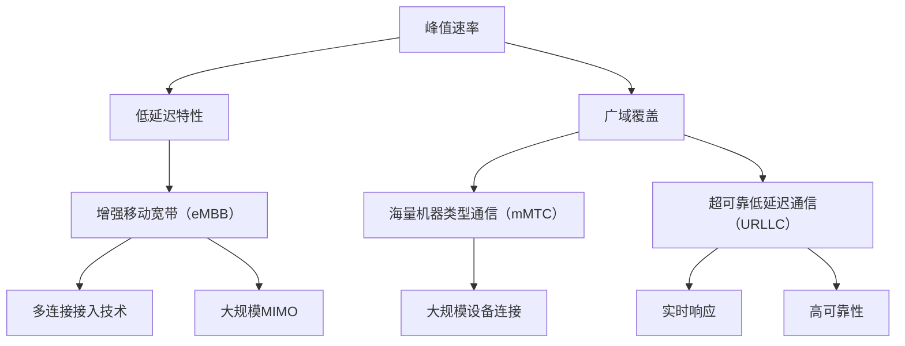

                 

### 引言

随着全球信息技术的飞速发展，5G网络作为新一代通信技术，正在逐步改变我们的生活方式。5G网络的高速率、低延迟和广域覆盖，使其在各个行业中的应用前景广阔。远程医疗作为一项能够极大提升医疗质量和效率的服务，与5G网络的结合无疑是一个划时代的重要趋势。

远程医疗，又称 telemedicine，指的是通过远程通信技术，如视频会议、在线咨询、电子病历等，实现医疗服务的提供和接收。这不仅有助于缓解医疗资源分布不均的问题，还能为患者提供更为便捷和高效的医疗服务。然而，传统的远程医疗在带宽、延迟和稳定性方面存在诸多限制，难以满足高需求的医疗场景。

5G网络的出现，为远程医疗提供了新的机遇。5G网络的高速率和低延迟特性，使得远程手术、实时诊断等高带宽、高实时性应用成为可能。此外，5G网络的广域覆盖和大规模连接能力，也为远程医疗的普及提供了保障。然而，5G网络在远程医疗中的应用也面临着一系列挑战，如网络安全性、数据隐私保护等。

本文旨在探讨5G网络在远程医疗中的应用与挑战，通过以下章节进行详细分析：

1. **5G网络的基本概念和关键技术**：介绍5G网络的核心特点和技术，为后续讨论提供基础。
2. **5G网络架构**：分析5G网络的整体架构，包括无线接入网、核心网和边缘计算网络。
3. **远程医疗的现状与挑战**：回顾远程医疗的发展历程及其应用场景，探讨5G技术带来的机遇与挑战。
4. **5G网络在远程医疗中的应用**：具体分析5G技术在远程诊断、远程治疗和远程医疗教育中的应用。
5. **案例分析**：通过具体案例展示5G技术在远程医疗中的应用效果。
6. **未来发展**：探讨5G与人工智能、物联网、区块链等技术的结合，预测远程医疗的未来发展。

通过以上章节的讨论，我们将全面了解5G网络在远程医疗中的重要作用及其面临的挑战，为这一领域的发展提供有益的思考。

### 关键词

- 5G网络
- 远程医疗
- 高速率
- 低延迟
- 广域覆盖
- 网络安全
- 数据隐私
- 远程诊断
- 远程治疗
- 远程医疗教育

### 摘要

本文详细探讨了5G网络在远程医疗中的应用与挑战。首先，介绍了5G网络的基本概念和关键技术，包括其峰值速率、低延迟特性和广域覆盖。然后，分析了5G网络的整体架构，探讨了其在远程医疗中的现状、应用场景以及面临的挑战，如网络安全性、数据隐私保护等。通过具体案例分析，展示了5G技术在远程诊断、远程治疗和远程医疗教育中的应用效果。最后，讨论了5G与人工智能、物联网、区块链等技术的结合，预测了远程医疗的未来发展方向。

---

### 1. 5G网络的基本概念和关键技术

5G网络，即第五代移动通信网络，是当前通信技术领域的一次重大变革。与之前的4G网络相比，5G网络在多个维度上展现出了显著的提升，从而为远程医疗等应用场景提供了更为坚实的基础。

#### 1.1 5G网络的核心特点

1. **峰值速率**：5G网络的峰值速率可以达到数十Gbps，远远高于4G网络的1Gbps。这意味着在高速数据传输方面，5G网络可以提供更加流畅的体验，对于远程医疗中的高清视频诊断、实时手术指导等高带宽需求的应用尤为重要。
   
2. **低延迟特性**：5G网络的端到端延迟通常在1毫秒以内，比4G网络的20-30毫秒低得多。低延迟特性对于实时性要求极高的远程医疗应用，如远程手术、远程监护等，至关重要，能够显著提高医疗操作的准确性和安全性。

3. **广域覆盖**：5G网络采用了大规模天线阵列和毫米波技术，使得其信号覆盖范围更广，即使在人口密集的城市地区，也能够实现较好的信号覆盖。这对于远程医疗服务的普及具有重要意义，能够覆盖更多地区，尤其是偏远和农村地区。

#### 1.2 5G网络的关键技术

1. **增强移动宽带（eMBB）**：eMBB是5G网络的一项关键技术，主要针对的是提升数据传输速度和带宽。eMBB通过多连接接入技术、大规模MIMO（多输入多输出）等手段，实现了更高的数据传输速率和更广的覆盖范围。

2. **海量机器类型通信（mMTC）**：mMTC旨在支持大规模设备的连接，如医疗设备、传感器等。在远程医疗中，mMTC能够实现大量的医疗设备之间的数据传输，从而提供更为全面和精确的医疗监测和数据收集。

3. **超可靠低延迟通信（URLLC）**：URLLC是5G网络针对高可靠性和低延迟通信需求而设计的关键技术。它主要应用于需要实时响应和高度可靠的场景，如远程手术、远程急救等。URLLC通过优化传输协议和资源分配机制，实现了极低的延迟和极高的通信可靠性。

#### 1.3 5G网络与远程医疗的核心联系

5G网络的高速率、低延迟和广域覆盖特性，使得其在远程医疗中具有广泛的应用前景。具体而言：

- **高速率**：在远程医疗中，高清视频诊断、医学图像传输等应用需要大量数据传输。5G网络的高速率特性能够确保这些数据在短时间内传输完成，从而提供更高质量的医疗服务。
  
- **低延迟**：对于远程手术、远程监护等应用，低延迟是保障操作准确性和患者安全的关键。5G网络的低延迟特性能够满足这些应用的需求，确保操作过程的实时性和可靠性。

- **广域覆盖**：远程医疗的目标之一是打破地域限制，实现医疗服务的普及。5G网络的广域覆盖特性，使得远程医疗服务能够覆盖更多的地区，尤其是偏远和农村地区，从而实现医疗资源的均衡分配。

总的来说，5G网络在远程医疗中的应用，不仅能够提升医疗服务的质量和效率，还能解决医疗资源分布不均的问题，为全球医疗健康事业的发展提供新的机遇。

#### 5G网络核心概念之间的关系架构图

为了更好地理解5G网络的核心概念及其相互关系，以下是一个Mermaid流程图：

通过上述流程图，我们可以清晰地看到5G网络的核心特点和技术是如何相互联系、共同促进远程医疗的发展的。

### 2. 5G网络架构

5G网络的设计旨在提供更高效、更可靠、更灵活的通信服务，其整体架构包括无线接入网（RAN）、核心网（CN）和边缘计算网络。以下是对这三个部分的基本介绍及其在远程医疗中的具体应用。

#### 2.1 无线接入网（RAN）

无线接入网是5G网络中最基础的部分，它负责用户设备（如智能手机、平板电脑、医疗设备等）与核心网络之间的无线连接。RAN的关键技术包括大规模MIMO、小基站（BBU）和有源天线阵列。

1. **大规模MIMO**：大规模MIMO技术通过使用多个天线阵列，提高了无线通信的信道利用率和传输速率。这对于远程医疗中需要高带宽的应用，如高清视频传输和大数据处理，尤为重要。

2. **小基站（BBU）**：小基站是5G网络中的关键设备，它可以部署在建筑物、街道灯柱等位置，提供灵活的覆盖和容量扩展。在远程医疗中，小基站能够提供更稳定的无线连接，确保医疗服务的连续性和稳定性。

3. **有源天线阵列**：有源天线阵列通过智能天线技术，提高了信号的方向性和传输效率。这对于实现广域覆盖和低延迟通信具有重要意义，能够确保远程医疗操作过程中的实时性和可靠性。

#### 2.2 核心网（CN）

核心网是5G网络的枢纽，负责处理用户数据、控制信令和业务逻辑。与4G网络相比，5G网络的核心网进行了全面的升级和优化，以支持更高的数据速率、更低的延迟和更多的连接。

1. **网络功能虚拟化**：5G核心网采用了网络功能虚拟化（NFV）技术，将传统的网络功能模块（如路由器、交换机等）虚拟化为软件，运行在通用硬件上。这种架构提高了网络的灵活性和可扩展性，使得远程医疗系统能够更快速地进行升级和调整。

2. **服务化架构**：5G核心网采用了服务化架构（SA），通过微服务化的方式，将网络功能分解为独立的微服务模块，实现了更高效的网络管理和资源分配。在远程医疗中，这种架构能够根据实际需求，灵活地调整网络资源，确保关键应用的稳定运行。

3. **云原生架构**：5G核心网还采用了云原生架构，通过容器化技术和微服务架构，实现了网络功能的动态部署和高效管理。这对于远程医疗中的大规模数据存储和处理具有重要意义，能够快速响应医疗需求的变化。

#### 2.3 边缘计算网络

边缘计算网络是5G网络的一个重要组成部分，它通过在靠近数据源的位置部署计算资源，减少了数据传输的延迟，提高了处理效率。在远程医疗中，边缘计算网络的应用具有重要意义。

1. **边缘节点**：边缘节点是部署在靠近用户的网络边缘的计算设备，如小型的服务器、路由器等。边缘节点可以处理本地数据，减轻中心数据中心的负担，提高远程医疗服务的实时性和响应速度。

2. **边缘计算服务**：边缘计算服务通过将部分计算任务从云端转移到边缘节点，实现了数据处理的本地化。在远程医疗中，边缘计算服务可以用于实时视频处理、医疗数据分析等任务，提高了医疗操作的准确性和效率。

3. **边缘网络优化**：边缘网络优化通过优化数据传输路径和网络资源分配，减少了数据传输的延迟和带宽消耗。在远程医疗中，边缘网络优化能够确保关键数据在第一时间传输到医疗中心，从而提高医疗服务的质量和安全性。

#### 5G网络架构与远程医疗的关系

5G网络架构中的各个组成部分，如无线接入网、核心网和边缘计算网络，共同构建了一个高效、可靠、灵活的通信基础设施，为远程医疗提供了有力支持。

- **无线接入网**：通过大规模MIMO、小基站和有源天线阵列等关键技术，无线接入网提高了无线通信的速率和覆盖范围，确保了远程医疗操作过程中的稳定连接。

- **核心网**：通过网络功能虚拟化、服务化架构和云原生架构等技术创新，核心网提供了高效、灵活的网络管理和资源分配能力，为远程医疗应用提供了稳定、可靠的通信保障。

- **边缘计算网络**：通过边缘节点、边缘计算服务和边缘网络优化等手段，边缘计算网络提高了数据处理和传输的效率，降低了延迟，为远程医疗中的实时操作和数据分析提供了技术支持。

综上所述，5G网络架构的优化和升级，为远程医疗的发展提供了坚实的基础，使得远程医疗服务能够更好地满足高速率、低延迟和高可靠性的需求，从而推动医疗技术的进步和医疗服务的普及。

#### 3. 远程医疗的现状与挑战

远程医疗作为一种新兴的医疗模式，近年来在全球范围内得到了快速发展。其应用场景多样，涵盖了远程诊断、远程治疗、远程监护和远程医疗教育等多个方面。然而，在快速发展的过程中，远程医疗也面临着一系列挑战。

##### 3.1 远程医疗的发展历程

远程医疗的概念最早可以追溯到20世纪60年代，当时主要是通过电话和书信进行医疗咨询。随着互联网和通信技术的快速发展，远程医疗逐渐从传统的文字和语音通信，过渡到图像传输和视频会议等更高级的应用形式。

1990年代，随着计算机技术和网络通信技术的成熟，远程医疗开始进入实际应用阶段。这一时期，远程医疗的应用主要集中在大城市的医院和医学院，通过远程会诊和医学图像传输，提高了医疗服务的质量和效率。

进入21世纪，随着宽带网络和移动通信技术的发展，远程医疗的应用场景进一步扩大。特别是随着4G网络的普及，远程医疗在偏远和农村地区的普及程度显著提高，为这些地区的居民提供了更多的医疗服务选择。

近年来，随着5G网络的逐步部署，远程医疗迎来了新的发展机遇。5G网络的高速率、低延迟和广域覆盖特性，使得远程医疗能够更好地满足高速数据传输和实时交互的需求，为远程医疗的广泛应用提供了技术保障。

##### 3.2 远程医疗的应用场景

1. **远程诊断**：远程诊断是远程医疗中最常见的一种应用形式，通过视频会议、在线咨询和医学图像传输等方式，医生可以远程诊断患者的病情。特别是在疫情爆发期间，远程诊断成为了控制疫情传播的重要手段。

2. **远程治疗**：远程治疗主要应用于需要实时手术指导、医疗监护等场景。通过高清视频和虚拟现实技术，医生可以远程进行手术指导和患者监护，提高了医疗操作的准确性和安全性。

3. **远程监护**：远程监护通过传感器和物联网技术，实现对患者生命体征的实时监测和数据传输。医生可以通过远程监控系统，实时了解患者的健康状况，及时调整治疗方案。

4. **远程医疗教育**：远程医疗教育通过视频会议、在线课程等方式，为医生和患者提供医学知识和技能培训。这种形式不仅提高了医学教育的覆盖范围和质量，还有助于提高医生的专业水平。

##### 3.3 远程医疗面临的挑战

尽管远程医疗具有显著的优势和应用前景，但在实际应用过程中，仍然面临着一系列挑战。

1. **网络安全性**：远程医疗依赖于互联网和通信技术，网络安全性成为了一个关键问题。由于医疗数据具有高度敏感性，任何数据泄露或恶意攻击都可能对患者的隐私和安全造成严重威胁。

2. **数据隐私保护**：随着远程医疗数据的不断增加，如何保护患者的隐私成为了一个重要挑战。特别是在跨境医疗场景中，如何确保患者数据的安全和合规，是一个亟待解决的问题。

3. **医疗设备兼容性**：远程医疗的广泛实施需要大量的医疗设备支持，这些设备需要具备良好的兼容性和互操作性。然而，由于不同厂家和技术的差异，医疗设备的兼容性问题仍然存在，影响了远程医疗的推广和应用。

4. **医疗人才不足**：远程医疗的发展需要大量的医疗人才支持，包括医生、护士、技术工程师等。然而，目前远程医疗的人才培养机制尚未健全，医疗人才短缺成为了一个制约远程医疗发展的瓶颈。

5. **法律法规不完善**：远程医疗的发展需要一个完善的法律法规体系进行规范和指导。然而，目前各国在远程医疗的法律法规方面尚不完善，存在一定的法律空白和灰色地带，影响了远程医疗的规范化发展。

综上所述，远程医疗在发展过程中面临着网络安全性、数据隐私保护、医疗设备兼容性、医疗人才不足和法律法规不完善等一系列挑战。只有通过技术创新、人才培养和法律规制等多方面的努力，才能够真正实现远程医疗的广泛应用和可持续发展。

### 3. 5G技术在远程医疗中的应用

5G网络在远程医疗中的应用，极大地拓展了医疗服务的范围和深度，带来了前所未有的变革。以下是5G技术在远程医疗中的具体应用，包括远程诊断、远程治疗和远程医疗教育等方面。

#### 3.1 远程诊断

远程诊断是远程医疗中最早且最为广泛的应用之一。通过5G网络，医生可以远程获取患者的医学图像、生命体征数据和病史信息，从而进行诊断。以下为5G网络在远程诊断中的具体应用：

1. **高清医学影像传输**：5G网络的高速率和低延迟特性，使得医生可以实时获取高清医学影像，如CT、MRI等。这种实时性对于快速诊断和制定治疗方案至关重要。例如，某医院通过5G网络实现了远程病理诊断，医生可以在几分钟内查看患者的病理切片图像，并给出初步诊断意见。

2. **远程会诊**：5G网络使得远程会诊变得更加便捷和高效。医生可以通过视频会议系统，与本地医生和患者进行实时沟通，共同讨论病例并进行诊断。例如，一些偏远地区的医院，通过5G网络与大城市的三甲医院进行远程会诊，提高了诊断的准确性和医疗服务质量。

3. **实时监测**：5G网络的高带宽和低延迟特性，使得医生可以实时监测患者的生命体征数据，如心率、血压、体温等。这种实时监测能力对于急性病患者的救治尤为重要。例如，在急诊室中，医生可以通过5G网络实时监测患者的生命体征，及时调整治疗方案，提高救治成功率。

#### 3.2 远程治疗

远程治疗是5G技术在远程医疗中最为前沿和具有突破性的应用。通过5G网络，医生可以在远程进行手术、监护和康复指导等医疗操作，以下为具体应用：

1. **远程手术**：5G网络的高速率和低延迟特性，使得医生可以在远程进行复杂的外科手术。例如，外科医生可以通过5G网络操作远程手术机器人，进行精确的手术操作，提高了手术的准确性和安全性。例如，某医院通过5G网络成功进行了首例远程肝肿瘤切除手术，手术过程稳定，患者恢复良好。

2. **远程监护**：远程监护通过5G网络实现对患者生命体征的实时监测和数据传输。医生可以通过远程监护系统，实时了解患者的健康状况，并及时采取治疗措施。例如，一些心血管疾病患者，可以通过5G网络佩戴远程监护设备，实时传输心电监护数据，医生可以远程监控并指导患者的治疗。

3. **康复指导**：5G网络使得康复指导变得更加个性化和高效。医生可以通过远程康复系统，为患者提供个性化的康复方案，并通过实时反馈和调整，提高康复效果。例如，一些康复中心通过5G网络，为患者提供远程理疗、运动指导等康复服务，患者可以在家中接受专业的康复指导，提高了康复效率。

#### 3.3 远程医疗教育

远程医疗教育通过5G网络，实现了医学教育和培训的远程化、互动化和实时化，以下为具体应用：

1. **在线课程**：5G网络的高速率和低延迟特性，使得医学教育可以通过在线课程形式进行，学生和教师可以实时互动，提高教学效果。例如，一些医学院通过5G网络，为全球学生提供实时直播的医学课程，学生可以实时提问和参与讨论，提高了学习效果。

2. **手术直播**：5G网络使得手术直播变得更加便捷和高效。医生可以通过5G网络，将手术过程实时直播给全球的医学同行和学生，从而实现手术教学的远程化和普及化。例如，一些国际顶级医院通过5G网络，成功进行了多场全球直播手术，吸引了大量的医学专家和学子参与。

3. **医学研讨会**：5G网络使得医学研讨会可以通过视频会议形式进行，医生和专家可以在远程参加会议，分享最新的医学研究成果和临床经验。例如，一些医学协会通过5G网络，成功举办了多场国际性医学研讨会，促进了全球医学界的交流与合作。

#### 3.4 应用实例

以下是一些5G技术在远程医疗中的成功应用实例：

1. **某医院远程诊断系统**：某医院通过5G网络搭建了远程诊断系统，医生可以通过系统实时获取患者的医学影像和生命体征数据，进行诊断和治疗建议。该系统大大提高了诊断的准确性和效率，受到了患者和医生的一致好评。

2. **远程手术机器人**：某医疗科技公司研发了一款远程手术机器人，通过5G网络进行实时操作和控制。该机器人已经成功应用于多例远程手术，手术过程稳定，效果显著，为患者提供了高质量的医疗服务。

3. **远程康复中心**：某康复中心通过5G网络为患者提供了远程理疗、运动指导和康复评估等服务，患者可以在家中接受专业的康复指导，提高了康复效果和患者满意度。

综上所述，5G技术在远程医疗中的应用，极大地提升了医疗服务的质量和效率，为全球医疗健康事业的发展带来了新的机遇。未来，随着5G技术的进一步发展，远程医疗将得到更广泛的应用，为人类健康事业做出更大的贡献。

### 4. 5G网络在远程诊断中的应用

5G网络在远程诊断中的应用，为医学影像传输、远程会诊和实时监测等方面带来了革命性的变化。以下是5G网络在远程诊断中的具体应用，以及这些应用如何提升了诊断的准确性、实时性和成本效益。

#### 4.1 高清医学影像传输

医学影像是诊断疾病的重要依据，包括X光片、CT扫描、MRI等。传统的方法依赖于有线网络或4G网络，存在传输速度慢、延迟高的问题，导致医学影像的清晰度和准确性受到影响。而5G网络的高速率和低延迟特性，使得高清医学影像的传输成为可能。

**应用实例**：某医院引入了5G网络，为医生提供了远程获取患者医学影像的能力。通过5G网络，医生可以实时查看患者的高清医学影像，如CT扫描和MRI，进行详细的诊断。例如，在急诊情况下，医生可以通过5G网络迅速获取患者的影像数据，做出快速诊断，并给出治疗方案。这不仅提高了诊断的准确性，还缩短了诊断时间，对急性病患者的救治尤为重要。

**技术优势**：
- **高速率**：5G网络的峰值速率可以达到数十Gbps，远高于4G网络，确保了医学影像的高速传输。
- **低延迟**：5G网络的端到端延迟通常在1毫秒以内，比4G网络的20-30毫秒低得多，使得医生可以实时查看影像数据，进行诊断。

#### 4.2 远程会诊

远程会诊是医生通过远程通信技术，与患者和本地医生进行讨论和咨询的过程。传统远程会诊依赖于视频会议和电话，但存在实时性和互动性不足的问题。5G网络的出现，使得远程会诊变得更加高效和便捷。

**应用实例**：某医院通过5G网络搭建了远程会诊平台，医生可以通过该平台与患者和本地医生进行实时视频对话，共享医学影像和数据。例如，医生可以通过5G网络实时查看患者的皮肤病变图像，与本地医生共同讨论，给出准确的诊断和治疗方案。这种远程协作不仅提高了诊断的准确性，还节省了患者的时间和经济成本。

**技术优势**：
- **高速率**：5G网络的高速率保证了视频会议的流畅性，医生和患者可以实时交流，不受网络延迟的影响。
- **低延迟**：5G网络的低延迟特性，使得医生可以实时获取患者的病情信息，快速做出诊断决策。

#### 4.3 实时监测

实时监测是通过远程传感器和5G网络，对患者的生命体征进行实时监测和数据传输的过程。这种应用在急性病和慢性病患者的管理中尤为重要，能够及时发现病情变化，采取及时的治疗措施。

**应用实例**：某医院引入了5G网络和远程监测系统，为心血管疾病患者提供了实时监测服务。通过5G网络，医生可以实时获取患者的心率、血压、血氧等生命体征数据，并在监测系统上显示。一旦发现异常，医生可以立即通过5G网络与患者联系，指导患者进行紧急处理。这种实时监测系统大大提高了心血管疾病患者的治疗效果和生存率。

**技术优势**：
- **高速率**：5G网络的高速率确保了监测数据的快速传输，医生可以实时获取患者的健康状况。
- **低延迟**：5G网络的低延迟特性，使得医生可以及时响应患者的情况变化，采取有效的治疗措施。

#### 4.4 成本效益分析

5G网络在远程诊断中的应用，不仅提高了诊断的准确性、实时性和服务质量，还带来了显著的成本效益。

**成本效益分析**：
- **减少交通成本**：患者无需前往医院进行诊断，节省了交通和时间成本。
- **减少医疗资源消耗**：医生无需亲自前往偏远地区进行诊断，节省了医疗资源的消耗。
- **提高效率**：5G网络的低延迟和高速率，提高了诊断和治疗的效率，缩短了诊疗时间。
- **降低成本**：通过减少交通、住宿和医疗资源消耗，远程诊断总体成本更低。

综上所述，5G网络在远程诊断中的应用，极大地提升了诊断的准确性、实时性和成本效益，为医学影像传输、远程会诊和实时监测等方面带来了显著的变革。未来，随着5G技术的进一步发展，远程诊断将得到更广泛的应用，为全球医疗健康事业做出更大的贡献。

### 5. 5G网络在远程治疗中的应用

5G网络在远程治疗中的应用，为远程手术、远程监护和康复指导等方面带来了革命性的变化。以下是5G网络在远程治疗中的具体应用，以及这些应用如何提升了治疗效果、降低了医疗成本并拓展了医疗服务范围。

#### 5.1 远程手术

远程手术是5G网络在远程治疗中最具突破性的应用之一。通过5G网络，医生可以远程操控手术机器人，进行复杂的手术操作。这种应用不仅提高了手术的准确性和安全性，还极大地拓展了手术的地理范围。

**应用实例**：某医院通过5G网络成功实施了远程心脏手术。医生位于另一城市的手术室，通过远程手术机器人进行手术操作，手术过程稳定，患者恢复良好。这种远程手术的应用，使得偏远地区的患者也能够享受到高水平的医疗服务，大大提高了医疗服务的可及性。

**技术优势**：
- **高速率**：5G网络的高速率确保了手术机器人操作的高效性和稳定性，医生可以实时接收和处理手术机器人传回的数据。
- **低延迟**：5G网络的低延迟特性，使得医生能够实时响应手术现场的情况变化，确保手术操作的准确性和安全性。
- **广域覆盖**：5G网络的广域覆盖能力，使得远程手术能够在不同城市甚至国家之间进行，打破了地理限制。

#### 5.2 远程监护

远程监护是通过5G网络对患者的生命体征进行实时监测和数据传输的过程。这种应用在慢性病和急性病患者的管理中尤为重要，能够及时发现病情变化，采取及时的治疗措施。

**应用实例**：某医院引入了5G网络和远程监护系统，为心血管疾病患者提供了实时监护服务。通过5G网络，医生可以实时获取患者的心率、血压、血氧等生命体征数据，并在监护系统上显示。一旦发现异常，医生可以立即通过5G网络与患者联系，指导患者进行紧急处理。这种远程监护系统大大提高了心血管疾病患者的治疗效果和生存率。

**技术优势**：
- **高速率**：5G网络的高速率确保了监护数据的快速传输，医生可以实时获取患者的健康状况。
- **低延迟**：5G网络的低延迟特性，使得医生可以及时响应患者的情况变化，采取有效的治疗措施。
- **广域覆盖**：5G网络的广域覆盖能力，使得远程监护系统可以在不同的地理位置进行，不受地域限制。

#### 5.3 康复指导

康复指导是通过5G网络为患者提供个性化康复方案和实时反馈的过程。这种应用有助于提高康复效果，减轻患者的痛苦，并节省医疗资源。

**应用实例**：某康复中心通过5G网络为患者提供了远程康复指导服务。医生通过远程监控系统，实时监测患者的康复训练情况，并根据患者的反馈调整康复方案。这种康复指导服务，使得患者可以在家中进行康复训练，节省了时间和交通成本，同时也提高了康复效果。

**技术优势**：
- **高速率**：5G网络的高速率确保了康复数据的快速传输，医生可以实时获取患者的康复训练数据。
- **低延迟**：5G网络的低延迟特性，使得医生能够及时对患者的康复训练情况进行评估和反馈。
- **广域覆盖**：5G网络的广域覆盖能力，使得康复指导服务可以覆盖广泛的地区，不受地理限制。

#### 5.4 成本效益分析

5G网络在远程治疗中的应用，不仅提高了治疗效果，还带来了显著的成本效益。

**成本效益分析**：
- **减少交通成本**：患者无需前往医院进行手术或康复训练，节省了交通和时间成本。
- **减少医疗资源消耗**：医生无需亲自前往偏远地区进行手术或监护，节省了医疗资源的消耗。
- **提高效率**：5G网络的低延迟和高速率，提高了诊断和治疗的效率，缩短了诊疗时间。
- **降低成本**：通过减少交通、住宿和医疗资源消耗，远程治疗总体成本更低。

#### 5.5 拓展医疗服务范围

5G网络在远程治疗中的应用，极大地拓展了医疗服务的范围。偏远和农村地区的患者，可以通过5G网络享受到优质的医疗服务，从而打破医疗资源分布不均的问题。

**拓展医疗服务范围**：
- **增加医疗服务覆盖率**：通过5G网络，医院可以将医疗服务覆盖到偏远和农村地区，使得这些地区的患者也能够享受到高质量的医疗服务。
- **促进医疗资源共享**：5G网络使得医疗资源可以更加高效地共享，医生和患者可以跨越地域限制，实现实时互动和协作。
- **提升医疗可及性**：5G网络的广域覆盖能力，使得医疗服务的可及性大大提高，患者无需长途跋涉即可获得高质量的医疗服务。

综上所述，5G网络在远程治疗中的应用，极大地提升了治疗效果、降低了医疗成本并拓展了医疗服务范围。未来，随着5G技术的进一步发展，远程治疗将得到更广泛的应用，为全球医疗健康事业做出更大的贡献。

### 6. 5G网络在远程医疗教育中的应用

5G网络在远程医疗教育中的应用，不仅改变了传统教学模式，还为医学知识的传播、医生的培训和教育资源的分配带来了新的契机。以下是5G网络在远程医疗教育中的具体应用，以及这些应用如何增强互动性、提高教育质量和降低教育成本。

#### 6.1 在线课程

在线课程是远程教育的重要组成部分，通过5G网络，医学教育和培训可以变得更加灵活和高效。学生可以通过在线平台实时观看课程直播，与教师进行互动交流，获取最新的医学知识。

**应用实例**：某医学院通过5G网络搭建了在线课程平台，学生可以实时观看教授的授课视频，并通过在线聊天功能与教授进行互动。例如，在病理学课程中，教授可以通过5G网络实时展示病理切片图像，学生可以立即提出问题并得到解答。这种实时互动的教学模式，大大提高了学生的学习效果和参与度。

**技术优势**：
- **高速率**：5G网络的高速率确保了视频课程传输的流畅性和图像的清晰度，学生可以清晰地看到授课内容。
- **低延迟**：5G网络的低延迟特性，使得学生和教师可以实时交流，减少信息传递的延迟，提高互动效率。

#### 6.2 手术直播

手术直播是医学教育中的重要环节，通过5G网络，医生和医学生可以远程观看手术过程，学习实际操作技巧。

**应用实例**：某医院通过5G网络成功举办了多场手术直播，医生和医学生可以通过在线平台实时观看手术过程，并随时提问和讨论。例如，在一次心脏手术直播中，医生通过5G网络向观众详细讲解了手术步骤和技巧，观众可以实时提问并得到解答。这种直播教学模式，不仅提高了医学生的实践能力，还促进了医学知识的普及。

**技术优势**：
- **高清传输**：5G网络的高速率和低延迟特性，确保了手术直播的高清传输和实时互动，学生可以清晰地看到手术过程。
- **实时反馈**：通过5G网络，学生可以实时提问和讨论，教师可以立即给出反馈和解答，提高了教学效果。

#### 6.3 虚拟现实（VR）培训

虚拟现实技术可以模拟真实的医疗环境，通过5G网络，医学生可以进行虚拟手术操作和医疗演练，提高实践技能。

**应用实例**：某医学院通过5G网络搭建了虚拟手术培训平台，学生可以通过VR设备进行虚拟手术操作，并实时接收教师的反馈。例如，在胸腔手术训练中，学生可以通过VR设备进行模拟操作，教师可以在虚拟环境中实时纠正学生的操作错误，并提供指导。这种虚拟现实培训模式，不仅提高了学生的实践能力，还降低了实际手术中的风险。

**技术优势**：
- **沉浸式体验**：5G网络的高速率和低延迟特性，为虚拟现实培训提供了沉浸式的体验，学生可以如同在实际环境中操作。
- **实时反馈**：通过5G网络，教师可以实时获取学生的操作数据，并提供即时反馈和指导，帮助学生提高操作技能。

#### 6.4 成本效益分析

5G网络在远程医疗教育中的应用，不仅提高了教育质量，还带来了显著的成本效益。

**成本效益分析**：
- **降低交通成本**：学生无需亲自前往教学医院，节省了交通和时间成本。
- **减少教育资源消耗**：教师无需亲自前往不同地区进行培训，节省了教育资源。
- **提高效率**：5G网络的低延迟和高速率，提高了教学效率，缩短了教学时间。
- **降低成本**：通过减少交通、住宿和教学资源消耗，远程医疗教育总体成本更低。

#### 6.5 拓展教育资源

5G网络在远程医疗教育中的应用，使得优质教育资源可以更加广泛地传播和共享。

**拓展教育资源**：
- **增加教育覆盖范围**：通过5G网络，优质教育资源可以覆盖到偏远和农村地区，使得更多学生能够享受到高质量的医学教育。
- **促进教育资源共享**：教师和学生可以跨越地域限制，实现实时互动和资源共享，提高了教育公平性。
- **提升教育质量**：通过5G网络的实时互动和高清传输，教育质量得到显著提升，学生可以更加深入地理解和掌握医学知识。

综上所述，5G网络在远程医疗教育中的应用，通过增强互动性、提高教育质量和降低教育成本，为医学知识的传播、医生的培训和教育的普及提供了新的契机。未来，随着5G技术的进一步发展，远程医疗教育将得到更广泛的应用，为全球医疗健康事业的发展做出更大的贡献。

### 7. 案例分析

为了更具体地展示5G网络在远程医疗中的实际应用效果，以下将详细介绍两个典型案例：5G远程诊断系统和5G远程治疗中心的建立。

#### 7.1 案例一：5G远程诊断系统的实施

**案例背景**：

某偏远地区医院由于地理位置偏远，医疗资源相对匮乏，许多患者需要长途跋涉才能获得基本的医疗服务。为了解决这一问题，该医院引入了5G远程诊断系统，希望通过5G网络实现与大城市三甲医院的远程诊断协作。

**系统架构**：

该5G远程诊断系统主要包括以下组成部分：

1. **医疗设备**：医院内配备了高清医学影像设备（如CT、MRI等），这些设备可以通过5G网络将医学影像数据传输到远程诊断中心。
2. **5G网络**：医院和远程诊断中心之间通过5G网络进行连接，确保医学影像数据的高速传输。
3. **远程诊断中心**：由大城市的三甲医院提供远程诊断服务，医生通过远程诊断平台接收影像数据，进行诊断并给出治疗方案。
4. **远程诊断平台**：一个集成了医学影像处理、数据分析和远程会诊功能的平台，医生可以通过该平台进行远程诊断操作。

**技术实现**：

1. **医学影像传输**：通过5G网络，医院内的医学影像设备将影像数据实时传输到远程诊断中心，实现了高速、稳定的医学影像传输。
2. **数据分析和诊断**：远程诊断中心的医生通过远程诊断平台，对影像数据进行详细分析，结合患者的病史和症状，给出准确的诊断和治疗方案。
3. **远程会诊**：医生可以通过远程诊断平台与当地医生和患者进行实时视频会诊，讨论诊断结果和治疗方案，确保诊断的准确性和有效性。

**应用效果**：

自从引入5G远程诊断系统以来，该偏远地区医院的服务质量得到了显著提升，具体体现在以下几个方面：

- **诊断准确率提高**：通过远程会诊和专家诊断，诊断准确率显著提高，患者得到了更加精准的治疗方案。
- **诊疗效率提升**：医学影像数据的高速传输和远程诊断平台的实时性，使得诊疗过程更加高效，患者等待时间大幅缩短。
- **医疗资源优化**：专家医生可以通过远程诊断平台为偏远地区医院提供诊断支持，实现了医疗资源的优化配置。

#### 7.2 案例二：5G远程治疗中心的建立

**案例背景**：

某大型城市由于人口密度高，医疗资源需求巨大，为了缓解城市医疗资源紧张的问题，该市建立了一个5G远程治疗中心，通过5G网络为市区及周边地区的患者提供远程医疗服务。

**系统架构**：

该5G远程治疗中心主要包括以下组成部分：

1. **远程手术机器人**：配备了先进的远程手术机器人，医生可以通过5G网络进行远程手术操作。
2. **远程监护系统**：通过5G网络实现对患者的实时监护，医生可以远程监控患者的生命体征。
3. **康复指导系统**：为患者提供个性化的康复方案和实时反馈，帮助患者进行康复训练。
4. **5G网络**：覆盖整个治疗中心，确保医疗设备和系统的稳定运行。

**技术实现**：

1. **远程手术**：医生通过远程手术机器人，在5G网络的低延迟和高带宽支持下，进行远程手术操作，确保手术的稳定性和准确性。
2. **远程监护**：通过5G网络，医生可以实时获取患者的生命体征数据，并在远程监护系统上进行监控和分析，及时采取治疗措施。
3. **康复指导**：医生通过康复指导系统，为患者提供个性化的康复方案，并通过实时反馈和调整，提高康复效果。

**应用效果**：

5G远程治疗中心的建立，为城市及周边地区的患者提供了高质量的远程医疗服务，具体体现在以下几个方面：

- **手术成功率提高**：远程手术机器人的高精度操作，使得手术的成功率显著提高，患者术后恢复更快。
- **医疗资源优化**：通过远程治疗，城市的三甲医院可以为更多患者提供手术和监护服务，实现了医疗资源的优化配置。
- **医疗服务可及性提升**：患者无需前往大型医院，即可享受到高水平的医疗服务，特别是偏远地区的患者，大大提高了医疗服务的可及性。

综上所述，5G远程诊断系统和5G远程治疗中心的成功实施，充分展示了5G网络在远程医疗中的应用价值。通过这些实际案例，我们可以看到，5G技术不仅提高了医疗服务的质量和效率，还为医疗资源的均衡分配和医疗服务的普及提供了强有力的支持。

### 8. 5G网络在远程医疗中的未来发展

随着5G技术的不断发展和成熟，远程医疗领域也迎来了新的机遇和挑战。未来，5G网络与人工智能（AI）、物联网（IoT）和区块链等新兴技术的融合，将进一步推动远程医疗的发展，带来更多的创新应用和解决方案。

#### 8.1 5G与人工智能的融合

人工智能在医疗领域的应用已经取得了显著成果，如医学影像分析、疾病预测和个性化治疗等。5G网络的高速率和低延迟特性，使得AI算法在远程医疗中的应用更加高效和实时。以下为5G与AI在远程医疗中的潜在应用：

1. **智能诊断系统**：通过5G网络，医疗设备可以实时传输大量的医学影像数据，AI算法可以在云端或边缘设备上快速分析这些数据，提供精准的诊断建议。例如，AI算法可以自动识别医学影像中的异常情况，提高诊断的准确性。
   
2. **个性化治疗方案**：基于5G网络的远程医疗系统，可以实时收集和分析患者的生理数据，利用AI算法生成个性化的治疗方案。这种治疗方案可以根据患者的实时状况进行调整，提高治疗效果。

3. **智能药物研发**：5G网络可以加速药物研发过程，通过实时传输大量的生物医学数据，AI算法可以加速新药的发现和临床试验。例如，AI算法可以分析临床试验数据，快速筛选出有效的药物组合。

#### 8.2 5G与物联网的融合

物联网（IoT）在远程医疗中的应用，可以通过实时监测患者的生理参数，提供更加个性化和精准的医疗服务。5G网络的高带宽和低延迟特性，使得IoT设备可以更加高效地传输数据，实现远程医疗的实时监测和智能管理。以下为5G与IoT在远程医疗中的潜在应用：

1. **智能健康监测**：通过5G网络，IoT设备可以实时监测患者的血压、心率、血糖等生理参数，并将数据传输到远程医疗系统。医生可以根据这些数据，实时调整治疗方案，提高治疗效果。

2. **智能药柜**：智能药柜可以通过5G网络与远程医疗系统连接，实时记录患者的药物使用情况，并提醒患者按时服药。医生可以根据智能药柜的数据，调整患者的用药方案。

3. **智能医疗设备管理**：5G网络可以实时监控医疗设备的运行状态，预测设备故障并进行维护。这种智能化的设备管理，可以提高医疗设备的利用率，降低维修成本。

#### 8.3 5G与区块链的结合

区块链技术具有去中心化、不可篡改和可追溯等特性，可以增强远程医疗数据的安全性和隐私性。5G网络的高速率和低延迟特性，使得区块链技术在远程医疗中的应用更加高效和可靠。以下为5G与区块链在远程医疗中的潜在应用：

1. **医疗数据管理**：通过5G网络，医疗数据可以存储在分布式区块链上，实现数据的安全存储和共享。医生和患者可以通过区块链访问医疗数据，提高数据的安全性和透明度。

2. **医疗记录管理**：区块链技术可以用于管理患者的医疗记录，确保医疗记录的完整性和真实性。医生可以根据区块链上的医疗记录，快速查询患者的病史和治疗方案。

3. **电子病历管理**：通过5G网络和区块链技术，可以实现电子病历的实时更新和共享。这种电子病历管理系统，可以减少医疗信息的误差和重复，提高医疗效率。

#### 8.4 未来应用场景

未来，5G网络与人工智能、物联网和区块链等技术的融合，将带来更多的远程医疗应用场景，为全球医疗健康事业的发展提供新的动力。以下为未来远程医疗的一些潜在应用场景：

1. **个性化健康管理**：通过5G网络和AI技术，可以为每个人提供个性化的健康管理方案。AI算法可以分析大量的健康数据，预测健康风险，并提供预防措施。

2. **智能药物配送**：通过5G网络和物联网技术，可以实现智能药物配送。患者可以在家中通过智能设备接收药物，并实时传输药物使用数据给医生，确保用药的安全和有效。

3. **智能健康城市**：通过5G网络和物联网技术，可以构建智能健康城市，实现城市居民的健康监测和管理。城市管理者可以根据实时健康数据，制定更有效的公共卫生政策。

4. **远程急救服务**：通过5G网络和AI技术，可以实现远程急救服务。医生可以通过远程监控系统，实时监测急救患者的状况，并给出急救建议，提高急救的成功率。

总之，5G网络与人工智能、物联网和区块链等技术的融合，将推动远程医疗向更加智能化、个性化和高效化的方向发展。未来，远程医疗将不仅仅是一种补充医疗模式，而是成为医疗健康事业的重要组成部分，为全球人民提供更加优质和便捷的医疗服务。

### 结论

5G网络在远程医疗中的应用，带来了革命性的变革，极大地提升了医疗服务的质量和效率。通过高速率、低延迟和广域覆盖的特点，5G网络不仅满足了远程诊断、远程治疗和远程医疗教育等应用的高带宽和实时性需求，还为医疗资源的均衡分配和医疗服务的普及提供了有力支持。

本文详细探讨了5G网络的基本概念和关键技术，分析了5G网络的架构及其在远程医疗中的应用，包括远程诊断、远程治疗和远程医疗教育。同时，通过具体案例展示了5G网络在远程医疗中的实际应用效果，并讨论了5G与人工智能、物联网和区块链等技术的融合前景。

然而，5G网络在远程医疗中的应用也面临一系列挑战，如网络安全性、数据隐私保护、医疗设备兼容性和医疗人才不足等。针对这些挑战，需要通过技术创新、法律法规完善和人才培养等多方面的努力，确保远程医疗的可持续发展。

未来，随着5G技术的进一步发展，远程医疗将实现更加智能化、个性化和高效化的发展。通过5G与人工智能、物联网和区块链等技术的深度融合，远程医疗将在全球范围内得到更广泛的应用，为人类健康事业的发展作出更大的贡献。

### 附录：最佳实践 tips、小结、注意事项、拓展阅读

#### 最佳实践 tips

1. **优化5G网络部署**：确保5G网络的高速率和低延迟，选择合适的基站位置和天线布局，以最大化网络覆盖和性能。
2. **加强网络安全防护**：在5G网络中部署先进的网络安全技术，如防火墙、入侵检测系统和加密技术，确保医疗数据的安全性和隐私性。
3. **医疗设备标准化**：推动医疗设备的标准化和互操作性，以减少兼容性问题，提高远程医疗系统的稳定性。
4. **人才培养与培训**：加强医疗和IT人才的培养，提供专业的5G远程医疗培训，提高医生和医疗工作人员的技术水平。

#### 小结

本文系统地探讨了5G网络在远程医疗中的应用与挑战，阐述了5G网络的基本概念、关键技术及其在远程医疗中的架构和应用。通过具体案例展示了5G技术的实际应用效果，并对未来发展趋势进行了预测。

#### 注意事项

1. **网络稳定性**：5G网络的稳定性直接影响远程医疗的质量，需确保网络信号的稳定传输。
2. **数据安全与隐私**：医疗数据具有高度敏感性，必须采取严格的加密和访问控制措施，确保数据的安全性和隐私性。
3. **技术更新与维护**：5G技术发展迅速，医疗系统需定期更新和维护，以适应新的技术标准和应用需求。

#### 拓展阅读

1. **《5G网络技术与应用》**：详细介绍了5G网络的技术原理、架构和应用场景，适合了解5G技术的基本知识。
2. **《远程医疗：技术、挑战与未来》**：探讨了远程医疗的发展历程、技术挑战和未来趋势，适合对远程医疗感兴趣的读者。
3. **《人工智能在医疗领域的应用》**：介绍了人工智能在医疗诊断、治疗和健康管理中的应用，以及相关的技术原理和实践案例。

