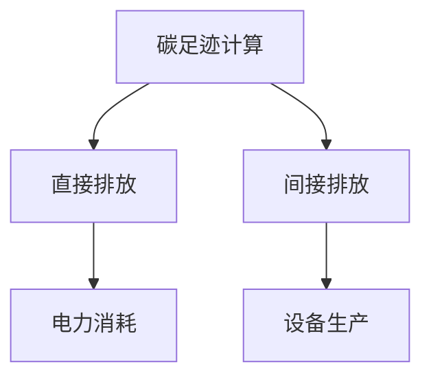
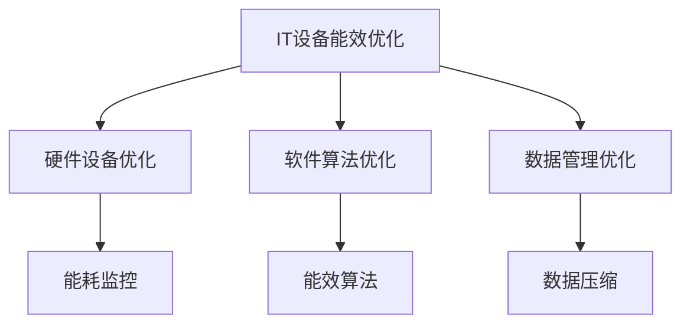
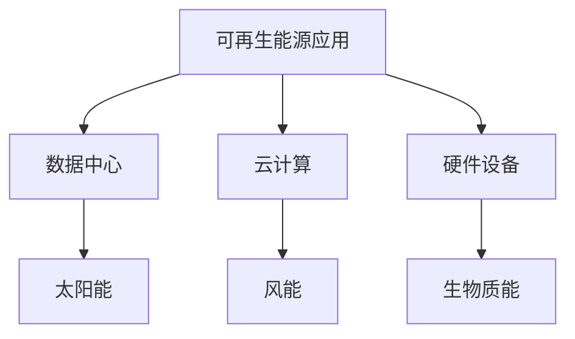
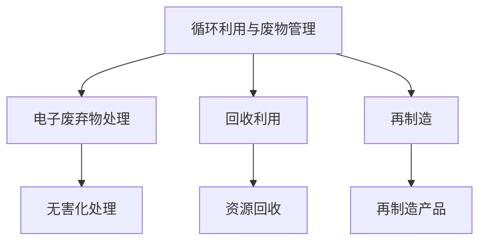
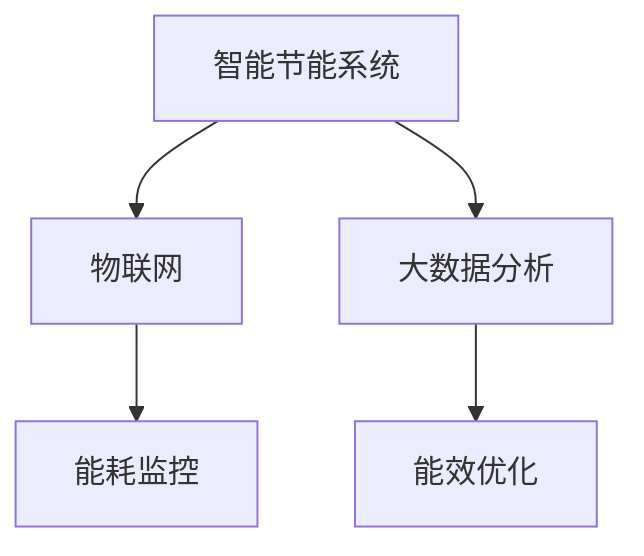
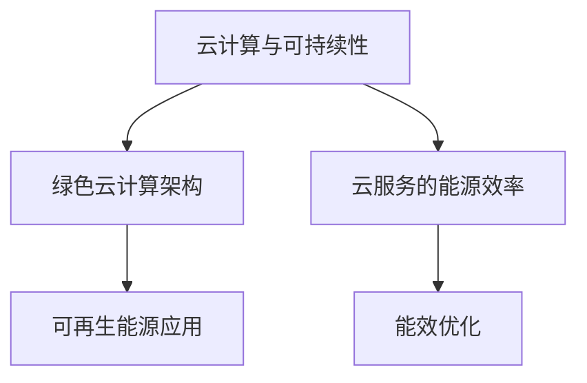
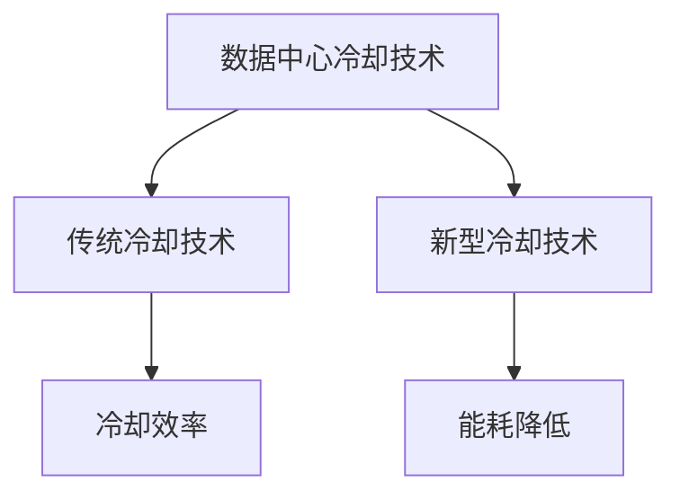
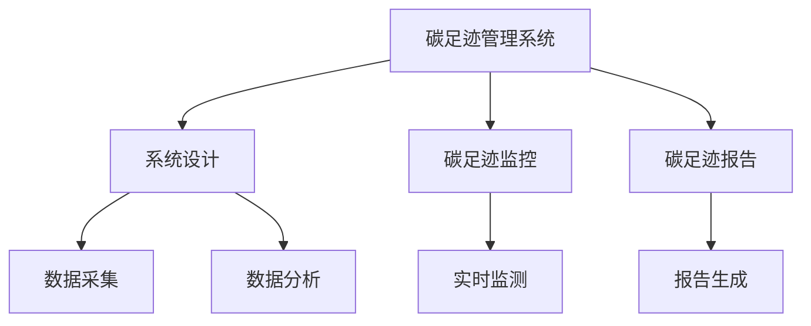

                 

### 《IT可持续性：碳足迹成为首要考虑因素》

---

# 《IT可持续性：碳足迹成为首要考虑因素》

关键词：**IT可持续性、碳足迹、数据中心、云计算、能效优化**

摘要：在当今全球气候变化日益严峻的背景下，IT行业的碳足迹问题引起了广泛关注。本文将深入探讨IT可持续性及其核心概念，分析碳足迹计算方法，探讨IT设备能效优化、可再生能源应用、循环利用与废物管理等方面的实践，并通过案例分析，揭示国际和国内企业在IT可持续性领域的成功经验。最后，本文将展望IT可持续性的未来趋势，提出潜在的挑战与解决策略，为推动IT行业的可持续发展提供有益的参考。

---

## 引言

### 1.1 IT可持续性的重要性

IT（信息技术）是当今社会发展的核心驱动力，然而，其高能耗、高排放的特性也给环境带来了巨大的压力。据统计，IT行业已经成为全球碳排放的重要来源之一，其中，数据中心、云计算和硬件设备生产等环节的能耗尤为突出。因此，实现IT可持续性，减少碳足迹，不仅是应对气候变化的重要举措，也是提升行业竞争力、实现绿色发展的必然选择。

### 1.2 碳足迹对IT行业的影响

碳足迹是指一个组织、产品或服务在生命周期内所产生的温室气体排放量。对于IT行业而言，碳足迹的影响主要体现在以下几个方面：

- **数据中心的能耗问题**：数据中心是IT行业的主要能源消耗者，其能耗主要集中在电力供应、冷却设备和硬件设备运行等方面。据统计，全球数据中心的能耗已占全球总能耗的1%以上，且这一比例还在不断上升。
  
- **云计算与碳足迹**：云计算的普及使得企业对数据中心的需求进一步增加，从而加剧了碳足迹的问题。尽管云计算本身具有高效能、灵活性的优势，但其能耗问题也不可忽视。

- **硬件设备的生产与废弃**：硬件设备的生产和废弃过程也会产生大量的温室气体排放。特别是在生产过程中，半导体制造等环节的能源消耗和碳排放尤为显著。

### 1.3 可持续性的挑战与机遇

实现IT可持续性面临着诸多挑战，如技术难题、市场因素和社会影响力等。然而，这同时也带来了巨大的机遇，包括：

- **技术趋势分析**：随着人工智能、物联网等新技术的不断发展，IT行业的能效优化和碳足迹减少将迎来新的突破口。

- **政策与法规的影响**：全球各国政府纷纷出台相关政策，推动IT行业的可持续发展。企业必须紧跟政策动向，确保合规经营。

- **企业社会责任**：企业履行社会责任，积极参与环保活动，不仅有助于提升品牌形象，也能获得市场竞争优势。

---

## 第二部分 IT可持续性核心概念

### 2.1 碳足迹计算方法

#### 核心概念与联系

为了实现IT可持续性，首先需要准确计算IT系统的碳足迹。碳足迹计算主要包括直接排放（如数据中心电力消耗）和间接排放（如设备生产过程中的碳排放）。

**Mermaid 流程图**：



#### 核心算法原理讲解

碳足迹的计算公式如下：

$$
\text{碳足迹} = \text{直接排放} + \text{间接排放}
$$

其中，直接排放可以通过以下公式计算：

$$
\text{直接排放} = \text{电力消耗} \times \text{碳排放因子}
$$

间接排放则需要考虑设备生产、供应链等环节的碳排放，其计算相对复杂。

#### Python 源代码示例

```python
def calculate_direct_emission(energy_consumption, carbon_factor):
    return energy_consumption * carbon_factor

def calculate_total_emission(energy_consumption, carbon_factor, indirect_emission):
    return calculate_direct_emission(energy_consumption, carbon_factor) + indirect_emission

# 示例数据
energy_consumption = 1000  # 单位：千瓦时（kWh）
carbon_factor = 0.000526  # 单位：千克二氧化碳/千瓦时
indirect_emission = 500  # 单位：千克二氧化碳

# 计算直接排放和总排放
direct_emission = calculate_direct_emission(energy_consumption, carbon_factor)
total_emission = calculate_total_emission(energy_consumption, carbon_factor, indirect_emission)

print(f"直接排放：{direct_emission}千克二氧化碳")
print(f"总排放：{total_emission}千克二氧化碳")
```

### 2.2 IT设备能效优化

#### 核心概念与联系

IT设备的能效优化是降低碳足迹的重要手段。主要涉及硬件设备、软件算法和数据管理等方面的优化。

**Mermaid 流程图**：



#### 核心算法原理讲解

- **硬件设备优化**：通过选择高能效的硬件设备，如低功耗CPU和GPU，以及优化设备的运行状态，如合理调度任务、减少待机能耗等。

- **软件算法优化**：通过改进软件算法，提高数据处理效率，降低能耗。例如，采用分布式计算、并行处理等技术，减少单台设备的负荷。

- **数据管理优化**：通过数据压缩、去重等技术，减少数据存储和传输的能耗。

#### Python 源代码示例

```python
import numpy as np

def compress_data(data):
    # 假设数据压缩比为2
    compressed_data = np.random.choice(data, size=int(len(data) / 2))
    return compressed_data

def calculate_energy_consumption(data_size, compression_ratio):
    # 假设每兆字节数据传输能耗为0.1千瓦时
    energy_consumption = data_size * 0.1 * compression_ratio
    return energy_consumption

# 示例数据
data_size = 1000  # 单位：兆字节（MB）
compression_ratio = 2

# 计算原始数据能耗和压缩后数据能耗
original_energy_consumption = calculate_energy_consumption(data_size, 1)
compressed_energy_consumption = calculate_energy_consumption(data_size, compression_ratio)

print(f"原始数据能耗：{original_energy_consumption}千瓦时")
print(f"压缩后数据能耗：{compressed_energy_consumption}千瓦时")
```

### 2.3 可再生能源在IT中的应用

#### 核心概念与联系

可再生能源（如太阳能、风能）在IT领域的应用是降低碳足迹的重要途径。主要涉及数据中心、云计算和硬件设备等方面的应用。

**Mermaid 流�程图**：



#### 核心算法原理讲解

- **数据中心**：通过建设绿色数据中心，采用可再生能源供电，降低数据中心的碳足迹。

- **云计算**：通过采用绿色云计算平台，提高能源利用效率，减少碳排放。

- **硬件设备**：通过使用可再生能源生产的硬件设备，降低设备生产过程中的碳排放。

#### Python 源代码示例

```python
def calculate_renewable_energy_consumption(energy_consumption, renewable_energy_ratio):
    renewable_energy_consumption = energy_consumption * renewable_energy_ratio
    return renewable_energy_consumption

# 示例数据
energy_consumption = 1000  # 单位：千瓦时（kWh）
renewable_energy_ratio = 0.5

# 计算可再生能源消耗
renewable_energy_consumption = calculate_renewable_energy_consumption(energy_consumption, renewable_energy_ratio)

print(f"可再生能源消耗：{renewable_energy_consumption}千瓦时")
```

### 2.4 循环利用与废物管理

#### 核心概念与联系

循环利用与废物管理是降低IT行业碳排放的重要环节。主要涉及电子废弃物的处理、回收利用和再制造等方面。

**Mermaid 流程图**：



#### 核心算法原理讲解

- **电子废弃物处理**：通过无害化处理，减少电子废弃物对环境的污染。

- **回收利用**：通过回收电子废弃物中的有用材料，减少资源浪费和环境污染。

- **再制造**：通过再制造，提高电子废弃物的利用率，降低碳排放。

#### Python 源代码示例

```python
def calculate_recycling_efficiency(waste_quantity, recycling_rate):
    recycled_quantity = waste_quantity * recycling_rate
    return recycled_quantity

# 示例数据
waste_quantity = 1000  # 单位：千克
recycling_rate = 0.8

# 计算回收量
recycled_quantity = calculate_recycling_efficiency(waste_quantity, recycling_rate)

print(f"回收量：{recycled_quantity}千克")
```

---

## 第三部分 IT可持续性技术应用

### 3.1 智能节能系统

#### 核心概念与联系

智能节能系统是利用物联网、大数据等技术，实现IT设备的智能监控与优化，降低能耗和碳排放。

**Mermaid 流程图**：



#### 核心算法原理讲解

- **物联网**：通过传感器实时监控设备运行状态，收集能耗数据。

- **大数据分析**：利用大数据技术，分析能耗数据，发现节能潜力。

- **能效优化**：根据数据分析结果，优化设备运行状态，降低能耗。

#### Python 源代码示例

```python
import random

def monitor_energy_consumption(sensors_data):
    total_energy_consumption = sum(sensors_data.values())
    return total_energy_consumption

def optimize_energy_consumption(sensors_data, target_energy_consumption):
    optimized_data = {}
    for device, consumption in sensors_data.items():
        if consumption < target_energy_consumption:
            optimized_data[device] = consumption
        else:
            optimized_data[device] = consumption * 0.9  # 优化后能耗降低10%
    return optimized_data

# 示例数据
sensors_data = {'Server1': 200, 'Server2': 300, 'Server3': 400}
target_energy_consumption = 1000  # 单位：千瓦时（kWh）

# 监控能耗
total_energy_consumption = monitor_energy_consumption(sensors_data)
print(f"总能耗：{total_energy_consumption}千瓦时")

# 优化能耗
optimized_data = optimize_energy_consumption(sensors_data, target_energy_consumption)
print(f"优化后能耗：{sum(optimized_data.values())}千瓦时")
```

### 3.2 云计算与可持续性

#### 核心概念与联系

云计算是IT行业的重要组成部分，其可持续性关系到整个行业的绿色发展。主要涉及绿色云计算架构、云服务的能源效率和绿色云计算应用等方面。

**Mermaid 流程图**：



#### 核心算法原理讲解

- **绿色云计算架构**：通过采用分布式计算、虚拟化等技术，提高资源利用率，降低能耗。

- **云服务的能源效率**：通过优化云服务配置、负载均衡等技术，提高能源利用效率。

- **可再生能源应用**：通过采用可再生能源供电，降低云服务的碳排放。

#### Python 源代码示例

```python
def calculate_cloud_service_energy_efficiency(total_energy_consumption, renewable_energy_ratio):
    energy_efficiency = 1 / (total_energy_consumption * (1 - renewable_energy_ratio))
    return energy_efficiency

# 示例数据
total_energy_consumption = 1000  # 单位：千瓦时（kWh）
renewable_energy_ratio = 0.5

# 计算云服务能源效率
energy_efficiency = calculate_cloud_service_energy_efficiency(total_energy_consumption, renewable_energy_ratio)
print(f"云服务能源效率：{energy_efficiency}")
```

### 3.3 数据中心冷却技术

#### 核心概念与联系

数据中心冷却技术是降低数据中心能耗的重要环节。主要涉及传统冷却技术与问题、新型冷却技术、数据中心能耗分析等方面。

**Mermaid 流程图**：



#### 核心算法原理讲解

- **传统冷却技术**：主要采用水冷、风冷等技术，通过散热设备将热量带走。

- **新型冷却技术**：采用液冷、相变冷却等技术，提高冷却效率，降低能耗。

- **数据中心能耗分析**：通过能耗监测，分析数据中心各环节的能耗情况，找出节能潜力。

#### Python 源代码示例

```python
def calculate_data_center_energy_consumption(cooling_efficiency, total_energy_consumption):
    energy_consumption = total_energy_consumption / cooling_efficiency
    return energy_consumption

# 示例数据
cooling_efficiency = 0.9  # 冷却效率
total_energy_consumption = 1000  # 单位：千瓦时（kWh）

# 计算数据中心能耗
energy_consumption = calculate_data_center_energy_consumption(cooling_efficiency, total_energy_consumption)
print(f"数据中心能耗：{energy_consumption}千瓦时")
```

### 3.4 碳足迹管理系统

#### 核心概念与联系

碳足迹管理系统是用于监测、计算和报告企业碳足迹的信息系统。主要涉及系统设计与实现、碳足迹监控与报告等方面。

**Mermaid 流程图**：



#### 核心算法原理讲解

- **系统设计**：设计一个高效的碳足迹管理系统，包括数据采集、数据分析和报告生成等模块。

- **碳足迹监控**：实时监测企业的碳足迹，确保数据的准确性和实时性。

- **碳足迹报告**：根据监测数据，生成详细的碳足迹报告，为企业决策提供支持。

#### Python 源代码示例

```python
def collect_data(sensors_data):
    return sensors_data

def analyze_data(data):
    total_emission = sum(data.values())
    return total_emission

def generate_report(total_emission):
    report = f"总排放：{total_emission}千克二氧化碳"
    return report

# 示例数据
sensors_data = {'Server1': 200, 'Server2': 300, 'Server3': 400}

# 采集数据
collected_data = collect_data(sensors_data)

# 分析数据
total_emission = analyze_data(collected_data)

# 生成报告
report = generate_report(total_emission)

print(report)
```

---

## 第四部分 IT可持续性案例研究

### 4.1 国际企业可持续性实践

#### 案例分析1：公司A的可持续战略

公司A是全球领先的IT服务提供商，其可持续战略主要包括以下几个方面：

1. **数据中心绿色化**：公司A在全球范围内建设绿色数据中心，采用可再生能源供电，降低碳排放。

2. **能效优化**：公司A通过智能节能系统，实时监控和优化设备运行状态，提高能源利用效率。

3. **循环利用与废物管理**：公司A积极推行电子废弃物的回收利用，通过再制造技术，降低碳排放。

#### 案例分析2：公司B的碳足迹减少计划

公司B是一家全球领先的云计算服务提供商，其碳足迹减少计划主要包括以下几个方面：

1. **绿色云计算**：公司B采用绿色云计算架构，提高能源利用效率，降低碳排放。

2. **智能节能系统**：公司B通过智能节能系统，实时监测和优化数据中心能耗，提高节能效果。

3. **可再生能源应用**：公司B在全球范围内建设绿色数据中心，采用太阳能、风能等可再生能源供电。

### 4.2 中国地区可持续性案例

#### 案例分析1：数据中心能耗管理

中国某大型数据中心在可持续性方面采取了以下措施：

1. **新型冷却技术**：采用液冷、相变冷却等新型冷却技术，提高冷却效率，降低能耗。

2. **能效优化**：通过大数据分析，优化设备运行状态，降低能耗。

3. **可再生能源应用**：建设太阳能发电设施，采用可再生能源供电，降低碳排放。

#### 案例分析2：云计算与可再生能源的结合

中国某云计算服务提供商通过以下方式实现云计算与可再生能源的结合：

1. **绿色云计算平台**：建设绿色云计算平台，提高能源利用效率，降低碳排放。

2. **可再生能源采购**：与可再生能源供应商合作，采购绿色电力，降低碳排放。

3. **智能节能系统**：采用智能节能系统，实时监测和优化数据中心能耗，提高节能效果。

### 4.3 公共部门与教育机构的可持续性实践

#### 案例分析1：政府机构的绿色IT政策

某地方政府机构在可持续性方面采取了以下措施：

1. **绿色采购**：推行绿色采购政策，鼓励企业采用低能耗、低排放的IT设备。

2. **能耗监测**：建设能耗监测系统，实时监控政府机构的能耗情况，提高节能效果。

3. **循环利用与废物管理**：加强电子废弃物的回收利用，降低碳排放。

#### 案例分析2：高校的可持续信息技术教育

某高校在可持续信息技术教育方面采取了以下措施：

1. **课程设置**：开设可持续信息技术课程，培养学生的可持续发展意识。

2. **实验室建设**：建设绿色实验室，采用低能耗设备，提高能源利用效率。

3. **科研项目**：开展可持续信息技术研究，探索绿色信息技术解决方案。

---

## 第五部分 IT可持续性未来趋势

### 5.1 可持续技术发展趋势

随着人工智能、物联网等新技术的不断发展，IT可持续性技术也将迎来新的发展趋势：

1. **人工智能与可持续性**：利用人工智能技术，实现能耗预测、能效优化等，提高IT系统的可持续发展能力。

2. **物联网与智能城市**：通过物联网技术，实现城市各领域的智能化，降低碳排放。

3. **新兴技术的影响**：探索区块链、5G等新兴技术在IT可持续性中的应用，提高可持续发展水平。

### 5.2 政策与法规展望

全球各国政府纷纷出台相关政策，推动IT行业的可持续发展。未来，相关政策将更加严格，企业需紧跟政策动向，确保合规经营：

1. **国际政策动态**：全球范围内，碳交易市场、碳税等政策将逐渐普及，影响企业的碳排放管理。

2. **国内法规更新**：我国政府将出台更多法规，规范企业碳排放管理，推动绿色信息技术发展。

3. **企业合规挑战与机遇**：企业需积极应对政策变化，提升可持续发展能力，抓住政策机遇。

### 5.3 潜在挑战与解决策略

尽管IT可持续性技术不断进步，但仍面临诸多挑战：

1. **技术难题**：如高效能硬件设备研发、智能节能系统实现等，需要持续投入和创新。

2. **市场因素**：如高成本、市场需求等，可能制约IT可持续性技术的推广和应用。

3. **社会影响力**：企业需积极履行社会责任，推动全社会关注和支持IT可持续性。

### A.1 相关标准与指南

1. **国际标准**：如ISO 14064、ISO 50001等，为企业提供碳排放管理和能效优化的指导。

2. **国内标准**：如GB/T 2589、GB/T 23331等，规范企业碳排放管理和能源审计。

3. **行业指南**：如《数据中心能效管理指南》、《云计算数据中心能效优化指南》等，提供行业实践指导。

### A.2 资源与参考文献

1. **书籍推荐**：
   - 《IT行业的可持续发展：策略与实践》
   - 《绿色数据中心：建设与管理》
   - 《物联网与智能城市：可持续发展的新视角》

2. **研究报告**：
   - 国际能源署（IEA）：《全球数据中心能耗报告》
   - 联合国环境规划署（UNEP）：《IT行业的碳足迹报告》

3. **在线资源**：
   - 绿色IT联盟（Green IT Alliance）
   - 国际数据中心能源效率最佳实践（International Data Center Energy Efficiency Best Practices）

---

# 作者

作者：AI天才研究院/AI Genius Institute & 禅与计算机程序设计艺术 /Zen And The Art of Computer Programming

---

本文对IT可持续性进行了全面而深入的探讨，从核心概念、技术应用到案例分析，再到未来趋势，全方位展示了IT行业的可持续发展之路。随着全球气候变化问题的日益严峻，实现IT可持续性已成为行业共识。我们希望本文能为读者提供有益的参考，共同为绿色IT贡献力量。


### 总结

在本文中，我们详细探讨了IT可持续性的重要性及其核心概念。通过分析碳足迹的计算方法、IT设备的能效优化、可再生能源的应用、循环利用与废物管理等多个方面，我们展示了实现IT可持续性的具体路径。同时，通过案例分析，我们揭示了国际和国内企业在可持续性实践中的成功经验。展望未来，随着新技术的不断发展和政策的推动，IT可持续性将迎来更加广阔的发展空间。我们呼吁广大读者关注IT行业的可持续发展，共同努力，为保护地球家园贡献力量。

