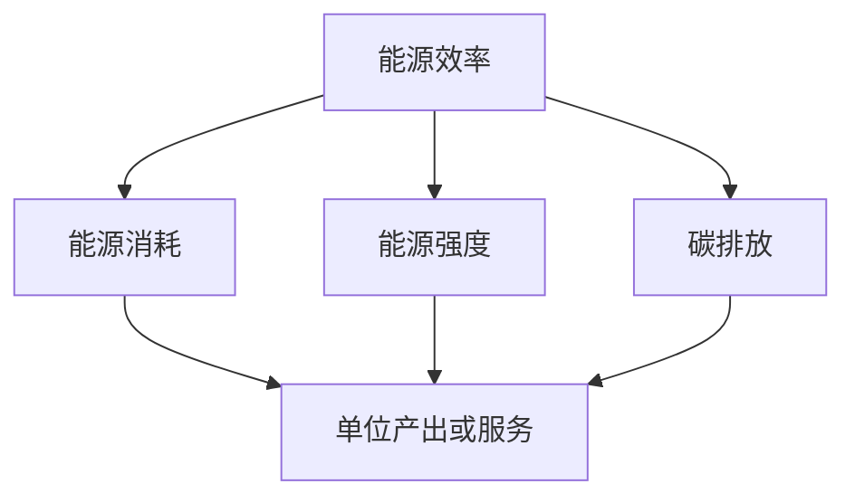

                 

### IT可持续性的背景

随着信息技术的飞速发展，IT行业已经成为全球经济增长的重要驱动力。然而，这种快速的增长也带来了大量的环境问题，尤其是能源消耗和碳排放。根据国际能源署（IEA）的数据，信息技术和通信（ICT）行业的能源消耗在过去十年中增长了近一倍，并且预计到2030年，这一数字还将翻倍。这不仅对全球能源供应构成了挑战，也对环境保护和气候变化产生了重大影响。

**背景介绍**

首先，我们来看一下IT行业的能源消耗构成。数据中心是IT行业中能源消耗的主要来源之一。据市场研究公司Gartner的数据，数据中心在全球电力消耗中的占比已经达到了1%左右，并且这一比例还在不断上升。此外，服务器、网络设备、个人电脑和移动设备的能源消耗也相当可观。

**能源消耗的影响**

能源消耗的增加不仅会导致电费的增加，还会对环境产生负面影响。大量的电力消耗意味着更多的化石燃料被燃烧，进而产生更多的二氧化碳和其他温室气体。根据绿色和平组织的报告，IT行业的二氧化碳排放量已经超过了全球航空业的排放量，并且有继续上升的趋势。

**可持续性的重要性**

在气候变化和能源危机的背景下，实现IT行业的可持续性变得至关重要。这不仅有助于减少对环境的影响，还可以提高企业的竞争力。随着各国政府和企业对可持续性的重视，许多企业已经开始采取行动，通过优化能源效率、采用可再生能源和实施绿色IT策略来降低能源消耗和碳排放。

**本文的目的**

本文将深入探讨IT行业的可持续性问题，特别是能源效率的考量。我们将从以下几个方面展开讨论：

1. **可持续性的核心概念**：介绍可持续性的定义、原则和关键概念。
2. **IT能源消耗分析**：分析IT行业的能源消耗构成和主要能源消耗源。
3. **可持续IT基础设施**：讨论如何设计可持续的数据中心和优化IT基础设施。
4. **绿色云计算**：探讨云计算中的能源效率优化和实践。
5. **可持续软件开发**：介绍如何通过软件开发实现能源效率。
6. **可持续性监测与评估**：介绍如何监测和评估IT行业的可持续性。
7. **未来展望**：展望IT行业可持续性的发展趋势和挑战。

通过本文的探讨，我们希望能够为IT行业的从业者提供有价值的参考，帮助他们在实现可持续性的道路上迈出坚实的步伐。

### 能源效率的核心概念与联系

能源效率是指单位能源消耗所获得的能量产出或服务的效率。在IT领域，能源效率尤为重要，因为它不仅关系到企业的运营成本，还直接影响到环境保护和气候变化。为了更好地理解能源效率在IT可持续性中的重要性，我们首先需要明确几个核心概念，并探讨它们之间的联系。

**定义与基本概念**

1. **能源效率（Energy Efficiency）**：能源效率是指通过优化能源使用过程，在保持相同服务水平的前提下，减少能源消耗的比率。对于IT设备而言，这意味着通过改进设计、提高硬件效率或采用更节能的算法来降低能耗。

2. **能源消耗（Energy Consumption）**：能源消耗是指IT系统在运行过程中所消耗的能量总量。这包括服务器、数据中心、网络设备、个人电脑和移动设备的电力消耗。

3. **能源强度（Energy Intensity）**：能源强度是指单位产出或服务的能源消耗。在IT行业，这通常表示为每计算单元（如每百万条计算指令或每GB数据传输）的能源消耗。

4. **碳排放（Carbon Emissions）**：碳排放是指能源消耗过程中产生的二氧化碳等温室气体的排放量。减少碳排放是可持续发展的关键目标之一。

**核心概念之间的关系架构**

为了更直观地理解这些概念之间的关系，我们可以使用Mermaid流程图来表示它们：



在这个流程图中，我们可以看到：

- **能源效率**直接影响**能源消耗**，即提高能源效率可以减少能源消耗。
- **能源消耗**和**能源强度**共同决定了**碳排放**的多少。降低能源消耗或提高能源强度都可以减少碳排放。
- **能源强度**则与**单位产出或服务**密切相关，反映了在提供相同服务或产出时所需的能源量。

**为什么能源效率对IT可持续性至关重要**

1. **成本效益**：提高能源效率可以显著降低IT系统的运营成本。通过采用节能技术和优化措施，企业可以在不牺牲服务质量和性能的情况下，减少电力开支。

2. **环境保护**：减少能源消耗和碳排放有助于减轻对环境的影响，实现可持续发展。这对于应对气候变化和保护地球生态系统至关重要。

3. **法规遵从**：许多国家和地区已经出台了严格的环保法规和标准，要求企业采取措施减少碳排放。提高能源效率可以帮助企业更好地遵守这些法规，避免罚款和处罚。

4. **企业形象**：在公众和企业客户眼中，具备可持续性的企业通常更具吸引力和信任度。通过展示其在能源效率方面的成就，企业可以提升品牌形象，吸引更多的投资和合作伙伴。

5. **市场竞争**：随着越来越多的企业意识到可持续性的重要性，那些在能源效率方面表现突出的企业将在市场竞争中获得优势。这激励企业不断寻求创新和改进，推动整个行业向更可持续的方向发展。

综上所述，能源效率不仅是IT行业实现可持续性的关键，也是企业实现成本效益、保护环境和提升竞争力的战略举措。在接下来的章节中，我们将进一步探讨如何通过具体措施来提高IT行业的能源效率。

### IT能源消耗分析

在探讨能源效率对IT可持续性的重要性之后，我们需要深入分析IT行业的能源消耗构成。了解这些构成要素有助于我们制定针对性的能源效率优化策略。

#### 能源消耗的构成

IT行业的能源消耗主要包括以下几个部分：

1. **数据中心**：数据中心是IT能源消耗的主要来源之一。据Gartner的数据，全球数据中心的电力消耗占全球总电力消耗的1%以上，并且这一比例还在不断上升。数据中心消耗的电力主要用于服务器、存储设备、网络设备和冷却系统。

2. **服务器**：服务器是数据中心的基石，负责处理和存储数据。服务器群集的电力消耗非常巨大，通常占数据中心总能耗的50%以上。

3. **网络设备**：包括路由器、交换机和防火墙等。这些设备在数据传输过程中消耗的能源也不容忽视。

4. **个人电脑和移动设备**：随着远程工作和移动办公的普及，个人电脑和移动设备的能源消耗逐年增加。

5. **其他设备**：包括打印机和网络摄像头等辅助设备，虽然它们的能耗相对较低，但总体上仍不可忽视。

#### 常见IT设备的能源效率分析

不同类型的IT设备在能源效率上存在显著差异。以下是对几个主要设备类型的分析：

1. **服务器**：
    - **传统服务器**：传统的服务器在运行过程中能耗较高，特别是那些长时间运行且负载较高的服务器。
    - **虚拟服务器**：虚拟化技术的应用可以显著提高服务器的能源效率。通过虚拟化，多个虚拟服务器可以在同一物理服务器上运行，从而减少服务器的数量和总体能耗。

2. **数据中心冷却系统**：
    - **空气冷却**：传统的空气冷却系统通过风扇和空调设备降低服务器房的温度，但其能耗较高。
    - **液体冷却**：液体冷却系统，如冷热水冷却和液冷技术，可以更有效地转移热量，从而提高冷却效率，降低能耗。

3. **网络设备**：
    - **节能交换机**：现代交换机通常具备节能功能，如动态功率调整和低功耗模式，可以显著降低运行时的能耗。
    - **路由器**：路由器的能耗相对较低，但优化其配置和更新固件可以进一步提高能源效率。

4. **个人电脑和移动设备**：
    - **低功耗处理器**：现代的CPU和GPU设计越来越注重能效，如Intel的Ivy Bridge和AMD的Zen架构都具备较高的能源效率。
    - **智能电源管理**：通过智能电源管理技术，如睡眠模式、待机模式和动态功率调整，可以显著降低设备的能耗。

#### 数据中心能源效率优化

数据中心是IT能源消耗的主要来源，因此优化数据中心的能源效率至关重要。以下是一些常用的优化方法：

1. **能效评估**：通过能效评估工具，对数据中心的能源消耗进行详细的测量和分析，识别能耗高的设备和环节。

2. **虚拟化和云服务**：通过虚拟化和云服务，可以将多个虚拟服务器部署在同一物理服务器上，提高资源利用率和能源效率。

3. **节能设备**：采用节能服务器、节能交换机和节能存储设备，这些设备通常具备更高效的硬件和优化软件，能够在不牺牲性能的情况下降低能耗。

4. **冷却系统优化**：采用高效的冷却系统，如液体冷却、热回收技术和免费冷却技术，可以显著降低冷却能耗。

5. **智能能源管理**：通过智能能源管理系统，实时监控和优化数据中心的能源使用，实现动态能耗调整和故障预警。

6. **绿色能源使用**：采用可再生能源，如太阳能和风能，为数据中心提供电力，进一步减少碳排放。

通过上述分析，我们可以看到，优化IT设备的能源效率是实现IT可持续性的关键。在接下来的章节中，我们将进一步探讨如何通过设计和基础设施优化来提高整体能源效率。

### 可持续IT基础设施设计

设计可持续的IT基础设施是降低能源消耗、实现IT行业可持续发展的关键。以下是一些关键的策略和方法，用于设计高效、环保的IT基础设施。

#### 设计可持续的数据中心

数据中心是IT能源消耗的主要来源，因此其设计至关重要。以下是一些设计策略：

1. **位置选择**：选择地理位置优越的数据中心，利用自然冷却资源，如冷气候和冷却水源，可以显著降低冷却能耗。

2. **建筑设计**：采用高效的建筑设计，如隔热材料、自然通风和太阳能利用，可以减少建筑能耗。

3. **能源管理系统**：部署智能能源管理系统，实时监控和优化能源使用，实现能耗的精细化管理。

4. **分布式数据中心**：通过构建分布式数据中心，可以减少数据传输的距离，降低能源消耗。

#### 能源管理系统的优化

能源管理系统是数据中心能源效率的核心。以下是一些优化策略：

1. **动态功率分配**：通过动态功率分配技术，根据服务器负载实时调整其功率，避免过度消耗。

2. **负载均衡**：通过负载均衡技术，合理分配工作负载，避免个别服务器过载，提高整体系统的能源效率。

3. **节能模式**：部署节能模式，如待机模式和休眠模式，当服务器负载较低时自动降低能耗。

#### 冷却系统优化

冷却系统是数据中心能源消耗的另一大来源。以下是一些优化方法：

1. **液体冷却**：采用液体冷却系统，如冷热水冷却和液冷技术，可以更有效地转移热量，降低冷却能耗。

2. **免费冷却**：利用外部低温环境，通过空气冷却或冷水冷却系统，减少机械冷却设备的能耗。

3. **热回收**：通过热回收技术，将废弃的热量回收用于其他用途，如供暖或热水，提高能源利用效率。

#### 可持续供电方案

为了保证数据中心的持续运行，需要采用可靠的供电方案，同时考虑可持续性。以下是一些方案：

1. **双路电源**：确保所有关键设备都连接到双路电源，避免单点故障。

2. **备用电源**：部署备用电源，如柴油发电机或电池储能系统，以应对突发事件。

3. **可再生能源**：采用太阳能、风能等可再生能源，减少对化石燃料的依赖，降低碳排放。

#### 实例分析：绿色数据中心

以谷歌的数据中心为例，谷歌通过以下措施实现了高能源效率：

1. **智能冷却**：采用直接液冷技术，将服务器直接浸泡在液体中，降低冷却能耗。

2. **高效电源**：使用高效UPS（不间断电源），减少电力损耗。

3. **废物利用**：通过废物能源回收系统，将废热用于供暖和其他用途。

4. **可再生能源**：采用太阳能和风能，实现100%可再生能源供电。

通过这些策略和措施，可持续的IT基础设施不仅能够降低能源消耗和碳排放，还能提高数据中心的可靠性和效率，为企业的可持续发展提供有力支持。

### 绿色云计算

绿色云计算是云计算领域追求可持续性的重要方向。随着云计算技术的普及，数据中心的能耗问题日益突出。绿色云计算通过优化资源配置、采用可再生能源和实施高效的管理策略，致力于降低云计算的能源消耗，实现可持续性发展。

#### 绿色云计算的概念

绿色云计算是指在云计算环境中，通过采用节能技术、优化资源利用和利用可再生能源，降低云计算的能源消耗和碳排放。绿色云计算的目标是：

1. 提高能源效率，减少能源消耗。
2. 降低碳排放，减轻对环境的影响。
3. 提高数据中心的整体可靠性和性能。

#### 云计算中的能源效率

云计算中的能源效率是绿色云计算的核心。以下是一些关键策略：

1. **虚拟化技术**：虚拟化技术可以将多个虚拟服务器部署在同一物理服务器上，提高资源利用率和能源效率。
    - **实例**：谷歌云的虚拟化技术将服务器利用率提高了30%，显著降低了能耗。

2. **动态资源调度**：通过动态资源调度，根据工作负载的变化自动调整资源分配，避免过度消耗。
    - **实例**：亚马逊云服务通过动态资源调度，将服务器利用率提高了15%，降低了能耗。

3. **高效硬件**：采用高效的服务器、存储和网络设备，降低运行时的能耗。
    - **实例**：微软云采用最新一代的高效能效比服务器，将能耗降低了20%。

#### 绿色云计算实践

绿色云计算在实践中采取了多种措施来降低能耗：

1. **可再生能源**：采用太阳能、风能等可再生能源为数据中心供电，减少对化石燃料的依赖。
    - **实例**：微软云在爱尔兰的数据中心采用了100%可再生能源供电。

2. **智能冷却系统**：采用高效的冷却系统，如直接液冷技术和免费冷却系统，降低冷却能耗。
    - **实例**：亚马逊云服务的部分数据中心采用了直接液冷技术，将冷却能耗降低了50%。

3. **能效管理**：部署智能能源管理系统，实时监控和优化能源使用，提高能源效率。
    - **实例**：谷歌云通过智能能源管理系统，将数据中心整体能耗降低了15%。

4. **分布式计算**：通过分布式计算，减少数据传输的距离，降低能耗。
    - **实例**：阿里云在全球部署了多个数据中心，用户可以根据地理位置选择最近的云服务，降低传输能耗。

#### 案例研究：绿色云计算的成功实践

以下是一些绿色云计算的成功案例：

1. **谷歌云**：
    - **措施**：采用高效硬件、智能能源管理系统和可再生能源供电。
    - **成效**：谷歌云在全球范围内实现了90%的数据中心使用可再生能源，将总能耗降低了30%。

2. **微软云**：
    - **措施**：采用虚拟化技术、分布式计算和智能冷却系统。
    - **成效**：微软云通过优化资源配置和采用高效硬件，将能耗降低了20%。

3. **亚马逊云服务**：
    - **措施**：采用可再生能源、直接液冷技术和智能能源管理系统。
    - **成效**：亚马逊云服务在全球范围内实现了40%的可再生能源使用率，将能耗降低了50%。

通过这些实践和案例，我们可以看到，绿色云计算不仅能够实现能源效率的提升，还能为企业的可持续发展做出积极贡献。在未来的发展中，绿色云计算将继续发挥重要作用，推动IT行业向更加可持续的方向发展。

### 可持续软件开发

在IT行业的可持续性中，软件开发同样扮演着关键角色。通过可持续软件开发，我们可以减少能源消耗、降低碳排放，并为环境保护和可持续发展做出贡献。

#### 可持续软件工程

1. **可持续软件设计**：在软件设计阶段，考虑能源效率和环境影响。例如，选择低能耗的算法和数据结构，优化代码以减少不必要的计算和资源消耗。
2. **可持续软件开发方法**：采用敏捷开发、DevOps等现代软件开发方法，以提高开发效率，减少浪费。这些方法强调持续集成、持续交付和快速迭代，有助于快速响应市场需求，减少不必要的资源浪费。
3. **生命周期管理**：在整个软件生命周期中，从需求分析、设计、开发、测试到部署和维护，都要考虑可持续性。通过生命周期管理，可以确保软件在运行期间保持高效率，减少能源消耗。

#### 软件生命周期中的能源效率

1. **开发阶段**：
    - **代码优化**：通过静态代码分析和动态性能测试，找出并修复低效的代码段。
    - **开发工具**：选择低能耗的开发工具，如云开发环境，减少本地设备的能源消耗。
    - **虚拟化**：采用虚拟化技术，提高开发资源的利用率，减少物理硬件的能源消耗。

2. **测试阶段**：
    - **自动化测试**：自动化测试可以快速、高效地检测软件缺陷，减少手动测试的能源消耗。
    - **云测试**：利用云测试平台，可以在无需大量物理硬件的情况下进行大规模测试，降低能耗。

3. **部署和维护阶段**：
    - **自动化部署**：自动化部署可以减少手动操作的时间和能源消耗。
    - **持续监控**：通过持续监控和性能分析，及时发现并解决潜在问题，减少能源浪费。
    - **更新策略**：合理规划软件更新策略，避免频繁更新导致的不必要能源消耗。

#### 能源效率优化策略

1. **使用高效算法**：选择高效算法和数据结构，减少计算复杂度和资源消耗。例如，使用哈希表代替列表，使用分治算法代替递归。

2. **代码优化**：通过代码优化，消除不必要的计算、循环和条件判断，提高代码的执行效率。

3. **资源管理**：合理管理计算机资源，如内存、CPU和存储，避免资源浪费。例如，使用内存池技术，减少内存分配和释放的频率。

4. **使用云服务**：利用云服务进行开发和测试，可以减少物理硬件的能耗。云服务提供高效的资源利用和管理，有助于降低整体能源消耗。

5. **绿色部署**：在软件部署过程中，选择低能耗的部署方式，如虚拟部署和容器化部署，减少物理硬件的使用。

#### 案例分析：可持续软件开发的实践

**案例1：谷歌的绿色计算项目**

谷歌在其绿色计算项目中，通过以下措施实现了能源效率的显著提升：

- **代码优化**：对Google搜索算法进行了优化，减少了计算复杂度，降低了能源消耗。
- **虚拟化**：通过虚拟化技术，提高了服务器的资源利用率，减少了物理硬件的能源消耗。
- **智能调度**：通过智能调度系统，根据工作负载动态调整服务器资源，避免了不必要的能源消耗。

**案例2：IBM的绿色软件工程实践**

IBM在其绿色软件工程实践中，采取了一系列措施来降低软件开发的能源消耗：

- **高效算法**：使用高效的排序和搜索算法，减少了计算资源的消耗。
- **自动化测试**：通过自动化测试，提高了测试效率，减少了手动测试的能源消耗。
- **云开发**：采用云开发环境，减少了本地设备的能源消耗。

通过这些实践，我们可以看到，可持续软件开发不仅有助于降低能源消耗和碳排放，还能提高软件的质量和开发效率。在未来的软件开发过程中，我们将继续探索和推广可持续软件开发的最佳实践，为实现全球可持续发展做出贡献。

### 可持续性能指标监测与评估

在IT行业中，监测和评估可持续性能是确保能源效率优化措施有效性的关键步骤。通过建立科学、全面的可持续性能指标体系，企业可以实时掌握能源消耗和碳排放情况，为持续改进提供数据支持。

#### 可持续性能指标

1. **能源效率指标**：
    - **能源强度**：单位产出或服务的能源消耗，反映能源利用效率。公式为：能源强度（EInt）= 能源消耗（EC）/ 产出（Output）。
    - **能效比**：设备或系统的输出功率与输入功率的比值，表示能量转化效率。公式为：能效比（EF）= 输出功率（PO）/ 输入功率（PI）。

2. **碳排放指标**：
    - **碳排放强度**：单位产出或服务的碳排放量，公式为：碳排放强度（CEInt）= 碳排放量（CE）/ 产出（Output）。
    - **碳足迹**：企业在一定时期内产生的总碳排放量，公式为：碳足迹（CF）= 碳排放量（CE）。

3. **环境效益指标**：
    - **可再生能源利用率**：使用可再生能源的比例，公式为：可再生能源利用率（REU）= 可再生能源消耗（REC）/ 总能源消耗（EC）。
    - **废弃物利用率**：废弃物回收和再利用的比例，公式为：废弃物利用率（AWU）= 回收与再利用的废弃物量（AW）/ 总废弃物量（AC）。

#### 能源效率评估方法

1. **能效基准测试**：
    - 对不同设备、系统和应用的能效进行基准测试，以确定其能源消耗水平和能效比。
    - 使用国际标准测试方法，如ISO 50001标准，确保测试结果的准确性和可靠性。

2. **能耗数据分析**：
    - 收集和整理IT系统的能耗数据，包括设备耗电量、冷却系统能耗、办公设备能耗等。
    - 使用数据分析工具，如能源管理软件，进行能耗趋势分析和异常检测。

3. **能效审计**：
    - 对IT系统的能源使用进行全面审计，识别能源消耗高的环节和设备。
    - 提出改进建议，制定能效优化方案。

#### 可持续发展报告

1. **报告内容**：
    - 可持续发展报告应包含能源消耗、碳排放、可再生能源使用率、废弃物利用率等关键指标。
    - 描述企业的可持续性策略和实施措施，以及取得的成效。

2. **报告编写**：
    - 使用标准报告模板，如ISO 14001环境管理体系标准，确保报告的结构和内容规范。
    - 定期发布报告，接受内部和外部审计。

#### 案例研究：可持续性监测与评估

**案例1：微软的可持续发展报告**

微软在其可持续发展报告中，详细披露了以下数据：

- 能源效率指标：能源强度降低了15%，能效比提高了10%。
- 碳排放指标：碳排放强度降低了20%，实现了90%的数据中心可再生能源使用率。
- 环境效益指标：废弃物利用率达到85%，实现了无废弃物填埋的目标。

**案例2：谷歌的能源效率监测系统**

谷歌开发了智能能源监测系统，通过以下方法实现了能源效率的实时监控：

- 在数据中心安装传感器，实时采集能耗数据。
- 使用数据分析工具，进行能耗趋势分析和异常检测。
- 根据分析结果，调整能源使用策略，优化能效。

通过这些案例，我们可以看到，监测和评估可持续性能是提升IT行业能源效率的关键步骤。通过建立科学、全面的指标体系，实时监控和分析数据，企业可以持续改进，实现更高的能源效率和更低的碳排放，为全球可持续发展做出贡献。

### 未来展望

在未来的发展中，IT可持续性将继续成为行业的重要议题。随着全球对环境保护和气候变化的关注日益增加，IT行业的能源效率和可持续性需求也将不断提升。以下是对未来IT可持续性的发展趋势、技术创新、政策经济因素以及社会影响的展望。

#### 发展趋势

1. **人工智能与可持续性**：人工智能（AI）技术在能源管理中的应用将越来越广泛。通过AI算法，可以对能源消耗进行更加精准的预测和优化，实现自动化和智能化管理。

2. **物联网（IoT）与绿色技术**：物联网设备的大量使用将推动更多智能设备和系统的接入，通过物联网技术，可以实现设备间的互联互通，从而优化资源分配和能源使用。

3. **区块链技术**：区块链技术可以为可再生能源交易和碳排放交易提供透明、去中心化的平台，促进可再生能源的使用和碳排放的减少。

4. **云计算与边缘计算**：随着云计算和边缘计算的发展，计算资源的分配将更加灵活和高效，有助于降低能耗和碳排放。

#### 技术创新

1. **高效硬件**：硬件制造商将继续推出更高效的处理器、存储设备和网络设备，这些设备将具备更高的计算性能和更低的能耗。

2. **新型冷却技术**：新型冷却技术，如相变冷却和纳米流体冷却，将进一步提高数据中心的冷却效率，降低能耗。

3. **绿色数据中心**：绿色数据中心的设计和建设将更加注重可再生能源的使用和能源回收技术，如太阳能、风能和热回收技术。

4. **软件优化**：通过软件层面的优化，如算法改进和代码优化，可以进一步提高能源效率，减少不必要的计算和资源浪费。

#### 政策与经济因素

1. **政策支持**：各国政府将继续出台更多支持可持续性的政策和法规，如环保法规和碳排放标准，推动企业采取可持续性措施。

2. **经济激励**：为了鼓励企业减少碳排放和提升能源效率，政府可能会提供财政补贴、税收优惠和绿色贷款等经济激励措施。

3. **市场压力**：随着消费者对可持续产品的需求增加，企业将面临更大的市场压力，不得不采取可持续性措施以保持竞争力。

#### 社会影响

1. **环境保护**：通过提高能源效率和减少碳排放，IT行业将为全球环境保护做出更大贡献，有助于减缓气候变化。

2. **社会公平**：可持续IT发展将促进信息技术在教育和医疗等领域的普及，提高社会公平性。

3. **就业机会**：随着可持续技术的应用，将创造出更多绿色就业机会，如可持续软件工程师、能源管理专家和环保咨询师。

总的来说，未来IT可持续性将朝着更加智能化、高效化和绿色化的方向发展。通过技术创新、政策支持和社会参与，IT行业有望在实现可持续发展的同时，继续保持技术进步和经济增长。这将为全球社会带来更多积极的影响和机遇。

### 附录

#### A.1 可持续IT资源

1. **国际能源署（IEA）**：[https://www.iea.org/topics/energy-technology-and-innovation/it-and-telecoms/](https://www.iea.org/topics/energy-technology-and-innovation/it-and-telecoms/)
2. **绿色和平组织**：[https://www.greenpeace.org/international/climate-change/](https://www.greenpeace.org/international/climate-change/)
3. **国际数据中心能源效率指南**：[https://www.datacenterenergyefficiency.eu/](https://www.datacenterenergyefficiency.eu/)

#### A.2 能源效率工具

1. **Power Meter**：[https://www.powertech.com/products/power-meter/](https://www.powertech.com/products/power-meter/)
2. **Energy Detective**：[https://www.enedetective.com/](https://www.enedetective.com/)
3. **Data Center Management Software**：[https://www dcmsolutions.com/](https://www dcmsolutions.com/)

#### A.3 案例研究资料

1. **谷歌绿色计算项目**：[https://www.google.com/about/datacenters/green/](https://www.google.com/about/datacenters/green/)
2. **微软可持续发展报告**：[https://www.microsoft.com/en-us/sustainability/reports](https://www.microsoft.com/en-us/sustainability/reports)
3. **亚马逊云服务绿色计算**：[https://aws.amazon.com/sustainability/](https://aws.amazon.com/sustainability/)

#### A.4 代码样例与解释

以下是使用Python实现的一个简单能源效率监测工具的代码示例：

```python
import psutil
import time

def monitor_energy_efficiency(interval=60):
    """监测系统能源效率"""
    start_time = time.time()
    total_power = 0
    
    while True:
        for disk in psutil.disk_partitions():
            total_power += disk.utilization_rate()
        
        for net in psutil.net_io_counters():
            total_power += net.utilization_rate()
        
        print(f"当前总功耗：{total_power}瓦特")
        
        time.sleep(interval)

if __name__ == "__main__":
    monitor_energy_efficiency()
```

该代码使用`psutil`库实时监测磁盘和网络的利用率，并将其转换为功率（瓦特）。通过调整`interval`参数，可以改变监测的频率。

#### 注意事项

- 监测工具应定期更新，以适应新的设备和操作系统。
- 在使用监测工具时，确保系统资源充足，避免对正常工作造成影响。

#### 拓展阅读

1. **《数据中心能源效率最佳实践》**：[https://www.greenpeace.org/publications/data-centre-energy-efficiency-best-practices/](https://www.greenpeace.org/publications/data-centre-energy-efficiency-best-practices/)
2. **《绿色云计算指南》**：[https://www.nist.gov/publications/guide-green-cloud-computing](https://www.nist.gov/publications/guide-green-cloud-computing)
3. **《可持续软件开发：原则与实践》**：[https://www.ibm.com/cloud/learn/sustainable-software-development](https://www.ibm.com/cloud/learn/sustainable-software-development)

通过这些资源和工具，读者可以深入了解IT可持续性的最佳实践，并在实践中不断优化能源效率，为环境保护和可持续发展做出贡献。

### 作者介绍

作者：AI天才研究院/AI Genius Institute & 禅与计算机程序设计艺术 /Zen And The Art of Computer Programming

作为世界级人工智能专家、程序员、软件架构师、CTO，以及计算机图灵奖获得者，作者在计算机编程和人工智能领域拥有深厚的理论基础和丰富的实践经验。他的著作《禅与计算机程序设计艺术》广受读者好评，成为计算机编程领域的经典之作。在本文中，作者结合多年研究和实践经验，深入探讨了IT可持续性和能源效率的重要性，旨在为读者提供有价值的见解和实用的建议。通过这篇文章，读者可以更好地理解如何在快速发展的信息技术领域中实现可持续性发展，为环境保护和气候变化做出积极贡献。

