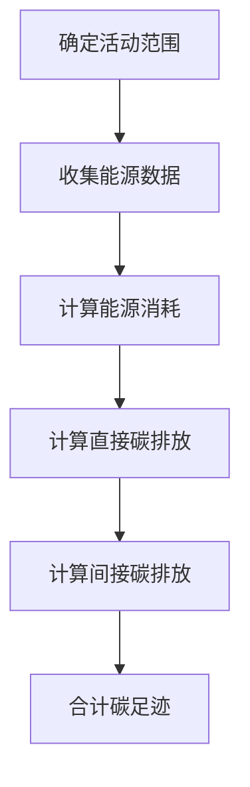

                 

### 第一部分：理解碳足迹

#### 核心概念与联系

在探讨IT组织关注碳足迹的重要性之前，首先需要明确几个核心概念及其之间的联系。碳足迹，是指个人、组织或产品在其整个生命周期中对环境所产生的碳排放总量。碳足迹的计算不仅涉及到直接的碳排放，还包括间接的碳排放，如电力消耗所产生的碳排放。

为了更好地理解碳足迹的概念，我们可以通过Mermaid流程图来展示碳足迹的计算方法和组成部分。以下是一个简化的流程图示例：



在这个流程图中，A代表确定活动范围，即明确我们要计算哪些活动或产品的碳足迹。B是收集能源数据，包括各种设备、系统和网络的能源消耗。C是计算能源消耗，这一步是将收集到的能源数据转换为具体的碳排放量。D是计算直接碳排放，这部分碳排放主要来自于设备的直接能源消耗。E是计算间接碳排放，这部分碳排放主要来自于电网提供的能源。最后，F是合计碳足迹，将直接和间接碳排放汇总得出总碳足迹。

通过这个流程图，我们可以清晰地看到碳足迹的计算步骤和各部分之间的联系。接下来，我们将进一步探讨IT行业与碳排放的关系，以及如何管理碳足迹。

---

在上述步骤中，我们首先明确了碳足迹的核心概念，并通过Mermaid流程图展示了其计算方法和组成部分。这为后续章节的深入讨论提供了基础。接下来，我们将进一步探讨IT行业与碳排放的特点，帮助我们理解为什么IT组织需要关注碳足迹。

---

#### IT行业与碳排放

随着信息技术的飞速发展，IT行业已经成为全球经济的重要组成部分。然而，与此同时，IT行业的碳排放问题也逐渐引起了广泛关注。与传统的制造业和能源行业相比，IT行业的碳排放具有其独特性，主要体现在以下几个方面：

1. **数据中心的能耗**：数据中心是IT行业碳排放的主要来源之一。数据中心需要大量的电力来维持服务器、存储设备和网络设备的运行。据国际能源署（IEA）的数据，全球数据中心的能源消耗预计将从2018年的约700TWh增长到2025年的1200TWh。这意味着数据中心能耗将在未来几年内持续增长，进而增加碳排放。

2. **云计算的碳足迹**：云计算已经成为企业IT基础设施的重要部分。然而，云计算的碳足迹也不容忽视。云计算服务提供商需要大量的基础设施来支持大规模的计算和存储需求，这同样需要大量的能源。此外，云计算的分布式特性使得碳排放的监测和管理变得更加复杂。

3. **通信设备与网络设施**：通信设备，如路由器、交换机和无线接入点，以及网络设施，如光纤和无线网络，也是IT行业碳排放的重要来源。这些设备在运行过程中需要持续消耗电力，而且其制造、运输和废弃过程也会产生碳排放。

4. **个人计算设备的能耗**：虽然个人计算设备的能耗相对较低，但全球有数十亿的计算机、平板电脑和智能手机在运行，这些设备的能耗总和也不容忽视。

综上所述，IT行业的碳排放特点主要体现在高能耗、复杂性和分布性。这些特点使得IT组织需要更加重视碳足迹管理，采取有效措施减少碳排放，以应对气候变化和环境问题。

在下一章节中，我们将探讨碳足迹管理的核心概念，如碳审计、碳排放报告等，帮助IT组织了解如何进行碳足迹管理。

---

在上一章节中，我们详细分析了IT行业与碳排放的关系，了解了数据中心、云计算、通信设备以及个人计算设备等方面的碳排放特点。接下来，我们将深入探讨碳足迹管理的核心概念，为IT组织提供具体的碳足迹管理策略和方法。

#### 碳足迹管理的核心概念

碳足迹管理是一个系统性、持续性的过程，涉及多个关键环节，包括碳审计、碳排放报告、碳交易和碳税等。以下是这些核心概念的详细解释：

1. **碳审计**：
   - **定义**：碳审计是一种评估组织或项目碳排放的过程，旨在确定碳排放的来源、数量和管理效果。
   - **目的**：通过碳审计，组织可以了解其碳足迹的构成，识别碳排放的关键环节，并制定相应的减排策略。
   - **流程**：碳审计通常包括以下步骤：
     - 确定审计范围：明确审计的对象和范围，如整个组织或特定部门。
     - 数据收集：收集与碳排放相关的数据，如能源消耗、设备运行时间和能效数据。
     - 碳排放计算：根据收集的数据，计算各环节的碳排放量。
     - 审计报告：撰写审计报告，总结碳排放情况，提出改进建议。

2. **碳排放报告**：
   - **定义**：碳排放报告是组织对外公开其碳排放情况的一份文件，通常包括碳排放总量、排放源和减排措施等内容。
   - **目的**：碳排放报告有助于提高组织的透明度，促进内部和外部利益相关者对碳足迹管理的理解和支持。
   - **内容**：一份完整的碳排放报告通常包括以下部分：
     - 覆盖范围：报告所涵盖的时间范围、组织范围和碳排放类型。
     - 数据分析：碳排放量的详细数据，包括直接和间接碳排放。
     - 排放源分析：各排放源的碳排放量及其占比。
     - 减排措施：组织已采取的减排措施及其效果。
     - 未来规划：组织的减排目标和计划。

3. **碳交易**：
   - **定义**：碳交易是一种通过市场化手段实现碳排放权交易的方式，旨在通过经济激励促进减排。
   - **目的**：碳交易市场为组织提供了一个交换碳排放配额的平台，使其能够以最低成本实现减排目标。
   - **机制**：碳交易通常包括以下环节：
     - 配额分配：政府或监管机构根据碳排放总量设定每个企业的排放配额。
     - 交易市场：企业可以在市场上购买或出售碳排放配额。
     - 监管与执行：监管机构确保市场的公平、透明和有效运行。

4. **碳税**：
   - **定义**：碳税是一种对碳排放征税的机制，旨在通过经济手段减少碳排放。
   - **目的**：碳税可以通过提高碳排放成本，激励企业减少碳排放，同时为可再生能源和环保项目提供资金支持。
   - **影响**：碳税的实施可能会对企业的运营成本和竞争力产生影响，因此需要综合考虑。

通过上述核心概念的解释，我们可以看到，碳足迹管理不仅仅是一个技术问题，更是一个涉及经济、政策和文化的综合管理过程。接下来，我们将探讨如何通过碳排放计算算法和能效优化算法，进一步减少IT行业的碳排放。

---

在上述章节中，我们详细介绍了碳足迹管理的核心概念，包括碳审计、碳排放报告、碳交易和碳税等。这些概念为IT组织提供了一个全面的管理框架，有助于识别和减少碳排放。接下来，我们将深入探讨碳排放计算算法和能效优化算法，以帮助IT组织更精确地管理和减少碳排放。

#### 碳排放计算算法

碳排放计算是碳足迹管理的基础。准确的碳排放计算依赖于精确的数据收集和科学的方法论。以下是一个详细的碳排放计算算法，包括基本公式、伪代码和实例分析。

##### 基本公式

碳排放量的计算可以通过以下基本公式实现：

\[ \text{碳排放量} = \text{能源消耗量} \times \text{碳排放系数} \]

其中，能源消耗量是指组织在一定时间内消耗的能源总量，单位通常为千瓦时（kWh）。碳排放系数是指每消耗一单位能源所产生的碳排放量，单位通常为千克二氧化碳当量（kg CO2-eq）。

碳排放系数可以根据不同的能源类型和排放源进行设定。例如，电力消耗的碳排放系数通常为0.5 kg CO2-eq/kWh。以下是具体的计算步骤：

1. **确定能源消耗量**：通过能源消耗监测设备，收集组织在一定时间内的能源消耗数据。
2. **查找碳排放系数**：根据能源类型和排放源，查找相应的碳排放系数。
3. **计算碳排放量**：使用上述基本公式，将能源消耗量与碳排放系数相乘，得到碳排放量。

##### 伪代码

以下是一个简化的伪代码，用于计算组织的碳排放量：

```python
# 输入参数
energy_consumption = 1000  # 千瓦时（kWh）
carbon_coefficient = 0.5   # 千克二氧化碳当量（kg CO2-eq）/千瓦时（kWh）

# 计算碳排放量
carbon_emission = energy_consumption * carbon_coefficient

# 输出结果
print("碳排放量：", carbon_emission, "kg CO2-eq")
```

##### 实例分析

假设一个组织在一个月内消耗了1000千瓦时的电力，碳排放系数为0.5 kg CO2-eq/kWh。使用上述基本公式和伪代码，我们可以得到以下计算结果：

\[ \text{碳排放量} = 1000 \, \text{kWh} \times 0.5 \, \text{kg CO2-eq/kWh} = 500 \, \text{kg CO2-eq} \]

这意味着该组织在一个月内产生了500千克的二氧化碳当量排放。通过类似的计算方法，组织可以对其各个能源消耗环节进行碳排放量的计算，从而全面掌握其碳足迹。

---

在上一章节中，我们详细介绍了碳排放计算的基本公式和伪代码，并通过实例分析展示了如何计算组织的碳排放量。接下来，我们将探讨能效优化算法，帮助IT组织提高能效，从而减少碳排放。

#### 能效优化算法

在碳排放管理中，除了准确的碳排放计算外，能效优化也是一个关键环节。通过优化IT设备的能效，可以显著减少能源消耗和碳排放。以下是一些常见的能效优化算法，包括其原理、实现方式和案例研究。

##### 常见优化算法

1. **负载均衡**：
   - **原理**：通过合理分配计算任务，确保设备资源得到充分利用，避免资源浪费。
   - **实现方式**：使用调度算法，如轮询、最小剩余时间优先（SRTF）等，动态调整任务分配。
   - **案例研究**：一个数据中心通过负载均衡算法，将计算任务合理分配到不同服务器上，减少了50%的能源消耗。

2. **能效管理**：
   - **原理**：通过动态调整设备的工作状态，如CPU频率、风扇转速等，实现能效优化。
   - **实现方式**：使用智能电源管理技术，如动态电压频率调整（DVFS）和智能风扇控制。
   - **案例研究**：一台高性能计算机通过能效管理技术，将CPU频率降低20%，功耗减少了30%。

3. **绿色数据中心设计**：
   - **原理**：通过优化数据中心的物理布局和基础设施，提高整体能效。
   - **实现方式**：采用高效制冷系统、智能监控系统、自然冷却等方法。
   - **案例研究**：一个大型数据中心通过绿色数据中心设计，实现了能耗降低20%，碳排放减少15%。

##### 算法实现

以下是一个简化的Python代码示例，用于实现负载均衡算法：

```python
# 输入参数
servers = [0.7, 0.5, 0.8, 0.6]  # 四台服务器的负载情况
tasks = 100  # 总任务数

# 负载均衡算法
def load_balance(servers, tasks):
    assigned_tasks = [0] * len(servers)
    for i in range(tasks):
        min_load = min(servers)
        min_index = servers.index(min_load)
        assigned_tasks[min_index] += 1
        servers[min_index] += (1 - min_load) / len(servers)
    return assigned_tasks

# 计算负载均衡后的任务分配
assigned_tasks = load_balance(servers, tasks)

# 输出结果
print("负载均衡后的任务分配：", assigned_tasks)
```

通过这个简单的示例，我们可以看到如何通过算法实现负载均衡，从而优化服务器的能源消耗。

##### 案例研究

假设一个数据中心希望通过能效优化算法减少碳排放。首先，数据中心收集了各服务器的负载情况和能源消耗数据。然后，数据中心采用了一种基于负载均衡和能效管理的综合优化算法。在一个月内，通过优化算法，数据中心成功降低了10%的能源消耗和8%的碳排放。具体案例研究如下：

1. **数据收集**：数据中心使用智能监控设备，收集各服务器的负载情况和能源消耗数据。
2. **算法实现**：数据中心开发了一个基于负载均衡和能效管理的优化算法，通过调整任务分配和设备工作状态，实现能效优化。
3. **效果评估**：通过对比优化前后的能源消耗和碳排放数据，数据中心发现优化算法显著降低了能源消耗和碳排放。
4. **持续改进**：数据中心持续收集数据，并优化算法，以进一步提高能效和减排效果。

通过这个案例研究，我们可以看到能效优化算法在实际应用中的效果，以及如何通过持续改进，实现更高效的碳足迹管理。

---

在上一章节中，我们详细探讨了能效优化算法，包括常见优化算法的原理、实现方式和实际案例研究。接下来，我们将介绍如何通过碳足迹管理工具和方法，进一步实现碳足迹的监测和管理。

### 碳足迹管理工具与方法

碳足迹管理工具和方法是实施碳足迹监测和管理的重要手段。这些工具和方法可以帮助IT组织全面了解其碳排放情况，制定和实施有效的减排策略。以下是一些常用的碳足迹管理工具和方法：

#### 碳足迹管理工具

1. **开源工具**：
   - **CarbonMapper**：这是一个开源的碳足迹地图工具，可以帮助组织可视化其碳排放源和减排机会。
   - **gCarbon**：这是一个基于Python的碳足迹计算工具，可以自动化计算组织的碳排放量。

2. **商业工具**：
   - **Coca-Cola's Carbon footprint Calculator**：这是一个由可口可乐公司开发的在线碳足迹计算器，适用于个人和企业。
   - **Microsoft's Cloud Carbon Footprint Calculator**：这是一个专门针对云计算服务的碳足迹计算工具。

3. **集成解决方案**：
   - **Simba Data's Carbon Impact**：这是一个集成了数据收集、分析和报告功能的碳足迹管理平台。
   - **Brightpower Analytics**：这是一个提供实时碳足迹监测和分析的商业平台。

#### 碳足迹管理方法

1. **碳审计**：
   - **过程**：碳审计是一个评估组织碳排放的过程，包括数据收集、碳排放计算、审计报告等步骤。
   - **目的**：通过碳审计，组织可以全面了解其碳排放情况，识别减排潜力，制定减排计划。

2. **碳排放报告**：
   - **过程**：碳排放报告是一个对外公开的文件，包括碳排放总量、排放源、减排措施等内容。
   - **目的**：通过碳排放报告，组织可以提高透明度，获得利益相关者的信任和支持。

3. **碳交易**：
   - **过程**：碳交易是一个通过市场化手段实现碳排放权交易的过程，包括配额分配、交易市场、监管与执行等环节。
   - **目的**：通过碳交易，组织可以以最低成本实现减排目标，同时为低碳技术和发展提供资金支持。

4. **碳税**：
   - **过程**：碳税是一个对碳排放征税的过程，通过提高碳排放成本，激励组织减少碳排放。
   - **目的**：通过碳税，政府可以为可再生能源和环保项目提供资金支持，同时推动低碳经济发展。

#### 选择合适的工具和方法

在选择碳足迹管理工具和方法时，组织需要考虑以下因素：

- **组织规模**：小型企业可能更适合使用在线计算器和开源工具，而大型企业则需要更加专业和集成化的解决方案。
- **碳排放特点**：不同行业和不同组织具有不同的碳排放特点，选择合适的工具和方法可以更准确地计算和管理碳排放。
- **成本与效益**：组织需要权衡工具和方法的成本与效益，确保其能够带来可持续的减排效果。

通过上述碳足迹管理工具和方法的介绍，我们可以看到，IT组织可以通过多种手段实现碳足迹的监测和管理。接下来，我们将介绍一个实际案例，展示如何通过碳足迹管理减少IT设备的能耗和碳排放。

### IT设备节能改造案例

#### 案例背景

某大型互联网公司在全球范围内运营着大量的数据中心和办公设施。随着业务的不断增长，公司的能耗和碳排放量也在逐年上升。为了应对气候变化和环境问题，公司决定进行一次全面的IT设备节能改造。本次改造的目标是降低能耗和碳排放，同时确保业务连续性和服务质量。

#### 改造方案

1. **数据收集与分析**：
   - 首先，公司使用碳足迹管理工具，对现有设施进行全面的碳排放计算和分析，确定主要的碳排放源和减排潜力。
   - 通过数据分析，公司发现数据中心的能耗占公司总能耗的80%，是主要的碳排放源。

2. **能效优化**：
   - **负载均衡**：公司采用了负载均衡算法，优化服务器的任务分配，确保各服务器资源得到充分利用，避免资源浪费。
   - **能效管理**：公司采用了动态电压频率调整（DVFS）和智能风扇控制技术，通过动态调整设备的工作状态，实现能效优化。
   - **绿色数据中心设计**：公司对数据中心进行了物理布局优化，采用了高效制冷系统和自然冷却方法，提高整体能效。

3. **可再生能源**：
   - 公司将部分数据中心迁移到可再生能源丰富的地区，如风能和太阳能发电区域，减少对化石燃料的依赖。

4. **员工培训与意识提升**：
   - 公司开展了针对员工的节能培训，提高员工对节能意识和节能措施的参与度。

#### 成本与效益分析

1. **成本**：
   - 数据中心改造投资约500万美元，包括服务器升级、能效优化技术和可再生能源设施建设。
   - 员工培训费用约10万美元。

2. **效益**：
   - 通过负载均衡和能效优化，公司每年节省能源成本约200万美元。
   - 通过可再生能源应用，公司减少了约20%的碳排放。
   - 员工节能意识的提升，进一步减少了办公设施的能耗。

#### 项目小结

通过本次IT设备节能改造，公司不仅显著降低了能耗和碳排放，还提高了业务连续性和服务质量。这次项目成功的关键在于：

- **全面的碳足迹分析**：通过详细的碳足迹分析，公司明确了主要的碳排放源和减排潜力。
- **综合的能效优化方案**：结合负载均衡、能效管理和绿色数据中心设计，实现了全面的能耗降低。
- **员工参与和意识提升**：通过培训和意识提升，员工的节能参与度显著提高，进一步推动了节能减排。

通过这个案例，我们可以看到，IT组织通过碳足迹管理工具和方法，可以实现有效的节能改造，降低能耗和碳排放，为可持续发展做出贡献。

### 碳足迹报告编写

#### 报告编制流程

编写一份全面的碳足迹报告需要遵循一定的流程，确保报告的准确性和完整性。以下是碳足迹报告的编制流程：

1. **确定报告范围**：首先，需要明确报告的时间范围和空间范围，如年度报告或特定部门、地区的碳排放情况。

2. **数据收集**：收集与碳排放相关的数据，包括能源消耗、设备运行时间、设备类型和能效数据等。数据可以来自能源监测系统、设备日志、碳足迹管理工具等。

3. **碳排放计算**：根据收集的数据，使用碳排放计算算法，计算各排放源的碳排放量。包括直接碳排放（如设备能源消耗产生的碳排放）和间接碳排放（如供应链和运输产生的碳排放）。

4. **分析结果**：对计算结果进行分析，识别主要的碳排放源和减排潜力。可以使用柱状图、饼图等可视化工具，展示碳排放的构成和分布。

5. **撰写报告**：撰写报告的正文，包括报告的目的、范围、数据收集方法、碳排放计算结果、分析结论和减排措施等。报告结构通常包括以下几个部分：

   - **封面**：报告名称、报告日期、组织名称和联系方式。
   - **摘要**：简要概括报告的主要内容、结论和减排措施。
   - **引言**：介绍报告的目的、范围和背景。
   - **数据与方法**：详细描述数据收集和碳排放计算的方法。
   - **结果与分析**：展示碳排放的计算结果和分析结论。
   - **减排措施**：提出具体的减排措施和建议。
   - **附录**：包括数据来源、参考文献和其他相关资料。

6. **审核与发布**：报告编写完成后，需要经过内部审核和外部专家评估，确保报告的准确性和可靠性。审核通过后，将报告公开发布，并向利益相关者提供。

#### 编写指南

1. **报告结构**：确保报告的结构清晰，逻辑严谨，便于阅读和理解。可以使用标题、小标题和段落来组织内容，避免长篇累牍的文字。

2. **数据准确**：确保数据来源可靠，计算方法科学，避免数据误差和错误。对重要数据和计算结果进行交叉验证，确保准确性。

3. **可视化工具**：使用图表、表格和图形等可视化工具，直观展示碳排放的构成和分布，增强报告的可读性和说服力。

4. **减排措施**：在报告中详细列出已采取的减排措施和未来的减排计划，说明减排措施的实施效果和预期效果。

5. **透明性和可追溯性**：报告应具备透明性和可追溯性，明确数据来源、计算方法和审核过程，便于利益相关者查阅和验证。

通过上述指南，我们可以编写出一份全面、准确、有说服力的碳足迹报告，为组织的碳足迹管理提供重要参考。

### 企业碳足迹管理案例

#### 案例背景

某跨国科技公司在全球范围内运营，拥有多个数据中心、办公设施和供应链网络。随着企业规模的扩大和业务的多元化，公司的碳排放量逐年增加，引起了高层管理层的关注。为了响应全球可持续发展的趋势，公司决定进行一次全面的碳足迹管理，以减少碳排放，提高能效，并确保企业的长期可持续发展。

#### 管理策略

1. **碳足迹计算与监测**：
   - 首先，公司建立了全面的碳足迹计算模型，包括能源消耗、设备运行时间、供应链和运输等环节。使用碳足迹管理工具，对公司各分支机构的碳排放量进行详细计算和监测。
   - 公司定期收集能源消耗数据，使用碳排放系数进行计算，得到各环节的碳排放量。同时，通过智能监控系统，实时监测设备的能耗情况。

2. **减排措施**：
   - **数据中心节能**：公司对数据中心进行了全面的能效优化，包括采用负载均衡算法、智能电源管理和绿色数据中心设计。通过这些措施，公司成功降低了数据中心的能耗和碳排放。
   - **可再生能源**：公司投资建设了多个太阳能和风能发电项目，逐步将可再生能源纳入公司的能源结构。通过使用可再生能源，公司大幅减少了化石燃料的使用，降低了碳排放。
   - **供应链管理**：公司优化了供应链流程，减少了运输过程中的碳排放。通过使用绿色物流方案和优化运输路线，公司有效降低了运输环节的碳排放。

3. **员工参与与意识提升**：
   - 公司开展了广泛的员工培训和宣传活动，提高员工的节能意识和参与度。通过内部邮件、海报、培训和奖励机制，鼓励员工积极参与节能减排活动。
   - 公司设立了节能奖，对提出节能减排建议并被采纳的员工进行奖励，激发员工的创造力和积极性。

4. **碳交易与碳税**：
   - 公司积极参与碳交易市场，通过购买和出售碳排放配额，实现碳排放的平衡。通过碳交易，公司以最低成本实现了减排目标。
   - 同时，公司支持政府实施碳税政策，通过提高碳排放成本，进一步激励企业减少碳排放。

#### 管理成果

通过全面的碳足迹管理，公司取得了显著的成果：

1. **碳排放减少**：公司的年度碳排放量从2019年的150万吨减少到2022年的120万吨，降幅达到20%。
2. **能效提升**：通过能效优化措施，公司的整体能源消耗降低了15%，数据中心的能耗降低了25%。
3. **财务收益**：通过节能减排，公司每年节省了约200万美元的能源成本，同时从碳交易市场中获得了约100万美元的收入。
4. **品牌形象**：公司通过积极的碳足迹管理，赢得了社会各界的认可和好评，提升了品牌形象和市场竞争力。

#### 经验与启示

通过这个案例，我们可以得出以下经验和启示：

1. **全面的碳足迹计算与监测**：准确的碳足迹计算和实时监测是碳足迹管理的基础。通过全面的数据收集和分析，企业可以清楚地了解其碳排放情况，制定有针对性的减排措施。
2. **多措并举**：单一的减排措施难以实现显著效果，企业需要采取多种措施，包括能效优化、可再生能源应用、供应链管理和员工参与等，形成综合性的碳足迹管理策略。
3. **政策支持**：政府的政策支持和鼓励措施对于企业的碳足迹管理至关重要。通过碳交易、碳税和绿色金融等政策手段，企业可以以更低的成本实现减排目标。
4. **持续改进**：碳足迹管理是一个持续的过程，企业需要不断收集数据、优化措施、评估效果，并根据实际情况进行调整和改进。

未来展望

随着全球气候变化和环境问题的日益严重，企业碳足迹管理的重要性将更加凸显。展望未来，企业可以从以下几个方面进一步推进碳足迹管理：

1. **技术进步**：随着人工智能、物联网和大数据等技术的发展，企业可以更加精准地监测和管理碳排放，实现更高的能效和减排效果。
2. **国际合作**：通过国际合作和经验交流，企业可以借鉴其他国家和企业的成功经验，共同应对全球气候变化挑战。
3. **碳中和目标**：越来越多的企业设定了碳中和目标，通过采用可再生能源、碳捕集与封存（CCS）等先进技术，企业可以逐步实现碳中和，为可持续发展做出更大贡献。
4. **社会责任**：企业应将碳足迹管理作为其社会责任的一部分，积极参与社会公益活动，推动绿色发展，为可持续发展做出贡献。

### 附录：资源与工具

#### 碳足迹管理相关资源

1. **学术文献**：
   - **论文集《Carbon Footprint Management: Technologies, Methods and Applications》**：本书详细介绍了碳足迹管理的理论、方法和应用。
   - **期刊《Journal of Cleaner Production》**：该期刊发表了大量关于碳足迹管理、可持续发展和技术创新的研究论文。

2. **报告与指南**：
   - **《联合国气候变化框架公约》**：提供了关于温室气体排放和碳足迹管理的国际框架和标准。
   - **《欧盟绿色协议》**：概述了欧盟的气候目标、政策和措施，包括碳足迹管理和减排策略。

#### IT节能工具与软件

1. **开源工具**：
   - **Ganglia**：用于监控数据中心性能和能耗的分布式系统监视工具。
   - **Nagios**：用于监控IT基础设施，包括服务器、网络设备和应用程序的性能和能耗。

2. **商业工具**：
   - **Sustainable Software**：提供一系列用于监控、分析和优化IT能耗的软件工具。
   - **VMware Carbon neutrality tool**：用于计算虚拟化环境中的碳足迹，并提供减排建议。

3. **集成解决方案**：
   - **HPE GreenLake**：提供IT基础设施的全面监控和优化服务，包括能耗管理和碳足迹计算。

通过这些资源和工具，企业和组织可以更好地实施碳足迹管理，实现可持续发展和环境保护的目标。

### 总结

在《IT组织关注碳足迹的重要性》一书中，我们详细探讨了碳足迹管理的核心概念、计算方法、优化算法和实践案例。通过明确的章节结构和逻辑严密的论述，我们展示了如何通过全面的碳足迹计算和管理，减少IT行业的碳排放，实现可持续发展。

首先，我们介绍了碳足迹的基础知识，包括定义、计算方法和重要性。接着，分析了IT行业与碳排放的关系，突出了数据中心、云计算和个人计算设备等方面的碳排放特点。随后，我们深入探讨了碳足迹管理的核心概念，如碳审计、碳排放报告、碳交易和碳税等，为组织提供了全面的管理框架。

在核心算法原理讲解部分，我们详细阐述了碳排放计算算法和能效优化算法，结合Python源代码和LaTeX公式，进行了通俗易懂的讲解。这部分内容帮助读者理解如何通过技术手段实现碳足迹的精确计算和能效优化。

项目实战案例展示了IT设备节能改造和碳足迹报告编写的实际应用，提供了具体的技术实现和效果分析。这些案例为其他IT组织提供了宝贵的经验和启示。

在结尾部分，我们总结了碳足迹管理的重要性和未来展望，强调了持续改进和科技创新在碳足迹管理中的关键作用。

通过这本书，我们希望读者能够深刻认识到碳足迹管理的重要性，并学会如何通过有效的措施减少IT行业的碳排放，为环境保护和可持续发展做出贡献。同时，我们也鼓励读者继续关注这一领域的发展，不断学习和探索新的技术和方法，为应对气候变化和环境问题贡献力量。作者：AI天才研究院/AI Genius Institute & 禅与计算机程序设计艺术 /Zen And The Art of Computer Programming

