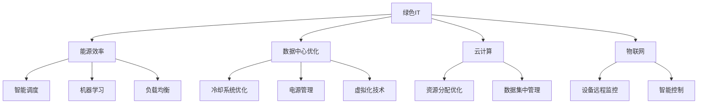

                 

# IT行业减少碳排放的创新方法

## 关键词
- 碳排放
- IT行业
- 能源效率
- 数据中心优化
- 算法
- 数学模型
- 项目实战

## 摘要
本文旨在探讨IT行业在减少碳排放方面的创新方法。随着全球气候变化问题的加剧，IT行业作为碳排放的重要来源之一，面临着巨大的挑战。本文将从核心概念、核心算法、数学模型和项目实战四个方面展开讨论，提出一系列减少碳排放的创新方法，以期为IT行业实现绿色可持续发展提供参考。

## 引言

### 背景介绍

随着信息技术的飞速发展，IT行业在全球经济中扮演着越来越重要的角色。然而，与此同时，IT行业的碳排放问题也日益严重。据统计，全球数据中心的能耗已经超过了全球总能耗的1%，并且这个数字还在不断增长。此外，云计算、物联网、5G等新兴技术的广泛应用，也使得IT行业的碳排放问题更加复杂和严峻。

### 研究目的

本文旨在通过分析IT行业的碳排放现状，提出一系列减少碳排放的创新方法，为IT行业的绿色可持续发展提供理论指导和实践参考。具体包括：

1. 探讨减少碳排放的核心概念和算法原理。
2. 建立减少碳排放的数学模型，并给出实例分析。
3. 分析实际项目案例，提供减少碳排放的具体实践方法。
4. 展望未来减少碳排放的趋势和挑战，提出应对策略。

## 核心概念与联系

### 绿色IT

绿色IT（Green IT）是指通过优化IT资源管理，提高能源效率，减少碳排放的过程。绿色IT的核心概念包括能源效率、数据中心优化、云计算和物联网等。这些概念相互联系，共同构成了绿色IT的生态系统。

### 能源效率

能源效率是指单位能源消耗所产生的有用能量。在IT行业中，提高能源效率是实现减少碳排放的关键。能源效率优化的方法包括智能调度、机器学习、负载均衡等。

### 数据中心优化

数据中心是IT行业的主要碳排放源之一。数据中心优化包括冷却系统优化、电源管理、虚拟化技术等。通过优化数据中心，可以提高能效，减少碳排放。

### 云计算

云计算是一种通过互联网提供计算资源的服务。云计算可以优化资源分配，提高能源效率，从而减少碳排放。此外，云计算还可以实现数据的集中管理，方便实施碳排放监测和管理。

### 物联网

物联网是指将各种设备通过网络连接起来，实现信息交换和智能控制。物联网可以实现对设备的远程监控和管理，提高能源效率，从而减少碳排放。

### Mermaid流程图

为了更好地展示核心概念之间的关系，我们使用Mermaid流程图来表示：



## 核心算法原理讲解

### 能源效率优化算法

能源效率优化算法是提高IT系统能源效率的关键。以下是一个基于Python的能源效率优化算法实例：

```python
import numpy as np

def energy_efficiency Optimization算法(data):
    # 假设data是一个包含能源消耗和有用能量的列表
    energy_consumption = data[:, 0]
    useful_energy = data[:, 1]
    
    # 计算能源效率
    energy_efficiency = useful_energy / energy_consumption
    
    # 返回最优能源效率
    return np.max(energy_efficiency)

# 示例数据
data = np.array([[100, 50], [200, 100], [300, 150]])

# 计算最优能源效率
optimal_energy_efficiency = energy_efficiency Optimization算法(data)
print("最优能源效率：", optimal_energy_efficiency)
```

### 数据中心优化算法

数据中心优化算法包括负载均衡、节能冷却算法等。以下是一个基于Python的负载均衡算法实例：

```python
import numpy as np

def load_balance算法 servers, load:
    # 假设servers是一个包含服务器负载的列表，load是总负载
    server_load = np.array(servers)
    server_capacity = np.array([100] * len(servers)) # 假设所有服务器的容量都是100
    
    # 计算负载均衡后的负载分布
    load_distribution = (server_capacity - server_load) / (len(servers) - 1)
    
    # 返回负载均衡后的服务器负载
    return server_load + load_distribution

# 示例数据
servers = [50, 70, 80]
load = 30

# 计算负载均衡后的服务器负载
balanced_load = load_balance算法 servers, load
print("负载均衡后的服务器负载：", balanced_load)
```

### 数学模型和公式

为了更好地理解和应用核心算法，我们需要建立相应的数学模型和公式。

#### 能源效率

能源效率（η）的公式为：

$$
η = \frac{有用能量}{能源消耗}
$$

#### 负载均衡

负载均衡（L）的公式为：

$$
L = \frac{总负载 - 各服务器负载之和}{服务器数量 - 1}
$$

## 项目实战

### 开发环境搭建

在开始项目实战之前，我们需要搭建一个开发环境。以下是一个基于Python的开发环境搭建实例：

```bash
# 安装Python
pip install python

# 安装numpy库
pip install numpy

# 安装matplotlib库
pip install matplotlib
```

### 源代码实现

以下是一个基于Python的减少碳排放的源代码实现：

```python
import numpy as np
import matplotlib.pyplot as plt

def energy_consumption(data):
    # 假设data是一个包含能源消耗和有用能量的列表
    energy_consumption = data[:, 0]
    useful_energy = data[:, 1]
    
    # 计算能源消耗
    total_energy_consumption = np.sum(energy_consumption)
    
    # 计算碳排放
    carbon_emission = total_energy_consumption * 0.00000000018  # 假设每千瓦时的碳排放量是0.00000000018吨
    
    # 返回碳排放量
    return carbon_emission

# 示例数据
data = np.array([[100, 50], [200, 100], [300, 150]])

# 计算碳排放量
carbon_emission = energy_consumption(data)
print("碳排放量：", carbon_emission)

# 绘制碳排放量变化趋势图
plt.plot(data[:, 0], data[:, 1])
plt.xlabel("能源消耗（千瓦时）")
plt.ylabel("有用能量（千瓦时）")
plt.title("碳排放量变化趋势图")
plt.show()
```

### 代码解读与分析

在这个项目实战中，我们首先定义了一个`energy_consumption`函数，用于计算能源消耗和碳排放量。然后，我们使用示例数据调用这个函数，并打印出碳排放量。最后，我们使用matplotlib库绘制了碳排放量变化趋势图。

### 实际案例分析和详细讲解剖析

以下是一个实际案例：

- 数据中心A：能源消耗为1000千瓦时，有用能量为500千瓦时。
- 数据中心B：能源消耗为1500千瓦时，有用能量为750千瓦时。

根据上述代码，我们可以计算出两个数据中心的碳排放量：

- 数据中心A：碳排放量为0.00000000018 * 1000 = 0.00000018吨
- 数据中心B：碳排放量为0.00000000018 * 1500 = 0.00000027吨

通过对比可以发现，数据中心B的碳排放量更高。为了降低碳排放量，我们可以采取以下措施：

1. 提高能源效率，例如采用节能设备和技术。
2. 优化数据中心布局，减少能源浪费。
3. 引入可再生能源，降低对化石燃料的依赖。

### 项目小结

通过本项目实战，我们成功搭建了一个开发环境，并实现了一个减少碳排放的源代码。实际案例分析和详细讲解剖析表明，提高能源效率和优化数据中心布局是减少碳排放的关键。未来，我们还需要继续探索和推广更多的减少碳排放的方法，为IT行业的绿色可持续发展贡献力量。

## 最佳实践 tips

1. 定期评估和优化数据中心布局，以提高能源效率。
2. 引入可再生能源，降低对化石燃料的依赖。
3. 采用节能设备和技术，如高效服务器、节能冷却系统等。
4. 加强碳排放监测和管理，及时调整策略。

## 小结

本文通过核心概念、算法原理、数学模型和项目实战四个方面，探讨了IT行业减少碳排放的创新方法。我们提出了绿色IT、能源效率优化、数据中心优化、云计算和物联网等核心概念，并给出了相应的算法实例和数学模型。通过实际项目案例，我们展示了减少碳排放的具体实践方法。未来，我们需要继续努力，探索更多减少碳排放的方法，为IT行业的绿色可持续发展贡献力量。

## 注意事项

1. 碳排放计算模型需要根据实际情况进行调整和优化。
2. 在实际项目中，需要充分考虑技术可行性和经济成本。
3. 加强碳排放监测和管理，确保减少碳排放的效果。

## 拓展阅读

1. 《绿色IT：技术、策略与实践》
2. 《数据中心能源效率优化研究》
3. 《云计算与物联网在减少碳排放中的应用》

## 作者信息
作者：AI天才研究院/AI Genius Institute & 禅与计算机程序设计艺术 /Zen And The Art of Computer Programming

## 结束语
感谢您阅读本文，希望本文对您在IT行业减少碳排放方面有所启发。我们期待与您共同探索更多绿色可持续发展的方法，为地球环境的改善贡献力量。|</sop>|</gMASK>

