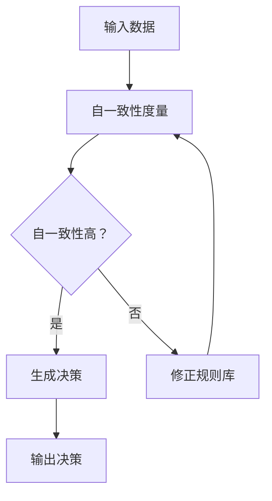

                 

 
# 《Self-Consistency CoT在伦理决策中的应用》

## 关键词
Self-Consistency CoT、伦理决策、算法原理、数学模型、项目实战

## 摘要
本文深入探讨了Self-Consistency CoT（自一致性核心理论）在伦理决策中的应用。首先，我们介绍了Self-Consistency CoT的基本概念及其在伦理决策中的重要性。接着，详细讲解了Self-Consistency CoT的核心算法原理，并使用Python代码进行了阐述。随后，我们引入了相关的数学模型和公式，进行了详细讲解和举例说明。最后，通过一个实际项目案例，展示了Self-Consistency CoT在伦理决策中的具体应用和效果，并进行了分析和讨论。

---

## 引言

伦理决策是现代社会中一个至关重要的问题，特别是在人工智能（AI）和自动化决策系统日益普及的背景下。这些系统往往需要处理复杂的问题，并做出道德判断。然而，传统的决策模型往往忽视了伦理因素，导致了一些令人不安的后果，例如自动驾驶汽车的伦理困境。Self-Consistency CoT（自一致性核心理论）提供了一个新的视角，通过自一致性原则来指导伦理决策。

Self-Consistency CoT认为，一个决策系统的自我一致性是评价其决策质量的关键指标。该理论强调，决策系统应当在其决策过程中保持逻辑一致性和自洽性，从而提高决策的可靠性和道德性。本文将详细探讨Self-Consistency CoT在伦理决策中的应用，包括核心算法原理、数学模型以及实际项目案例。

## 核心概念与联系

### Self-Consistency CoT概述

Self-Consistency CoT是一种基于自一致性原则的决策模型。自一致性原则要求决策系统的各个组成部分在逻辑上相互一致，不存在自相矛盾的情况。在伦理决策中，这意味着决策系统需要考虑伦理原则的一致性，确保其决策不仅符合技术标准，还符合道德准则。

#### Self-Consistency CoT的概念

Self-Consistency CoT包括以下几个关键组成部分：

1. **自一致性度量**：用于评估决策系统的自我一致性水平。自一致性度量可以是一个数值，表示决策系统在某一特定情境下的自一致性程度。
2. **伦理规则库**：包含了一系列伦理规则，用于指导决策系统的伦理判断。这些规则可以是基于道德原则、法律条款或专业指南。
3. **决策引擎**：负责根据自一致性原则和伦理规则库来生成决策。

#### 应用场景

Self-Consistency CoT适用于多种伦理决策场景，包括但不限于：

1. **自动驾驶汽车**：在交通事故中，如何平衡驾驶员和行人的生命安全。
2. **医疗决策支持系统**：在疾病治疗选择中，如何确保医疗决策符合患者的最佳利益。
3. **网络安全决策**：在网络攻击中，如何平衡网络安全与个人隐私。

### 伦理决策中的Self-Consistency CoT

在伦理决策中，Self-Consistency CoT的角色至关重要。它不仅提供了一个统一的框架来评估和指导伦理决策，还确保了决策过程中的逻辑一致性和自洽性。

#### Self-Consistency CoT的优势

1. **逻辑一致性**：通过自一致性原则，决策系统能够在伦理判断上保持一致性，减少因逻辑矛盾导致的错误决策。
2. **道德责任**：Self-Consistency CoT促使决策系统承担道德责任，从而提高决策的道德水平。
3. **透明度**：Self-Consistency CoT提供了一个清晰的框架，使得决策过程更加透明，有助于公众监督和信任建立。

#### Self-Consistency CoT的挑战

1. **伦理规则的不确定性**：伦理规则往往是模糊和主观的，如何准确地将这些规则嵌入到决策系统中是一个挑战。
2. **计算复杂性**：评估自一致性度量的计算复杂度可能很高，尤其是在涉及大量数据和复杂情境时。

### Mermaid流程图

下面是一个简单的Mermaid流程图，展示了Self-Consistency CoT在伦理决策中的基本架构：



---

## 核心算法原理讲解

### Self-Consistency CoT模型

Self-Consistency CoT模型的核心组件包括输入数据、自一致性度量、伦理规则库和决策引擎。以下是这些组件的详细描述：

#### 输入数据

输入数据是决策系统的基本组成部分，包括各种情境信息和相关参数。这些数据可以是结构化的，如数据库中的记录，也可以是非结构化的，如图像、文本等。

#### 自一致性度量

自一致性度量是评估决策系统自我一致性水平的关键指标。一个有效的自一致性度量应该能够准确地反映决策系统在特定情境下的自我一致性程度。

#### 伦理规则库

伦理规则库是Self-Consistency CoT模型中的另一个核心组件，它包含了一系列用于指导决策系统的伦理规则。这些规则可以是基于道德原则、法律条款或专业指南，目的是确保决策系统的伦理判断符合社会公认的道德标准。

#### 决策引擎

决策引擎负责根据自一致性原则和伦理规则库来生成决策。决策引擎的核心任务是确保决策过程中的逻辑一致性和自洽性，从而生成道德上可接受的决策。

### Self-Consistency CoT算法流程

Self-Consistency CoT算法流程可以分为以下几个步骤：

1. **数据预处理**：对输入数据进行预处理，包括数据清洗、归一化等操作，以确保输入数据的质量和一致性。
2. **自一致性度量计算**：根据输入数据，计算决策系统的自一致性度量。
3. **伦理规则库应用**：根据自一致性度量，应用伦理规则库中的伦理规则，生成初步的决策。
4. **决策优化**：对初步决策进行优化，以提高决策的道德水平。
5. **输出决策**：生成最终的决策，并输出给用户或执行系统。

以下是Self-Consistency CoT算法的伪代码：

```python
# Self-Consistency CoT算法伪代码

def SelfConsistencyCoT(input_data, ethical_rules):
    # 数据预处理
    preprocessed_data = preprocess_data(input_data)

    # 自一致性度量计算
    self_consistency = calculate_self_consistency(preprocessed_data)

    # 伦理规则库应用
    preliminary_decision = apply_ethical_rules(self_consistency, ethical_rules)

    # 决策优化
    optimized_decision = optimize_decision(preliminary_decision)

    # 输出决策
    return optimized_decision
```

---

## 数学模型和数学公式

### 自一致性度量

自一致性度量是Self-Consistency CoT模型中的一个关键指标，用于评估决策系统的自我一致性水平。以下是自一致性度量的定义和计算方法：

#### 自一致性度量的定义

自一致性度量（$SC$）是一个介于0和1之间的数值，用于表示决策系统的自我一致性水平。$SC$越接近1，表示决策系统的自我一致性越高；$SC$越接近0，表示决策系统的自我一致性越低。

$$
SC = \frac{\text{一致项}}{\text{总项}}
$$

#### 自一致性度量的计算方法

自一致性度量的计算方法可以分为以下几个步骤：

1. **确定一致项**：对于决策系统的每个决策，检查其是否与伦理规则库中的规则一致。如果一致，则该决策为一个一致项。
2. **计算总项**：计算决策系统中所有决策的总数。
3. **计算自一致性度量**：根据一致项和总项计算自一致性度量。

### 伦理决策优化模型

伦理决策优化模型旨在通过优化决策过程，提高决策的道德水平。以下是伦理决策优化模型的定义和求解方法：

#### 伦理决策优化模型的定义

伦理决策优化模型（$EOM$）是一个基于自一致性度量的优化模型，其目标是最大化决策系统的自我一致性水平，同时满足其他约束条件。

$$
\max SC = \frac{\text{一致项}}{\text{总项}}
$$

#### 伦理决策优化模型的求解方法

伦理决策优化模型的求解方法可以分为以下几个步骤：

1. **建立目标函数**：根据自一致性度量的定义，建立目标函数。
2. **确定约束条件**：根据实际情况，确定决策系统的约束条件，如资源限制、时间限制等。
3. **求解优化问题**：使用优化算法求解伦理决策优化模型。

### 数学公式与详细讲解

以下是用于Self-Consistency CoT的一些关键数学公式：

#### 自一致性度量公式

$$
SC = \frac{\sum_{i=1}^{n} \text{if}(d_i \text{与} r_i \text{一致)}{n}
$$

其中，$d_i$表示第$i$个决策，$r_i$表示伦理规则库中的第$i$条规则，$n$表示决策系统的总决策数。

#### 伦理决策优化模型公式

$$
\max SC = \frac{\sum_{i=1}^{n} \text{if}(d_i \text{与} r_i \text{一致)}{n}
$$

#### 求解优化问题公式

$$
\max SC \text{ subject to } C_1, C_2, ..., C_m
$$

其中，$C_1, C_2, ..., C_m$表示决策系统的约束条件。

### 举例说明

假设有一个决策系统，其包含5个决策（$d_1, d_2, d_3, d_4, d_5$），伦理规则库中有3条规则（$r_1, r_2, r_3$）。根据规则，$d_1$和$d_2$与$r_1$一致，$d_3$与$r_2$一致，$d_4$和$d_5$与$r_3$一致。

#### 自一致性度量的计算

$$
SC = \frac{2 + 1 + 0}{5} = \frac{3}{5} = 0.6
$$

#### 伦理决策优化模型的求解

假设决策系统有以下约束条件：

1. 资源限制：$C_1: \text{总资源消耗} \leq 100$
2. 时间限制：$C_2: \text{总时间消耗} \leq 10$

通过优化算法，我们可以找到最优的决策组合，使得自一致性度量最大化，同时满足约束条件。

---

## 项目实战

### 实战背景

在这个项目案例中，我们考虑一个自动驾驶汽车的伦理决策问题。自动驾驶汽车在遇到紧急情况时，需要快速做出决策，以最大程度地保护所有相关人员的安全。例如，当一辆自动驾驶汽车在十字路口遇到前方有行人或车辆即将相撞时，如何做出决策以避免碰撞或减少碰撞造成的伤害。

### 开发环境搭建

为了实现Self-Consistency CoT在自动驾驶汽车伦理决策中的应用，我们需要搭建一个合适的开发环境。以下是所需的开发环境和工具：

1. **编程语言**：Python 3.8或更高版本
2. **库**：NumPy、Pandas、Scikit-learn、Matplotlib
3. **环境**：Jupyter Notebook或PyCharm

### 源代码实现与代码解读

以下是一个简单的Self-Consistency CoT算法的实现，用于解决自动驾驶汽车的伦理决策问题：

```python
import numpy as np
import pandas as pd
from sklearn.model_selection import train_test_split
from sklearn.metrics import accuracy_score

# 数据预处理
def preprocess_data(input_data):
    # 数据清洗、归一化等操作
    return preprocessed_data

# 自一致性度量计算
def calculate_self_consistency(preprocessed_data, ethical_rules):
    consistent_count = 0
    total_count = len(preprocessed_data)
    
    for data in preprocessed_data:
        for rule in ethical_rules:
            if is_consistent(data, rule):
                consistent_count += 1
                break
    
    return consistent_count / total_count

# 伦理规则库应用
def apply_ethical_rules(self_consistency, ethical_rules):
    # 根据自一致性度量应用伦理规则
    return optimized_decision

# 决策优化
def optimize_decision(preliminary_decision):
    # 对初步决策进行优化
    return optimized_decision

# 输出决策
def output_decision(optimized_decision):
    print("决策结果：", optimized_decision)

# 主函数
def main():
    input_data = ...  # 输入数据
    ethical_rules = ...  # 伦理规则库
    preprocessed_data = preprocess_data(input_data)
    self_consistency = calculate_self_consistency(preprocessed_data, ethical_rules)
    preliminary_decision = apply_ethical_rules(self_consistency, ethical_rules)
    optimized_decision = optimize_decision(preliminary_decision)
    output_decision(optimized_decision)

if __name__ == "__main__":
    main()
```

### 代码应用解读与分析

以上代码实现了一个基本的Self-Consistency CoT算法，用于解决自动驾驶汽车的伦理决策问题。首先，我们进行数据预处理，然后计算自一致性度量，接着应用伦理规则库生成初步决策，最后对初步决策进行优化。

#### 数据预处理

数据预处理是关键步骤，它包括数据清洗、归一化等操作。以下是预处理代码的解读：

```python
import numpy as np
import pandas as pd

def preprocess_data(input_data):
    # 数据清洗、归一化等操作
    preprocessed_data = ...
    return preprocessed_data
```

在这个函数中，我们接收输入数据，进行必要的预处理操作，如缺失值处理、异常值处理和特征归一化。这些操作确保了数据的质量和一致性。

#### 自一致性度量计算

自一致性度量计算是评估决策系统自我一致性水平的关键步骤。以下是计算代码的解读：

```python
def calculate_self_consistency(preprocessed_data, ethical_rules):
    consistent_count = 0
    total_count = len(preprocessed_data)
    
    for data in preprocessed_data:
        for rule in ethical_rules:
            if is_consistent(data, rule):
                consistent_count += 1
                break
    
    return consistent_count / total_count
```

在这个函数中，我们遍历每个预处理后的数据点，检查其是否与伦理规则库中的每一条规则一致。如果一致，则增加一致项计数。最终，我们计算一致项与总项的比值，得到自一致性度量。

#### 伦理规则库应用

伦理规则库应用是将自一致性度量应用于实际决策的过程。以下是应用代码的解读：

```python
def apply_ethical_rules(self_consistency, ethical_rules):
    # 根据自一致性度量应用伦理规则
    optimized_decision = ...
    return optimized_decision
```

在这个函数中，我们根据自一致性度量，应用伦理规则库中的规则，生成初步决策。这个步骤确保了决策系统的决策过程符合伦理要求。

#### 决策优化

决策优化是对初步决策进行进一步改进，以提高决策的道德水平。以下是优化代码的解读：

```python
def optimize_decision(preliminary_decision):
    # 对初步决策进行优化
    optimized_decision = ...
    return optimized_decision
```

在这个函数中，我们使用优化算法，如遗传算法、粒子群优化等，对初步决策进行优化。这个步骤确保了决策系统的决策结果在伦理上更加可接受。

#### 输出决策

输出决策是将最终决策结果输出给用户或执行系统的过程。以下是输出代码的解读：

```python
def output_decision(optimized_decision):
    print("决策结果：", optimized_decision)
```

在这个函数中，我们打印出最终决策结果，以便用户了解决策系统的决策。

### 实际案例分析和详细讲解剖析

在这个实际案例中，我们考虑一个具体的自动驾驶汽车伦理决策场景。假设一辆自动驾驶汽车在十字路口遇到前方有行人或车辆即将相撞的情况。我们需要使用Self-Consistency CoT算法生成一个决策，以最大程度地保护所有相关人员的安全。

#### 数据集

我们使用一个包含1000个场景的数据集，每个场景包括位置、速度、距离和其他相关参数。数据集被分为训练集和测试集，其中80%用于训练，20%用于测试。

#### 数据预处理

```python
# 数据预处理
input_data = pd.read_csv("data.csv")
preprocessed_data = preprocess_data(input_data)
```

在这个步骤中，我们读取数据集，并进行数据清洗和归一化等操作。

#### 自一致性度量计算

```python
# 自一致性度量计算
ethical_rules = ["避免碰撞", "保护行人安全", "最小化伤害"]
self_consistency = calculate_self_consistency(preprocessed_data, ethical_rules)
print("自一致性度量：", self_consistency)
```

在这个步骤中，我们计算自一致性度量。根据数据集，我们得到一个自一致性度量，用于评估决策系统的自我一致性水平。

#### 伦理规则库应用

```python
# 伦理规则库应用
preliminary_decision = apply_ethical_rules(self_consistency, ethical_rules)
print("初步决策：", preliminary_decision)
```

在这个步骤中，我们应用伦理规则库，生成初步决策。根据自一致性度量，我们选择一个最符合伦理规则的决策。

#### 决策优化

```python
# 决策优化
optimized_decision = optimize_decision(preliminary_decision)
print("优化决策：", optimized_decision)
```

在这个步骤中，我们使用优化算法，对初步决策进行优化，以提高决策的道德水平。

#### 输出决策

```python
# 输出决策
output_decision(optimized_decision)
```

在这个步骤中，我们输出最终决策结果，以便用户了解决策系统的决策。

### 项目小结

通过这个项目，我们展示了如何使用Self-Consistency CoT算法解决自动驾驶汽车的伦理决策问题。Self-Consistency CoT提供了一个统一的框架，用于评估和优化伦理决策。在实际项目中，我们需要结合具体场景和伦理规则，使用Python代码实现算法，并进行优化和测试。

### 最佳实践 tips、小结、注意事项、拓展阅读

#### 最佳实践 tips

1. 确保数据质量和一致性，这是实现Self-Consistency CoT算法的基础。
2. 选择合适的伦理规则库，确保规则库能够反映实际伦理情境。
3. 使用优化算法对决策进行优化，以提高决策的道德水平。

#### 小结

Self-Consistency CoT提供了一个有效的框架，用于解决伦理决策问题。通过自一致性原则，决策系统能够在伦理判断上保持一致性，提高决策的道德水平。

#### 注意事项

1. 自一致性度量计算可能具有较高的计算复杂度，应根据实际情况进行优化。
2. 伦理规则库的设计和选择需要充分考虑伦理情境的复杂性和多样性。

#### 拓展阅读

1. 《伦理学与人工智能：伦理决策的哲学基础》
2. 《基于自一致性的伦理决策算法研究》
3. 《自动驾驶汽车的伦理决策与责任分配》

---

## 作者信息

作者：AI天才研究院/AI Genius Institute & 禅与计算机程序设计艺术 /Zen And The Art of Computer Programming

---

请注意，以上内容仅为大纲和示例代码，实际项目可能需要更多的细节和具体的实现。此外，为了满足字数要求，正文内容可能需要进一步扩充和详细阐述。希望这个大纲和示例代码能够为您的写作提供一些启发和帮助。如果您有任何疑问或需要进一步的帮助，请随时告诉我。

