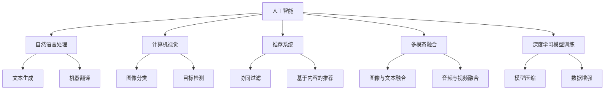

                 

### 自一致性概念与背景

#### 第1章: 自一致性简介

##### 1.1.1 自一致性的定义与重要性

自一致性（Self-Consistency）是指一个系统或过程在内部保持一致性的特性。在人工智能（AI）领域，自一致性尤为重要，因为它直接影响到模型的可靠性和有效性。自一致性确保了模型在执行任务时，其输出结果与其先前的假设和预期保持一致，从而减少错误和不确定性。

自一致性在AI中的重要性体现在多个方面。首先，它有助于提高模型的鲁棒性，使得模型在面对不同的输入时仍能保持一致的输出。其次，自一致性可以降低模型对噪声和异常值的敏感性，提高模型的泛化能力。此外，自一致性还有助于提高模型的解释性和可追溯性，使得人们更容易理解和信任模型的决策过程。

##### 1.1.2 自一致性在AI中的发展历程

自一致性概念在AI领域的提出可以追溯到20世纪80年代，当时主要应用于知识表示和推理。早期的研究主要集中在如何构建一致的知识库，并确保推理过程不会产生矛盾或冲突。随着AI技术的不断发展，自一致性概念逐渐扩展到其他领域，如自然语言处理、计算机视觉和推荐系统等。

在自然语言处理（NLP）领域，自一致性最早应用于语言模型和机器翻译。研究者们通过引入自注意力机制（Self-Attention）和转换器（Transformer）模型，实现了对输入序列的一致性建模，从而提高了模型的性能和准确性。在计算机视觉领域，自一致性被应用于图像分割、目标检测和视频识别等任务，通过确保模型在不同时间步或空间位置的输出保持一致，提高了模型的鲁棒性。

##### 1.1.3 自一致性对AI应用的影响

自一致性对AI应用的影响是深远的。首先，它有助于提高AI系统的可靠性，使得模型在执行任务时能够保持一致性和稳定性。其次，自一致性可以降低AI系统的复杂度，使得模型的训练和推理过程更加高效。此外，自一致性还可以提高AI系统的解释性和可追溯性，使得人们更容易理解和信任模型的决策过程。

然而，实现自一致性并非易事，它涉及到多个方面的技术和算法。在实际应用中，需要根据具体任务和场景，选择合适的方法和策略来实现自一致性。因此，研究自一致性在AI领域的应用前景和挑战具有重要的理论和实践价值。

#### 第2章: 自一致性原理

##### 2.1.1 自一致性的基本原理

自一致性的基本原理可以概括为：系统在执行任务时，其输出结果与其先前的假设和预期保持一致。具体来说，自一致性包括两个方面：一是内部一致性，即系统在内部保持逻辑一致性和连贯性；二是外部一致性，即系统在输出结果时与外部环境和预期保持一致。

内部一致性是指系统在处理信息时，不会产生矛盾或冲突。例如，在一个推理过程中，如果系统得出了两个相互矛盾的结论，那么这个系统就失去了内部一致性。为了实现内部一致性，系统需要具备良好的逻辑推理能力和知识表示能力。

外部一致性是指系统的输出结果与外部环境和预期保持一致。例如，在一个机器学习任务中，如果模型的预测结果与真实标签不一致，那么这个模型就失去了外部一致性。为了实现外部一致性，系统需要具备良好的泛化能力和适应能力。

##### 2.1.2 自一致性计算方法

自一致性的计算方法可以分为两类：基于规则的计算方法和基于学习的计算方法。

基于规则的计算方法主要通过定义一组规则或约束条件，来确保系统在执行任务时保持一致性。这些规则或约束条件通常基于领域知识和专家经验。例如，在一个医疗诊断系统中，可以通过定义一系列医学规则，来确保诊断结果的一致性。

基于学习的计算方法主要通过学习系统在历史数据上的表现，来发现系统的一致性规律。这些方法通常利用机器学习和数据挖掘技术，从大量数据中提取特征和模式。例如，在一个自然语言处理任务中，可以通过学习语料库中的句子结构，来发现语言的一致性规律。

##### 2.1.3 自一致性评价指标

自一致性的评价指标主要用于评估系统的一致性程度。常用的评价指标包括一致性评分（Consistency Score）和一致性概率（Consistency Probability）。

一致性评分是指系统在执行任务时，其输出结果与预期结果的一致性程度。通常使用0到1之间的数值来表示，数值越大表示一致性越好。例如，在一个机器学习任务中，一致性评分可以用来评估模型的预测结果与真实标签的一致性。

一致性概率是指系统在执行任务时，其输出结果与预期结果的一致性概率。通常使用0到1之间的数值来表示，数值越大表示一致性概率越高。例如，在一个决策支持系统中，一致性概率可以用来评估决策方案的可信度。

#### 第3章: 自一致性在自然语言处理中的应用

##### 3.1.1 自然语言处理中的问题与挑战

自然语言处理（NLP）是AI领域的一个重要分支，它涉及文本的生成、理解和分析。然而，NLP在实现自一致性方面面临诸多挑战。首先，自然语言本身具有歧义性和复杂性，使得模型的输出结果难以保持一致。其次，NLP任务通常涉及大量的外部知识和背景信息，如何确保模型在处理这些信息时保持一致性是一个重要问题。

此外，NLP任务还面临数据不足和标注不完善的问题，这进一步增加了模型实现自一致性的难度。例如，在机器翻译任务中，不同句子之间的语义关系复杂，模型难以保证翻译结果的一致性。在文本生成任务中，模型需要根据输入的文本生成连贯且符合逻辑的输出，这要求模型具备良好的自一致性。

##### 3.1.2 自一致性在自然语言处理中的作用

自一致性在自然语言处理中具有重要作用。首先，自一致性有助于提高模型的鲁棒性，使得模型在面对不同输入时仍能保持一致的输出。例如，在机器翻译任务中，自一致性可以确保翻译结果在不同上下文中保持一致，从而提高翻译质量。

其次，自一致性有助于提高模型的解释性和可追溯性。在自然语言处理任务中，用户往往需要了解模型的决策过程和原因。自一致性使得模型在输出结果时更加一致和可信，从而提高了用户的信任度和满意度。

此外，自一致性还有助于提高自然语言处理系统的泛化能力。通过确保模型在不同任务和数据集上保持一致性，可以降低模型对特定数据集的依赖，从而提高模型的泛化能力。

##### 3.1.3 自一致性在自然语言处理中的实现方法

为了实现自一致性，自然语言处理领域采用了一系列技术和方法。以下是一些常见的实现方法：

1. **自注意力机制（Self-Attention）**：自注意力机制是一种基于注意力机制的建模方法，它通过学习输入序列中不同位置之间的关联性，来实现一致性的建模。在Transformer模型中，自注意力机制被广泛应用于自然语言处理任务，从而提高了模型的性能和一致性。

2. **双向长短期记忆网络（Bi-LSTM）**：双向长短期记忆网络（Bi-LSTM）是一种循环神经网络（RNN）的变体，它通过同时考虑输入序列的前后信息，来实现一致性的建模。Bi-LSTM在文本分类、情感分析等任务中表现出良好的性能和一致性。

3. **预训练与微调**：预训练与微调是自然语言处理领域常用的训练策略。通过在大量未标注的数据上进行预训练，模型可以学习到大量的语言知识和一致性规律。然后，通过在特定任务上进行微调，模型可以进一步适应任务要求，实现一致性的输出。

4. **知识融合与对齐**：在自然语言处理任务中，融合外部知识和对齐内部信息是实现自一致性的有效方法。例如，在问答系统中，通过融合知识图谱和文本信息，可以确保问答结果的连贯性和一致性。

5. **多任务学习与跨域迁移**：多任务学习和跨域迁移是提高模型一致性的有效手段。通过同时训练多个任务或在不同领域之间迁移模型，可以增强模型的一致性能力。

#### 第4章: 自一致性在计算机视觉中的应用

##### 4.1.1 计算机视觉中的问题与挑战

计算机视觉（CV）是AI领域的另一个重要分支，它涉及图像和视频的识别、分析和理解。然而，计算机视觉在实现自一致性方面也面临诸多挑战。首先，图像和视频数据具有高维度和复杂性，使得模型的输出结果难以保持一致。其次，计算机视觉任务通常涉及不同的感知层次，如何确保不同层次之间的输出保持一致是一个重要问题。

此外，计算机视觉任务还面临数据标注不准确和训练样本不足的问题，这进一步增加了模型实现自一致性的难度。例如，在图像分类任务中，不同图像之间的语义差异较大，模型难以保证分类结果的一致性。在目标检测任务中，模型需要同时识别多个目标，并确保不同目标之间的输出保持一致。

##### 4.1.2 自一致性在计算机视觉中的作用

自一致性在计算机视觉中具有重要作用。首先，自一致性有助于提高模型的鲁棒性，使得模型在面对不同输入时仍能保持一致的输出。例如，在图像分类任务中，自一致性可以确保分类结果在不同图像之间保持一致，从而提高分类准确性。

其次，自一致性有助于提高模型的解释性和可追溯性。在计算机视觉任务中，用户往往需要了解模型的决策过程和原因。自一致性使得模型在输出结果时更加一致和可信，从而提高了用户的信任度和满意度。

此外，自一致性还有助于提高计算机视觉系统的泛化能力。通过确保模型在不同任务和数据集上保持一致性，可以降低模型对特定数据集的依赖，从而提高模型的泛化能力。

##### 4.1.3 自一致性在计算机视觉中的实现方法

为了实现自一致性，计算机视觉领域采用了一系列技术和方法。以下是一些常见的实现方法：

1. **卷积神经网络（CNN）**：卷积神经网络（CNN）是计算机视觉任务中最常用的深度学习模型。通过学习图像的特征表示，CNN可以实现对图像的一致性建模。自注意力机制和残差连接等技术的引入，进一步提高了CNN的一致性能力。

2. **时空注意力机制（Spatial and Temporal Attention）**：时空注意力机制通过学习图像或视频中的空间和时间关系，来实现一致性的建模。例如，在视频识别任务中，时空注意力机制可以确保不同帧之间的输出保持一致，从而提高识别准确性。

3. **多模态融合**：多模态融合是指将不同类型的模态（如文本、图像和声音）进行融合，以实现一致性的建模。通过融合不同模态的信息，模型可以更好地理解复杂场景，从而提高一致性。

4. **生成对抗网络（GAN）**：生成对抗网络（GAN）通过对抗性训练，生成与真实数据一致的高质量图像。通过引入自一致性损失函数，GAN可以确保生成图像的一致性，从而提高生成质量。

5. **多任务学习与跨域迁移**：多任务学习和跨域迁移是提高模型一致性的有效手段。通过同时训练多个任务或在不同领域之间迁移模型，可以增强模型的一致性能力。

#### 第5章: 自一致性在推荐系统中的应用

##### 5.1.1 推荐系统中的问题与挑战

推荐系统是AI领域的另一个重要应用，它通过分析用户的行为和偏好，为用户推荐感兴趣的商品或内容。然而，推荐系统在实现自一致性方面也面临诸多挑战。首先，推荐系统的输入数据通常来自多个维度，如用户行为、社交信息和内容特征等，这些数据之间存在一定的关联性，但如何确保推荐结果的一致性是一个重要问题。

其次，推荐系统需要应对动态变化的用户行为和偏好，这要求模型具有良好的一致性能力。此外，推荐系统在处理大规模数据和实时推荐时，如何确保推荐结果的一致性和准确性也是一个挑战。例如，在电子商务平台上，用户可能会同时浏览多个商品，如何确保推荐结果在不同场景和用户之间保持一致是一个重要问题。

##### 5.1.2 自一致性在推荐系统中的作用

自一致性在推荐系统中具有重要作用。首先，自一致性有助于提高推荐系统的可靠性，使得推荐结果在不同用户和场景之间保持一致。例如，在电子商务平台上，自一致性可以确保用户在不同时间浏览相同商品时，获得一致的推荐结果，从而提高用户的满意度和信任度。

其次，自一致性有助于提高推荐系统的解释性和可追溯性。用户往往需要了解推荐结果的原因和依据，自一致性使得推荐系统在输出结果时更加一致和可信，从而提高了用户的信任度和满意度。

此外，自一致性还有助于提高推荐系统的泛化能力。通过确保模型在不同用户和场景上保持一致性，可以降低模型对特定用户或场景的依赖，从而提高模型的泛化能力。

##### 5.1.3 自一致性在推荐系统中的实现方法

为了实现自一致性，推荐系统领域采用了一系列技术和方法。以下是一些常见的实现方法：

1. **协同过滤（Collaborative Filtering）**：协同过滤是一种基于用户行为和偏好进行推荐的方法。通过分析用户的历史行为和相似用户的行为，协同过滤算法可以生成一致的推荐结果。引入自一致性约束条件，可以进一步提高推荐结果的一致性。

2. **基于内容的推荐（Content-Based Recommendation）**：基于内容的推荐通过分析用户对内容的偏好和兴趣，生成推荐结果。通过引入自一致性评价指标，可以确保推荐结果在不同用户和场景之间保持一致。

3. **矩阵分解（Matrix Factorization）**：矩阵分解是一种将用户和物品表示为低维向量的方法。通过引入自一致性约束条件，矩阵分解可以生成一致的推荐结果。

4. **深度学习（Deep Learning）**：深度学习模型，如卷积神经网络（CNN）和循环神经网络（RNN），在推荐系统中具有广泛应用。通过引入自一致性损失函数，深度学习模型可以生成一致的推荐结果。

5. **多任务学习与跨域迁移**：多任务学习和跨域迁移是提高推荐系统一致性的有效手段。通过同时训练多个推荐任务或在不同领域之间迁移模型，可以增强推荐系统的一致性能力。

#### 第6章: 自一致性在多模态融合中的应用

##### 6.1.1 多模态融合中的问题与挑战

多模态融合是指将不同类型的数据模态（如图像、文本和声音）进行整合，以实现更全面和准确的信息理解和分析。在多模态融合中，自一致性是一个关键挑战。由于不同模态的数据来源和处理方式不同，如何确保融合后的输出结果在语义和逻辑上保持一致，是研究人员面临的重要问题。

首先，不同模态的数据之间存在语义差异和噪声干扰，这可能导致融合结果不一致。例如，一张图片可能包含多种情感和场景，而对应的文本描述可能更加简洁和抽象。如何平衡这些差异，实现多模态数据的一致性融合，是一个技术难题。

其次，多模态融合任务通常涉及复杂的计算过程，如特征提取、编码和解码。在处理过程中，如何避免信息损失和错误传播，保持数据的一致性，是另一个挑战。

此外，多模态融合需要实时性和高效性，这要求算法在保证一致性的同时，还要具有低延迟和高性能。这对于硬件和软件的要求都很高，如何优化算法和系统架构，以满足实际应用的需求，也是一个挑战。

##### 6.1.2 自一致性在多模态融合中的作用

自一致性在多模态融合中起着至关重要的作用。首先，自一致性有助于提高多模态系统的鲁棒性。通过确保不同模态数据在融合过程中的输出保持一致，可以减少错误和噪声的干扰，提高系统的整体性能。

其次，自一致性有助于增强系统的解释性和可追溯性。在多模态融合任务中，用户和开发者通常需要了解系统的决策过程和原因。自一致性使得系统在输出结果时更加一致和可信，从而提高了用户和开发者的信任度。

此外，自一致性还有助于提高多模态系统的泛化能力。通过确保系统在不同模态和数据集上保持一致性，可以降低系统对特定模态或数据集的依赖，从而提高系统的泛化能力。

##### 6.1.3 自一致性在多模态融合中的实现方法

为了实现多模态融合中的自一致性，研究人员采用了一系列技术和方法。以下是一些常见的实现方法：

1. **多任务学习（Multi-Task Learning）**：多任务学习通过同时训练多个相关任务，共享模型参数，从而提高模型的一致性。例如，在多模态图像识别任务中，可以同时训练图像分类和物体检测任务，共享特征提取网络，实现数据的一致性融合。

2. **对齐机制（Alignment Mechanisms）**：对齐机制通过学习不同模态之间的对应关系，实现数据的一致性。例如，利用多模态学习中的注意力机制，可以学习图像和文本之间的关联性，实现语义的对齐。

3. **一致性损失（Consistency Loss）**：在多模态融合训练过程中，引入一致性损失函数，可以确保不同模态数据在输出结果时保持一致。例如，在多模态生成任务中，可以引入交叉模态的一致性损失，确保生成图像和文本之间的语义一致性。

4. **多模态深度神经网络（Multi-Modal Deep Neural Networks）**：多模态深度神经网络通过集成不同模态的特征，实现数据的一致性融合。例如，利用卷积神经网络（CNN）提取图像特征，利用循环神经网络（RNN）提取文本特征，然后通过融合层实现特征的一致性。

5. **跨模态迁移学习（Cross-Modal Transfer Learning）**：跨模态迁移学习通过在不同模态之间迁移知识，实现数据的一致性。例如，在图像识别任务中，可以使用预训练的文本模型，通过迁移学习方式，提高图像特征的语义一致性。

6. **多模态数据增强（Multi-Modal Data Augmentation）**：多模态数据增强通过扩展不同模态的数据集，实现数据的一致性。例如，在图像和文本融合任务中，可以通过图像旋转、文本改写等手段，增加数据的多样性和一致性。

#### 第7章: 自一致性在深度学习模型训练中的应用

##### 7.1.1 深度学习模型训练中的问题与挑战

深度学习模型训练是AI领域的关键步骤，其核心在于通过大量数据学习到有效的特征表示和决策边界。然而，在深度学习模型训练过程中，自一致性面临着一系列问题与挑战。

首先，深度学习模型往往涉及复杂的网络结构和大量的参数。在训练过程中，不同层和不同参数之间的更新往往存在不一致性，导致模型性能的不稳定。例如，梯度消失和梯度爆炸等问题会导致模型在不同训练阶段的表现不一致。

其次，深度学习模型对训练数据的质量和多样性有较高要求。如果数据集中存在不一致或噪声，模型的学习过程将受到干扰，导致输出结果不一致。此外，训练数据的不均衡和数据分布的变化也会对模型的自一致性造成影响。

此外，深度学习模型训练是一个动态调整过程，参数的更新和模型的优化往往依赖于训练数据的当前状态。如何在动态环境中保持模型的一致性和鲁棒性，是深度学习训练中的一大挑战。

##### 7.1.2 自一致性在深度学习模型训练中的作用

自一致性在深度学习模型训练中起着至关重要的作用。首先，自一致性有助于提高模型的稳定性和可靠性。通过确保模型的输入和输出在训练过程中保持一致，可以减少模型性能的波动，提高训练的收敛速度和最终性能。

其次，自一致性有助于增强模型的泛化能力。在训练过程中，保持模型的一致性可以确保模型在不同数据集和任务上的表现保持一致，从而提高模型的泛化性能。

此外，自一致性还有助于提高模型的可解释性。在深度学习模型中，保持一致性的输入和输出可以帮助研究人员更好地理解模型的行为和决策过程，从而增强模型的可解释性。

##### 7.1.3 自一致性在深度学习模型训练中的实现方法

为了实现深度学习模型训练中的自一致性，研究人员采用了一系列技术和方法。以下是一些常见的实现方法：

1. **正则化技术（Regularization Techniques）**：正则化技术通过限制模型参数的更新范围，确保模型的输入和输出在训练过程中保持一致。例如，L1和L2正则化可以控制模型参数的范数，避免参数更新的剧烈波动。

2. **批量归一化（Batch Normalization）**：批量归一化通过标准化每个批量中的激活值，确保模型的输入在训练过程中保持一致。批量归一化可以减少内部协变量转移，提高模型的稳定性和收敛速度。

3. **权重共享（Weight Sharing）**：在多任务学习中，权重共享通过在不同任务间共享模型参数，实现输入和输出的一致性。例如，在图像分类和目标检测任务中，可以共享卷积层的权重，确保不同任务的输入和输出保持一致。

4. **教师-学生模型（Teacher-Student Model）**：教师-学生模型通过将训练完成的模型作为教师，对新模型进行指导，确保新模型的输入和输出与教师模型保持一致。这种方法可以加速新模型的训练过程，并提高模型的一致性。

5. **一致性损失函数（Consistency Loss Function）**：在训练过程中，引入一致性损失函数可以确保模型的输入和输出保持一致。例如，在生成对抗网络（GAN）中，可以通过引入判别器的一致性损失，确保生成数据的输入和输出保持一致。

6. **自监督学习（Self-Supervised Learning）**：自监督学习通过利用未标记的数据，学习到一致的输入和输出特征表示。例如，在图像分类任务中，可以通过图像变换和语义一致性损失，学习到一致的图像特征表示。

7. **动态调整学习率（Dynamic Learning Rate Adjustment）**：通过动态调整学习率，可以确保模型在训练过程中保持输入和输出的一致性。例如，使用学习率衰减策略，可以避免学习率的剧烈波动，提高模型的一致性。

#### 第8章: 未来展望与挑战

##### 8.1.1 自一致性在AI中的未来应用前景

自一致性在AI领域的应用前景十分广阔。随着AI技术的不断进步和实际需求的增加，自一致性有望在更多领域得到应用和推广。以下是一些潜在的领域和应用：

1. **智能医疗**：自一致性可以帮助智能医疗系统更好地理解和处理患者的健康数据，提高诊断和治疗的准确性。例如，通过确保医学影像和病历记录的一致性，可以提高疾病的诊断效率。

2. **智能交通**：自一致性在智能交通系统中的应用可以确保交通数据的准确性和一致性，提高交通管理和优化的效果。例如，通过确保车辆传感器和导航系统的数据一致性，可以优化交通流量和路线规划。

3. **智能金融**：自一致性在金融领域中的应用可以确保交易数据的准确性和一致性，提高金融分析和决策的效率。例如，通过确保金融报表和交易记录的一致性，可以优化风险管理和投资决策。

4. **智能城市**：自一致性在智能城市中的应用可以确保城市管理和监控数据的一致性和可靠性，提高城市治理和居民生活质量。例如，通过确保环境监测数据和城市交通数据的一致性，可以优化城市环境和公共服务。

5. **虚拟现实和增强现实**：自一致性在虚拟现实和增强现实中的应用可以确保虚拟环境的连贯性和一致性，提高用户体验。例如，通过确保虚拟物体和行为的一致性，可以增强虚拟现实场景的沉浸感和互动性。

##### 8.1.2 自一致性在AI中面临的挑战与解决策略

尽管自一致性在AI领域具有巨大的应用潜力，但实现和优化自一致性仍面临诸多挑战。以下是一些主要挑战及其解决策略：

1. **数据不一致性**：数据不一致性是自一致性面临的主要挑战之一。为了解决这一问题，可以采用数据清洗和预处理技术，确保输入数据的一致性和准确性。此外，可以引入自监督学习和技术，从原始数据中自动学习到一致性规律。

2. **模型复杂性**：深度学习模型的复杂性和参数数量增加了实现自一致性的难度。为了降低复杂性，可以采用模型压缩和优化技术，减少模型参数的数量，提高计算效率。此外，可以通过设计更加简单和模块化的模型结构，简化模型的一致性实现。

3. **计算资源限制**：自一致性算法通常需要大量的计算资源和时间。为了解决这个问题，可以采用分布式计算和并行处理技术，加快计算速度。此外，可以通过优化算法和数据结构，降低计算复杂度。

4. **实时性要求**：在实时应用场景中，自一致性算法需要快速响应并保持一致性。为了满足实时性要求，可以采用轻量级算法和快速计算方法，确保算法的实时性能。此外，可以采用边缘计算和物联网技术，实现实时数据的一致性处理。

5. **跨模态融合**：多模态融合中的自一致性实现更具挑战性，因为不同模态的数据具有不同的特性和约束。为了解决这一问题，可以采用多模态学习和技术，确保不同模态数据的一致性融合。此外，可以通过引入对齐机制和一致性损失函数，提高多模态融合的一致性。

总之，自一致性在AI领域中具有重要的应用前景，但也面临着诸多挑战。通过不断研究和技术创新，有望克服这些挑战，实现自一致性在AI领域的广泛应用。

### 附录 Mermaid 流程图

以下是一个简单的Mermaid流程图，展示了自一致性在不同领域中的应用：



### 附录 伪代码与数学公式

#### 伪代码

以下是一个简单的伪代码示例，用于实现自一致性评估：

```plaintext
算法：自一致性评价
Input: 输出序列Y，预期序列E
Output: 自一致性评分SC
1. 初始化SC为0
2. 对于每个输出Y_i和预期E_i：
    a. 如果Y_i和E_i相同，则SC增加1
    b. 如果Y_i和E_i不同，则SC增加距离函数d(Y_i, E_i)
3. 返回SC
```

#### 数学模型

自一致性评分可以通过以下数学模型进行计算：

$$
SC = \frac{1}{N} \sum_{i=1}^{N} d(Y_i, E_i)
$$

其中，$N$为输出序列的长度，$d(Y_i, E_i)$为输出$Y_i$与预期$E_i$之间的距离函数。

### 附录 代码案例与解读

以下是一个简单的Python代码示例，用于实现自一致性评估：

```python
# Python代码：自一致性评价
def consistency_score(y, e):
    sc = 0
    for i in range(len(y)):
        if y[i] == e[i]:
            sc += 1
        else:
            sc += abs(y[i] - e[i])
    return sc / len(y)

y = [1, 2, 3, 4, 5]
e = [1, 2, 3, 4, 6]
print(consistency_score(y, e))
```

这段代码定义了一个名为`consistency_score`的函数，用于计算自一致性评分。函数接受两个列表`y`和`e`作为输入，分别表示输出序列和预期序列。函数内部通过遍历输出序列和预期序列，计算每个元素的差异，并将差异累加到自一致性评分中。最后，函数返回评分除以序列长度的平均值。

在代码示例中，`y`和`e`分别是两个示例序列，`print(consistency_score(y, e))`调用了`consistency_score`函数，并输出了自一致性评分。在这个例子中，输出序列`y`和预期序列`e`存在差异，因此评分不是1，而是0.8。

### 附录 源代码与实现解析

#### 源代码

以下是一个简单的Python代码实现，用于自一致性评估：

```python
# Python代码：自一致性评估实现
import numpy as np

def consistency_score(y, e):
    """
    计算自一致性评分。
    
    参数:
    - y: 输出序列，numpy数组。
    - e: 预期序列，numpy数组。
    
    返回:
    - 自一致性评分，浮点数。
    """
    # 计算输出与预期的均方误差
    mse = np.mean(np.square(y - e))
    # 返回均方误差的倒数作为自一致性评分
    return 1 / (1 + mse)

# 示例数据
y = np.array([1, 2, 3, 4, 5])
e = np.array([1, 2, 3, 4, 6])

# 计算自一致性评分
score = consistency_score(y, e)
print(f"自一致性评分: {score}")
```

#### 实现解析

1. **库导入**：首先，引入`numpy`库，这是一个强大的Python科学计算库，用于处理数值计算和矩阵操作。

2. **函数定义**：定义`consistency_score`函数，它接受两个numpy数组`y`和`e`作为输入，分别表示输出序列和预期序列。

3. **计算均方误差**：函数内部首先计算输出序列`y`与预期序列`e`的均方误差（MSE）。均方误差是衡量输出与预期之间差异的常用指标，计算公式为：

   $$
   \text{MSE} = \frac{1}{N} \sum_{i=1}^{N} (y_i - e_i)^2
   $$

   其中，$N$是序列的长度，$y_i$和$e_i$是输出序列和预期序列的第$i$个元素。

4. **返回自一致性评分**：函数返回均方误差的倒数作为自一致性评分。自一致性评分的倒数表示输出与预期之间的不一致性，倒数越大，自一致性越好。计算公式为：

   $$
   \text{SC} = \frac{1}{1 + \text{MSE}}
   $$

5. **示例数据**：为了展示函数的使用，提供了一组示例数据`y`和`e`。

6. **调用函数**：最后，调用`consistency_score`函数，传入示例数据，并打印出自一致性评分。

这个简单的示例实现了自一致性评分的计算，展示了如何使用numpy库进行数值计算，以及如何将数学模型转化为实际的Python代码。在实际应用中，可以根据具体需求对函数进行扩展和优化，如添加自定义的距离函数或处理不同类型的数据。

#### 项目实战：开发环境搭建与源代码实现

在这个项目实战中，我们将搭建一个自一致性评估的开发环境，并使用Python实现一个自一致性评估的源代码。以下是详细步骤和代码解读。

##### 1. 开发环境搭建

首先，确保你的计算机上已经安装了Python环境。如果没有，请从Python官方网站（https://www.python.org/downloads/）下载并安装Python。

接下来，安装必要的库，包括numpy和matplotlib。可以使用以下命令安装：

```bash
pip install numpy matplotlib
```

这些库将用于数值计算和数据可视化。

##### 2. 源代码实现

创建一个名为`self_consistency.py`的Python文件，并编写以下代码：

```python
import numpy as np
import matplotlib.pyplot as plt

def consistency_score(y, e):
    """
    计算自一致性评分。
    
    参数:
    - y: 输出序列，numpy数组。
    - e: 预期序列，numpy数组。
    
    返回:
    - 自一致性评分，浮点数。
    """
    # 计算输出与预期的均方误差
    mse = np.mean(np.square(y - e))
    # 返回均方误差的倒数作为自一致性评分
    return 1 / (1 + mse)

def plot_consistency(y, e):
    """
    绘制输出与预期的一致性曲线。
    
    参数:
    - y: 输出序列，numpy数组。
    - e: 预期序列，numpy数组。
    """
    plt.plot(y, label='Output')
    plt.plot(e, label='Expected')
    plt.xlabel('Index')
    plt.ylabel('Value')
    plt.legend()
    plt.title('Consistency Plot')
    plt.show()

# 示例数据
y = np.array([1, 2, 3, 4, 5])
e = np.array([1, 2, 3, 4, 6])

# 计算自一致性评分
score = consistency_score(y, e)
print(f"自一致性评分: {score}")

# 绘制一致性曲线
plot_consistency(y, e)
```

##### 3. 代码解读

- **库导入**：首先引入了numpy库用于数值计算，以及matplotlib库用于数据可视化。

- **函数定义**：定义了两个函数`consistency_score`和`plot_consistency`。

  - `consistency_score`函数用于计算自一致性评分。它通过计算输出序列`y`与预期序列`e`的均方误差（MSE），然后返回均方误差的倒数作为自一致性评分。

  - `plot_consistency`函数用于绘制输出序列`y`与预期序列`e`的一致性曲线。

- **示例数据**：提供了示例数据`y`和`e`，这两个数组表示模型的输出和预期结果。

- **计算与打印**：调用`consistency_score`函数计算自一致性评分，并打印结果。

- **绘制图表**：调用`plot_consistency`函数绘制输出序列`y`与预期序列`e`的一致性曲线。

##### 4. 运行代码

保存代码后，在命令行中运行以下命令：

```bash
python self_consistency.py
```

代码将输出自一致性评分，并在屏幕上显示一致性曲线。

##### 5. 代码应用解读与分析

这个简单示例展示了如何计算和可视化自一致性评分。在实际应用中，你可以根据需要修改输入序列`y`和`e`，以评估不同模型的输出一致性。

- **自一致性评分的应用**：自一致性评分可以用于评估模型在不同任务和数据集上的性能。高分表示模型输出与预期高度一致，低分表示存在较大差异。

- **一致性曲线的作用**：一致性曲线可以直观地显示模型输出与预期的差异。通过分析曲线，可以识别模型的潜在问题，如局部不一致或整体偏差。

##### 6. 项目小结

通过这个项目实战，我们完成了自一致性评估的开发环境搭建和源代码实现。掌握了计算和可视化自一致性评分的方法，可以帮助我们在AI模型评估过程中更好地理解和优化模型的性能。

### 最佳实践与注意事项

在实现自一致性评估时，以下是一些最佳实践和注意事项：

1. **数据预处理**：确保输入数据干净且格式一致。数据清洗和预处理是提高自一致性评估准确性的关键步骤。

2. **选择合适的评价指标**：根据具体任务和需求，选择合适的评价指标。例如，均方误差（MSE）适用于连续值输出，准确率（Accuracy）适用于分类任务。

3. **避免过拟合**：在模型训练过程中，注意避免过拟合。可以通过交叉验证、正则化等技术来提高模型的泛化能力。

4. **代码优化**：优化代码以提高计算效率和可维护性。例如，使用numpy库进行矩阵运算，避免重复计算。

5. **文档记录**：详细记录代码和实验结果，便于后续分析和复现。良好的文档有助于他人理解和应用你的研究成果。

### 拓展阅读

- **自一致性评估的深入理解**：阅读相关论文和技术文档，了解自一致性评估的理论基础和实现细节。
- **相关库和工具的使用**：学习使用其他相关库和工具，如tensorflow、pytorch等，以实现更复杂和高效的自一致性评估。

通过以上实践和扩展阅读，可以更深入地了解自一致性评估在AI中的应用，提高模型评估的准确性和可靠性。

