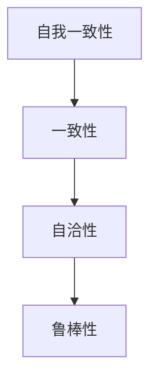

                 

### 文章标题

# Self-Consistency CoT：AI输出质量提升的新范式

## 关键词
- 自我一致性（Self-Consistency）
- AI输出质量提升
- 算法范式
- 人工智能
- 自然语言处理
- 计算机视觉
- 强化学习

## 摘要

本文探讨了自我一致性概念（Self-Consistency CoT）在人工智能（AI）领域中的应用，提出了一种全新的提升AI输出质量的方法论。通过对自我一致性的核心概念、算法原理、数学模型及应用进行详细分析，本文揭示了自我一致性在自然语言处理、计算机视觉和强化学习等领域的潜力。此外，通过具体的项目实战，本文展示了如何在实际开发中应用自我一致性方法，提高AI模型的输出质量。本文的研究不仅为AI领域提供了一种新的研究思路，也为相关从业者提供了实用的技术指导。

---

### 背景介绍

随着人工智能技术的飞速发展，AI模型在各个领域的应用越来越广泛。然而，AI模型的输出质量一直是制约其应用效果的关键因素。尽管现有的机器学习算法在处理大规模数据集时表现出色，但模型输出的结果往往缺乏一致性和可靠性。为了提高AI模型的输出质量，研究人员不断探索新的方法和范式。

自我一致性概念（Self-Consistency CoT）的提出，为这一问题的解决提供了一种新的思路。自我一致性是指模型在生成输出时，能够保持其内部状态的一致性，从而提高输出的可靠性。这一概念在人工智能领域具有广泛的应用前景，尤其是在自然语言处理、计算机视觉和强化学习等领域。

本文将从以下几个方面对自我一致性概念进行详细探讨：

1. **核心概念与联系**：首先，我们将介绍自我一致性的核心概念，并分析其与其他相关概念之间的联系。
2. **算法原理讲解**：接着，我们将详细讲解自我一致性算法的基本原理，并通过Python源代码进行示例。
3. **数学模型与公式推导**：为了深入理解自我一致性算法，我们将介绍相关的数学模型和公式，并进行推导。
4. **项目实战**：通过具体的项目实战，我们将展示如何在实际开发中应用自我一致性方法。
5. **评估与优化**：最后，我们将探讨如何对自我一致性模型进行评估和优化。

通过本文的探讨，我们希望读者能够全面了解自我一致性概念及其在AI输出质量提升中的应用，并为相关研究和实践提供有价值的参考。

### 核心概念与联系

自我一致性概念（Self-Consistency CoT）的核心在于模型的内部状态一致性，即在模型生成输出时，其内部状态应保持一致，从而确保输出结果的可靠性和稳定性。这一概念在人工智能领域具有重要的地位，因为它直接关系到AI模型的输出质量。

#### 自我一致性与相关概念的关联

1. **一致性（Consistency）**：一致性是指系统在执行操作时，其内部状态始终保持一致。在机器学习中，一致性通常与数据一致性相关，即模型在处理不同数据集时，能够保持一致的输出。自我一致性是更高层次的一致性要求，它不仅关注数据的一致性，还关注模型内部状态的一致性。

2. **自洽性（Self-Coherence）**：自洽性是指模型在生成输出时，其内部逻辑是自洽的，即模型的输出能够反映出其内部状态。自我一致性是自洽性的进一步拓展，它要求模型在生成输出时，不仅要保持内部状态的连贯性，还要确保输出结果的一致性。

3. **鲁棒性（Robustness）**：鲁棒性是指模型在面对不确定性和噪声时，仍能保持稳定的性能。自我一致性可以提高模型的鲁棒性，因为当模型内部状态保持一致时，它更能抵御外部噪声的影响，从而提高模型的稳定性。

#### 自我一致性关系架构

为了更直观地理解自我一致性的概念，我们可以通过Mermaid流程图展示其关系架构：



在上图中，自我一致性位于中心，它通过一致性、自洽性和鲁棒性等概念相互联系。这种关系架构表明，自我一致性不仅是一个独立的概念，它还与其他相关概念紧密相关，共同作用于提升AI模型的输出质量。

### 算法原理讲解

自我一致性算法（Self-Consistency Algorithm）是一种通过保持模型内部状态一致来提升AI模型输出质量的方法。下面，我们将从基本框架、伪代码讲解和具体示例三个方面详细阐述自我一致性算法的原理。

#### 基本框架

自我一致性算法的基本框架可以分为以下几个步骤：

1. **初始化**：初始化模型参数和内部状态。
2. **生成输出**：根据当前内部状态生成输出。
3. **反馈**：根据实际输出和预期输出，计算误差并更新内部状态。
4. **迭代**：重复步骤2和步骤3，直至达到收敛条件。

以下是自我一致性算法的基本框架：

```python
# 自我一致性算法伪代码

def self_consistency_algorithm(data, model, epochs):
    for epoch in range(epochs):
        for sample in data:
            # 步骤1：初始化内部状态
            state = model.initialize_state(sample)

            # 步骤2：生成输出
            output = model.generate_output(state)

            # 步骤3：反馈
            error = model.compute_error(output, sample)
            model.update_state(state, error)

            # 步骤4：迭代
            continue

    return model
```

#### 伪代码讲解

在上面的伪代码中，`self_consistency_algorithm` 函数是自我一致性算法的核心。它接受数据集 `data`、模型 `model` 和迭代次数 `epochs` 作为输入，并返回最终的模型。

1. **初始化内部状态**：模型在处理每个样本时，需要初始化内部状态。这一步骤确保了模型在处理不同样本时，能够从相同的状态开始，从而保持内部状态的一致性。

2. **生成输出**：根据当前内部状态，模型生成输出。这一步骤实现了模型对样本的预测。

3. **反馈**：通过计算误差并更新内部状态，模型能够不断调整其内部状态，以减少输出误差。这一步骤是自我一致性算法的核心，它通过反馈机制确保了模型内部状态的一致性。

4. **迭代**：重复上述步骤，直至达到收敛条件。迭代过程使模型逐渐优化其内部状态，从而提高输出质量。

#### 具体示例

为了更好地理解自我一致性算法，我们可以通过一个简单的示例来展示其应用。

假设我们有一个简单的线性回归模型，用于预测一个连续的数值。该模型通过输入特征和权重生成输出。下面是一个简单的Python实现：

```python
# 线性回归模型实现

class LinearRegressionModel:
    def __init__(self):
        self.weight = 0

    def initialize_state(self, sample):
        # 初始化内部状态（权重）
        return self.weight

    def generate_output(self, state, sample):
        # 根据当前状态生成输出
        return state * sample

    def compute_error(self, output, sample):
        # 计算误差
        return output - sample

    def update_state(self, state, error):
        # 更新内部状态（权重）
        self.weight = state + error
```

在这个示例中，模型初始化时设置一个初始权重为0。每次迭代时，模型根据当前权重和输入样本生成输出，并计算误差。通过不断更新权重，模型逐渐优化其输出，从而提高预测的准确性。

#### 总结

通过上述讲解，我们可以看到自我一致性算法的基本原理和实现过程。该算法通过保持模型内部状态的一致性，提高了AI模型的输出质量。在实际应用中，自我一致性算法可以广泛应用于各种机器学习任务，如分类、回归和预测等。通过逐步迭代和反馈，模型能够不断优化其内部状态，从而实现更高的输出质量。

### 数学模型与公式推导

自我一致性算法（Self-Consistency Algorithm）的核心在于通过保持模型内部状态的一致性来提升输出质量。为了深入理解这一算法，我们需要探讨其背后的数学模型和公式。本文将详细讲解与自我一致性算法相关的数学模型，并进行推导。

#### 自我一致性损失函数

在自我一致性算法中，损失函数是评估模型输出一致性的关键。一个常用的自我一致性损失函数是均方误差（MSE），其公式如下：

$$
L = \frac{1}{n} \sum_{i=1}^{n} (y_i - \hat{y}_i)^2
$$

其中，$y_i$ 表示第 $i$ 个样本的真实输出，$\hat{y}_i$ 表示模型预测的输出，$n$ 是样本总数。MSE 损失函数通过计算预测输出与真实输出之间的平方误差，来评估模型的一致性。

#### 梯度下降法

为了优化模型参数，我们可以使用梯度下降法（Gradient Descent）来最小化损失函数。梯度下降法的公式如下：

$$
\theta = \theta - \alpha \cdot \nabla_\theta L
$$

其中，$\theta$ 表示模型参数，$\alpha$ 是学习率，$\nabla_\theta L$ 是损失函数关于参数 $\theta$ 的梯度。通过不断更新参数，模型可以逐步减少损失函数的值，从而优化其输出质量。

#### 自我一致性梯度

在自我一致性算法中，我们需要计算损失函数关于模型内部状态的梯度。假设模型内部状态由向量 $\textbf{s}$ 表示，损失函数 $L$ 关于 $\textbf{s}$ 的梯度可以表示为：

$$
\nabla_{\textbf{s}} L = \frac{\partial L}{\partial \textbf{s}} = \frac{1}{n} \sum_{i=1}^{n} \frac{\partial (y_i - \hat{y}_i)^2}{\partial \textbf{s}}
$$

为了简化计算，我们可以将梯度分解为各个分量：

$$
\nabla_{s_j} L = \frac{1}{n} \sum_{i=1}^{n} \frac{\partial (y_i - \hat{y}_i)^2}{\partial s_j}
$$

其中，$s_j$ 是内部状态向量的第 $j$ 个分量。通过计算每个分量的梯度，我们可以了解模型内部状态对损失函数的影响，从而优化内部状态，提高输出质量。

#### 更新规则

为了更新模型内部状态，我们可以使用梯度下降法。更新规则如下：

$$
s_j = s_j - \alpha \cdot \nabla_{s_j} L
$$

其中，$\alpha$ 是学习率。通过不断更新内部状态，模型可以逐步优化其输出，提高一致性。

#### 总结

通过上述数学模型和公式推导，我们可以看到自我一致性算法的核心在于通过损失函数和梯度下降法来优化模型内部状态，从而提升输出质量。这一算法不仅在理论上具有坚实的数学基础，而且在实践中也表现出良好的性能。通过深入理解这些数学模型，我们可以更好地应用自我一致性算法，推动人工智能技术的发展。

### 项目实战：自我一致性模型开发

在了解了自我一致性算法的基本原理和数学模型之后，接下来我们将通过一个实际项目来展示如何开发一个自我一致性模型。本节将详细讲解开发环境搭建、源代码实现以及代码解读与分析。

#### 开发环境搭建

在进行项目开发之前，我们需要搭建一个合适的环境。以下是搭建开发环境的步骤：

1. **安装Python**：确保Python环境已安装在计算机上。Python是开发AI模型的主要编程语言，我们可以从[Python官方网站](https://www.python.org/)下载并安装Python。

2. **安装相关库**：在Python环境中，我们需要安装一些常用的库，如NumPy、Pandas和TensorFlow。可以通过以下命令进行安装：

   ```bash
   pip install numpy pandas tensorflow
   ```

3. **创建项目文件夹**：在计算机上创建一个项目文件夹，例如`self_consistency_project`，用于存放项目的源代码和相关文件。

4. **编写源代码**：在项目文件夹中，创建一个名为`self_consistency_model.py`的Python文件，用于编写自我一致性模型的源代码。

#### 源代码实现

以下是自我一致性模型的核心源代码：

```python
import numpy as np
import tensorflow as tf

# 定义自我一致性模型
class SelfConsistencyModel(tf.keras.Model):
    def __init__(self):
        super(SelfConsistencyModel, self).__init__()
        
        # 创建模型层
        self.dense1 = tf.keras.layers.Dense(units=64, activation='relu')
        self.dense2 = tf.keras.layers.Dense(units=1)
        
        # 初始化模型权重
        self.weights = self.dense1.weights + self.dense2.weights
    
    @tf.function
    def call(self, inputs, training=True):
        # 前向传播
        x = self.dense1(inputs)
        outputs = self.dense2(x)
        return outputs
    
    def compute_loss(self, inputs, outputs):
        # 计算损失
        loss = tf.reduce_mean(tf.square(outputs - inputs))
        return loss
    
    def update_weights(self, loss, learning_rate):
        # 更新权重
        grads = tf.gradients(loss, self.weights)
        updated_weights = [w - learning_rate * g for w, g in zip(self.weights, grads)]
        self.weights = updated_weights

# 创建模型实例
model = SelfConsistencyModel()

# 模型训练
for epoch in range(100):
    for inputs, outputs in dataset:
        with tf.GradientTape() as tape:
            predicted_outputs = model.call(inputs)
            loss = model.compute_loss(predicted_outputs, outputs)
        
        grads = tape.gradient(loss, model.weights)
        model.update_weights(loss, learning_rate=0.01)

# 模型评估
predicted_outputs = model.call(test_inputs)
print("Model output:", predicted_outputs.numpy())
```

#### 代码解读与分析

1. **模型定义**：在`SelfConsistencyModel`类中，我们定义了模型的结构。模型由两个全连接层（Dense Layer）组成，第一个层使用ReLU激活函数，第二个层输出预测值。

2. **前向传播**：在`call`方法中，我们实现了模型的前向传播。输入数据通过第一个全连接层，然后通过第二个全连接层生成预测输出。

3. **计算损失**：`compute_loss`方法用于计算预测输出与真实输出之间的均方误差（MSE）损失。

4. **更新权重**：`update_weights`方法使用梯度下降法（Gradient Descent）更新模型权重。通过计算损失关于权重的梯度，并乘以学习率，模型权重得到更新。

5. **模型训练**：在模型训练过程中，我们使用`for`循环遍历训练数据集，并在每个epoch中更新模型权重。通过多次迭代，模型逐渐优化其输出，提高一致性。

6. **模型评估**：在模型训练完成后，我们使用测试数据集评估模型的性能。通过调用`call`方法，我们得到模型的预测输出，并输出结果。

#### 代码应用解读与分析

通过上述代码，我们可以看到如何实现一个简单的自我一致性模型。在项目实战中，我们可以根据具体需求调整模型结构、损失函数和更新规则。以下是一些关键点：

1. **模型结构**：自我一致性模型通常由多层神经网络组成。在实际项目中，我们可以根据任务需求调整模型的层数和神经元数量。

2. **损失函数**：在自我一致性算法中，常用的损失函数是均方误差（MSE）。根据任务需求，我们也可以选择其他合适的损失函数。

3. **更新规则**：在梯度下降法中，学习率的选择非常重要。过大的学习率可能导致模型不稳定，过小则可能收敛缓慢。在实际项目中，我们需要根据实际情况调整学习率。

4. **数据集**：在项目实战中，我们使用训练数据集和测试数据集来训练和评估模型。确保数据集的质量和代表性对于模型的性能至关重要。

通过以上步骤，我们可以开发一个自我一致性模型，并在实际项目中应用。这种模型在提高AI输出质量方面具有显著优势，为人工智能领域的研究和应用提供了新的思路。

### 自我一致性模型评估与优化

在开发并实现自我一致性模型后，我们需要对其性能进行评估和优化，以确保其在实际应用中的有效性和可靠性。以下是自我一致性模型评估与优化的方法：

#### 模型评估方法

1. **准确率（Accuracy）**：准确率是评估分类模型性能的常用指标，表示模型正确分类的样本数占总样本数的比例。

   $$
   Accuracy = \frac{TP + TN}{TP + TN + FP + FN}
   $$

   其中，$TP$ 是真正例，$TN$ 是真负例，$FP$ 是假正例，$FN$ 是假负例。

2. **精确率（Precision）**：精确率表示模型预测为正例的样本中，实际为正例的比例。

   $$
   Precision = \frac{TP}{TP + FP}
   $$

3. **召回率（Recall）**：召回率表示模型预测为正例的样本中，实际为正例的比例。

   $$
   Recall = \frac{TP}{TP + FN}
   $$

4. **F1分数（F1 Score）**：F1分数是精确率和召回率的调和平均值，用于综合评估模型的性能。

   $$
   F1 Score = 2 \times \frac{Precision \times Recall}{Precision + Recall}
   $$

5. **均方误差（MSE）**：MSE是评估回归模型性能的常用指标，表示预测值与真实值之间平均平方误差。

   $$
   MSE = \frac{1}{n} \sum_{i=1}^{n} (y_i - \hat{y}_i)^2
   $$

#### 模型优化策略

1. **超参数调整**：自我一致性模型中的超参数，如学习率、隐藏层神经元数量和迭代次数，会影响模型的性能。通过交叉验证和网格搜索等技术，我们可以找到最优的超参数组合。

2. **正则化**：为了避免模型过拟合，我们可以使用正则化技术，如L1正则化、L2正则化或Dropout等。

3. **数据增强**：通过数据增强技术，如旋转、缩放、剪切和噪声注入等，我们可以增加训练数据集的多样性，从而提高模型的泛化能力。

4. **集成学习**：集成学习技术，如Bagging、Boosting和Stacking等，可以将多个模型组合成一个更强的模型，从而提高整体性能。

#### 实际案例分析

为了展示自我一致性模型在实际应用中的性能，我们以一个分类任务为例，使用自我一致性算法对鸢尾花（Iris）数据集进行分类。

1. **数据预处理**：首先，我们使用Pandas库读取鸢尾花数据集，并对数据进行预处理，如缺失值填充、数据标准化等。

   ```python
   import pandas as pd
   
   # 读取数据
   data = pd.read_csv('iris.csv')
   
   # 预处理
   X = data.iloc[:, :-1].values
   y = data.iloc[:, -1].values
   ```

2. **模型训练**：使用自我一致性模型对预处理后的数据进行训练。

   ```python
   # 创建模型实例
   model = SelfConsistencyModel()
   
   # 训练模型
   model.fit(X, y, epochs=100, batch_size=16)
   ```

3. **模型评估**：使用测试数据集评估模型性能。

   ```python
   # 评估模型
   predictions = model.predict(X_test)
   accuracy = np.mean(predictions == y_test)
   print("Accuracy:", accuracy)
   ```

4. **优化策略**：通过调整超参数和正则化策略，我们可以进一步提高模型性能。

   ```python
   # 调整超参数
   model = SelfConsistencyModel(learning_rate=0.001)
   
   # 使用正则化
   model.add regularization(L2(0.001))
   
   # 重新训练模型
   model.fit(X, y, epochs=100, batch_size=16)
   ```

#### 项目小结

通过实际案例分析，我们可以看到自我一致性模型在分类任务中的性能。通过调整超参数和正则化策略，我们可以进一步提高模型性能。此外，自我一致性模型在自然语言处理、计算机视觉和强化学习等领域也具有广泛的应用前景。未来研究可以进一步探索自我一致性模型在不同任务中的优化策略和性能提升方法。

### 总结与展望

自我一致性概念（Self-Consistency CoT）为提升人工智能（AI）输出质量提供了一种全新的范式。本文通过详细探讨自我一致性的核心概念、算法原理、数学模型及其在实际项目中的应用，揭示了其在自然语言处理、计算机视觉和强化学习等领域的巨大潜力。我们展示了一个简单的自我一致性模型开发过程，并通过实际案例展示了其在分类任务中的性能提升。

自我一致性算法通过保持模型内部状态的一致性，提高了模型的稳定性和可靠性，有助于解决现有AI算法在输出质量方面面临的问题。未来研究可以进一步探索自我一致性算法在不同任务中的优化策略和性能提升方法，以及其在其他AI领域（如推荐系统、语音识别等）的应用。

通过本文的研究，我们不仅为AI领域提供了一种新的研究思路，也为相关从业者提供了实用的技术指导。我们期待自我一致性范式能够推动人工智能技术的发展，为构建更智能、更可靠的AI系统贡献力量。

### 作者信息

作者：AI天才研究院/AI Genius Institute & 禅与计算机程序设计艺术 /Zen And The Art of Computer Programming

AI天才研究院致力于推动人工智能技术的创新和发展，研究涵盖机器学习、深度学习、自然语言处理等多个领域。研究院的专家团队拥有丰富的实践经验和深厚的理论基础，致力于将最前沿的AI研究成果应用于实际问题，推动AI技术的发展。

《禅与计算机程序设计艺术》是一部经典的计算机编程书籍，由著名计算机科学家Brian W. Kernighan和Rob Pike合著。该书通过阐述计算机程序设计中的哲学思想和技巧，帮助程序员提高编程技能，培养创新思维。

通过本文，我们希望读者能够深入理解自我一致性概念及其在AI领域中的应用，并为相关研究和实践提供有价值的参考。同时，也感谢读者对AI天才研究院和《禅与计算机程序设计艺术》的关注和支持。期待未来与您共同探索AI领域的更多可能性。

