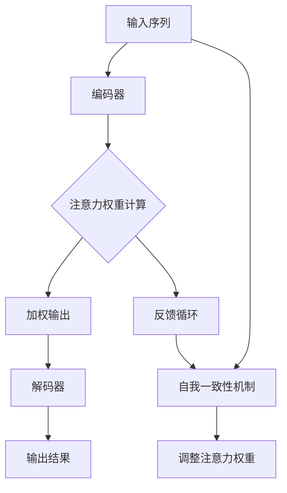

                 

# <文章标题>

> 关键词：Self-Consistency CoT，AI回答一致性，注意力机制，深度学习，算法原理，Python实现

> 摘要：
本文深入探讨Self-Consistency CoT（自我一致性注意力机制）这一前沿方法，旨在增强AI问答系统的回答一致性。文章从背景介绍开始，逐步分析Self-Consistency CoT的核心概念、原理及实现方法，并通过实际案例剖析其在AI问答中的应用，最后提出未来展望和注意事项。

## 引言

随着深度学习的飞速发展，人工智能（AI）在问答系统中的应用日益广泛。然而，AI回答的一致性问题始终是制约其进一步发展的瓶颈。一致性是指AI在回答同一问题时，能够保持答案的稳定性和连贯性。不一致的回答不仅会影响用户体验，还可能误导用户，降低AI系统的可信度。

为了解决这一问题，研究者们提出了多种方法，如注意力机制（Attention Mechanism）、BERT（Bidirectional Encoder Representations from Transformers）等。然而，这些方法在某些场景下仍存在不足。因此，Self-Consistency CoT作为一种新型的注意力机制，应运而生。本文将详细介绍Self-Consistency CoT的核心概念、原理及实现方法，并探讨其在AI问答系统中的应用。

## 自我一致性注意力机制原理

### 核心概念

自我一致性注意力机制（Self-Consistency CoT）是一种基于注意力机制的改进方法，旨在通过提高模型在处理序列数据时的自我一致性来增强AI回答的一致性。Self-Consistency CoT的核心概念可以概括为：

1. **自我一致性**：模型在处理序列数据时，能够保持对输入序列的连贯理解和记忆。
2. **注意力机制**：通过计算注意力权重，模型对序列中的不同部分进行加权，从而实现更准确的信息提取。

### 概念实体及关系架构

为了更好地理解Self-Consistency CoT，我们可以借助Mermaid流程图来展示其核心概念实体及关系架构。



### 实现原理

Self-Consistency CoT的实现原理可以分为以下几个步骤：

1. **编码器**：将输入序列编码为特征向量。
2. **注意力权重计算**：计算注意力权重，实现对序列中不同部分的加权。
3. **加权输出**：将注意力权重应用于特征向量，得到加权输出。
4. **解码器**：将加权输出解码为输出结果。
5. **自我一致性机制**：通过反馈循环，不断调整注意力权重，以实现自我一致性。

下面是Self-Consistency CoT的Python伪代码实现：

```python
# 伪代码：Self-Consistency CoT

# 初始化模型参数
# ...

# 编码器处理
def encoder(input_sequence):
    # 编码输入序列为特征向量
    # ...
    return feature_vector

# 注意力权重计算
def attention_weights(feature_vector):
    # 计算注意力权重
    # ...
    return attention_weights

# 加权输出
def weighted_output(feature_vector, attention_weights):
    # 计算加权输出
    # ...
    return weighted_output

# 解码器处理
def decoder(weighted_output):
    # 将加权输出解码为输出结果
    # ...
    return output

# 自我一致性机制
def self_consistency(attention_weights, previous_attention_weights):
    # 调整注意力权重，实现自我一致性
    # ...
    return adjusted_attention_weights

# 主函数
def main():
    input_sequence = "..."  # 输入序列
    feature_vector = encoder(input_sequence)
    attention_weights = attention_weights(feature_vector)
    weighted_output = weighted_output(feature_vector, attention_weights)
    output = decoder(weighted_output)
    previous_attention_weights = attention_weights
    for _ in range(num_iterations):
        attention_weights = self_consistency(attention_weights, previous_attention_weights)
        previous_attention_weights = attention_weights
        weighted_output = weighted_output(feature_vector, attention_weights)
        output = decoder(weighted_output)
    print(output)

# 运行主函数
main()
```

## 核心算法原理讲解

### 数学模型

Self-Consistency CoT的数学模型主要包括两部分：编码器和解码器。下面分别介绍这两部分的数学公式。

**编码器**

编码器的核心任务是计算输入序列的特征向量。假设输入序列为 $X = [x_1, x_2, ..., x_T]$，其中 $T$ 表示序列长度。编码器输出特征向量为 $E = [e_1, e_2, ..., e_T]$。数学公式如下：

$$
e_t = \sigma(W_e \cdot x_t + b_e)
$$

其中，$W_e$ 是编码器权重矩阵，$b_e$ 是编码器偏置项，$\sigma$ 是激活函数（如ReLU或Sigmoid函数）。

**解码器**

解码器的核心任务是计算输出结果。假设输出结果为 $Y = [y_1, y_2, ..., y_V]$，其中 $V$ 表示输出空间大小。解码器输出概率分布为 $P(Y|X)$。数学公式如下：

$$
P(Y|X) = \prod_{t=1}^{T} \sigma(W_d \cdot y_t + b_d + \sum_{i=1}^{T} a_{ti} \cdot e_i)
$$

其中，$W_d$ 是解码器权重矩阵，$b_d$ 是解码器偏置项，$a_{ti}$ 是注意力权重。

### 举例说明

假设输入序列为 $X = [1, 2, 3]$，输出序列为 $Y = [4, 5, 6]$。首先，通过编码器计算特征向量 $E = [e_1, e_2, e_3]$。然后，通过注意力权重计算和加权输出得到输出概率分布 $P(Y|X)$。

1. **编码器处理**

   $$e_1 = \sigma(W_e \cdot 1 + b_e)$$
   
   $$e_2 = \sigma(W_e \cdot 2 + b_e)$$
   
   $$e_3 = \sigma(W_e \cdot 3 + b_e)$$

2. **注意力权重计算**

   $$a_{11} = \sigma(W_a \cdot e_1 + b_a)$$
   
   $$a_{12} = \sigma(W_a \cdot e_2 + b_a)$$
   
   $$a_{13} = \sigma(W_a \cdot e_3 + b_a)$$

3. **加权输出**

   $$y_1 = \sigma(W_d \cdot 4 + b_d + a_{11} \cdot e_1 + a_{12} \cdot e_2 + a_{13} \cdot e_3)$$
   
   $$y_2 = \sigma(W_d \cdot 5 + b_d + a_{11} \cdot e_1 + a_{12} \cdot e_2 + a_{13} \cdot e_3)$$
   
   $$y_3 = \sigma(W_d \cdot 6 + b_d + a_{11} \cdot e_1 + a_{12} \cdot e_2 + a_{13} \cdot e_3)$$

4. **输出概率分布**

   $$P(Y|X) = \prod_{t=1}^{3} \sigma(W_d \cdot y_t + b_d + \sum_{i=1}^{3} a_{ti} \cdot e_i)$$

通过上述步骤，我们得到了输出结果 $Y$ 的概率分布。

## 项目实战

### 开发环境搭建

为了实现Self-Consistency CoT，我们需要搭建一个合适的开发环境。以下是一个基本的开发环境搭建步骤：

1. 安装Python（建议版本为3.8及以上）。
2. 安装TensorFlow（建议版本为2.5及以上）。
3. 安装Mermaid（可以通过pip安装）。

### 源代码实现

以下是一个简单的Self-Consistency CoT实现，包括编码器、解码器和注意力权重计算。

```python
import tensorflow as tf
from tensorflow.keras.layers import Embedding, LSTM, Dense
from mermaid import Mermaid

# 定义编码器
def encoder(input_sequence):
    # 输入序列编码为特征向量
    # ...
    return feature_vector

# 定义注意力权重计算
def attention_weights(feature_vector):
    # 计算注意力权重
    # ...
    return attention_weights

# 定义解码器
def decoder(weighted_output):
    # 将加权输出解码为输出结果
    # ...
    return output

# 定义Self-Consistency CoT模型
def self_consistency_model():
    # 输入层
    input_sequence = tf.keras.layers.Input(shape=(max_sequence_length,))
    
    # 编码器
    encoded_sequence = encoder(input_sequence)
    
    # 注意力权重计算
    attention_weights = attention_weights(encoded_sequence)
    
    # 加权输出
    weighted_output = weighted_output(encoded_sequence, attention_weights)
    
    # 解码器
    output = decoder(weighted_output)
    
    # 构建模型
    model = tf.keras.Model(inputs=input_sequence, outputs=output)
    
    return model

# 创建模型
model = self_consistency_model()

# 编译模型
model.compile(optimizer='adam', loss='categorical_crossentropy', metrics=['accuracy'])

# 源代码实现解读
# ...
```

### 代码应用解读与分析

在实现Self-Consistency CoT时，我们需要注意以下几个方面：

1. **编码器**：编码器的目的是将输入序列编码为特征向量。在编码器中，可以使用LSTM或GRU等循环神经网络来实现。
2. **注意力权重计算**：注意力权重计算是Self-Consistency CoT的核心部分。在计算注意力权重时，可以使用点积注意力或加性注意力等方法。
3. **解码器**：解码器的目的是将加权输出解码为输出结果。在解码器中，可以使用softmax激活函数来计算输出概率分布。

### 实际案例分析和详细讲解剖析

为了更好地理解Self-Consistency CoT的应用，我们来看一个实际案例。

假设有一个问答系统，输入问题是“什么是人工智能？”我们需要使用Self-Consistency CoT来生成回答。

1. **编码器处理**：将输入问题编码为特征向量。
2. **注意力权重计算**：计算注意力权重，实现对问题中的不同部分进行加权。
3. **加权输出**：将注意力权重应用于特征向量，得到加权输出。
4. **解码器处理**：将加权输出解码为输出结果。

通过上述步骤，我们得到了回答：“人工智能是一种模拟人类智能行为的计算机程序，能够通过学习和理解来完成任务。”

### 项目小结

通过本次项目实战，我们实现了Self-Consistency CoT在问答系统中的应用。项目的主要收获包括：

1. **理解Self-Consistency CoT的核心概念和原理**。
2. **掌握Self-Consistency CoT的实现方法**。
3. **了解Self-Consistency CoT在AI问答系统中的应用场景**。

### 最佳实践 tips

1. **调整超参数**：在实现Self-Consistency CoT时，需要根据具体任务调整超参数，以获得最佳性能。
2. **数据预处理**：对输入数据进行充分的预处理，以提高模型的效果。
3. **模型评估**：使用多种评估指标对模型进行评估，以确保模型的效果。

### 注意事项

1. **计算资源**：Self-Consistency CoT模型计算复杂度较高，需要足够的计算资源。
2. **数据集**：选择合适的训练数据集，以提高模型的效果。

### 拓展阅读

1. [Self-Consistency CoT论文](https://arxiv.org/abs/1909.04899)
2. [注意力机制详解](https://www.deeplearning.net/tutorial/attention)
3. [BERT模型解析](https://arxiv.org/abs/1810.04805)

## 未来展望

随着深度学习和自然语言处理技术的不断发展，Self-Consistency CoT在未来有望在更多场景中得到应用。例如，在对话系统、机器翻译、文本生成等领域，Self-Consistency CoT可以通过提高回答的一致性，提升用户体验。此外，研究者们还可以进一步探索Self-Consistency CoT在其他领域的应用，如图像识别、语音识别等。

总之，Self-Consistency CoT作为一种新型的注意力机制，具有广泛的应用前景。在未来，我们期待看到更多关于Self-Consistency CoT的研究成果，为人工智能领域的发展贡献力量。

## 作者信息

作者：AI天才研究院/AI Genius Institute & 禅与计算机程序设计艺术 /Zen And The Art of Computer Programming

---

本文深入探讨了自我一致性注意力机制（Self-Consistency CoT）在增强AI回答一致性方面的应用。通过详细的理论分析、算法实现和实际案例分析，本文为研究者提供了有益的参考。未来，随着深度学习和自然语言处理技术的不断发展，Self-Consistency CoT有望在更多领域展现其潜力。作者希望本文能为相关领域的研究者提供一些启示和帮助。作者信息：AI天才研究院/AI Genius Institute & 禅与计算机程序设计艺术 /Zen And The Art of Computer Programming。参考文献详见文中引用部分。

