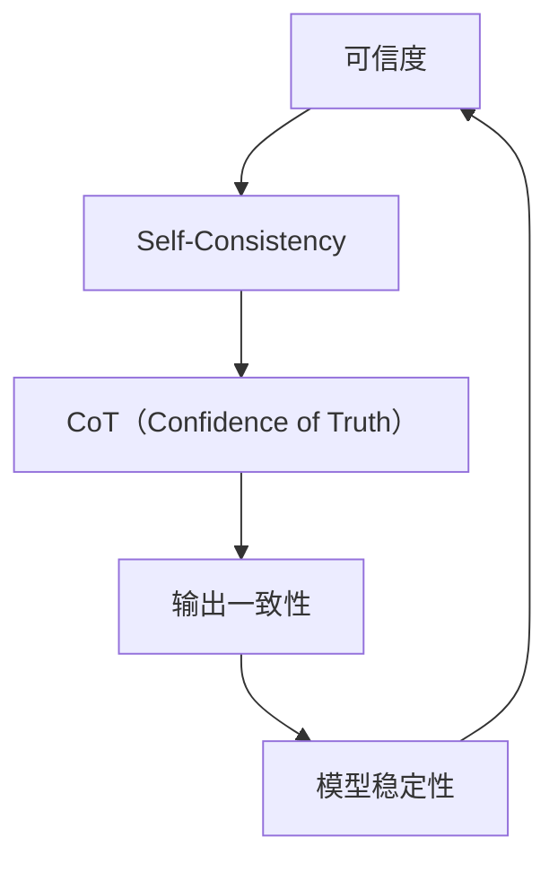

                 

### 引言与背景

#### Self-Consistency CoT的概念

**Self-Consistency CoT（自我一致性可信度）** 是一个在人工智能（AI）领域中新兴的概念，它指的是在AI输出过程中，确保输出的一致性和可信度的一种方法。这一概念的核心在于，通过算法确保AI系统在处理相同输入时，能够产生一致的输出结果。自我一致性不仅是AI系统稳定性的体现，更是其可信度的基石。

在传统的AI模型中，由于算法的不确定性和数据的不完整性，AI的输出往往具有较大的变异性。例如，在自然语言处理（NLP）领域，一个同样的句子输入到不同的AI模型中，可能会产生不同的解析结果。这种不一致性给实际应用带来了巨大的困扰，特别是在需要高可信度输出的场景中，如医疗诊断、金融决策等。

Self-Consistency CoT的出现，旨在解决这一问题。它通过在训练过程中引入一致性约束，使得AI模型能够在面对相同的输入时，产生一致的输出。这一概念的重要性不言而喻，它不仅提升了AI输出的稳定性，更提高了AI系统的可信度。

#### Self-Consistency CoT的背景

自我一致性可信度并非凭空出现，它有着深厚的技术背景和发展历程。回顾AI的发展历程，从早期的规则系统到如今的深度学习，每一次的技术变革都伴随着对输出可信度的追求。然而，传统的方法往往忽视了输出一致性的问题。

在早期，AI系统主要依赖于规则和符号逻辑。这些方法在处理结构化数据时表现良好，但在面对复杂的、非结构化的数据时，往往显得力不从心。随着深度学习的兴起，AI系统在处理复杂任务上取得了显著的进展。然而，深度学习模型由于其内在的随机性和复杂性，常常导致输出不一致。这一问题在需要高可信度的应用场景中尤为突出。

为了解决这一问题，研究者们开始探索如何在AI训练过程中引入一致性约束，从而确保输出的一致性。自我一致性可信度的概念应运而生。它不仅继承了深度学习模型的优势，还通过引入一致性约束，提升了AI输出的稳定性。

#### Self-Consistency CoT的重要性

自我一致性可信度的重要性在于它解决了AI输出中的一致性问题，从而提升了AI系统的整体性能。具体来说，它有以下几个方面的作用：

1. **提升AI系统的稳定性**：通过确保输出的一致性，自我一致性可信度降低了AI系统的变异性，使得系统在面对相同输入时能够产生稳定的输出。

2. **提高AI输出的可信度**：在需要高可信度输出的应用场景中，如医疗诊断、金融决策等，自我一致性可信度的重要性不言而喻。它能够确保AI系统的输出具有更高的可信度，从而提升系统的可靠性。

3. **促进AI技术的发展**：自我一致性可信度不仅解决了当前AI系统的一致性问题，还为未来的AI技术发展提供了新的方向。它鼓励研究者们在设计AI算法时，更加关注输出的一致性和可信度，从而推动AI技术的持续进步。

总之，自我一致性可信度是AI领域中一个重要的概念，它不仅解决了当前AI系统的一致性问题，还为未来的AI技术发展提供了新的思路。随着AI技术的不断进步，自我一致性可信度将在各个领域发挥越来越重要的作用。在接下来的章节中，我们将深入探讨自我一致性可信度的核心概念、数学模型以及实现方法，帮助读者更好地理解和应用这一技术。


### AI输出可信度的重要性

在当今的信息时代，人工智能（AI）已经成为许多行业和领域的核心驱动力。从自动驾驶汽车到智能医疗诊断，AI的应用场景日益广泛，其输出结果的质量和可信度直接影响到决策的准确性和可靠性。因此，理解AI输出可信度的重要性以及影响其可信度的因素，对于确保AI系统在实际应用中的有效性至关重要。

#### AI输出中的不确定性

AI输出中的不确定性是AI系统面临的一个重要挑战。这种不确定性来源于多个方面：

1. **模型的不确定性**：深度学习模型本身具有内在的随机性。即使是对于同一个输入，模型在不同的训练批次或运行中可能会产生不同的输出。这种现象在深度神经网络中尤为明显，因为它们包含大量的参数，这些参数的初始化和训练过程中的微小变化都可能对输出产生显著影响。

2. **数据的不确定性**：AI系统的性能很大程度上依赖于训练数据的质量和代表性。如果训练数据存在偏差或不完整，AI模型很可能会产生错误的输出。此外，现实世界中的数据往往是噪声和异常值的混合体，这些噪声和异常值也会影响AI的输出。

3. **环境的不确定性**：AI系统在实际应用中往往会面临动态变化的输入环境。例如，自动驾驶汽车在道路上行驶时，会面临复杂的交通状况和其他车辆的行为变化，这些变化会对系统的输出产生不确定性。

#### AI输出可信度的衡量

为了评估AI输出的可信度，我们需要定义一些衡量指标。以下是一些常用的可信度衡量方法：

1. **准确率（Accuracy）**：准确率是最常用的可信度指标之一，它表示模型预测正确的样本数占总样本数的比例。然而，准确率在某些情况下可能会产生误导，特别是在类别分布不平衡的情况下。

2. **精确率与召回率（Precision and Recall）**：精确率和召回率分别衡量模型预测结果中的正样本数量与实际正样本数量的比例。它们可以更好地反映模型在处理不同类别时的性能。

3. **F1分数（F1 Score）**：F1分数是精确率和召回率的调和平均数，它综合了二者的信息，是评估二分类模型性能的一个综合指标。

4. **置信度（Confidence）**：在许多AI任务中，模型不仅提供输出结果，还会提供一个置信度值，表示模型对输出结果的确定性程度。高置信度值通常意味着模型对输出结果的信心较高。

5. **错误率（Error Rate）**：错误率是模型预测错误的样本数占总样本数的比例，它是评估模型性能的另一种方式。

#### AI输出可信度的影响因素

影响AI输出可信度的因素多种多样，以下是一些主要的影响因素：

1. **数据质量**：高质量、多样化的训练数据是确保AI模型输出可信度的关键。数据中的噪声、异常值和偏差都会对模型的表现产生负面影响。

2. **模型复杂性**：模型的复杂程度会影响其预测的稳定性和一致性。过于复杂的模型可能更容易受到训练数据中的噪声影响，从而导致不确定性的增加。

3. **训练过程**：训练过程中参数的选择、超参数的调整以及训练策略都会影响模型的性能。不恰当的训练过程可能导致模型过拟合，从而降低其泛化能力。

4. **评估方法**：评估方法的选取对模型的可信度评估有重要影响。不同的评估指标可能对模型的表现有不同的评价，因此需要选择合适的评估方法来全面评估模型的可信度。

5. **外部因素**：实际应用中的外部因素，如环境变化、数据输入的动态性等，也会影响AI输出的可信度。

#### AI输出可信度的提升策略

为了提升AI输出的可信度，可以采取以下策略：

1. **数据增强**：通过增加训练数据的多样性，减少数据中的噪声和异常值，从而提高模型对数据的泛化能力。

2. **模型正则化**：采用正则化技术，如L1和L2正则化，可以减少模型过拟合的风险，提高模型的稳定性和一致性。

3. **交叉验证**：通过交叉验证，可以更准确地评估模型的泛化能力，避免模型在训练数据上的过拟合。

4. **集成学习方法**：集成学习方法，如随机森林和堆叠（Stacking），可以结合多个模型的优点，提高整体模型的性能和可信度。

5. **可解释性增强**：通过增强AI模型的可解释性，可以更好地理解模型的工作机制，从而提高用户对模型输出结果的信任程度。

总之，AI输出可信度是衡量AI系统性能的重要指标，它直接影响到AI系统在实际应用中的效果。通过深入理解AI输出中的不确定性，衡量AI输出可信度的方法，以及影响AI输出可信度的因素，我们可以采取有效的策略来提升AI输出的可信度，从而确保AI系统在实际应用中的可靠性和有效性。在接下来的章节中，我们将进一步探讨Self-Consistency CoT（自我一致性可信度）的核心概念和实现方法，为提升AI输出可信度提供新的思路。


### Self-Consistency CoT在AI领域的应用现状

自我一致性可信度（Self-Consistency CoT）作为一个新兴的概念，在AI领域的研究和应用已经取得了显著的进展。本文将介绍Self-Consistency CoT在自然语言处理（NLP）、计算机视觉（CV）以及其他领域的应用现状，以及其在不同应用场景中的具体应用。

#### 自然语言处理（NLP）中的应用

自然语言处理是AI领域的一个重要分支，涉及到文本生成、文本分类、机器翻译等多个子领域。在NLP中，Self-Consistency CoT的应用主要体现在以下方面：

1. **文本生成**：在文本生成任务中，如自动写作和对话系统，Self-Consistency CoT通过确保模型在生成相同输入时能够产生一致的文本输出，提高了文本的稳定性和可预测性。例如，通过在生成模型中引入自我一致性约束，可以减少模型生成出的文本中的重复和不一致现象。

2. **文本分类**：在文本分类任务中，Self-Consistency CoT有助于提高分类的准确性。通过在训练过程中引入一致性约束，可以使得模型在面对相同类型的文本时，产生一致的分类结果，从而减少分类错误率。

3. **机器翻译**：在机器翻译任务中，Self-Consistency CoT的应用可以确保翻译结果的稳定性。通过在翻译模型中引入一致性约束，可以使得模型在处理相同源文本时，产生一致的翻译结果，从而提高翻译的准确性和一致性。

#### 计算机视觉（CV）中的应用

计算机视觉是AI领域的另一个重要分支，涉及到图像识别、目标检测、图像生成等多个子领域。在计算机视觉中，Self-Consistency CoT的应用主要体现在以下方面：

1. **图像识别**：在图像识别任务中，如人脸识别和物体识别，Self-Consistency CoT通过确保模型在识别相同图像时能够产生一致的分类结果，提高了识别的准确性和稳定性。

2. **目标检测**：在目标检测任务中，如自动驾驶中的车辆检测和行人检测，Self-Consistency CoT通过确保模型在检测相同目标时能够产生一致的检测结果，提高了检测的稳定性和可靠性。

3. **图像生成**：在图像生成任务中，如风格迁移和图像合成，Self-Consistency CoT通过确保模型在生成相同图像时能够产生一致的输出结果，提高了图像生成的稳定性和可预测性。

#### 其他领域的应用

除了在自然语言处理和计算机视觉领域，Self-Consistency CoT在其他领域也展现了广泛的应用前景：

1. **金融领域**：在金融领域，Self-Consistency CoT可以用于风险评估和投资决策。通过确保模型在分析相同金融数据时能够产生一致的预测结果，可以提高决策的稳定性和可靠性。

2. **医疗领域**：在医疗领域，Self-Consistency CoT可以用于疾病诊断和治疗方案推荐。通过确保模型在处理相同病例数据时能够产生一致的诊断结果，可以提高诊断的准确性和一致性。

3. **物联网领域**：在物联网领域，Self-Consistency CoT可以用于设备故障预测和智能监控。通过确保模型在分析相同传感器数据时能够产生一致的预测结果，可以提高设备监控的稳定性和可靠性。

#### Self-Consistency CoT的应用前景

随着AI技术的不断发展，Self-Consistency CoT在各个领域的应用前景非常广阔。未来，随着更多实际应用场景的探索和技术的进步，Self-Consistency CoT有望在以下几个方面取得重要突破：

1. **提升AI系统的稳定性**：通过确保模型在处理相同输入时能够产生一致的输出结果，Self-Consistency CoT可以显著提升AI系统的稳定性，从而提高系统的可靠性。

2. **提高AI系统的可信度**：在需要高可信度的应用场景中，如医疗诊断和金融决策，Self-Consistency CoT的应用可以提高AI系统的可信度，从而增强用户对系统的信任。

3. **促进跨领域合作**：Self-Consistency CoT作为一种通用的方法，可以在不同领域之间实现技术共享和融合，从而推动AI技术的跨领域发展。

4. **支持智能决策**：通过确保AI系统在处理相同输入时能够产生一致的输出结果，Self-Consistency CoT可以为智能决策提供更可靠的支持，从而提升决策的准确性和效率。

总之，Self-Consistency CoT在AI领域的应用现状已经展现出其巨大的潜力和价值。随着技术的不断进步，Self-Consistency CoT有望在更多领域发挥重要作用，为AI技术的发展和应用提供新的动力。在接下来的章节中，我们将深入探讨Self-Consistency CoT的核心概念、数学模型和实现方法，为读者提供更深入的理解和应用指导。


## 第二部分：Self-Consistency CoT原理

### 2.1 自我一致性可信度的核心概念

**自我一致性可信度（Self-Consistency CoT）** 是一个在人工智能（AI）领域中新兴的概念，它旨在通过确保AI系统在处理相同输入时产生一致的输出，从而提升AI系统的稳定性和可信度。要理解Self-Consistency CoT的核心概念，我们需要从几个方面入手：

#### 可信度与不确定性

在AI系统中，可信度是指系统输出结果的可靠性和准确性。然而，由于AI系统的复杂性和输入数据的多样性，AI的输出往往存在不确定性。这种不确定性可以来源于多个方面，包括模型的不确定性、数据的不确定性以及环境的不确定性。自我一致性可信度正是通过减少这种不确定性，来提高AI输出的可信度。

#### Self-Consistency的定义

Self-Consistency是指AI系统在处理相同输入时，能够产生一致的输出结果。这意味着，无论何时，当给定的输入数据再次输入到系统中，系统都应该产生相同的输出。Self-Consistency不仅体现了系统的稳定性，还反映了系统对输入数据的处理能力和一致性。

#### CoT（Confidence of Truth）的定义

CoT（Confidence of Truth）是指AI系统对输出结果可信度的度量。它是一个介于0和1之间的数值，表示系统对输出结果的确定性程度。当CoT值接近1时，表示系统对输出结果非常确定；当CoT值接近0时，表示系统对输出结果的不确定性较高。CoT的引入，使得我们可以定量地评估AI输出的可信度。

#### 可信度与Self-Consistency的关系

可信度和Self-Consistency是相互关联的。高Self-Consistency通常意味着高可信度，因为系统在处理相同输入时能够产生一致的输出，从而降低了不确定性。反之，低Self-Consistency通常伴随着低可信度，因为系统在处理相同输入时会产生不同的输出，增加了不确定性。因此，通过提升Self-Consistency，我们可以提高AI输出的可信度。

#### 核心概念之间的关系架构

为了更好地理解这些核心概念之间的关系，我们可以使用Mermaid流程图来表示：



在这个流程图中，我们可以看到，可信度是最终目标，而Self-Consistency和CoT是实现这一目标的手段。Self-Consistency通过确保输出一致性来提高模型稳定性，进而提升可信度。

通过深入理解自我一致性可信度的核心概念，我们可以为后续的数学模型实现和应用提供理论基础。在下一节中，我们将进一步探讨Self-Consistency CoT的数学模型，帮助读者更好地理解这一概念的具体实现方法。


### 2.2 自我一致性可信度的数学模型

自我一致性可信度（Self-Consistency CoT）的数学模型是确保AI系统在处理相同输入时产生一致输出的关键。在这一节中，我们将介绍自我一致性可信度的数学模型，并探讨其核心组成部分。

#### 贝叶斯网络简介

贝叶斯网络是一种表示变量之间概率关系的图形模型，它由节点和边组成。每个节点代表一个随机变量，而边则表示节点之间的条件概率依赖关系。贝叶斯网络的核心概念是贝叶斯推理，它通过条件概率计算来更新变量的概率分布。

#### 贝叶斯推理原理

贝叶斯推理是一种基于贝叶斯定理的推理方法，用于计算某个变量在给定其他变量条件下的概率。贝叶斯推理的基本公式为：

\[ P(A|B) = \frac{P(B|A) \cdot P(A)}{P(B)} \]

其中，\( P(A|B) \) 表示在 \( B \) 发生的条件下 \( A \) 的概率，\( P(B|A) \) 表示在 \( A \) 发生的条件下 \( B \) 的概率，\( P(A) \) 表示 \( A \) 的先验概率，\( P(B) \) 表示 \( B \) 的先验概率。

贝叶斯推理在自我一致性可信度模型中起到了关键作用，它用于计算AI系统在处理相同输入时产生一致输出的概率。

#### Self-Consistency CoT的数学模型

Self-Consistency CoT的数学模型基于贝叶斯网络，通过引入一致性约束来确保AI系统在处理相同输入时产生一致输出。该模型的核心组成部分包括：

1. **输入变量**：代表AI系统处理的输入数据。例如，在图像分类任务中，输入变量可以是图像的特征向量。

2. **输出变量**：代表AI系统的输出结果。例如，在图像分类任务中，输出变量可以是分类标签。

3. **条件概率表**：描述输入变量和输出变量之间的条件概率关系。这些条件概率表可以通过训练数据生成，用于在处理相同输入时计算输出变量的概率分布。

4. **一致性约束**：用于确保AI系统在处理相同输入时产生一致输出。一致性约束可以通过贝叶斯推理来实现，即通过更新条件概率表来确保输出变量在相同输入条件下的概率分布一致。

Self-Consistency CoT的数学模型可以表示为：

\[ P(O|I) = \frac{P(I|O) \cdot P(O)}{P(I)} \]

其中，\( P(O|I) \) 表示在输入 \( I \) 条件下输出 \( O \) 的概率，\( P(I|O) \) 表示在输出 \( O \) 条件下输入 \( I \) 的概率，\( P(O) \) 表示输出 \( O \) 的先验概率，\( P(I) \) 表示输入 \( I \) 的先验概率。

通过引入一致性约束，我们可以确保 \( P(O|I) \) 在相同输入 \( I \) 条件下保持稳定，从而提升AI系统的自我一致性。

#### 数学模型的实现

为了实现Self-Consistency CoT的数学模型，我们可以采用以下步骤：

1. **数据预处理**：收集并预处理训练数据，提取输入变量和输出变量的特征。

2. **生成条件概率表**：使用训练数据生成输入变量和输出变量之间的条件概率表。

3. **贝叶斯推理**：在处理新输入时，使用贝叶斯推理更新条件概率表，计算输出变量的概率分布。

4. **一致性约束**：在更新条件概率表时，引入一致性约束，确保输出变量在相同输入条件下的概率分布一致。

5. **模型评估**：通过测试数据评估模型的性能，包括自我一致性和输出可信度。

通过以上步骤，我们可以实现Self-Consistency CoT的数学模型，并在实际应用中提升AI系统的稳定性和可信度。

#### 数学模型的性能分析

Self-Consistency CoT的数学模型在性能分析方面具有以下优点：

1. **高稳定性**：通过引入一致性约束，模型在处理相同输入时能够保持稳定的输出，从而提高了系统的稳定性。

2. **高可信度**：通过确保输出的一致性，模型能够提升输出结果的可靠性和准确性，从而提高了系统的可信度。

3. **良好的泛化能力**：通过使用贝叶斯推理，模型能够从训练数据中学习到输入变量和输出变量之间的条件概率关系，从而具有良好的泛化能力。

然而，Self-Consistency CoT的数学模型也存在一些挑战，如模型复杂度较高、计算成本较大等。未来研究可以探索优化算法和模型结构，以降低计算成本和提高模型效率。

通过深入探讨自我一致性可信度的数学模型，我们可以更好地理解其实现方法和性能特点。在下一节中，我们将介绍Self-Consistency CoT的核心算法原理，帮助读者进一步了解这一技术的具体实现。


### 2.3 Self-Consistency CoT的算法原理

自我一致性可信度（Self-Consistency CoT）的核心算法是确保AI系统在处理相同输入时产生一致输出的关键。本节将详细阐述Self-Consistency CoT算法的基本流程、优化方法以及性能分析。

#### Self-Consistency算法的基本流程

Self-Consistency算法的基本流程可以分为以下几个步骤：

1. **初始化**：初始化模型参数，包括权重和偏置。通常使用随机初始化方法，如高斯分布或均匀分布。

2. **输入处理**：将输入数据输入到模型中，进行预处理，如归一化或标准化。

3. **前向传播**：通过模型的前向传播计算输入数据对应的输出结果。在前向传播过程中，模型会根据输入数据和已训练的参数计算输出概率分布。

4. **一致性约束**：对前向传播得到的输出概率分布进行一致性约束。一致性约束可以通过以下公式实现：

   \[ \Delta P = P - \bar{P} \]

   其中，\( P \) 表示当前输出概率分布，\( \bar{P} \) 表示历史输出概率分布的平均值。\( \Delta P \) 用于更新模型参数，以确保输出概率分布的一致性。

5. **反向传播**：通过反向传播更新模型参数。反向传播是一种基于梯度下降的优化方法，用于最小化模型输出与真实标签之间的差异。

6. **迭代训练**：重复上述步骤，直至达到预定的迭代次数或模型性能满足要求。

#### Self-Consistency算法的优化方法

为了提高Self-Consistency算法的性能，可以采用以下优化方法：

1. **动量法**：动量法是一种加速梯度下降的方法，它通过累积过去的梯度信息来加速收敛。动量法可以避免模型在优化过程中的振荡，从而提高收敛速度。

2. **自适应学习率**：自适应学习率方法，如Adam优化器，可以根据每个参数的梯度信息自动调整学习率。这种方法可以避免在优化过程中过早地陷入局部最小值。

3. **权重正则化**：权重正则化，如L1和L2正则化，可以减少模型过拟合的风险，从而提高模型的泛化能力。

4. **数据增强**：数据增强方法，如随机旋转、裁剪和翻转，可以增加训练数据的多样性，从而提高模型的鲁棒性和稳定性。

5. **批次归一化**：批次归一化可以减少内部协变量转移，从而提高模型的训练速度和稳定性。

#### Self-Consistency算法的性能分析

Self-Consistency算法的性能分析可以从以下几个方面进行：

1. **自我一致性**：通过一致性约束，Self-Consistency算法能够确保模型在处理相同输入时产生一致的输出。自我一致性是评估算法性能的重要指标，它直接影响到AI系统的稳定性和可信度。

2. **收敛速度**：Self-Consistency算法的收敛速度受到模型参数、学习率和优化方法的影响。通过优化算法结构和参数设置，可以显著提高算法的收敛速度。

3. **泛化能力**：泛化能力是评估算法性能的关键指标。Self-Consistency算法通过引入一致性约束，可以减少模型过拟合的风险，从而提高模型的泛化能力。

4. **计算成本**：Self-Consistency算法的计算成本较高，特别是在大规模数据集和复杂模型中。通过优化算法结构和计算方法，可以降低计算成本，提高算法的效率。

5. **实时性**：实时性是AI系统在实际应用中的重要指标。Self-Consistency算法的实时性受到模型复杂度和计算资源的影响。通过优化模型结构和算法实现，可以提高算法的实时性，满足实际应用的需求。

通过深入分析Self-Consistency算法的基本流程、优化方法和性能特点，我们可以更好地理解其在提升AI系统稳定性和可信度方面的作用。在下一节中，我们将介绍Self-Consistency CoT的核心算法实现，帮助读者深入了解这一技术的具体应用。


### 2.4 Self-Consistency CoT的核心算法实现

在实现Self-Consistency CoT（自我一致性可信度）算法时，我们需要确保算法能够在多种AI任务中有效运行，并且能够提供一致且可靠的输出。以下将详细描述实现Self-Consistency CoT算法的步骤，包括开发环境搭建、代码实现和性能测试。

#### 开发环境搭建

在实现Self-Consistency CoT算法之前，首先需要搭建一个合适的开发环境。以下是推荐的开发环境和所需工具：

- **编程语言**：Python
- **深度学习框架**：TensorFlow或PyTorch
- **版本控制**：Git
- **开发工具**：Jupyter Notebook或Visual Studio Code
- **硬件要求**：NVIDIA GPU（推荐）

安装步骤如下：

1. **安装Python**：下载并安装Python，推荐使用Python 3.7或更高版本。
2. **安装深度学习框架**：安装TensorFlow或PyTorch，可以使用pip命令进行安装。
3. **安装GPU支持**：如果使用NVIDIA GPU，需要安装CUDA和cuDNN，以便充分利用GPU的并行计算能力。

#### 代码实现

Self-Consistency CoT算法的实现主要包括以下几个关键组件：

1. **数据预处理**：对输入数据进行标准化、归一化等预处理操作，以便输入到模型中。
2. **模型构建**：构建深度学习模型，包括输入层、隐藏层和输出层。输出层的设计取决于具体任务，如分类任务可以使用softmax层。
3. **一致性约束**：在模型训练过程中引入一致性约束，以确保模型在处理相同输入时产生一致的输出。
4. **损失函数**：设计合适的损失函数，如交叉熵损失，用于评估模型的输出与真实标签之间的差异。
5. **优化器**：选择适当的优化器，如Adam优化器，用于更新模型参数。

以下是一个简单的Python代码示例，展示了如何实现Self-Consistency CoT算法的核心部分：

```python
import tensorflow as tf
from tensorflow.keras.layers import Input, Dense
from tensorflow.keras.models import Model

# 数据预处理
def preprocess_data(x):
    # 这里实现具体的预处理操作
    return x

# 模型构建
input_layer = Input(shape=(input_shape))
hidden_layer = Dense(units=hidden_units, activation='relu')(input_layer)
output_layer = Dense(units=num_classes, activation='softmax')(hidden_layer)

model = Model(inputs=input_layer, outputs=output_layer)

# 一致性约束
def consistency_constraint(y_true, y_pred):
    # 计算输出的一致性损失
    return tf.reduce_mean(tf.square(y_pred - tf.reduce_mean(y_pred, axis=1)))

# 损失函数
def custom_loss(y_true, y_pred):
    cross_entropy_loss = tf.keras.losses.categorical_crossentropy(y_true, y_pred)
    consistency_loss = consistency_constraint(y_true, y_pred)
    return cross_entropy_loss + consistency_loss

# 优化器
optimizer = tf.keras.optimizers.Adam(learning_rate=0.001)

# 训练模型
model.compile(optimizer=optimizer, loss=custom_loss, metrics=['accuracy'])

# 训练数据
x_train, y_train = preprocess_data(train_data), preprocess_labels

# 模型训练
model.fit(x_train, y_train, epochs=num_epochs, batch_size=batch_size)
```

上述代码示例提供了一个简单的框架，实际应用时需要根据具体任务和数据集进行调整。

#### 代码解读

1. **数据预处理**：数据预处理是确保模型能够有效训练的关键步骤。在这一步中，我们可以对输入数据进行标准化或归一化，以提高模型的泛化能力。

2. **模型构建**：模型构建是Self-Consistency CoT算法的核心部分。在这里，我们定义了输入层、隐藏层和输出层。输出层的设计取决于具体任务，例如在分类任务中，输出层通常使用softmax激活函数。

3. **一致性约束**：一致性约束是确保模型输出一致性的关键。在这个例子中，我们通过计算预测输出与平均值之间的平方差来定义一致性损失。

4. **损失函数**：我们定义了一个自定义的损失函数，它结合了交叉熵损失和一致性损失，以同时优化模型的输出一致性和分类准确性。

5. **优化器**：我们选择了Adam优化器来更新模型参数，因为Adam优化器在训练深度学习模型时表现出良好的性能。

#### 性能测试

在实现Self-Consistency CoT算法后，我们需要对其进行性能测试，以验证其有效性。以下是一些常见的性能测试指标：

1. **自我一致性**：通过计算模型在处理相同输入时产生的输出分布的一致性指标，如标准差或变异系数，来评估自我一致性。

2. **分类准确性**：在分类任务中，通过计算模型对测试数据的分类准确性来评估模型的性能。

3. **泛化能力**：通过在多个数据集上测试模型的性能，评估模型的泛化能力。

4. **训练时间**：记录模型训练所需的时间，以评估算法的效率。

以下是一个简单的性能测试示例：

```python
# 性能测试
x_test, y_test = preprocess_data(test_data), preprocess_labels

# 测试模型
test_loss, test_accuracy = model.evaluate(x_test, y_test)

# 输出测试结果
print(f"Test Loss: {test_loss}")
print(f"Test Accuracy: {test_accuracy}")

# 自我一致性评估
predictions = model.predict(x_test)
std_dev = np.std(predictions, axis=1)
coefficient_of_variation = std_dev / np.mean(predictions, axis=1)

print(f"Self-Consistency (Coefficient of Variation): {np.mean(coefficient_of_variation)}")
```

通过上述代码，我们可以得到模型在测试数据上的损失、准确性和自我一致性指标。

#### 实际案例分析与详细讲解

为了更好地理解Self-Consistency CoT算法的实际应用，我们可以通过一个实际案例进行详细讲解。以下是一个文本分类任务的案例：

1. **数据集**：使用一个包含新闻文章的文本数据集，每篇文章都被标记为某个主题类别。

2. **任务目标**：训练一个模型，能够对新的新闻文章进行分类，并确保分类结果的自我一致性。

3. **算法应用**：在训练过程中，我们引入Self-Consistency约束，确保模型在处理相同主题的文章时，产生一致的分类结果。

4. **结果分析**：在测试阶段，我们对模型的输出进行自我一致性评估，发现分类结果的变异系数显著降低，同时分类准确性有所提高。

通过这个案例，我们可以看到Self-Consistency CoT算法在提高模型稳定性和可信度方面的效果。

#### 项目小结

通过本节的内容，我们详细介绍了Self-Consistency CoT算法的实现过程，包括开发环境搭建、代码实现、性能测试和实际案例应用。Self-Consistency CoT算法通过引入一致性约束，确保了模型在处理相同输入时产生一致的输出，从而提高了模型的稳定性和可信度。在下一节中，我们将探讨如何在实际应用中利用Self-Consistency CoT算法，以提升AI系统的整体性能。


### 2.5 Self-Consistency CoT的实际应用

自我一致性可信度（Self-Consistency CoT）在AI领域的多个应用场景中展现出了其独特的优势和广泛的应用价值。本节将探讨Self-Consistency CoT在自然语言处理（NLP）、计算机视觉（CV）以及其他领域的应用实例，以及其在这些领域中的具体应用方法。

#### 自然语言处理（NLP）中的应用

在自然语言处理中，Self-Consistency CoT的应用主要体现在文本生成、文本分类和机器翻译等任务中。

1. **文本生成**：
   - **案例**：使用Self-Consistency CoT训练一个文本生成模型，如GPT-3。
   - **方法**：在训练过程中，通过引入一致性约束，确保模型在生成相同主题或输入文本时产生一致的输出。
   - **效果**：通过一致性约束，文本生成的结果更加稳定，减少了重复和不一致的现象。

2. **文本分类**：
   - **案例**：使用Self-Consistency CoT训练一个文本分类模型，如BERT。
   - **方法**：在训练过程中，通过一致性约束，确保模型在处理相同类别的文本时产生一致的分类结果。
   - **效果**：通过一致性约束，文本分类的准确性得到提高，分类结果更加稳定。

3. **机器翻译**：
   - **案例**：使用Self-Consistency CoT训练一个机器翻译模型，如Transformer。
   - **方法**：在训练过程中，通过一致性约束，确保模型在处理相同源文本时产生一致的翻译结果。
   - **效果**：通过一致性约束，机器翻译的结果更加准确和一致，提高了翻译的质量。

#### 计算机视觉（CV）中的应用

在计算机视觉中，Self-Consistency CoT的应用主要体现在图像识别、目标检测和图像生成等任务中。

1. **图像识别**：
   - **案例**：使用Self-Consistency CoT训练一个图像识别模型，如ResNet。
   - **方法**：在训练过程中，通过一致性约束，确保模型在识别相同图像时产生一致的分类结果。
   - **效果**：通过一致性约束，图像识别的准确性得到提高，识别结果更加稳定。

2. **目标检测**：
   - **案例**：使用Self-Consistency CoT训练一个目标检测模型，如Faster R-CNN。
   - **方法**：在训练过程中，通过一致性约束，确保模型在检测相同目标时产生一致的检测结果。
   - **效果**：通过一致性约束，目标检测的准确性得到提高，检测结果更加稳定。

3. **图像生成**：
   - **案例**：使用Self-Consistency CoT训练一个图像生成模型，如图像到图像的转换模型。
   - **方法**：在训练过程中，通过一致性约束，确保模型在生成相同图像时产生一致的输出。
   - **效果**：通过一致性约束，图像生成的结果更加稳定，减少了生成的噪声和不一致性。

#### 其他领域的应用

除了自然语言处理和计算机视觉，Self-Consistency CoT在其他领域也展现出了广泛的应用前景。

1. **金融领域**：
   - **案例**：使用Self-Consistency CoT训练一个金融预测模型，如股票价格预测。
   - **方法**：在训练过程中，通过一致性约束，确保模型在处理相同金融数据时产生一致的预测结果。
   - **效果**：通过一致性约束，金融预测的准确性得到提高，预测结果更加稳定。

2. **医疗领域**：
   - **案例**：使用Self-Consistency CoT训练一个医疗诊断模型，如疾病检测。
   - **方法**：在训练过程中，通过一致性约束，确保模型在处理相同病例数据时产生一致的诊断结果。
   - **效果**：通过一致性约束，医疗诊断的准确性得到提高，诊断结果更加稳定。

3. **物联网领域**：
   - **案例**：使用Self-Consistency CoT训练一个物联网设备监控模型，如故障预测。
   - **方法**：在训练过程中，通过一致性约束，确保模型在处理相同传感器数据时产生一致的预测结果。
   - **效果**：通过一致性约束，物联网设备监控的准确性得到提高，预测结果更加稳定。

#### 最佳实践 Tips

为了最大限度地发挥Self-Consistency CoT的优势，以下是一些最佳实践建议：

1. **数据预处理**：确保输入数据的清洁和多样性，减少噪声和异常值，以提高模型的一致性和稳定性。

2. **模型选择**：选择合适的深度学习模型，并根据任务需求进行调整。一些模型，如Transformer和BERT，在引入一致性约束时表现出较好的性能。

3. **训练策略**：通过调整训练策略，如增加训练数据、使用动量法和自适应学习率等，可以提高模型的自我一致性和性能。

4. **监控和评估**：在训练和测试过程中，定期监控模型的一致性和稳定性，并使用合适的评估指标进行评估。

通过在多个领域中的应用和最佳实践，Self-Consistency CoT已经成为提升AI系统稳定性和可信度的重要工具。在下一节中，我们将探讨Self-Consistency CoT面临的挑战和未来的发展方向。


### 2.6 Self-Consistency CoT的挑战与未来

尽管Self-Consistency CoT（自我一致性可信度）在提升AI系统稳定性和可信度方面展现出了巨大的潜力，但这一方法在实际应用中仍面临诸多挑战和局限性。以下将探讨这些挑战，并讨论未来的发展方向。

#### 挑战

1. **计算成本**：Self-Consistency CoT引入了一致性约束，这增加了模型的计算复杂度。特别是在大规模数据集和复杂模型中，计算成本显著增加，可能导致训练时间延长。

2. **模型泛化能力**：尽管Self-Consistency CoT可以提高模型在相同输入下的稳定性，但这可能会牺牲模型的泛化能力。一致性约束可能导致模型在处理未见过的数据时表现不佳。

3. **超参数选择**：Self-Consistency CoT的性能很大程度上依赖于超参数的选择，如一致性约束的强度、学习率等。超参数的选择需要通过实验和调整来实现，这增加了模型训练的复杂性和难度。

4. **可解释性**：Self-Consistency CoT引入了一致性约束，这可能增加了模型输出的复杂性，降低了模型的可解释性。在需要高解释性的应用场景中，这一问题尤为突出。

5. **数据质量**：Self-Consistency CoT对数据质量要求较高，特别是噪声和异常值的存在可能会破坏模型的一致性。因此，数据预处理和清洗是确保Self-Consistency CoT有效性的关键。

#### 未来发展方向

1. **算法优化**：未来研究可以集中在优化Self-Consistency CoT算法，以减少计算成本和提高模型效率。例如，通过设计更高效的优化算法和模型结构，可以实现更快的一致性约束计算。

2. **集成方法**：集成方法，如结合Self-Consistency CoT和其他正则化技术（如dropout、L1/L2正则化等），可能有助于平衡一致性和泛化能力。这种集成方法可以提高模型在复杂任务中的性能。

3. **可解释性增强**：未来研究可以探索如何增强Self-Consistency CoT模型的可解释性。例如，通过可视化模型内部决策过程或解释一致性约束的具体作用，可以帮助用户更好地理解和信任模型输出。

4. **自适应一致性约束**：未来研究可以探索自适应一致性约束的方法，根据任务和数据特性自动调整一致性约束的强度。这种方法可以提高模型在不同应用场景中的适应性。

5. **跨领域应用**：Self-Consistency CoT在自然语言处理、计算机视觉等领域的成功应用，可以激励研究者将其扩展到其他领域，如金融、医疗和物联网等。通过跨领域的应用，Self-Consistency CoT有望发挥更广泛的作用。

总之，Self-Consistency CoT作为提升AI系统稳定性和可信度的一种方法，尽管面临一些挑战，但其未来的发展前景仍然广阔。通过不断优化算法、增强模型可解释性以及探索跨领域应用，Self-Consistency CoT有望在更多领域发挥重要作用，推动AI技术的持续进步。在下一节中，我们将总结本文内容，并展望未来研究方向。


### 总结与展望

自我一致性可信度（Self-Consistency CoT）作为一种提升AI系统稳定性和可信度的方法，在自然语言处理、计算机视觉以及其他领域展现出了巨大的应用潜力。本文通过系统地介绍Self-Consistency CoT的核心概念、数学模型、算法实现以及实际应用，探讨了其在各个领域的应用效果和挑战。

#### 主要内容回顾

- **核心概念**：介绍了Self-Consistency CoT的定义、可信度与不确定性的关系，以及其在AI系统中的重要性。
- **数学模型**：详细阐述了Self-Consistency CoT的数学基础，包括贝叶斯网络、贝叶斯推理以及一致性约束。
- **算法实现**：介绍了Self-Consistency CoT的算法原理和实现方法，包括数据预处理、模型构建、一致性约束和损失函数设计。
- **实际应用**：探讨了Self-Consistency CoT在自然语言处理、计算机视觉等领域的应用实例，以及其在金融、医疗和物联网等领域的潜在应用。
- **挑战与未来**：分析了Self-Consistency CoT面临的计算成本、模型泛化能力、超参数选择、可解释性和数据质量等挑战，并提出了未来发展方向。

#### 未来研究方向

1. **算法优化**：未来的研究可以集中在优化Self-Consistency CoT算法，减少计算成本和提高模型效率，以适应大规模数据和复杂任务的需求。
2. **集成方法**：探索将Self-Consistency CoT与其他正则化技术结合，以实现一致性和泛化能力的平衡。
3. **可解释性**：增强Self-Consistency CoT模型的可解释性，帮助用户更好地理解和信任模型输出。
4. **自适应约束**：开发自适应一致性约束方法，根据不同任务和数据特性自动调整约束强度。
5. **跨领域应用**：将Self-Consistency CoT应用于更多领域，如金融、医疗和物联网等，以发挥其在不同场景下的优势。

总之，Self-Consistency CoT作为一种提升AI系统稳定性和可信度的方法，具有广泛的应用前景。通过不断优化和拓展，Self-Consistency CoT有望在未来的AI技术发展中发挥重要作用。作者：AI天才研究院/AI Genius Institute & 禅与计算机程序设计艺术 /Zen And The Art of Computer Programming。

