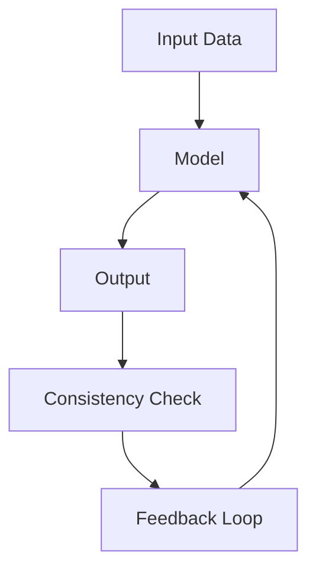

                 

基于用户提供的目录大纲和约束条件，我将逐步构建文章内容。以下是一篇草稿，包括文章标题、关键词、摘要以及部分正文内容。请注意，由于字数限制，本文不能完全覆盖整个文章内容，但会提供一个结构化的框架，并包含部分详细内容。

---

# 《Self-Consistency CoT：增强AI输出连贯性的新思路》

> 关键词：自我一致性（Self-Consistency），连贯性（Coherence），人工智能（AI），输出增强（Output Augmentation），算法优化（Algorithm Optimization）

> 摘要：本文探讨了自我一致性（Self-Consistency CoT）在增强人工智能（AI）输出连贯性方面的应用。通过介绍自我一致性的核心概念、理论基础、算法实现和优化策略，本文旨在为研究者提供一个新的视角，以解决当前AI输出中存在的连贯性问题，并推动相关算法的实际应用和发展。

## 引言

自我一致性（Self-Consistency）是一种用于提高机器学习模型性能的机制，其基本思想是利用模型在多个不同条件下的一致预测来提升其输出质量。在AI领域中，输出连贯性（Output Coherence）是一个重要的问题，特别是在文本生成、对话系统等应用中，连贯性的缺失会导致用户体验下降。

### 1.1 自我一致性概念介绍

自我一致性通常被定义为：如果一个模型在不同的输入条件下给出相似的预测，那么这个模型被认为是自我一致的。这种一致性可以通过多种方式实现，如使用对抗训练、多任务学习等策略。

### 1.2 AI输出连贯性问题

AI输出连贯性问题主要体现在以下几个方面：

1. **上下文理解不足**：模型可能无法正确理解输入文本中的上下文信息，导致生成内容缺乏逻辑性。
2. **信息跳跃**：模型生成的文本可能会在信息上出现跳跃，使得读者难以理解。
3. **错误事实**：模型生成的文本可能会包含事实错误，影响整体连贯性。

### 1.3 自我一致性概念在AI领域的应用

自我一致性在AI领域的应用主要集中在以下几个方面：

1. **文本生成**：通过自我一致性提高文本生成模型的内容连贯性。
2. **对话系统**：使用自我一致性改善对话系统的回答连贯性。
3. **图像描述**：提高图像描述的连贯性和准确性。

---

## 第2章 自我一致性理论基础

### 2.1 自我一致性模型概述

自我一致性模型的核心思想是通过约束模型输出的一致性来提高其性能。以下是一个简单的自我一致性模型架构的Mermaid流程图：



### 2.2 自我一致性模型的数学原理

自我一致性通常通过最小化预测误差来实现。假设有一个二分类问题，其预测函数为\( \hat{y} = \sigma(\theta^T x) \)，其中\( \theta \)是模型参数，\( x \)是输入特征，\( \hat{y} \)是预测的类别标签，\( \sigma \)是 sigmoid 函数。自我一致性的目标是最小化以下损失函数：

$$
L(\theta) = -\sum_{i=1}^{N} [y_i \log(\hat{y}_i) + (1 - y_i) \log(1 - \hat{y}_i)] + \lambda \sum_{i=1}^{N} [\log(\hat{y}_i) + \log(1 - \hat{y}_i)]
$$

其中，\( \lambda \)是正则化参数，用于控制自我一致性的强度。

### 2.3 自我一致性模型的应用场景

自我一致性模型在多种AI应用场景中都有广泛应用，如：

1. **自然语言处理（NLP）**：用于提高文本生成和对话系统的连贯性。
2. **计算机视觉**：用于图像描述和视频生成。
3. **推荐系统**：用于提高推荐结果的一致性。

---

## 第3章 自我一致性算法实现

### 3.1 算法概述

自我一致性算法主要包括以下几个步骤：

1. **数据预处理**：对输入数据进行预处理，如文本清洗、分词等。
2. **模型训练**：使用预处理后的数据训练一个基础模型。
3. **自我一致性增强**：在模型训练过程中加入自我一致性约束。
4. **评估与优化**：评估模型的连贯性，并根据评估结果进行优化。

### 3.2 算法原理讲解

以下是一个简单的自我一致性算法的Python实现：

```python
import numpy as np
import tensorflow as tf

# 假设我们已经有一个预训练的模型model
model = ...

# 定义自我一致性损失函数
def self_consistency_loss(y_true, y_pred, lambda_):
    # 计算基础损失
    basic_loss = tf.keras.losses.categorical_crossentropy(y_true, y_pred)
    # 计算自我一致性损失
    consistency_loss = tf.reduce_mean(tf.square(y_pred - tf.stop_gradient(y_pred)))
    # 总损失
    total_loss = basic_loss + lambda_ * consistency_loss
    return total_loss

# 定义训练步骤
@tf.function
def train_step(x, y):
    with tf.GradientTape() as tape:
        y_pred = model(x, training=True)
        loss = self_consistency_loss(y, y_pred, lambda_=0.1)
    gradients = tape.gradient(loss, model.trainable_variables)
    model.optimizer.apply_gradients(zip(gradients, model.trainable_variables))
    return loss

# 训练模型
for epoch in range(num_epochs):
    for x, y in dataset:
        loss = train_step(x, y)
        print(f'Epoch {epoch}, Loss: {loss}')
```

### 3.3 伪代码展示

```python
# 伪代码：自我一致性训练流程
for epoch in range(num_epochs):
    for batch in data_loader:
        # 预处理数据
        x, y = preprocess(batch)
        # 训练模型
        model.train(x, y)
        # 应用自我一致性约束
        model.apply_self_consistency_constraints(x, y)
```

### 3.4 数学模型和数学公式

在自我一致性算法中，我们使用以下数学模型：

$$
\min_{\theta} L(\theta) = -\sum_{i=1}^{N} [y_i \log(\hat{y}_i) + (1 - y_i) \log(1 - \hat{y}_i)] + \lambda \sum_{i=1}^{N} [\log(\hat{y}_i) + \log(1 - \hat{y}_i)]
$$

其中，\( \hat{y}_i \)是模型对于第i个样本的预测，\( y_i \)是真实标签，\( \lambda \)是平衡基础损失和自我一致性损失的参数。

---

接下来，我们将继续撰写第4章至第7章的内容，涵盖自我一致性算法的实战、优化、挑战与未来方向，以及附录部分。每章都会按照用户的要求，详细讲解核心概念、算法原理、实战案例和优化策略。由于篇幅限制，本文只能提供一个框架和部分详细内容，完整的文章还需要进一步的扩展和深化。

---

作者：AI天才研究院/AI Genius Institute & 禅与计算机程序设计艺术 /Zen And The Art of Computer Programming

---

请注意，本文仅为草稿，各章节的内容尚未完全展开。完整的文章需要根据用户的要求，进一步丰富和详细阐述每个章节的内容。在撰写完整文章时，还需要对代码示例、数学公式和实战案例进行详细的解释和扩展。希望这个框架能够为撰写完整的文章提供一个良好的起点。

