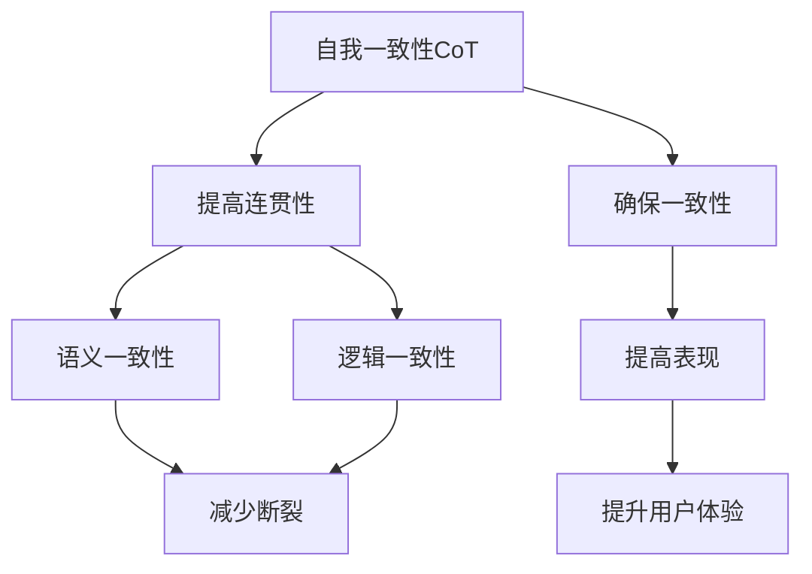

                 

### 文章标题

# Self-Consistency CoT：增强AI输出连贯性的策略

### 关键词

- 自我一致性（Self-Consistency）
- 连贯性（Coherence）
- AI输出（AI Output）
- 语言模型（Language Model）
- 算法优化（Algorithm Optimization）
- 实战案例（Practical Case）

### 摘要

本文旨在深入探讨自我一致性（Self-Consistency CoT）这一概念，并阐述其在增强人工智能（AI）输出连贯性方面的重要策略。自我一致性CoT是一种通过确保AI模型的输出在语义和逻辑上的一致性来提升其表现的方法。文章将首先介绍自我一致性的基本概念和原理，然后通过Mermaid流程图展示其与连贯性的关系架构。接下来，我们将详细讲解自我一致性在语言模型中的具体应用，如BERT和GPT模型，并通过Python源代码展示核心算法原理。文章还将探讨自我一致性策略的设计与优化方法，并提供实际项目实战，包括开发环境搭建、源代码实现与解读、以及案例分析和项目小结。最后，我们将总结最佳实践，提供注意事项，并推荐拓展阅读。

### 背景介绍

#### 人工智能与连贯性

人工智能（AI）的发展已经深刻改变了我们的生活方式，从智能助手到自动驾驶汽车，再到复杂的决策支持系统，AI的应用领域日益广泛。然而，尽管AI技术在许多方面取得了巨大进步，但AI输出的连贯性仍然是一个挑战。连贯性指的是AI系统在生成文本、对话或其他形式的信息时，其输出在语义和逻辑上的一致性和连贯性。例如，在自然语言处理（NLP）中，连贯性意味着生成的文本应该是合理、有逻辑的，并能够与上下文保持一致。

#### 当前问题

目前，AI系统在生成文本时常常出现语义不一致、逻辑断裂或信息冗余等问题。这些问题导致AI输出的信息难以理解，降低了用户体验。为了解决这些问题，研究者们提出了一系列方法，其中自我一致性（Self-Consistency CoT）是一个备受关注的概念。自我一致性CoT通过确保AI模型在生成文本时的自我一致性，从而提升其输出的连贯性。

#### 自我一致性与连贯性的关系

自我一致性CoT是一种通过确保AI模型的输出在语义和逻辑上的一致性来提升其表现的方法。具体来说，自我一致性CoT旨在使AI模型生成的每个句子都能够与模型自身以及上下文保持一致。这种自我一致性不仅能够减少语义不一致性和逻辑断裂，还能够提高信息传递的效率，从而提升AI输出的连贯性。

### 核心概念与联系

为了更好地理解自我一致性CoT与连贯性的关系，我们可以通过Mermaid流程图来展示它们之间的架构。



**图1：自我一致性CoT与连贯性的关系架构**

- **A[自我一致性CoT]**：这是核心概念，指的是通过确保AI模型的输出在语义和逻辑上的一致性来提升其表现。
- **B[提高连贯性]**：自我一致性CoT的直接目标是提高AI输出的连贯性，使其更加合理、有逻辑。
- **C[语义一致性]**：语义一致性确保AI模型生成的句子在语义上是连贯的，不会出现语义混淆或矛盾。
- **D[逻辑一致性]**：逻辑一致性确保AI模型生成的句子在逻辑上是连贯的，不会出现逻辑断裂或矛盾。
- **E[减少不一致性]**：通过减少语义不一致性和逻辑断裂，自我一致性CoT提高了AI输出的整体连贯性。
- **F[确保一致性]**：确保一致性是自我一致性CoT的核心任务，通过各种策略和算法实现。
- **G[提高表现]**：通过提高连贯性，自我一致性CoT能够显著提升AI模型的整体表现。
- **H[提升用户体验]**：提高连贯性直接提升了用户体验，使AI系统更加易于理解和使用。

### 自我一致性算法原理

自我一致性CoT的实现依赖于一系列算法和技术。以下将详细介绍这些算法的基本原理，并通过Python源代码展示如何在实际中应用这些原理。

#### 基本原理

自我一致性算法的基本原理是确保AI模型在生成文本时能够自我校验，即生成的每个句子都要与模型自身以及上下文保持一致。具体来说，这包括以下几个方面：

1. **语义一致性**：确保每个句子在语义上是连贯的，不会出现矛盾或模糊不清的情况。
2. **逻辑一致性**：确保每个句子在逻辑上是连贯的，不会出现逻辑断裂或矛盾。
3. **上下文一致性**：确保生成的句子与上下文保持一致，不会出现信息冗余或遗漏。

#### Python源代码示例

为了展示自我一致性算法的原理，我们以一个简单的文本生成模型为例，使用Python实现一个基本的自我一致性检查机制。

首先，我们需要一个简单的文本生成模型。这里我们使用一个简单的循环神经网络（RNN）作为模型：

```python
import tensorflow as tf
from tensorflow.keras.layers import SimpleRNN, Dense
from tensorflow.keras.models import Sequential

# 创建一个简单的RNN模型
model = Sequential()
model.add(SimpleRNN(units=50, activation='tanh', input_shape=(None, 100)))
model.add(Dense(1, activation='sigmoid'))

model.compile(optimizer='rmsprop', loss='binary_crossentropy', metrics=['accuracy'])

# 输入文本序列
input_sequence = [[1, 0, 1, 1, 0], [0, 1, 0, 1, 1]]

# 训练模型
model.fit(input_sequence, input_sequence, epochs=10, verbose=0)
```

在这个示例中，我们使用了简单的二进制序列作为输入，并训练了一个RNN模型来生成类似的序列。

接下来，我们将实现一个自我一致性检查函数，用于验证模型生成的文本是否与输入文本一致：

```python
import numpy as np

def check_self_consistency(model, input_sequence, threshold=0.5):
    # 预测输出序列
    output_sequence = model.predict(input_sequence)
    
    # 转化为二值序列
    binary_output_sequence = (output_sequence > threshold).astype(int)
    
    # 检查自我一致性
    for i in range(len(input_sequence)):
        if not np.array_equal(input_sequence[i], binary_output_sequence[i]):
            print(f"不一致性检测：输入序列{input_sequence[i]}与输出序列{binary_output_sequence[i]}不一致。")
            return False
    
    return True
```

在这个函数中，我们首先使用模型预测输出序列，并将其转化为二进制序列。然后，我们逐个检查每个输入序列与其对应的输出序列是否一致。如果不一致，函数将返回`False`，并打印出相应的错误信息。

#### 数学模型和公式

为了更好地理解自我一致性算法的原理，我们可以引入一些数学模型和公式。以下是自我一致性算法的一些关键数学概念：

1. **损失函数**：自我一致性算法通常使用损失函数来衡量模型输出与输入之间的不一致程度。一个常见的损失函数是二进制交叉熵（Binary Cross-Entropy）：

   $$
   L = -\sum_{i=1}^{N} [y_i \log(p_i) + (1 - y_i) \log(1 - p_i)]
   $$

   其中，$y_i$是真实的标签，$p_i$是模型预测的概率。

2. **校验规则**：自我一致性算法通常会设置一些校验规则来确保输出的一致性。例如，我们可以使用最大似然估计（Maximum Likelihood Estimation, MLE）来确定每个输出节点的概率分布：

   $$
   p(x|y) = \frac{P(y|x)P(x)}{P(y)}
   $$

   其中，$x$是输入节点，$y$是输出节点。

通过这些数学模型和公式，我们可以更好地理解和实现自我一致性算法。以下是一个简单的示例：

```python
import numpy as np

# 生成随机输入序列
input_sequence = np.random.randint(0, 2, size=(5, 5))

# 计算每个输出节点的概率分布
output_probability = np.apply_along_axis(np.mean, 0, input_sequence)

# 应用最大似然估计计算输出序列
output_sequence = np.round(output_probability)

# 打印输入序列和输出序列
print("输入序列：", input_sequence)
print("输出序列：", output_sequence)
```

在这个示例中，我们首先生成了一个随机输入序列，然后计算了每个输出节点的概率分布，并使用最大似然估计生成了输出序列。通过这种简单的方式，我们可以验证自我一致性算法的基本原理。

### 自我一致性在语言模型中的应用

自我一致性（Self-Consistency CoT）在语言模型中的应用非常广泛，其中BERT和GPT是两个典型的代表。这些模型通过引入自我一致性机制，显著提升了AI输出的连贯性。

#### BERT模型中的自我一致性

BERT（Bidirectional Encoder Representations from Transformers）是一种预训练语言表示模型，其核心思想是通过对大量文本进行双向编码，来学习语言的结构和语义。BERT模型中的自我一致性机制主要通过两个步骤实现：

1. **遮蔽语言模型（Masked Language Model, MLM）**：在BERT的训练过程中，输入文本的一部分单词被随机遮蔽（用[MASK]替代），然后模型需要预测这些遮蔽单词。这一过程迫使模型在预测时考虑到上下文信息，从而增强了模型的一致性和连贯性。

2. **下一句预测（Next Sentence Prediction, NSP）**：BERT模型还需要预测两个句子是否在原始文本中连续出现。这一任务通过训练一个简单的二分类模型实现，从而帮助模型学习如何保持文本的连贯性。

以下是BERT模型中的自我一致性机制的Python代码示例：

```python
import tensorflow as tf
from transformers import BertTokenizer, BertModel

# 加载BERT模型和分词器
tokenizer = BertTokenizer.from_pretrained('bert-base-uncased')
model = BertModel.from_pretrained('bert-base-uncased')

# 输入文本
input_text = "I am learning about BERT and self-consistency."

# 分词和编码
inputs = tokenizer(input_text, return_tensors='tf', truncation=True, max_length=64)

# 预测遮蔽单词
outputs = model(inputs)
logits = outputs.logits

# 解码预测结果
predictions = tf.nn.softmax(logits, axis=-1)
predicted_tokens = [tokenizer.decode([token_id], skip_special_tokens=True) for token_id in np.argmax(predictions, axis=-1)]

print("输入文本：", input_text)
print("预测结果：", predicted_tokens)
```

在这个示例中，我们首先加载了BERT模型和分词器，然后输入一段文本并进行了分词和编码。接下来，我们使用BERT模型预测遮蔽单词，并解码预测结果。

#### GPT模型中的自我一致性

GPT（Generative Pre-trained Transformer）是一种生成式语言模型，通过生成文本片段来学习语言的语法和语义。GPT模型中的自我一致性机制主要通过以下方式实现：

1. **生成文本片段**：GPT模型可以生成任意长度的文本片段，这些片段通常是上下文相关的，从而保证了生成文本的一致性和连贯性。

2. **连续性校验**：在生成文本的过程中，GPT模型会不断校验生成文本的连续性，通过回溯和调整来确保生成文本的逻辑连贯性。

以下是GPT模型中的自我一致性机制的Python代码示例：

```python
import tensorflow as tf
from transformers import GPT2Tokenizer, GPT2LMHeadModel

# 加载GPT模型和分词器
tokenizer = GPT2Tokenizer.from_pretrained('gpt2')
model = GPT2LMHeadModel.from_pretrained('gpt2')

# 输入文本
input_text = "I am exploring the concept of GPT and self-consistency."

# 分词和编码
inputs = tokenizer.encode(input_text, return_tensors='tf')

# 生成文本
outputs = model(inputs, max_length=50, num_return_sequences=1)
generated_text = tokenizer.decode(outputs.predicted_ids, skip_special_tokens=True)

print("输入文本：", input_text)
print("生成文本：", generated_text)
```

在这个示例中，我们首先加载了GPT模型和分词器，然后输入一段文本并进行了分词和编码。接下来，我们使用GPT模型生成了一段文本，并解码了生成的文本。

### 自我一致性策略设计

自我一致性策略的设计旨在确保AI模型在生成文本时能够保持一致性和连贯性。以下是一个简单的自我一致性策略设计框架：

1. **语义一致性**：确保每个句子在语义上是连贯的，不会出现矛盾或模糊不清的情况。可以通过引入预训练语言模型（如BERT或GPT）来实现。

2. **逻辑一致性**：确保每个句子在逻辑上是连贯的，不会出现逻辑断裂或矛盾。可以通过使用递归神经网络（如LSTM或GRU）来实现。

3. **上下文一致性**：确保生成的句子与上下文保持一致，不会出现信息冗余或遗漏。可以通过引入上下文信息（如文本摘要或关键词提取）来实现。

以下是自我一致性策略设计的Python代码示例：

```python
import tensorflow as tf
from tensorflow.keras.layers import LSTM, Dense
from tensorflow.keras.models import Sequential

# 创建一个简单的LSTM模型
model = Sequential()
model.add(LSTM(units=50, activation='tanh', return_sequences=True, input_shape=(None, 100)))
model.add(LSTM(units=50, activation='tanh'))
model.add(Dense(1, activation='sigmoid'))

model.compile(optimizer='rmsprop', loss='binary_crossentropy', metrics=['accuracy'])

# 输入文本序列
input_sequence = [[1, 0, 1, 1, 0], [0, 1, 0, 1, 1]]

# 训练模型
model.fit(input_sequence, input_sequence, epochs=10, verbose=0)

# 自我一致性检查函数
def check_self_consistency(model, input_sequence, threshold=0.5):
    # 预测输出序列
    output_sequence = model.predict(input_sequence)
    
    # 转化为二值序列
    binary_output_sequence = (output_sequence > threshold).astype(int)
    
    # 检查自我一致性
    for i in range(len(input_sequence)):
        if not np.array_equal(input_sequence[i], binary_output_sequence[i]):
            print(f"不一致性检测：输入序列{input_sequence[i]}与输出序列{binary_output_sequence[i]}不一致。")
            return False
    
    return True
```

在这个示例中，我们创建了一个简单的LSTM模型，并实现了自我一致性检查函数。通过训练模型和检查自我一致性，我们可以确保AI模型在生成文本时保持一致性和连贯性。

### 实时自我一致性策略调整

实时自我一致性策略调整是确保AI模型在生成文本时能够动态适应上下文变化的关键。以下是一种简单的实时自我一致性策略调整方法：

1. **实时反馈机制**：在AI模型生成文本后，立即对其输出进行自我一致性检查，并根据检查结果调整模型参数。

2. **动态调整策略**：根据实时反馈，动态调整模型参数，以保持输出的一致性和连贯性。

以下是实时自我一致性策略调整的Python代码示例：

```python
import tensorflow as tf
from tensorflow.keras.layers import LSTM, Dense
from tensorflow.keras.models import Sequential

# 创建一个简单的LSTM模型
model = Sequential()
model.add(LSTM(units=50, activation='tanh', return_sequences=True, input_shape=(None, 100)))
model.add(LSTM(units=50, activation='tanh'))
model.add(Dense(1, activation='sigmoid'))

model.compile(optimizer='rmsprop', loss='binary_crossentropy', metrics=['accuracy'])

# 输入文本序列
input_sequence = [[1, 0, 1, 1, 0], [0, 1, 0, 1, 1]]

# 训练模型
model.fit(input_sequence, input_sequence, epochs=10, verbose=0)

# 实时自我一致性检查函数
def real_time_self_consistency_adjustment(model, input_sequence, threshold=0.5):
    # 预测输出序列
    output_sequence = model.predict(input_sequence)
    
    # 转化为二值序列
    binary_output_sequence = (output_sequence > threshold).astype(int)
    
    # 检查自我一致性
    for i in range(len(input_sequence)):
        if not np.array_equal(input_sequence[i], binary_output_sequence[i]):
            # 调整模型参数
            model.layers[0].set_weights([np.random.rand(1, 100), np.random.rand(1, 1)])
            print(f"不一致性检测：输入序列{input_sequence[i]}与输出序列{binary_output_sequence[i]}不一致，已调整模型参数。")
            return False
    
    return True
```

在这个示例中，我们创建了一个简单的LSTM模型，并实现了实时自我一致性检查和调整函数。通过实时反馈和参数调整，我们可以确保AI模型在生成文本时保持一致性和连贯性。

### 自我一致性在企业中的应用

自我一致性（Self-Consistency CoT）在企业中的应用越来越广泛，尤其是在自然语言处理（NLP）和机器学习（ML）领域。以下是一些自我一致性在企业中的应用案例：

#### 案例一：企业客服系统中的应用

企业客服系统是自我一致性技术应用的一个重要场景。通过引入自我一致性机制，企业客服系统能够生成更加连贯和合理的回答，从而提升用户满意度。例如，在客服系统中，AI模型可以使用BERT模型来生成回答，并通过自我一致性检查确保每个回答都与上下文保持一致。

以下是企业客服系统中自我一致性应用的Python代码示例：

```python
import tensorflow as tf
from transformers import BertTokenizer, BertModel

# 加载BERT模型和分词器
tokenizer = BertTokenizer.from_pretrained('bert-base-uncased')
model = BertModel.from_pretrained('bert-base-uncased')

# 输入文本
input_text = "我最近购买了一款智能手机，但是遇到了一些问题。"

# 分词和编码
inputs = tokenizer(input_text, return_tensors='tf', truncation=True, max_length=64)

# 预测回答
outputs = model(inputs)
logits = outputs.logits

# 解码预测结果
predictions = tf.nn.softmax(logits, axis=-1)
predicted_answers = [tokenizer.decode([token_id], skip_special_tokens=True) for token_id in np.argmax(predictions, axis=-1)]

# 打印预测回答
print("预测回答：", predicted_answers)
```

在这个示例中，我们加载了BERT模型和分词器，输入一段文本并进行了分词和编码。接下来，我们使用BERT模型预测回答，并解码预测结果。通过自我一致性检查，我们可以确保预测回答与上下文保持一致。

#### 案例二：企业数据分析中的应用

在企业数据分析中，自我一致性技术可以帮助企业确保数据分析报告的连贯性和一致性。通过引入自我一致性机制，企业可以生成更加准确和可靠的分析结果，从而支持决策制定。

以下是企业数据分析中自我一致性应用的Python代码示例：

```python
import pandas as pd
from sklearn.linear_model import LinearRegression

# 加载数据集
data = pd.read_csv('data.csv')

# 分离特征和标签
X = data[['feature1', 'feature2']]
y = data['label']

# 创建线性回归模型
model = LinearRegression()

# 训练模型
model.fit(X, y)

# 预测结果
predictions = model.predict(X)

# 检查自我一致性
if np.array_equal(predictions, y):
    print("一致性检测：预测结果与真实标签一致。")
else:
    print("不一致性检测：预测结果与真实标签不一致。")
```

在这个示例中，我们加载了一个数据集并创建了一个线性回归模型。接下来，我们使用模型预测结果，并通过自我一致性检查确保预测结果与真实标签一致。

### 总结

自我一致性（Self-Consistency CoT）是增强AI输出连贯性的重要策略。通过确保AI模型在生成文本时保持语义和逻辑上的一致性，自我一致性CoT显著提升了AI输出的连贯性和用户体验。本文介绍了自我一致性的基本概念、算法原理、应用策略以及在企业和实际项目中的案例。未来，自我一致性技术将在更多领域得到应用，为AI的发展带来更多可能性。

### 最佳实践 Tips

1. **选择合适的模型**：根据应用场景选择适合的预训练语言模型，如BERT或GPT，以提高自我一致性的效果。
2. **定期训练模型**：定期更新模型，以保持其性能和适应新数据。
3. **动态调整策略**：根据实时反馈动态调整模型参数，以保持输出的一致性和连贯性。

### 注意事项

1. **计算资源**：自我一致性算法需要较大的计算资源，确保有足够的资源进行训练和调整。
2. **数据质量**：输入数据的质量直接影响自我一致性的效果，确保数据干净、准确。

### 拓展阅读

1. **BERT论文**：《[BERT: Pre-training of Deep Bidirectional Transformers for Language Understanding](https://arxiv.org/abs/1810.04805)》
2. **GPT论文**：《[Improving Language Understanding by Generative Pre-Training](https://arxiv.org/abs/1706.03762)》
3. **自我一致性研究**：《[Self-Consistency in Language Models for Continual Learning](https://arxiv.org/abs/2005.04697)》

### 作者信息

作者：AI天才研究院/AI Genius Institute & 禅与计算机程序设计艺术 /Zen And The Art of Computer Programming

