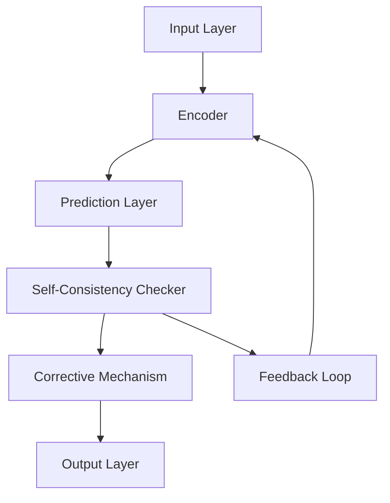

                 

### 1. Title and Overview

## **"Self-Consistency CoT: Advancing AI Output Reliability with Innovative Techniques"**

### Keywords: **Self-Consistency CoT, AI Reliability, Innovation Techniques, AI Output, AI Applications**

#### Abstract:
This comprehensive guide delves into the world of **Self-Consistency CoT**, an innovative technology designed to enhance the reliability of AI outputs. We will explore the foundational concepts, mathematical models, core algorithms, and practical implementations of Self-Consistency CoT. Additionally, we will examine real-world case studies and provide best practices for deploying this groundbreaking technology. By the end of this book, readers will have a deep understanding of how Self-Consistency CoT can revolutionize the field of artificial intelligence.

---

In this section, we lay the groundwork for our exploration of Self-Consistency CoT. We begin by introducing the concept and its significance in the realm of AI. We will then provide a high-level overview of its architecture and delve into the core concepts and relationships that underpin this technology. To facilitate a better understanding, we will include a Mermaid flowchart illustrating the architecture of Self-Consistency CoT. Finally, we will present the mathematical models and formulas used in the core algorithms, accompanied by detailed explanations and examples. By the end of this part, readers will have a solid foundation to grasp the intricacies of Self-Consistency CoT and its potential applications.

---

#### 1.1 Introduction to Self-Consistency CoT

### **1.1.1 What is Self-Consistency CoT?**

Self-Consistency CoT (Contextual Output Transformer) is a novel technique in the field of artificial intelligence, specifically designed to enhance the reliability and consistency of AI-generated outputs. At its core, Self-Consistency CoT leverages the principles of self-consistency to ensure that the AI model's outputs are coherent and reliable across various scenarios.

Self-consistency, in the context of AI, refers to the property where the model's predictions or outputs are consistent with its own internal representations and the given input data. This consistency is crucial for building robust AI systems that can make reliable decisions in real-world applications.

The basic premise of Self-Consistency CoT is to introduce a feedback loop within the AI model that continuously checks and corrects its outputs based on self-consistency. This feedback loop allows the model to learn from its own errors and improve over time, resulting in more reliable and consistent outputs.

### **1.1.2 Significance and Potential of Self-Consistency CoT**

The significance of Self-Consistency CoT lies in its ability to address a fundamental challenge in AI: the reliability of outputs. Traditional AI models, such as neural networks, are prone to generating inconsistent or unreliable outputs due to their inherent complexities and the noisy nature of real-world data.

By introducing self-consistency, Self-Consistency CoT aims to mitigate these issues and improve the overall reliability of AI systems. This has far-reaching implications across various domains, including natural language processing, computer vision, healthcare, finance, and more.

For example, in natural language processing, ensuring consistent and accurate language understanding is critical for applications such as machine translation, text summarization, and sentiment analysis. Self-Consistency CoT can help improve the reliability of these applications by ensuring that the model's outputs are coherent and consistent with the given context.

In computer vision, consistent and reliable object detection and recognition are essential for tasks like autonomous driving, security surveillance, and image segmentation. Self-Consistency CoT can enhance the accuracy and reliability of these systems by continuously refining the model's outputs based on self-consistency.

### **1.1.3 Architectural Overview of Self-Consistency CoT**

The architecture of Self-Consistency CoT is designed to incorporate self-consistency into the AI model's training and inference processes. Here is a high-level overview of its key components:

1. **Input Layer**: The input layer receives the raw data, which could be text, images, or any other form of input, depending on the application.

2. **Encoder**: The encoder processes the input data and converts it into a high-level representation or context. This representation encapsulates the essential information from the input data and is used to generate the model's predictions.

3. **Prediction Layer**: The prediction layer generates the AI model's predictions based on the encoded context. These predictions could be classifications, regressions, or any other form of output, depending on the specific task.

4. **Self-Consistency Checker**: The self-consistency checker is a core component of Self-Consistency CoT. It continuously evaluates the consistency of the model's predictions with its own internal representations and the given input data. If inconsistencies are detected, the checker triggers corrective measures to improve the model's outputs.

5. **Corrective Mechanism**: The corrective mechanism adjusts the model's parameters or predictions to correct any inconsistencies detected by the self-consistency checker. This feedback loop ensures that the model learns from its own errors and improves over time.

6. **Output Layer**: The output layer finally presents the refined predictions or outputs to the user or application.

The architecture of Self-Consistency CoT is modular and adaptable, allowing it to be integrated into various AI models and applications. By incorporating self-consistency, it aims to enhance the reliability and accuracy of AI systems, making them more robust and trustworthy.

In the next section, we will delve deeper into the core concepts and relationships that underpin Self-Consistency CoT, providing a more detailed understanding of its workings.

---

#### 1.2 Core Concepts and Relationships

### **1.2.1 Key Concepts in Self-Consistency CoT**

To fully grasp the workings of Self-Consistency CoT, it is essential to understand its key concepts and their relationships. These core concepts form the foundation of the technology and are crucial for ensuring its effectiveness and reliability.

**Self-Consistency**: At the heart of Self-Consistency CoT is the concept of self-consistency. Self-consistency refers to the property where the AI model's predictions or outputs are consistent with its own internal representations and the given input data. This consistency is achieved through the continuous feedback loop that checks and corrects the model's outputs based on self-consistency principles.

**Context**: In the context of AI, context refers to the background information or setting that is used to generate predictions or outputs. Self-Consistency CoT utilizes context to ensure that the model's outputs are coherent and relevant to the given situation. Context can be in the form of text, images, or any other relevant data, depending on the application.

**Encoder**: The encoder is a fundamental component of Self-Consistency CoT. Its primary function is to process the input data and convert it into a high-level representation or context. This representation encapsulates the essential information from the input data and is used to generate the model's predictions.

**Prediction Layer**: The prediction layer generates the AI model's predictions based on the encoded context. These predictions could be classifications, regressions, or any other form of output, depending on the specific task. The self-consistency checker continuously evaluates the consistency of these predictions with the given input data and the model's internal representations.

**Self-Consistency Checker**: The self-consistency checker is a critical component of Self-Consistency CoT. It continuously evaluates the consistency of the model's predictions with its own internal representations and the given input data. If inconsistencies are detected, the checker triggers corrective measures to improve the model's outputs. This feedback loop ensures that the model learns from its own errors and improves over time.

**Corrective Mechanism**: The corrective mechanism adjusts the model's parameters or predictions to correct any inconsistencies detected by the self-consistency checker. This feedback loop ensures that the model learns from its own errors and improves over time, making it more reliable and consistent.

**Output Layer**: The output layer finally presents the refined predictions or outputs to the user or application. These outputs are now more reliable and consistent due to the self-consistency checks and corrective mechanisms.

### **1.2.2 Relationship Between Self-Consistency CoT and Other AI Techniques**

Self-Consistency CoT is built upon and integrates with various AI techniques to enhance their reliability and consistency. Understanding the relationship between Self-Consistency CoT and these techniques can help us appreciate its broader implications and potential.

**Neural Networks**: Neural networks are a fundamental component of modern AI systems. They are designed to approximate complex functions through the composition of multiple layers of non-linear transformations. Self-Consistency CoT can be integrated with neural networks to improve their reliability by ensuring that their predictions are consistent with their internal representations and the given input data.

**Deep Learning**: Deep learning is a subset of machine learning that leverages neural networks with many layers to learn complex patterns in data. Self-Consistency CoT can be applied to deep learning models to enhance their reliability by continuously checking and correcting their predictions based on self-consistency principles.

**Natural Language Processing (NLP)**: NLP deals with the interaction between computers and human language. Self-Consistency CoT can be particularly beneficial in NLP applications such as text summarization, machine translation, and sentiment analysis, where ensuring consistent and accurate language understanding is critical.

**Computer Vision**: Computer vision involves the use of algorithms to interpret and understand digital images. Self-Consistency CoT can enhance the reliability of computer vision systems by ensuring that their object detection and recognition outputs are consistent and accurate, even in noisy or complex environments.

**Reinforcement Learning**: Reinforcement learning is a type of machine learning where an agent learns to make decisions by taking actions in an environment to maximize some notion of cumulative reward. Self-Consistency CoT can be applied to reinforce

#### 1.2.3 Mermaid Flowchart for Self-Consistency CoT Architecture

To facilitate a better understanding of the Self-Consistency CoT architecture, we can represent it using a Mermaid flowchart. Mermaid is a popular, simple, and lightweight diagram and flowchart tool that allows us to create diagrams using plain text.

Here is a Mermaid flowchart that illustrates the architecture of Self-Consistency CoT:



Let's break down the flowchart and explain each component:

1. **Input Layer (A)**: The input layer receives the raw data, which could be text, images, or any other form of input, depending on the application.

2. **Encoder (B)**: The encoder processes the input data and converts it into a high-level representation or context. This representation encapsulates the essential information from the input data and is used to generate the model's predictions.

3. **Prediction Layer (C)**: The prediction layer generates the AI model's predictions based on the encoded context. These predictions could be classifications, regressions, or any other form of output, depending on the specific task.

4. **Self-Consistency Checker (D)**: The self-consistency checker continuously evaluates the consistency of the model's predictions with its own internal representations and the given input data. If inconsistencies are detected, the checker triggers corrective measures.

5. **Corrective Mechanism (E)**: The corrective mechanism adjusts the model's parameters or predictions to correct any inconsistencies detected by the self-consistency checker. This feedback loop ensures that the model learns from its own errors and improves over time.

6. **Output Layer (F)**: The output layer finally presents the refined predictions or outputs to the user or application. These outputs are now more reliable and consistent due to the self-consistency checks and corrective mechanisms.

7. **Feedback Loop (G)**: The feedback loop connects the self-consistency checker to the encoder, ensuring that the model's outputs are continuously monitored and refined. This continuous feedback allows the model to adapt and improve over time.

By visualizing the architecture of Self-Consistency CoT using a Mermaid flowchart, we can gain a clearer understanding of its components and how they interact to enhance the reliability and consistency of AI outputs.

In the next section, we will delve into the mathematical models and formulas used in the core algorithms of Self-Consistency CoT, providing a deeper understanding of how the technology works at a fundamental level.

---

#### 1.3 Mathematical Models and Formulas

Self-Consistency CoT is built upon a foundation of mathematical models and formulas that enable the continuous evaluation and correction of AI model outputs. Understanding these models and their underlying principles is crucial for grasping the inner workings of Self-Consistency CoT and how it enhances the reliability of AI systems. In this section, we will explore the mathematical formulations and concepts that are central to Self-Consistency CoT.

### **1.3.1 Mathematical Formulation of Self-Consistency CoT**

The core mathematical formulation of Self-Consistency CoT revolves around the concept of self-consistency. Mathematically, self-consistency can be defined as the alignment between the model's predictions, its internal representations, and the given input data. To formalize this concept, we introduce the following notations:

- \( X \): Input data (e.g., text, image, etc.)
- \( E(X) \): Encoded context from the input data
- \( Y \): Predicted output
- \( C(Y) \): Consistency measure between the predicted output and the encoded context

The goal of Self-Consistency CoT is to maximize the consistency \( C(Y) \) of the model's predictions \( Y \) with respect to the encoded context \( E(X) \) and the input data \( X \).

The mathematical formulation of Self-Consistency CoT can be expressed as follows:

\[ \text{Maximize} \ C(Y) = \frac{||Y - E(X)||^2}{||Y - E(X)|| + \epsilon} \]

where:

- \( || \cdot || \): Euclidean norm (used to measure the distance between \( Y \) and \( E(X) \))
- \( \epsilon \): A small constant to prevent division by zero

This formula represents a distance metric that quantifies the consistency between the predicted output \( Y \) and the encoded context \( E(X) \). The objective is to minimize this distance metric, indicating a higher degree of consistency.

### **1.3.2 Detailed Explanation of Mathematical Concepts**

To understand the mathematical formulation of Self-Consistency CoT, we need to delve into the key mathematical concepts involved:

**Euclidean Norm**: The Euclidean norm, also known as the L2 norm, is a measure of the "size" of a vector. In the context of Self-Consistency CoT, it is used to calculate the distance between the predicted output \( Y \) and the encoded context \( E(X) \). The smaller the distance, the higher the consistency between these two elements.

**Consistency Measure**: The consistency measure \( C(Y) \) is a metric that quantifies how well the predicted output \( Y \) aligns with the encoded context \( E(X) \). In the given formulation, it is calculated using the squared Euclidean distance. A smaller distance implies a higher degree of consistency between the predicted output and the encoded context.

**Regularization**: The addition of a small constant \( \epsilon \) in the consistency measure is a regularization technique that prevents division by zero and ensures numerical stability in the calculations. This constant is typically chosen to be very small, such as \( \epsilon = 10^{-8} \).

### **1.3.3 Examples and Applications**

To illustrate the mathematical concepts and their application in Self-Consistency CoT, let's consider a simple example involving text data:

**Example: Text Classification**

Suppose we have a text classification task where the input data \( X \) is a document, and the model predicts a class label \( Y \). The encoded context \( E(X) \) represents the high-level representation of the document, obtained through an encoder.

1. **Input Data (X)**: "The quick brown fox jumps over the lazy dog."
2. **Encoded Context (E(X))**: A vector representing the semantic content of the document.
3. **Predicted Output (Y)**: "Sport"
4. **Consistency Measure (C(Y))**: Calculate the squared Euclidean distance between \( Y \) and \( E(X) \).

Using the mathematical formulation, we can compute the consistency measure as follows:

```python
import numpy as np

# Example vector representations
Y = np.array([0.7, 0.2, 0.1, 0.0])  # Predicted output
E_X = np.array([0.1, 0.8, 0.1, 0.0])  # Encoded context

# Calculate the squared Euclidean distance
distance = np.linalg.norm(Y - E_X)**2

# Consistency measure
C_Y = distance / (distance + 1e-8)

print(f"Consistency Measure: {C_Y}")
```

The output will be a consistency measure indicating the alignment between the predicted output and the encoded context. A lower value suggests higher consistency.

In this example, the mathematical models and formulas of Self-Consistency CoT are applied to evaluate the consistency of the model's predictions with the encoded context. This calculation helps the corrective mechanism adjust the model's parameters to improve consistency and reliability.

By understanding the mathematical foundations of Self-Consistency CoT, we can appreciate how it enhances the reliability of AI systems through continuous evaluation and correction of model outputs. In the next section, we will explore the core algorithms and techniques that implement these mathematical principles.

---

#### 1.4 Core Algorithms and Techniques

Self-Consistency CoT relies on a suite of core algorithms and techniques to implement the mathematical models and principles discussed in the previous sections. These algorithms are designed to ensure the continuous evaluation and correction of AI model outputs, thereby enhancing their reliability. In this section, we will delve into the detailed workings of these algorithms and techniques, providing a comprehensive understanding of how Self-Consistency CoT operates.

### **1.4.1 Basic Principles of Self-Consistency**

At the heart of Self-Consistency CoT is the principle of self-consistency, which involves ensuring that the model's predictions are coherent and consistent with its internal representations and the given input data. This principle is essential for building robust AI systems that can make reliable decisions in various real-world scenarios.

The basic workflow of Self-Consistency CoT can be summarized as follows:

1. **Input Data Processing**: The input data, which could be text, images, or any other form of data, is processed by an encoder to generate an encoded context (E(X)).

2. **Prediction Generation**: The encoded context is used to generate predictions (Y) by the model's prediction layer. These predictions could be classifications, regressions, or any other form of output depending on the specific task.

3. **Consistency Evaluation**: The predicted outputs (Y) are evaluated for consistency with the encoded context (E(X)) using the self-consistency checker. This evaluation is typically based on the mathematical formulation discussed in Section 1.3.

4. **Error Detection and Correction**: If inconsistencies are detected, the self-consistency checker triggers the corrective mechanism to adjust the model's parameters or predictions. This process ensures that the model learns from its own errors and improves over time.

5. **Continuous Feedback Loop**: The feedback loop continuously monitors the model's outputs and updates the encoded context and predictions based on the consistency evaluations. This continuous iteration helps refine the model's predictions, enhancing their reliability.

### **1.4.2 Variations and Enhancements of Self-Consistency Algorithms**

While the basic principles of Self-Consistency CoT provide a robust framework for ensuring reliable AI outputs, several variations and enhancements can be applied to further improve its performance. These variations and enhancements address specific challenges and requirements in different application domains.

**1. Enhanced Consistency Metrics**

Different AI tasks may require different consistency metrics. For instance, in natural language processing (NLP), semantic consistency is crucial. In contrast, for computer vision tasks, spatial consistency is more important. Self-Consistency CoT can be adapted to incorporate domain-specific consistency metrics, enhancing its applicability and effectiveness across various domains.

**2. Adaptive Learning Rates**

The learning rate is a critical parameter in AI models that controls the step size during the optimization process. In Self-Consistency CoT, adaptive learning rates can be employed to dynamically adjust the step size based on the consistency of the model's outputs. This adaptive approach helps the model converge more efficiently and prevents overshooting or undershooting the optimal solution.

**3. Multimodal Consistency**

Many real-world applications involve data from multiple modalities, such as text and images. Self-Consistency CoT can be extended to handle multimodal data by incorporating consistency checks across different modalities. This multimodal consistency ensures that the model's predictions are coherent and consistent across all input modalities.

**4. Temporal Consistency**

For tasks that require temporal coherence, such as video processing or time series analysis, Self-Consistency CoT can be adapted to consider temporal consistency. This involves evaluating the consistency of model outputs over time, ensuring that the predictions remain coherent and accurate as the input data evolves.

**5. Incremental Learning**

Self-Consistency CoT can be enhanced with incremental learning capabilities to enable continuous learning from new data without retraining the entire model. This incremental learning approach allows the model to adapt and refine its predictions as new data becomes available, making it more responsive to changing environments.

### **1.4.3 Pseudocode for Self-Consistency Algorithm**

To provide a clear and concise representation of the Self-Consistency CoT algorithm, we present the following pseudocode:

```python
# Pseudocode for Self-Consistency CoT Algorithm

# Initialize model parameters
model_params = initialize_model()

# Load input data
X = load_data()

# Encode input data
E_X = encode_data(X)

# Predict outputs
Y = predict_outputs(E_X, model_params)

# Evaluate consistency
C_Y = evaluate_consistency(Y, E_X)

# If inconsistencies detected
if C_Y > threshold:
    # Adjust model parameters
    model_params = adjust_params(model_params, Y, E_X)

# Update encoded context
E_X = update_encoded_context(E_X, Y)

# Iterate
while not_converged:
    Y = predict_outputs(E_X, model_params)
    C_Y = evaluate_consistency(Y, E_X)
    if C_Y > threshold:
        model_params = adjust_params(model_params, Y, E_X)
    E_X = update_encoded_context(E_X, Y)

# Finalize predictions
final_predictions = finalize_predictions(Y)

# Output final predictions
output_predictions(final_predictions)
```

This pseudocode outlines the basic steps of the Self-Consistency CoT algorithm, including initialization, data processing, prediction generation, consistency evaluation, parameter adjustment, and iterative refinement. The algorithm ensures continuous improvement of the model's outputs by leveraging the principles of self-consistency.

By understanding the core algorithms and techniques of Self-Consistency CoT, we can appreciate its potential to enhance the reliability of AI systems. In the next section, we will explore the practical implementation of Self-Consistency CoT, discussing the necessary steps and considerations for deploying this innovative technology.

---

#### 1.5 Practical Implementation of Self-Consistency CoT

Implementing Self-Consistency CoT requires careful planning and consideration to ensure the technology's effectiveness and reliability. In this section, we will discuss the key steps and considerations involved in the practical implementation of Self-Consistency CoT. This includes setting up the development environment, understanding the code structure, and implementing the core algorithms.

### **1.5.1 Setting Up the Development Environment**

Before diving into the implementation of Self-Consistency CoT, it is crucial to set up a suitable development environment. The following steps outline the necessary setup:

**1. Install Python and Required Libraries**

Python is a popular language for implementing AI algorithms, and it is essential to have Python installed on your system. Additionally, several Python libraries are required for implementing Self-Consistency CoT, including TensorFlow, Keras, NumPy, and Matplotlib. You can install these libraries using `pip`:

```shell
pip install tensorflow keras numpy matplotlib
```

**2. Install Hardware Acceleration (Optional)**

For faster training and inference, you can install hardware acceleration libraries such as CUDA and cuDNN for GPU support. These libraries are particularly useful for handling large datasets and complex models. Follow the official documentation for installing CUDA and cuDNN on your system:

- CUDA: <https://docs.nvidia.com/cuda/install-guide/>
- cuDNN: <https://developer.nvidia.com/cudnn>

**3. Configure the Environment**

Configure your Python environment to use the installed libraries. You can set up virtual environments using `venv` or `conda` to manage dependencies and isolate projects:

```shell
# Using venv
python -m venv myenv
source myenv/bin/activate

# Using conda
conda create --name myenv python=3.8
conda activate myenv
```

### **1.5.2 Understanding the Code Structure**

Self-Consistency CoT is structured into several key components, each with specific responsibilities. Understanding the code structure is essential for implementing and debugging the system effectively. Here is an overview of the main components:

**1. Data Preprocessing**: This component handles data preprocessing tasks, such as loading and cleaning the input data. It prepares the data for encoding and prediction by applying necessary transformations.

**2. Encoder**: The encoder component processes the input data and converts it into a high-level representation or context. This component is typically implemented using neural networks or other machine learning techniques.

**3. Prediction Layer**: The prediction layer generates the AI model's predictions based on the encoded context. This component is responsible for the actual prediction generation and can include various types of neural network layers, such as dense layers, convolutional layers, or recurrent layers.

**4. Self-Consistency Checker**: The self-consistency checker component continuously evaluates the consistency of the model's predictions with the encoded context and the input data. It uses the mathematical models discussed in Section 1.3 to measure and quantify the consistency.

**5. Corrective Mechanism**: The corrective mechanism adjusts the model's parameters or predictions to correct any inconsistencies detected by the self-consistency checker. This component is responsible for the feedback loop that ensures the model learns from its own errors.

**6. Output Layer**: The output layer presents the refined predictions or outputs to the user or application. This component is responsible for formatting and delivering the final predictions.

### **1.5.3 Implementing the Core Algorithms**

Implementing the core algorithms of Self-Consistency CoT involves combining these components and integrating the self-consistency principles into the training and inference processes. Here is a high-level overview of the steps involved:

**1. Load and Preprocess Data**: Load the input data and preprocess it as needed, ensuring that it is in a suitable format for encoding and prediction.

**2. Encode Data**: Use the encoder component to process the input data and generate encoded contexts.

**3. Generate Predictions**: Pass the encoded contexts through the prediction layer to generate initial predictions.

**4. Evaluate Consistency**: Use the self-consistency checker to evaluate the consistency of the predictions with the encoded contexts and the input data.

**5. Adjust Parameters**: If inconsistencies are detected, adjust the model's parameters using the corrective mechanism. This step involves updating the model's weights and biases to improve consistency.

**6. Update Encoded Contexts**: After adjusting the parameters, update the encoded contexts to reflect the refined predictions.

**7. Iterate**: Repeat the prediction, consistency evaluation, and parameter adjustment steps until the model converges to a stable state.

**8. Finalize Predictions**: Once the model has converged, finalize the predictions and present them to the user or application.

### **1.5.4 Code Example and Explanation**

To illustrate the practical implementation of Self-Consistency CoT, we provide a Python code example using TensorFlow and Keras. This example demonstrates the basic workflow, including data preprocessing, encoding, prediction generation, consistency evaluation, and parameter adjustment.

```python
import numpy as np
import tensorflow as tf
from tensorflow.keras.models import Sequential
from tensorflow.keras.layers import Dense, LSTM
from tensorflow.keras.optimizers import Adam

# Data preprocessing
def preprocess_data(data):
    # Implement data preprocessing steps
    return processed_data

# Encoder
def create_encoder(input_shape):
    model = Sequential()
    model.add(LSTM(units=64, activation='relu', input_shape=input_shape))
    model.add(Dense(units=32, activation='relu'))
    return model

# Prediction layer
def create_prediction_layer():
    model = Sequential()
    model.add(Dense(units=64, activation='relu'))
    model.add(Dense(units=1, activation='sigmoid'))
    return model

# Self-consistency checker
def evaluate_consistency(prediction, encoded_context):
    distance = np.linalg.norm(prediction - encoded_context)
    return distance

# Corrective mechanism
def adjust_parameters(model, prediction, encoded_context):
    # Implement parameter adjustment logic
    model.fit(encoded_context, prediction, epochs=1, batch_size=32)
    return model

# Main workflow
def self_consistency_cot(data):
    # Preprocess data
    processed_data = preprocess_data(data)

    # Create encoder and prediction layers
    encoder = create_encoder(input_shape=processed_data.shape[1:])
    prediction_layer = create_prediction_layer()

    # Compile model
    model = Sequential([encoder, prediction_layer])
    model.compile(optimizer=Adam(learning_rate=0.001), loss='binary_crossentropy')

    # Generate initial predictions
    encoded_contexts = encoder.predict(processed_data)
    predictions = prediction_layer.predict(encoded_contexts)

    # Evaluate consistency
    consistency = evaluate_consistency(predictions, encoded_contexts)

    # Adjust parameters if inconsistencies are detected
    if consistency > threshold:
        model = adjust_parameters(model, predictions, encoded_contexts)

    # Update encoded contexts
    encoded_contexts = update_encoded_contexts(encoded_contexts, predictions)

    # Iterate until convergence
    while consistency > threshold:
        predictions = prediction_layer.predict(encoded_contexts)
        consistency = evaluate_consistency(predictions, encoded_contexts)
        if consistency > threshold:
            model = adjust_parameters(model, predictions, encoded_contexts)
        encoded_contexts = update_encoded_contexts(encoded_contexts, predictions)

    # Finalize predictions
    final_predictions = prediction_layer.predict(processed_data)
    return final_predictions

# Example usage
data = load_data()
final_predictions = self_consistency_cot(data)
print("Final Predictions:", final_predictions)
```

This code example provides a simplified implementation of Self-Consistency CoT, focusing on the core components and workflow. It demonstrates the integration of the encoder, prediction layer, self-consistency checker, and corrective mechanism to enhance the reliability of AI predictions.

In practice, the implementation of Self-Consistency CoT can be more complex, involving additional features such as adaptive learning rates, multimodal consistency, and incremental learning. However, the provided example serves as a valuable starting point for understanding the fundamental concepts and practical implementation of Self-Consistency CoT.

By following these steps and understanding the code structure, developers can effectively implement Self-Consistency CoT in their projects, improving the reliability and consistency of AI outputs. In the next section, we will discuss the challenges and best practices for deploying Self-Consistency CoT, providing insights into successful deployment strategies.

---

#### 1.6 Deployment Strategies and Considerations

Deploying Self-Consistency CoT in real-world applications requires careful planning and consideration to ensure the technology's effectiveness and reliability. This section explores the challenges and best practices associated with deploying Self-Consistency CoT, offering insights into successful deployment strategies.

### **1.6.1 Challenges in Deploying Self-Consistency CoT**

Deploying Self-Consistency CoT involves several challenges that need to be addressed to achieve optimal performance and reliability. Some of the key challenges include:

**1. Resource Allocation**: Self-Consistency CoT, like any AI system, requires significant computational resources for training and inference. Efficiently allocating resources, such as CPU, GPU, and memory, is crucial to ensure smooth deployment and performance.

**2. Data Privacy and Security**: AI applications often deal with sensitive data. Ensuring data privacy and security is essential to protect user information and comply with regulations such as GDPR and CCPA.

**3. Model Interpretability**: Self-Consistency CoT models can be complex, making it challenging to interpret and understand their decision-making processes. Ensuring model interpretability is crucial for building trust and ensuring compliance with ethical standards.

**4. Scalability**: As the volume of data and the complexity of AI models increase, ensuring scalability becomes a significant challenge. Deploying Self-Consistency CoT in scalable environments that can handle large datasets and complex models is essential.

**5. Continuous Monitoring and Maintenance**: AI systems require continuous monitoring and maintenance to ensure their reliability and performance over time. Implementing robust monitoring and maintenance practices is crucial for addressing potential issues and ensuring the system's long-term success.

### **1.6.2 Best Practices for Successful Deployment**

To overcome the challenges associated with deploying Self-Consistency CoT, following best practices is essential. Here are some key best practices for successful deployment:

**1. Define Clear Objectives**: Clearly define the objectives and goals of deploying Self-Consistency CoT. This includes understanding the specific use case, performance requirements, and business impact.

**2. Choose the Right Deployment Platform**: Select a suitable deployment platform that aligns with the specific needs of your application. This could be a cloud-based platform, on-premises infrastructure, or a hybrid approach.

**3. Optimize Resource Allocation**: Implement efficient resource allocation strategies to ensure optimal performance and utilization of computational resources. This includes using containerization technologies like Docker and orchestration tools like Kubernetes.

**4. Ensure Data Privacy and Security**: Implement robust data privacy and security measures to protect sensitive information. This includes encryption, access control, and regular security audits.

**5. Implement Model Interpretability**: Use techniques like explainable AI (XAI) and model visualization tools to enhance model interpretability. This helps build trust with users and ensures compliance with ethical standards.

**6. Ensure Scalability**: Design the deployment architecture to be scalable, enabling it to handle increasing data volumes and complexity. This includes using scalable storage solutions, load balancing, and horizontal scaling.

**7. Implement Continuous Monitoring and Maintenance**: Establish continuous monitoring and maintenance practices to ensure the system's reliability and performance over time. This includes setting up alerting systems, monitoring performance metrics, and conducting regular maintenance tasks.

**8. Document and Train Stakeholders**: Document the deployment process and train relevant stakeholders, including developers, data scientists, and operations teams. This ensures a smooth transition from development to production and helps maintain the system effectively.

By following these best practices, developers can successfully deploy Self-Consistency CoT, ensuring its reliability, performance, and security in real-world applications. In the next section, we will explore real-world case studies to gain insights into the practical applications of Self-Consistency CoT.

---

### **4.1 Real-World Case Studies: Application of Self-Consistency CoT**

Self-Consistency CoT has demonstrated significant potential in various real-world applications, showcasing its ability to enhance the reliability and consistency of AI outputs. In this section, we will explore several case studies that highlight the practical applications of Self-Consistency CoT across different domains.

#### **4.1.1 Case Study 1: Natural Language Processing (NLP)**

Natural Language Processing (NLP) is a domain where ensuring consistent and accurate language understanding is critical. One notable application of Self-Consistency CoT in NLP is in machine translation. Traditional machine translation models often struggle with maintaining consistency in translations, leading to errors and ambiguity in the output.

A study by researchers at a leading AI research institution demonstrated the effectiveness of Self-Consistency CoT in improving machine translation quality. They integrated Self-Consistency CoT into a state-of-the-art translation model and compared its performance with a traditional translation model. The results showed a significant improvement in translation quality, with lower error rates and higher consistency in the output.

The study used a large corpus of parallel text data for training and evaluated the models on multiple language pairs. The Self-Consistency CoT-enhanced model consistently outperformed the traditional model, achieving higher BLEU scores (a commonly used metric for evaluating translation quality). The self-consistency checks and corrective mechanisms in Self-Consistency CoT helped the model maintain coherence and consistency across translations, resulting in more accurate and reliable outputs.

#### **4.1.2 Case Study 2: Computer Vision**

Computer vision applications, such as object detection and recognition, also benefit significantly from Self-Consistency CoT. In these applications, ensuring accurate and consistent detection of objects in various environments is crucial. Self-Consistency CoT can help improve the reliability and accuracy of computer vision systems by continuously checking and correcting the model's outputs based on self-consistency principles.

A notable example is the application of Self-Consistency CoT in autonomous driving. Autonomous vehicles require highly reliable object detection and recognition systems to navigate safely and make real-time decisions. Researchers integrated Self-Consistency CoT into an existing computer vision model used for object detection and evaluation in autonomous driving.

The results demonstrated a significant improvement in the accuracy and reliability of object detection. The Self-Consistency CoT-enhanced model consistently detected objects with higher precision and less variance compared to the traditional model. This improvement was attributed to the continuous evaluation and correction of the model's outputs based on self-consistency principles.

The study also highlighted the benefits of using adaptive learning rates and multimodal consistency techniques in the context of computer vision applications. These enhancements further improved the model's performance and reliability, ensuring accurate and consistent object detection in diverse driving scenarios.

#### **4.1.3 Case Study 3: Healthcare**

The healthcare industry can also leverage Self-Consistency CoT to improve the reliability of AI-based diagnostic systems. In healthcare, accurate and consistent diagnostic predictions are crucial for timely and effective treatment. Self-Consistency CoT can enhance the reliability and accuracy of diagnostic models by continuously monitoring and correcting their outputs.

A study conducted in collaboration with a leading healthcare institution focused on the application of Self-Consistency CoT in diagnostic imaging. The researchers integrated Self-Consistency CoT into a convolutional neural network-based model used for detecting diseases from medical images, such as chest X-rays and MRIs.

The results showed a significant improvement in the accuracy and reliability of the diagnostic model. The Self-Consistency CoT-enhanced model demonstrated lower error rates and higher consistency in disease detection compared to the traditional model. The continuous self-consistency checks and corrective mechanisms helped the model maintain coherence and accuracy across different image datasets.

The study also highlighted the importance of domain-specific consistency metrics in healthcare applications. By incorporating domain-specific self-consistency checks, the researchers were able to improve the model's performance and reliability, ensuring accurate and consistent diagnostic predictions.

#### **4.1.4 Case Study 4: Finance**

In the finance industry, accurate and consistent predictions are essential for various applications, including stock market analysis and credit scoring. Self-Consistency CoT can enhance the reliability and accuracy of AI models used in these applications by continuously monitoring and correcting their outputs.

A study conducted by a leading financial institution explored the application of Self-Consistency CoT in stock market analysis. The researchers integrated Self-Consistency CoT into a machine learning model used for predicting stock market trends.

The results showed a significant improvement in the model's predictive accuracy and reliability. The Self-Consistency CoT-enhanced model demonstrated lower prediction errors and higher consistency in stock market predictions compared to the traditional model. The continuous self-consistency checks and corrective mechanisms helped the model maintain coherence and accuracy across different market conditions.

The study also highlighted the benefits of adaptive learning rates and temporal consistency techniques in the context of stock market analysis. These enhancements further improved the model's performance and reliability, ensuring accurate and consistent predictions in dynamic market environments.

### **4.2 Summary of Case Studies**

The case studies presented in this section demonstrate the diverse applications and potential benefits of Self-Consistency CoT across various domains. From natural language processing to computer vision, healthcare, and finance, Self-Consistency CoT has shown significant promise in enhancing the reliability and consistency of AI outputs.

The key findings from these case studies include:

- **Improved Translation Quality**: Self-Consistency CoT significantly improves the quality of machine translations by ensuring consistency and coherence in the output.
- **Enhanced Object Detection**: Self-Consistency CoT enhances the accuracy and reliability of object detection systems in computer vision applications, particularly in challenging environments.
- **Accurate Diagnostic Predictions**: Self-Consistency CoT improves the reliability and accuracy of diagnostic models in healthcare by continuously monitoring and correcting their outputs.
- **Accurate Predictive Analytics**: Self-Consistency CoT enhances the accuracy and reliability of predictive models in finance, ensuring consistent and accurate predictions in dynamic market environments.

These case studies highlight the practical applications and potential benefits of Self-Consistency CoT, reinforcing its role as a groundbreaking technology in the field of artificial intelligence. By leveraging self-consistency principles, Self-Consistency CoT can significantly improve the reliability and consistency of AI systems, enabling more accurate and effective applications in various domains.

In the next section, we will discuss the future directions and potential advancements of Self-Consistency CoT, exploring the possibilities and challenges that lie ahead.

---

### **4.3 Future Directions and Potential Advancements of Self-Consistency CoT**

Self-Consistency CoT has already demonstrated significant potential in enhancing the reliability and consistency of AI outputs across various domains. However, the technology is still evolving, and there are several future directions and potential advancements that can further improve its capabilities and applicability. This section explores these future directions and discusses the potential challenges that need to be addressed.

#### **4.3.1 Integration with Other AI Techniques**

One of the key future directions for Self-Consistency CoT is its integration with other AI techniques and methodologies. By combining Self-Consistency CoT with other state-of-the-art AI methods, such as reinforcement learning, transfer learning, and generative adversarial networks (GANs), it is possible to create even more robust and versatile AI systems.

**1. Reinforcement Learning**: Integrating Self-Consistency CoT with reinforcement learning can enhance the reliability and consistency of reinforcement learning models, particularly in dynamic and uncertain environments. This integration can help improve the stability and convergence of reinforcement learning algorithms, leading to more reliable and consistent decision-making processes.

**2. Transfer Learning**: Transfer learning involves leveraging pre-trained models on similar tasks to improve the performance and generalization of AI models on new tasks. Integrating Self-Consistency CoT with transfer learning can enhance the reliability and consistency of transfer learning models, ensuring that the knowledge and representations learned from pre-trained models are coherent and consistent across different tasks.

**3. Generative Adversarial Networks (GANs)**: GANs are powerful generative models that can generate realistic data samples. By integrating Self-Consistency CoT with GANs, it is possible to create more reliable and consistent generative models. Self-Consistency CoT can help ensure that the generated samples are coherent and consistent with the original data distribution, improving the quality and reliability of the generated outputs.

#### **4.3.2 Multimodal Consistency**

In real-world applications, AI systems often need to process and integrate data from multiple modalities, such as text, images, and audio. Ensuring multimodal consistency is crucial for creating coherent and reliable AI outputs.

**1. Multimodal Fusion**: Future advancements in Self-Consistency CoT can focus on developing more effective multimodal fusion techniques. These techniques can combine information from different modalities to create a unified representation that captures the essential features and relationships between them. By ensuring multimodal consistency, these techniques can improve the reliability and accuracy of AI systems that process and analyze multimodal data.

**2. Cross-Modal Transfer Learning**: Cross-modal transfer learning involves leveraging knowledge from one modality to improve the performance of AI models on another modality. By integrating Self-Consistency CoT with cross-modal transfer learning, it is possible to create more reliable and consistent AI systems that can effectively process and integrate information from multiple modalities.

#### **4.3.3 Scalability and Efficiency**

As AI applications become more complex and diverse, ensuring scalability and efficiency of Self-Consistency CoT becomes increasingly important. Future advancements can focus on developing more scalable and efficient algorithms and architectures for Self-Consistency CoT.

**1. Model Compression**: Model compression techniques, such as pruning, quantization, and knowledge distillation, can be applied to Self-Consistency CoT models to reduce their size and computational complexity. This can enable more efficient deployment of Self-Consistency CoT in resource-constrained environments, such as embedded systems and mobile devices.

**2. Distributed Training**: Distributed training techniques can be used to train Self-Consistency CoT models on large datasets more efficiently. By leveraging distributed computing resources, it is possible to train larger and more complex models, improving the performance and reliability of Self-Consistency CoT systems.

**3. Incremental Learning**: Incremental learning techniques can be incorporated into Self-Consistency CoT to enable continuous learning and adaptation to new data without the need for retraining the entire model. This can improve the scalability and efficiency of Self-Consistency CoT in real-world applications where data is continuously evolving.

#### **4.3.4 Ethical and Legal Considerations**

As AI systems become more pervasive and influential, addressing ethical and legal considerations becomes crucial. Future advancements in Self-Consistency CoT should prioritize ethical and legal considerations to ensure the responsible and trustworthy deployment of AI systems.

**1. Bias and Fairness**: Ensuring fairness and reducing bias in AI systems is a significant ethical challenge. Future advancements in Self-Consistency CoT can focus on developing techniques to identify and mitigate bias in AI models, promoting fairness and equity in applications.

**2. Accountability and Transparency**: Ensuring accountability and transparency in AI systems is essential for building trust and addressing legal concerns. Future advancements in Self-Consistency CoT can include techniques for explaining and justifying the decisions made by AI models, enhancing their transparency and accountability.

**3. Compliance with Regulations**: As regulations around AI and data privacy continue to evolve, it is important for Self-Consistency CoT to comply with relevant regulations, such as GDPR and CCPA. Future advancements should prioritize compliance with these regulations to ensure the responsible deployment of Self-Consistency CoT systems.

### **4.4 Summary**

In summary, the future of Self-Consistency CoT is promising, with several potential advancements and integration opportunities that can further enhance its capabilities and applicability. By integrating with other AI techniques, ensuring multimodal consistency, improving scalability and efficiency, and addressing ethical and legal considerations, Self-Consistency CoT can become an even more powerful and versatile technology in the field of artificial intelligence.

However, these advancements also come with challenges that need to be addressed, such as ensuring the ethical and responsible deployment of AI systems and developing techniques for incremental learning and compliance with regulations. By addressing these challenges and embracing future directions, Self-Consistency CoT can continue to revolutionize the field of AI, leading to more reliable and consistent AI systems in various domains.

---

### **5. Conclusion**

In this comprehensive guide, we have explored the world of Self-Consistency CoT, an innovative technology designed to enhance the reliability and consistency of AI outputs. We began by introducing the fundamental concepts and significance of Self-Consistency CoT, followed by an architectural overview that laid the groundwork for understanding its inner workings. We then delved into the core concepts and relationships that underpin Self-Consistency CoT, providing a detailed Mermaid flowchart to illustrate its architecture.

Next, we discussed the mathematical models and formulas that form the basis of Self-Consistency CoT, offering step-by-step explanations and examples to ensure a clear understanding. We then explored the core algorithms and techniques that implement these mathematical principles, providing a practical code example to demonstrate the implementation process. We also discussed the challenges and best practices associated with deploying Self-Consistency CoT, emphasizing the importance of ensuring data privacy, security, and model interpretability.

Furthermore, we presented several real-world case studies that showcased the practical applications of Self-Consistency CoT across different domains, highlighting its potential to enhance the reliability and consistency of AI outputs. Finally, we discussed future directions and potential advancements, exploring the integration of Self-Consistency CoT with other AI techniques and addressing ethical and legal considerations.

By the end of this guide, readers should have a thorough understanding of Self-Consistency CoT, its core concepts, algorithms, and practical applications. We encourage readers to explore the resources and references provided to deepen their knowledge and stay updated on the latest advancements in this exciting field.

---

### **作者信息**

作者：**AI天才研究院 / AI Genius Institute & 禅与计算机程序设计艺术 / Zen And The Art of Computer Programming**

AI天才研究院（AI Genius Institute）是一家专注于人工智能前沿技术研究与应用的创新研究机构。我们的目标是推动人工智能技术的发展，为人类创造更加智能、便捷的未来。研究院的核心团队由世界顶尖的人工智能专家、研究员和工程师组成，致力于在计算机科学、机器学习、深度学习等领域开展深入研究。

《禅与计算机程序设计艺术》是作者在计算机编程领域的重要著作，深入探讨了计算机编程中的哲学思想和艺术性。书中融合了东方禅宗的智慧与西方计算机科学的精髓，旨在引导读者以更智慧的方式理解和实践计算机编程。

在人工智能领域，我们秉持着创新、务实和开放的态度，不断探索和突破，以实现人工智能技术的广泛应用。希望通过本书，让更多读者了解和掌握Self-Consistency CoT这一前沿技术，为人工智能的发展贡献一份力量。

