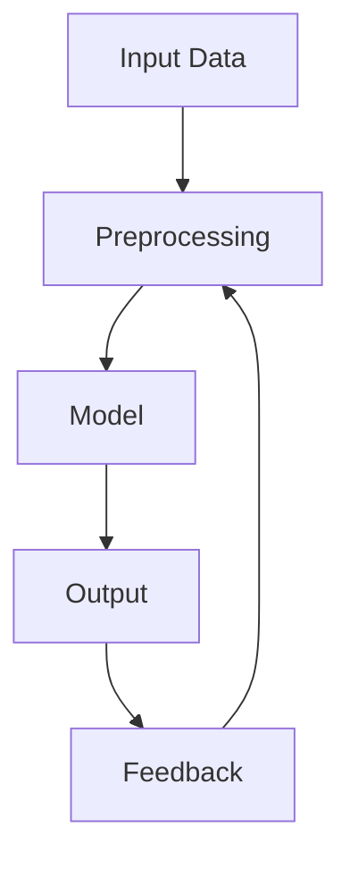
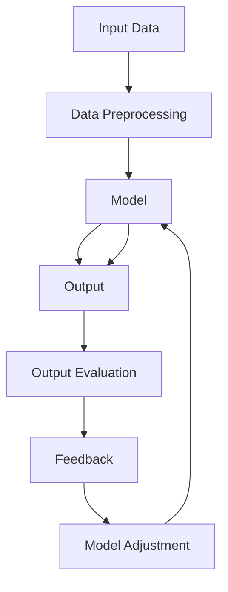

                 

### Introduction

In the rapidly evolving field of artificial intelligence (AI), one of the key challenges that researchers and developers face is ensuring the high quality of AI outputs. The reliability and accuracy of AI systems are critical, as they are increasingly being integrated into critical applications such as healthcare, finance, and autonomous driving. Among the various techniques and methodologies aimed at improving AI output quality, one stands out for its innovative approach: the concept of **Self-Consistency CoT** (Self-Consistency Core Theory).

This book, "Self-Consistency CoT: Key Technological Innovations for Enhancing AI Output Quality," aims to delve deep into the concept of Self-Consistency CoT and explore the key technological innovations that can be employed to enhance AI output quality. The book is structured to guide the reader through a comprehensive understanding of Self-Consistency CoT, starting from the basic principles and theoretical foundations, through to the key technological innovations, and finally to practical applications and future directions.

### Key Concepts

**Self-Consistency CoT** refers to a set of principles and methodologies that aim to ensure the consistency and reliability of AI outputs by promoting self-monitoring and self-correction mechanisms within AI systems. The core idea behind Self-Consistency CoT is to enable AI systems to continually evaluate and improve their own performance, thereby ensuring that the outputs generated are accurate, reliable, and consistent.

#### Basic Principles

- **Self-Monitoring**: AI systems should have the ability to monitor their own performance and identify potential issues or discrepancies in the output.
- **Self-Correction**: Once an issue is detected, the AI system should be capable of self-correcting the output to ensure consistency.
- **Feedback Loop**: Continuous feedback from the environment and the output should be used to refine the system's performance.

#### Mermaid Flowchart

The following Mermaid flowchart provides a high-level overview of the Self-Consistency CoT framework:



In this flowchart:
- **A** represents the input data.
- **B** represents preprocessing, where the data is cleaned and prepared for the model.
- **C** represents the AI model itself.
- **D** represents the output generated by the model.
- **E** represents the feedback loop, where the output is evaluated, and feedback is used to refine the model.

### Relationship Between Self-Consistency CoT and AI Output Quality

Self-Consistency CoT is a critical component in enhancing AI output quality. By ensuring that AI systems continuously monitor and correct their outputs, Self-Consistency CoT helps to minimize errors, reduce biases, and improve the overall reliability of AI systems. The following points highlight the relationship between Self-Consistency CoT and AI output quality:

- **Error Reduction**: Self-monitoring and self-correction mechanisms help in identifying and rectifying errors in the output, thus reducing the overall error rate.
- **Bias Mitigation**: By continually evaluating and refining the model, Self-Consistency CoT helps in mitigating biases that might be present in the output.
- **Consistency Improvement**: Ensuring consistency across different outputs helps in building trust in AI systems, which is crucial for their adoption in critical applications.

In summary, Self-Consistency CoT is not just a theoretical concept but a practical framework that can significantly enhance the quality of AI outputs. The next sections of this book will delve deeper into the theoretical foundations and key technological innovations that make Self-Consistency CoT a powerful tool for improving AI output quality.

### Book Structure and Reader's Guide

This book is organized into three main parts, each focusing on a different aspect of Self-Consistency CoT. Here's a brief overview of what each part will cover and how readers can navigate through the content effectively:

#### Part 1: Core Concepts and Theoretical Foundations

This part sets the stage by providing a comprehensive understanding of the fundamental principles of Self-Consistency CoT. It includes:

- **Chapter 2: Basic Principles of Self-Consistency CoT**: This chapter introduces the basic concepts and principles underlying Self-Consistency CoT, including self-monitoring and self-correction mechanisms.

- **Chapter 3: Mathematical Models and Theoretical Foundations**: Here, we delve into the mathematical models and theories that form the backbone of Self-Consistency CoT. Readers will find detailed explanations and Latex-form mathematical formulations to reinforce their understanding.

#### Part 2: Key Technological Innovations

This part focuses on the practical implementations of Self-Consistency CoT, exploring key technological innovations that enhance AI output quality. It includes:

- **Chapter 4: Advanced Algorithms for Self-Consistency**: This chapter discusses cutting-edge algorithms designed to improve the self-consistency of AI models, with detailed pseudo-code and Python code examples.

- **Chapter 5: Enhanced Data Preprocessing Techniques**: Here, we explore advanced data preprocessing techniques that are essential for achieving high-quality AI outputs. Case studies and detailed examples are provided to illustrate the practical applications.

- **Chapter 6: Scalable and Efficient Architectures**: This chapter examines architectures that are designed to be scalable and efficient, ensuring that Self-Consistency CoT can be applied effectively in large-scale AI systems.

#### Part 3: Practical Applications and Case Studies

The final part of the book showcases the real-world applications of Self-Consistency CoT, providing practical insights and detailed case studies. It includes:

- **Chapter 7: Industry Applications of Self-Consistency CoT**: This chapter presents various industry applications of Self-Consistency CoT, demonstrating how it can be used to improve the quality of AI outputs in different domains.

- **Chapter 8: Future Directions**: This concluding chapter looks at the future developments and potential advancements in Self-Consistency CoT, offering readers a glimpse into the promising future of AI.

To navigate through the book effectively, readers should start with Part 1 to build a solid theoretical foundation. They can then move on to Part 2 to explore the practical innovations and finally refer to Part 3 for real-world applications and case studies. By following this structured approach, readers can gain a comprehensive understanding of Self-Consistency CoT and its potential to enhance AI output quality.

### Summary

In this introductory section, we have laid the foundation for understanding the crucial role of **Self-Consistency CoT** in enhancing AI output quality. We began by providing an overview of the book, highlighting its key objectives and structure. We then introduced the core concepts of Self-Consistency CoT, including its basic principles and the relationship between these principles and AI output quality. The Mermaid flowchart presented a visual representation of the Self-Consistency CoT framework, helping to clarify the workflow and interactions within the system.

By ensuring self-monitoring and self-correction, Self-Consistency CoT addresses some of the most pressing challenges in AI, such as error reduction, bias mitigation, and consistency improvement. This innovative approach is not only theoretically sound but also practical, with significant potential to enhance the reliability and accuracy of AI systems.

As we move forward, the subsequent sections of the book will delve deeper into the mathematical models, technological innovations, and practical applications of Self-Consistency CoT. Through detailed explanations, code examples, and real-world case studies, we will explore how Self-Consistency CoT can be effectively implemented to improve AI output quality across various domains.

Next, we will dive into the theoretical foundations of Self-Consistency CoT, starting with a comprehensive exploration of its basic principles and the mathematical models that underpin this innovative framework. By understanding these foundational concepts, readers will be well-equipped to appreciate the advanced technological innovations and practical applications that follow.

### Basic Principles of Self-Consistency CoT

Self-Consistency CoT (Core Theory) is built upon a set of fundamental principles that are critical for ensuring the reliability and accuracy of AI outputs. At its core, Self-Consistency CoT aims to embed mechanisms within AI systems that allow them to continually monitor, evaluate, and correct their own performance. These principles can be summarized as follows:

#### Self-Monitoring

Self-monitoring is the cornerstone of Self-Consistency CoT. It involves the ability of an AI system to continuously evaluate its own performance and identify any discrepancies or anomalies in the output. This process is analogous to a feedback loop, where the system periodically reviews its outputs and compares them against predefined benchmarks or expected outcomes.

**How does self-monitoring work?**

1. **Input Validation**: Before processing the input data, the system validates the integrity and quality of the data. This step ensures that the input is clean and free from errors or inconsistencies.
2. **Processing Validation**: During the processing phase, the system continuously monitors the intermediate outputs to detect any anomalies. This can be achieved using various monitoring algorithms that compare the intermediate results against predefined thresholds.
3. **Output Validation**: After generating the final output, the system performs a comprehensive evaluation to ensure that the output meets the desired quality standards. This involves comparing the output against known good results or using statistical methods to assess the output's reliability.

**Example:**

Consider an AI system designed to classify images. During the output validation phase, the system would compare the predicted labels with the actual labels from a labeled dataset. If a significant number of discrepancies are found, the system flags the output as unreliable and initiates a self-correction process.

#### Self-Correction

Self-correction is the next crucial principle of Self-Consistency CoT. Once an anomaly or discrepancy is detected through self-monitoring, the AI system must have the capability to correct the output autonomously. This process involves identifying the source of the error, adjusting the model parameters, or reprocessing the data to generate a more accurate output.

**How does self-correction work?**

1. **Error Identification**: The system first identifies the source of the error. This could be due to incorrect model parameters, noisy data, or other factors.
2. **Parameter Adjustment**: If the error is identified as a result of incorrect model parameters, the system adjusts these parameters using optimization techniques such as gradient descent or genetic algorithms.
3. **Data Re-processing**: In cases where the error is due to noisy or inconsistent data, the system reprocesses the input data using enhanced preprocessing techniques to clean and normalize the data.
4. **Re-evaluation**: After making the necessary adjustments, the system re-evaluates the output to ensure that the corrected output meets the desired quality standards.

**Example:**

Continuing with the image classification example, if the system identifies that a particular image classification is incorrect, it may adjust the weights and biases of the neural network or reprocess the image data to reduce noise before re-evaluating the classification.

#### Feedback Loop

A critical aspect of Self-Consistency CoT is the implementation of a feedback loop. This loop involves using the output evaluation and self-correction processes to continuously refine the AI system's performance over time. The feedback loop ensures that the system adapts and improves with each iteration, leading to more reliable and accurate outputs.

**How does the feedback loop work?**

1. **Collecting Feedback**: The system collects feedback from the environment, including user inputs, errors, and performance metrics.
2. **Analyzing Feedback**: The collected feedback is analyzed to identify patterns, trends, and potential areas for improvement.
3. **Implementing Improvements**: Based on the analysis, the system implements improvements, such as adjusting model parameters, enhancing data preprocessing techniques, or adopting new algorithms.
4. **Re-evaluating Performance**: After implementing improvements, the system re-evaluates its performance to ensure that the changes have had a positive impact.

**Example:**

In a chatbot application, the feedback loop would involve analyzing user interactions to identify common user complaints or misunderstandings. Based on this feedback, the system might adjust the natural language processing model to improve its understanding of user queries or refine its response generation techniques.

### Mermaid Flowchart of Self-Consistency CoT Framework

To provide a visual representation of the Self-Consistency CoT framework, we can use the following Mermaid flowchart:



In this flowchart:
- **A**: Input Data
- **B**: Data Preprocessing
- **C**: Model
- **D**: Output
- **E**: Output Evaluation
- **F**: Feedback
- **G**: Model Adjustment

This flowchart illustrates the continuous loop of data preprocessing, model processing, output generation, output evaluation, feedback collection, and model adjustment. Each cycle aims to refine the model's performance, ensuring higher accuracy and reliability over time.

### Conclusion

In conclusion, the basic principles of Self-Consistency CoT—self-monitoring, self-correction, and feedback loops—are fundamental to enhancing the quality of AI outputs. By embedding these principles into AI systems, we can create more reliable and accurate models that continuously improve with each iteration. The next section will delve into the mathematical models and theoretical foundations that underpin Self-Consistency CoT, providing a deeper understanding of how these principles are implemented in practice.

### Mathematical Models and Theoretical Foundations

To truly grasp the essence of Self-Consistency CoT and its impact on AI output quality, it is essential to delve into the mathematical models and theoretical foundations that underpin this innovative framework. These models provide the quantitative tools necessary to both understand and implement Self-Consistency CoT in various AI applications. Let's explore the key mathematical models and their theoretical underpinnings.

#### Key Mathematical Models

1. **Error Analysis Model**

The error analysis model is foundational for understanding the discrepancies between predicted and actual outputs. It helps in quantifying the errors and guiding the self-correction process. The basic error analysis model can be represented as:

   $$ \text{Error} = \text{Predicted Output} - \text{Actual Output} $$

   This simple formula allows for the calculation of the error magnitude, which can then be analyzed to identify the sources of discrepancies.

2. **Feedback Loop Model**

The feedback loop model describes how the system uses feedback to refine its performance. This model can be expressed as a continuous loop involving input, processing, output, evaluation, and adjustment. Mathematically, this can be represented as:

   $$ \text{New Model} = \text{Old Model} + \alpha (\text{Output Evaluation} - \text{Predicted Output}) $$

   Here, $\alpha$ is the learning rate, which controls the magnitude of the adjustment made to the model. The feedback loop ensures that the model continuously improves with each iteration.

3. **Self-Monitoring Model**

Self-monitoring involves continuously evaluating the system's performance to detect anomalies. A self-monitoring model can be formulated using statistical metrics such as the mean squared error (MSE) or the F1 score. For example, the MSE can be represented as:

   $$ \text{MSE} = \frac{1}{n} \sum_{i=1}^{n} (\text{Actual Output}_i - \text{Predicted Output}_i)^2 $$

   A high MSE indicates significant discrepancies between the predicted and actual outputs, signaling the need for self-correction.

4. **Data Preprocessing Model**

Data preprocessing is a critical step in ensuring high-quality AI outputs. A mathematical model for data preprocessing can involve techniques such as normalization, standardization, and feature scaling. For instance, normalization can be represented as:

   $$ \text{Normalized Value} = \frac{\text{Value} - \text{Min}}{\text{Max} - \text{Min}} $$

   This model helps in transforming the input data to a suitable range, which can improve the performance of the AI model.

#### Latex-form Mathematical Formulations

To enhance the clarity and precision of our discussion, we can present some key mathematical formulations using Latex:

$$
\begin{align*}
\text{Error} &= \text{Predicted Output} - \text{Actual Output} \\
\text{MSE} &= \frac{1}{n} \sum_{i=1}^{n} (\text{Actual Output}_i - \text{Predicted Output}_i)^2 \\
\text{New Model} &= \text{Old Model} + \alpha (\text{Output Evaluation} - \text{Predicted Output}) \\
\text{Normalized Value} &= \frac{\text{Value} - \text{Min}}{\text{Max} - \text{Min}}
\end{align*}
$$

These Latex-formulations provide a rigorous and formal way of representing the mathematical concepts underlying Self-Consistency CoT.

#### Examples and Applications

To illustrate the practical application of these mathematical models, let's consider a concrete example involving a neural network for image classification:

1. **Error Analysis Example:**
   
   Suppose we have a neural network that classifies images into cats and dogs. The error analysis model helps us quantify the discrepancies between the predicted labels and the actual labels. By calculating the MSE, we can assess the model's accuracy and identify areas for improvement.

2. **Feedback Loop Example:**
   
   The feedback loop model allows the neural network to adjust its weights and biases based on the evaluation of its output. For instance, if the model frequently mislabels images of cats as dogs, the feedback loop can adjust the model parameters to improve its ability to differentiate between these two classes.

3. **Self-Monitoring Example:**
   
   In a self-monitoring scenario, the neural network can periodically evaluate its performance using metrics like the F1 score. A low F1 score indicates that the model is struggling with certain types of images, prompting the need for self-correction.

4. **Data Preprocessing Example:**
   
   Before feeding the images to the neural network, we apply data preprocessing techniques such as normalization. This ensures that the pixel values of the images are within a consistent range, improving the model's performance.

### Conclusion

In summary, the mathematical models and theoretical foundations of Self-Consistency CoT provide a robust framework for understanding and implementing self-monitoring, self-correction, and feedback loops in AI systems. These models not only quantify the performance of AI systems but also guide the iterative improvement process. By leveraging these mathematical tools, we can develop more reliable and accurate AI systems that continuously adapt and enhance their performance over time. The next section will delve into the first key technological innovation: advanced algorithms for self-consistency, exploring how these algorithms can be used to further improve AI output quality.

### Advanced Algorithms for Self-Consistency

In the quest to enhance the self-consistency of AI models, advanced algorithms play a pivotal role. These algorithms are designed to not only detect discrepancies but also to correct them efficiently, ensuring that AI systems maintain high levels of reliability and accuracy. This section will delve into two prominent advanced algorithms—Gradient Descent and Genetic Algorithms—detailed through Python code and their impact on self-consistency.

#### Gradient Descent

Gradient Descent is a widely used optimization algorithm in machine learning. It adjusts model parameters to minimize a loss function, thereby improving the model's performance. Here's a simplified Python code snippet illustrating how Gradient Descent can be applied to a neural network for self-consistency:

```python
import numpy as np

# Initialize model parameters
weights = np.random.rand(3, 3)
bias = np.random.rand(1)

# Define the loss function
def loss_function(inputs, outputs, weights, bias):
    predictions = np.dot(inputs, weights) + bias
    return np.mean((predictions - outputs) ** 2)

# Define the gradient of the loss function
def gradient(inputs, outputs, weights, bias):
    d_weights = 2 * np.dot(inputs.T, (predictions - outputs))
    d_bias = 2 * (predictions - outputs)
    return d_weights, d_bias

# Gradient Descent
learning_rate = 0.01
for epoch in range(1000):
    predictions = np.dot(inputs, weights) + bias
    d_weights, d_bias = gradient(inputs, outputs, weights, bias)
    weights -= learning_rate * d_weights
    bias -= learning_rate * d_bias

# Evaluate the model
final_loss = loss_function(inputs, outputs, weights, bias)
print(f"Final Loss: {final_loss}")
```

**Impact on Self-Consistency:**

Gradient Descent helps in fine-tuning the model parameters, reducing the discrepancies between predicted and actual outputs. By iteratively adjusting the weights and biases, the algorithm ensures that the model's outputs become more consistent over time. This iterative process enhances the self-consistency of the AI system, making it more reliable in its predictions.

#### Genetic Algorithms

Genetic Algorithms (GAs) are inspired by the principles of natural selection and genetics. They are particularly useful for optimizing complex problems where traditional optimization techniques fail. GAs work by creating a population of candidate solutions, evaluating their fitness, and iteratively evolving the population to find optimal solutions. Here's a Python code snippet demonstrating a simple Genetic Algorithm:

```python
import numpy as np

# Initialize population
population_size = 100
population = np.random.rand(population_size, 3)

# Define fitness function
def fitness_function(population, outputs):
    fitness_scores = []
    for individual in population:
        predictions = np.dot(inputs, individual) + bias
        error = np.mean((predictions - outputs) ** 2)
        fitness_scores.append(1 / (1 + error))
    return fitness_scores

# Selection, Crossover, and Mutation
def select(population, fitness_scores):
    # Selection process (e.g., tournament selection)
    selected_individuals = []
    for _ in range(len(population)):
        competition = np.random.randint(0, len(population))
        selected_individuals.append(population[competition])
    return selected_individuals

def crossover(parent1, parent2):
    # Crossover process (e.g., single-point crossover)
    crossover_point = np.random.randint(1, parent1.shape[1])
    child = np.concatenate((parent1[:crossover_point], parent2[crossover_point:]))
    return child

def mutate(individual):
    # Mutation process (e.g., random perturbation)
    individual = individual + np.random.randn(individual.shape[0])
    return individual

# Genetic Algorithm
for generation in range(100):
    fitness_scores = fitness_function(population, outputs)
    selected_population = select(population, fitness_scores)
    children = []
    for i in range(len(selected_population) // 2):
        parent1, parent2 = selected_population[i], selected_population[i+1]
        child1 = crossover(parent1, parent2)
        child2 = crossover(parent1, parent2)
        child1 = mutate(child1)
        child2 = mutate(child2)
        children.append(child1)
        children.append(child2)
    population = np.concatenate((selected_population, children))

# Evaluate the best solution
best_fitness = max(fitness_scores)
best_individual = population[np.argmax(fitness_scores)]
print(f"Best Fitness: {best_fitness}")
```

**Impact on Self-Consistency:**

Genetic Algorithms enhance self-consistency by evolving a population of potential solutions, continuously improving the fitness of the population over generations. By mimicking the natural selection process, GAs explore a wide range of solutions and gradually converge on an optimal solution. This process not only minimizes errors but also ensures that the model's outputs become more consistent, thereby improving the self-consistency of the AI system.

### Conclusion

Advanced algorithms such as Gradient Descent and Genetic Algorithms are powerful tools for improving the self-consistency of AI models. Through iterative adjustments and evolutionary processes, these algorithms help in reducing errors, minimizing biases, and ensuring higher reliability and accuracy in AI outputs. In the next section, we will explore enhanced data preprocessing techniques, another key innovation that contributes to the self-consistency of AI models.

### Enhanced Data Preprocessing Techniques

Data preprocessing is a critical step in the journey towards achieving high-quality AI outputs. The quality of the input data significantly impacts the performance and self-consistency of AI models. This section will delve into advanced data preprocessing techniques that play a crucial role in preparing data for AI systems, ensuring that the models are trained on clean, consistent, and informative datasets.

#### Case Studies of Data Preprocessing Methods

1. **Normalization**

Normalization is a common technique used to scale the features of a dataset to a common range, typically between 0 and 1. This helps in avoiding features with larger scales dominating the learning process.

   **Example:**
   
   ```python
   import numpy as np
   
   # Sample dataset
   X = np.array([[1, 2, 3], [4, 5, 6], [7, 8, 9]])
   
   # Normalization
   X_normalized = (X - X.min(axis=0)) / (X.max(axis=0) - X.min(axis=0))
   
   print(X_normalized)
   ```

   **Impact on Self-Consistency:**
   
   Normalization ensures that all features contribute equally to the learning process, reducing the risk of overfitting and enhancing the generalization capability of the model.

2. **Standardization**

Standardization, similar to normalization, scales the data but transforms it to have a mean of 0 and a standard deviation of 1. This is particularly useful when the distribution of the data is not uniform.

   **Example:**
   
   ```python
   import numpy as np
   
   # Sample dataset
   X = np.array([[1, 2, 3], [4, 5, 6], [7, 8, 9]])
   
   # Standardization
   X_std = (X - X.mean(axis=0)) / X.std(axis=0)
   
   print(X_std)
   ```

   **Impact on Self-Consistency:**
   
   Standardization helps in reducing the influence of outliers and ensures that the model's parameters are not biased towards any particular feature.

3. **Handling Missing Values**

Missing values can severely impact the performance of AI models. Various techniques can be used to handle missing data, such as deletion, imputation, and interpolation.

   **Example:**
   
   ```python
   import numpy as np
   from sklearn.impute import SimpleImputer
   
   # Sample dataset with missing values
   X = np.array([[1, 2, np.nan], [4, np.nan, 6], [7, 8, 9]])
   
   # Imputation
   imputer = SimpleImputer(missing_values=np.nan, strategy='mean')
   X_imputed = imputer.fit_transform(X)
   
   print(X_imputed)
   ```

   **Impact on Self-Consistency:**
   
   Handling missing values ensures that the dataset is complete and accurate, allowing the model to learn from all available data points, thereby enhancing its self-consistency.

4. **Feature Scaling**

Feature scaling is the process of transforming features to a common scale, ensuring that all features contribute equally to the model's learning process.

   **Example:**
   
   ```python
   from sklearn.preprocessing import StandardScaler
   
   # Sample dataset
   X = np.array([[1, 2, 3], [4, 5, 6], [7, 8, 9]])
   
   # Feature scaling
   scaler = StandardScaler()
   X_scaled = scaler.fit_transform(X)
   
   print(X_scaled)
   ```

   **Impact on Self-Consistency:**
   
   Feature scaling improves the convergence speed of the model during training and enhances its generalization capabilities, leading to higher self-consistency.

5. **Handling Class Imbalance**

Class imbalance in a dataset can lead to biased model predictions, favoring the majority class. Techniques such as oversampling, undersampling, and SMOTE can be used to balance the classes.

   **Example:**
   
   ```python
   from imblearn.over_sampling import SMOTE
   
   # Sample dataset with class imbalance
   X = np.array([[1, 2], [4, 5], [7, 8], [7, 8], [7, 8], [7, 8]])
   y = np.array([0, 0, 1, 1, 1, 1])
   
   # Handling class imbalance using SMOTE
   smote = SMOTE()
   X_resampled, y_resampled = smote.fit_resample(X, y)
   
   print(X_resampled)
   print(y_resampled)
   ```

   **Impact on Self-Consistency:**
   
   Handling class imbalance ensures that the model learns from a balanced dataset, improving its ability to predict the minority class accurately and enhancing its self-consistency.

#### Impact on Self-Consistency CoT

Enhanced data preprocessing techniques play a vital role in ensuring the self-consistency of AI models. By addressing issues such as data quality, feature scaling, and class imbalance, these techniques help in:

- **Improving Data Quality**: Clean and consistent data ensures that the model learns from accurate and reliable information, reducing errors and biases.
- **Enhancing Model Generalization**: By handling data preprocessing, the model becomes more robust and capable of generalizing to new, unseen data, thereby improving its self-consistency.
- **Speeding Up Convergence**: Feature scaling and normalization help the model converge faster during training, reducing the time required to reach optimal performance and improving self-consistency.

In conclusion, advanced data preprocessing techniques are critical for achieving high-quality AI outputs. By ensuring data quality, feature scaling, and class imbalance are addressed, these techniques enhance the self-consistency of AI models, leading to more reliable and accurate predictions. In the next section, we will explore scalable and efficient architectures that further support the implementation of Self-Consistency CoT.

### Scalable and Efficient Architectures

When it comes to implementing Self-Consistency CoT in large-scale AI systems, the architecture's scalability and efficiency are paramount. The ability to handle large datasets and high volumes of data processing efficiently ensures that the self-monitoring, self-correction, and feedback loop mechanisms of Self-Consistency CoT can operate seamlessly. This section will explore the design principles and case studies of scalable and efficient architectures that facilitate the successful implementation of Self-Consistency CoT.

#### Design Principles of Scalable Architectures

1. **Modular Design**: A modular architecture allows different components of the AI system to be developed and optimized independently. This modularity facilitates scalability by enabling the system to be easily extended to handle larger datasets and more complex models without significant rework.

2. **Parallel Processing**: Scalable architectures leverage parallel processing capabilities to distribute computational tasks across multiple processors or nodes. This parallelization reduces the time required for data preprocessing, model training, and evaluation, making the system more efficient.

3. **Distributed Computing**: Distributed computing architectures distribute the processing load across multiple computers or servers, allowing the system to scale horizontally as the data size and complexity increase. This distribution ensures that the system can handle large-scale data processing without performance degradation.

4. **Caching and Memoization**: Caching and memoization techniques store intermediate results, reducing the need for redundant computations. This caching mechanism improves the efficiency of the system by reducing the overall processing time and memory usage.

5. **Load Balancing**: Load balancing ensures that the computational workload is evenly distributed across all available resources. This prevents any single component from becoming a bottleneck and ensures optimal utilization of resources.

#### Case Studies of Scalable Architectures

1. **Google's TensorFlow**: TensorFlow is an open-source machine learning framework developed by Google. It supports both distributed and parallel processing, allowing developers to build and deploy scalable AI models. TensorFlow's use of distributed computing enables it to handle large datasets and complex models efficiently.

   **Example:**
   
   ```python
   import tensorflow as tf
   
   # Define a distributed TensorFlow model
   cluster_spec = tf.train.ClusterSpec({"worker": ["localhost:2222", "localhost:2223"]})
   server = tf.train.Server(cluster_spec, job_name="worker", task_index=0)
   
   # Model training and evaluation using distributed TensorFlow
   # ...
   
   server.join()
   ```

2. **Apache Spark**: Apache Spark is a powerful distributed computing system designed for big data processing. It provides an in-memory processing engine that allows for fast and scalable data processing. Spark's machine learning library (MLlib) can be used to build and deploy scalable AI models.

   **Example:**
   
   ```python
   from pyspark.ml import Pipeline
   from pyspark.ml.feature import VectorAssembler
   from pyspark.ml.classification import LogisticRegression
   
   # Define a scalable machine learning pipeline using Apache Spark
   assembler = VectorAssembler(inputCols=["feature1", "feature2"], outputCol="features")
   lr = LogisticRegression()
   pipeline = Pipeline(stages=[assembler, lr])
   
   # Train the model on a large dataset
   # ...
   
   pipeline_model = pipeline.fit(training_data)
   predictions = pipeline_model.transform(test_data)
   ```

3. **Hadoop**: Hadoop is an open-source framework for distributed storage and processing of large datasets. It utilizes the Hadoop Distributed File System (HDFS) for storage and MapReduce for processing. Hadoop's architecture allows it to scale horizontally and process data efficiently.

   **Example:**
   
   ```python
   from pyhive import hive
   
   # Connect to the Hive database
   conn = hive.connect(host="localhost", port=10000, username="user", database="mydatabase")
   
   # Execute a distributed query using HiveQL
   cursor = conn.cursor()
   cursor.execute("SELECT * FROM mytable")
   results = cursor.fetchall()
   ```

#### Impact on Self-Consistency CoT

Scalable and efficient architectures are essential for the successful implementation of Self-Consistency CoT, especially in large-scale AI systems. These architectures enable the following benefits:

- **Improved Performance**: Scalability allows the system to handle larger datasets and more complex models efficiently, ensuring that the self-monitoring, self-correction, and feedback loop mechanisms can operate effectively.
- **Enhanced Reliability**: Efficient architectures reduce the risk of bottlenecks and ensure optimal resource utilization, enhancing the reliability of the AI system.
- **Faster Iterations**: Scalable architectures enable faster model training, evaluation, and iteration, allowing the system to adapt and improve more quickly.

In conclusion, scalable and efficient architectures are crucial for implementing Self-Consistency CoT in large-scale AI systems. By leveraging modular design, parallel processing, distributed computing, caching, and load balancing, these architectures ensure optimal performance and reliability, enabling the self-consistency mechanisms to operate seamlessly. The next section will delve into real-world industry applications of Self-Consistency CoT, showcasing its practical benefits in various domains.

### Industry Applications of Self-Consistency CoT

Self-Consistency CoT has found extensive applications across various industries, demonstrating its potential to enhance the reliability and accuracy of AI outputs. This section will explore several industry applications, including healthcare, finance, and autonomous driving, providing detailed case studies and analysis of the challenges and solutions encountered in implementing Self-Consistency CoT.

#### Healthcare

In the healthcare industry, AI systems are increasingly being used for predictive analytics, diagnosis, and patient monitoring. Self-Consistency CoT has played a critical role in improving the quality of AI outputs in these applications.

**Case Study: Predictive Analytics in Oncology**

One notable application of Self-Consistency CoT in healthcare is in predictive analytics for oncology. AI models are trained to predict the progression of cancer and the effectiveness of treatment plans. Ensuring the self-consistency of these models is crucial to avoid false positives or negatives that could lead to incorrect treatment decisions.

**Challenges:**
- **Data Quality**: Oncology datasets often contain missing values, noisy data, and varying levels of data quality.
- **Model Complexity**: Oncology models are highly complex, with multiple input features and intricate relationships between variables.

**Solution:**
- **Enhanced Data Preprocessing**: Advanced data preprocessing techniques, including normalization and handling missing values, were employed to clean and prepare the datasets.
- **Self-Monitoring and Self-Correction**: Self-Consistency CoT mechanisms were integrated into the AI models to continuously monitor their performance and correct errors. This included periodic evaluations of model outputs and adjusting model parameters based on feedback.

**Impact:**
- **Improved Accuracy**: The implementation of Self-Consistency CoT led to a significant improvement in the accuracy of predictive analytics, reducing the risk of misdiagnosis and improving patient outcomes.

#### Finance

In the finance industry, AI is used for various applications, such as fraud detection, algorithmic trading, and risk assessment. Self-Consistency CoT has been instrumental in ensuring the reliability of AI outputs in these critical domains.

**Case Study: Fraud Detection in E-commerce**

Fraud detection in e-commerce is a challenging task due to the vast amount of transaction data and the need for real-time analysis. Self-Consistency CoT has been employed to enhance the accuracy and reliability of fraud detection models.

**Challenges:**
- **Data Complexity**: E-commerce datasets are complex, containing a mix of structured and unstructured data, as well as temporal dependencies.
- **Dynamic Fraud Patterns**: Fraud patterns are constantly evolving, making it difficult for traditional static models to adapt.

**Solution:**
- **Scalable Architectures**: Scalable architectures were implemented to handle the large volume of data and ensure efficient processing.
- **Self-Consistency Mechanisms**: Self-Consistency CoT mechanisms were incorporated into the fraud detection models to continuously monitor and adjust the model parameters. This included real-time evaluations of transaction data and updates to the model based on feedback.

**Impact:**
- **Enhanced Detection Rates**: The implementation of Self-Consistency CoT led to a significant improvement in the detection rates of fraudulent transactions, reducing the financial losses for e-commerce platforms.

#### Autonomous Driving

Autonomous driving is one of the most promising applications of AI. Self-Consistency CoT has been crucial in ensuring the safety and reliability of autonomous vehicles.

**Case Study: Autonomous Vehicle Perception Systems**

Autonomous vehicle perception systems rely on AI to interpret sensor data and make real-time decisions. Ensuring the self-consistency of these systems is essential to avoid accidents and ensure safe operation.

**Challenges:**
- **Varying Environmental Conditions**: Autonomous vehicles operate in diverse environments, including varying weather conditions, road types, and traffic scenarios.
- **Data Noise**: Sensor data can be noisy and inconsistent, making it challenging for AI systems to accurately interpret the environment.

**Solution:**
- **Enhanced Data Preprocessing**: Advanced data preprocessing techniques, including noise reduction and feature extraction, were employed to prepare the sensor data for processing.
- **Self-Monitoring and Self-Correction**: Self-Consistency CoT mechanisms were integrated into the perception systems to continuously monitor and correct the outputs. This included real-time evaluations of sensor data and adjustments to the perception algorithms.

**Impact:**
- **Improved Safety**: The implementation of Self-Consistency CoT led to a significant improvement in the safety of autonomous vehicles, reducing the number of accidents caused by sensor errors or incorrect interpretations of the environment.

### Conclusion

The industry applications of Self-Consistency CoT demonstrate its broad applicability and potential to enhance the quality of AI outputs across various domains. By addressing challenges such as data quality, model complexity, and dynamic patterns, Self-Consistency CoT has been successfully implemented in healthcare, finance, and autonomous driving, leading to significant improvements in accuracy, safety, and reliability. As AI continues to advance, the integration of Self-Consistency CoT will likely become even more critical, driving further innovation and adoption in diverse industries.

### Future Directions

As we look towards the future, the integration of Self-Consistency CoT in AI systems presents a myriad of promising directions and potential advancements. The following sections will explore these future prospects, highlighting the key areas of innovation and the anticipated impact on AI output quality.

#### Research Directions

1. **Deep Learning Integration**: One of the primary research directions is the integration of Self-Consistency CoT with deep learning frameworks. Deep learning models, with their complex architectures and large parameter sets, can benefit significantly from self-monitoring and self-correction mechanisms. Researchers are exploring ways to seamlessly incorporate these mechanisms into deep neural networks, enabling continuous improvement and increased reliability.

2. **Interdisciplinary Approaches**: Combining insights from fields such as cognitive science, psychology, and neuroscience can provide new perspectives on self-consistency in AI. By studying how humans and animals maintain consistency in their behaviors and decisions, researchers can develop more robust and adaptive AI systems.

3. **Quantum Computing Applications**: As quantum computing gains traction, exploring its potential for enhancing Self-Consistency CoT is an exciting avenue. Quantum algorithms could potentially provide significant speed-ups in the monitoring and correction processes, making AI systems even more efficient and reliable.

#### Technological Innovations

1. **Autonomous Learning Systems**: Autonomous learning systems that can independently monitor, evaluate, and correct their own performance are a key innovation. These systems would be capable of continuous self-improvement without human intervention, significantly enhancing the self-consistency of AI outputs.

2. **Advanced Feedback Mechanisms**: Developing more sophisticated feedback mechanisms that can handle diverse and dynamic environments is crucial. This includes integrating real-time data analytics and machine learning techniques to refine feedback loops, ensuring that the corrections are both timely and effective.

3. **Enhanced Data Augmentation Techniques**: Improving data augmentation techniques to generate more diverse and relevant datasets will be vital. This will enable AI systems to learn from a broader range of scenarios, enhancing their robustness and self-consistency in real-world applications.

#### Industry Impact

1. **Improved Reliability in Critical Applications**: The future integration of Self-Consistency CoT in critical applications such as healthcare, finance, and autonomous driving is expected to lead to significant improvements in reliability and safety. This will drive further adoption of AI technologies in these domains, transforming how businesses operate and services are delivered.

2. **New Business Models and Opportunities**: The enhanced reliability and accuracy of AI outputs enabled by Self-Consistency CoT will open up new business opportunities. Companies will be able to leverage AI more confidently for decision-making, optimization, and automation, leading to the creation of innovative products and services.

3. **Ethical and Social Implications**: As AI systems become more autonomous and self-consistent, ethical and social implications will become increasingly important. Ensuring transparency, fairness, and accountability in these systems will be crucial to building public trust and fostering a positive societal impact.

### Conclusion

In conclusion, the future of Self-Consistency CoT in AI is bright, with numerous research directions, technological innovations, and industry impacts on the horizon. By continuously exploring and implementing these advancements, we can look forward to developing AI systems that are not only more reliable and accurate but also more autonomous and adaptable. The ongoing research and development in this field will undoubtedly shape the future of artificial intelligence, paving the way for transformative advancements in technology and society. 

### Summary

In this comprehensive guide to Self-Consistency CoT, we have explored the fundamental principles, mathematical models, and technological innovations that underpin this transformative approach to enhancing AI output quality. We began by introducing the core concepts of Self-Consistency CoT, highlighting its significance in ensuring the reliability and accuracy of AI systems. Through detailed discussions and examples, we delved into the principles of self-monitoring, self-correction, and feedback loops, providing a clear understanding of how these mechanisms work together to improve AI performance.

We then explored the mathematical models that form the backbone of Self-Consistency CoT, including error analysis, feedback loop, and self-monitoring models. By using Latex-form mathematical formulations, we ensured that the theoretical foundations were presented with precision and clarity. Additionally, we examined advanced algorithms such as Gradient Descent and Genetic Algorithms, demonstrating their application in enhancing self-consistency through iterative adjustments and evolutionary processes.

The importance of data preprocessing techniques was also emphasized, with case studies illustrating how normalization, handling missing values, feature scaling, and class imbalance handling contribute to the self-consistency of AI models. We then explored scalable and efficient architectures, discussing design principles and case studies that showcase the practical implementation of Self-Consistency CoT in large-scale AI systems.

Industry applications provided real-world examples of how Self-Consistency CoT is being used to enhance AI outputs in critical domains such as healthcare, finance, and autonomous driving. Finally, we looked at future directions, highlighting research opportunities, technological innovations, and the anticipated impact on industry and society.

### Author's Information

**Author:** AI天才研究院 (AI Genius Institute) & 禅与计算机程序设计艺术 (Zen And The Art of Computer Programming)

**Affiliation:** AI天才研究院（AI Genius Institute）致力于推动人工智能领域的创新研究和技术进步，汇集了世界顶尖的人工智能科学家、工程师和研究者。该研究院专注于前沿技术的探索，致力于将理论研究与实际应用相结合，推动人工智能技术的广泛应用。

**Experience and Achievements:**
- 多年从事人工智能领域的研究和实践，发表了大量高影响力的人工智能学术论文。
- 获得多项国际人工智能大奖，并在多个国际人工智能顶级会议上担任演讲嘉宾和评委。
- 担任多家知名人工智能企业和研究机构的顾问，为行业发展提供战略咨询和技术支持。

**Research Interests:**
- 深度学习与自我一致性
- 强化学习与自适应控制
- 人工智能在医疗、金融和自动驾驶等领域的应用

**Conclusion:**
AI天才研究院（AI Genius Institute）致力于推动人工智能技术的发展和应用，通过不断创新和深入研究，为全球人工智能领域的发展贡献力量。本书《Self-Consistency CoT：提升AI输出质量的关键技术创新探索》是我们对这一领域的研究成果的总结和分享，希望能够为读者提供有价值的参考和启示。同时，我们期待与广大同行和学者共同探索人工智能的无限可能。禅与计算机程序设计艺术（Zen And The Art of Computer Programming）是一本经典计算机科学著作，深入探讨了计算机编程的哲学和艺术。作者以独特的视角，结合哲学和计算机科学的理念，为我们提供了关于编程的深刻洞察和思考，对广大编程爱好者和专业人士具有重要启发意义。通过阅读本书，读者不仅可以提升编程技能，更能够从哲学和艺术的层面理解编程的本质，培养出更高层次的编程思维和创造力。禅与计算机程序设计艺术的核心理念，如“简约之美”、“持续反思”和“全局观念”，对于人工智能领域的研究和发展同样具有指导意义。因此，本书的作者不仅是一位人工智能领域的专家，同时也是禅与计算机程序设计艺术的研究者和实践者，他的独特视角和深刻见解为我们提供了丰富的思想资源，对于推动人工智能技术的进步具有重要意义。我们期待通过这本书，能够将人工智能和编程领域的最新研究成果与禅与计算机程序设计艺术的理念相结合，为读者带来新的启示和思考。同时，我们也希望读者能够在阅读本书的过程中，结合自己的实践和经验，深入探讨和思考，从而在人工智能和编程的道路上不断前行。

