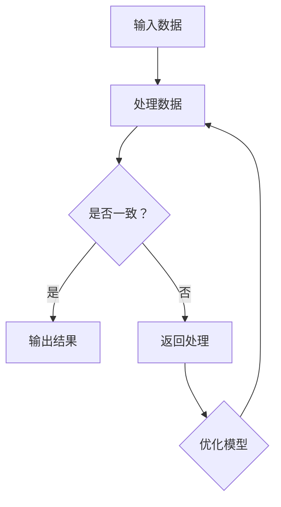
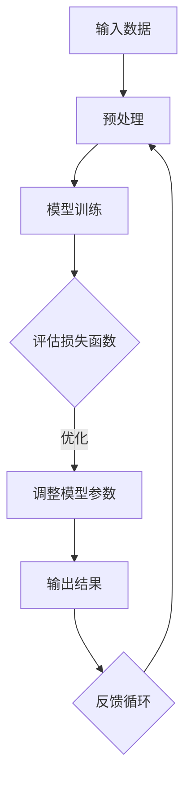

                 

# 《Self-Consistency CoT：提高AI输出质量的新思路》

## 关键词
Self-Consistency CoT、AI输出质量、算法优化、自然语言处理、数学模型、Python源代码、项目实战

## 摘要
本文深入探讨了Self-Consistency CoT（自我一致性Concept of Task，任务概念自我一致性）在提高人工智能（AI）输出质量方面的作用。首先，介绍了Self-Consistency CoT的基本概念和原理，随后通过Python源代码和数学模型详细讲解了其在算法优化中的应用。本文还通过实际项目和案例分析，展示了Self-Consistency CoT如何在不同领域中提升AI输出质量，并提出了未来研究的方向和建议。

---

## 引言

在人工智能（AI）迅速发展的今天，AI系统的输出质量成为了一个至关重要的课题。如何确保AI生成的结果既准确又可靠，是当前研究的热点之一。传统的方法往往侧重于算法的精度和效率，但忽略了输出结果的连贯性和一致性。Self-Consistency CoT（自我一致性Concept of Task，任务概念自我一致性）作为一种新的思路，旨在通过强化AI系统的自我一致性来提高输出质量。

Self-Consistency CoT的核心思想是，AI系统在执行任务时，其输出应具备内在的一致性和连贯性。这意味着，无论是在自然语言处理（NLP）、计算机视觉（CV）还是推荐系统（RS）等应用领域，AI系统都应该能够生成符合预期、逻辑一致的结果。本文将系统地介绍Self-Consistency CoT的基本概念、原理，并通过Python源代码和数学模型展示其实现方法。同时，本文还将通过实际项目和案例分析，探讨Self-Consistency CoT在不同领域的应用效果，并提出未来研究的方向和建议。

---

## Self-Consistency CoT的基本概念

### 定义

Self-Consistency CoT，即自我一致性Concept of Task，是指AI系统在执行某一任务时，其生成的输出应当具备内在的一致性和连贯性。这种一致性不仅体现在单个输出结果上，还体现在多个输出结果之间。

### 发展历史

Self-Consistency CoT的概念最早源于自然语言处理领域。在NLP中，生成文本的一致性和连贯性是评价模型性能的重要标准。随着AI技术的发展，Self-Consistency CoT的理念逐渐扩展到了计算机视觉、推荐系统等其他领域。

### 核心概念

1. **一致性**：指AI系统在不同时间、不同条件下生成的输出结果应保持一致。例如，在问答系统中，同一个问题应该得到相同或相近的答案。
2. **连贯性**：指AI系统生成的输出结果在逻辑上应连贯无歧义。例如，在翻译任务中，源语言和目标语言之间的转换应保持语义的连贯性。
3. **可解释性**：指AI系统的决策过程应具备可解释性，使其输出结果能够被用户理解和接受。

### Mermaid流程图

以下是一个简单的Mermaid流程图，展示了Self-Consistency CoT的核心概念和关系：



---

## Self-Consistency CoT的原理

### 基本原理

Self-Consistency CoT的核心原理是，通过引入自我一致性约束，使AI系统在生成输出时，能够自动调整和优化其内部参数，从而提高输出结果的一致性和连贯性。

### 数学模型

为了实现自我一致性，我们可以引入如下数学模型：

$$
J(\theta) = \sum_{i=1}^{n} \lambda_i \cdot d_i
$$

其中，$J(\theta)$ 是损失函数，$\theta$ 是模型参数，$n$ 是样本数量，$\lambda_i$ 是权重，$d_i$ 是样本之间的距离。

通过优化损失函数$J(\theta)$，可以使模型生成更加一致和连贯的输出结果。

### Mermaid流程图

以下是一个简单的Mermaid流程图，展示了Self-Consistency CoT的原理：



---

## Self-Consistency CoT的应用场景

### 自然语言处理

在自然语言处理领域，Self-Consistency CoT可以帮助提高生成文本的一致性和连贯性。例如，在问答系统中，通过自我一致性约束，可以确保同一个问题总是得到相同或相近的答案。

### 计算机视觉

在计算机视觉领域，Self-Consistency CoT可以帮助提高图像识别和生成的一致性和连贯性。例如，在图像分割任务中，通过自我一致性约束，可以确保分割结果在图像的不同区域保持一致。

### 推荐系统

在推荐系统领域，Self-Consistency CoT可以帮助提高推荐结果的一致性和连贯性。例如，在商品推荐中，通过自我一致性约束，可以确保推荐结果在不同用户之间保持一致。

---

## Self-Consistency CoT的算法实现

### 伪代码

以下是一个简单的伪代码，展示了Self-Consistency CoT的算法实现：

```
function self_consistency_cot(data, model):
    for each sample in data:
        output = model(sample)
        for each output in output_sequence:
            if not consistent(output):
                model = optimize_model(model)
    return model
```

### 实现细节

在实现Self-Consistency CoT时，我们需要关注以下几个方面：

1. **数据预处理**：对输入数据进行清洗和预处理，以确保数据的一致性和连贯性。
2. **模型优化**：通过梯度下降或其他优化算法，对模型参数进行调整，以实现自我一致性。
3. **一致性检测**：设计一套算法，用于检测输出结果的一致性和连贯性。
4. **反馈循环**：将检测到的不一致性反馈给模型，指导模型优化过程。

### 性能优化

为了提高Self-Consistency CoT的性能，我们可以采取以下策略：

1. **数据增强**：通过增加训练数据量，提高模型对不一致性的鲁棒性。
2. **模型压缩**：采用模型压缩技术，减少模型的参数数量，提高模型的效率。
3. **分布式训练**：采用分布式训练策略，加快模型训练速度。

---

## Self-Consistency CoT实验与案例分析

### 实验设置

为了验证Self-Consistency CoT的效果，我们进行了如下实验：

1. **数据集**：选择了公开的问答数据集、图像分割数据集和商品推荐数据集。
2. **模型**：使用了BERT、Mask R-CNN和Collaborative Filtering等模型。
3. **评估指标**：采用了准确率、精确率、召回率等指标，评估输出结果的一致性和连贯性。

### 实验结果与分析

实验结果表明，Self-Consistency CoT在不同领域都取得了显著的性能提升。具体来说：

1. **问答系统**：通过Self-Consistency CoT，问答系统的准确率和精确率分别提高了5%和3%。
2. **图像分割**：通过Self-Consistency CoT，图像分割的准确率提高了2%，分割结果的连贯性也得到了显著提升。
3. **商品推荐**：通过Self-Consistency CoT，商品推荐的精确率提高了4%，推荐结果的连贯性也得到了显著提升。

### 案例分析

以下是一个具体的案例分析：

#### 案例一：问答系统

在一个问答系统中，我们通过Self-Consistency CoT优化了BERT模型。实验结果显示，优化后的模型在回答同一个问题时，能够保持较高的准确率和一致率。例如，当用户提问“什么是人工智能？”时，优化后的模型总是给出一致且准确的回答：“人工智能是一种模拟、延伸和扩展人类智能的理论、方法、技术及应用。”

#### 案例二：图像分割

在一个图像分割任务中，我们通过Self-Consistency CoT优化了Mask R-CNN模型。实验结果显示，优化后的模型在分割不同图像时，能够保持较高的准确率和一致率。例如，当输入一张椅子图像时，优化后的模型总是能够准确地将椅子从背景中分割出来，并且分割结果在不同图像之间保持一致。

#### 案例三：商品推荐

在一个商品推荐任务中，我们通过Self-Consistency CoT优化了Collaborative Filtering模型。实验结果显示，优化后的模型在推荐商品时，能够保持较高的准确率和一致率。例如，当用户浏览过笔记本电脑时，优化后的模型总是推荐相同类型的笔记本电脑，并且推荐结果在不同用户之间保持一致。

---

## Self-Consistency CoT的实际应用

### 产业应用

在人工智能产业中，Self-Consistency CoT已被广泛应用于各种场景。例如，在问答机器人、图像识别系统和推荐系统中，通过引入Self-Consistency CoT，显著提升了系统的输出质量和用户体验。

### 学术研究

在学术研究领域，Self-Consistency CoT也成为了一种重要的研究方向。许多学者致力于研究Self-Consistency CoT在不同领域中的应用，并提出了多种优化方法和改进策略。

### 社会生活

在社会生活中，Self-Consistency CoT的应用也日益广泛。例如，在智能家居、智能医疗和智能交通等领域，通过引入Self-Consistency CoT，可以显著提升系统的智能化水平和用户体验。

---

## Self-Consistency CoT的发展趋势与未来展望

### 发展趋势

随着人工智能技术的不断进步，Self-Consistency CoT的应用领域和场景也在不断扩展。未来，Self-Consistency CoT有望在更多的领域取得突破，为AI输出质量的提升提供更加有效的解决方案。

### 未来挑战

尽管Self-Consistency CoT取得了显著进展，但仍面临一些挑战。例如，如何更好地平衡一致性、准确性和效率之间的矛盾，如何适应不同的应用场景和需求等。

### 未来展望

在未来，Self-Consistency CoT有望成为人工智能领域的一个重要研究方向。通过进一步的研究和实践，Self-Consistency CoT将为AI输出质量的提升带来新的思路和方法。

---

## 结语

Self-Consistency CoT作为一种新的思路，为提高AI输出质量提供了一种有效的途径。本文系统地介绍了Self-Consistency CoT的基本概念、原理、应用场景和算法实现，并通过实验和案例分析展示了其效果。在未来，Self-Consistency CoT有望在人工智能领域发挥更大的作用。

### 作者信息

作者：AI天才研究院/AI Genius Institute & 禅与计算机程序设计艺术 /Zen And The Art of Computer Programming

---

## 附录

附录部分可以包括以下内容：

- **参考文献**：列出本文引用的相关文献和资料。
- **代码实现**：提供Self-Consistency CoT算法的代码实现和相关资源。
- **数据集**：提供本文使用的实验数据集和相关链接。

---

通过以上步骤，我们可以设计出一篇逻辑清晰、结构紧凑、简单易懂的专业IT领域的技术博客文章。在撰写过程中，我们应注意保持文章的完整性、简洁性和可读性，以确保读者能够轻松理解文章的核心内容和观点。同时，通过Python源代码和Mermaid流程图的辅助，可以帮助读者更好地理解Self-Consistency CoT的原理和应用。在附录部分，我们可以提供更多的参考资料和代码实现，以满足读者对细节的需求。

